# Data模块详细说明

## 目录

1. [模块概述](#模块概述)
2. [数据结构](#数据结构)
3. [核心变量](#核心变量)
4. [初始化阶段](#初始化阶段)
5. [配方查找阶段](#配方查找阶段)
6. [设备配置阶段](#设备配置阶段)
7. [增产剂计算阶段](#增产剂计算阶段)
8. [需求计算阶段](#需求计算阶段)
9. [结果优化阶段](#结果优化阶段)
10. [蓝图生成阶段](#蓝图生成阶段)
11. [设置管理阶段](#设置管理阶段)
12. [Vue应用阶段](#vue应用阶段)
13. [完整流程图](#完整流程图)
14. [关键常量速查](#关键常量速查)

---

## 模块概述

Data模块是整个生产计算系统的核心数据层，负责管理游戏内所有配方数据、设备参数、能量消耗、空间占用等关键信息。

### 主要职责

| 职责           | 说明                       |
| -------------- | -------------------------- |
| 配方数据管理   | 存储、索引、查找配方       |
| 设备参数管理   | 能量、速度、空间参数       |
| 增产剂计算     | 增产/加速效果计算          |
| 需求递归计算   | 递归计算原料需求           |
| 结果优化       | 多产物配方优化             |
| 蓝图生成       | 提取配方数据供蓝图模块使用 |
| 用户设置持久化 | localStorage存储           |

### 文件位置

`d:\WorkSpace\DSQ\Scripts\data.js`

---

## 数据结构

### 配方数据结构

```javascript
var data = [
  {
    s: [
      {
        // s: 产物数组（可能多产物）
        name: '产物名称', // 产物名称
        n: 1 // 数量（默认为1）
      }
    ],
    q: [
      {
        // q: 需求产物数组
        name: '原料名称', // 原料名称
        n: 1 // 需求数量
      }
    ],
    t: 1, // t: 生产时间（秒）
    m: '生产设备', // m: 生产设备类型（字符串，需转换）
    group: '分组名称', // group: 产物分组
    noExtra: true // noExtra: 增产剂效果标志
  }
]
```

### noExtra字段说明

| 值             | 含义             | 示例         |
| -------------- | ---------------- | ------------ |
| `false` (默认) | 加速/增产均可    | 普通配方     |
| `true`         | 仅加速，不可增产 | 分馏塔制重氢 |
| `null`         | 无效果           | 能量枢纽充能 |

### 能量消耗数据

```javascript
var energyData = {}
energyData['研究站'] = 0.48 // MW
energyData['制作台Mk.Ⅰ'] = 0.27 // MW
energyData['制作台Mk.Ⅱ'] = 0.54 // MW
energyData['制作台Mk.Ⅲ'] = 1.08 // MW
energyData['重组式制造台'] = 2.7 // MW
energyData['电弧熔炉'] = 0.36 // MW
energyData['位面熔炉'] = 1.44 // MW
energyData['负熵熔炉'] = 2.88 // MW
energyData['粒子对撞机'] = 12 // MW
```

### 空间占用数据

```javascript
var spaceData = {}
spaceData['研究站'] = 36 / 15 // 可叠加
spaceData['制作台Mk.Ⅰ'] = 16 // 所有制作台相同
spaceData['电弧熔炉'] = 16 // 所有熔炉相同
spaceData['原油精炼机'] = 28
spaceData['化工厂'] = 35
```

---

## 核心变量

### 配方索引变量

```javascript
var recipeIndexByProduct = {} // 产物名 → [配方索引数组]
var recipeIndexByMaterial = {} // 原料名 → [配方索引数组]
```

### 用户设置变量

```javascript
var settings = {} // 持久化设置（存储到localStorage）
var settingsLocal = {} // 临时设置（不存储）
var settings_time = {} // 设备速度设置
var settings_pf = {} // 配方选择设置
var projects = [] // 项目列表
```

### 计算过程变量

```javascript
var currentItem = null // 当前选中物品
var xqs = [] // 需求列表 [{item, number}]
var singleMake = [] // 独立生产列表 [{id, number}]
var xh_list = [] // 需求计算结果列表
var out_list = [] // 多余产出列表
var ig_names = [] // 忽略物品列表
```

### 其他关键变量

```javascript
var defaultAccType = '增产剂Mk.Ⅰ' // 默认增产剂类型
var defaultAccValue = '无' // 默认增产剂效果
var version = '20240202' // 版本号（缓存控制）
var pointLength = 3 // 数字保留小数位数
```

---

## 初始化阶段

### 4.1 页面加载流程

**代码位置**: `data.js` L4536-4563

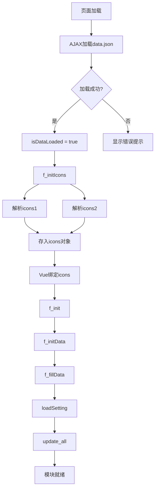

#### 4.1.1 AJAX数据加载核心逻辑

**代码位置**: `data.js` L4520-4545

```javascript
$(function () {
  $.ajax({
    url: './Scripts/data.json?v' + version, // 版本号控制缓存
    dataType: 'json',
    timeout: 1000000,
    success: function (data) {
      game_data = data // 存储游戏数据
      isDataLoaded = true // 设置加载完成标志
      f_initIcons() // 初始化图标系统
    },
    error: function () {
      alert('游戏资源加载失败，图标将无法显示正常，请刷新再试')
    }
  })
  f_init() // 同步初始化Vue应用
})
```

**核心细节说明**：
| 步骤 | 说明 | 关键点 |
|------|------|--------|
| AJAX请求 | 异步加载图标资源 | 使用version参数防止缓存 |
| 加载标志 | `isDataLoaded`控制后续操作 | 防止未加载完成时触发图标选择 |
| 错误处理 | 提示用户刷新页面 | 保证用户体验 |

### 4.2 f_initData() 详细流程

**代码位置**: `data.js` L4252-4360

#### 4.2.1 完整初始化逻辑

```javascript
function f_initData() {
  // Step 1: 清空索引（防止重复初始化）
  recipeIndexByProduct = {}
  recipeIndexByMaterial = {}

  // Step 2: 遍历data数组构建索引
  $(data).each(function (i, item) {
    // Step 2.1: 设置配方ID（用于持久化配置关联）
    item.id = i

    // Step 2.2: 构建产物索引（支持多产物配方）
    for (var j = 0; j < item.s.length; j++) {
      var productName = item.s[j].name
      if (!recipeIndexByProduct[productName]) {
        recipeIndexByProduct[productName] = []
      }
      recipeIndexByProduct[productName].push(i)
    }

    // Step 2.3: 构建原料索引（用于反向查找）
    if (item.q) {
      for (var j = 0; j < item.q.length; j++) {
        var materialName = item.q[j].name
        if (!recipeIndexByMaterial[materialName]) {
          recipeIndexByMaterial[materialName] = []
        }
        recipeIndexByMaterial[materialName].push(i)
      }
    }

    // Step 2.4: 设备映射转换（字符串 → 设备数组）
    item.mName = item.m // 保留原始设备类型名
    item.m = convertMachineType(item.m) // 转换为设备数组
  })
}
```

#### 4.2.2 索引构建流程图

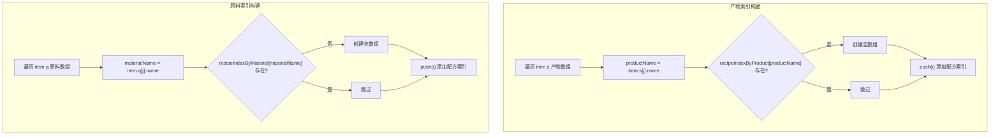

**索引数据结构示例**：

```javascript
// 产物索引示例
recipeIndexByProduct = {
  铁块: [21, 22], // 铁块有2个配方
  氢: [32, 33, 34, 75], // 氢有4个配方
  重氢: [31, 66, 74] // 重氢有3个配方
}

// 原料索引示例
recipeIndexByMaterial = {
  铁矿: [21, 26, 27], // 使用铁矿的配方
  氢: [33, 34, 66, 75] // 使用氢的配方
}
```

### 4.3 设备映射转换规则

**代码位置**: `data.js` L4285-4340

#### 4.3.1 完整设备映射表

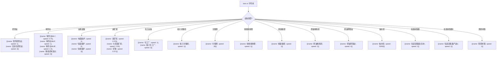

#### 4.3.2 设备速度计算说明

| 设备类型   | 速度计算        | 说明             |
| ---------- | --------------- | ---------------- |
| 采矿机     | 0.5 × 6 = 3     | 按6个矿脉计算    |
| 大型采矿机 | 1 × 20 = 20     | 按20个矿脉计算   |
| 矿脉       | 0.5 × 1 = 0.5   | 单矿脉，最高30   |
| 抽水机     | 50 / 60 ≈ 0.833 | 每秒50单位       |
| 分馏塔     | 30              | 每分钟处理30单位 |

### 4.4 f_initIcons() 图标初始化

**代码位置**: `data.js` L6074-6185

#### 4.4.1 图标解析核心逻辑

```javascript
function f_initIcons() {
  var reg = /^(\d)-(\d{1,2})-(.*)+/ // 正则：行-列-名称

  // 处理icons1（组件图标）
  for (var i = 0; i < game_data.icons1.length; i++) {
    var icon = game_data.icons1[i]
    if (reg.test(icon.name)) {
      var x = icon.name.match(reg)
      icons[x[3]] = icon.value // 提取物品名作为key
    } else {
      icons[icon.name] = icon.value
    }
  }

  // 处理icons2（建筑图标）
  for (var i = 0; i < game_data.icons2.length; i++) {
    var icon = game_data.icons2[i]
    if (reg.test(icon.name)) {
      var x = icon.name.match(reg)
      icons[x[3]] = icon.value
    } else {
      icons[icon.name] = icon.value
    }
  }

  // 冻结对象，防止Vue响应式监听（性能优化）
  app.icons = Object.freeze(icons)
}
```

#### 4.4.2 图标选择器UI构建

```javascript
// 构建图标网格（9行 × 14列）
for (var i = 0; i < 9; i++) {
  var jrow = $("<div class='iconrow'></div>").appendTo(jicons)
  for (var j = 0; j < 14; j++) {
    var jicon = $("<div class='icon'><div class='s'></div></div>").appendTo(jrow)
    jicon.click(function () {
      var name = $(this).attr('data-name')
      if (!name) return
      f_add3(name) // 添加物品到需求列表
    })
  }
}
```

**图标定义映射表**：

```javascript
var icons_define = {
  氢: [-1, 3, 7, '氢'], // [-1, 行, 列, 名称]
  可燃冰: [-1, 2, 7, '可燃冰']
}
```

### 4.5 f_init() Vue应用初始化

**代码位置**: `data.js` L4760-4920

#### 4.5.1 Vue实例核心结构

```javascript
function f_init() {
  app = new Vue({
    el: '#result',
    data: {
      totalEnergy: 0, // 总能耗
      totalSpace: 0, // 总空间
      totalAcc: 0, // 总增产剂消耗
      total: [], // 设备统计
      xqs: [], // 需求列表
      icons: icons, // 图标数据
      items: [], // 生产项列表
      items2: [], // 多余产出列表
      items0: [], // 独立生产列表
      ig_names: [], // 忽略物品列表
      xps_editor_index: -1, // 编辑器索引
      xps_editor_number: 0, // 编辑器数值
      items_editor_index: -1,
      items_editor_number: 0
    },
    methods: {
      // 速度变更处理
      speedChange: function (item) {
        settings_time[item.machineName] = parseFloat(item.speed)
        saveSettingTime()
        update_all()
      },

      // 点击数量进入编辑模式
      onClickNumber: function (index) {
        this.xps_editor_index = index
        this.xps_editor_number = this.xqs[index].number
        Vue.nextTick(() => {
          this.$refs.input[0].focus()
        })
      },

      // 提交编辑数值
      submitEditorNumber: function () {
        if (this.xps_editor_number > 0) {
          this.xqs[this.xps_editor_index].number = this.xps_editor_number
          update_all()
        }
        this.xps_editor_index = -1
      },

      // 删除需求项
      removeItem: function (index) {
        this.xqs.splice(index, 1)
        update_all()
      }
    },
    computed: {
      // 格式化显示数据
      totalDisplay: function () {
        return this.total.map(function (item) {
          return {
            name: item.name,
            value: item.value,
            energy: item.energy ? item.energy.toFixed(2) : '0.00',
            space: item.space ? Math.round(item.space) : 0
          }
        })
      }
    }
  })
}
```

#### 4.5.2 初始化调用链

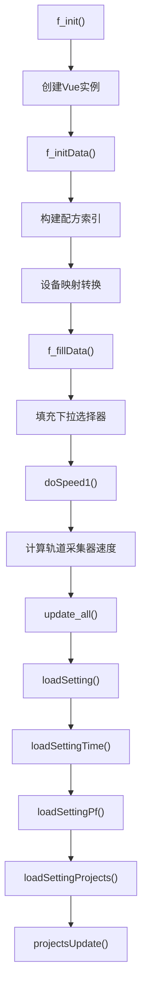

### 4.6 f_fillData() 数据填充

**代码位置**: `data.js` L4545-4565

```javascript
function f_fillData() {
  var names = []

  // 按分组填充下拉选择器
  $(getGroup()).each(function (i, group) {
    var jgroup = $("<optgroup label='" + group + "'></optgroup>")
    $(data).each(function (i, item) {
      if (item.group == group) {
        for (var j = 0; j < item.s.length; j++) {
          // 去重：同一产物只添加一次
          if ($.inArray(item.s[j].name, names) == -1) {
            names.push(item.s[j].name)
            jgroup.append("<option value='" + item.s[j].name + "'>" + item.s[j].name + '</option>')
          }
        }
      }
    })
    $('#seldata').append(jgroup)
  })
}
```

**分组数据结构**：
| 分组 | 示例物品 |
|------|----------|
| 产品 | 宇宙矩阵、蓝矩阵、红矩阵 |
| 组件 | 铁块、钢材、电路板 |
| 消耗品 | 空间翘曲器、太阳帆 |
| 建筑 | 制作台、电弧熔炉 |

---

## 配方查找阶段

### 5.1 find() 函数详细流程

**代码位置**: `data.js` L4694-4756

#### 5.1.1 完整查找逻辑

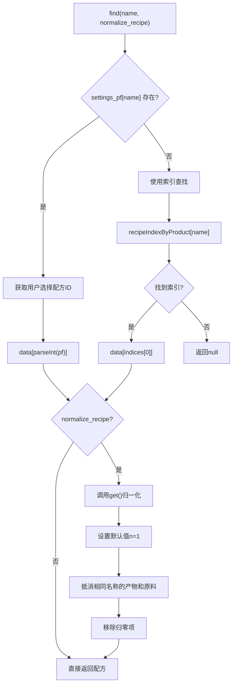

#### 5.1.2 核心代码实现

```javascript
function find(name, normalize_recipe) {
  // 内部函数：处理配方归一化
  function get(item) {
    var o = $.extend(true, {}, item) // 深拷贝，避免修改原数据

    if (normalize_recipe) {
      // Step 1: 设置默认值为1
      for (var i = 0; i < o.s.length; i++) {
        o.s[i].n = o.s[i].n || 1
      }
      for (var i = 0; i < o.q.length; i++) {
        o.q[i].n = o.q[i].n || 1
      }

      // Step 2: 抵消相同组件（产物和原料同名时）
      for (var i = 0; i < o.s.length; i++) {
        var s_name = o.s[i].name
        for (var j = 0; j < o.q.length; j++) {
          if (s_name == o.q[j].name) {
            var to_cancel = Math.min(o.s[i].n, o.q[j].n)
            o.s[i].n -= to_cancel
            o.q[j].n -= to_cancel
          }
        }
      }

      // Step 3: 移除归零项
      var o_s = o.s
      o.s = []
      for (var i = 0; i < o_s.length; i++) {
        if (o_s[i].n === 0) continue
        o.s.push(o_s[i])
      }
      var o_q = o.q
      o.q = []
      for (var i = 0; i < o_q.length; i++) {
        if (o_q[i].n === 0) continue
        o.q.push(o_q[i])
      }
    }

    // Step 4: 找到目标产物并合并属性
    for (var j = 0; j < o.s.length; j++) {
      if (o.s[j].name == name) {
        $.extend(o, o.s[j]) // 合并产物的n属性到配方对象
        return o
      }
    }

    // 异常处理：分馏塔特殊情况
    cocoMessage.warning('重氢分馏塔无法用于生产氢气。', 3000)
    throw new Error('配方错误！可能是因为该配方净输出为负。')
  }

  // 优先使用用户选择的配方
  var pf = settings_pf[name]
  if (pf) {
    return get(data[parseInt(pf)])
  }

  // 使用索引查找（O(1)复杂度）
  var indices = recipeIndexByProduct[name]
  if (indices && indices.length > 0) {
    return get(data[indices[0]])
  }
}
```

#### 5.1.3 归一化示例

**原始配方**：

```javascript
{
  s: [{ name: "氢", n: 0.99 }, { name: "重氢", n: 0.01 }],
  q: [{ name: "氢", n: 1 }],
  t: 1
}
```

**归一化后（查找"重氢"）**：

```javascript
{
  s: [{ name: "重氢", n: 0.01 }],  // 氢被抵消
  q: [{ name: "氢", n: 0.01 }],    // 1 - 0.99 = 0.01
  t: 1,
  name: "重氢",
  n: 0.01
}
```

### 5.2 配方归一化逻辑

#### 5.2.1 归一化流程图

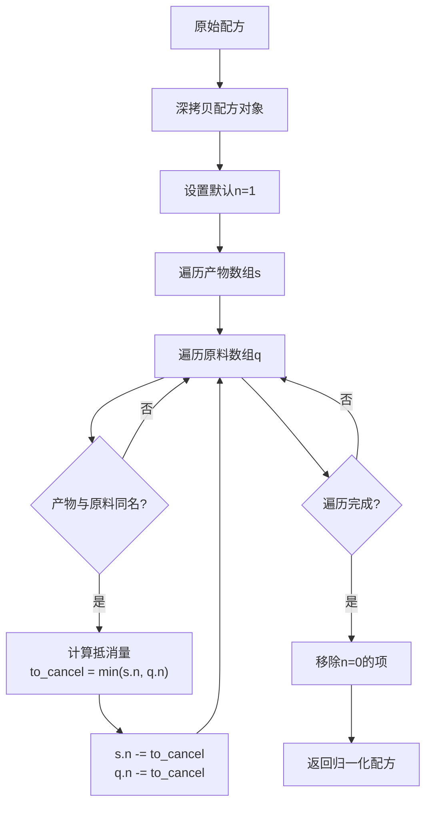

#### 5.2.2 归一化核心作用

| 场景     | 说明           | 示例                                             |
| -------- | -------------- | ------------------------------------------------ |
| 分馏塔   | 氢→重氢(1%)    | 消耗1氢产出0.01重氢+0.99氢，归一化后净消耗0.01氢 |
| 循环配方 | 产物包含原料   | 避免重复计算                                     |
| 需求计算 | 精确计算净需求 | 确保原料需求准确                                 |

### 5.3 getPfs() 和 getPfsByQ()

**代码位置**: `data.js` L4565-4583

#### 5.3.1 根据产物名查找所有配方

```javascript
function getPfs(name) {
  var pfs = []
  var indices = recipeIndexByProduct[name] || []
  for (var i = 0; i < indices.length; i++) {
    var pf = $.extend(true, {}, data[indices[i]]) // 深拷贝
    pfs.push(pf)
  }
  return pfs
}
```

#### 5.3.2 根据原料名查找所有配方

```javascript
function getPfsByQ(name) {
  var pfs = []
  var indices = recipeIndexByMaterial[name] || []
  for (var i = 0; i < indices.length; i++) {
    var pf = $.extend(true, {}, data[indices[i]])
    pfs.push(pf)
  }
  return pfs
}
```

#### 5.3.3 使用场景对比

| 函数              | 用途                       | 返回值   |
| ----------------- | -------------------------- | -------- |
| `getPfs(name)`    | 查找能生产某物品的所有配方 | 配方数组 |
| `getPfsByQ(name)` | 查找使用某原料的所有配方   | 配方数组 |
| `find(name)`      | 获取当前选择的配方         | 单个配方 |

### 5.4 配方选择功能

**代码位置**: `data.js` L5886-5900

```javascript
function selectPf(name, value) {
  let old_settings_pf = $.extend(true, {}, settings_pf) // 备份
  try {
    settings_pf[name] = parseInt(value) // 设置新配方ID
    update_all() // 重新计算
  } catch (e) {
    settings_pf = old_settings_pf // 回滚
    update_all()
    if (e.name == 'RangeError') {
      cocoMessage.warning(
        '无法切换到X射线裂解(制氢)/重整精炼(制精炼油)公式？请尝试先将对应的另一条默认公式切换为其他公式。',
        6000
      )
    }
    throw e
  }
  saveSettingPf() // 持久化
}
```

---

## 设备配置阶段

### 6.1 getMachine() 设备获取流程

**代码位置**: `data.js` L4417-4428

#### 6.1.1 完整设备获取逻辑

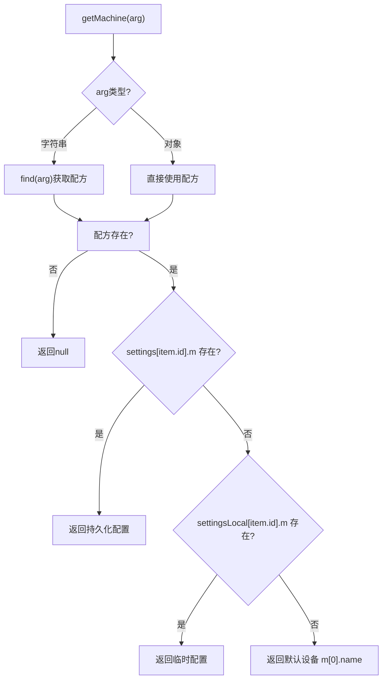

#### 6.1.2 核心代码实现

```javascript
function getMachine(arg) {
  var item = typeof arg == 'string' ? find(arg) : arg
  if (!item) return null

  // 优先级1：持久化设置
  var machine = (settings[item.id] || {}).m || null
  if (machine != null) return machine

  // 优先级2：临时设置
  machine = (settingsLocal[item.id] || {}).m || null
  if (machine != null) return machine

  // 优先级3：默认设备
  return item.m[0].name
}

// 获取增产剂类型（同理）
function getAccType(arg) {
  var item = typeof arg == 'string' ? find(arg) : arg
  if (!item) return null
  var accType = (settings[item.id] || {}).accType || null
  if (accType != null) return accType
  accType = (settingsLocal[item.id] || {}).accType || null
  if (accType != null) return accType
  return null
}

// 获取增产剂效果（同理）
function getAccValue(arg) {
  var item = typeof arg == 'string' ? find(arg) : arg
  if (!item) return null
  var accValue = (settings[item.id] || {}).accValue || null
  if (accValue != null) return accValue
  accValue = (settingsLocal[item.id] || {}).accValue || null
  if (accValue != null) return accValue
  return null
}
```

#### 6.1.3 配置优先级说明

| 优先级 | 来源                     | 说明                           |
| ------ | ------------------------ | ------------------------------ |
| 1      | `settings[item.id]`      | 持久化配置，存储在localStorage |
| 2      | `settingsLocal[item.id]` | 临时配置，页面刷新后丢失       |
| 3      | `item.m[0].name`         | 默认设备，配方定义的第一个设备 |

### 6.2 getValue() 详细流程

**代码位置**: `data.js` L4453-4523

#### 6.2.1 完整值获取逻辑

```javascript
function getValue(arg) {
  var item = typeof arg == 'string' ? find(arg) : arg
  if (!item) return null

  var machine = getMachine(item)
  var accType = getAccType(item)
  var accValue = getAccValue(item)
  var speed = settings_time[machine] // 用户自定义速度

  // 优先使用用户自定义速度
  if (speed) {
    return {
      name: machine,
      t: item.t, // 原始生产时间
      speed: speed, // 用户自定义速度
      time: item.t / speed, // 实际生产时间
      isChange: true, // 标记为自定义速度
      accType: accType,
      accValue: accValue
    }
  }

  // 从设备列表查找匹配的设备
  for (var i = 0; i < item.m.length; i++) {
    var m = item.m[i]
    if (m.name == machine) {
      return {
        name: m.name,
        t: item.t,
        speed: m.speed, // 设备固有速度
        time: item.t / m.speed, // 实际生产时间
        accType: accType,
        accValue: accValue
      }
    }
  }

  // 返回默认设备
  m = item.m[0]
  return {
    name: m.name,
    t: item.t,
    speed: m.speed,
    time: item.t / m.speed,
    accType: accType,
    accValue: accValue
  }
}
```

#### 6.2.2 返回值结构说明

```javascript
{
  name: "制作台Mk.Ⅲ",    // 设备名称
  t: 1,                  // 配方原始时间（秒）
  speed: 1.5,            // 设备速度倍率
  time: 0.667,           // 实际生产时间 = t / speed
  isChange: false,       // 是否用户自定义速度
  accType: "增产剂Mk.Ⅰ", // 增产剂类型
  accValue: "加速"       // 增产剂效果
}
```

#### 6.2.3 设备选择交互

**代码位置**: `data.js` L5868-5874

```javascript
function selectM(id, m) {
  settings[id] = settings[id] || {}
  settings[id].m = m // 设置设备
  saveSetting() // 持久化
  update_all() // 重新计算
}
```

---

## 增产剂计算阶段

### 7.1 getAccSpeed() 增产剂效率

**代码位置**: `data.js` L4616-4626

#### 7.1.1 效率计算核心逻辑

```javascript
function getAccSpeed(type, value) {
  // 非增产/加速模式返回1
  if (['增产', '加速'].indexOf(value) === -1) {
    return 1
  }

  // 增产剂效率表
  var accSpeed = {
    inc: [1.125, 1.2, 1.25], // 增产效率: Mk.Ⅰ(+12.5%), Mk.Ⅱ(+20%), Mk.Ⅲ(+25%)
    acc: [1.25, 1.5, 2] // 加速效率: Mk.Ⅰ(+25%), Mk.Ⅱ(+50%), Mk.Ⅲ(+100%)
  }

  // 获取增产剂等级索引
  var type_index = ['增产剂Mk.Ⅰ', '增产剂Mk.Ⅱ', '增产剂Mk.Ⅲ'].indexOf(type)
  type_index = type_index >= 0 ? type_index : 0

  // 根据效果类型返回对应效率
  return value == '增产' ? accSpeed.inc[type_index] : accSpeed.acc[type_index]
}
```

#### 7.1.2 增产剂效率对照表

```mermaid
graph LR
    subgraph Mk.Ⅰ
        A1["增产: ×1.125<br/>(+12.5%)"]
        B1["加速: ×1.25<br/>(+25%)"]
    end

    subgraph Mk.Ⅱ
        A2["增产: ×1.2<br/>(+20%)"]
        B2["加速: ×1.5<br/>(+50%)"]
    end

    subgraph Mk.Ⅲ
        A3["增产: ×1.25<br/>(+25%)"]
        B3["加速: ×2<br/>(+100%)"]
    end
```

#### 7.1.3 效率应用场景

| 效果类型 | 应用场景     | 计算方式        |
| -------- | ------------ | --------------- |
| 增产     | 增加产物数量 | 设备数量 ÷ 效率 |
| 加速     | 加快生产速度 | 设备数量 ÷ 效率 |

### 7.2 增产剂消耗计算

**代码位置**: `data.js` L5380-5400

#### 7.2.1 消耗计算核心逻辑

```javascript
// 增产剂参数
var v = 1,
  tm = 0
if (accType == '增产剂Mk.Ⅰ') ((v = 1.125), (tm = 12))
else if (accType == '增产剂Mk.Ⅱ') ((v = 1.2), (tm = 24))
else if (accType == '增产剂Mk.Ⅲ') ((v = 1.25), (tm = 60))

// 自喷涂修正：减少消耗
if ($('#selfAcc')[0].checked) tm = tm * v - 1

// 根据效果类型计算
if (accValue == '加速') {
  accTotal += r / tm // 增产剂消耗
  if (!$('#isAddSelfAccP').get(0).checked) {
    loadNumber(accType, r / tm) // 递归计算增产剂需求
  }
} else if (accValue == '增产') {
  r /= v // 原料需求减少
  accTotal += r / tm
  if (!$('#isAddSelfAccP').get(0).checked) {
    loadNumber(accType, r / tm)
  }
}
```

#### 7.2.2 增产剂消耗参数表

| 增产剂类型 | v（增产倍率） | tm（基础消耗） | 自喷涂后消耗 |
| ---------- | ------------- | -------------- | ------------ |
| Mk.Ⅰ       | 1.125         | 12             | 12.5         |
| Mk.Ⅱ       | 1.2           | 24             | 27.8         |
| Mk.Ⅲ       | 1.25          | 60             | 74           |

#### 7.2.3 消耗计算公式

```
增产剂消耗 = 原料需求量 / tm

自喷涂修正后：
tm = tm × v - 1
```

### 7.3 noExtra字段处理

#### 7.3.1 处理逻辑

```javascript
// 检查增产剂效果限制
if (accValue == '增产' && item.noExtra) accValue = '无' // 不允许增产
if (item.q.length == 0 || item.noExtra === null) accValue = '无' // 无原料或无效果
```

#### 7.3.2 noExtra值含义

| 值             | 含义   | 允许的效果       | 示例         |
| -------------- | ------ | ---------------- | ------------ |
| `false`/未定义 | 默认   | 加速/增产均可    | 普通配方     |
| `true`         | 仅加速 | 仅加速，不可增产 | 分馏塔制重氢 |
| `null`         | 无效果 | 不使用增产剂     | 能量枢纽充能 |

---

## 需求计算阶段

### 8.1 loadNumber() 核心递归函数

**代码位置**: `data.js` L5342-5512

#### 8.1.1 完整递归逻辑

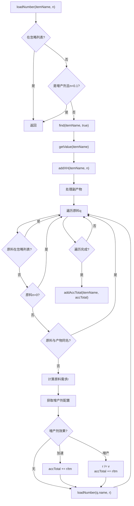

#### 8.1.2 核心代码实现

```javascript
function loadNumber(itemName, n) {
  try {
    // Step 1: 检查忽略列表
    if ($.inArray(itemName, ig_names) != -1) return

    // Step 2: 增产剂微量忽略（防止无限递归）
    if (
      (itemName == '增产剂Mk.Ⅰ' || itemName == '增产剂Mk.Ⅱ' || itemName == '增产剂Mk.Ⅲ') &&
      n < 0.1
    ) {
      return
    }

    // Step 3: 获取配方和设备信息
    var item = find(itemName, true) // 归一化配方
    var info = getValue(itemName)

    // Step 4: 记录需求
    addXH(itemName, n)

    // Step 5: 处理副产物（负需求）
    for (var i = 0; i < item.s.length; i++) {
      if (item.s[i].name != itemName) {
        if (item.s[i].n === 0) continue
        addOut(item.s[i].name, (-1 * n * (item.s[i].n || 1)) / (item.n || 1))
      }
    }

    // Step 6: 获取增产剂配置
    var accType = (settings[item.id] || {}).accType || defaultAccType
    var accValue = (settings[item.id] || {}).accValue || defaultAccValue
    var accTotal = 0

    // Step 7: 递归处理原料
    for (var i = 0; item.q && i < item.q.length; i++) {
      var q = item.q[i]
      if ($.inArray(q.name, ig_names) != -1) continue
      if (q.n === 0) continue

      if (q.name == itemName) {
        // 原料与产物同名，已在归一化中处理
      } else {
        // 计算原料需求
        var r = (n * (q.n || 1)) / (item.n || 1)

        // 增产剂参数
        var v = 1,
          tm = 0
        if (accType == '增产剂Mk.Ⅰ') ((v = 1.125), (tm = 12))
        else if (accType == '增产剂Mk.Ⅱ') ((v = 1.2), (tm = 24))
        else if (accType == '增产剂Mk.Ⅲ') ((v = 1.25), (tm = 60))

        // 自喷涂修正
        if ($('#selfAcc')[0].checked) tm = tm * v - 1

        // 效果限制检查
        if (accValue == '增产' && item.noExtra) accValue = '无'
        if (item.q.length == 0 || item.noExtra === null) accValue = '无'

        // 计算增产剂消耗
        if (accValue == '加速') {
          accTotal += r / tm
          if (!$('#isAddSelfAccP').get(0).checked) {
            loadNumber(accType, r / tm)
          }
        } else if (accValue == '增产') {
          r /= v // 增产时原料需求减少
          accTotal += r / tm
          if (!$('#isAddSelfAccP').get(0).checked) {
            loadNumber(accType, r / tm)
          }
        }

        // 递归计算原料需求
        loadNumber(q.name, r)
      }
    }

    // Step 8: 记录增产剂消耗
    addAccTotal(itemName, accTotal)
  } catch (e) {
    throw e
  }
}
```

### 8.2 辅助函数

**代码位置**: `data.js` L5302-5330

#### 8.2.1 addXH() 添加需求记录

```javascript
function addXH(name, value) {
  // 查找已存在的记录
  for (var i = 0; i < xh_list.length; i++) {
    var item = xh_list[i]
    if (item.name == name) {
      item.value += value // 累加需求
      return
    }
  }
  // 新建记录
  xh_list.push({ name: name, value: value })
}
```

#### 8.2.2 addOut() 添加多余产出记录

```javascript
function addOut(name, value) {
  for (var i = 0; i < out_list.length; i++) {
    var item = out_list[i]
    if (item.name == name) {
      item.value += value // 累加多余产出
      return
    }
  }
  out_list.push({ name: name, value: value })
}
```

#### 8.2.3 addAccTotal() 添加增产剂消耗记录

```javascript
function addAccTotal(name, value) {
  for (var i = 0; i < xh_list.length; i++) {
    var item = xh_list[i]
    if (item.name == name) {
      item.accTotal = (item.accTotal || 0) + value
      return
    }
  }
}
```

#### 8.2.4 findOut() 查找多余产出

```javascript
function findOut(name) {
  for (var i = 0; i < out_list.length; i++) {
    var item = out_list[i]
    if (item.name == name) {
      return item.value
    }
  }
  return null
}
```

### 8.3 需求计算数据流

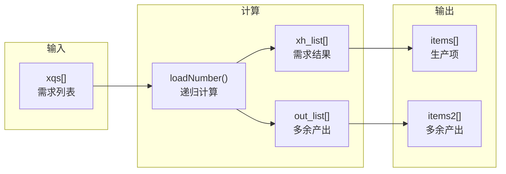

---

## 结果优化阶段

### 9.1 checkResult() 多产物优化

**代码位置**: `data.js` L5472-5512

#### 9.1.1 优化目的

当配方有多个产物时，可能出现所有产物都多余的情况。此时应减少设备数量，避免过度生产。

#### 9.1.2 完整优化逻辑

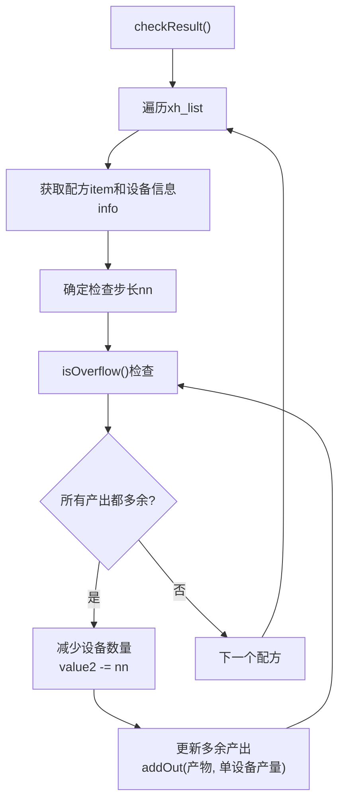

#### 9.1.3 核心代码实现

```javascript
function checkResult() {
  // 判断是否所有产物都多余
  function isOverflow(item, info, nn) {
    for (var j = 0; j < item.s.length; j++) {
      var x = findOut(item.s[j].name)
      if (x == null) return false // 没有多余产出记录

      // 计算单设备产量（每分钟）
      var mn = ((nn * 60) / item.t) * info.speed * (item.s[j].n || 1)

      // 如果多余量小于单设备产量，则不溢出
      if (x > -1 * mn) return false
    }
    return true // 所有产物都多余
  }

  // 遍历所有需求项
  for (var i = 0; i < xh_list.length; i++) {
    var number = xh_list[i].value
    var item = find(xh_list[i].name)
    var info = getValue(item)
    var nn = 1 // 检查步长

    // 设备数量小于1时，使用实际数量作为步长
    if (xh_list[i].value2 < 1) {
      nn = xh_list[i].value2
    }

    // 循环减少设备直到不再溢出
    while (isOverflow(item, info, nn) && xh_list[i].value2 > 0) {
      if (xh_list[i].value2 < 1) {
        nn = xh_list[i].value2
      }

      // 减少设备数量
      xh_list[i].value2 = xh_list[i].value2 - nn

      // 更新多余产出
      for (var j = 0; j < item.s.length; j++) {
        var mn = ((nn * 60) / item.t) * info.speed * (item.s[j].n || 1)
        addOut(item.s[j].name, mn)
      }
    }
  }
}
```

#### 9.1.4 优化示例

**场景**：原油精炼产出氢和精炼油

```
原始计算：
- 氢需求: 60/min
- 精炼油需求: 60/min
- 设备数量: 2台（产出氢120/min，精炼油120/min）

优化后：
- 氢多余: 60/min
- 精炼油多余: 60/min
- 检测到所有产物都多余
- 减少设备到1台
```

### 9.2 isOverflow() 判断逻辑

#### 9.2.1 判断流程

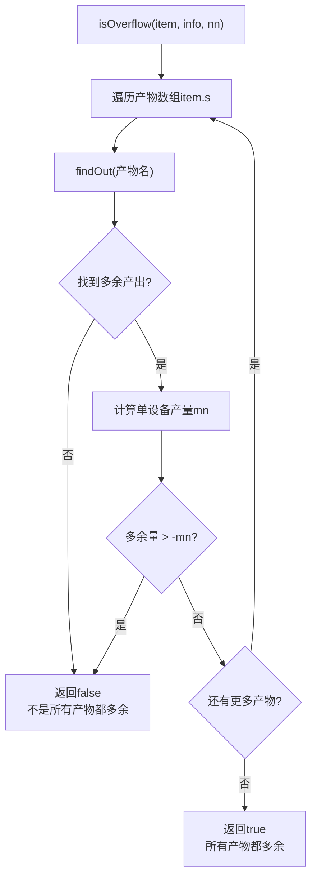

#### 9.2.2 单设备产量计算

```javascript
// 单设备产量（每分钟）
var mn = ((nn * 60) / item.t) * info.speed * (item.s[j].n || 1)

// 计算公式分解：
// nn: 设备数量（步长）
// 60: 每分钟秒数
// item.t: 配方生产时间（秒）
// info.speed: 设备速度倍率
// item.s[j].n: 产物数量
```

### 9.3 fixGzSpeed() 射线接收塔修正

**代码位置**: `data.js` L5513-5555

#### 9.3.1 修正目的

射线接收塔的临界光子产量受增产剂影响，需要动态调整配方参数。

#### 9.3.2 完整修正逻辑

```javascript
function fixGzSpeed() {
  let fixedGzSpeed

  $(data).each(function () {
    if (this.s && this.s[0].name == '临界光子') {
      if (this.m) {
        for (var i = 0; i < this.m.length; i++) {
          if (this.m[i].name == '射线接收塔') {
            for (var j = 0; j < this.q.length; j++) {
              if (this.q[j].name == '引力透镜') {
                // 确定光子产量
                if (manualGzSpeed) {
                  fixedGzSpeed = parseFloat($('#gzSpeed').val())
                } else {
                  item = find('临界光子', true)
                  accType = (settings[item.id] || {}).accType || defaultAccType
                  accValue = (settings[item.id] || {}).accValue || defaultAccValue

                  if (accValue === '加速') {
                    switch (accType) {
                      case '增产剂Mk.Ⅰ':
                        fixedGzSpeed = 15
                        break
                      case '增产剂Mk.Ⅱ':
                        fixedGzSpeed = 18
                        break
                      case '增产剂Mk.Ⅲ':
                        fixedGzSpeed = 24
                        break
                    }
                  } else {
                    fixedGzSpeed = 12 // 默认产量
                  }
                }

                // 修正引力透镜需求
                this.q[j].n = (0.1 / fixedGzSpeed).toFixed(6)
              }
            }

            // 修正生产时间
            this.t = this.q && this.q.length ? 60 / fixedGzSpeed : 10
          }
        }
      }
    }
  })
}
```

#### 9.3.3 光子产量对照表

| 配置             | 光子产量（/min） | 引力透镜需求 |
| ---------------- | ---------------- | ------------ |
| 默认（无增产剂） | 12               | 0.008333     |
| 加速 + Mk.Ⅰ      | 15               | 0.006667     |
| 加速 + Mk.Ⅱ      | 18               | 0.005556     |
| 加速 + Mk.Ⅲ      | 24               | 0.004167     |

### 9.4 update_all() 主更新函数

**代码位置**: `data.js` L5556-5867

#### 9.4.1 完整更新流程

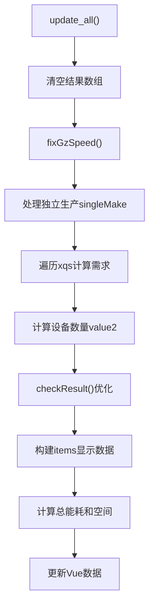

#### 9.4.2 核心计算逻辑

```javascript
function update_all() {
  // Step 1: 清空结果
  xh_list = []
  out_list = []
  single_list = []

  // Step 2: 修正射线接收塔
  fixGzSpeed()

  // Step 3: 处理独立生产
  for (var m = 0; m < singleMake.length; m++) {
    var item = data[singleMake[m].id]
    var info = getValue(item)
    var times = parseFloat(
      ((60 * parseInt(singleMake[m].number) * info.speed) / (item.t || 1)).toFixed(6)
    )

    // 记录产出和需求
    for (var i = 0; i < item.s.length; i++) {
      single_list.push({
        id: singleMake[m].id,
        number: singleMake[m].number,
        name: item.s[i].name,
        mName: info.name,
        value: times * (item.s[i].n || 1)
      })
      loadNumber(item.s[i].name, -1 * times * (item.s[i].n || 1))
    }
    for (var j = 0; item.q && j < item.q.length; j++) {
      loadNumber(item.q[j].name, times * (item.q[j].n || 1))
    }
  }

  // Step 4: 计算主需求
  for (var m = 0; m < xqs.length; m++) {
    var currentItem = xqs[m].item
    loadNumber(currentItem.name, xqs[m].number)
  }

  // Step 5: 计算设备数量
  for (var i = 0; i < xh_list.length; i++) {
    var xh = xh_list[i]
    if (!xh.value) continue
    var itemName = xh.name
    var item = find(itemName)
    var info = getValue(itemName)

    if (xh.value > 0) {
      // 设备数量 = 需求量 / (每分钟单设备产量)
      xh.value2 = xh.value / (1 / info.time) / 60 / (item.n || 1)

      // 应用增产剂效率
      var accType = (settings[item.id] || {}).accType || defaultAccType
      var accValue = (settings[item.id] || {}).accValue || defaultAccValue

      if (item.name !== '临界光子' || item.mName !== '射线接收塔') {
        // 修正产物与需求物相同时的计算
        let fixValue2Times = 1
        for (let j = 0; j < item.q.length; j++) {
          if (item.q[j].name === item.name) {
            fixValue2Times = item.n / (item.n - item.q[j].n)
          }
        }
        xh.value2 = (xh.value2 / getAccSpeed(accType, accValue)) * fixValue2Times
      }
    }
  }

  // Step 6: 优化结果
  checkResult()

  // Step 7: 构建显示数据
  // ... 省略详细代码

  // Step 8: 更新Vue
  app.items = items
  app.items2 = items2
  app.total = total
  app.totalEnergy = energy.toFixed(pointLength)
  app.totalSpace = space
  app.totalAcc = totalAcc.toFixed(2)
}
```

---

## 蓝图生成阶段

### 10.1 getRecipe() 详细流程

**代码位置**: `data.js` L6186-6588

#### 10.1.1 完整提取流程

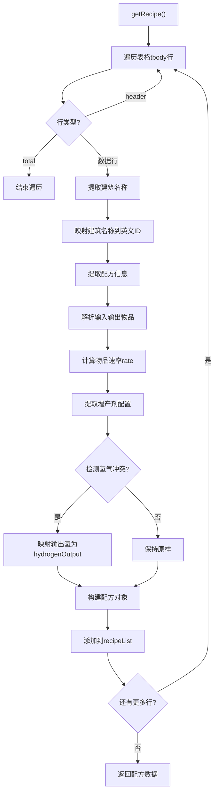

#### 10.1.2 核心代码实现

```javascript
function getRecipe() {
  let recipeList = []
  let outputHasHydrogen = false
  let inputHasHydrogen = false
  let proliferator = null
  let blueprintTitle = ''
  let blueprintDesc = ''
  let blueprintIconIdx = []

  // 遍历表格行
  for (let tr of document.getElementsByTagName('tbody')[0].childNodes) {
    if (tr.className === 'header') continue
    if (tr.className === 'total') break
    if (tr.childNodes.length === 0) continue

    // 提取节点列表
    let nodeList = []
    for (let node of tr.childNodes) {
      if (!node.tagName) continue
      nodeList.push(node)
    }

    // Step 1: 提取建筑信息
    let buildingName = nodeList[3].getElementsByTagName('img')[0]
    if (!buildingName) {
      cocoMessage.warning('存在生产设施为空的配方，请检查配方列表', 4000)
      throw `unsupported recipe combination`
    }
    buildingName = buildingName.getAttribute('title')

    let building = {
      name: buildingName,
      num: parseFloat(nodeList[3].getElementsByTagName('span')[0].innerText)
    }

    // Step 2: 映射建筑名称
    for (let item of itemNameList) {
      if (item[0] === building.name) {
        building.name = item[1]
        break
      }
    }

    // Step 3: 解析配方
    const recipeHtml = nodeList[4]
      .getElementsByTagName('div')[0]
      .getElementsByClassName('pf selected')[0]
    let input = []
    let output = []
    let isInput = true
    const t = parseFloat(recipeHtml.innerText.split('(')[1].split('s')[0])

    for (let node of recipeHtml.childNodes) {
      if (!node.tagName) continue

      if (node.tagName === 'IMG') {
        if (node.className === 'to') {
          isInput = false
          continue
        }
        let cnTitle = node.getAttribute('title')
        let title = ''
        for (let item of itemNameList) {
          if (item[0] === cnTitle) {
            title = item[1]
            break
          }
        }
        if (isInput) {
          input.push({ name: title })
        } else {
          output.push({ name: title })
          if (title === 'hydrogen') outputHasHydrogen = true
        }
      } else if (node.tagName === 'SUB') {
        if (isInput) {
          input[input.length - 1].rate = parseFloat(node.innerText) / t
        } else {
          output[output.length - 1].rate = parseFloat(node.innerText) / t
        }
      }
    }

    // Step 4: 提取增产剂配置
    const acceleratorModeName = nodeList[6]
      .getElementsByClassName('m selected')[0]
      .getAttribute('data-modein')
    let acceleratorMode = -1
    if (acceleratorModeName === '加速') acceleratorMode = 1
    else if (acceleratorModeName === '增产') acceleratorMode = 0

    // Step 5: 构建配方对象
    const recipe = {
      building: building,
      output: output,
      input: input,
      acceleratorMode: acceleratorMode,
      recipeID: 0
    }

    recipeList.push(recipe)
  }

  // Step 6: 处理氢气冲突
  if (inputHasHydrogen && outputHasHydrogen) {
    for (let recipe of recipeList) {
      if (!recipe.input) continue
      for (let item of recipe.output) {
        if (item.name === 'hydrogen') {
          item.name = 'hydrogenOutput'
        }
      }
    }
  }

  return {
    recipeList: recipeList,
    proliferator: proliferator,
    blueprintIcon: blueprintIconIdx,
    blueprintTitle: blueprintTitle,
    blueprintDesc: blueprintDesc
  }
}
```

### 10.2 物品名称映射表

**代码位置**: `data.js` L6188-6330

#### 10.2.1 映射表结构

```javascript
const itemNameList = [
  // 建筑类
  ['矩阵研究站', 'lab'],
  ['制作台Mk.Ⅰ', 'assemblingMachineMk1'],
  ['制作台Mk.Ⅱ', 'assemblingMachineMk2'],
  ['制作台Mk.Ⅲ', 'assemblingMachineMk3'],
  ['重组式制造台', '重组式制造台'],
  ['电弧熔炉', 'arcSmelter'],
  ['位面熔炉', 'planeSmelter'],
  ['负熵熔炉', '负熵熔炉'],

  // 原料类
  ['水', 'water'],
  ['铁矿', 'ironOre'],
  ['铜矿', 'copperOre'],
  ['硅石', 'siliconOre'],
  ['钛石', 'titaniumOre'],
  ['煤矿', 'coal'],

  // 产品类
  ['铁块', 'ironIngot'],
  ['铜块', 'copperIngot'],
  ['钢材', 'steel'],
  ['钛块', 'titaniumIngot'],
  ['钛合金', 'titaniumAlloy'],

  // 组件类
  ['电路板', 'circuitBoard'],
  ['处理器', 'processor'],
  ['量子芯片', 'quantumChip'],
  ['磁线圈', 'magneticCoil'],

  // 特殊物品
  ['氢', 'hydrogen'],
  ['重氢', 'deuterium'],
  ['反物质', 'antimatter'],
  ['临界光子', 'criticalPhoton'],

  // 增产剂
  ['增产剂Mk.Ⅰ', 'proliferatorMk1'],
  ['增产剂Mk.Ⅱ', 'proliferatorMk2'],
  ['增产剂Mk.Ⅲ', 'proliferatorMk3']

  // ... 更多映射
]
```

### 10.3 generateBlueprint() 蓝图生成

**代码位置**: `data.js` L6589-6662

#### 10.3.1 完整生成流程

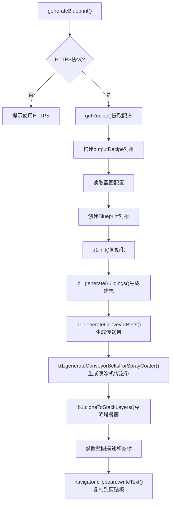

#### 10.3.2 核心代码实现

```javascript
function generateBlueprint() {
  // 检查协议
  if (!location.href.startsWith('https')) {
    cocoMessage.warning('请使用 https 协议访问以启用复制到剪切板功能')
    return
  }

  // Step 1: 提取配方数据
  const recipe = getRecipe()

  // Step 2: 构建输出配方对象
  const outputRecipe = {
    proliferator: recipe.proliferator,
    subRecipes: recipe.recipeList
  }

  if (!outputRecipe.subRecipes) return

  // Step 3: 读取配置
  let config = {
    maxSorterNumOneBelt: 8,
    conveyorBeltStackLayer: parseInt(document.getElementById('conveyorBeltStackLayer').value),
    x_y_ratio: parseFloat(document.getElementById('x_y_ratio').value),
    compactLayout: false,
    upgradeConveyorBelt: false,
    onlyConveyorBeltMk3: document.getElementById('onlyConveyorBeltMk3').checked,
    onlySorterMk3: document.getElementById('onlySorterMk3').checked,
    useSorterMk4: document.getElementById('useSorterMk4').checked,
    maxLabLayers: parseInt(document.getElementById('maxLabLayers').value),
    selfSpray: document.getElementById('selfAcc').checked,
    generateTeslaTower: document.getElementById('generateTeslaTower').checked,
    teslaTowerInterval: 10,
    teslaTowerLineInterval: parseInt(document.getElementById('teslaTowerLineInterval').value),
    onlyConveyorBeltMk3Downgrade: false,
    stackLayers: parseInt(document.getElementById('stackLayers').value) || 1
  }

  // Step 4: 创建蓝图对象
  let b1 = new Blueprint(
    recipe.blueprintTitle,
    recipe.blueprintIcon.concat(Array(5).fill(0)).slice(0, 5),
    outputRecipe,
    config
  )

  // Step 5: 生成蓝图
  b1.init()
  b1.generateBuildings()
  b1.generateConveyorBelts()
  b1.generateConveyorBeltsForSprayCoater()
  b1.cloneToStackLayers()

  // Step 6: 设置蓝图属性
  b1.blueprintTemplate.buildings = b1.buildings
  b1.blueprintTemplate.header.desc = recipe.blueprintDesc.trimEnd()

  // 设置图标布局
  switch (recipe.blueprintIcon.length) {
    case 1:
      b1.blueprintTemplate.header.layout = 10
      break
    case 2:
      b1.blueprintTemplate.header.layout = 20
      break
    case 3:
      b1.blueprintTemplate.header.layout = 30
      break
    case 4:
      b1.blueprintTemplate.header.layout = 40
      break
    default:
      b1.blueprintTemplate.header.layout = 51
      break
  }

  // Step 7: 复制到剪贴板
  navigator.clipboard.writeText(b1.toStr()).then(r => cocoMessage.success('已复制到粘贴板', 1000))
}
```

#### 10.3.3 配置参数说明

| 参数                     | 类型    | 说明                   |
| ------------------------ | ------- | ---------------------- |
| `maxSorterNumOneBelt`    | number  | 单传送带最大分拣器数量 |
| `conveyorBeltStackLayer` | number  | 传送带堆叠层数         |
| `x_y_ratio`              | number  | 蓝图长宽比             |
| `onlyConveyorBeltMk3`    | boolean | 仅使用三级传送带       |
| `onlySorterMk3`          | boolean | 仅使用三级分拣器       |
| `useSorterMk4`           | boolean | 使用四级集装分拣器     |
| `selfSpray`              | boolean | 自喷涂增产剂           |
| `generateTeslaTower`     | boolean | 自动生成电线杆         |
| `stackLayers`            | number  | 建筑堆叠层数           |

---

## 设置管理阶段

### 11.1 数据持久化

**代码位置**: `data.js` L4361-4415

#### 11.1.1 存储机制

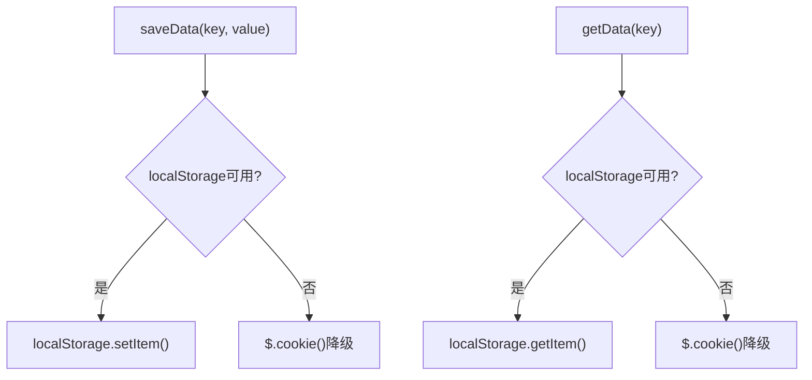

#### 11.1.2 核心代码实现

```javascript
// 保存数据
function saveData(key, value) {
  if (window.localStorage) {
    localStorage.setItem(key, value)
  } else {
    $.cookie(key, value) // 降级到cookie
  }
}

// 读取数据
function getData(key) {
  if (window.localStorage) {
    return localStorage.getItem(key)
  } else {
    return $.cookie(key)
  }
}
```

### 11.2 设置保存/加载函数

#### 11.2.1 设备选择设置

```javascript
// 保存设备选择
function saveSetting() {
  saveData('machine_settings' + version, JSON.stringify(settings))
}

// 加载设备选择
function loadSetting() {
  var json = getData('machine_settings' + version)
  if (json) {
    eval('settings = ' + json) // 解析JSON
  }
  // 设置默认选项
  document.getElementById('onlyConveyorBeltMk3').checked = true
  document.getElementById('onlySorterMk3').checked = true
}
```

#### 11.2.2 设备速度设置

```javascript
function saveSettingTime() {
  saveData('machine_settings_time' + version, JSON.stringify(settings_time))
}

function loadSettingTime() {
  var json = getData('machine_settings_time' + version)
  if (json) {
    eval('settings_time = ' + json)
  }
}
```

#### 11.2.3 配方选择设置

```javascript
function saveSettingPf() {
  saveData('machine_settings_pf' + version, JSON.stringify(settings_pf))
}

function loadSettingPf() {
  var json = getData('machine_settings_pf' + version)
  if (json) {
    eval('settings_pf = ' + json)
  }
}
```

#### 11.2.4 项目列表设置

```javascript
function saveSettingProjects() {
  saveData('settings_projects' + version, JSON.stringify(projects))
}

function loadSettingProjects() {
  var json = getData('settings_projects' + version)
  if (json) {
    eval('projects = ' + json)
  }
}
```

### 11.3 设置数据结构

#### 11.3.1 settings 结构

```javascript
settings = {
  0: {
    // 配方ID
    m: '制作台Mk.Ⅲ', // 设备选择
    accType: '增产剂Mk.Ⅰ', // 增产剂类型
    accValue: '加速' // 增产剂效果
  },
  1: {
    m: '电弧熔炉',
    accType: '增产剂Mk.Ⅱ',
    accValue: '增产'
  }
}
```

#### 11.3.2 settings_time 结构

```javascript
settings_time = {
  '制作台Mk.Ⅲ': 1.5, // 自定义速度
  电弧熔炉: 1.2
}
```

#### 11.3.3 settings_pf 结构

```javascript
settings_pf = {
  氢: 33, // 物品名 → 配方ID
  精炼油: 34
}
```

#### 11.3.4 projects 结构

```javascript
projects = [
  {
    name: "蓝矩阵生产",
    singleMake: [],
    ig_names: [],
    value: [{item: {...}, number: 60}],
    settings: {
      "0": {m: "矩阵研究站", accType: "增产剂Mk.Ⅰ", accValue: "加速"}
    }
  }
]
```

### 11.4 项目管理功能

**代码位置**: `data.js` L5940-5990

#### 11.4.1 保存项目

```javascript
function f_save() {
  let index = 0
  let product_settings = {}
  var name = prompt('输入方案名')
  if (!name) return

  // 检查是否存在同名方案
  for (index = 0; index < projects.length; index++) {
    if (projects[index].name == name) {
      if (!confirm(`已存在名为${name}的方案，继续保存将覆盖原方案`)) {
        return
      }
      break
    }
  }

  // 提取当前设置
  for (let item of app.items) {
    let product_setting = {}
    for (let accType of item.accType) {
      if (accType.class === 'm selected') {
        product_setting.accType = accType.name
      }
    }
    for (let accValue of item.accValue) {
      if (accValue.class === 'm selected') {
        product_setting.accValue = accValue.name
      }
    }
    for (let m of item.m) {
      if (m.class === 'm selected') {
        product_setting.m = m.name
      }
    }
    product_settings[find(item.name).id] = product_setting
  }

  // 保存项目
  projects[index] = {
    name: name,
    singleMake: singleMake,
    ig_names: ig_names || [],
    value: xqs,
    settings: product_settings
  }
  saveSettingProjects()
  projectsUpdate()
}
```

#### 11.4.2 项目列表更新

```javascript
function projectsUpdate() {
  $('#selprojects').html('')
  $(projects).each(function () {
    $('#selprojects').append("<option value='" + this.name + "'>" + this.name + '</option>')
  })
  if (projects.length) {
    $('#projectdiv').show()
  } else {
    $('#projectdiv').hide()
  }
}
```

---

## Vue应用阶段

### 12.1 Vue实例结构

**代码位置**: `data.js` L4760-4920

#### 12.1.1 数据绑定

```javascript
app = new Vue({
  el: '#result',
  data: {
    totalEnergy: 0, // 总能耗（MW）
    totalSpace: 0, // 总空间占用
    totalAcc: 0, // 总增产剂消耗
    total: [], // 设备统计列表
    xqs: [], // 需求列表
    icons: icons, // 图标数据（冻结）
    items: [], // 生产项列表
    items2: [], // 多余产出列表
    items0: [], // 独立生产列表
    ig_names: [], // 忽略物品列表
    xps_editor_index: -1, // 需求数量编辑索引
    xps_editor_number: 0, // 需求数量编辑值
    items_editor_index: -1, // 设备数量编辑索引
    items_editor_number: 0 // 设备数量编辑值
  }
})
```

#### 12.1.2 方法绑定

```javascript
methods: {
  // 速度变更
  speedChange: function (item) {
    settings_time[item.machineName] = parseFloat(item.speed);
    saveSettingTime();
    update_all();
  },

  // 点击需求数量进入编辑
  onClickNumber: function (index) {
    if (this.xqs && this.xqs[index]) {
      this.xps_editor_index = index;
      this.xps_editor_number = this.xqs[index].number;
      Vue.nextTick(() => {
        if (this.$refs.input && this.$refs.input[0]) {
          this.$refs.input[0].focus();
        }
      });
    }
  },

  // 点击设备数量进入编辑
  onClickNumberItem: function (index_item) {
    if (this.items && this.items[index_item]) {
      this.items_editor_index = index_item;
      this.items_editor_number = this.items[index_item].number2;
      Vue.nextTick(() => {
        if (this.$refs.input && this.$refs.input[0]) {
          this.$refs.input[0].focus();
        }
      });
    }
  },

  // 提交需求数量编辑
  submitEditorNumber: function () {
    if (this.xqs && this.xqs[this.xps_editor_index]) {
      if (this.xps_editor_number > 0) {
        this.xqs[this.xps_editor_index].number = this.xps_editor_number;
        update_all();
      }
      this.xps_editor_index = -1;
    }
  },

  // 提交设备数量编辑（按比例调整所有需求）
  submitEditorNumberItem: function () {
    if (this.items && this.items[this.items_editor_index]) {
      if (this.items_editor_number > 0) {
        multiple = this.items_editor_number / this.items[this.items_editor_index].number2;

        // 运行两遍防止浮点误差
        for (var i = 0; i < this.xqs.length; i++) {
          this.xqs[i].number *= multiple;
        }
        update_all();

        multiple = this.items_editor_number / this.items[this.items_editor_index].number2;
        for (var i = 0; i < this.xqs.length; i++) {
          this.xqs[i].number *= multiple;
        }
        update_all();
      }
      this.items_editor_index = -1;
    }
  },

  // 删除需求项
  removeItem: function (index) {
    if (this.xqs && this.xqs[index]) {
      this.xqs.splice(index, 1);
      update_all();
    }
  },
}
```

#### 12.1.3 计算属性

```javascript
computed: {
  totalDisplay: function () {
    if (!this.total || !this.total.length) return [];
    return this.total.map(function (item) {
      return {
        name: item.name,
        value: item.value,
        energy: item.energy ? item.energy.toFixed(2) : "0.00",
        space: item.space ? Math.round(item.space) : 0,
      };
    });
  },
}
```

### 12.2 数据流向

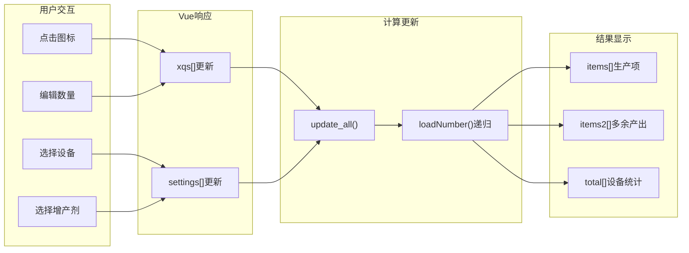

saveData("settings_projects" + version, JSON.stringify(projects));
}
function loadSettingProjects() {
var json = getData("settings_projects" + version);
if (json) {
eval("projects = " + json);
}
}

````

---

## Vue应用阶段

### 12.1 Vue应用初始化

**代码位置**: `data.js` L4797-5301

```javascript
var app = new Vue({
  el: "#result",
  data: {
    totalEnergy: 0,      // 总能耗
    totalSpace: 0,       // 总空间
    totalAcc: 0,         // 总增产剂
    total: [],           // 总计数据
    xqs: [],             // 需求列表
    icons: icons,        // 图标数据
    items: [],           // 物品列表
    items2: [],          // 多余产出列表
    items0: [],          // 独立生产列表
    ig_names: [],        // 忽略名称
    xps_editor_index: -1,
    xps_editor_number: 0,
    items_editor_index: -1,
    items_editor_number: 0
  },
  methods: {
    // 速度变更
    speedChange: function(item) {
      settings_time[item.machineName] = parseFloat(item.speed);
      saveSettingTime();
      update_all();
    },

    // 点击数量编辑
    onClickNumber: function(index) {
      this.xps_editor_index = index;
      this.xps_editor_number = this.xqs[index].number;
    },

    // 提交编辑
    submitEditorNumber: function() {
      if (this.xps_editor_number > 0) {
        this.xqs[this.xps_editor_index].number = this.xps_editor_number;
        update_all();
      }
      this.xps_editor_index = -1;
    },

    // 删除需求
    removeItem: function(index) {
      this.xqs.splice(index, 1);
      update_all();
    }
  }
});
````

### 12.2 update_all() 完整流程

**代码位置**: `data.js` L5556-5867

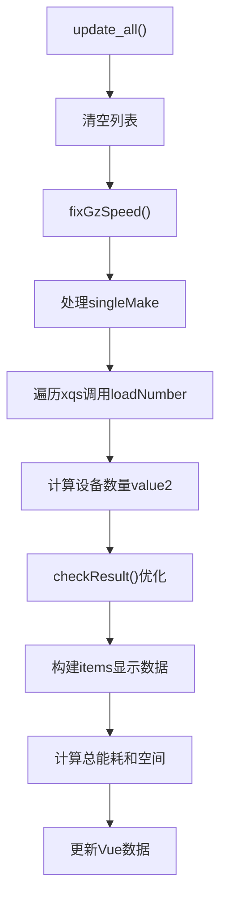

---

## 完整流程图

### 模块整体架构

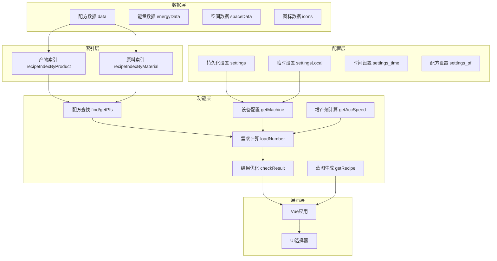

### 用户操作流程

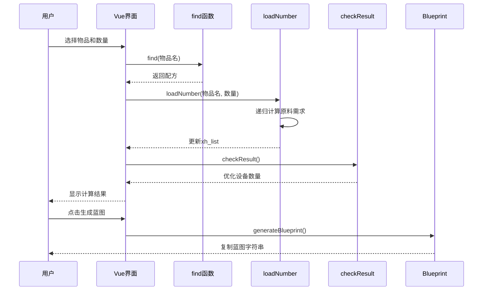

---

## 关键常量速查

### 设备速度对照表

| 设备         | 基础速度 | 能耗(MW) | 空间 |
| ------------ | -------- | -------- | ---- |
| 制作台Mk.Ⅰ   | 0.75     | 0.27     | 16   |
| 制作台Mk.Ⅱ   | 1.0      | 0.54     | 16   |
| 制作台Mk.Ⅲ   | 1.5      | 1.08     | 16   |
| 重组式制造台 | 3.0      | 2.7      | 16   |
| 电弧熔炉     | 1.0      | 0.36     | 16   |
| 位面熔炉     | 2.0      | 1.44     | 16   |
| 负熵熔炉     | 3.0      | 2.88     | 16   |
| 矩阵研究站   | 1.0      | 0.48     | 2.4  |
| 自演化研究站 | 3.0      | -        | -    |

### 增产剂效率表

| 增产剂     | 增产效率 | 加速效率 | 消耗/min |
| ---------- | -------- | -------- | -------- |
| 增产剂Mk.Ⅰ | +12.5%   | +25%     | 12       |
| 增产剂Mk.Ⅱ | +20%     | +50%     | 24       |
| 增产剂Mk.Ⅲ | +25%     | +100%    | 60       |

### 函数位置速查表

| 函数名            | 行号  | 功能           |
| ----------------- | ----- | -------------- |
| f_initData        | L4252 | 初始化配方索引 |
| find              | L4694 | 配方查找       |
| getMachine        | L4417 | 获取设备配置   |
| getValue          | L4453 | 获取时间参数   |
| getAccSpeed       | L4616 | 增产剂效率     |
| loadNumber        | L5342 | 需求递归计算   |
| checkResult       | L5472 | 结果优化       |
| update_all        | L5556 | 更新显示       |
| getRecipe         | L6186 | 提取蓝图配方   |
| generateBlueprint | L6589 | 生成蓝图       |

---

**文档版本**：v2.0  
**最后更新**：2025年  
**维护者**：DSQ 开发团队
