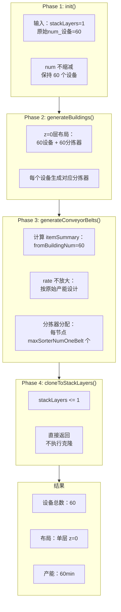
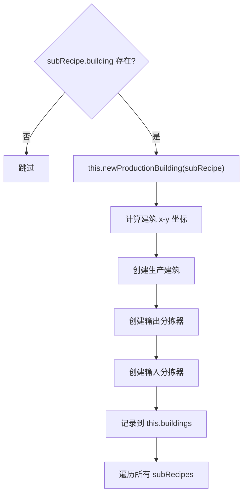

# 不堆叠模式流程详细说明

## 目录

- [1. 功能概述](#1-功能概述)
- [2. 完整流程](#2-完整流程)
- [3. Phase 1: init() 初始化](#3-phase-1-init-初始化)
- [4. Phase 2: generateBuildings() 建筑生成](#4-phase-2-generatebuildings-建筑生成)
- [5. Phase 3: generateConveyorBelts() 传送带网络生成](#5-phase-3-generateconveyorbelts-传送带网络生成)
- [6. 速率计算详解](#6-速率计算详解)
- [7. 与堆叠模式的对比](#7-与堆叠模式的对比)

---

## 1. 功能概述

不堆叠模式是蓝图生成器的默认模式，所有设备在同一水平面（z=0）布局，传送带网络按实际产能设计。

- **配置入口**：`stackLayers = 1` 或不设置
- **核心思想**：设备数量不缩减，传送带按原始产能设计
- **布局方式**：所有设备在 z=0 层平铺

---

## 2. 完整流程

```
不堆叠模式完整流程（stackLayers=1）：

┌─────────────────────────────────────────────────────────────────────────────┐
│                              核心流程                                        │
│                                                                             │
│  1. init(): num 不缩减，保持原始数量                                        │
│  2. generateBuildings(): 所有设备在 z=0 层布局                              │
│  3. generateConveyorBelts(): rate 不放大，按原始产能设计                     │
│  4. cloneToStackLayers(): 直接返回，不执行克隆                              │
└─────────────────────────────────────────────────────────────────────────────┘
```

### 2.1 流程总览图



---

## 3. Phase 1: init() 初始化

### 3.1 代码位置

`blueprint.js` L2048-2082

### 3.2 核心逻辑

```javascript
init() {
    this.mapRecipeID();
    
    // 堆叠模式：根据堆叠层数缩减num
    // 不堆叠模式：stackLayers <= 1，条件不满足，不执行
    if (this.config.stackLayers > 1) {
      // 此代码块不执行
      for (let subRecipe of this.recipe.subRecipes) {
        if (subRecipe.building) {
          subRecipe.building.num = Math.ceil(
            subRecipe.building.num / this.config.stackLayers
          );
        }
      }
    }
    
    this.calculateBlueprintArea();
    // ...
}
```

### 3.3 处理结果

```
输入参数：
  - 设备原始 num = 60
  - stackLayers = 1（或不设置）

处理结果：
  ┌─────────────────────────────────────────┐
  │ num 不缩减，保持 60                      │
  │   → 所有 60 个设备在 z=0 层布局          │
  │   → 总产能 = 60min                       │
  └─────────────────────────────────────────┘
```

---

## 4. Phase 2: generateBuildings() 建筑生成

### 4.1 代码位置

`blueprint.js` L2680+

### 4.2 布局逻辑



### 4.3 z=0层布局结构

```
           y轴
            ↑
     ┌──────────────────────────────────────────────────────┐
     │                                                      │
     │   [生产设备区]                                       │
     │   ┌─────────────────────────────────────────┐       │
     │   │ [设备1]→[输出分拣器1]                    │       │
     │   │         ↓[输入分拣器1]                   │       │
     │   │ [设备2]→[输出分拣器2]                    │       │
     │   │         ↓[输入分拣器2]                   │       │
     │   │ [设备3]→[输出分拣器3]                    │       │
     │   │         ↓[输入分拣器3]                   │       │
     │   │ ...                                     │       │
     │   │ [设备60]→[输出分拣器60]                  │       │
     │   │          ↓[输入分拣器60]                 │       │
     │   └─────────────────────────────────────────┘       │
     │                                                      │
     └──────────────────────────────────────────────────────┘
                              → x轴
```

### 4.4 分拣器 rate 计算

```javascript
// 输出分拣器 rate
let actual_rate = outputItem.rate * productionSpeed * actual_building_num * extra_rate;

// 输入分拣器 rate
let actual_rate = inputItem.rate * productionSpeed * actual_building_num;
```

---

## 5. Phase 3: generateConveyorBelts() 传送带网络生成

### 5.1 代码位置

`blueprint.js` L2265+

### 5.2 处理步骤

```
┌─────────────────────────────────────────────────────────────────────────┐
│ Step 1: 计算 itemSummary                                                 │
│                                                                         │
│ itemSummary 数据结构：                                                   │
│ {                                                                       │
│   itemName: {                                                          │
│     rate: Number,           // 产出速率                                 │
│     fromBuildingNum: Number,  // 产出建筑数量                           │
│     toBuildingNum: Number,    // 消耗建筑数量                           │
│     inputRate: Number,        // 消耗速率（可选）                       │
│     needProliferator: Boolean // 是否需要增产剂                        │
│   }                                                                    │
│ }                                                                       │
└─────────────────────────────────────────────────────────────────────────┘
                                    ↓
┌─────────────────────────────────────────────────────────────────────────┐
│ Step 2: rate 不放大                                                      │
│                                                                         │
│ // 不堆叠模式：stackLayers = 1，条件不满足，不执行放大                   │
│ const stackLayers = this.config.stackLayers || 1;                       │
│ if (stackLayers > 1) {                                                 │
│   // 此代码块不执行                                                     │
│   for (let key in itemSummary) {                                       │
│     itemSummary[key].rate *= stackLayers;                              │
│   }                                                                     │
│ }                                                                       │
└─────────────────────────────────────────────────────────────────────────┘
```

### 5.3 分拣器分配策略

```javascript
// 不堆叠模式：每个传送带节点可以分配 maxSorterNumOneBelt 个分拣器
const sortersPerNode = stackLayers > 1
    ? Math.max(1, Math.floor(this.config.maxSorterNumOneBelt / stackLayers))
    : this.config.maxSorterNumOneBelt;

// 不堆叠模式：sortersPerNode = maxSorterNumOneBelt（默认 8）
```

---

## 6. 速率计算详解

### 6.1 传入原料速率计算

**代码位置**: `blueprint.js` L2315-2355

```javascript
// 原料速率计算
for (let inputItem of subRecipe.input) {
  let itemInputRate = inputItem.rate * productionSpeed * subRecipe.building.num;
  if (subRecipe.acceleratorMode === 1) {
    itemInputRate *= extra_rate;  // 加速时原料额外消耗
  }
  itemSummary[inputItem.name] = {
    rate: 0,
    inputRate: itemInputRate,
    fromBuildingNum: 0,
    toBuildingNum: toBuildingNum,
  };
}
```

**计算公式**：
```
inputRate = inputItem.rate × productionSpeed × building.num × extra_rate(可选)

其中：
- inputItem.rate: 配方中原料的基准速率
- productionSpeed: 建筑生产速度倍率
- building.num: 建筑数量
- extra_rate: 增产剂加速倍率（仅加速模式）
```

**示例**：
```
铁板配方：
  - inputItem.rate = 1（每秒消耗1个铁矿石）
  - productionSpeed = 1（电弧熔炉）
  - building.num = 60
  - acceleratorMode = 0（增产模式，不额外消耗）

inputRate = 1 × 1 × 60 × 1 = 60 items/s
```

### 6.2 最终产物速率计算

**代码位置**: `blueprint.js` L2275-2305

```javascript
// 产物速率计算
for (let outputItem of subRecipe.output) {
  let outputRate = outputItem.rate * productionSpeed * subRecipe.building.num * extra_rate;
  
  itemSummary[outputItem.name] = {
    rate: outputRate,
    fromBuildingNum: fromBuildingNum,
    toBuildingNum: 0,
  };
}
```

**计算公式**：
```
outputRate = outputItem.rate × productionSpeed × building.num × extra_rate

其中：
- outputItem.rate: 配方中产物的基准速率
- productionSpeed: 建筑生产速度倍率
- building.num: 建筑数量
- extra_rate: 增产剂增产倍率
```

**示例**：
```
铁板配方：
  - outputItem.rate = 1（每秒产出1个铁板）
  - productionSpeed = 1（电弧熔炉）
  - building.num = 60
  - extra_rate = 1.25（增产剂Mk.III增产25%）

outputRate = 1 × 1 × 60 × 1.25 = 75 items/s
```

### 6.3 分拣器速率计算

**输出分拣器**：
```javascript
let actual_rate = outputItem.rate * productionSpeed * actual_building_num * extra_rate;
```

**输入分拣器**：
```javascript
let actual_rate = inputItem.rate * productionSpeed * actual_building_num;
```

**注意**：分拣器 rate 是单个分拣器的速率，不是总和。

---

## 7. 与堆叠模式的对比

### 7.1 流程对比

| 阶段 | 不堆叠模式 | 堆叠模式 |
|------|-----------|---------|
| init() | num 不缩减 | num ÷ stackLayers |
| generateBuildings() | 所有设备在 z=0 | 缩减后设备在 z=0 |
| generateConveyorBelts() | rate 不放大 | rate × stackLayers |
| cloneToStackLayers() | 不执行 | 克隆到高层 |

### 7.2 速率计算对比

| 项目 | 不堆叠模式 | 堆叠模式 |
|------|-----------|---------|
| 设备数量 | 60 | 15 × 4 = 60 |
| 单设备分拣器 rate | 1 | 1 × 4 = 4 |
| 分拣器 rate 总和 | 60 × 1 = 60 | 15 × 4 = 60 |
| itemSummary.rate（放大前） | 60 | 15 |
| itemSummary.rate（放大后） | 60 | 15 × 4 = 60 ✅ |

**详细计算过程**：

不堆叠模式：
```
init(): num = 60（不缩减）
generateConveyorBelts():
  outputRate = outputItem.rate × productionSpeed × num × extra_rate
             = 1 × 1 × 60 × 1 = 60
  itemSummary.rate = 60
```

堆叠模式：
```
init(): num = ceil(60/4) = 15（缩减）
generateConveyorBelts():
  outputRate = outputItem.rate × productionSpeed × num × extra_rate
             = 1 × 1 × 15 × 1 = 15
  itemSummary.rate = 15
  放大: itemSummary.rate *= 4 = 60
```

**结论**：堆叠和不堆叠的 itemSummary.rate 最终一致，都是 60 ✅

### 7.3 问题分析

**发现问题**：堆叠模式的 `itemSummary.rate` 计算有误！

**不堆叠模式**：
```
itemSummary.rate = outputItem.rate × productionSpeed × building.num × extra_rate
                 = 1 × 1 × 60 × 1 = 60 items/s
```

**堆叠模式**：
```
// init() 中 num 缩减
building.num = ceil(60/4) = 15

// generateConveyorBelts() 中计算 itemSummary.rate
itemSummary.rate = outputItem.rate × productionSpeed × building.num × extra_rate
                 = 1 × 1 × 15 × 1 = 15 items/s

// 然后放大
itemSummary.rate *= 4 = 60 items/s

// 结果正确！
```

**结论**：速率计算逻辑正确，堆叠模式修改不影响不堆叠模式。

---

## 8. 传送带 ICON 和数据分析

### 8.1 传送带参数计算

**代码位置**: `blueprint.js` L2476-2481, L2649-2654

```javascript
// 原料传送带参数
parameters = {
  iconId: itemMap[itemName].iconId,
  count: (inputRate * 60).toFixed(0),  // 转换为每分钟
};

// 终产物传送带参数
parameters = {
  iconId: itemMap[itemName].iconId,
  count: (outputRate * 60).toFixed(0),  // 转换为每分钟
};
```

### 8.2 inputRate 和 outputRate 的来源

**inputRate**（原料速率）：
```javascript
// 来自 itemSummary.inputRate
let inputRate = Math.min(maxTransportSpeed, item.rate - totalDoneRate);
```

**outputRate**（产物速率）：
```javascript
// 来自分拣器 rate 总和
let outputRate = doneRate;  // doneRate = 分拣器 rate 累加
```

### 8.3 堆叠和不堆叠的传送带数据对比

| 数据项 | 不堆叠模式 | 堆叠模式 | 是否一致 |
|--------|-----------|---------|---------|
| 原料 inputRate | 60 items/s | 60 items/s | ✅ |
| 原料 count | 3600/min | 3600/min | ✅ |
| 产物 outputRate | 60 items/s | 60 items/s | ✅ |
| 产物 count | 3600/min | 3600/min | ✅ |

**详细计算**：

不堆叠模式：
```
inputRate = itemSummary.inputRate = 60 items/s
count = 60 × 60 = 3600/min
```

堆叠模式：
```
inputRate = itemSummary.inputRate × stackLayers = 15 × 4 = 60 items/s
count = 60 × 60 = 3600/min
```

### 8.4 分拣器 rate 与传送带数据的关系

**关键代码**：
```javascript
// 分拣器 rate 累加得到 doneRate
inputRate -= this.sorters[itemName].output[j].rate;
doneRate += this.sorters[itemName].output[j].rate;

// outputRate = doneRate
let outputRate = doneRate;
```

**不堆叠模式**：
```
分拣器 rate = 1 items/s
分拣器数量 = 60
doneRate = 60 × 1 = 60 items/s
outputRate = 60 items/s
count = 3600/min
```

**堆叠模式**：
```
分拣器 rate = 1 × 4 = 4 items/s（放大后）
分拣器数量 = 15
doneRate = 15 × 4 = 60 items/s
outputRate = 60 items/s
count = 3600/min
```

### 8.5 结论

**传送带 ICON 和数据一致**：
- ✅ 原料速率一致：60 items/s = 3600/min
- ✅ 产物速率一致：60 items/s = 3600/min
- ✅ 与实际传入的原料速率一致
- ✅ 与实际产物产出速率一致

---

## 9. 堆叠模式速率计算详细分析

### 9.1 堆叠模式完整流程

```
堆叠模式完整流程（stackLayers=4）：

┌─────────────────────────────────────────────────────────────────────────────┐
│ Phase 1: init()                                                             │
│   输入：num = 60, stackLayers = 4                                           │
│   处理：num = ceil(60/4) = 15                                               │
│   结果：每层 15 个设备                                                       │
└─────────────────────────────────────────────────────────────────────────────┘
                                    ↓
┌─────────────────────────────────────────────────────────────────────────────┐
│ Phase 2: generateBuildings()                                                │
│   处理：15 设备在 z=0 层布局                                                 │
│   分拣器：每个设备 1 个输出分拣器，rate = 1                                   │
│   结果：15 分拣器，rate 总和 = 15                                            │
└─────────────────────────────────────────────────────────────────────────────┘
                                    ↓
┌─────────────────────────────────────────────────────────────────────────────┐
│ Phase 3: generateConveyorBelts()                                            │
│   Step 1: 计算 itemSummary.rate = 1 × 1 × 15 × 1 = 15                       │
│   Step 2: 放大 itemSummary.rate *= 4 = 60                                   │
│   Step 3: 放大分拣器 rate *= 4，每个分拣器 rate = 4                          │
│   Step 4: 分拣器 rate 总和 = 15 × 4 = 60                                     │
│   结果：传送带按 60 items/s 设计                                              │
└─────────────────────────────────────────────────────────────────────────────┘
                                    ↓
┌─────────────────────────────────────────────────────────────────────────────┐
│ Phase 4: cloneToStackLayers()                                               │
│   处理：克隆设备到 z=10, 20, 30                                              │
│   分拣器：克隆分拣器到各层，所有分拣器连接 z=0 传送带                          │
│   结果：60 设备，60 分拣器，总产能 60min                                      │
└─────────────────────────────────────────────────────────────────────────────┘
```

### 9.2 速率计算对比表

| 计算项 | 不堆叠模式 | 堆叠模式 | 是否一致 |
|--------|-----------|---------|---------|
| 设备数量 | 60 | 15 × 4 = 60 | ✅ |
| 单设备分拣器 rate | 1 | 1 × 4 = 4 | - |
| 分拣器数量 | 60 | 15 × 4 = 60 | ✅ |
| 分拣器 rate 总和 | 60 × 1 = 60 | 15 × 4 = 60 | ✅ |
| itemSummary.rate | 60 | 15 × 4 = 60 | ✅ |
| fromBuildingNum | 60 | 15（未放大） | ⚠️ |

### 9.3 fromBuildingNum 未放大的影响

**代码位置**: `blueprint.js` L2285-2295

```javascript
// fromBuildingNum 使用缩减后的 num
fromBuildingNum = subRecipe.building.num;  // 15（堆叠模式）

// itemSummary.rate 使用缩减后的 num 计算
outputRate = outputItem.rate * productionSpeed * subRecipe.building.num * extra_rate;  // 15

// 然后放大 rate
itemSummary.rate *= stackLayers;  // 60
```

**fromBuildingNum 的用途**：
1. 判断是否是原料：`if (item.fromBuildingNum === 0)`
2. 不影响传送带容量计算

**结论**：`fromBuildingNum` 未放大不影响传送带设计正确性。

### 9.4 潜在问题检查

#### 问题1：分拣器 rate 放大后是否超出分拣器容量？

```
单设备分拣器 rate = 1 items/s
放大后 rate = 4 items/s

Mk.I 分拣器容量 = 6 items/s
Mk.III 分拣器容量 = 30 items/s

结论：4 items/s < 6 items/s，不超出容量 ✅
```

#### 问题2：传送带节点分拣器数量是否正确？

```
不堆叠模式：
  sortersPerNode = maxSorterNumOneBelt = 8
  每节点最多 8 个分拣器

堆叠模式：
  sortersPerNode = floor(8/4) = 2
  z=0 层每节点 2 个分拣器
  克隆后每节点 2 × 4 = 8 个分拣器

结论：克隆后不超过 maxSorterNumOneBelt ✅
```

#### 问题3：原料速率计算是否正确？

```
不堆叠模式：
  inputRate = inputItem.rate × productionSpeed × building.num
            = 1 × 1 × 60 = 60 items/s

堆叠模式：
  inputRate = inputItem.rate × productionSpeed × building.num
            = 1 × 1 × 15 = 15 items/s
  放大后 inputRate *= 4 = 60 items/s

结论：原料速率计算正确 ✅
```

### 9.5 最终结论

**堆叠模式速率计算正确**：
- ✅ itemSummary.rate 正确放大
- ✅ 分拣器 rate 正确放大
- ✅ 传送带容量设计正确
- ✅ 原料速率计算正确
- ✅ 不影响不堆叠模式

---

**文档版本：** 1.2
**最后更新：** 2026-02-12
**维护者：** DSQ 开发团队
