# 原index UI流程拆分详细文档

## 目录

1. [UI架构概述](#1-ui架构概述)
2. [页面布局结构](#2-页面布局结构)
3. [UI组件详细分析](#3-ui组件详细分析)
   - 3.1 [页面标题组件](#31-页面标题组件)
   - 3.2 [顶部控制区组件](#32-顶部控制区组件)
   - 3.3 [选项控制区组件](#33-选项控制区组件)
   - 3.4 [参数设置面板组件](#34-参数设置面板组件)
   - 3.5 [需求列表组件](#35-需求列表组件)
   - 3.6 [排除列表组件](#36-排除列表组件)
   - 3.7 [结果表格组件](#37-结果表格组件)
   - 3.8 [物品选择器组件](#38-物品选择器组件)
   - 3.9 [多配方选择组件](#39-多配方选择组件)
4. [Vue数据绑定](#4-vue数据绑定)
5. [CSS样式模块](#5-css样式模块)
6. [用户交互流程](#6-用户交互流程)
7. [事件处理机制](#7-事件处理机制)
8. [动态UI更新机制](#8-动态ui更新机制)
9. [重构建议](#9-重构建议)
10. [核心逻辑流程详解](#10-核心逻辑流程详解)
    - 10.1 [初始化阶段核心逻辑](#101-初始化阶段核心逻辑)
    - 10.2 [需求计算核心逻辑](#102-需求计算核心逻辑)
    - 10.3 [设备数量计算逻辑](#103-设备数量计算逻辑)
    - 10.4 [增产剂计算逻辑](#104-增产剂计算逻辑)
    - 10.5 [多产出处理逻辑](#105-多产出处理逻辑)
    - 10.6 [Vue数据绑定更新逻辑](#106-vue数据绑定更新逻辑)
    - 10.7 [用户交互处理逻辑](#107-用户交互处理逻辑)
    - 10.8 [方案保存/加载逻辑](#108-方案保存加载逻辑)
    - 10.9 [蓝图生成逻辑](#109-蓝图生成逻辑)
    - 10.10 [设置持久化逻辑](#1010-设置持久化逻辑)
11. [关键数据结构](#11-关键数据结构)
12. [性能优化要点](#12-性能优化要点)

---

## 1. UI架构概述

### 1.1 技术栈

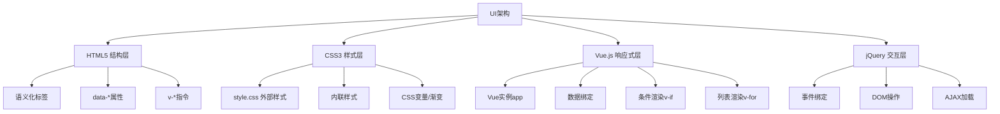
```mermaid
graph TD
    A[UI架构] --> B[HTML5 结构层]
    A --> C[CSS3 样式层]
    A --> D[Vue.js 响应式层]
    A --> E[jQuery 交互层]

    B --> B1[语义化标签]
    B --> B2[data-*属性]
    B --> B3[v-*指令]

    C --> C1[style.css 外部样式]
    C --> C2[内联样式]
    C --> C3[CSS变量/渐变]

    D --> D1[Vue实例app]
    D --> D2[数据绑定]
    D --> D3[条件渲染v-if]
    D --> D4[列表渲染v-for]

    E --> E1[事件绑定]
    E --> E2[DOM操作]
    E --> E3[AJAX加载]
```

### 1.2 渲染流程

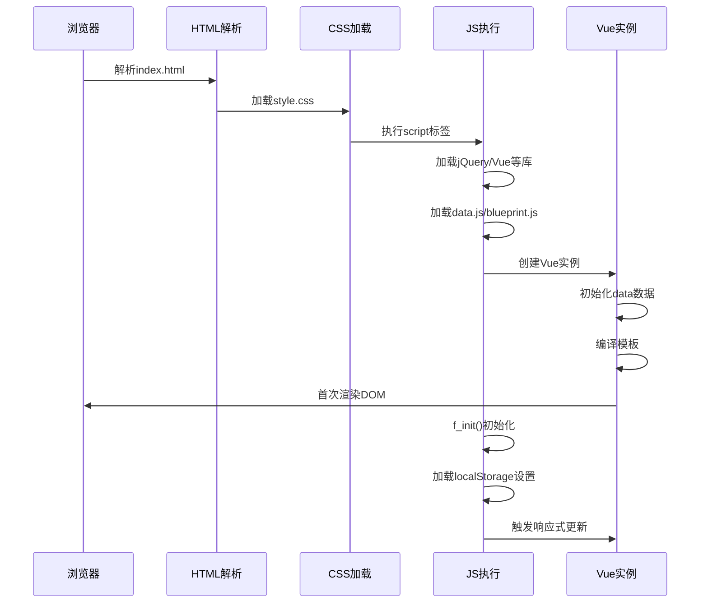
```mermaid
sequenceDiagram
    participant Browser as 浏览器
    participant HTML as HTML解析
    participant CSS as CSS加载
    participant JS as JS执行
    participant Vue as Vue实例

    Browser->>HTML: 解析index.html
    HTML->>CSS: 加载style.css
    CSS->>JS: 执行script标签
    JS->>JS: 加载jQuery/Vue等库
    JS->>JS: 加载data.js/blueprint.js
    JS->>Vue: 创建Vue实例
    Vue->>Vue: 初始化data数据
    Vue->>Vue: 编译模板#result
    Vue->>Browser: 首次渲染DOM
    JS->>JS: f_init()初始化
    JS->>JS: 加载localStorage设置
    JS->>Vue: 触发响应式更新
```

---

## 2. 页面布局结构

### 2.1 整体布局

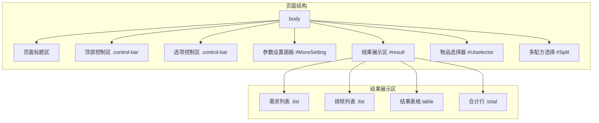
```mermaid
graph TD
    subgraph 页面结构
        A[body] --> B[页面标题区]
        A --> C[顶部控制区 .control-bar]
        A --> D[选项控制区 .control-bar]
        A --> E[参数设置面板 #MoreSetting]
        A --> F[结果展示区 #result]
        A --> G[物品选择器 #UIselector]
        A --> H[多配方选择 #Split]
    end

    subgraph 结果展示区
        F --> F1[需求列表 .list]
        F --> F2[排除列表 .list]
        F --> F3[结果表格 table]
        F --> F4[合计行 .total]
    end
```

### 2.2 DOM层级结构

```
body
├── div (页面标题区 - 内联样式)
│   ├── h1 (标题)
│   └── p (副标题)
├── div.control-bar (顶部控制区)
│   └── div (flex容器)
│       ├── div (每分钟产量输入)
│       ├── div (设备数量输入)
│       ├── a (添加按钮)
│       └── div.custom-dropdown (按钮组)
├── div.control-bar (选项控制区)
│   ├── div (设备选择行)
│   │   ├── input#hideSource + label
│   │   ├── select#selmodein
│   │   ├── select#furnace
│   │   ├── select#chemical
│   │   ├── select#accType
│   │   ├── select#accValue
│   │   └── select#research
│   └── div (增产剂选项行)
│       ├── input#selfAcc + label
│       ├── input#isAddSelfAccP + label
│       ├── input#showMaxOneBelt + label
│       └── span#projectdiv (方案管理)
├── div#Split (多配方选择 - 隐藏)
├── div#UIselector (物品选择器 - 隐藏)
├── div#MoreSetting (参数设置面板 - 隐藏)
└── div#result (Vue挂载点)
    ├── div.list (需求列表 - v-if条件)
    ├── div.list (排除列表 - v-if条件)
    └── div.list (结果表格容器)
        └── table
            ├── tr.header (表头)
            ├── tr (items0 - 独立生产)
            ├── tr (items - 计算结果)
            └── tr.total (合计)
```

---

## 3. UI组件详细分析

### 3.1 页面标题组件

**位置**: body > div (第一个子元素)

**HTML结构**:

```html
<div style="text-align: center; margin-bottom: 10px; padding: 10px 0;">
  <h1
    style="margin: 0; font-size: 28px; font-weight: 600; 
      background: linear-gradient(135deg, #2980b9, #3498db, #1abc9c); 
      -webkit-background-clip: text; 
      -webkit-text-fill-color: transparent;"
  >
    戴森球计划量产量化计算器
  </h1>
  <p style="margin: 8px 0 0 0; color: #6b7280; font-size: 14px;">
    全自动计算量产产品的具体产能需求
  </p>
</div>
```

**样式特点**:

- 渐变文字效果 (linear-gradient + background-clip)
- 居中对齐
- 副标题灰色调

### 3.2 顶部控制区组件

**位置**: body > div.control-bar (第一个)

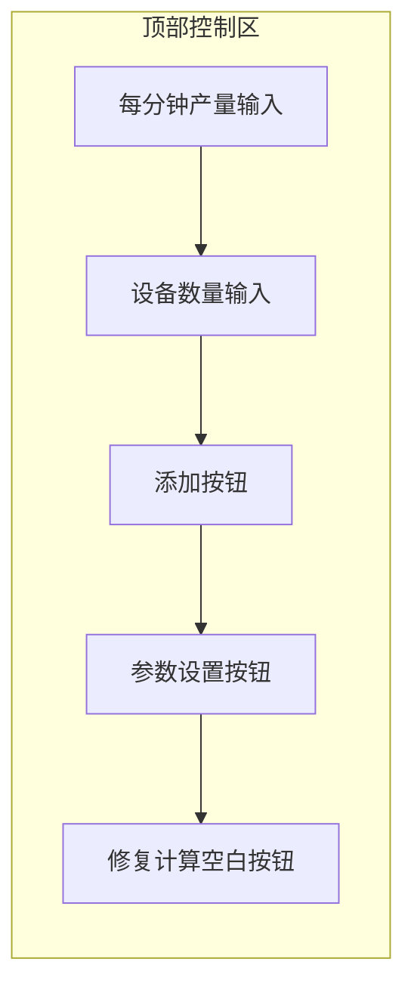
```mermaid
graph LR
    subgraph 顶部控制区
        A[每分钟产量输入] --> B[设备数量输入]
        B --> C[添加按钮]
        C --> D[参数设置按钮]
        D --> E[修复计算空白按钮]
    end
```

**组件清单**:

| 元素       | ID         | 类型   | 功能                  |
| ---------- | ---------- | ------ | --------------------- |
| 产量输入   | txtnumber  | text   | 输入每分钟目标产量    |
| 设备数输入 | selmaince  | number | 输入设备数量          |
| 添加按钮   | -          | a      | 触发f_add()显示选择器 |
| 参数设置   | btnSetting | button | 切换MoreSetting显示   |
| 修复空白   | btnReset1  | button | 重置所有设置          |

**动态行为**:

```javascript
// 输入框宽度自适应
oninput = "this.style.width = (parseFloat(this.value) >= 999 ? 150 : 70) + 'px'"
```

### 3.3 选项控制区组件

**位置**: body > div.control-bar (第二个)

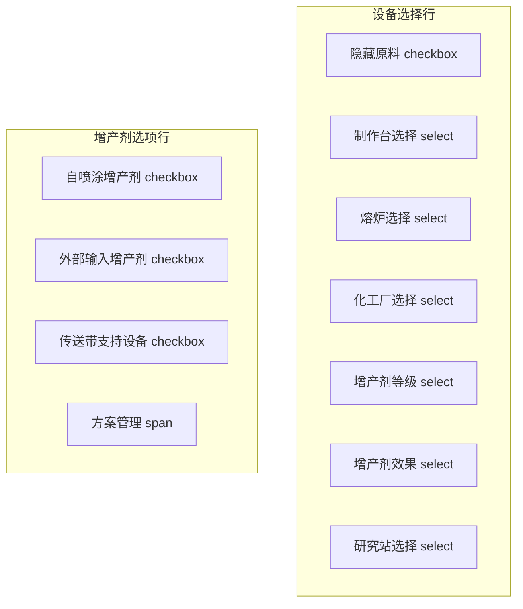
```mermaid
graph TD
    subgraph 设备选择行
        A1[隐藏原料 checkbox]
        A2[制作台选择 select]
        A3[熔炉选择 select]
        A4[化工厂选择 select]
        A5[增产剂等级 select]
        A6[增产剂效果 select]
        A7[研究站选择 select]
    end

    subgraph 增产剂选项行
        B1[自喷涂增产剂 checkbox]
        B2[外部输入增产剂 checkbox]
        B3[传送带支持设备 checkbox]
        B4[方案管理 span]
    end
```

**下拉选项配置**:

| 组件ID    | 选项值                       | 默认值     |
| --------- | ---------------------------- | ---------- |
| selmodein | 制作台Mk.Ⅰ/Ⅱ/Ⅲ, 重组式制造台 | 制作台Mk.Ⅰ |
| furnace   | 电弧熔炉, 位面熔炉, 负熵熔炉 | 电弧熔炉   |
| chemical  | 化工厂, 量子化工厂           | 化工厂     |
| accType   | 增产剂Mk.Ⅰ/Ⅱ/Ⅲ               | 增产剂Mk.Ⅰ |
| accValue  | 无, 加速, 增产               | 无         |
| research  | 矩阵研究站, 自演化研究站     | 矩阵研究站 |

### 3.4 参数设置面板组件

**位置**: div#MoreSetting

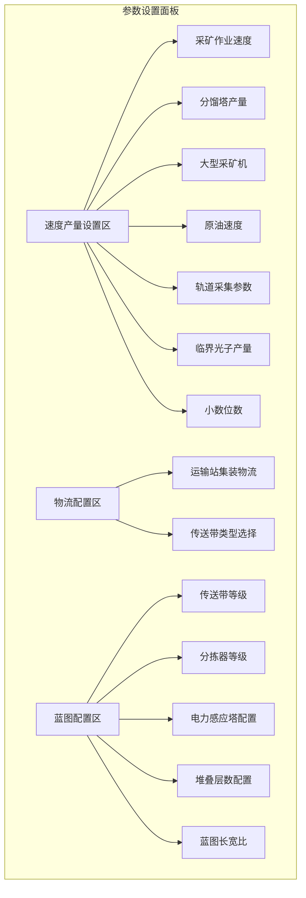
```mermaid
graph TD
    subgraph 参数设置面板
        A[速度产量设置区] --> A1[采矿作业速度]
        A --> A2[分馏塔产量]
        A --> A3[大型采矿机]
        A --> A4[原油速度]
        A --> A5[轨道采集参数]
        A --> A6[临界光子产量]
        A --> A7[小数位数]

        B[物流配置区] --> B1[运输站集装物流]
        B --> B2[传送带类型选择]

        C[蓝图配置区] --> C1[传送带等级]
        C --> C2[分拣器等级]
        C --> C3[电力感应塔配置]
        C --> C4[堆叠层数配置]
        C --> C5[蓝图长宽比]
    end
```

**配置项清单**:

| 分类     | 元素ID                 | 参数说明           |
| -------- | ---------------------- | ------------------ |
| 速度设置 | selore                 | 采矿作业速度百分比 |
| 速度设置 | fractionatorSpeed      | 分馏塔每分钟产量   |
| 速度设置 | speed1_6               | 大型采矿机效率     |
| 速度设置 | oilSpeed               | 原油速度           |
| 速度设置 | speed1_1~speed1_4      | 轨道采集参数       |
| 速度设置 | gzSpeed                | 临界光子产量       |
| 速度设置 | pointLength            | 小数位数           |
| 物流配置 | speed1_5               | 传送带堆叠层数     |
| 物流配置 | csd                    | 传送带类型         |
| 蓝图配置 | onlyConveyorBeltMk3    | 仅三级传送带       |
| 蓝图配置 | onlySorterMk3          | 仅三级分拣器       |
| 蓝图配置 | useSorterMk4           | 使用四级分拣器     |
| 蓝图配置 | generateTeslaTower     | 自动插入电力感应塔 |
| 蓝图配置 | teslaTowerLineInterval | 感应塔间隔         |
| 蓝图配置 | conveyorBeltStackLayer | 传送带堆叠层数     |
| 蓝图配置 | maxLabLayers           | 研究站层数         |
| 蓝图配置 | stackLayers            | 建筑堆叠层数       |
| 蓝图配置 | x_y_ratio              | 蓝图长宽比         |

### 3.5 需求列表组件

**位置**: div#result > div.list (第一个)

**Vue模板结构**:

```html
<div class="list" v-if="xqs && xqs.length">
  <span v-for="(x,index) in xqs">
    <!-- 物品图标 -->
    
    <!-- 物品名称（无图标时） -->
    <span class="name" v-else>{{x.item.name}}</span>
    *
    <!-- 数量显示与编辑 -->
    <span class="item_number" @click="onClickNumber(index)">
      <span>{{ x.number.toFixed(pointLength) }}</span>
      <div v-if="xps_editor_index === index" class="number_editor_container">
        <input
          class="number_editor"
          type="number"
          v-model.number="xps_editor_number"
          @blur="submitEditorNumber()"
          @keydown="..."
        />
      </div>
    </span>
  </span>
  <!-- 操作按钮组 -->
  <button onclick="f_reset()">重置</button>
  <button onclick="f_save()">保存方案</button>
  <button onclick="generateBlueprint()">生成蓝图</button>
</div>
```

**交互行为**:

| 操作     | 触发方式          | 处理函数             |
| -------- | ----------------- | -------------------- |
| 右键图标 | contextmenu       | removeItem(index)    |
| 点击数量 | click             | onClickNumber(index) |
| 编辑确认 | blur/change/Enter | submitEditorNumber() |
| 编辑取消 | Escape            | cancelEditorNumber() |

### 3.6 排除列表组件

**位置**: div#result > div.list (第二个)

**Vue模板结构**:

```html
<div class="list" v-if="ig_names && ig_names.length">
  排除计算：
  <span v-for="name in ig_names">
    
    <span class="name" v-else>{{name}}</span>
  </span>
  <button onclick="f_reset_ig()">重置</button>
  <small>(右键可取消单项排除)</small>
</div>
```

### 3.7 结果表格组件

**位置**: div#result > div.list > table

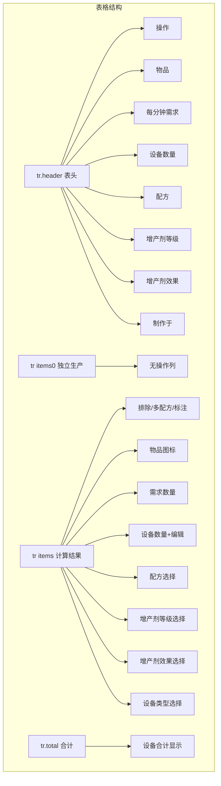
```mermaid
graph TD
    subgraph 表格结构
        A[tr.header 表头] --> A1[操作]
        A --> A2[物品]
        A --> A3[每分钟需求]
        A --> A4[设备数量]
        A --> A5[配方]
        A --> A6[增产剂等级]
        A --> A7[增产剂效果]
        A --> A8[制作于]

        B[tr items0 独立生产] --> B1[无操作列]

        C[tr items 计算结果] --> C1[排除/多配方/标注]
        C --> C2[物品图标]
        C --> C3[需求数量]
        C --> C4[设备数量+编辑]
        C --> C5[配方选择]
        C --> C6[增产剂等级选择]
        C --> C7[增产剂效果选择]
        C --> C8[设备类型选择]

        D[tr.total 合计] --> D1[设备合计显示]
    end
```

**表头定义**:

```html
<tr class="header">
  <td style="width:100px;">操作</td>
  <td style="width:100px;">物品<br /><span>(点击图标显示详情)</span></td>
  <td style="width:100px;">每分钟需求<br /><span>(负数代表多余)</span></td>
  <td style="width:100px;">设备数量<br /><span>(点击数字修改)</span></td>
  <td>配方<br /><span>(可选)</span></td>
  <td>增产剂等级<br /><span>(可选)</span></td>
  <td>增产剂效果<br /><span>(可选)</span></td>
  <td>制作于<br /><span>(可选)</span></td>
</tr>
```

**结果行模板**:

```html
<tr v-for="(item, index_item) in items" v-bind:class="item.rowClass">
  <!-- 操作列 -->
  <td class="opcell">
    <a onclick="f_ig(this)">排除</a>
    <a v-if="item.pf && item.pf.length > 1" onclick="f_split(this)">多配方</a>
    <a onclick="f_tag(this)">标注</a>
  </td>
  <!-- 物品列 -->
  <td class="cell-name" v-bind:data-name="item.name">
    
  </td>
  <!-- 需求数量 -->
  <td><span class="number1">{{item.number1}}</span></td>
  <!-- 设备数量（可编辑） -->
  <td class="cell-infra">
    <span class="number2" v-html="item.number2img"></span>
    <span class="item_number" @click="onClickNumberItem(index_item)">
      <span class="number2">{{item.number2}}</span>
      <div v-if="items_editor_index === index_item" class="number_editor_container">
        <input class="number_editor" type="number" v-model.number="items_editor_number" />
      </div>
    </span>
  </td>
  <!-- 配方选择 -->
  <td>
    <div class="pfs">
      <a v-for="pf in item.pf" v-bind:class="pf.class" v-bind:href="pf.href" v-html="pf.title"></a>
    </div>
  </td>
  <!-- 增产剂等级 -->
  <td>
    <div class="ms">
      <a v-for="a in item.accType" v-bind:class="a.class" v-bind:href="a.href">
        
        {{a.showName}}
      </a>
    </div>
  </td>
  <!-- 增产剂效果 -->
  <td>
    <div class="ms">
      <a v-for="a in item.accValue" v-bind:class="a.class" v-bind:href="a.href"> {{a.showName}} </a>
    </div>
    <span class="number1">需求：{{item.accTotal}}</span>
  </td>
  <!-- 设备类型 -->
  <td>
    <div class="ms">
      <a v-for="m in item.m" v-bind:class="m.class" v-bind:href="m.href">
        
        {{m.showName}}
      </a>
    </div>
  </td>
</tr>
```

### 3.8 物品选择器组件

**位置**: div#UIselector

**显示逻辑**:

```javascript
function f_add() {
  var $uiSelector = $('#UIselector')
  if ($uiSelector.hasClass('show')) {
    $uiSelector.removeClass('show')
    setTimeout(function () {
      $uiSelector.hide()
    }, 250)
  } else {
    $uiSelector.show()
    setTimeout(function () {
      $uiSelector.addClass('show')
    }, 10)
  }
}
```

**CSS动画**:

```css
#UIselector {
  display: none;
  position: absolute;
  opacity: 0;
  transform: scale(0.9);
  transition: all 0.25s ease;
}
#UIselector.show {
  display: block;
  opacity: 1;
  transform: scale(1);
}
```

**关闭逻辑**:

```javascript
$(document).click(function (e) {
  if (!$(e.target).closest('#UIselector').length) {
    $('#UIselector').hide()
  }
})
```

### 3.9 多配方选择组件

**位置**: div#Split

**生成逻辑**:

```javascript
function f_split(obj) {
  var name = $(obj).attr('data-name')
  $('#Split').html('<p>选择配方：</p>')
  var pfs = getPfs(name)

  for (var i = 0; i < pfs.length; i++) {
    ;(function (i) {
      var jlink = $("<div class='split-pf'></div>")
      jlink.html(getPfTitle(pfs[i]))
      jlink.appendTo($('#Split')).click(function () {
        selected = pfs[i]
        $('#Split .split-pf').removeClass('split-pf-selected')
        jlink.addClass('split-pf-selected')
      })
    })(i)
  }

  $('#Split').append('<p>设备数量：</p>')
  $('#Split').append("<div><input type='text' value='1' class='split-number' /></div>")
  $('#Split').append('<div><button>确定</button></div>')

  $('#Split')
    .find('button')
    .click(function () {
      singleMake.push({
        id: selected.id,
        number: parseFloat($('#Split').find(':text').val())
      })
      update_all()
      $('#Split').hide()
    })
}
```

---

## 4. Vue数据绑定

### 4.1 Vue实例定义

```javascript
app = new Vue({
  el: '#result',
  data: {
    totalEnergy: 0,
    totalSpace: 0,
    totalAcc: 0,
    total: [],
    totalDisplay: [],
    xqs: [],
    icons: icons,
    items: [],
    items2: [],
    items0: [],
    ig_names: [],
    pointLength: 1,
    xps_editor_index: -1,
    xps_editor_number: 0,
    items_editor_index: -1,
    items_editor_number: 0
  },
  methods: {
    onClickNumber: function (index) {
      /* ... */
    },
    onClickNumberItem: function (index) {
      /* ... */
    },
    submitEditorNumber: function () {
      /* ... */
    },
    submitEditorNumberItem: function () {
      /* ... */
    },
    cancelEditorNumber: function () {
      /* ... */
    },
    cancelEditorNumberItem: function () {
      /* ... */
    },
    removeItem: function (index) {
      /* ... */
    }
  }
})
```

### 4.2 数据绑定映射

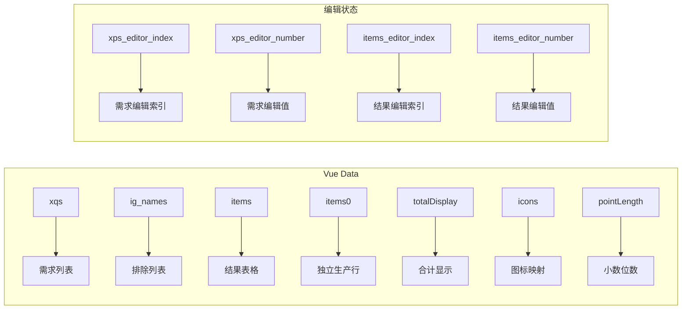
```mermaid
graph LR
    subgraph Vue Data
        D1[xqs] --> V1[需求列表]
        D2[ig_names] --> V2[排除列表]
        D3[items] --> V3[结果表格]
        D4[items0] --> V4[独立生产行]
        D5[totalDisplay] --> V5[合计显示]
        D6[icons] --> V6[图标映射]
        D7[pointLength] --> V7[小数位数]
    end

    subgraph 编辑状态
        E1[xps_editor_index] --> E1a[需求编辑索引]
        E2[xps_editor_number] --> E2a[需求编辑值]
        E3[items_editor_index] --> E3a[结果编辑索引]
        E4[items_editor_number] --> E4a[结果编辑值]
    end
```

### 4.3 指令使用清单

| 指令             | 使用位置                                | 说明         |
| ---------------- | --------------------------------------- | ------------ |
| v-if             | .list, img, div.number_editor_container | 条件渲染     |
| v-for            | span, tr, a                             | 列表渲染     |
| v-bind:src       | img                                     | 动态图标路径 |
| v-bind:class     | tr, a                                   | 动态CSS类    |
| v-bind:data-name | td, a                                   | 数据属性绑定 |
| v-bind:title     | img                                     | 提示文本绑定 |
| v-bind:href      | a                                       | 链接地址绑定 |
| v-html           | a, span                                 | HTML内容渲染 |
| v-model.number   | input                                   | 双向数值绑定 |
| @click           | span, a                                 | 点击事件     |
| @contextmenu     | img                                     | 右键事件     |
| @blur            | input                                   | 失焦事件     |
| @focus           | input                                   | 获焦事件     |
| @change          | input                                   | 值变更事件   |
| @keydown         | input                                   | 键盘事件     |

---

## 5. CSS样式模块

### 5.1 样式文件结构

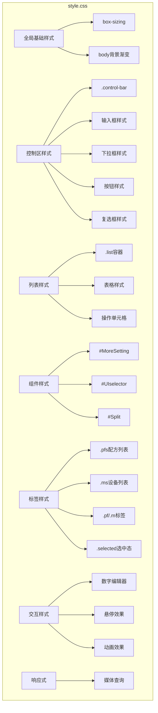
```mermaid
graph TD
    subgraph style.css
        A[全局基础样式] --> A1[box-sizing]
        A --> A2[body背景渐变]

        B[控制区样式] --> B1[.control-bar]
        B --> B2[输入框样式]
        B --> B3[下拉框样式]
        B --> B4[按钮样式]
        B --> B5[复选框样式]

        C[列表样式] --> C1[.list容器]
        C --> C2[表格样式]
        C --> C3[操作单元格]

        D[组件样式] --> D1[#MoreSetting]
        D --> D2[#UIselector]
        D --> D3[#Split]

        E[标签样式] --> E1[.pfs配方列表]
        E --> E2[.ms设备列表]
        E --> E3[.pf/.m标签]
        E --> E4[.selected选中态]

        F[交互样式] --> F1[数字编辑器]
        F --> F2[悬停效果]
        F --> F3[动画效果]

        G[响应式] --> G1[媒体查询]
    end
```

### 5.2 核心样式类

| 类名           | 用途           | 关键属性                                   |
| -------------- | -------------- | ------------------------------------------ |
| .control-bar   | 控制区容器     | backdrop-filter, border-radius, box-shadow |
| .list          | 列表容器       | background, border-radius, animation       |
| .pfs           | 配方列表容器   | flex-direction: column                     |
| .ms            | 设备列表容器   | flex-direction: row                        |
| .pf            | 配方标签       | 渐变背景, border-radius                    |
| .m             | 设备标签       | flex布局, 图标对齐                         |
| .selected      | 选中状态       | 蓝色渐变背景                               |
| .header        | 表头行         | 渐变背景, 居中                             |
| .total         | 合计行         | 渐变背景                                   |
| .xqsrow        | 需求行         | 红色背景                                   |
| .row-tag       | 标注行         | 灰色背景                                   |
| .opcell        | 操作单元格     | 链接样式                                   |
| .cell-name     | 物品名称单元格 | 图标显示                                   |
| .cell-infra    | 设备数量单元格 | 不换行                                     |
| .number1       | 需求数量       | 橙色高亮                                   |
| .number2       | 设备数量       | 常规样式                                   |
| .item_number   | 可编辑数量     | 悬停边框                                   |
| .number_editor | 数字编辑器     | 输入框样式                                 |
| .split-pf      | 配方选择项     | 悬停/选中效果                              |
| .textbox       | 文本输入框     | 边框, 圆角                                 |

### 5.3 动画效果

```css
@keyframes fadeIn {
  from {
    opacity: 0;
    transform: translateY(-10px);
  }
  to {
    opacity: 1;
    transform: translateY(0);
  }
}

.control-bar {
  animation: fadeIn 0.3s ease-out;
}
.list {
  animation: fadeIn 0.4s ease-out;
}

#UIselector {
  transition: all 0.25s ease;
  transform: scale(0.9);
}
#UIselector.show {
  transform: scale(1);
}
```

### 5.4 响应式设计

```css
@media (max-width: 768px) {
  body {
    padding: 10px !important;
  }
  .list {
    margin: 10px 5px;
    padding: 10px 15px;
  }
  select {
    min-width: 100px;
    font-size: 12px;
  }
  button {
    padding: 6px 12px;
    font-size: 12px;
  }
  h1 {
    font-size: 22px !important;
  }
}
```

---

## 6. 用户交互流程

### 6.1 添加需求流程

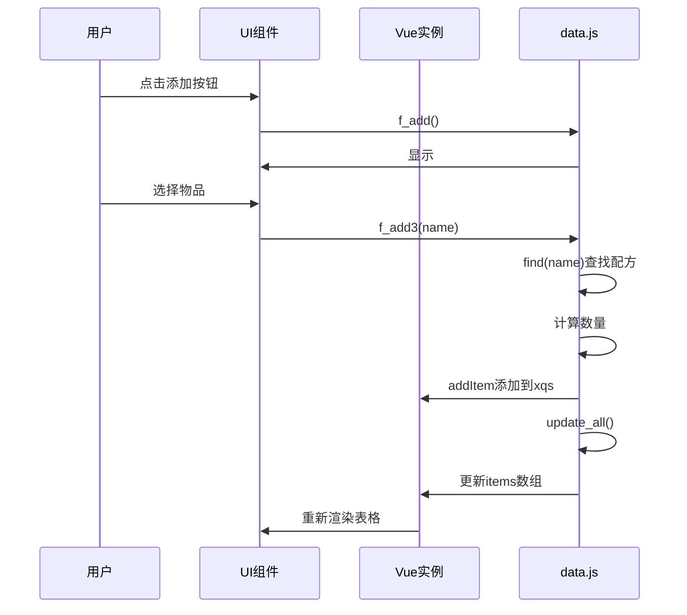
```mermaid
sequenceDiagram
    participant User as 用户
    participant UI as UI组件
    participant Vue as Vue实例
    participant Data as data.js

    User->>UI: 点击添加按钮
    UI->>Data: f_add()
    Data->>UI: 显示#UIselector
    User->>UI: 选择物品
    UI->>Data: f_add3(name)
    Data->>Data: find(name)查找配方
    Data->>Data: 计算数量
    Data->>Vue: addItem添加到xqs
    Data->>Data: update_all()
    Data->>Vue: 更新items数组
    Vue->>UI: 重新渲染表格
```

### 6.2 编辑数量流程

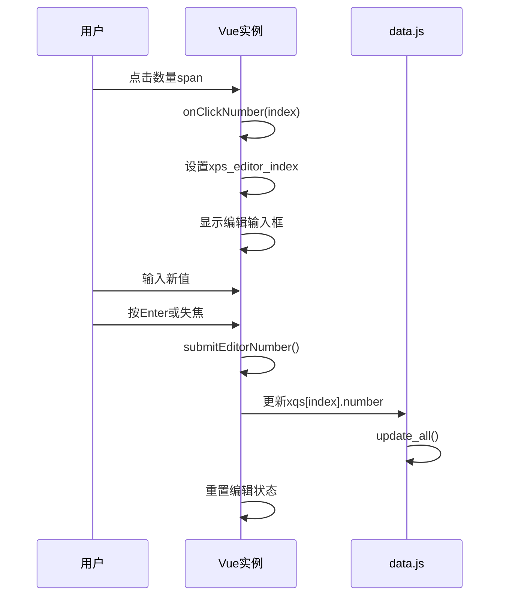
```mermaid
sequenceDiagram
    participant User as 用户
    participant Vue as Vue实例
    participant Data as data.js

    User->>Vue: 点击数量span
    Vue->>Vue: onClickNumber(index)
    Vue->>Vue: 设置xps_editor_index
    Vue->>Vue: 显示编辑输入框
    User->>Vue: 输入新值
    User->>Vue: 按Enter或失焦
    Vue->>Vue: submitEditorNumber()
    Vue->>Data: 更新xqs[index].number
    Data->>Data: update_all()
    Vue->>Vue: 重置编辑状态
```

### 6.3 选择配方流程

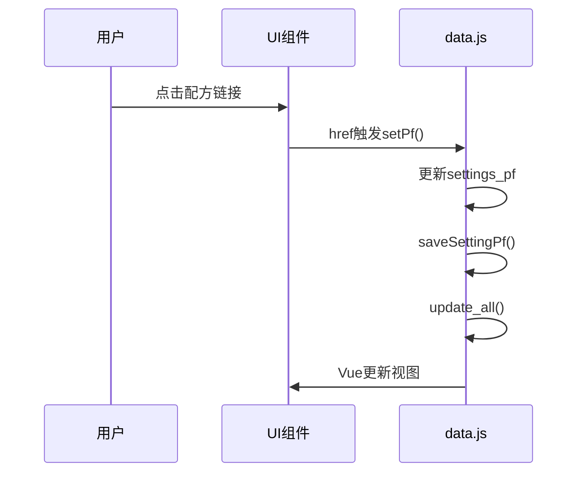
```mermaid
sequenceDiagram
    participant User as 用户
    participant UI as UI组件
    participant Data as data.js

    User->>UI: 点击配方链接
    UI->>Data: href触发setPf()
    Data->>Data: 更新settings_pf
    Data->>Data: saveSettingPf()
    Data->>Data: update_all()
    Data->>UI: Vue更新视图
```

### 6.4 多配方选择流程

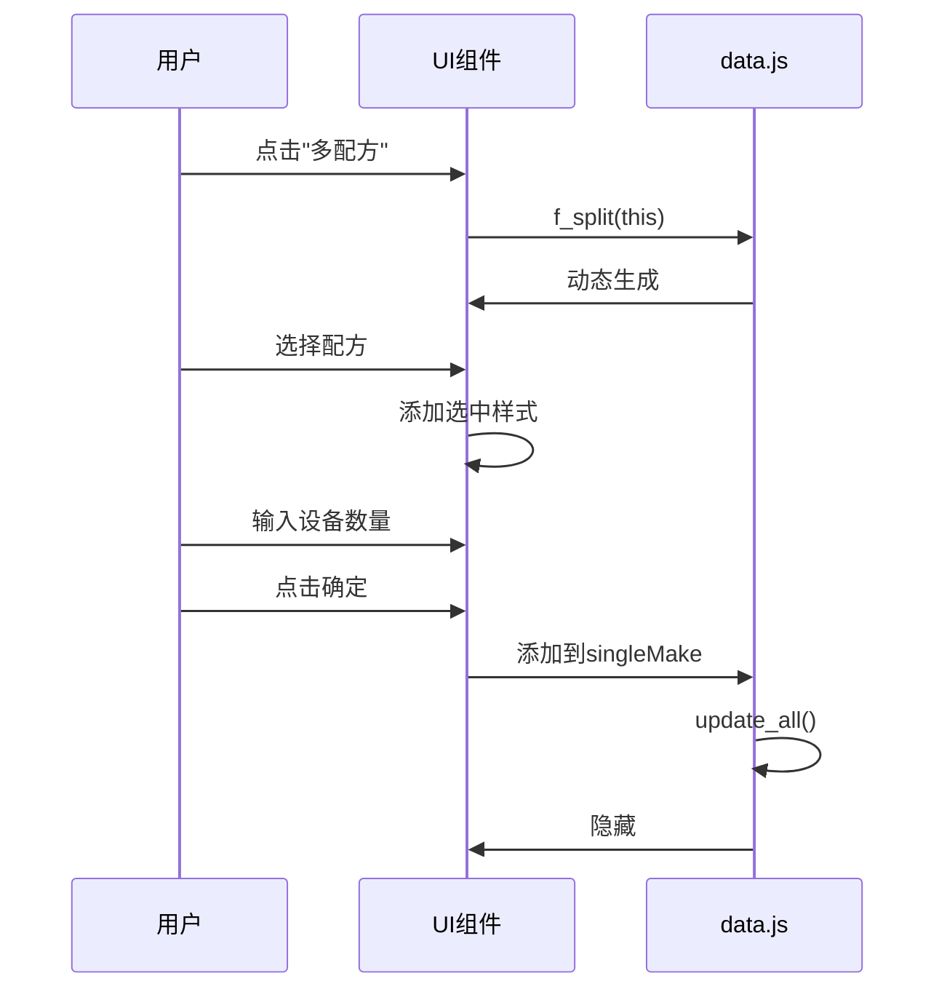
```mermaid
sequenceDiagram
    participant User as 用户
    participant UI as UI组件
    participant Data as data.js

    User->>UI: 点击"多配方"
    UI->>Data: f_split(this)
    Data->>UI: 动态生成#Split内容
    User->>UI: 选择配方
    UI->>UI: 添加选中样式
    User->>UI: 输入设备数量
    User->>UI: 点击确定
    UI->>Data: 添加到singleMake
    Data->>Data: update_all()
    Data->>UI: 隐藏#Split
```

### 6.5 生成蓝图流程

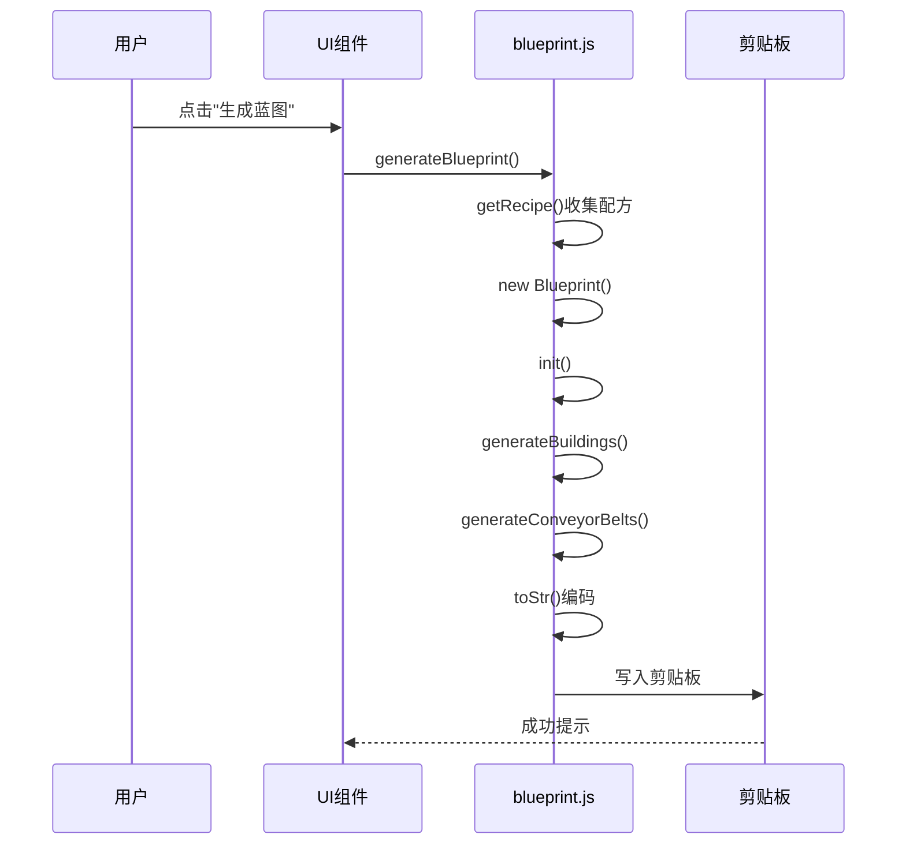
```mermaid
sequenceDiagram
    participant User as 用户
    participant UI as UI组件
    participant BP as blueprint.js
    participant Clip as 剪贴板

    User->>UI: 点击"生成蓝图"
    UI->>BP: generateBlueprint()
    BP->>BP: getRecipe()收集配方
    BP->>BP: new Blueprint()
    BP->>BP: init()
    BP->>BP: generateBuildings()
    BP->>BP: generateConveyorBelts()
    BP->>BP: toStr()编码
    BP->>Clip: 写入剪贴板
    Clip-->>UI: 成功提示
```

---

## 7. 事件处理机制

### 7.1 事件绑定方式

```mermaid
graph TD
    subgraph 内联事件
        A1[onclick=函数名]
        A2[onchange=表达式]
        A3[oninput=表达式]
    end

    subgraph Vue事件
        B1[@click=方法名]
        B2[@blur=方法名]
        B3[@keydown=条件判断]
        B4[@contextmenu=方法调用]
    end

    subgraph jQuery绑定
        C1[$selector.click]
        C2[$selector.change]
        C3[$document.click全局]
    end
```

### 7.2 事件处理函数清单

| 函数名                   | 触发方式               | 功能                |
| ------------------------ | ---------------------- | ------------------- |
| f_add()                  | onclick                | 显示/隐藏物品选择器 |
| f_add3(name)             | 选择器回调             | 添加物品到需求      |
| f_reset()                | onclick                | 清空需求列表        |
| f_save()                 | onclick                | 保存当前方案        |
| f_ig(obj)                | onclick                | 排除物品            |
| f_tag(obj)               | onclick                | 标注物品行          |
| f_split(obj)             | onclick                | 显示多配方选择      |
| f_reset_ig()             | onclick                | 清空排除列表        |
| f_remove_ig(name)        | oncontextmenu          | 移除单个排除        |
| generateBlueprint()      | onclick                | 生成蓝图            |
| onClickNumber(index)     | @click                 | 开始编辑需求数量    |
| onClickNumberItem(index) | @click                 | 开始编辑设备数量    |
| submitEditorNumber()     | @blur/@change/@keydown | 提交需求编辑        |
| submitEditorNumberItem() | @blur/@change/@keydown | 提交设备编辑        |
| cancelEditorNumber()     | @keydown Escape        | 取消需求编辑        |
| cancelEditorNumberItem() | @keydown Escape        | 取消设备编辑        |
| removeItem(index)        | @contextmenu           | 移除需求项          |

### 7.3 全局事件监听

```javascript
// 点击外部关闭选择器
$(document).click(function (e) {
  if (!$(e.target).closest('#UIselector').length) {
    $('#UIselector').hide()
  }
  if (!$(e.target).closest('#Split').length) {
    $('#Split').hide()
  }
})
```

---

## 8. 动态UI更新机制

### 8.1 Vue响应式更新

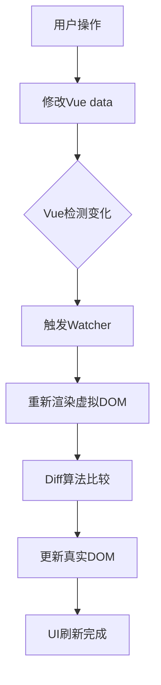
```mermaid
flowchart TD
    A[用户操作] --> B[修改Vue data]
    B --> C{Vue检测变化}
    C --> D[触发Watcher]
    D --> E[重新渲染虚拟DOM]
    E --> F[Diff算法比较]
    F --> G[更新真实DOM]
    G --> H[UI刷新完成]
```

### 8.2 数据更新触发链

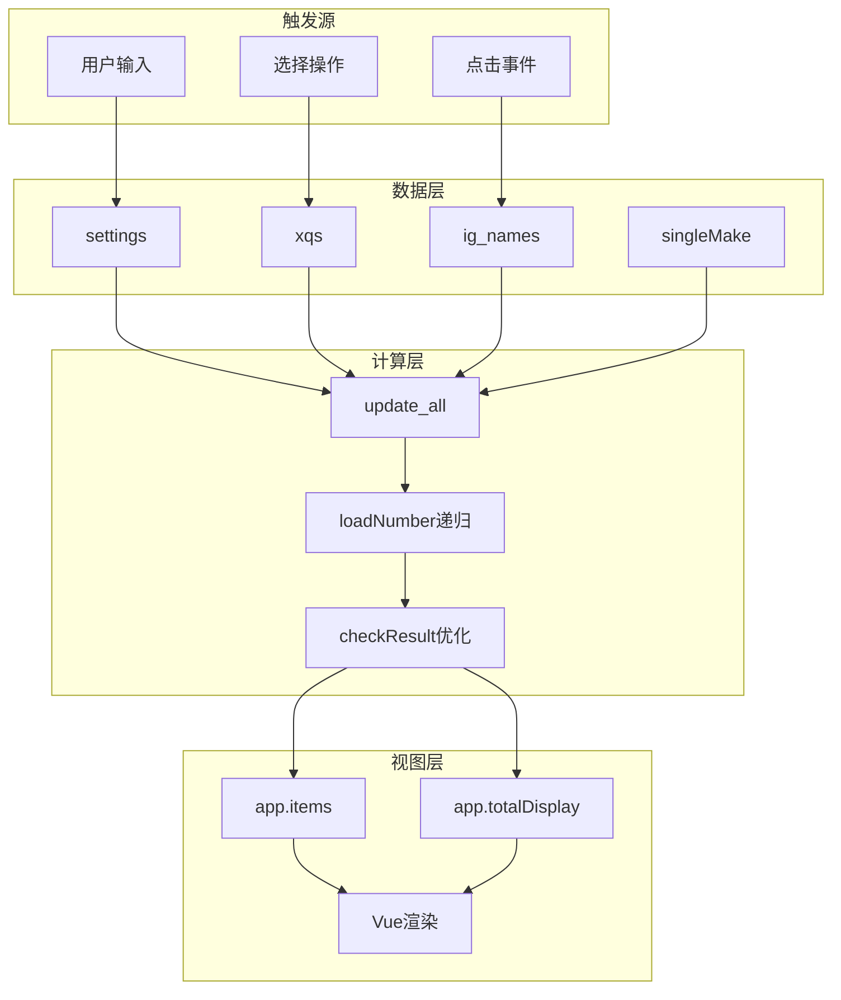
```mermaid
flowchart TD
    subgraph 触发源
        A1[用户输入]
        A2[选择操作]
        A3[点击事件]
    end

    subgraph 数据层
        B1[settings]
        B2[xqs]
        B3[ig_names]
        B4[singleMake]
    end

    subgraph 计算层
        C1[update_all]
        C2[loadNumber递归]
        C3[checkResult优化]
    end

    subgraph 视图层
        D1[app.items]
        D2[app.totalDisplay]
        D3[Vue渲染]
    end

    A1 --> B1
    A2 --> B2
    A3 --> B3
    B1 --> C1
    B2 --> C1
    B3 --> C1
    B4 --> C1
    C1 --> C2
    C2 --> C3
    C3 --> D1
    C3 --> D2
    D1 --> D3
    D2 --> D3
```

### 8.3 动态内容生成

**配方选择链接**:

```javascript
// data.js中生成配方链接
item.pf = []
for (var i = 0; i < pfs.length; i++) {
  item.pf.push({
    title: getPfTitle(pfs[i]),
    class: pfs[i].id == currentPfId ? 'pf selected' : 'pf',
    href: "javascript:setPf('" + item.name + "', " + pfs[i].id + ')'
  })
}
```

**设备选择链接**:

```javascript
// data.js中生成设备链接
item.m = []
for (var i = 0; i < machines.length; i++) {
  item.m.push({
    name: machines[i],
    showName: machines[i],
    itemName: item.name,
    class: machines[i] == currentMachine ? 'm selected' : 'm',
    href: "javascript:setM('" + item.name + "', '" + machines[i] + "')"
  })
}
```

---

## 9. 重构建议

### 9.1 组件化拆分建议

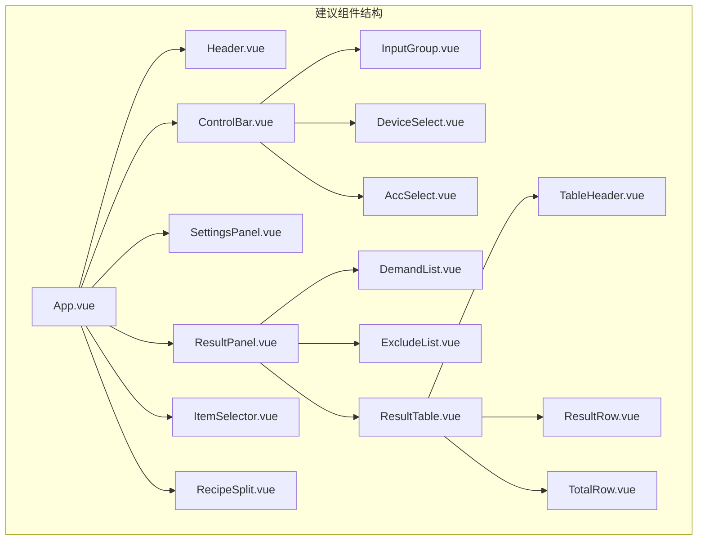
```mermaid
graph TD
    subgraph 建议组件结构
        App[App.vue] --> Header[Header.vue]
        App --> ControlBar[ControlBar.vue]
        App --> SettingsPanel[SettingsPanel.vue]
        App --> ResultPanel[ResultPanel.vue]

        ControlBar --> InputGroup[InputGroup.vue]
        ControlBar --> DeviceSelect[DeviceSelect.vue]
        ControlBar --> AccSelect[AccSelect.vue]

        ResultPanel --> DemandList[DemandList.vue]
        ResultPanel --> ExcludeList[ExcludeList.vue]
        ResultPanel --> ResultTable[ResultTable.vue]

        ResultTable --> TableHeader[TableHeader.vue]
        ResultTable --> ResultRow[ResultRow.vue]
        ResultTable --> TotalRow[TotalRow.vue]

        App --> ItemSelector[ItemSelector.vue]
        App --> RecipeSplit[RecipeSplit.vue]
    end
```

### 9.2 状态管理建议

```javascript
// 建议使用Vuex或Pinia
const store = {
  state: {
    // 输入状态
    demand: {
      targetRate: 60,
      deviceCount: null,
      items: [] // xqs
    },
    // 设置状态
    settings: {
      machine: {}, // settings
      speed: {}, // settings_time
      recipe: {}, // settings_pf
      local: {} // settingsLocal
    },
    // 计算结果
    result: {
      items: [],
      items0: [],
      totalDisplay: [],
      exclusions: [] // ig_names
    },
    // UI状态
    ui: {
      showSettings: false,
      showSelector: false,
      showSplit: false,
      editingIndex: -1
    }
  }
}
```

### 9.3 样式重构建议

| 当前问题                | 建议方案               |
| ----------------------- | ---------------------- |
| 内联样式过多            | 迁移到CSS类或CSS-in-JS |
| 类名语义不清(.pfs, .ms) | 重命名为语义化类名     |
| 重复的渐变定义          | 提取为CSS变量          |
| 动画散落各处            | 统一到animations.css   |
| 响应式不完整            | 补充更多断点           |

### 9.4 事件处理重构建议

| 当前方式              | 建议方式        |
| --------------------- | --------------- |
| onclick内联           | Vue @click绑定  |
| href="javascript:..." | @click.prevent  |
| 全局函数              | 组件methods     |
| jQuery事件监听        | Vue生命周期钩子 |

### 9.5 迁移注意事项

1. **Vue实例挂载点**: 当前挂载在#result，重构时需确保组件边界清晰

2. **全局变量依赖**: icons、pointLength等全局变量需通过props或store传递

3. **动态HTML生成**: v-html绑定的内容需确保XSS安全

4. **事件冒泡**: 右键菜单等事件需正确处理preventDefault

5. **动画过渡**: CSS transition需与Vue transition组件配合

---

## 附录：UI元素ID索引

| ID                     | 元素类型     | 所属模块 | 功能         |
| ---------------------- | ------------ | -------- | ------------ |
| txtnumber              | input:text   | 顶部控制 | 产量输入     |
| selmaince              | input:number | 顶部控制 | 设备数输入   |
| btnSetting             | button       | 顶部控制 | 参数设置开关 |
| btnReset1              | button       | 顶部控制 | 重置设置     |
| hideSource             | checkbox     | 选项控制 | 隐藏原料     |
| selmodein              | select       | 选项控制 | 制作台选择   |
| furnace                | select       | 选项控制 | 熔炉选择     |
| chemical               | select       | 选项控制 | 化工厂选择   |
| accType                | select       | 选项控制 | 增产剂等级   |
| accValue               | select       | 选项控制 | 增产剂效果   |
| research               | select       | 选项控制 | 研究站选择   |
| selfAcc                | checkbox     | 选项控制 | 自喷涂增产剂 |
| isAddSelfAccP          | checkbox     | 选项控制 | 外部增产剂   |
| showMaxOneBelt         | checkbox     | 选项控制 | 传送带支持数 |
| projectdiv             | span         | 选项控制 | 方案管理容器 |
| selprojects            | select       | 方案管理 | 方案选择     |
| btnLoadProject         | button       | 方案管理 | 加载方案     |
| btnReset5              | button       | 方案管理 | 重置方案     |
| MoreSetting            | div          | 参数面板 | 参数设置容器 |
| selore                 | input:number | 参数面板 | 采矿速度     |
| fractionatorSpeed      | input:number | 参数面板 | 分馏塔产量   |
| speed1_1~speed1_6      | input:number | 参数面板 | 轨道采集参数 |
| oilSpeed               | input:number | 参数面板 | 原油速度     |
| gzSpeed                | input:number | 参数面板 | 光子产量     |
| pointLength            | input:number | 参数面板 | 小数位数     |
| csd                    | select       | 参数面板 | 传送带类型   |
| onlyConveyorBeltMk3    | checkbox     | 参数面板 | 三级传送带   |
| onlySorterMk3          | checkbox     | 参数面板 | 三级分拣器   |
| useSorterMk4           | checkbox     | 参数面板 | 四级分拣器   |
| generateTeslaTower     | checkbox     | 参数面板 | 电力感应塔   |
| teslaTowerLineInterval | input:number | 参数面板 | 感应塔间隔   |
| conveyorBeltStackLayer | input:number | 参数面板 | 传送带堆叠   |
| maxLabLayers           | input:number | 参数面板 | 研究站层数   |
| stackLayers            | input:number | 参数面板 | 建筑堆叠     |
| x_y_ratio              | input:number | 参数面板 | 蓝图长宽比   |
| result                 | div          | 结果区   | Vue挂载点    |
| UIselector             | div          | 弹出层   | 物品选择器   |
| Split                  | div          | 弹出层   | 多配方选择   |

---

## 10. 核心逻辑流程详解

### 10.1 初始化阶段核心逻辑

#### 10.1.1 页面加载流程

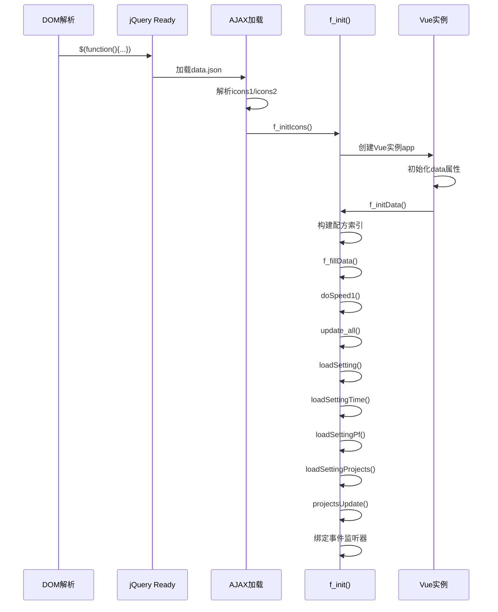
```mermaid
sequenceDiagram
    participant DOM as DOM解析
    participant jQuery as jQuery Ready
    participant AJAX as AJAX加载
    participant Init as f_init()
    participant Vue as Vue实例

    DOM->>jQuery: $(function(){...})
    jQuery->>AJAX: 加载data.json
    AJAX->>AJAX: 解析icons1/icons2
    AJAX->>Init: f_initIcons()
    Init->>Vue: 创建Vue实例app
    Vue->>Vue: 初始化data属性
    Vue->>Init: f_initData()
    Init->>Init: 构建配方索引
    Init->>Init: f_fillData()
    Init->>Init: doSpeed1()
    Init->>Init: update_all()
    Init->>Init: loadSetting()
    Init->>Init: loadSettingTime()
    Init->>Init: loadSettingPf()
    Init->>Init: loadSettingProjects()
    Init->>Init: projectsUpdate()
    Init->>Init: 绑定事件监听器
```

#### 10.1.2 Vue实例初始化

```javascript
app = new Vue({
  el: '#result',
  data: {
    totalEnergy: 0, // 总耗能(MW)
    totalSpace: 0, // 总占地格子数
    totalAcc: 0, // 总增产剂数量
    total: [], // 设备合计数组
    totalDisplay: [], // 计算属性，格式化显示
    xqs: [], // 需求列表 [{item, number}]
    icons: icons, // 图标Base64映射
    items: [], // 计算结果行
    items2: [], // 多余产物行
    items0: [], // 独立生产行
    ig_names: [], // 排除物品名数组
    xps_editor_index: -1, // 需求数量编辑索引
    xps_editor_number: 0, // 需求数量编辑值
    items_editor_index: -1, // 设备数量编辑索引
    items_editor_number: 0 // 设备数量编辑值
  },
  methods: {
    // 需求数量点击编辑
    onClickNumber: function (index) {
      this.xps_editor_index = index
      this.xps_editor_number = this.xqs[index].number
      Vue.nextTick(() => {
        this.$refs.input[0].focus()
      })
    },
    // 设备数量点击编辑
    onClickNumberItem: function (index_item) {
      this.items_editor_index = index_item
      this.items_editor_number = this.items[index_item].number2
      Vue.nextTick(() => {
        this.$refs.input[0].focus()
      })
    },
    // 提交需求数量编辑
    submitEditorNumber: function () {
      if (this.xqs[this.xps_editor_index] && this.xps_editor_number > 0) {
        this.xqs[this.xps_editor_index].number = this.xps_editor_number
        update_all()
      }
      this.xps_editor_index = -1
    },
    // 提交设备数量编辑（运行两遍防浮点误差）
    submitEditorNumberItem: function () {
      if (this.items[this.items_editor_index] && this.items_editor_number > 0) {
        var multiple = this.items_editor_number / this.items[this.items_editor_index].number2
        for (var i = 0; i < this.xqs.length; i++) {
          this.xqs[i].number *= multiple
        }
        update_all()
        // 第二遍修正
        multiple = this.items_editor_number / this.items[this.items_editor_index].number2
        for (var i = 0; i < this.xqs.length; i++) {
          this.xqs[i].number *= multiple
        }
        update_all()
      }
      this.items_editor_index = -1
    },
    // 移除需求项
    removeItem: function (index) {
      this.xqs.splice(index, 1)
      update_all()
    }
  },
  computed: {
    totalDisplay: function () {
      return this.total.map(function (item) {
        return {
          name: item.name,
          value: item.value,
          energy: item.energy ? item.energy.toFixed(2) : '0.00',
          space: item.space ? Math.round(item.space) : 0
        }
      })
    }
  }
})
```

#### 10.1.3 配方数据初始化

```javascript
function f_initData() {
  // 清空索引
  recipeIndexByProduct = {}
  recipeIndexByMaterial = {}

  $(data).each(function (i, item) {
    // 设置配方ID
    item.id = i

    // 构建产物索引（产物名 → 配方索引数组）
    for (var j = 0; j < item.s.length; j++) {
      var productName = item.s[j].name
      if (!recipeIndexByProduct[productName]) {
        recipeIndexByProduct[productName] = []
      }
      recipeIndexByProduct[productName].push(i)
    }

    // 构建原料索引（原料名 → 配方索引数组）
    if (item.q) {
      for (var j = 0; j < item.q.length; j++) {
        var materialName = item.q[j].name
        if (!recipeIndexByMaterial[materialName]) {
          recipeIndexByMaterial[materialName] = []
        }
        recipeIndexByMaterial[materialName].push(i)
      }
    }

    // 设置设备速度映射
    var ms = []
    if (item.m == '研究站') {
      ms = [
        { name: '矩阵研究站', speed: 1 },
        { name: '自演化研究站', speed: 3 }
      ]
    }
    if (item.m == '制作台') {
      ms = [
        { name: '制作台Mk.Ⅰ', speed: 0.75 },
        { name: '制作台Mk.Ⅱ', speed: 1 },
        { name: '制作台Mk.Ⅲ', speed: 1.5 },
        { name: '重组式制造台', speed: 3 }
      ]
    }
    if (item.m == '冶炼设备') {
      ms = [
        { name: '电弧熔炉', speed: 1 },
        { name: '位面熔炉', speed: 2 },
        { name: '负熵熔炉', speed: 3 }
      ]
    }
    if (item.m == '化工设备') {
      ms = [
        { name: '化工厂', speed: 1 },
        { name: '量子化工厂', speed: 2 }
      ]
    }
    if (item.m == '采矿机') {
      ms = [
        { name: '采矿机', speed: 0.5 * 6 }, // 6个矿脉
        { name: '大型采矿机', speed: 1 * 20 }, // 20个矿脉
        { name: '矿脉', speed: 0.5 * 1 }
      ]
    }
    // ... 其他设备类型

    item.mName = item.m // 保存原始设备类型名
    item.m = ms // 替换为设备数组
  })
}
```

### 10.2 需求计算核心逻辑

#### 10.2.1 计算流程总览

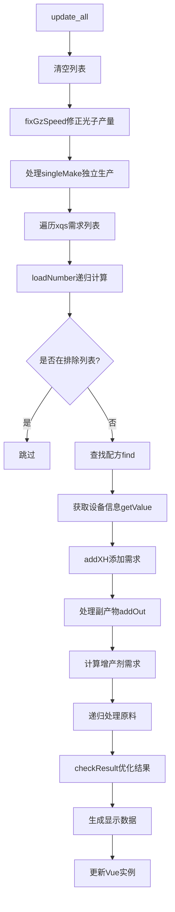
```mermaid
flowchart TD
    A[update_all] --> B[清空列表]
    B --> C[fixGzSpeed修正光子产量]
    C --> D[处理singleMake独立生产]
    D --> E[遍历xqs需求列表]
    E --> F[loadNumber递归计算]
    F --> G{是否在排除列表?}
    G -->|是| H[跳过]
    G -->|否| I[查找配方find]
    I --> J[获取设备信息getValue]
    J --> K[addXH添加需求]
    K --> L[处理副产物addOut]
    L --> M[计算增产剂需求]
    M --> N[递归处理原料]
    N --> O[checkResult优化结果]
    O --> P[生成显示数据]
    P --> Q[更新Vue实例]
```

#### 10.2.2 核心计算函数update_all

```javascript
function update_all() {
  // 1. 初始化列表
  var outResult = []
  xh_list = [] // 需求列表
  out_list = [] // 副产物列表
  single_list = [] // 独立生产列表

  // 2. 修正临界光子产量
  fixGzSpeed()

  // 3. 处理独立生产（多配方功能）
  for (var m = 0; m < singleMake.length; m++) {
    var item = data[singleMake[m].id]
    var info = getValue(item)
    var times = parseFloat(
      ((60 * parseInt(singleMake[m].number) * info.speed) / (item.t || 1)).toFixed(6)
    )

    for (var i = 0; i < item.s.length; i++) {
      single_list.push({
        id: singleMake[m].id,
        number: singleMake[m].number,
        name: item.s[i].name,
        mName: info.name,
        value: times * (item.s[i].n || 1)
      })
      loadNumber(item.s[i].name, -1 * times * (item.s[i].n || 1))
    }
    for (var j = 0; item.q && j < item.q.length; j++) {
      loadNumber(item.q[j].name, times * (item.q[j].n || 1))
    }
  }

  // 4. 处理主需求列表
  for (var m = 0; m < xqs.length; m++) {
    var currentItem = xqs[m].item
    loadNumber(currentItem.name, xqs[m].number)
  }

  // 5. 计算设备数量
  for (var i = 0; i < xh_list.length; i++) {
    var xh = xh_list[i]
    if (!xh.value) continue
    var itemName = xh.name
    var item = find(itemName)
    var info = getValue(itemName)

    if (xh.value > 0) {
      // 设备数量 = 需求量 / (每分钟产量)
      xh.value2 = xh.value / (1 / info.time) / 60 / (item.n || 1)

      // 应用增产剂加速
      var accType = (settings[item.id] || {}).accType || defaultAccType
      var accValue = (settings[item.id] || {}).accValue || defaultAccValue
      if (accValue == '增产' && item.noExtra) accValue = '无'
      if (item.q.length == 0) accValue = '无'

      xh.value2 = xh.value2 / getAccSpeed(accType, accValue)
    }
  }

  // 6. 优化结果（处理多产出溢出）
  checkResult()

  // 7. 生成显示数据并更新Vue
  // ... 详见后续章节
}
```

#### 10.2.3 递归需求计算loadNumber

```javascript
function loadNumber(itemName, n) {
  try {
    // 1. 检查排除列表
    if ($.inArray(itemName, ig_names) != -1) {
      return
    }

    // 2. 增产剂特殊处理（小于0.1不计算）
    if (
      (itemName == '增产剂Mk.Ⅰ' || itemName == '增产剂Mk.Ⅱ' || itemName == '增产剂Mk.Ⅲ') &&
      n < 0.1
    ) {
      return
    }

    // 3. 查找配方（normalize_recipe=true，抵消相同原料产物）
    var item = find(itemName, true)
    var info = getValue(itemName)

    // 4. 添加需求
    addXH(itemName, n)

    // 5. 处理副产物（添加到out_list）
    for (var i = 0; i < item.s.length; i++) {
      if (item.s[i].name != itemName) {
        if (item.s[i].n === 0) continue
        addOut(item.s[i].name, (-1 * n * (item.s[i].n || 1)) / (item.n || 1))
      }
    }

    // 6. 获取增产剂设置
    var accType = (settings[item.id] || {}).accType || defaultAccType
    var accValue = (settings[item.id] || {}).accValue || defaultAccValue
    var accTotal = 0

    // 7. 处理原料需求
    for (var i = 0; item.q && i < item.q.length; i++) {
      var q = item.q[i]
      if ($.inArray(q.name, ig_names) != -1) continue
      if (q.n === 0) continue

      if (q.name == itemName) {
        // 原料与产物相同的情况（如氢→重氢）
      } else {
        var r = (n * (q.n || 1)) / (item.n || 1)

        // 增产剂消耗计算
        var v = 1,
          tm = 0
        if (accType == '增产剂Mk.Ⅰ') {
          v = 1.125
          tm = 12
        } else if (accType == '增产剂Mk.Ⅱ') {
          v = 1.2
          tm = 24
        } else if (accType == '增产剂Mk.Ⅲ') {
          v = 1.25
          tm = 60
        }

        // 自喷涂增产剂（tm = tm * v - 1）
        if ($('#selfAcc')[0].checked) tm = tm * v - 1

        // 特殊配方处理
        if (accValue == '增产' && item.noExtra) accValue = '无'
        if (item.q.length == 0 || item.noExtra === null) accValue = '无'

        // 计算增产剂需求
        if (accValue == '加速') {
          accTotal += r / tm
          if (!$('#isAddSelfAccP').get(0).checked) {
            loadNumber(accType, r / tm)
          }
        } else if (accValue == '增产') {
          r /= v // 增产效果下原料需求减少
          accTotal += r / tm
          if (!$('#isAddSelfAccP').get(0).checked) {
            loadNumber(accType, r / tm)
          }
        }

        // 递归处理原料
        loadNumber(q.name, r)
      }
    }

    // 8. 记录增产剂总需求
    addAccTotal(itemName, accTotal)
  } catch (e) {
    throw e
  }
}
```

### 10.3 设备数量计算逻辑

#### 10.3.1 设备数量计算公式

```mermaid
flowchart LR
    A[需求量 n] --> B[配方时间 t]
    B --> C[设备速度 speed]
    C --> D[基础设备数]
    D --> E[增产剂加速]
    E --> F[最终设备数]

    subgraph 公式
        D = n / 60 / 产出速率
        产出速率 = 1/t * speed * 产出数量
        F = D / getAccSpeed
    end
```

#### 10.3.2 设备速度获取

```javascript
function getValue(arg) {
  var item = typeof arg == 'string' ? find(arg) : arg
  if (!item) return null

  var machine = getMachine(item)
  var accType = getAccType(item)
  var accValue = getAccValue(item)

  // 优先使用自定义速度设置
  var speed = settings_time[machine]
  if (speed) {
    return {
      name: machine,
      t: item.t,
      speed: speed,
      time: item.t / speed,
      isChange: true,
      accType: accType,
      accValue: accValue
    }
  }

  // 使用配方默认设备速度
  for (var i = 0; i < item.m.length; i++) {
    var m = item.m[i]
    if (m.name == machine) {
      return {
        name: m.name,
        t: item.t,
        speed: m.speed,
        time: item.t / m.speed,
        accType: accType,
        accValue: accValue
      }
    }
  }

  // 使用第一个设备
  m = item.m[0]
  return {
    name: m.name,
    t: item.t,
    speed: m.speed,
    time: item.t / m.speed,
    accType: accType,
    accValue: accValue
  }
}
```

#### 10.3.3 增产剂加速效果

```javascript
function getAccSpeed(type, value) {
  if (['增产', '加速'].indexOf(value) === -1) {
    return 1
  }

  // 增产效率表
  var accSpeed = {
    inc: [1.125, 1.2, 1.25], // 增产效果
    acc: [1.25, 1.5, 2] // 加速效果
  }

  var type_index = ['增产剂Mk.Ⅰ', '增产剂Mk.Ⅱ', '增产剂Mk.Ⅲ'].indexOf(type)
  type_index = type_index >= 0 ? type_index : 0

  return value == '增产' ? accSpeed.inc[type_index] : accSpeed.acc[type_index]
}
```

### 10.4 增产剂计算逻辑

#### 10.4.1 增产剂消耗计算

```mermaid
flowchart TD
    A[原料需求 r] --> B{增产剂效果?}
    B -->|加速| C[增产剂 = r / tm]
    B -->|增产| D[原料需求 = r / v]
    D --> E[增产剂 = r/v / tm]
    B -->|无| F[增产剂 = 0]

    C --> G{自喷涂?}
    E --> G
    G -->|是| H[tm = tm * v - 1]
    G -->|否| I[tm不变]
    H --> J[递归计算增产剂产线]
    I --> J
```

#### 10.4.2 增产剂数据表

| 增产剂等级 | 增产效果(v) | 加速效果 | 消耗时间(tm) | 自喷涂消耗 |
| ---------- | ----------- | -------- | ------------ | ---------- |
| Mk.Ⅰ       | 1.125       | 1.25     | 12s          | 12.5s      |
| Mk.Ⅱ       | 1.2         | 1.5      | 24s          | 27.8s      |
| Mk.Ⅲ       | 1.25        | 2        | 60s          | 74s        |

#### 10.4.3 特殊配方处理

```javascript
// noExtra属性说明：
// false/undefined: 可加速或增产
// true: 只能加速（如分馏塔制重氢）
// null: 无增产剂效果（如能量枢纽充能）

if (accValue == '增产' && item.noExtra) accValue = '无'
if (item.q.length == 0 || item.noExtra === null) accValue = '无'
```

### 10.5 多产出处理逻辑

#### 10.5.1 多产出问题场景

```mermaid
flowchart LR
    A[原油精炼] --> B[氢 * 1]
    A --> C[精炼油 * 2]

    D[需求: 氢 60/min] --> E[设备数计算]
    E --> F[副产物: 精炼油 120/min]

    G[需求: 精炼油 60/min] --> H[设备数计算]
    H --> I[副产物: 氢 30/min]

    F --> J[多余处理]
    I --> K[抵消处理]
```

#### 10.5.2 checkResult优化算法

```javascript
function checkResult() {
  // 检查当前设备数量是否会导致所有产出都多余
  function isOverflow(item, info, nn) {
    for (var j = 0; j < item.s.length; j++) {
      var x = findOut(item.s[j].name)
      if (x == null) return false
      var mn = ((nn * 60) / item.t) * info.speed * (item.s[j].n || 1)
      if (x > -1 * mn) return false
    }
    return true
  }

  for (var i = 0; i < xh_list.length; i++) {
    var number = xh_list[i].value
    var item = find(xh_list[i].name)
    var info = getValue(item)
    var nn = 1

    if (xh_list[i].value2 < 1) {
      nn = xh_list[i].value2
    }

    // 减少设备数量直到产出不再全部溢出
    while (isOverflow(item, info, nn) && xh_list[i].value2 > 0) {
      if (xh_list[i].value2 < 1) {
        nn = xh_list[i].value2
      }
      xh_list[i].value2 = xh_list[i].value2 - nn

      for (var j = 0; j < item.s.length; j++) {
        var mn = ((nn * 60) / item.t) * info.speed * (item.s[j].n || 1)
        addOut(item.s[j].name, mn)
      }
    }
  }
}
```

### 10.6 Vue数据绑定更新逻辑

#### 10.6.1 显示数据生成

```javascript
// 在update_all末尾生成显示数据
for (var i = 0; i < xh_list.length; i++) {
  if (!xh_list[i].value) continue

  var item = find(xh_list[i].name)
  var info = getValue(xh_list[i].name)

  // 隐藏原料选项处理
  if ($('#hideSource').get(0).checked) {
    if (!item.q || !item.q.length) continue
  }

  var img = getIconImg(info.name)
  if (img.indexOf('<img') == -1) img = 'X' + img

  var outitem = {
    name: xh_list[i].name,
    number1: xh_list[i].value.toFixed(pointLength),
    number2: xh_list[i].value2 ? xh_list[i].value2.toFixed(pointLength) : '',
    number2img: img,
    time: info.time.toFixed(pointLength),
    t: info.t.toFixed(pointLength),
    speed: info.speed.toFixed(pointLength),
    rowClass: isXqs(xh_list[i].name) ? 'xqsrow' : '',
    machineName: info.name,
    m: [], // 设备选项
    pf: [], // 配方选项
    accType: [], // 增产剂等级选项
    accValue: [], // 增产剂效果选项
    accTotal: (xh_list[i].accTotal || 0).toFixed(2)
  }

  // 特殊物品附加信息
  if (xh_list[i].name == '太阳帆') {
    outitem.numberOther = '(可供' + getIconShow('电磁轨道弹射器', outitem.number1 / 20) + ')'
  }
  if (xh_list[i].name == '小型运载火箭') {
    outitem.numberOther = '(可供' + getIconShow('垂直发射井', outitem.number1 / 5) + ')'
  }

  // 生成配方选项
  var pfds = getPfs(xh_list[i].name)
  for (var j = 0; j < pfds.length; j++) {
    outitem.pf.push({
      class: item.id == pfds[j].id ? 'pf selected' : 'pf',
      href:
        item.id == pfds[j].id
          ? 'javascript:void(0)'
          : 'javascript: selectPf("' + item.name + '","' + pfds[j].id + '")',
      title: getPfTitle(pfds[j], item.id == pfds[j].id ? info : null)
    })
  }

  // 生成设备选项
  for (var j = 0; j < item.m.length; j++) {
    outitem.m.push({
      class: info.name == item.m[j].name ? 'm selected' : 'm',
      itemName: item.name,
      href:
        info.name == item.m[j].name
          ? 'javascript:void(0)'
          : 'javascript: selectM("' + item.id + '","' + item.m[j].name + '")',
      name: item.m[j].name,
      title: '设备速度:' + item.m[j].speed.toFixed(pointLength),
      showName: item.m[j].name.replace('制作台', '')
    })
  }

  // 生成增产剂等级选项
  ;['增产剂Mk.Ⅰ', '增产剂Mk.Ⅱ', '增产剂Mk.Ⅲ'].forEach(function (one) {
    outitem.accType.push({
      class: one == accType ? 'm selected' : 'm',
      itemName: item.name,
      href:
        one == accType
          ? 'javascript:void(0)'
          : 'javascript: selectAccType("' + item.id + '","' + one + '")',
      name: one,
      showName: one.replace('增产剂', '')
    })
  })

  // 生成增产剂效果选项
  ;['无', '加速', '增产'].forEach(function (one) {
    if (one != '无' && (item.q.length == 0 || item.noExtra === null)) return
    if (one == '增产' && item.noExtra) return
    outitem.accValue.push({
      class: one == accValue ? 'm selected' : 'm',
      itemName: item.name,
      href:
        one == accValue
          ? 'javascript:void(0)'
          : 'javascript: selectAccValue("' + item.id + '","' + one + '")',
      name: one,
      showName: one
    })
  })

  items.push(outitem)
}

// 更新Vue实例
app.items0 = items0
app.xqs = xqs
app.items = items
app.items2 = items2
app.total = total
app.ig_names = ig_names
app.totalEnergy = energy.toFixed(pointLength)
app.totalSpace = space
app.totalAcc = totalAcc.toFixed(2)
```

### 10.7 用户交互处理逻辑

#### 10.7.1 添加物品流程

```mermaid
sequenceDiagram
    participant User as 用户
    participant UI as 物品选择器
    participant Add3 as f_add3
    participant Add as addItem
    participant Update as update_all

    User->>UI: 点击添加按钮
    UI->>UI: f_add()显示选择器
    User->>UI: 选择物品
    UI->>Add3: f_add3(name)
    Add3->>Add3: find(name)查找配方
    Add3->>Add3: 计算数量(产量或设备数)
    Add3->>Add: addItem(item, number)
    Add->>Add: xqs.push({item, number})
    Add->>Update: update_all()
    Update->>Update: 重新计算所有需求
```

#### 10.7.2 配方切换流程

```javascript
function selectPf(name, value) {
  let old_settings_pf = $.extend(true, {}, settings_pf)
  try {
    settings_pf[name] = parseInt(value)
    update_all()
  } catch (e) {
    settings_pf = old_settings_pf
    update_all()
    if (e.name == 'RangeError') {
      cocoMessage.warning(
        '无法切换到X射线裂解(制氢)/重整精炼(制精炼油)公式？请尝试先将对应的另一条默认公式切换为其他公式。',
        6000
      )
    }
    throw e
  }
  saveSettingPf()
}

function selectM(id, m) {
  settings[id] = settings[id] || {}
  settings[id].m = m
  saveSetting()
  update_all()
}

function selectAccType(id, accType) {
  settings[id] = settings[id] || {}
  settings[id].accType = accType
  saveSetting()
  update_all()
}

function selectAccValue(id, accValue) {
  settings[id] = settings[id] || {}
  settings[id].accValue = accValue
  saveSetting()
  update_all()
}
```

#### 10.7.3 多配方选择流程

```javascript
function f_split(obj) {
  var name = $(obj).attr('data-name')
  $('#Split').html('<p>选择配方：</p>')

  var pfs = getPfs(name)
  if (pfs.length == 1) {
    alert('不存在多配方')
    return
  }

  var selected = null

  // 生成配方选项
  for (var i = 0; i < pfs.length; i++) {
    ;(function (i) {
      var jlink = $("<div class='split-pf'></div>")
      jlink.html(getPfTitle(pfs[i]))
      jlink.appendTo($('#Split')).click(function () {
        selected = pfs[i]
        $('#Split .split-pf').removeClass('split-pf-selected')
        jlink.addClass('split-pf-selected')
      })
    })(i)
  }

  // 添加设备数量输入
  $('#Split').append('<p>设备数量：</p>')
  $('#Split').append("<div><input type='text' value='1' class='split-number' /></div>")
  $('#Split').append('<div><button>确定</button></div>')

  // 确定按钮处理
  $('#Split')
    .find('button')
    .click(function () {
      if (!selected) {
        alert('未选择配方')
        return
      }
      singleMake.push({
        id: selected.id,
        number: parseFloat($('#Split').find(':text').val())
      })
      update_all()
      $('#Split').hide()
    })

  setTimeout(function () {
    $('#Split').show()
  }, 50)
}
```

### 10.8 方案保存/加载逻辑

#### 10.8.1 方案保存

```javascript
function f_save() {
  let index = 0
  let product_settings = {}
  var name = prompt('输入方案名')
  if (!name) return

  // 检查重名
  for (index = 0; index < projects.length; index++) {
    if (projects[index].name == name) {
      if (!confirm('已存在名为' + name + '的方案，继续保存将覆盖原方案')) {
        return
      }
      break
    }
  }

  // 收集当前设置
  for (let item of app.items) {
    let product_setting = {}
    for (let accType of item.accType) {
      if (accType.class === 'm selected') {
        product_setting.accType = accType.name
      }
    }
    for (let accValue of item.accValue) {
      if (accValue.class === 'm selected') {
        product_setting.accValue = accValue.name
      }
    }
    for (let m of item.m) {
      if (m.class === 'm selected') {
        product_setting.m = m.name
      }
    }
    product_settings[find(item.name).id] = product_setting
  }

  // 保存方案
  projects[index] = {
    name: name,
    singleMake: singleMake,
    ig_names: ig_names || [],
    value: xqs,
    settings: product_settings
  }

  saveSettingProjects()
  projectsUpdate()
}
```

#### 10.8.2 方案加载

```javascript
$('#btnLoadProject').click(function () {
  var value = $('#selprojects').val()
  if (!value) return

  for (var i = 0; i < projects.length; i++) {
    if (projects[i].name == value) {
      xqs = projects[i].value
      singleMake = projects[i].singleMake || []
      ig_names = projects[i].ig_names || []
      settings = projects[i].settings || {}
      update_all()
      return
    }
  }
})
```

### 10.9 蓝图生成逻辑

#### 10.9.1 蓝图生成入口

```javascript
function generateBlueprint() {
  // 收集所有生产建筑
  var buildings = []

  for (var i = 0; i < app.items.length; i++) {
    var item = app.items[i]
    if (!item.number2) continue

    var count = Math.ceil(parseFloat(item.number2))
    if (count <= 0) continue

    // 获取建筑类型
    var buildingName = item.machineName
    var buildingInfo = buildingMap[getBuildingKey(buildingName)]

    if (!buildingInfo) continue

    buildings.push({
      name: buildingName,
      count: count,
      recipe: find(item.name),
      itemName: item.name
    })
  }

  // 调用蓝图生成器
  var blueprint = createBlueprint(buildings)

  // 复制到剪贴板
  copyToClipboard(blueprint)
}
```

#### 10.9.2 蓝图数据结构

```javascript
const blueprintSchema = {
    header: {
        version: 1,
        gameVersion: "0.10.28"
    },
    buildings: [
        {
            index: 0,
            areaIndex: 0,
            localOffset: { x: 0, y: 0, z: 0 },
            localRotation: { x: 0, y: 0, z: 0, w: 1 },
            itemId: 2303,          // 建筑ID
            modelIndex: 65,        // 模型索引
            outputObjIdx: 0,
            inputObjIdx: 0,
            recipeId: 1,           // 配方ID
            filterId: 0,
            parameters: {}
        }
    ],
    belts: [...],
    sorters: [...]
};
```

### 10.10 设置持久化逻辑

#### 10.10.1 存储架构

```mermaid
flowchart LR
    A[设置变更] --> B[saveSetting]
    B --> C{localStorage可用?}
    C -->|是| D[localStorage.setItem]
    C -->|否| E[$.cookie]

    F[页面加载] --> G[loadSetting]
    G --> H{localStorage可用?}
    H -->|是| I[localStorage.getItem]
    H -->|否| J[$.cookie]
    I --> K[JSON.parse]
    J --> K
    K --> L[恢复设置]
```

#### 10.10.2 存储函数

```javascript
function saveData(key, value) {
  if (window.localStorage) {
    localStorage.setItem(key, value)
  } else {
    $.cookie(key, value)
  }
}

function getData(key) {
  if (window.localStorage) {
    return localStorage.getItem(key)
  } else {
    return $.cookie(key)
  }
}

function saveSetting() {
  saveData('machine_settings' + version, JSON.stringify(settings))
}

function loadSetting() {
  var json = getData('machine_settings' + version)
  if (json) {
    eval('settings = ' + json) // 注意：生产环境应使用JSON.parse
  }
  document.getElementById('onlyConveyorBeltMk3').checked = true
  document.getElementById('onlySorterMk3').checked = true
}
```

#### 10.10.3 存储键名

| 键名                  | 内容            | 版本后缀 |
| --------------------- | --------------- | -------- |
| machine_settings      | 设备/增产剂设置 | 是       |
| machine_settings_time | 自定义速度设置  | 是       |
| machine_settings_pf   | 配方选择设置    | 是       |
| settings_projects     | 方案列表        | 是       |

---

## 11. 关键数据结构

### 11.1 配方数据结构

```javascript
var data = [
  {
    s: [
      {
        // 产物数组
        name: '磁线圈', // 产物名称
        n: 2 // 产出数量（默认1）
      }
    ],
    q: [
      {
        // 原料数组
        name: '磁铁',
        n: 2
      },
      {
        name: '铜块',
        n: 1
      }
    ],
    t: 1, // 生产时间（秒）
    m: '制作台', // 设备类型
    group: '组件', // 分组
    noExtra: false, // 增产剂效果限制
    id: 0, // 配方ID（运行时添加）
    mName: '制作台', // 原始设备名（运行时添加）
    m: [{ name, speed }] // 设备数组（运行时添加）
  }
]
```

### 11.2 需求数据结构

```javascript
var xqs = [
    {
        item: {                  // 配方对象
            name: "磁线圈",
            s: [...],
            q: [...],
            t: 1,
            ...
        },
        number: 60               // 每分钟需求量
    }
];
```

### 11.3 计算结果数据结构

```javascript
var xh_list = [
  {
    name: '磁线圈', // 物品名
    value: 60, // 每分钟需求
    value2: 2.5, // 设备数量
    accTotal: 0.5 // 增产剂需求
  }
]
```

### 11.4 设置数据结构

```javascript
var settings = {
  配方ID: {
    m: '制作台Mk.Ⅲ', // 设备选择
    accType: '增产剂Mk.Ⅱ', // 增产剂等级
    accValue: '加速' // 增产剂效果
  }
}

var settings_time = {
  '制作台Mk.Ⅲ': 1.5 // 自定义设备速度
}

var settings_pf = {
  氢: '配方ID' // 物品名 → 配方ID
}
```

---

## 12. 性能优化要点

### 12.1 配方索引优化

```javascript
// 优化前：O(n)遍历
function getPfs_old(name) {
  var pfs = []
  $(data).each(function (i, item) {
    for (var j = 0; j < item.s.length; j++) {
      if (item.s[j].name == name) {
        pfs.push($.extend(true, {}, item))
      }
    }
  })
  return pfs
}

// 优化后：O(1)索引查找
var recipeIndexByProduct = {} // 产物名 → [配方索引数组]

function getPfs(name) {
  var pfs = []
  var indices = recipeIndexByProduct[name] || []
  for (var i = 0; i < indices.length; i++) {
    pfs.push($.extend(true, {}, data[indices[i]]))
  }
  return pfs
}
```

### 12.2 DOM更新优化

```javascript
// 使用Vue响应式更新，避免手动DOM操作
app.items = items // 触发Vue虚拟DOM diff

// 而非
// $("#table").html(generateTableHTML(items));
```

### 12.3 计算缓存

```javascript
// 增产剂速度缓存
var accSpeedCache = {}
function getAccSpeed(type, value) {
  var key = type + '_' + value
  if (accSpeedCache[key]) return accSpeedCache[key]
  // ... 计算
  accSpeedCache[key] = result
  return result
}
```
