# 原index流程拆分详细文档

## 目录

1. [项目概述](#1-项目概述)
2. [文件结构](#2-文件结构)
3. [功能模块分析](#3-功能模块分析)
   - 3.1 [UI渲染模块](#31-ui渲染模块)
   - 3.2 [数据管理模块](#32-数据管理模块)
   - 3.3 [计算引擎模块](#33-计算引擎模块)
   - 3.4 [蓝图生成模块](#34-蓝图生成模块)
   - 3.5 [存储持久化模块](#35-存储持久化模块)
4. [核心流程](#4-核心流程)
   - 4.1 [初始化流程](#41-初始化流程)
   - 4.2 [添加需求流程](#42-添加需求流程)
   - 4.3 [计算更新流程](#43-计算更新流程)
   - 4.4 [蓝图生成流程](#44-蓝图生成流程)
5. [数据流](#5-数据流)
6. [模块依赖关系](#6-模块依赖关系)
7. [全局变量与状态管理](#7-全局变量与状态管理)
8. [事件绑定清单](#8-事件绑定清单)
9. [重构建议](#9-重构建议)

---

## 1. 项目概述

戴森球计划量产量化计算器是一个Web应用，用于计算游戏中生产某种产品所需的设备数量、原料消耗和增产剂需求。核心功能包括：

- **需求计算**：根据目标产量自动计算所需设备数量
- **配方管理**：支持多配方选择和切换
- **增产剂计算**：支持加速/增产两种增产剂效果
- **蓝图生成**：自动生成游戏内可导入的蓝图字符串

---

## 2. 文件结构

```
DSQ/
├── index.html                 # 主入口文件（包含HTML结构和内联JS）
├── Scripts/
│   ├── data.js               # 配方数据、计算逻辑、核心函数
│   ├── blueprint.js          # 蓝图生成逻辑
│   ├── data.json             # 游戏图标资源
│   ├── style.css             # 样式文件
│   ├── jquery-2.2.4.min.js   # jQuery库
│   ├── jquery.cookie.min.js  # Cookie操作库
│   ├── jquery.tips.js        # 提示框插件
│   ├── vue.min.js            # Vue.js框架
│   ├── cocoMessage.js        # 消息提示组件
│   └── pako.js               # 压缩库（蓝图编码用）
├── quote/
│   ├── explanation.html      # 使用说明模块
│   └── updata.html           # 版本更新信息模块
└── img/
    └── *.png                 # 图片资源
```

---

## 3. 功能模块分析

### 3.1 UI渲染模块

#### 3.1.1 页面结构

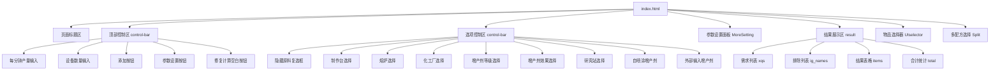

#### 3.1.2 Vue实例绑定

```javascript
// data.js 第5000+行
app = new Vue({
    el: "#result",
    data: {
        totalEnergy: 0,      // 总能耗
        totalSpace: 0,       // 总占地面积
        totalAcc: 0,         // 总增产剂消耗
        total: [],           // 设备合计数据
        xqs: [],             // 需求列表
        icons: icons,        // 图标映射
        items: [],           // 计算结果列表
        items2: [],          // 二级结果
        items0: [],          // 独立生产结果
        ig_names: [],        // 排除物品名
        // 编辑器状态
        xps_editor_index: -1,
        xps_editor_number: 0,
        items_editor_index: -1,
        items_editor_number: 0
    }
});
```

#### 3.1.3 动态加载模块

```javascript
// index.html 内联脚本
$(function () {
    var includes = $('[data-include]');
    jQuery.each(includes, function () {
        var file = 'quote/' + $(this).data('include') + '.html';
        $(this).load(file);
    });
});
```

### 3.2 数据管理模块

#### 3.2.1 配方数据结构

```javascript
// data.js 配方结构
var data = [
    {
        s: [{ name: "产物名", n: 产量 }],  // 产物列表
        q: [{ name: "原料名", n: 消耗 }],  // 原料列表
        t: 生产时间(秒),                   // 生产周期
        m: "设备类型",                     // 设备分类名
        group: "分组名",                   // 物品分组
        noExtra: true/false/null,          // 增产剂效果限制
        id: 配方索引                       // 自动生成
    }
];
```

#### 3.2.2 配方索引结构

```javascript
// data.js 索引结构（优化查找性能）
var recipeIndexByProduct = {};  // 产物名 → [配方索引数组]
var recipeIndexByMaterial = {}; // 原料名 → [配方索引数组]
```

#### 3.2.3 设备数据映射

```javascript
// blueprint.js 设备映射
const buildingMap = {
    arcSmelter: {
        remark: "电弧熔炉",
        name: "arcSmelter",
        itemId: 2302,
        modelIndex: 62,
        productionSpeed: 1,
        size: { x: 3, y: 3 },
        type: buildingType.production,
        category: productionCategory.smelter,
        slotMaxIndex: 7
    },
    // ... 其他设备
};

// data.js 能耗数据
var energyData = {};
energyData["研究站"] = 0.48;
energyData["制作台Mk.Ⅰ"] = 0.27;
// ...

// data.js 占地数据
var spaceData = {};
spaceData["研究站"] = 36 / 15;
spaceData["制作台Mk.Ⅰ"] = 16;
// ...
```

### 3.3 计算引擎模块

#### 3.3.1 核心计算流程

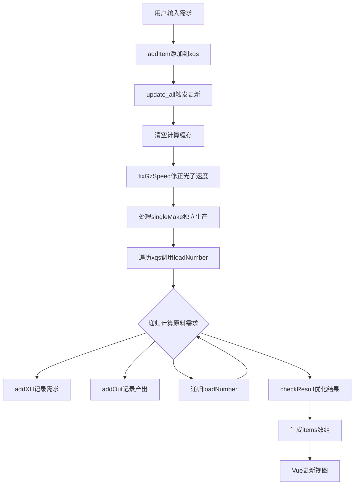

#### 3.3.2 关键函数说明

| 函数名 | 位置 | 功能描述 |
|--------|------|----------|
| `update_all()` | data.js | 主计算入口，触发全量计算 |
| `loadNumber(itemName, n)` | data.js | 递归计算原料需求 |
| `find(name, normalize_recipe)` | data.js | 查找配方并规范化 |
| `getValue(arg)` | data.js | 获取设备速度和时间参数 |
| `getAccSpeed(type, value)` | data.js | 计算增产剂效果倍率 |
| `checkResult()` | data.js | 优化多产出配方的设备数量 |
| `mergeMul()` | data.js | 合并相同配方的多个产出 |

#### 3.3.3 计算数据流

```javascript
// 计算过程中的核心数据结构
var xh_list = [];   // 需求列表 [{name, value, value2, accTotal}]
var out_list = [];  // 产出列表 [{name, value}]
var single_list = []; // 独立生产列表
var xqs = [];       // 用户输入的需求列表
var ig_names = [];  // 排除计算的物品名
```

### 3.4 蓝图生成模块

#### 3.4.1 蓝图生成流程

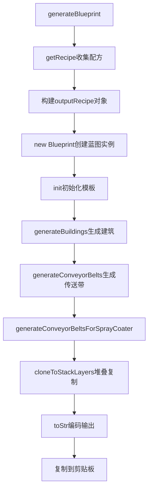

#### 3.4.2 Blueprint类结构

```javascript
// blueprint.js Blueprint类
class Blueprint {
    constructor(name, icons, recipe, config) {
        this.recipe = recipe;           // 配方数据
        this.config = config;           // 配置参数
        this.buildings = [];            // 建筑列表
        this.buildingIndex = 0;         // 建筑索引计数器
        this.blueprintSize = {x: 0, y: 0}; // 蓝图尺寸
        this.occupiedArea = [];         // 已占用区域
        this.sorters = {};              // 分拣器映射
        this.itemSummary = {};          // 物品汇总
    }
    
    init() { /* 初始化蓝图模板 */ }
    generateBuildings() { /* 生成生产建筑 */ }
    generateConveyorBelts() { /* 生成传送带网络 */ }
    generateConveyorBeltsForSprayCoater() { /* 生成喷涂机传送带 */ }
    cloneToStackLayers() { /* 堆叠模式复制 */ }
    toStr() { /* 编码为游戏字符串 */ }
}
```

#### 3.4.3 蓝图配置参数

```javascript
// data.js generateBlueprint函数
let config = {
    maxSorterNumOneBelt: 8,           // 单传送带最大分拣器数
    conveyorBeltStackLayer: 4,        // 传送带堆叠层数
    x_y_ratio: 2,                     // 蓝图长宽比
    compactLayout: false,             // 紧凑布局
    onlyConveyorBeltMk3: true,        // 仅使用三级传送带
    onlySorterMk3: true,              // 仅使用三级分拣器
    useSorterMk4: false,              // 使用四级分拣器
    maxLabLayers: 15,                 // 研究站最大层数
    selfSpray: true,                  // 自喷涂增产剂
    generateTeslaTower: true,         // 自动生成电力感应塔
    teslaTowerInterval: 10,           // 电线杆间距
    teslaTowerLineInterval: 1,        // 电线杆行间距
    stackLayers: 1                    // 建筑堆叠层数
};
```

### 3.5 存储持久化模块

#### 3.5.1 存储结构

```javascript
// data.js 存储变量
var settings = {};          // 设备选择设置 {配方id: {m, accType, accValue}}
var settings_time = {};     // 设备速度设置 {设备名: speed}
var settings_pf = {};       // 配方选择设置 {物品名: 配方id}
var projects = [];          // 保存的方案列表
var version = "20240202";   // 版本号（用于缓存控制）
```

#### 3.5.2 存储函数

```javascript
// data.js 存储函数
function saveData(key, value) {
    if (window.localStorage) {
        localStorage.setItem(key, value);
    } else {
        $.cookie(key, value);
    }
}

function getData(key) {
    if (window.localStorage) {
        return localStorage.getItem(key);
    } else {
        return $.cookie(key);
    }
}

function saveSetting() {
    saveData("machine_settings" + version, JSON.stringify(settings));
}

function loadSetting() {
    var json = getData("machine_settings" + version);
    if (json) eval("settings = " + json);
}
```

---

## 4. 核心流程

### 4.1 初始化流程

#### 4.1.1 初始化时序图

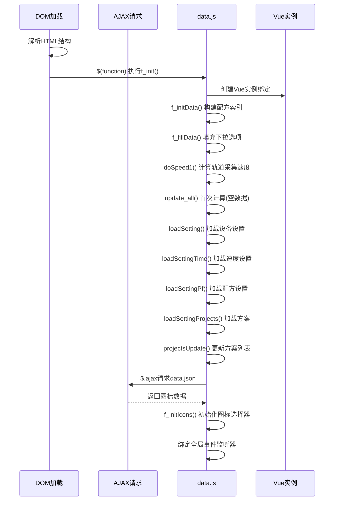

#### 4.1.2 f_init() 主入口函数

**位置**: data.js 第4797行

```javascript
function f_init() {
  // 步骤1: 创建Vue实例，绑定#result元素
  app = new Vue({
    el: "#result",
    data: {
      totalEnergy: 0,      // 总能耗(MW)
      totalSpace: 0,       // 总占地面积
      totalAcc: 0,         // 总增产剂消耗
      total: [],           // 设备合计数据
      xqs: [],             // 用户需求列表
      icons: icons,        // 图标Base64映射
      items: [],           // 计算结果列表
      items2: [],          // 二级结果(产出物)
      items0: [],          // 独立生产结果
      ig_names: [],        // 排除物品名列表
      xps_editor_index: -1,    // 需求编辑索引
      xps_editor_number: 0,    // 需求编辑数值
      items_editor_index: -1,  // 结果编辑索引
      items_editor_number: 0,  // 结果编辑数值
    },
    methods: {
      // 速度修改回调
      speedChange: function (item) {
        settings_time[item.machineName] = parseFloat(item.speed);
        saveSettingTime();
        update_all();
      },
      // 点击需求数量进入编辑模式
      onClickNumber: function (index) { /* ... */ },
      // 点击结果数量进入编辑模式
      onClickNumberItem: function (index_item) { /* ... */ },
      // 提交需求编辑
      submitEditorNumber: function () { /* ... */ },
      // 提交结果编辑(按比例调整所有需求)
      submitEditorNumberItem: function () { /* ... */ },
      // 删除需求项
      removeItem: function (index) { /* ... */ },
    },
    computed: {
      // 格式化合计显示
      totalDisplay: function () { /* ... */ },
    },
  });

  // 步骤2: 构建配方索引
  f_initData();
  
  // 步骤3: 填充下拉选项
  f_fillData();
  
  // 步骤4: 计算轨道采集器速度参数
  doSpeed1();
  
  // 步骤5: 首次计算(空数据，初始化视图)
  update_all();
  
  // 步骤6: 加载持久化设置
  loadSetting();          // 设备选择设置
  loadSettingTime();      // 速度设置
  loadSettingPf();        // 配方选择设置
  loadSettingProjects();  // 保存的方案列表
  
  // 步骤7: 更新方案下拉列表
  projectsUpdate();
  
  // 步骤8: 绑定速度参数变更事件
  // ... 事件绑定代码
}
```

#### 4.1.3 f_initData() 配方索引构建

**位置**: data.js 第4252行

**核心逻辑**: 遍历配方数组，构建产物/原料的双向索引，将O(n)查找优化为O(k)

```javascript
function f_initData() {
  // 清空索引，准备重建
  recipeIndexByProduct = {};   // 产物名 → 配方索引数组
  recipeIndexByMaterial = {};  // 原料名 → 配方索引数组
  
  $(data).each(function (i, item) {
    // 设置配方ID(数组索引)
    item.id = i;

    // 构建产物索引: 遍历所有产物s[]
    for (var j = 0; j < item.s.length; j++) {
      var productName = item.s[j].name;
      if (!recipeIndexByProduct[productName]) {
        recipeIndexByProduct[productName] = [];
      }
      recipeIndexByProduct[productName].push(i);
    }
    
    // 构建原料索引: 遍历所有原料q[]
    if (item.q) {
      for (var j = 0; j < item.q.length; j++) {
        var materialName = item.q[j].name;
        if (!recipeIndexByMaterial[materialName]) {
          recipeIndexByMaterial[materialName] = [];
        }
        recipeIndexByMaterial[materialName].push(i);
      }
    }

    // 根据设备类型m设置可用设备列表及速度
    // 设备速度映射表
    var ms = [];
    if (item.m == "研究站") {
      ms = [
        { name: "矩阵研究站", speed: 1 },
        { name: "自演化研究站", speed: 3 },
      ];
    }
    if (item.m == "制作台") {
      ms = [
        { name: "制作台Mk.Ⅰ", speed: 0.75 },
        { name: "制作台Mk.Ⅱ", speed: 1 },
        { name: "制作台Mk.Ⅲ", speed: 1.5 },
        { name: "重组式制造台", speed: 3 },
      ];
    }
    if (item.m == "冶炼设备") {
      ms = [
        { name: "电弧熔炉", speed: 1 },
        { name: "位面熔炉", speed: 2 },
        { name: "负熵熔炉", speed: 3 },
      ];
    }
    // ... 其他设备类型映射
    
    // 将设备列表附加到配方对象
    if (ms.length > 0) {
      item.m = ms;
    }
  });
}
```

**索引使用示例**:

```javascript
// 通过产物名查找配方 - O(k)复杂度
function getPfs(name) {
  var pfs = [];
  var indices = recipeIndexByProduct[name] || [];
  for (var i = 0; i < indices.length; i++) {
    var pf = $.extend(true, {}, data[indices[i]]);
    pfs.push(pf);
  }
  return pfs;
}

// 通过原料名查找配方 - O(k)复杂度
function getPfsByQ(name) {
  var pfs = [];
  var indices = recipeIndexByMaterial[name] || [];
  for (var i = 0; i < indices.length; i++) {
    var pf = $.extend(true, {}, data[indices[i]]);
    pfs.push(pf);
  }
  return pfs;
}
```

#### 4.1.4 f_fillData() 下拉选项填充

**位置**: data.js 第4536行

```javascript
function f_fillData() {
  var names = [];  // 去重用数组

  // 按分组遍历配方
  $(getGroup()).each(function (i, group) {
    // 创建optgroup分组
    var jgroup = $("<optgroup label='" + group + "'></optgroup>");
    
    $(data).each(function (i, item) {
      var name = item.name;
      if (item.group == group) {
        // 遍历配方产物，添加到下拉选项
        for (var j = 0; j < item.s.length; j++) {
          // 去重检查
          if ($.inArray(item.s[j].name, names) == -1) {
            names.push(item.s[j].name);
            jgroup.append(
              "<option value='" + item.s[j].name + "'>" + 
              item.s[j].name + "</option>"
            );
          }
        }
      }
    });
    // 追加到select元素
    $("#seldata").append(jgroup);
  });
}
```

#### 4.1.5 f_initIcons() 图标选择器初始化

**位置**: data.js 第6074行

**触发时机**: AJAX加载data.json成功后异步执行

```javascript
function f_initIcons() {
  // 步骤1: 解析图标数据，填充icons对象
  var reg = /^(\d)-(\d{1,2})-(.*)+/;
  for (var i = 0; i < game_data.icons1.length; i++) {
    var icon = game_data.icons1[i];
    if (reg.test(icon.name)) {
      var x = icon.name.match(reg);
      icons[x[3]] = icon.value;  // 提取实际名称
    } else {
      icons[icon.name] = icon.value;
    }
  }
  // 处理icons2数组(工厂类图标)
  for (var i = 0; i < game_data.icons2.length; i++) {
    // ... 同上处理逻辑
  }
  
  // 步骤2: 冻结icons对象，更新Vue响应式数据
  app.icons = Object.freeze(icons);

  // 步骤3: 绑定全局点击事件(关闭选择器)
  $(document).click(function (e) {
    if (!$(e.target).closest("#UIselector").length) {
      $("#UIselector").hide();
    }
    if (!$(e.target).closest("#Split").length) {
      $("#Split").hide();
    }
  });

  // 步骤4: 构建物品选择器UI
  $("#UIselector")
    .html('<div id="selector" class="selector" style="width: ' + 
          w + "px; height: " + h + 'px"><div id="tabs"></div></div>')
    .hide();

  // 步骤5: 创建标签页(组件/工厂)
  var jimg1 = $("<div class='tab selected'></div>");
  var jimg2 = $("<div class='tab'></div>");
  
  // 标签页切换事件
  jimg1.click(function () { /* 切换到组件页 */ });
  jimg2.click(function () { /* 切换到工厂页 */ });

  // 步骤6: 创建图标网格(9行×14列)
  var jicons = $('<div class="icons icons-selected"></div>');
  var jicons2 = $('<div class="icons"></div>');
  
  function addIcons(jicons, icons) {
    for (var i = 0; i < 9; i++) {
      var jrow = $("<div class='iconrow'></div>");
      for (var j = 0; j < 14; j++) {
        var jicon = $("<div class='icon'><div class='s'></div></div>");
        jicon.click(function () {
          var name = $(this).attr("data-name");
          if (!name) return;
          f_add3(name);  // 添加物品到需求列表
          $("#UIselector").hide();
        });
        jrow.append(jicon);
      }
      jicons.append(jrow);
    }
    // 填充图标到网格位置
    // ...
  }
}
```

#### 4.1.6 初始化数据流图

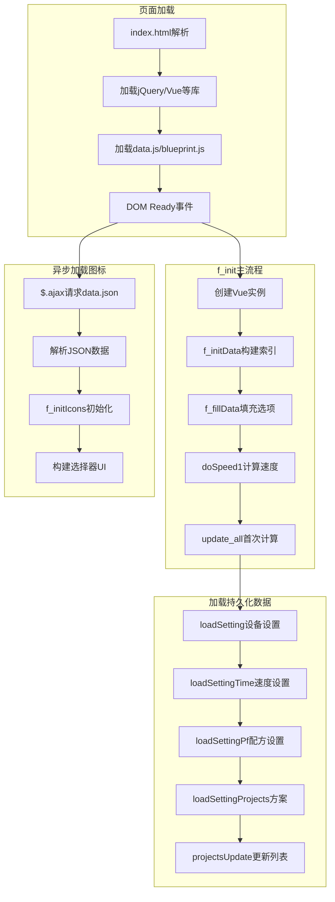

### 4.2 添加需求流程

#### 4.2.1 添加需求时序图

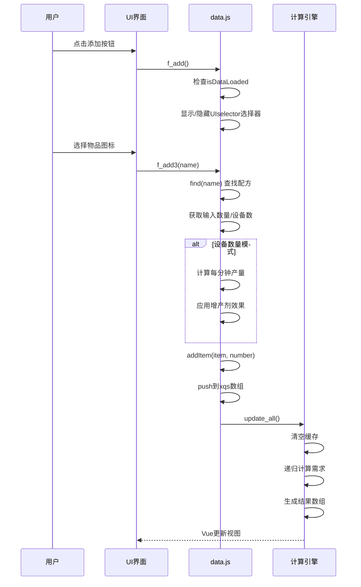

#### 4.2.2 f_add() 显示物品选择器

**位置**: data.js 第5999行

```javascript
function f_add() {
  // 检查游戏资源是否加载完成
  if (!isDataLoaded) {
    alert("游戏资源尚未加载完毕");
    return;
  }
  
  // 切换选择器显示状态(带动画)
  var $uiSelector = $("#UIselector");
  if ($uiSelector.hasClass("show")) {
    // 隐藏动画
    $uiSelector.removeClass("show");
    setTimeout(function() {
      $uiSelector.hide();
    }, 250);
  } else {
    // 显示动画
    $uiSelector.show();
    setTimeout(function() {
      $uiSelector.addClass("show");
    }, 10);
  }
}
```

#### 4.2.3 f_add3() 处理物品选择

**位置**: data.js 第4757行

```javascript
function f_add3(name) {
  // 步骤1: 查找物品配方
  currentItem = find(name);
  
  // 步骤2: 获取用户输入的数量
  var number = parseInt($("#txtnumber").val());  // 每分钟产量
  var v = $("#selmaince").val();                  // 设备数量(可选)
  
  // 步骤3: 如果输入了设备数量，则反推产量
  if (v) {
    // 获取增产剂设置
    var accType = (settings[currentItem.id] || {}).accType || defaultAccType;
    var accValue = (settings[currentItem.id] || {}).accValue || defaultAccValue;
    
    // 检查增产剂限制
    if (accValue == "增产" && currentItem.noExtra) accValue = "无";
    if (currentItem.q.length == 0) accValue = "无";  // 无原料配方不适用增产剂

    // 获取设备速度参数
    var info = getValue(currentItem);
    
    // 计算每分钟产量
    // 公式: 产量 = (设备数 × 60 / 生产周期) × 设备速度 × 单次产出
    for (var i = 0; i < currentItem.s.length; i++) {
      if (currentItem.s[i].name == name) {
        number = ((parseInt(v) * 60) / (currentItem.t || 1)) * 
                 info.speed * 
                 (currentItem.s[i].n || 1);
      }
      // 应用增产剂加速效果
      number *= getAccSpeed(accType, accValue);
    }
  }

  // 步骤4: 添加到需求列表
  addItem(currentItem, number);
}
```

**设备数量转产量计算公式**:

```
每分钟产量 = 设备数 × 60秒 / 生产周期(秒) × 设备速度 × 单次产出数 × 增产剂倍率
```

#### 4.2.4 addItem() 添加到需求列表

**位置**: data.js 第4782行

```javascript
function addItem(item, number) {
  // 添加到xqs数组(全局需求列表)
  xqs.push({
    item: item,      // 配方对象引用
    number: number,  // 每分钟需求量
  });

  // 触发全量计算
  update_all();
}
```

#### 4.2.5 find() 配方查找函数

**位置**: data.js 第4700行左右

```javascript
function find(name, normalize_recipe) {
  // 通过索引快速查找配方
  var pfs = getPfs(name);
  if (pfs.length == 0) return null;
  
  // 获取用户选择的配方(如果有多个)
  var pf_id = settings_pf[name];
  if (pf_id !== undefined) {
    for (var i = 0; i < pfs.length; i++) {
      if (pfs[i].id == pf_id) {
        return normalize_recipe !== false ? normalize(pfs[i]) : pfs[i];
      }
    }
  }
  
  // 返回第一个配方(默认)
  return normalize_recipe !== false ? normalize(pfs[0]) : pfs[0];
}

// 配方规范化: 深拷贝并设置默认值
function normalize(item) {
  var newItem = $.extend(true, {}, item);
  if (!newItem.s) newItem.s = [];
  if (!newItem.q) newItem.q = [];
  if (!newItem.t) newItem.t = 1;
  return newItem;
}
```

#### 4.2.6 添加需求数据流图

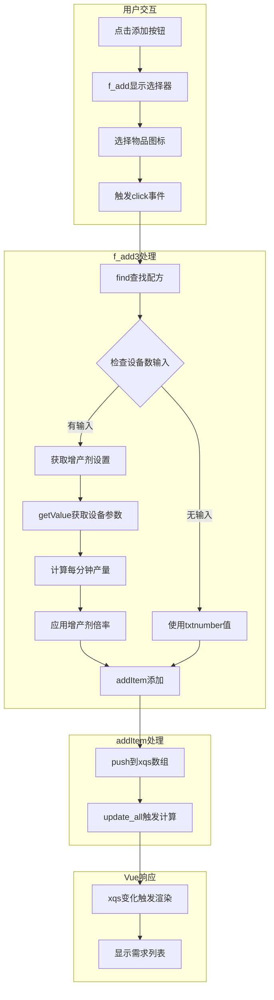

### 4.3 计算更新流程

#### 4.3.1 计算更新流程图

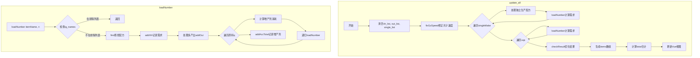

#### 4.3.2 update_all() 主计算入口

**位置**: data.js 第5556行

```javascript
function update_all() {
  var outResult = [];
  
  // 步骤1: 清空计算缓存
  xh_list = [];      // 需求列表
  out_list = [];     // 产出列表
  single_list = [];  // 独立生产列表

  // 步骤2: 修正临界光子生产速度
  fixGzSpeed();
  
  // 步骤3: 处理独立生产配方(singleMake)
  for (var m = 0; m < singleMake.length; m++) {
    var item = data[singleMake[m].id];
    var info = getValue(item);
    // 计算每分钟产出次数
    var times = parseFloat(
      ((60 * parseInt(singleMake[m].number) * info.speed) / (item.t || 1)).toFixed(6)
    );

    // 记录产出并递归计算原料
    for (var i = 0; i < item.s.length; i++) {
      single_list.push({
        id: singleMake[m].id,
        number: singleMake[m].number,
        name: item.s[i].name,
        mName: info.name,
        value: times * (item.s[i].n || 1),
      });
      // 负数表示产出
      loadNumber(item.s[i].name, -1 * times * (item.s[i].n || 1));
    }
    // 递归计算原料需求
    for (var j = 0; item.q && j < item.q.length; j++) {
      loadNumber(item.q[j].name, times * (item.q[j].n || 1));
    }
  }
  
  // 步骤4: 处理用户需求列表(xqs)
  for (var m = 0; m < xqs.length; m++) {
    var currentItem = xqs[m].item;
    // 正数表示需求
    loadNumber(currentItem.name, xqs[m].number);
  }

  // 步骤5: 计算设备数量(value2)
  for (var i = 0; i < xh_list.length; i++) {
    var xh = xh_list[i];
    if (!xh.value) continue;
    var itemName = xh.name;
    var item = find(itemName);
    var info = getValue(itemName);
    
    if (xh.value > 0) {
      // 计算基础设备数
      xh.value2 = xh.value / (1 / info.time) / 60 / (item.n || 1);
      
      // 获取增产剂设置
      var accType = (settings[item.id] || {}).accType || defaultAccType;
      var accValue = (settings[item.id] || {}).accValue || defaultAccValue;
      if (accValue == "增产" && item.noExtra) accValue = "无";
      if (item.q.length == 0) accValue = "无";

      // 修正产物与原料相同时的设备数(如卡西米尔晶体)
      let fixValue2Times = 1;
      for (let j = 0; j < item.q.length; j++) {
        if (item.q[j].name === item.name) {
          fixValue2Times = item.n / (item.n - item.q[j].n);
        }
      }
      // 应用增产剂加速效果
      xh.value2 = (xh.value2 / getAccSpeed(accType, accValue)) * fixValue2Times;
    }
  }
  
  // 步骤6: 优化多产出配方的设备数量
  checkResult();
  
  // 步骤7: 生成结果数组(items, items2, items0)
  // ... 生成逻辑
  
  // 步骤8: 计算合计数据
  var total = [];
  var totalAcc = 0;
  // ... 合计计算
  
  // 步骤9: 更新Vue视图
  app.items = items;
  app.items2 = items2;
  app.items0 = items0;
  app.total = total;
  app.totalAcc = totalAcc.toFixed(2);
  app.totalEnergy = totalEnergy.toFixed(2);
  app.totalSpace = Math.round(totalSpace);
}
```

#### 4.3.3 loadNumber() 递归计算核心

**位置**: data.js 第5342行

```javascript
function loadNumber(itemName, n) {
  try {
    // 步骤1: 检查排除列表
    if ($.inArray(itemName, ig_names) != -1) {
      return;
    }
    
    // 增产剂特殊处理: 需求量小于0.1时忽略
    if ((itemName == "增产剂Mk.Ⅰ" || itemName == "增产剂Mk.Ⅱ" || 
         itemName == "增产剂Mk.Ⅲ") && n < 0.1) {
      return;
    }
    
    // 步骤2: 查找配方
    var item = find(itemName, true);
    var info = getValue(itemName);

    // 步骤3: 记录需求(正数=需求, 负数=产出)
    addXH(itemName, n);
    
    // 步骤4: 处理多产出配方的副产物
    for (var i = 0; i < item.s.length; i++) {
      if (item.s[i].name != itemName) {
        if (item.s[i].n === 0) continue;
        // 副产物记为产出(负数)
        addOut(item.s[i].name, (-1 * n * (item.s[i].n || 1)) / (item.n || 1));
      }
    }
    
    // 步骤5: 获取增产剂设置
    var accType = (settings[item.id] || {}).accType || defaultAccType;
    var accValue = (settings[item.id] || {}).accValue || defaultAccValue;
    var accTotal = 0;
    
    // 步骤6: 递归计算原料需求
    for (var i = 0; item.q && i < item.q.length; i++) {
      var q = item.q[i];
      if ($.inArray(q.name, ig_names) != -1) continue;
      if (q.n === 0) continue;
      
      // 计算原料需求量
      var r = (n * (q.n || 1)) / (item.n || 1);
      var v = 1, tm = 0;
      
      // 增产剂参数: v=增产倍率, tm=每分钟消耗
      if (accType == "增产剂Mk.Ⅰ") (v = 1.125), (tm = 12);
      else if (accType == "增产剂Mk.Ⅱ") (v = 1.2), (tm = 24);
      else if (accType == "增产剂Mk.Ⅲ") (v = 1.25), (tm = 60);
      
      // 自喷涂增产剂: 消耗减少
      if ($("#selfAcc")[0].checked) tm = tm * v - 1;
      
      // 检查增产剂限制
      if (accValue == "增产" && item.noExtra) accValue = "无";
      if (item.q.length == 0 || item.noExtra === null) accValue = "无";

      // 计算增产剂消耗
      if (accValue == "加速") {
        accTotal += r / tm;
        if (!$("#isAddSelfAccP").get(0).checked) {
          loadNumber(accType, r / tm);  // 递归计算增产剂需求
        }
      } else if (accValue == "增产") {
        r /= v;  // 增产模式下原料消耗减少
        accTotal += r / tm;
        if (!$("#isAddSelfAccP").get(0).checked) {
          loadNumber(accType, r / tm);
        }
      }

      // 递归计算原料
      loadNumber(q.name, r);
    }
    
    // 步骤7: 记录增产剂消耗
    addAccTotal(itemName, accTotal);
    
  } catch (e) {
    throw e;
  }
}
```

**计算公式说明**:

| 参数 | 公式 | 说明 |
|------|------|------|
| 原料需求 | `r = n × q.n / item.n` | 需求量 × 原料消耗 / 产出数 |
| 增产剂消耗 | `accTotal = r / tm` | 原料需求 / 每分钟消耗 |
| 增产模式原料 | `r = r / v` | 原料消耗减少增产倍率 |

#### 4.3.4 checkResult() 多产出优化

**位置**: data.js 第5472行

**功能**: 处理多产出配方的设备数量优化，避免产出过剩

```javascript
function checkResult() {
  // 检查当前设备数量是否导致产出过剩
  function isOverflow(item, info, nn) {
    for (var j = 0; j < item.s.length; j++) {
      var x = findOut(item.s[j].name);
      if (x == null) return false;
      // 计算单设备每分钟产量
      var mn = ((nn * 60) / item.t) * info.speed * (item.s[j].n || 1);
      // 如果有产出未过剩，返回false
      if (x > -1 * mn) return false;
    }
    return true;  // 所有产出都过剩
  }

  for (var i = 0; i < xh_list.length; i++) {
    var number = xh_list[i].value;
    var item = find(xh_list[i].name);
    var info = getValue(item);
    var nn = 1;
    if (xh_list[i].value2 < 1) {
      nn = xh_list[i].value2;
    }

    // 循环减少设备数直到产出不再过剩
    while (isOverflow(item, info, nn) && xh_list[i].value2 > 0) {
      if (xh_list[i].value2 < 1) {
        nn = xh_list[i].value2;
      }
      // 减少设备数量
      xh_list[i].value2 = xh_list[i].value2 - nn;
      // 增加产出记录
      for (var j = 0; j < item.s.length; j++) {
        var mn = ((nn * 60) / item.t) * info.speed * (item.s[j].n || 1);
        addOut(item.s[j].name, mn);
      }
      if (xh_list[i].value2 < 1) {
        nn = xh_list[i].value2;
      }
    }
  }
}
```

#### 4.3.5 fixGzSpeed() 光子速度修正

**位置**: data.js 第5512行

```javascript
function fixGzSpeed() {
  let fixedGzSpeed;
  $(data).each(function () {
    // 查找临界光子配方
    if (this.s && this.s[0].name == "临界光子") {
      if (this.m) {
        for (var i = 0; i < this.m.length; i++) {
          if (this.m[i].name == "射线接收塔") {
            for (var j = 0; j < this.q.length; j++) {
              if (this.q[j].name == "引力透镜") {
                // 根据增产剂设置修正光子产量
                // 12(透镜×200%)/15(增产Ⅰ×250%)/18(增产Ⅱ×300%)/24(增产Ⅲ×400%)
                // ... 修正逻辑
              }
            }
          }
        }
      }
    }
  });
}
```

#### 4.3.6 辅助函数

**addXH() 添加需求记录**:

```javascript
function addXH(name, value) {
  for (var i = 0; i < xh_list.length; i++) {
    if (xh_list[i].name == name) {
      xh_list[i].value += value;
      return;
    }
  }
  xh_list.push({ name: name, value: value, value2: 0, accTotal: 0 });
}
```

**addOut() 添加产出记录**:

```javascript
function addOut(name, value) {
  for (var i = 0; i < out_list.length; i++) {
    if (out_list[i].name == name) {
      out_list[i].value += value;
      return;
    }
  }
  out_list.push({ name: name, value: value });
}
```

**addAccTotal() 添加增产剂消耗**:

```javascript
function addAccTotal(name, value) {
  for (var i = 0; i < xh_list.length; i++) {
    if (xh_list[i].name == name) {
      xh_list[i].accTotal += value;
      return;
    }
  }
}
```

### 4.4 蓝图生成流程

#### 4.4.1 蓝图生成流程图

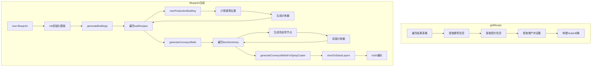

#### 4.4.2 generateBlueprint() 入口函数

**位置**: data.js 第6589行

```javascript
function generateBlueprint() {
  // 检查协议(需要HTTPS才能访问剪贴板)
  if (!location.href.startsWith("https")) {
    cocoMessage.warning("请使用 https 协议访问以启用复制到剪切板功能");
    return;
  }
  
  // 步骤1: 收集配方数据
  const recipe = getRecipe();
  const outputRecipe = {
    proliferator: recipe.proliferator,       // 增产剂类型
    subRecipes: recipe.recipeList,           // 配方列表
  };
  
  if (!outputRecipe.subRecipes) {
    return;
  }
  
  // 步骤2: 构建配置对象
  let config = {
    maxSorterNumOneBelt: 8,                  // 单传送带最大分拣器数
    conveyorBeltStackLayer: parseInt(
      document.getElementById("conveyorBeltStackLayer").value
    ),                                        // 传送带堆叠层数
    x_y_ratio: parseFloat(
      document.getElementById("x_y_ratio").value
    ),                                        // 蓝图长宽比
    compactLayout: false,                    // 紧凑布局
    upgradeConveyorBelt: false,              // 升级传送带
    onlyConveyorBeltMk3: document.getElementById("onlyConveyorBeltMk3").checked,
    onlySorterMk3: document.getElementById("onlySorterMk3").checked,
    useSorterMk4: document.getElementById("useSorterMk4").checked,
    maxLabLayers: parseInt(document.getElementById("maxLabLayers").value),
    selfSpray: document.getElementById("selfAcc").checked,  // 自喷涂增产剂
    generateTeslaTower: document.getElementById("generateTeslaTower").checked,
    teslaTowerInterval: 10,                  // 电线杆间距
    teslaTowerLineInterval: parseInt(
      document.getElementById("teslaTowerLineInterval").value
    ),
    onlyConveyorBeltMk3Downgrade: false,
    stackLayers: parseInt(document.getElementById("stackLayers").value) || 1,
  };
  
  // 步骤3: 创建Blueprint实例
  let b1 = new Blueprint(
    recipe.blueprintTitle,
    recipe.blueprintIcon.concat(Array(5).fill(0)).slice(0, 5),
    outputRecipe,
    config
  );
  
  // 步骤4: 执行蓝图生成流程
  b1.init();                              // 初始化模板
  b1.generateBuildings();                 // 生成建筑
  b1.generateConveyorBelts();             // 生成传送带
  b1.generateConveyorBeltsForSprayCoater(); // 生成喷涂机传送带
  b1.cloneToStackLayers();                // 堆叠模式复制
  
  // 步骤5: 设置蓝图元数据
  b1.blueprintTemplate.buildings = b1.buildings;
  b1.blueprintTemplate.header.desc = recipe.blueprintDesc.trimEnd();
  
  // 设置图标布局
  switch (recipe.blueprintIcon.length) {
    case 1: b1.blueprintTemplate.header.layout = 10; break;
    case 2: b1.blueprintTemplate.header.layout = 20; break;
    case 3: b1.blueprintTemplate.header.layout = 30; break;
    case 4: b1.blueprintTemplate.header.layout = 40; break;
    default: b1.blueprintTemplate.header.layout = 51; break;
  }
  
  // 步骤6: 编码并复制到剪贴板
  navigator.clipboard
    .writeText(b1.toStr())
    .then((r) => cocoMessage.success("已复制到粘贴板", 1000));
}
```

#### 4.4.3 getRecipe() 配方数据收集

**位置**: data.js 第6186行

```javascript
function getRecipe() {
  let recipeList = [];
  // 物品名称映射表(中文名 → 英文ID)
  const itemNameList = [
    ["矩阵研究站", "lab"],
    ["水", "water"],
    ["铁矿", "ironOre"],
    // ... 更多映射
  ];
  
  let proliferator = null;      // 增产剂类型
  let blueprintTitle = "";      // 蓝图标题
  let blueprintDesc = "";       // 蓝图描述
  let blueprintIconIdx = [];    // 蓝图图标索引
  
  // 遍历结果表格
  for (let tr of document.getElementsByTagName("tbody")[0].childNodes) {
    if (tr.className === "header" || tr.className === "total") continue;
    
    // 提取建筑信息
    let buildingName = nodeList[3].getElementsByTagName("img")[0].getAttribute("title");
    let building = {
      name: buildingName,
      num: parseFloat(nodeList[3].getElementsByTagName("span")[0].innerText),
    };
    
    // 转换建筑名称为英文ID
    for (let item of itemNameList) {
      if (item[0] === building.name) {
        building.name = item[1];
        break;
      }
    }
    
    // 提取配方信息
    const recipeHtml = nodeList[4].getElementsByTagName("div")[0]
                        .getElementsByClassName("pf selected")[0];
    let input = [];
    let output = [];
    let recipeId = 0;
    
    // 解析配方输入输出
    for (let node of recipeHtml.childNodes) {
      if (node.tagName === "IMG") {
        // 解析物品图标和数量
        // ...
      }
    }
    
    // 提取增产剂设置
    const accValue = nodeList[6].innerText;  // 增产/加速/无
    
    // 构建子配方对象
    recipeList.push({
      building: building,
      output: output,
      input: input,
      acceleratorMode: accValue === "加速" ? 1 : (accValue === "增产" ? 2 : 0),
      recipeID: recipeId,
    });
  }
  
  return {
    recipeList: recipeList,
    proliferator: proliferator,
    blueprintTitle: blueprintTitle,
    blueprintDesc: blueprintDesc,
    blueprintIcon: blueprintIconIdx,
  };
}
```

#### 4.4.4 Blueprint类结构

**位置**: blueprint.js 第584行

```javascript
class Blueprint {
  constructor(title, iconId, recipe, config) {
    this.recipe = recipe;                    // 配方数据
    this.buildingIndex = -1;                 // 建筑索引计数器
    this.blueprintSize = { x: 0, y: 0 };     // 蓝图尺寸
    this.occupiedArea = [];                  // 已占用区域
    this.buildings = [];                     // 建筑列表
    this.config = config;                    // 配置参数
    this.buildingArray = [];                 // 建筑数组
    this.sorters = {};                       // 分拣器映射
    this.sprayCoaterOffsetList = [];         // 喷涂机位置列表
    this.itemSummary = {};                   // 物品汇总
    
    // 蓝图模板结构
    this.blueprintTemplate = {
      header: {
        layout: 10,
        icons: iconId,
        time: new Date(),
        gameVersion: "0.9.26.13026",
        shortDesc: title,
        desc: "",
      },
      version: 1,
      cursorOffset: { x: 0, y: 0 },
      cursorTargetArea: 0,
      dragBoxSize: { x: 1, y: 1 },
      primaryAreaIdx: 0,
      areas: [{ index: 0, parentIndex: -1, /* ... */ }],
    };
  }
  
  // 初始化
  init() {
    this.mapRecipeID();
    // 堆叠模式: 缩减设备数量
    if (this.config.stackLayers > 1) {
      for (let subRecipe of this.recipe.subRecipes) {
        if (subRecipe.building) {
          // 研究站不缩减
          if (buildingMap[subRecipe.building.name].category !== productionCategory.lab) {
            subRecipe.building.num = Math.ceil(
              subRecipe.building.num / this.config.stackLayers
            );
          }
        }
      }
    }
    this.calculateBlueprintArea();
  }
  
  // 生成建筑
  generateBuildings() {
    for (let subRecipe of this.recipe.subRecipes) {
      if (subRecipe.building === null) continue;
      this.newProductionBuilding(subRecipe);
    }
  }
  
  // 生成传送带
  generateConveyorBelts() { /* ... */ }
  
  // 生成喷涂机传送带
  generateConveyorBeltsForSprayCoater() { /* ... */ }
  
  // 堆叠模式复制
  cloneToStackLayers() { /* ... */ }
  
  // 编码为游戏字符串
  toStr() { /* ... */ }
}
```

#### 4.4.5 核心数据映射

**itemMap 物品映射** (blueprint.js 第1行):

```javascript
const itemMap = {
  water: { name: "water", iconId: 1000, remark: "水" },
  ironOre: { name: "ironOre", iconId: 1001, remark: "铁矿" },
  copperOre: { name: "copperOre", iconId: 1002, remark: "铜矿" },
  proliferatorMk1: { name: "proliferatorMk1", iconId: 1141, 
                     extra_rate: 0.125, accelerate: 0.25, remark: "增产剂Mk.Ⅰ" },
  // ... 更多物品
};
```

**buildingMap 建筑映射** (blueprint.js 第180行):

```javascript
const buildingMap = {
  arcSmelter: {
    remark: "电弧熔炉",
    name: "arcSmelter",
    itemId: 2302,
    modelIndex: 62,
    productionSpeed: 1,
    size: { x: 3, y: 3 },
    type: buildingType.production,
    category: productionCategory.smelter,
    slotMaxIndex: 7,  // 最大槽位索引
  },
  assemblingMachineMk3: {
    remark: "制造台Mk.III",
    name: "assemblingMachineMk3",
    itemId: 2305,
    modelIndex: 67,
    productionSpeed: 1.5,
    size: { x: 3, y: 3 },
    type: buildingType.production,
    category: productionCategory.assembling,
    slotMaxIndex: 8,
  },
  // ... 更多建筑
};
```

#### 4.4.6 蓝图生成数据流图

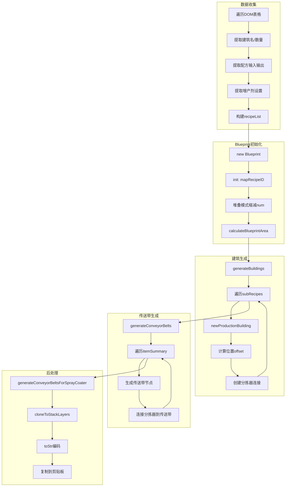

---

## 5. 数据流

### 5.1 用户输入到计算结果

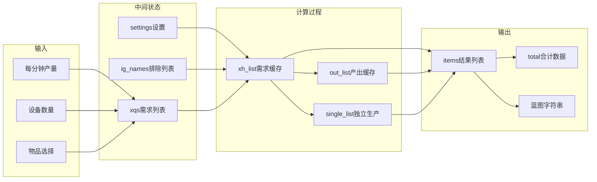

#### 5.1.1 数据转换流程详解

**用户输入 → xqs需求列表**:

```javascript
// 用户输入: 每分钟产量 或 设备数量
// f_add3() 处理输入转换
function f_add3(name) {
  var number = parseInt($("#txtnumber").val());  // 每分钟产量
  var v = $("#selmaince").val();                  // 设备数量
  
  if (v) {
    // 设备数量模式: 反推每分钟产量
    // 产量 = (设备数 × 60 / 生产周期) × 设备速度 × 单次产出 × 增产剂倍率
    number = ((parseInt(v) * 60) / (currentItem.t || 1)) * 
             info.speed * (currentItem.s[i].n || 1) * 
             getAccSpeed(accType, accValue);
  }
  
  // 添加到xqs
  addItem(currentItem, number);
}
```

**xqs → xh_list/out_list**:

```javascript
// update_all() 遍历xqs，调用loadNumber递归计算
for (var m = 0; m < xqs.length; m++) {
  var currentItem = xqs[m].item;
  loadNumber(currentItem.name, xqs[m].number);  // 正数=需求
}

// loadNumber() 递归填充xh_list和out_list
function loadNumber(itemName, n) {
  addXH(itemName, n);  // 记录需求
  
  // 处理副产物
  for (var i = 0; i < item.s.length; i++) {
    if (item.s[i].name != itemName) {
      addOut(item.s[i].name, (-1 * n * (item.s[i].n || 1)) / (item.n || 1));
    }
  }
  
  // 递归计算原料
  for (var i = 0; item.q && i < item.q.length; i++) {
    var r = (n * (q.n || 1)) / (item.n || 1);
    loadNumber(q.name, r);
  }
}
```

**xh_list → items结果列表**:

```javascript
// update_all() 后处理阶段
for (var i = 0; i < xh_list.length; i++) {
  var xh = xh_list[i];
  if (!xh.value) continue;
  
  // 计算设备数量
  xh.value2 = xh.value / (1 / info.time) / 60 / (item.n || 1);
  xh.value2 = xh.value2 / getAccSpeed(accType, accValue);
  
  // 构建结果对象
  var outitem = {
    name: xh.name,
    number1: xh.value.toFixed(pointLength),    // 每分钟需求/产出
    number2: xh.value2.toFixed(pointLength),   // 设备数量
    machineName: info.name,
    accTotal: (xh.accTotal || 0).toFixed(2),   // 增产剂消耗
    // ...
  };
  items.push(outitem);
}
```

### 5.2 设置数据流

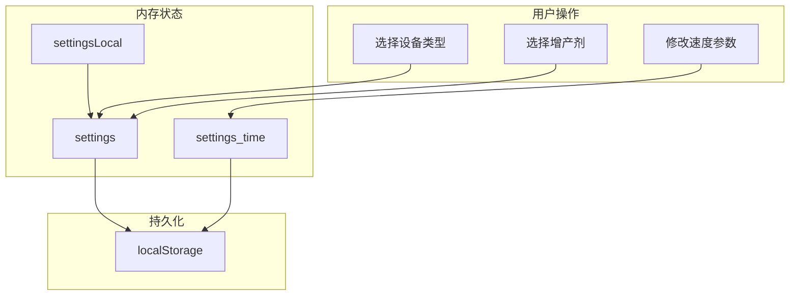

#### 5.2.1 settings数据结构

```javascript
// settings: 设备选择设置
// 结构: { 配方id: { m: 设备名, accType: 增产剂等级, accValue: 增产剂效果 } }
var settings = {
  "123": {
    m: "制作台Mk.Ⅲ",
    accType: "增产剂Mk.Ⅱ",
    accValue: "加速"
  },
  // ...
};

// settings_time: 设备速度设置
// 结构: { 设备名: 速度值 }
var settings_time = {
  "制作台Mk.Ⅰ": 0.75,
  "制作台Mk.Ⅱ": 1,
  "制作台Mk.Ⅲ": 1.5,
  // ...
};

// settings_pf: 配方选择设置
// 结构: { 物品名: 配方id }
var settings_pf = {
  "氢": 45,  // 使用id=45的配方生产氢
  // ...
};

// settingsLocal: 临时设置(不持久化)
// 用于界面上的全局默认设置
var settingsLocal = {
  m: "制作台Mk.Ⅲ",  // 默认制作台
  furnace: "电弧熔炉",
  chemical: "化工厂",
  research: "矩阵研究站",
};
```

#### 5.2.2 设置持久化函数

```javascript
// 保存设置到localStorage
function saveSetting() {
  saveData("machine_settings" + version, JSON.stringify(settings));
}

function saveSettingTime() {
  saveData("machine_settings_time" + version, JSON.stringify(settings_time));
}

function saveSettingPf() {
  saveData("machine_settings_pf" + version, JSON.stringify(settings_pf));
}

// 加载设置
function loadSetting() {
  var json = getData("machine_settings" + version);
  if (json) eval("settings = " + json);
}

// 通用存储函数
function saveData(key, value) {
  if (window.localStorage) {
    localStorage.setItem(key, value);
  } else {
    $.cookie(key, value);  // 降级到cookie
  }
}

function getData(key) {
  if (window.localStorage) {
    return localStorage.getItem(key);
  } else {
    return $.cookie(key);
  }
}
```

### 5.3 蓝图数据流

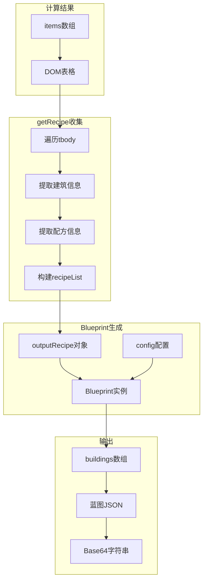

---

## 6. 模块依赖关系

### 6.1 模块依赖图

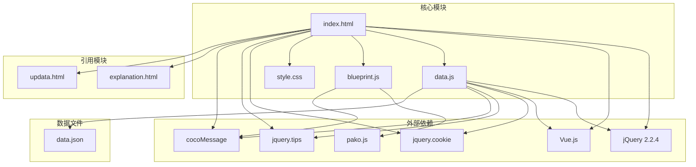

### 6.2 模块职责说明

| 模块 | 文件 | 职责描述 |
|------|------|----------|
| **index.html** | index.html | 主入口文件，包含HTML结构、内联CSS、动态加载逻辑 |
| **data.js** | Scripts/data.js | 核心计算逻辑、配方数据、Vue实例、事件处理、存储管理 |
| **blueprint.js** | Scripts/blueprint.js | 蓝图生成逻辑、建筑布局算法、传送带网络生成、编码输出 |
| **style.css** | Scripts/style.css | 全局样式定义 |
| **data.json** | Scripts/data.json | 游戏图标资源(Base64编码) |
| **pako.js** | Scripts/pako.js | zlib压缩库，用于蓝图编码 |
| **vue.min.js** | Scripts/vue.min.js | Vue.js框架，响应式UI渲染 |
| **jquery-*.js** | Scripts/jquery-*.js | jQuery库及插件(Cookie、Tips) |
| **cocoMessage.js** | Scripts/cocoMessage.js | 消息提示组件 |

### 6.3 模块间调用关系

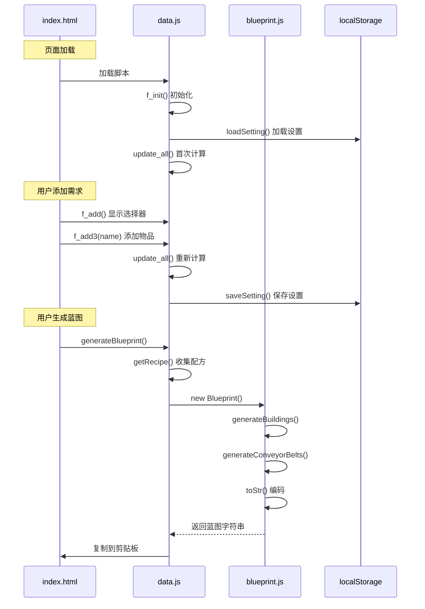

### 6.4 关键函数跨模块调用

| 调用方 | 被调用方 | 函数 | 说明 |
|--------|----------|------|------|
| index.html | data.js | f_init() | 页面加载时初始化 |
| index.html | data.js | f_add() | 点击添加按钮 |
| data.js | blueprint.js | new Blueprint() | 创建蓝图实例 |
| data.js | blueprint.js | Blueprint.toStr() | 编码蓝图字符串 |
| blueprint.js | pako.js | pako.deflate() | 压缩蓝图数据 |
| data.js | localStorage | setItem/getItem | 持久化设置 |

---

## 7. 全局变量与状态管理

### 7.1 全局变量清单

| 变量名 | 类型 | 定义位置 | 用途 |
|--------|------|----------|------|
| `data` | Array | data.js | 配方数据数组 |
| `icons` | Object | data.js | 图标Base64映射 |
| `game_data` | Object | data.js | 游戏资源数据 |
| `isDataLoaded` | Boolean | data.js | 资源加载标志 |
| `app` | Vue | data.js | Vue实例引用 |
| `xqs` | Array | data.js | 用户需求列表 |
| `singleMake` | Array | data.js | 独立生产配置 |
| `ig_names` | Array | data.js | 排除物品列表 |
| `settings` | Object | data.js | 设备选择设置 |
| `settings_time` | Object | data.js | 速度设置 |
| `settings_pf` | Object | data.js | 配方选择设置 |
| `settingsLocal` | Object | data.js | 临时设置（不持久化） |
| `projects` | Array | data.js | 保存的方案 |
| `pointLength` | Number | data.js | 小数位数 |
| `defaultAccType` | String | data.js | 默认增产剂等级 |
| `defaultAccValue` | String | data.js | 默认增产剂效果 |
| `version` | String | data.js | 版本号 |
| `energyData` | Object | data.js | 能耗数据 |
| `spaceData` | Object | data.js | 占地数据 |
| `recipeIndexByProduct` | Object | data.js | 产物配方索引 |
| `recipeIndexByMaterial` | Object | data.js | 原料配方索引 |

### 7.2 计算过程临时变量

| 变量名 | 类型 | 用途 |
|--------|------|------|
| `xh_list` | Array | 需求缓存列表 |
| `out_list` | Array | 产出缓存列表 |
| `single_list` | Array | 独立生产缓存 |
| `currentItem` | Object | 当前选中物品 |

---

## 8. 事件绑定清单

### 8.1 控制区事件

| 元素ID | 事件类型 | 处理函数 | 功能 |
|--------|----------|----------|------|
| `txtnumber` | input | 动态宽度调整 | 产量输入 |
| `selmaince` | input | 动态宽度调整 | 设备数输入 |
| `btnSetting` | click | 切换MoreSetting显示 | 参数设置面板 |
| `btnReset1` | click | 重置所有设置 | 修复计算空白 |
| `hideSource` | change | update_all | 隐藏原料 |
| `selmodein` | change | 更新settingsLocal | 制作台选择 |
| `furnace` | change | 更新settingsLocal | 熔炉选择 |
| `chemical` | change | 更新settingsLocal | 化工厂选择 |
| `accType` | change | 更新defaultAccType | 增产剂等级 |
| `accValue` | change | 更新defaultAccValue | 增产剂效果 |
| `research` | change | 更新settingsLocal | 研究站选择 |
| `selfAcc` | change | update_all | 自喷涂增产剂 |
| `isAddSelfAccP` | change | update_all | 外部输入增产剂 |
| `showMaxOneBelt` | change | update_all | 显示传送带支持数 |

### 8.2 参数设置事件

| 元素ID | 事件类型 | 处理函数 | 功能 |
|--------|----------|----------|------|
| `selore` | change | update_all | 采矿速度 |
| `fractionatorSpeed` | change | 更新分馏塔速度 | 分馏塔产量 |
| `oilSpeed` | change | 更新原油速度 | 原油速度 |
| `gzSpeed` | change | update_all | 临界光子产量 |
| `pointLength` | change | update_all | 小数位数 |
| `speed1_1` ~ `speed1_6` | change | doSpeed1 + update_all | 轨道采集参数 |

### 8.3 结果区事件

| 元素/选择器 | 事件类型 | 处理函数 | 功能 |
|-------------|----------|----------|------|
| `.cell-name` | click | 显示物品详情 | 物品信息提示 |
| `f_reset()` | click | 重置需求 | 清空xqs |
| `f_save()` | click | 保存方案 | 保存到projects |
| `generateBlueprint()` | click | 生成蓝图 | 复制到剪贴板 |
| `f_ig(this)` | click | 排除物品 | 添加到ig_names |
| `f_split(this)` | click | 多配方选择 | 显示Split面板 |
| `f_tag(this)` | click | 标注物品 | 修改行样式 |

---

## 9. 重构建议

### 9.1 模块拆分建议

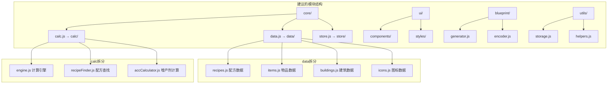

### 9.2 状态管理建议

当前使用全局变量管理状态，建议迁移到统一的状态管理：

```javascript
// 建议的状态结构
const store = {
    state: {
        requirements: [],      // xqs
        exclusions: [],        // ig_names
        settings: {
            machine: {},       // settings
            speed: {},         // settings_time
            recipe: {}         // settings_pf
        },
        projects: [],
        ui: {
            showSettings: false,
            showSelector: false,
            editingIndex: -1
        }
    },
    mutations: {
        addRequirement(item, number) {},
        removeRequirement(index) {},
        updateSettings(key, value) {},
        // ...
    },
    actions: {
        calculateAll() {},
        generateBlueprint() {},
        saveProject() {}
    }
};
```

### 9.3 函数职责划分

| 原函数 | 建议模块 | 职责 |
|--------|----------|------|
| `update_all()` | calc/engine.js | 主计算调度 |
| `loadNumber()` | calc/engine.js | 递归计算 |
| `find()` | calc/recipeFinder.js | 配方查找 |
| `getPfs()` | calc/recipeFinder.js | 配方列表获取 |
| `getValue()` | calc/accCalculator.js | 设备参数获取 |
| `getAccSpeed()` | calc/accCalculator.js | 增产剂计算 |
| `saveData/getData` | utils/storage.js | 存储操作 |
| `f_init()` | core/init.js | 初始化入口 |
| `f_initIcons()` | ui/icons.js | 图标初始化 |
| `generateBlueprint()` | blueprint/generator.js | 蓝图生成 |
| `getRecipe()` | blueprint/generator.js | 配方收集 |

### 9.4 注意事项

1. **保持计算结果一致性**：重构时需确保计算逻辑完全一致，建议编写单元测试对比重构前后结果

2. **全局变量依赖**：`xh_list`、`out_list`等临时变量在递归计算中被修改，重构时需注意作用域

3. **Vue响应式依赖**：`app`全局变量被多处引用，需保持Vue实例的响应式更新

4. **事件绑定顺序**：部分事件依赖DOM元素存在，需确保初始化顺序正确

5. **配方索引优化**：已实现的`recipeIndexByProduct`索引需保留，避免性能退化

---

## 附录：关键代码位置索引

| 功能 | 文件 | 行号范围 |
|------|------|----------|
| 配方数据定义 | data.js | 1-4000 |
| 配方索引构建 | data.js | 4000-4200 |
| Vue实例创建 | data.js | 5000-5100 |
| update_all函数 | data.js | 5700-6000 |
| loadNumber函数 | data.js | 5400-5600 |
| find函数 | data.js | 4700-4900 |
| 事件绑定初始化 | data.js | 5000-5400 |
| 蓝图生成入口 | data.js | 6200-6662 |
| Blueprint类 | blueprint.js | 1-4034 |
| itemMap定义 | blueprint.js | 1-150 |
| buildingMap定义 | blueprint.js | 150-400 |
