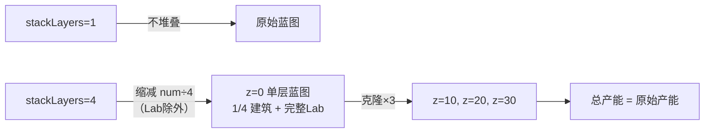
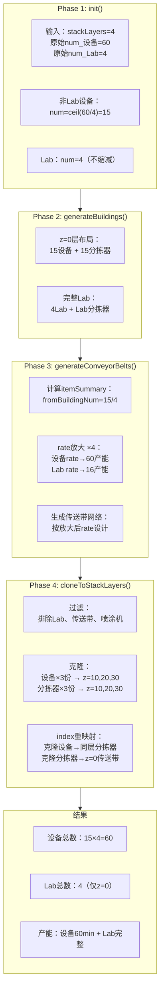
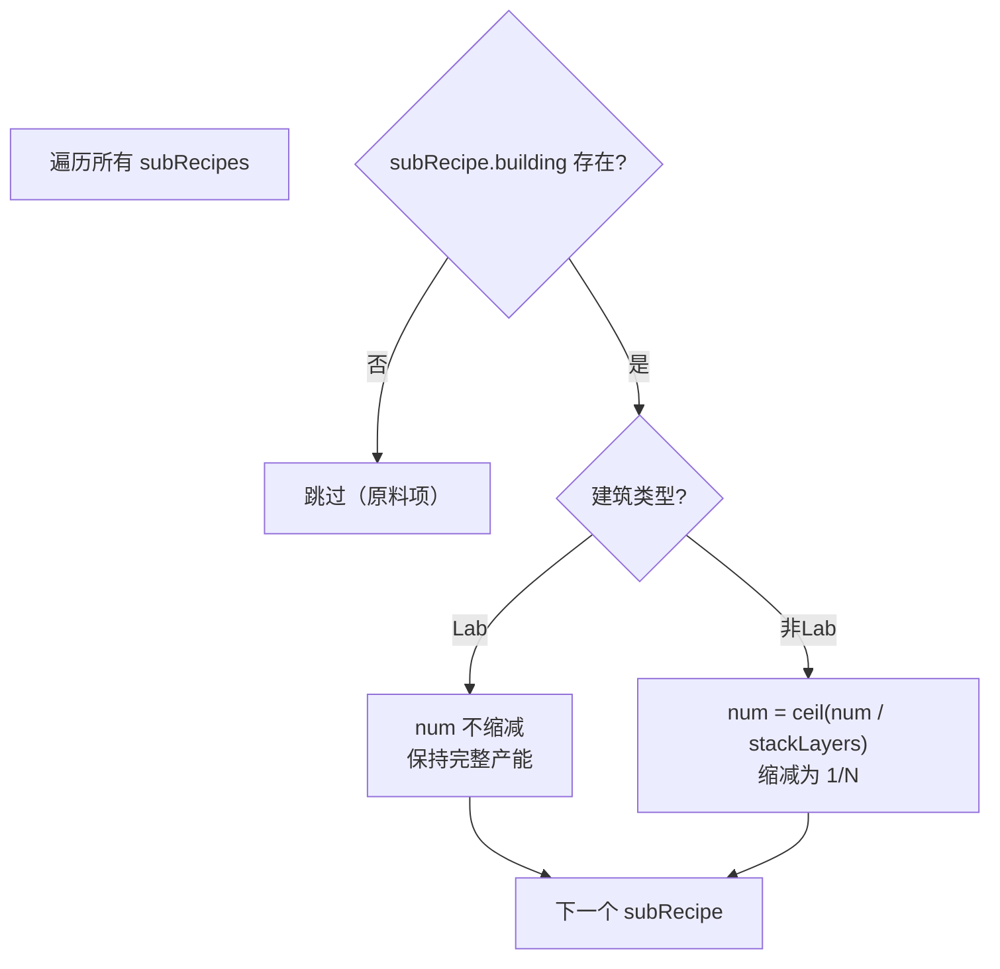
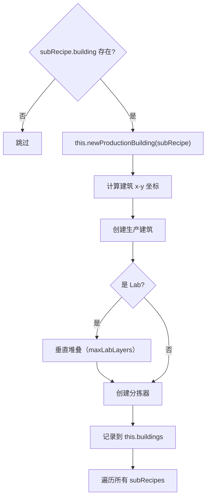
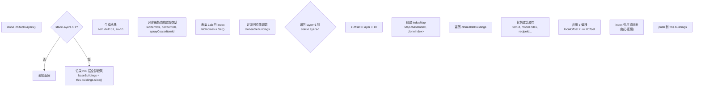
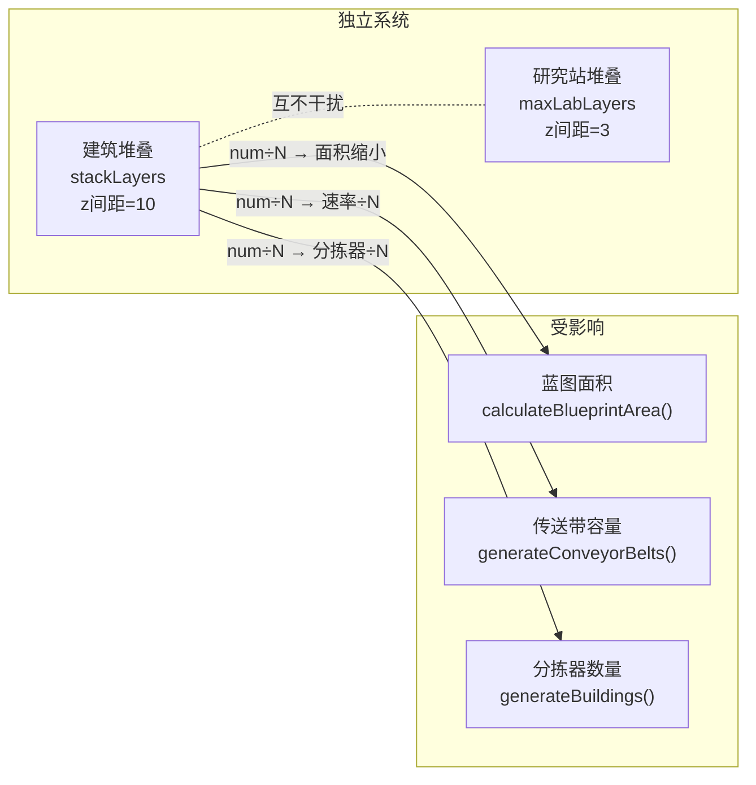
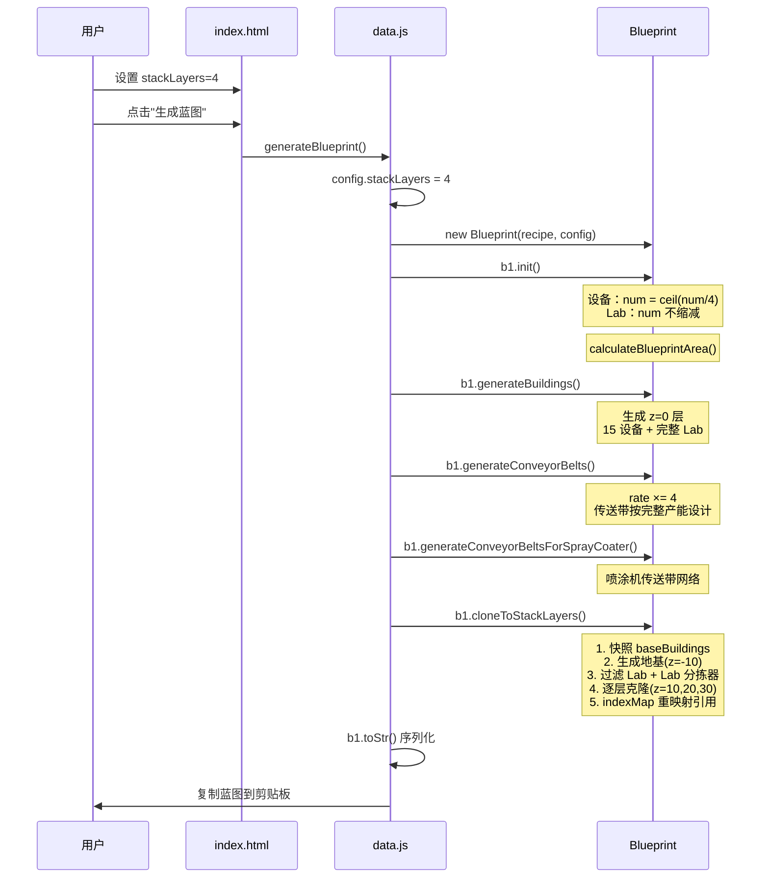

# 建筑堆叠模块说明

## 目录

- [1. 功能概述](#1-功能概述)
- [2. 核心设计原则](#2-核心设计原则)
- [3. 完整堆叠流程](#3-完整堆叠流程)
- [4. Phase 1: init() 初始化与num缩减](#4-phase-1-init-初始化与num缩减)
- [5. Phase 2: generateBuildings() 单层布局](#5-phase-2-generatebuildings-单层布局)
- [6. Phase 3: generateConveyorBelts() 传送带网络生成](#6-phase-3-generateconveyorbelts-传送带网络生成)
- [7. Phase 4: cloneToStackLayers() 克隆到高层](#7-phase-4-clonetostacklayers-克隆到高层)
- [8. 堆叠后蓝图结构](#8-堆叠后蓝图结构)
- [9. Index引用重映射机制](#9-index引用重映射机制)
- [10. 研究站Lab特殊处理](#10-研究站lab特殊处理)
- [11. 各建筑类型处理规则](#11-各建筑类型处理规则)
- [12. 非堆叠模式兼容性](#12-非堆叠模式兼容性)
- [13. 与现有功能的交互](#13-与现有功能的交互)
- [14. 产能计算验证](#14-产能计算验证)

---

## 1. 功能概述

建筑堆叠将一条平铺的产线蓝图，垂直复制到多个 z 层（z=0, 10, 20, 30），使相同产能占用更小的地表面积。

- **配置入口**：`index.html` 中 `stackLayers` 输入框（1-4，默认 1）
- **核心思想**：先缩减 `building.num` 为 `1/N`，正常生成单层蓝图，再将非 Lab 建筑克隆到高层
- **堆叠层间距**：10（游戏内建筑堆叠标准间距）
- **关键特性**：研究站（Lab）特殊处理，num 不缩减，保持完整产能



### 1.1 设计目标

| 目标 | 说明 | 状态 |
|------|------|------|
| 总产能 | 保持原始产能（如60min） | ✅ |
| 占地面积 | 减少为1/4（4层堆叠时） | ✅ |
| Lab产能 | 完整产能，不损失 | ✅ |
| 向后兼容 | stackLayers=1时行为不变 | ✅ |

---

## 2. 核心设计原则

```
堆叠功能的核心洞察：

1. init() 缩减 num（除Lab外）
   → 60个设备 → ceil(60/4) = 15个设备/层
   → Lab.num 不缩减，保持完整

2. generateBuildings() 单层布局
   → 15个设备 + 15个分拣器在z=0
   → 完整Lab在z=0布局

3. generateConveyorBelts() rate放大
   → rate ×= 4（支撑4层产能）
   → 传送带按完整产能设计

4. cloneToStackLayers() 克隆
   → 15设备 × 3份 → z=10,20,30
   → 15分拣器 × 3份 → z=10,20,30
   → Lab不克隆

5. 共享传送带网络
   → 所有层的分拣器连接到z=0的传送带
   → 4层并行工作，总产能 = 60min
```

---

## 3. 完整堆叠流程

```
stackLayers=4 时的完整数据流：

┌─────────────────────────────────────────────────────────────────────────────┐
│                              核心洞察                                        │
│                                                                             │
│  1. init(): num缩减（除Lab外）→ ceil(60/4)=15                              │
│  2. generateBuildings(): 缩减为15个设备在z=0                                │
│  3. generateConveyorBelts(): rate×4放大（支撑4层产能）                       │
│  4. cloneToStackLayers(): 复制15个×3份到高层                              │
│  5. 所有层共享z=0传送带网络                                                  │
│  6. Lab特殊处理：num不缩减，不克隆，在z=0层完整工作                         │
└─────────────────────────────────────────────────────────────────────────────┘
```

### 3.1 流程总览图



---

## 4. Phase 1: init() 初始化与num缩减

### 4.1 代码位置

`blueprint.js` L2048-2082

### 4.2 核心逻辑

```javascript
init() {
    this.mapRecipeID();

    // 堆叠模式：根据堆叠层数缩减num
    // 例如：60个设备，4层堆叠 → 每层15个设备
    // init(): num=ceil(60/4)=15
    // generateBuildings(): 15个设备在z=0
    // generateConveyorBelts(): rate×4放大（支撑4层产能）
    // cloneToStackLayers(): 复制15个设备到3层 → 总共60个设备
    // 核心：4层并行工作，总产能=60min
    //
    // 重要：研究站（Lab）特殊处理
    // - Lab 不参与克隆（布局复杂，暂不支持）
    // - Lab.num 不缩减，保持完整数量在 z=0 层工作
    // - 这样 Lab 的产能不会损失
    if (this.config.stackLayers > 1) {
        for (let subRecipe of this.recipe.subRecipes) {
            if (subRecipe.building) {
                // 排除 Lab（不缩减num，保持完整产能）
                if (buildingMap[subRecipe.building.name].category !== productionCategory.lab) {
                    subRecipe.building.num = Math.ceil(
                        subRecipe.building.num / this.config.stackLayers
                    );
                }
            }
        }
    }

    this.calculateBlueprintArea();
    // ...
}
```

### 4.3 num缩减规则



### 4.4 数据示例

```
输入参数：
  - 设备原始 num = 60
  - Lab 原始 num = 4
  - stackLayers = 4

处理结果：
  ┌─────────────────────────────────────────┐
  │ 设备 num = ceil(60/4) = 15             │
  │   → z=0 层 15 个，克隆 3 份到高层       │
  │   → 总设备数 = 15 × 4 = 60             │
  │   → 总产能 = 60min                      │
  │                                         │
  │ Lab num = 4（保持不变）                  │
  │   → 只在 z=0 层                         │
  │   → 完整 4 个 Lab 工作                  │
  │   → 产能不损失                          │
  └─────────────────────────────────────────┘
```

### 4.5 关键点

| 关键点 | 说明 |
|--------|------|
| `Math.ceil` | 向上取整保证每层至少 1 个建筑 |
| **Lab 不缩减** | Lab.num 保持完整，产能不损失 |
| 时机 | 缩减在 `calculateBlueprintArea()` 之前 |

---

## 5. Phase 2: generateBuildings() 单层布局

### 5.1 代码位置

`blueprint.js` L2646+

### 5.2 布局逻辑



### 5.3 z=0层布局结构

```
           y轴
            ↑
     ┌──────────────────────────────────────────────────────┐
     │                                                      │
     │   [Lab 垂直堆叠区]                                   │
     │   ┌─────┐                                           │
     │   │Lab1 │ z=0                                       │
     │   │Lab2 │ z=3                                       │
     │   │Lab3 │ z=6                                       │
     │   │Lab4 │ z=9                                       │
     │   └─────┘                                           │
     │                                                      │
     │   [Lab 分拣器区]                                    │
     │   ┌─────────────────┐                               │
     │   │[Lab 分拣器 1-4]│                               │
     │   └─────────────────┘                               │
     │                                                      │
     │   [生产设备区]                                      │
     │   ┌─────────────────────────────────────────┐       │
     │   │ [设备1]→[分拣器1]                       │       │
     │   │ [设备2]→[分拣器2]                       │       │
     │   │ [设备3]→[分拣器3]                       │       │
     │   │ ...                                     │       │
     │   │ [设备15]→[分拣器15]                     │       │
     │   └─────────────────────────────────────────┘       │
     │                                                      │
     └──────────────────────────────────────────────────────┘
                              → x轴
```

### 5.4 布局特点

| 区域 | 设备数量 | 堆叠方式 |
|------|---------|---------|
| 生产设备区 | 15 | 单层 z=0 布局 |
| 分拣器区 | 15 | 跟随对应设备 |
| Lab 区 | 4 | 垂直堆叠（z=0,3,6,9） |
| Lab 分拣器 | 4 | 跟随对应 Lab |

---

## 6. Phase 3: generateConveyorBelts() 传送带网络生成

### 6.1 代码位置

`blueprint.js` L2239-2400+

### 6.2 处理步骤

```
┌─────────────────────────────────────────────────────────────────────────┐
│ Step 1: 计算 itemSummary                                                 │
│                                                                         │
│ itemSummary 数据结构：                                                   │
│ {                                                                       │
│   itemName: {                                                          │
│     rate: Number,           // 产出速率                                 │
│     fromBuildingNum: Number,  // 产出建筑数量                           │
│     toBuildingNum: Number,    // 消耗建筑数量                           │
│     inputRate: Number,        // 消耗速率（可选）                       │
│     needProliferator: Boolean // 是否需要增产剂                        │
│   }                                                                    │
│ }                                                                       │
└─────────────────────────────────────────────────────────────────────────┘
                                    ↓
┌─────────────────────────────────────────────────────────────────────────┐
│ Step 2: rate 放大 × stackLayers                                          │
│                                                                         │
│ // 堆叠模式：放大 rate × stackLayers                                   │
│ // 目的：传送带网络按完整产能设计                                        │
│ const stackLayers = this.config.stackLayers || 1;                       │
│ if (stackLayers > 1) {                                                 │
│   for (let key in itemSummary) {                                       │
│     itemSummary[key].rate *= stackLayers;                              │
│     if (itemSummary[key].inputRate !== undefined) {                     │
│       itemSummary[key].inputRate *= stackLayers;                        │
│     }                                                                  │
│   }                                                                     │
│                                                                         │
│   // 分拣器 rate 也放大                                                 │
│   for (let itemName in this.sorters) {                                │
│     if (this.sorters[itemName].output) {                               │
│       for (let s of this.sorters[itemName].output) {                  │
│         s.rate *= stackLayers;                                         │
│       }                                                                │
│     }                                                                   │
│   }                                                                     │
│ }                                                                       │
└─────────────────────────────────────────────────────────────────────────┘
```

### 6.3 数据示例

```
设备（stackLayers=4）：
  原始：fromBuildingNum=15, rate=baseRate×15
  放大：rate = baseRate×15×4 = baseRate×60
  → 传送带按 60 产能设计

Lab（stackLayers=4）：
  原始：fromBuildingNum=4, rate=LabRate×4
  放大：rate = LabRate×4×4 = LabRate×16
  → Lab 传送带按放大后产能设计
```

### 6.4 分拣器分配策略

```javascript
// 分拣器分配策略
const sortersPerNode = stackLayers > 1
    ? Math.max(1, Math.floor(this.config.maxSorterNumOneBelt / stackLayers))
    : this.config.maxSorterNumOneBelt;

// 示例：maxSorterNumOneBelt=8, stackLayers=4
//   sortersPerNode = floor(8/4) = 2
//   每个传送带节点分配 2 个分拣器
//   克隆后：2 × 4 = 8 ≤ 8（不超限）
```

---

## 7. Phase 4: cloneToStackLayers() 克隆到高层

### 7.1 代码位置

`blueprint.js` L2079-2227

### 7.2 完整流程



### 7.3 过滤逻辑

```javascript
// 识别需跳过的建筑类型
const labItemIds = new Set([
    buildingMap.lab.itemId,
    buildingMap["自演化研究站"].itemId,
]);
const beltItemIds = new Set([2001, 2002, 2003]);
const sprayCoaterItemId = buildingMap.sprayCoater.itemId;

// 过滤出需要克隆的建筑（核心过滤逻辑）
const cloneableBuildings = baseBuildings.filter((b) => {
    // Lab 不克隆
    if (labItemIds.has(b.itemId)) return false;

    // Lab 相关分拣器也不克隆
    if (labIndices.has(b.inputObjIdx) || labIndices.has(b.outputObjIdx)) return false;

    // 传送带不克隆
    if (beltItemIds.has(b.itemId)) return false;

    // 喷涂机不克隆
    if (b.itemId === sprayCoaterItemId) return false;

    return true;
});
```

### 7.4 过滤规则表

| 建筑类型 | itemId | 是否克隆 | 原因 |
|----------|--------|---------|------|
| Lab | 2901/2902 | ❌ | 已有 maxLabLayers 垂直堆叠 |
| Lab 分拣器 | 2011-2014 | ❌ | 连接到 Lab |
| 传送带 | 2001-2003 | ❌ | 所有层共享 z=0 |
| 喷涂机 | 2313 | ❌ | 暂不支持 |
| 制造台/熔炉/化工厂 | 2302-2317 | ✅ | 核心生产建筑 |
| 电力感应塔 | 2201 | ✅ | 每层独立供电 |

---

## 8. 堆叠后蓝图结构

```
堆叠后完整结构（stackLayers=4）：

┌─────────────────────────────────────────────────────────────────────────────┐
│ z=30 层（第 4 层，克隆）                                                   │
│ ┌─────────────────────────────────────────────────────────────────────────┐ │
│ │ [设备 1-15 克隆]                                                         │ │
│ │   - localOffset.z = 30                                                 │ │
│ │   - outputObjIdx → 同层分拣器（indexMap 重映射）                        │ │
│ │   - inputObjIdx → z=0 地基（保持原值）                                  │ │
│ │                                                                         │ │
│ │ [分拣器 1-15 克隆]                                                       │ │
│ │   - localOffset.z = 30                                                 │ │
│ │   - outputObjIdx → z=0 传送带（保持原值）                               │ │
│ │   - inputObjIdx → 同层设备（indexMap 重映射）                           │ │
│ │                                                                         │ │
│ │ ⚠️ 无 Lab（Lab 不参与克隆）                                            │ │
└─────────────────────────────────────────────────────────────────────────────┘
                                        ↑ 所有层共享传送带
┌─────────────────────────────────────────────────────────────────────────────┐
│ z=20 层（第 3 层，克隆）                                                   │
│ ┌─────────────────────────────────────────────────────────────────────────┐ │
│ │ [设备 1-15 克隆]                                                         │ │
│ │   - localOffset.z = 20                                                 │ │
│ │   - outputObjIdx → 同层分拣器                                           │ │
│ │   - inputObjIdx → z=0 地基                                             │ │
│ │                                                                         │ │
│ │ [分拣器 1-15 克隆]                                                       │ │
│ │   - localOffset.z = 20                                                 │ │
│ │   - outputObjIdx → z=0 传送带                                           │ │
│ │   - inputObjIdx → 同层设备                                               │ │
│ │                                                                         │ │
│ │ ⚠️ 无 Lab                                                               │ │
└─────────────────────────────────────────────────────────────────────────────┘
                                        ↑ 所有层共享传送带
┌─────────────────────────────────────────────────────────────────────────────┐
│ z=10 层（第 2 层，克隆）                                                   │
│ ┌─────────────────────────────────────────────────────────────────────────┐ │
│ │ [设备 1-15 克隆]                                                         │ │
│ │   - localOffset.z = 10                                                 │ │
│ │   - outputObjIdx → 同层分拣器                                           │ │
│ │   - inputObjIdx → z=0 地基                                              │ │
│ │                                                                         │ │
│ │ [分拣器 1-15 克隆]                                                       │ │
│ │   - localOffset.z = 10                                                 │ │
│ │   - outputObjIdx → z=0 传送带                                           │ │
│ │   - inputObjIdx → 同层设备                                               │ │
│ │                                                                         │ │
│ │ ⚠️ 无 Lab                                                               │ │
└─────────────────────────────────────────────────────────────────────────────┘
                                        ↑ 所有层共享传送带
┌─────────────────────────────────────────────────────────────────────────────┐
│ z=0 层（第 1 层，原始）                                                    │
│ ┌─────────────────────────────────────────────────────────────────────────┐ │
│ │ [设备 1-15]                                                              │ │
│ │   - localOffset.z = 0                                                  │ │
│ │   - outputObjIdx → 同层分拣器                                            │ │
│ │   - inputObjIdx → z=0 地基                                               │ │
│ │                                                                         │ │
│ │ [分拣器 1-15]                                                            │ │
│ │   - localOffset.z = 0                                                  │ │
│ │   - outputObjIdx → 传送带网络                                            │ │
│ │   - inputObjIdx → 同层设备                                               │ │
│ │                                                                         │ │
│ │ [传送带网络]                                                             │ │
│ │   - 只在 z=0 层生成                                                      │ │
│ │   - 按 60 产能设计（rate×4）                                            │ │
│ │   - 所有层共享                                                           │ │
│ │                                                                         │ │
│ │ [Lab 1-4]（完整数量，不克隆）                                           │ │
│ │   - Lab1: z=0                                                          │ │
│ │   - Lab2: z=3                                                          │ │
│ │   - Lab3: z=6                                                          │ │
│ │   - Lab4: z=9                                                          │ │
│ │   - 完整 4 个 Lab 工作，产能不损失                                       │ │
│ │                                                                         │ │
│ │ [Lab 分拣器 1-4]                                                         │ │
│ │   - 跟随对应 Lab                                                        │ │
│ │   - 连接到 Lab 传送带网络                                                │ │
└─────────────────────────────────────────────────────────────────────────────┘
                                        ↓
┌─────────────────────────────────────────────────────────────────────────────┐
│ z=-10 层（地基）                                                           │
│ ┌─────────────────────────────────────────────────────────────────────────┐ │
│ │ [Foundation]                                                            │ │
│ │   - itemId = 1131                                                      │ │
│ │   - localOffset.z = -10                                                │ │
│ │   - 所有高层设备的 inputObjIdx 指向地基                                 │ │
└─────────────────────────────────────────────────────────────────────────────┘
```

---

## 9. Index引用重映射机制

### 9.1 核心逻辑

```javascript
// index 引用重映射
// 修复：所有克隆体的 outputObjIdx 都保持原值（指向 z=0 层的分拣器）
// 这样所有层的设备都连接到 z=0 的分拣器，再连接到 z=0 的传送带网络
// 避免克隆设备 outputObjIdx 指向克隆分拣器导致的连接异常
clone.outputObjIdx = base.outputObjIdx;

// inputObjIdx 需要重映射（连接到同层克隆分拣器）
if (indexMap.has(base.inputObjIdx)) {
    clone.inputObjIdx = indexMap.get(base.inputObjIdx);
} else {
    clone.inputObjIdx = base.inputObjIdx;
}
```

### 9.2 z=0 层原始 index 引用

```
设备 1：
  index = 1
  outputObjIdx = 101（指向分拣器 1）
  inputObjIdx = -1（指向地基）

分拣器 1：
  index = 101
  outputObjIdx = 1001（指向传送带节点 A）
  inputObjIdx = 1（指向设备 1）

传送带节点 A：
  index = 1001
  output1（下游传送ObjIdx = -带）
  inputObjIdx = 101（接受分拣器 1 输入）
```

### 9.3 z=10 层克隆体 index 引用

```
克隆设备 1（对应 z=0 的设备 1）：
  index = 1001（假设）
  outputObjIdx = 1101（指向同层克隆分拣器 1，通过 indexMap 重映射）
  inputObjIdx = -1（指向地基，保持原值）

克隆分拣器 1（对应 z=0 的分拣器 1）：
  index = 1101
  outputObjIdx = 1001（指向 z=0 传送带节点 A，保持原值）
  inputObjIdx = 1001（指向同层克隆设备 1，通过 indexMap 重映射）
```

### 9.4 indexMap 结构

```
// indexMap 包含：{ 原始 index: 克隆 index }
// { 1: 1001, 2: 1002, ..., 101: 1101, 102: 1102, ... }

// z=0 层: [B0, Lab1, B2, LabSorter3, B4, B5]
//             ↓ 过滤后
// 可克隆:     [B0, B2, B4, B5]
//             ↓ 映射
// indexMap:   {0→N+1, 2→N+2, 4→N+3, 5→N+4}
```

### 9.5 重映射规则表

| 建筑类型 | base.outputObjIdx | clone.outputObjIdx | 原因 |
|----------|------------------|-------------------|------|
| 克隆设备 | 分拣器 index | 同层克隆分拣器 indexMap | 需要连接到同层分拣器 |
| 克隆分拣器 | 传送带 index | z=0 传送带 index（原值） | 所有层共享 z=0 传送带 |
| 克隆设备 inputObjIdx | -1 | -1 | 指向地基 |
| 克隆分拣器 inputObjIdx | 设备 index | 同层克隆设备 indexMap | 需要连接同层设备 |

---

## 10. 研究站Lab特殊处理

### 10.1 为什么不参与堆叠？

```
两个独立的堆叠系统：

┌─────────────────────────────────────────────────────────────────────────┐
│ 系统 1：建筑堆叠（stackLayers）                                          │
│   - 目标：减少占地面积                                                    │
│   - 适用于：生产设备（制造台/熔炉等）                                      │
│   - 机制：num÷N 后克隆到 N 层                                            │
│   - z 间距：10                                                           │
│   - Lab：不参与（num 不缩减，不克隆）                                    │
│                                                                         │
│ 系统 2：研究站垂直堆叠（maxLabLayers）                                    │
│   - 目标：Lab 垂直堆叠，节省水平空间                                       │
│   - 适用于：研究站（Lab）                                                │
│   - 机制：Lab 垂直向上堆叠                                                │
│   - z 间距：3（Lab.height）                                              │
│   - 与 stackLayers 无关                                                   │
└─────────────────────────────────────────────────────────────────────────┘
```

### 10.2 Lab 的完整处理流程

```
Lab 处理规则：

1. init() 中：
   - Lab.num 不缩减（保持完整数量）
   - 只有非 Lab 设备 num 缩减

2. generateBuildings() 中：
   - Lab 正常布局（在 z=0 层，使用 maxLabLayers 垂直堆叠）
   - Lab 分拣器正常生成

3. generateConveyorBelts() 中：
   - Lab 参与 itemSummary 计算
   - Lab 的 fromBuildingNum = 完整 num（不缩减）
   - Lab 传送带网络正常生成

4. cloneToStackLayers() 中：
   - Lab 不克隆到高层（过滤掉）
   - Lab 相关分拣器也不克隆
   - 只有 z=0 层的 Lab 工作

效果：
   - Lab 产能 = 完整产能（4 个 Lab）
   - 其他设备产能 = 完整产能（通过 4 层并行）
```

### 10.3 Lab 布局示例

```
Lab 垂直堆叠（maxLabLayers=4）：
       z轴
        ↑
   9   │ [Lab 4] ──→ [Lab 分拣器 4]
        │
   6   │ [Lab 3] ──→ [Lab 分拣器 3]
        │
   3   │ [Lab 2] ──→ [Lab 分拣器 2]
        │
   0   │ [Lab 1] ──→ [Lab 分拣器 1]
        │
  -10  │ [地基]
        └──────────────────────────────→ x 轴
```

---

## 11. 各建筑类型处理规则

| 建筑类型 | itemId | init() 缩减 | 克隆到高层 | z>0 inputObjIdx | 备注 |
|----------|--------|-----------|-----------|-----------------|------|
| 制造台/熔炉/化工厂/精炼厂/对撞机 | 2302-2317 | ✅ num÷N | ✅ | 地基 | 核心生产建筑 |
| **研究站（Lab）** | 2901/2902 | **❌ 不缩减** | **❌ 不克隆** | **—** | **完整产能，z=0 工作** |
| 分拣器（非 Lab） | 2011-2014 | — | ✅ | indexMap | 跟随生产建筑 |
| 分拣器（Lab） | 2011-2014 | — | ❌ | — | 只在 z=0 |
| 传送带 | 2001-2003 | — | ❌ | — | 所有层共享 z=0 |
| 电力感应塔 | 2201 | — | ✅ | 地基 | 每层独立供电 |
| 喷涂机 | 2313 | — | ❌ | — | 暂不支持 |
| 地基 | 1131 | — | — | -1 | 仅 1 个，z=-10 |

---

## 12. 非堆叠模式兼容性

```
stackLayers=1 或不设置时的流程：

┌─────────────────────────────────────────────────────────────────────────┐
│ init()                                                                   │
│   if (this.config.stackLayers > 1) {                                    │
│     // 条件不满足，跳过                                                   │
│   }                                                                       │
│   → num 不缩减                                                           │
└─────────────────────────────────────────────────────────────────────────┘
                                    ↓
┌─────────────────────────────────────────────────────────────────────────┐
│ generateConveyorBelts()                                                  │
│   const stackLayers = this.config.stackLayers || 1;                     │
│   if (stackLayers > 1) {                                                │
│     // 条件不满足，跳过                                                   │
│   }                                                                       │
│   → rate 不放大                                                          │
└─────────────────────────────────────────────────────────────────────────┘
                                    ↓
┌─────────────────────────────────────────────────────────────────────────┐
│ cloneToStackLayers()                                                      │
│   if (!this.config.stackLayers || this.config.stackLayers <= 1) {        │
│     return; // 条件满足，直接返回                                         │
│   }                                                                       │
│   → 不克隆                                                               │
└─────────────────────────────────────────────────────────────────────────┘
                                    ↓
┌─────────────────────────────────────────────────────────────────────────┐
│ 结果：                                                                   │
│   - 原始流程完全不变                                                     │
│   - num 不缩减                                                           │
│   - rate 不放大                                                          │
│   - 不克隆                                                               │
│   - ✅ 向后完全兼容                                                      │
└─────────────────────────────────────────────────────────────────────────┘
```

---

## 13. 与现有功能的交互



| 功能 | 交互方式 | 是否兼容 |
|------|----------|----------|
| `maxLabLayers` 研究站堆叠 | 独立系统，Lab 在 z=0 层内部堆叠（z=0,3,6...） | ✅ |
| `onlySorterMk3` / `useSorterMk4` | 影响分拣器类型选择，克隆时深拷贝 parameters | ✅ |
| `onlyConveyorBeltMk3` | 影响传送带等级，克隆时完整复制 | ✅ |
| `selfSpray` 自喷涂 | 喷涂机 + 传送带在 z=0 生成后被克隆 | ✅ |
| `generateTeslaTower` 电塔 | 电塔被克隆，z>0 层 inputObjIdx 指向地基 | ✅ |
| `conveyorBeltStackLayer` 传送带物品堆叠 | 物品堆叠层数，不影响建筑堆叠 | ✅ |
| `stackLayers=1` | 所有堆叠逻辑均有 `>1` 守卫，行为完全不变 | ✅ |

---

## 14. 产能计算验证

### 14.1 设备产能

```
输入：
  - 原始 num_设备 = 60
  - stackLayers = 4

处理：
  1. init()：num_设备 = ceil(60/4) = 15
  2. generateBuildings()：生成 15 个设备
  3. cloneToStackLayers()：克隆到 3 层，总设备数 = 15 × 4 = 60

产能计算：
  ┌─────────────────────────────────────────┐
  │ 单设备产能 = 1min（假设）               │
  │                                         │
  │ 单层产能 = 15 设备 × 1min = 15min       │
  │                                         │
  │ 总产能 = 15min × 4 层 = 60min          │
  │                                         │
  │ ✅ 达到目标产能                        │
  └─────────────────────────────────────────┘
```

### 14.2 Lab 产能

```
输入：
  - 原始 num_Lab = 4
  - stackLayers = 4

处理：
  1. init()：num_Lab = 4（不缩减）
  2. generateBuildings()：生成 4 个 Lab（垂直堆叠）
  3. cloneToStackLayers()：Lab 不克隆，只在 z=0

产能计算：
  ┌─────────────────────────────────────────┐
  │ 单 Lab 产能 = 1min（假设）              │
  │                                         │
  │ Lab 总产能 = 4Lab × 1min = 4min        │
  │                                         │
  │ ✅ Lab 完整产能，不损失                 │
  └─────────────────────────────────────────┘
```

### 14.3 传送带承载能力

```
输入：
  - 设备总产能 = 60min
  - 单传送带运力 = 30/min（Mk3）
  - 需要传送带节点 = ceil(60 / 30) = 2

处理：
  1. rate 放大 × 4
  2. 生成传送带网络按放大后 rate
  3. 每个节点分配 floor(8/4) = 2 个分拣器
  4. 克隆后：2 × 4 = 8 ≤ 8（不超限）

承载验证：
  ┌─────────────────────────────────────────┐
  │ 传送带节点数 = 2                        │
  │ 单节点运力 = 30/min                     │
  │ 总运力 = 2 × 30 = 60/min              │
  │                                         │
  │ ✅ 支撑 60min 总产能                   │
  └─────────────────────────────────────────┘
```

---

## 附录：完整调用链



---

## 15. Bug修复记录

### 15.1 传送带节点分拣器分配错误（2026-02-12）

#### 问题描述
堆叠模式下，产出产能只有预期的一半。例如：
- 预期产出：60min
- 实际产出：30min
- 现象：有一半设备输出端没有输出到传送带

#### 问题根因
`generateConveyorBelts()` 方法中，传送带节点的分拣器分配判断条件错误。

**代码位置**: `blueprint.js` L2430

**错误代码**:
```javascript
if (doneSorterNum % sortersPerNode === 0) {
    inputData.push([this.sorters[itemName].output[j].index]);
} else {
    inputData[inputData.length - 1].push(
        this.sorters[itemName].output[j].index
    );
}
```

**问题分析**:
当 `doneSorterNum % sortersPerNode === 0` 时创建新节点，但新节点为空，当前分拣器被添加到**上一个节点**，导致分配不均。

**示例（sortersPerNode=2，8个分拣器）**:
```
错误结果: [[7], [6,5], [4,3], [2,1], [0]]
          ↑     ↑       ↑       ↑       ↑
        1个   2个      2个     2个     1个  ← 不均匀！
正确结果: [[7,6], [5,4], [3,2], [1,0]]
          ↑     ↑       ↑       ↑
         2个   2个     2个     2个    ← 均匀分配
```

#### 影响范围
- 堆叠模式下所有物品类型的传送带网络
- 产能输出不完整（通常只有预期的一半）
- 影响 2层、3层、4层堆叠的所有场景

#### 修复方案
```diff
- if (doneSorterNum % sortersPerNode === 0) {
+ if ((doneSorterNum + 1) % sortersPerNode === 0 || doneSorterNum === 0) {
```

#### 修复效果
- 每个传送带节点正确分配 `sortersPerNode` 个分拣器
- 不再出现节点分配不均的问题
- 所有堆叠层的设备都能正确连接到 z=0 的传送带网络
- 60min 产能完整输出

---

**文档版本：** 2.1
**最后更新：** 2026-02-12
**维护者：** DSQ 开发团队
