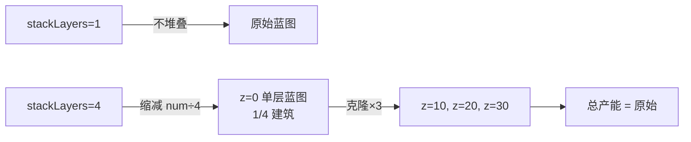
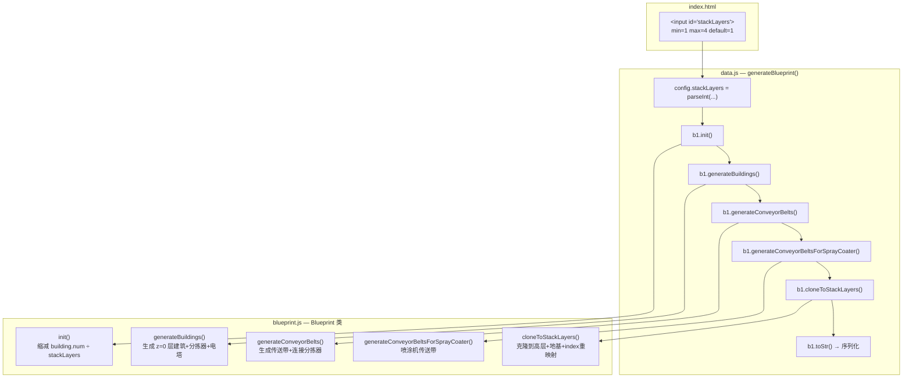
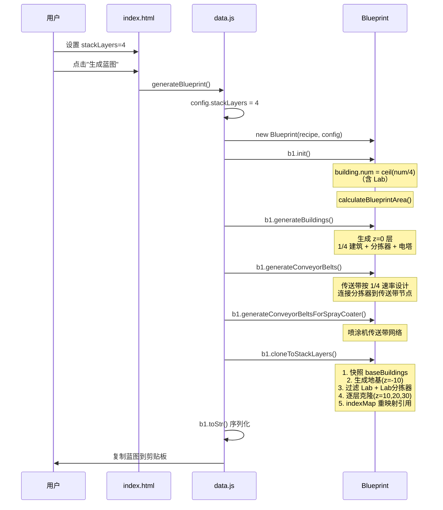
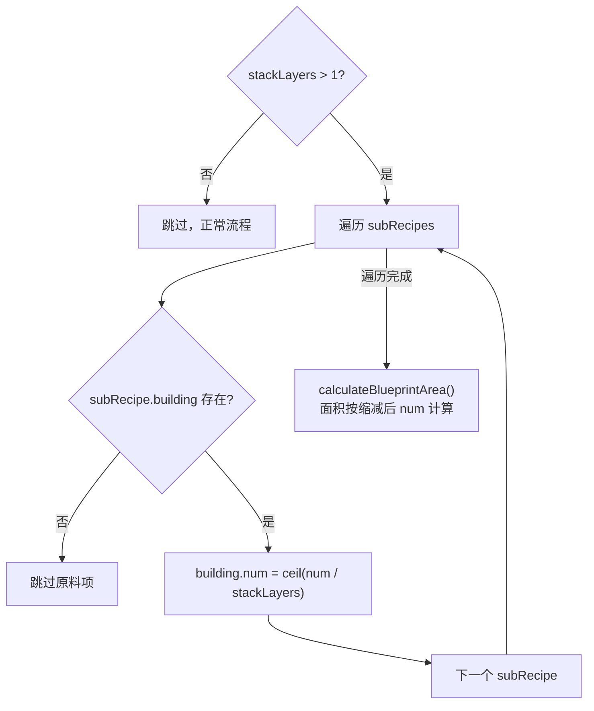
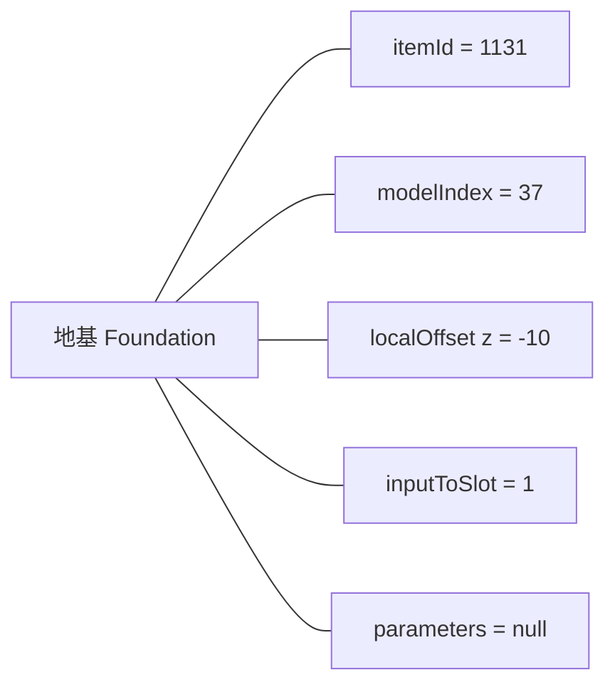
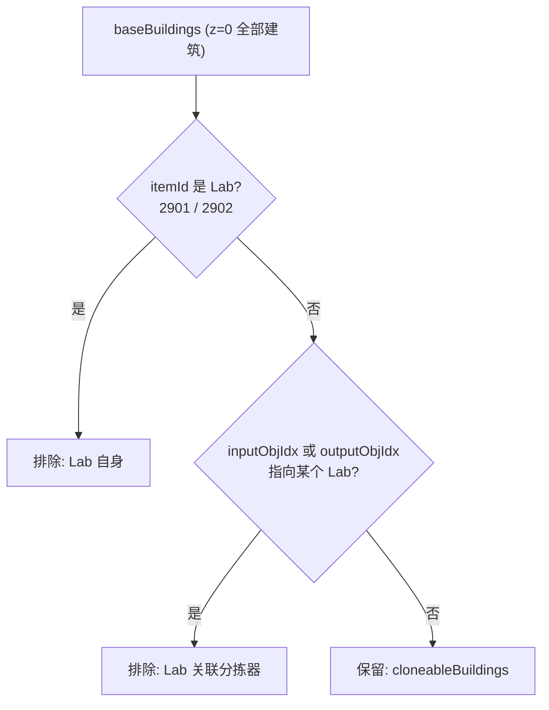
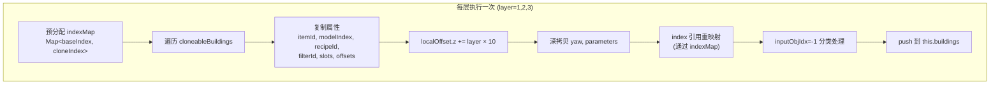
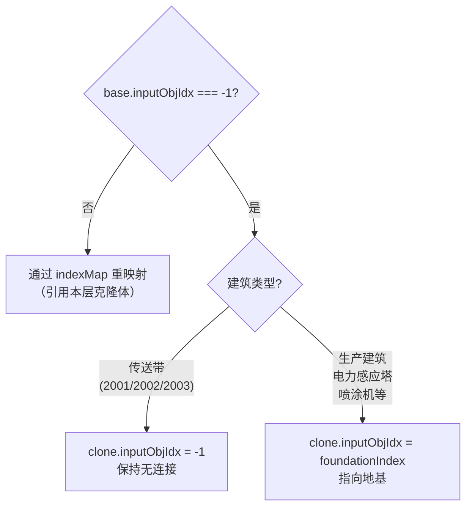
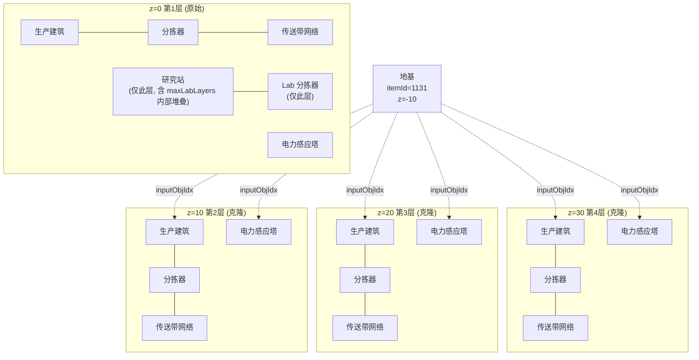
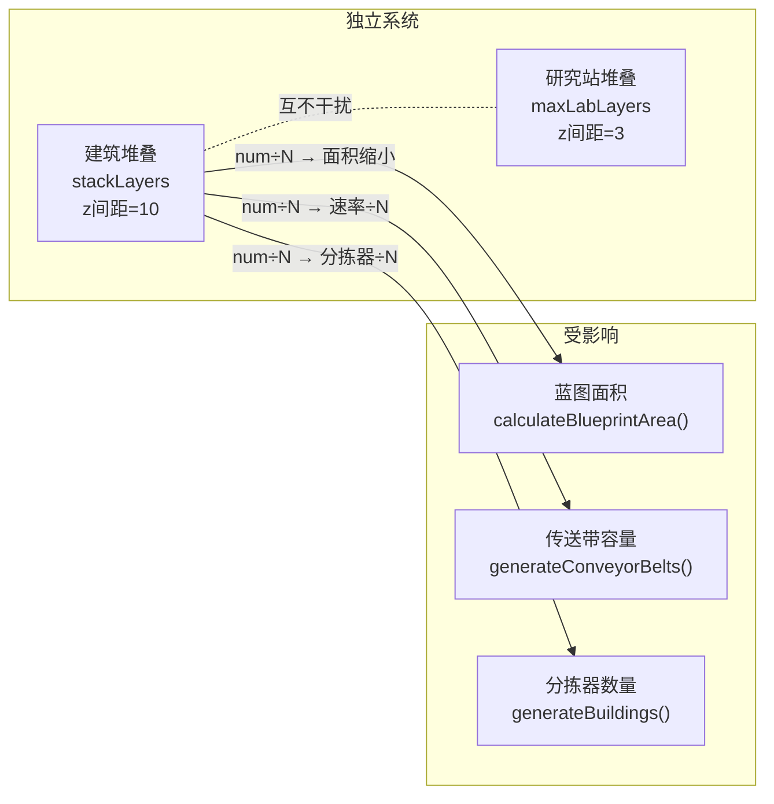

# 建筑堆叠模块说明

## 目录

- [1. 功能概述](#1-功能概述)
- [2. 整体架构](#2-整体架构)
- [3. 涉及文件与代码位置](#3-涉及文件与代码位置)
- [4. 完整调用链](#4-完整调用链)
- [5. Phase 1: UI 配置读取](#5-phase-1-ui-配置读取)
- [6. Phase 2: init() 建筑数量缩减](#6-phase-2-init-建筑数量缩减)
- [7. Phase 3: cloneToStackLayers() 核心克隆](#7-phase-3-clonetostacklayers-核心克隆)
  - [7.1 地基生成](#71-地基生成)
  - [7.2 Lab 与 Lab-Sorter 过滤](#72-lab-与-lab-sorter-过滤)
  - [7.3 逐层克隆与 Index 映射表](#73-逐层克隆与-index-映射表)
  - [7.4 inputObjIdx 分类处理](#74-inputobjidx-分类处理)
- [8. 堆叠后蓝图结构](#8-堆叠后蓝图结构)
- [9. 各建筑类型处理规则](#9-各建筑类型处理规则)
- [10. 与现有功能的交互](#10-与现有功能的交互)
- [11. 已知限制](#11-已知限制)

---

## 1. 功能概述

建筑堆叠将一条平铺的产线蓝图，垂直复制到多个 z 层（z=0, 10, 20, 30），使相同产能占用更小的地表面积。

- **配置入口**：`index.html` 中 `stackLayers` 输入框（1-4，默认 1）
- **核心思想**：先缩减 `building.num` 为 `1/N`，正常生成单层蓝图，再将非 Lab 建筑克隆到高层
- **堆叠层间距**：10（游戏内建筑堆叠标准间距）



---

## 2. 整体架构



---

## 3. 涉及文件与代码位置

| 文件 | 位置 | 改动内容 |
|------|------|----------|
| `index.html` | L167-168 | 新增 `<input id="stackLayers">` |
| `Scripts/data.js` | L6625 | `config.stackLayers` 读取 |
| `Scripts/data.js` | L6638 | 调用 `b1.cloneToStackLayers()` |
| `Scripts/blueprint.js` | L2061-2085 `init()` | `building.num` 缩减逻辑 |
| `Scripts/blueprint.js` | L2098-2227 `cloneToStackLayers()` | 核心克隆方法（~130行） |

---

## 4. 完整调用链



---

## 5. Phase 1: UI 配置读取

**index.html L167-168：**
```html
<span class="label">建筑堆叠层数</span>
<input type="number" id="stackLayers" min="1" max="4" value="1" class="textbox">
```

**data.js L6625：**
```javascript
stackLayers: parseInt(document.getElementById("stackLayers").value) || 1,
```

- `|| 1` 防止 `NaN`（用户清空输入框时）
- `min=1 max=4` 限制范围，1 表示不堆叠

---

## 6. Phase 2: init() 建筑数量缩减

**blueprint.js `init()` L2066-2073：**



**关键点：**
- `Math.ceil` 向上取整保证每层至少 1 个建筑
- **Lab 也参与缩减**（保持 z=0 层传送带吞吐量平衡）
- 缩减在 `calculateBlueprintArea()` 之前 → 蓝图面积随之缩小
- `subRecipe.building === null` 时为原料项，无需缩减

---

## 7. Phase 3: cloneToStackLayers() 核心克隆

### 7.1 地基生成



- 地基是 DSP 建筑堆叠的锚点，位于 z=-10
- 只生成 **1 个**，所有克隆层共用
- 通过 `getBuildingTemplate()` 分配 index，紧接在 z=0 建筑之后

### 7.2 Lab 与 Lab-Sorter 过滤



**过滤两步走：**
1. 收集所有 Lab 的 index 到 `labIndices` Set
2. 遍历 `baseBuildings`，排除：
   - `labItemIds.has(b.itemId)` — Lab 自身
   - `labIndices.has(b.inputObjIdx) || labIndices.has(b.outputObjIdx)` — 连接到 Lab 的分拣器

**Lab 不参与堆叠的原因：** Lab 已有自身的 `maxLabLayers` 垂直堆叠机制（z=0, z=3, z=6...），与建筑堆叠（z 间距=10）是独立系统。

### 7.3 逐层克隆与 Index 映射表



**为什么用映射表而不是简单 offset：**

因为 Lab 和 Lab-Sorter 被跳过，克隆体的 index 不是 base.index 的简单偏移。映射表确保每个引用精确指向本层对应克隆体。

```
z=0 层:  [B0, Lab1, B2, LabSorter3, B4, B5]
                ↓ 过滤后
可克隆:  [B0, B2, B4, B5]
                ↓ 映射
indexMap: {0→N+1, 2→N+2, 4→N+3, 5→N+4}
```

### 7.4 inputObjIdx 分类处理

当 z=0 层 `base.inputObjIdx === -1` 时，克隆层按建筑类型分别处理：



**数据验证（来自 001test-json 实际蓝图）：**

| 建筑类型 | z=0 inputObjIdx | z>0 inputObjIdx |
|----------|-----------------|-----------------|
| 生产建筑 (2305/2315/2317/2308/2310) | -1 | 地基 index |
| 电力感应塔 (2201) | -1 | 地基 index |
| 传送带 (2003) | -1 | -1 |
| 分拣器 (2014) | 生产建筑 index | 同层克隆体 index |

---

## 8. 堆叠后蓝图结构



---

## 9. 各建筑类型处理规则

| 建筑类型 | itemId | init() 缩减 | 克隆到高层 | z>0 inputObjIdx | 备注 |
|----------|--------|------------|-----------|-----------------|------|
| 熔炉/制造台/对撞机/化工厂/精炼厂 | 2303-2317 | ✅ num÷N | ✅ | 地基 | 核心生产建筑 |
| 研究站 (Lab) | 2901/2902 | ✅ num÷N | ❌ | — | 自身 maxLabLayers 堆叠 |
| 分拣器 (连接非Lab) | 2011-2014 | — | ✅ | indexMap 重映射 | 跟随生产建筑 |
| 分拣器 (连接Lab) | 2011-2014 | — | ❌ | — | 仅 z=0 层 |
| 传送带 | 2001-2003 | — | ✅ | -1 | 每层独立网络 |
| 电力感应塔 | 2201 | — | ✅ | 地基 | 每层独立供电 |
| 喷涂机 | 2313 | — | ✅ | 地基 | 每层独立喷涂 |
| 地基 | 1131 | — | — | -1 | 仅 1 个，z=-10 |

---

## 10. 与现有功能的交互



| 功能 | 交互方式 | 是否兼容 |
|------|----------|----------|
| `maxLabLayers` 研究站堆叠 | 独立系统，Lab 在 z=0 层内部堆叠（z=0,3,6...） | ✅ |
| `onlySorterMk3` / `useSorterMk4` | 影响分拣器类型选择，克隆时深拷贝 parameters | ✅ |
| `onlyConveyorBeltMk3` | 影响传送带等级，克隆时完整复制 | ✅ |
| `selfSpray` 自喷涂 | 喷涂机+传送带在 z=0 生成后被克隆 | ✅ |
| `generateTeslaTower` 电塔 | 电塔被克隆，z>0 层 inputObjIdx 指向地基 | ✅ |
| `conveyorBeltStackLayer` 传送带物品堆叠 | 物品堆叠层数，不影响建筑堆叠 | ✅ |
| `stackLayers=1` | `init()` 和 `cloneToStackLayers()` 均有 `>1` 守卫，行为完全不变 | ✅ |

---

## 11. 已知限制

### 11.1 含 Lab 配方的产能折损

当配方包含研究站时（如电磁矩阵产线），Lab 的 `building.num` 被缩减为 `1/N` 但不被克隆到高层：

```
总产能 = z=0 层 Lab 产出 = 原始的 1/N
克隆层无 Lab → 中间产物在克隆层传送带堆积 → 背压停产
```

**适用建议：** 堆叠功能对 **纯生产建筑配方**（无 Lab）效果最佳，总产能 = 原始产能。含 Lab 配方建议 `stackLayers=1`。

### 11.2 building.num 向上取整偏差

`Math.ceil(num / stackLayers)` 不能整除时，每层多出 1 个建筑：

```
原始 num=5, stackLayers=4
每层 = ceil(5/4) = 2
总计 = 2 × 4 = 8 > 原始 5
```

偏差为正向（产能略多于目标），不影响蓝图正确性。

### 11.3 克隆层 Lab 相关传送带段闲置

克隆层中为 Lab 供料的传送带段仍存在（因传送带本身不引用 Lab），但对应的 Lab 分拣器已被过滤。这些传送带段在游戏内因背压而停止，不影响功能。
