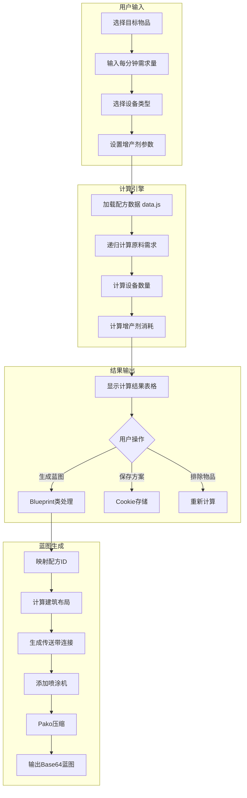
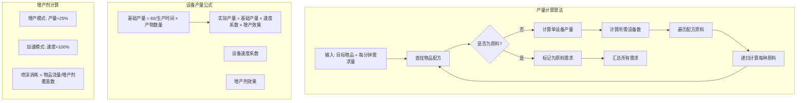
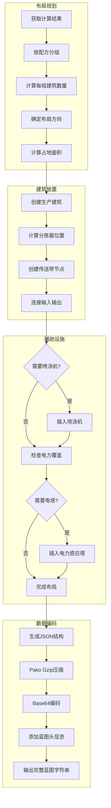
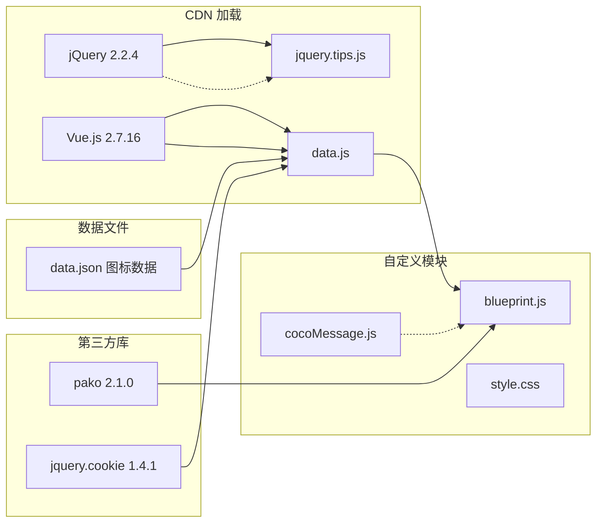
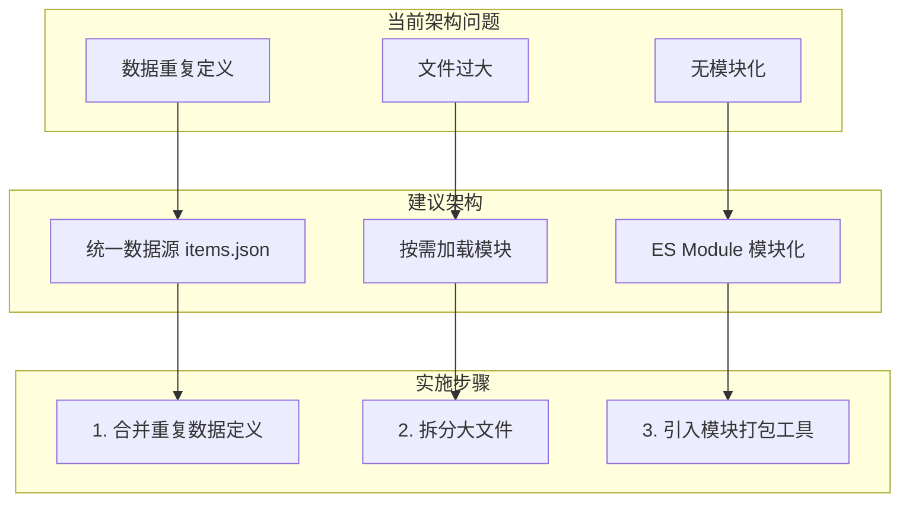

# Scripts 模块说明文档

## 目录

- [1. 模块概述](#1-模块概述)
- [2. 文件结构](#2-文件结构)
- [3. 核心功能模块](#3-核心功能模块)
  - [3.1 数据层 (data.js)](#31-数据层-datajs)
  - [3.2 蓝图生成 (blueprint.js)](#32-蓝图生成-blueprintjs)
  - [3.3 消息提示 (cocoMessage.js)](#33-消息提示-cocomessagejs)
  - [3.4 工具提示 (jquery.tips.js)](#34-工具提示-jquerytipsjs)
  - [3.5 压缩处理 (pako.js)](#35-压缩处理-pakojs)
  - [3.6 样式定义 (style.css)](#36-样式定义-stylecss)
- [4. 数据流程图](#4-数据流程图)
- [5. 核心算法流程](#5-核心算法流程)
- [6. 蓝图生成流程](#6-蓝图生成流程)
- [7. 依赖关系](#7-依赖关系)
- [8. 性能优化与问题修复建议](#8-性能优化与问题修复建议)

---

## 1. 模块概述

Scripts 模块是戴森球计划量产量化计算器的核心脚本模块，负责：
- **配方数据管理**：存储和管理所有游戏物品的配方数据
- **产量计算**：根据用户需求自动计算所需原料和设备数量
- **蓝图生成**：将计算结果转换为游戏可导入的蓝图格式
- **UI 交互**：提供消息提示、工具提示等交互功能

---

## 2. 文件结构

```
Scripts/
├── blueprint.js          # 蓝图生成核心逻辑
├── cocoMessage.js        # 全局消息提示组件
├── data.js               # 配方数据定义 + 计算逻辑
├── data.json             # 物品图标 Base64 数据
├── jquery.cookie.min.1.4.1.js  # Cookie 操作库
├── jquery.tips.js        # 工具提示插件
├── pako.js               # Gzip 压缩/解压库
├── style.css             # 样式表
└── localDocs/            # 文档目录
    └── 模块说明.md        # 本文档
```

**注意**：jQuery 和 Vue.js 已迁移至 CDN 加载：
- jQuery 2.2.4: `https://code.jquery.com/jquery-2.2.4.min.js`
- Vue.js 2.7.16: `https://cdn.jsdelivr.net/npm/vue@2.7.16/dist/vue.min.js`

---

## 3. 核心功能模块

### 3.1 数据层 (data.js)

**主要职责**：定义游戏中所有物品的配方数据结构

**数据结构**：
```javascript
{
    s: [{name: "产物名", n: 数量}],  // 产物（支持多产物）
    q: [{name: "原料名", n: 数量}],  // 所需原料
    t: 生产时间(秒),                  // 单次生产时间
    m: "生产设备",                    // 使用的设备类型
    group: "分组名",                  // 物品分组
    noExtra: true/false/null         // 增产剂效果控制
}
```

**支持的设备类型**：
| 设备类型 | 说明 |
|---------|------|
| 冶炼设备 | 电弧熔炉、位面熔炉、负熵熔炉 |
| 制作台 | Mk.Ⅰ/Ⅱ/Ⅲ、重组式制造台 |
| 化工设备 | 化工厂、量子化工厂 |
| 原油精炼机 | 原油精炼厂 |
| 研究站 | 矩阵研究站、自演化研究站 |
| 采矿机 | 采矿机、大型采矿机 |
| 轨道采集器 | 气态/巨冰星轨道采集 |

**物品分组**：
- 产品（矩阵类）
- 组件（中间产物）
- 消耗品（燃料棒、弹药等）
- 建筑（生产设施）

### 3.2 蓝图生成 (blueprint.js)

**主要职责**：将计算结果转换为游戏蓝图格式

**核心数据映射**：

```javascript
// 物品映射表
const itemMap = {
    ironOre: { name: "ironOre", iconId: 1001, remark: "铁矿" },
    // ... 所有物品定义
}

// 建筑映射表  
const buildingMap = {
    arcSmelter: {
        remark: "电弧熔炉",
        itemId: 2302,
        modelIndex: 62,
        productionSpeed: 1,
        size: { x: 3, y: 3 }
    },
    // ... 所有建筑定义
}

// 配方ID映射
const recipeMap = {
    "ironOre=ironIngot": 1,  // 铁块配方ID
    // ... 所有配方映射
}
```

**Blueprint 类核心方法**：

| 方法名 | 功能 |
|--------|------|
| `mapRecipeID()` | 配方字符串转配方ID |
| `getBuildingTemplate()` | 获取建筑模板对象 |
| `newSprayCoater()` | 创建喷涂机建筑 |
| `newConveyorNode()` | 创建传送带节点 |
| `newConveyor()` | 生成完整传送带 |
| `calculateBuildingArea()` | 计算建筑占地面积 |

### 3.3 消息提示 (cocoMessage.js)

**功能**：全局消息提示组件，支持 info、success、warning、error、loading 五种类型

**API**：
```javascript
cocoMessage.info("消息内容", 显示时间ms)
cocoMessage.success("成功消息")
cocoMessage.warning("警告消息")
cocoMessage.error("错误消息")
cocoMessage.loading("加载中...")
cocoMessage.destroyAll()  // 关闭所有消息
```

### 3.4 工具提示 (jquery.tips.js)

**功能**：jQuery 元素悬浮提示插件

**使用方式**：
```javascript
$(selector).tips({
    msg: '提示消息',    // 必填
    side: 1,           // 1上 2右 3下 4左
    color: '#FFF',     // 文字颜色
    bg: '#F00',        // 背景色
    time: 2,           // 自动关闭时间(秒)
    x: 0, y: 0         // 偏移量
})
```

### 3.5 压缩处理 (pako.js)

**功能**：蓝图数据的 Gzip 压缩/解压

**用途**：
- 将蓝图 JSON 数据压缩为游戏可识别的 Base64 格式
- 解压导入的蓝图数据

### 3.6 样式定义 (style.css)

**功能**：定义计算器界面的所有样式

**主要样式类**：
| 类名 | 用途 |
|------|------|
| `.selector` | 物品选择器容器 |
| `.icons` | 图标网格布局 |
| `.pf` / `.m` | 配方/设备选项 |
| `.list` | 列表容器 |
| `.custom-dropdown` | 自定义下拉框 |
| `.item_number` | 可编辑数量框 |
| `.number_editor` | 数量编辑器 |

---

## 4. 数据流程图



---

## 5. 核心算法流程



---

## 6. 蓝图生成流程



---

## 7. 依赖关系



---

## 8. 性能优化与问题修复建议

### 低风险高收益优化项

| 优先级 | 类型 | 问题描述 | 优化建议 | 改动范围 |
|--------|------|----------|----------|----------|
| 🔴 高 | 性能 | `data.js` 文件过大(138KB)，每次加载都需解析全部数据 | 将配方数据拆分为按分组的独立JSON文件，按需加载 | data.js |
| 🔴 高 | 架构 | `blueprint.js` 物品/建筑映射与data.js存在重复定义 | 统一数据源，blueprint.js引用data.js的定义 | blueprint.js |
| 🟡 中 | 性能 | `data.json` 图标数据(1.6MB)一次性加载 | 改用懒加载或CDN图标资源，仅加载可见物品图标 | data.json + index.html |
| ✅ 已修复 | 代码 | itemMap 中存在重复键名 `water` | 已将沙土改为 `sand`，水保留 `water` | blueprint.js:3 |
| ✅ 已优化 | 健壮性 | 配方查找无缓存，重复计算相同物品 | 已添加 recipeIndexByProduct/recipeIndexByMaterial 索引，O(n)→O(1) | data.js |
| 🟢 低 | 架构 | jQuery 版本升级至 2.2.4，Vue.js 升级至 2.7.16 | 已使用 CDN 加载 2.x 最终版 | ✅ 已完成 |
| 🟢 低 | 性能 | Vue 实例每次计算都重新渲染全部 | 使用 v-memo 或 computed 属性优化 | index.html |

### 待修复问题清单

| 问题类型 | 描述 | 影响 | 修复方案 | 状态 |
|----------|------|------|----------|------|
| 🐛 Bug | `itemMap.water` 重复定义导致"沙土"被覆盖 | 蓝图中沙土物品可能错误 | 修改第一个 water 为 sand | ✅ 已修复 |
| ℹ️ 设计限制 | recipeMap 部分配方ID为-1 | 蓄电池满、重氢分馏配方无法生成蓝图 | 这是预期行为，蓝图仅支持六类生产设施，会有警告提示 | 非Bug |
| ⚠️ 警告 | X射线裂解/重整精炼需要启动物料 | 蓝图可能无法自启动 | 已有警告提示，用户需手动准备启动物料 | 已有提示 |
| 📝 建议 | buildingMap 中文/英文命名混用 | 代码可维护性差 | 统一使用英文 key，中文放在 remark | 待处理 |
| 📝 建议 | 缺少 TypeScript 类型定义 | IDE 支持不完善 | 添加 .d.ts 类型声明文件 | 待处理 |

### 架构优化建议



### 快速修复优先列表

1. ~~**【立即修复】** 修复 `itemMap.water` 重复定义~~ ✅ 已完成 - 改为 `sand`
2. ~~**【立即修复】** 补充 recipeMap 中 ID 为 -1 的配方~~ ℹ️ 确认为设计限制（分馏塔/能量枢纽不支持蓝图）
3. ~~**【短期优化】** 添加配方查找缓存~~ ✅ 已完成 - 添加 recipeIndexByProduct/recipeIndexByMaterial 索引
4. ~~**【短期优化】** jQuery/Vue.js 升级~~ ✅ 已完成 - jQuery 2.2.4 + Vue.js 2.7.16 (CDN)
5. **【短期优化】** 图标懒加载
6. **【中期重构】** 数据源统一
7. **【长期规划】** 模块化改造
