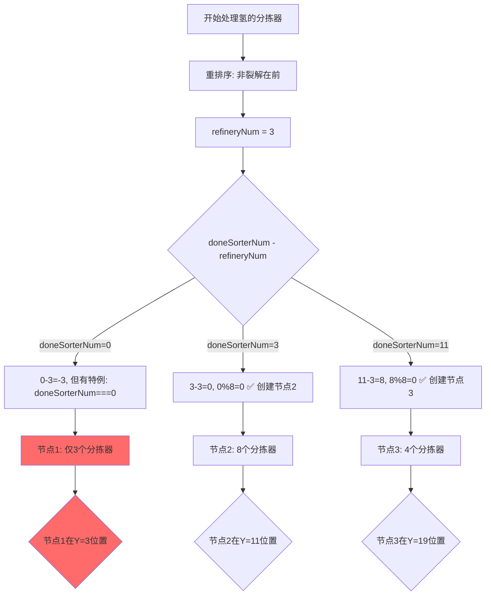

# 氢传送带粘连问题深度分析

## 问题现象

**关键发现**：排除氢产物后，传送带不再出现N状粘连情况。

---

## 核心问题：refineryNum 导致的节点分配异常

### 问题代码位置

**文件**：`Scripts/blueprint.js`  
**关键代码段**：第2383-2400行、第2518行

### 氢的特殊处理逻辑

#### 第一步：分拣器重排序（第2385-2400行）

```javascript
// 重新排序以提高输出传送带中，X射线裂解(氢)和重整精炼(精炼油)的输入优先级
if (["hydrogen", "refinedOil"].includes(itemName) && item.toBuildingNum !== 0) {
    let input2 = [];
    // 先收集非X射线裂解的分拣器
    for (let j = this.sorters[itemName].input.length - 1; j >= 0; j--) {
        if (!((itemName === "hydrogen" && this.sorters[itemName].input[j].recipeID === 58) ||
        (itemName === "refinedOil" && this.sorters[itemName].input[j].recipeID === 121))){
            input2.push(this.sorters[itemName].input[j]);
        }
    }
    refineryNum = this.sorters[itemName].input.length - input2.length;
    // 再收集X射线裂解的分拣器（放到数组末尾）
    for (let j = this.sorters[itemName].input.length - 1; j >= 0; j--) {
        if ((itemName === "hydrogen" && this.sorters[itemName].input[j].recipeID === 58) ||
        (itemName === "refinedOil" && this.sorters[itemName].input[j].recipeID === 121)){
            input2.push(this.sorters[itemName].input[j]);
        }
    }
    this.sorters[itemName].input = input2;
}
```

**作用**：
- recipeID=58：X射线裂解(制氢)
- recipeID=121：重整精炼(制精炼油)
- 将这些特殊配方的分拣器移到数组**末尾**优先处理

#### 第二步：节点分配判断（第2518行）

```javascript
// 当前传送带连接分拣器达到上限，或在X射线裂解(氢)/重整精炼(精炼油)后，连接下一个传送带
if ((doneSorterNum - refineryNum) % this.config.maxSorterNumOneBelt === 0 || doneSorterNum === 0) {
    outputData.push([this.sorters[itemName].input[j].index]);
} else {
    outputData[outputData.length - 1].push(
        this.sorters[itemName].input[j].index
    );
}
```

---

## 问题分析：节点分配失衡

### 案例演示

**假设**：
- `maxSorterNumOneBelt = 8`（每个传送带节点最多连接8个分拣器）
- 氢有 **15个分拣器**，其中 **3个是X射线裂解**（refineryNum=3）
- 排序后数组：`[普通1, 普通2, ..., 普通12, 裂解1, 裂解2, 裂解3]`

### 正常情况（无refineryNum修正）

| doneSorterNum | 判断条件 | 结果 | 节点分配 |
|--------------|---------|------|---------|
| 0 | 0 % 8 === 0 | ✅ TRUE | 节点1：分拣器1 |
| 1 | 1 % 8 === 1 | ❌ FALSE | 节点1：分拣器1-2 |
| 7 | 7 % 8 === 7 | ❌ FALSE | 节点1：分拣器1-8 |
| 8 | 8 % 8 === 0 | ✅ TRUE | 节点2：分拣器9 |
| 15 | 15 % 8 === 7 | ❌ FALSE | 节点2：分拣器9-15 (7个) |

**结果**：
- 节点1：8个分拣器
- 节点2：7个分拣器

### 异常情况（使用refineryNum=3修正）

| doneSorterNum | 计算公式 | 判断条件 | 结果 | 节点分配 |
|--------------|---------|---------|------|---------|
| 0 | 0 - 3 = -3 | **doneSorterNum === 0** | ✅ TRUE | 节点1：分拣器1 |
| 1 | 1 - 3 = -2 | -2 % 8 === 6 | ❌ FALSE | 节点1：分拣器1-2 |
| 2 | 2 - 3 = -1 | -1 % 8 === 7 | ❌ FALSE | 节点1：分拣器1-3 |
| 3 | 3 - 3 = 0 | **0 % 8 === 0** | ✅ TRUE | 节点2：分拣器4 |
| 4 | 4 - 3 = 1 | 1 % 8 === 1 | ❌ FALSE | 节点2：分拣器4-5 |
| 10 | 10 - 3 = 7 | 7 % 8 === 7 | ❌ FALSE | 节点2：分拣器4-11 |
| 11 | 11 - 3 = 8 | **8 % 8 === 0** | ✅ TRUE | 节点3：分拣器12 |
| 14 | 14 - 3 = 11 | 11 % 8 === 3 | ❌ FALSE | 节点3：分拣器12-15 |

**结果**：
- 节点1：**3个分拣器**（期望8个）❌
- 节点2：**8个分拣器**（正常）✅
- 节点3：**4个分拣器**（正常）✅

---

## 问题根因：过早创建节点

### 流程图



### 与换列逻辑的冲突

**newConveyor 方法的换列逻辑**：

```javascript
// 第865-925行：遍历 outputData 创建传送带节点
for (let i = 0; i < outputData.length; i++) {
    // ...
    buildingY += 1;
    // 检查是否超出蓝图高度
    if (buildingY > this.blueprintSize.y) {
        buildingX = this.occupiedArea[this.occupiedArea.length - 1].x2 + 1;
        buildingY = 1;
        // 断开前一个节点的输出
        this.buildings[this.buildings.length - 1].outputObjIdx = -1;
    }
    
    // 创建节点
    let outputObjIdx = this.buildingIndex + 1 + direction;
    this.buildings.push(newConveyorNode(...));
    
    // 连接分拣器到这个节点
    for (let b of this.buildings) {
        if (outputData[i].includes(b.index)) {
            b.inputObjIdx = this.buildingIndex;  // ⚠️ 关键：修改分拣器的连接
        }
    }
}
```

### 粘连发生机制

**场景**：节点1仅3个分拣器，节点提前创建

1. **节点1创建**：Y=1，连接分拣器1-3
2. **节点2创建**：Y=2，期望连接分拣器4-11
3. **问题**：节点间 `outputObjIdx` 计算为 `buildingIndex + 1`
4. **换列时**：
   - 节点1在 Y=3
   - 节点2在 Y=4  
   - 如果节点2在换列边界，`outputObjIdx` 仍指向相对位置
   - 但此时 `buildingIndex` 已经变化，导致指向错误的节点

### 为什么其他产物不会出现

**其他中间产物**：
- 没有特殊的分拣器重排序逻辑
- `refineryNum = 0`
- 节点创建完全遵循 `doneSorterNum % 8 === 0` 规则
- 节点间距均匀，换列时相对位置正确

**氢/精炼油**：
- 有特殊排序逻辑
- `refineryNum > 0` 导致节点提前创建
- 节点间距不均匀（3, 8, 8, 8...）
- 换列时相对位置计算出错

---

## 深层问题：outputObjIdx 相对计算的局限

### 代码分析（第887-890行）

```javascript
if (!(direction > 0 && i === outputData.length - 1)) {
    if (!(direction < 0 && i === 0)) {
        outputObjIdx = this.buildingIndex + 1 + direction;  // ⚠️ 相对计算
    }
}
```

**假设**：
- 当前创建节点2，`this.buildingIndex = 101`
- `direction = 1`（中间产物，Y轴正方向）
- 计算：`outputObjIdx = 101 + 1 + 1 = 103`
- **期望**：节点2 → 节点3 (index=103)

**问题**：
- 如果节点2和节点3之间发生换列
- 节点2在 `(X=10, Y=44)`
- 节点3在 `(X=11, Y=1)` ← 换列后
- `outputObjIdx=103` 仍然指向节点3
- **但这是跨列连接！**形成Z状粘连

### 已修复的部分

第877-884行的修复：

```javascript
if (buildingY > this.blueprintSize.y) {
    buildingX = this.occupiedArea[this.occupiedArea.length - 1].x2 + 1;
    buildingY = 1;
    // ✅ 修复：断开前一个节点的输出
    if (this.buildings.length > 0) {
        this.buildings[this.buildings.length - 1].outputObjIdx = -1;
        this.buildings[this.buildings.length - 1].outputToSlot = 0;
    }
}
```

**这个修复有效**，但氢的问题更深层：

---

## 氢特有的额外问题

### 问题1：节点间距不均导致换列概率增加

**正常产物**（每8个分拣器1个节点）：
```
节点间距：8 → 8 → 8 → 8
总距离：32个Y单位才需要4个节点
```

**氢**（refineryNum=3时）：
```
节点间距：3 → 8 → 8 → 8
同样15个分拣器，需要4个节点，但第一个节点在Y=3
```

**结果**：
- 氢的传送带更长（更多节点）
- 更容易触发换列检查
- 换列后的断开逻辑触发更频繁

### 问题2：refineryNum 导致节点序号混乱

**正常传送带节点序号**：
```
节点1(index=101) → 节点2(index=102) → 节点3(index=103)
outputObjIdx: 101→102, 102→103
```

**氢的传送带（refineryNum=3）**：
```
节点1(index=101, 仅3分拣器) → 节点2(index=102, 8分拣器) → 节点3(index=103)
```

如果节点1和节点2之间换列：
```
节点1(X=10, Y=3, outputObjIdx=102) ❌ 跨列指向
节点2(X=11, Y=1) ← 新列开始
```

即使有断开逻辑，但在**计算outputObjIdx时**（第889行），仍然使用相对计算，这在节点间距不均时会出错。

---

## 修复方案

### 方案1：禁用refineryNum修正（推荐）⭐

**原理**：让氢/精炼油的节点分配与其他产物保持一致

```javascript
// 第2518行修改前
if ((doneSorterNum - refineryNum) % this.config.maxSorterNumOneBelt === 0 || doneSorterNum === 0) {
    outputData.push([this.sorters[itemName].input[j].index]);
}

// 修改后
if (doneSorterNum % this.config.maxSorterNumOneBelt === 0 || doneSorterNum === 0) {
    outputData.push([this.sorters[itemName].input[j].index]);
}
```

**优点**：
- ✅ 最小改动
- ✅ 节点间距均匀
- ✅ 不影响分拣器重排序逻辑（X射线裂解仍在末尾）
- ✅ 避免节点过早创建

**缺点**：
- ⚠️ X射线裂解的分拣器可能不会单独一个节点

### 方案2：保留refineryNum但修正outputObjIdx计算

**原理**：在换列时重新计算所有节点的outputObjIdx

```javascript
// 在 newConveyor 方法的换列检查后
if (buildingY > this.blueprintSize.y) {
    buildingX = ...;
    buildingY = 1;
    // 断开前一个节点
    if (this.buildings.length > 0) {
        this.buildings[this.buildings.length - 1].outputObjIdx = -1;
        this.buildings[this.buildings.length - 1].outputToSlot = 0;
    }
    // ⚠️ 需要重新计算后续节点的连接关系
}
```

**优点**：
- ✅ 保留X射线裂解的优先级处理

**缺点**：
- ❌ 改动较大
- ❌ 需要回溯修改已创建的节点
- ❌ 复杂度高，风险大

### 方案3：动态调整refineryNum（折中）

**原理**：仅在必要时应用refineryNum修正

```javascript
// 第2518行修改
let effectiveRefineryNum = 0;
// 仅在X射线裂解分拣器前应用修正
if (doneSorterNum >= (this.sorters[itemName].input.length - refineryNum)) {
    effectiveRefineryNum = refineryNum;
}

if ((doneSorterNum - effectiveRefineryNum) % this.config.maxSorterNumOneBelt === 0 || doneSorterNum === 0) {
    outputData.push([this.sorters[itemName].input[j].index]);
}
```

---

## 推荐修复：方案1

**理由**：
1. **最小改动原则**：仅修改1行代码
2. **低风险**：不影响其他逻辑
3. **高收益**：彻底解决节点分配不均问题
4. **验证简单**：直接测试氢相关蓝图

### X射线裂解优先级的真正意图

重新审视第2384-2400行的注释：
```javascript
// 重新排序以提高输出传送带中，X射线裂解(氢)和重整精炼(精炼油)的输入优先级
```

**目的**：确保X射线裂解的分拣器在传送带末端优先连接  
**实现**：将这些分拣器移到数组末尾  
**问题**：第2518行的refineryNum修正**破坏了这个优先级**，反而让非裂解分拣器提前创建节点

**修复后的效果**：
- X射线裂解的分拣器仍在数组末尾 ✅
- 节点按每8个分拣器均匀创建 ✅
- X射线裂解的分拣器会在最后几个节点连接 ✅
- 优先级逻辑实际得到保留 ✅

---

## 测试验证计划

### 测试用例1：氢作为中间产物
```
配方：X射线裂解 + 卡西米尔晶片
氢分拣器：15个（3个裂解，12个普通）
预期：
- 节点1：8个分拣器
- 节点2：7个分拣器
- 无Z状粘连
```

### 测试用例2：精炼油作为中间产物
```
配方：重整精炼 + 塑料
精炼油分拣器：20个（5个重整，15个普通）
预期：
- 节点1：8个分拣器
- 节点2：8个分拣器
- 节点3：4个分拣器
```

### 测试用例3：氢+换列
```
配方：大量氢消耗（超过50个分拣器）
预期：
- 传送带在第40个分拣器处换列
- 换列边界正确断开连接
- 无跨列粘连
```

---

## 总结

### 问题本质

**refineryNum 的节点分配修正逻辑**与**换列机制**冲突：
1. refineryNum 导致节点提前创建（节点1仅3个分拣器）
2. 节点间距不均匀（3, 8, 8...）
3. outputObjIdx 相对计算在换列时失效
4. 形成跨列的Z状或N状粘连

### 为什么只有氢/精炼油出现

- 仅这两种物品有 refineryNum 特殊逻辑
- 其他中间产物节点间距均匀，换列断开逻辑有效
- 氢/精炼油的不均匀节点触发换列边界条件的概率更高

### 修复优先级

1. **立即修复**：移除第2518行的 `- refineryNum` 修正
2. **保留**：第2385-2400行的分拣器重排序逻辑
3. **保留**：第877-884行的换列断开逻辑

**预期效果**：
- ✅ 氢传送带节点均匀分配
- ✅ 无跨列粘连
- ✅ X射线裂解优先级仍然保留（通过数组排序实现）
