# 蓝图不堆叠模块详细说明

## 目录

- [1. 功能概述](#1-功能概述)
- [2. 核心设计原则](#2-核心设计原则)
- [3. 完整流程](#3-完整流程)
- [4. Phase 1: init() 初始化](#4-phase-1-init-初始化)
- [5. Phase 2: generateBuildings() 建筑生成](#5-phase-2-generatebuildings-建筑生成)
- [6. Phase 3: generateConveyorBelts() 传送带网络生成](#6-phase-3-generateconveyorbelts-传送带网络生成)
- [7. Phase 4: cloneToStackLayers() 克隆检查](#7-phase-4-clonetostacklayers-克隆检查)
- [8. 速率计算详解](#8-速率计算详解)
- [9. 传送带ICON和数据分析](#9-传送带icon和数据分析)
- [10. 与堆叠模式的对比](#10-与堆叠模式的对比)
- [11. 边界条件处理](#11-边界条件处理)
- [附录A：代码位置速查](#附录a代码位置速查)
- [附录B：关键常量速查](#附录b关键常量速查)

---

## 1. 功能概述

不堆叠模式是蓝图生成器的默认模式，所有设备在同一水平面（z=0）布局，传送带网络按实际产能设计。

### 1.1 配置入口

| 配置项                | 说明                       | 默认值      |
| --------------------- | -------------------------- | ----------- |
| `stackLayers`         | 堆叠层数                   | 1（不堆叠） |
| `maxSorterNumOneBelt` | 每个传送带节点最大分拣器数 | 8           |

### 1.2 核心思想

```
设备数量不缩减，传送带按原始产能设计，所有设备在 z=0 层平铺
```

### 1.3 设计目标

| 目标       | 说明           | 状态 |
| ---------- | -------------- | ---- |
| 设备数量   | 保持原始数量   | ✅   |
| 布局方式   | 单层 z=0 平铺  | ✅   |
| 传送带容量 | 按原始产能设计 | ✅   |
| 向后兼容   | 默认行为       | ✅   |

---

## 2. 核心设计原则

```
不堆叠模式的核心流程：

1. init() 不缩减 num
   → 60个设备保持60个
   → 所有设备在z=0层布局

2. generateBuildings() 单层布局
   → 60个设备 + 60个分拣器在z=0
   → Lab垂直堆叠（maxLabLayers）

3. generateConveyorBelts() rate不放大
   → rate保持原始值
   → 传送带按原始产能设计

4. cloneToStackLayers() 不执行
   → stackLayers=1，直接返回
   → 不克隆任何建筑
```

---

## 3. 完整流程

### 3.1 流程总览图

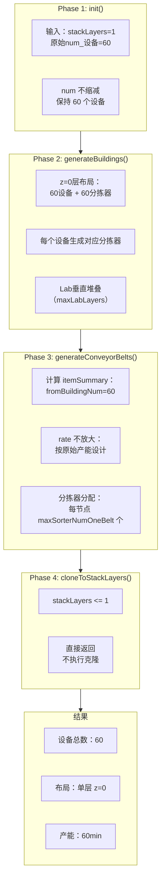

### 3.2 数据流详解

```
不堆叠模式完整流程（stackLayers=1）：

┌─────────────────────────────────────────────────────────────────────────────┐
│                              核心流程                                        │
│                                                                             │
│  1. init(): num 不缩减，保持原始数量                                        │
│  2. generateBuildings(): 所有设备在 z=0 层布局                              │
│  3. generateConveyorBelts(): rate 不放大，按原始产能设计                     │
│  4. cloneToStackLayers(): 直接返回，不执行克隆                              │
└─────────────────────────────────────────────────────────────────────────────┘
```

---

## 4. Phase 1: init() 初始化

### 4.1 代码位置

`blueprint.js` L2048-2082

### 4.2 核心逻辑

```javascript
init() {
    this.mapRecipeID();

    // 堆叠模式：根据堆叠层数缩减num
    // 不堆叠模式：stackLayers <= 1，条件不满足，不执行
    if (this.config.stackLayers > 1) {
      // 此代码块不执行
      for (let subRecipe of this.recipe.subRecipes) {
        if (subRecipe.building) {
          subRecipe.building.num = Math.ceil(
            subRecipe.building.num / this.config.stackLayers
          );
        }
      }
    }

    this.calculateBlueprintArea();
    if (this.config.onlyConveyorBeltMk3Downgrade) {
      buildingMap.conveyorBeltMK3.transportSpeed = 28;
    } else {
      buildingMap.conveyorBeltMK3.transportSpeed = 30;
    }
}
```

### 4.3 处理流程

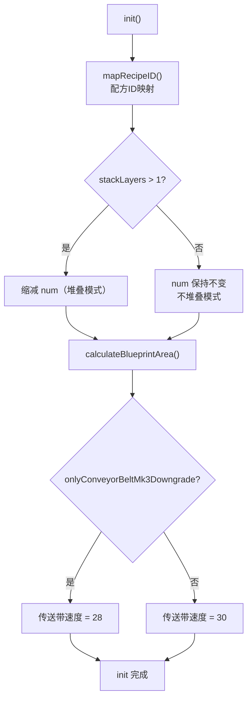

### 4.4 mapRecipeID() 详细逻辑

**代码位置**: `blueprint.js` L600-640`

```javascript
mapRecipeID() {
    for (let subRecipe of this.recipe.subRecipes) {
        if (!subRecipe.input) {
            // 原料（无输入），跳过
            continue;
        }

        // Step 1: 拼接配方字符串
        let recipeStr = "";
        let isFirst = true;

        // 拼接输入
        for (let item of subRecipe.input) {
            if (isFirst) {
                recipeStr = item.name;
                isFirst = false;
            } else {
                recipeStr += "+" + item.name;
            }
        }

        // 拼接输出
        isFirst = true;
        for (let item of subRecipe.output) {
            if (isFirst) {
                recipeStr += "=" + item.name;
                isFirst = false;
            } else {
                recipeStr += "+" + item.name;
            }
        }

        // Step 2: 查找配方ID
        if (!recipeMap[recipeStr] || recipeMap[recipeStr] === -1) {
            cocoMessage.warning(
                `包含不支持的配方: ${recipeStr.replace("=", "->")}`,
                5000
            );
            throw `unknown recipe - ${recipeStr}`;
        }

        // Step 3: 特殊配方警告
        if ([58, 121].includes(recipeMap[recipeStr])) {
            // 58: X射线裂解(制氢)
            // 121: 重整精炼(制精炼油)
            cocoMessage.warning(
                `X射线裂解(制氢)与重整精炼(制精炼油)可能需手动提供初始启动的精炼油/氢`,
                5000
            );
        }

        subRecipe.recipeID = recipeMap[recipeStr];
    }
}
```

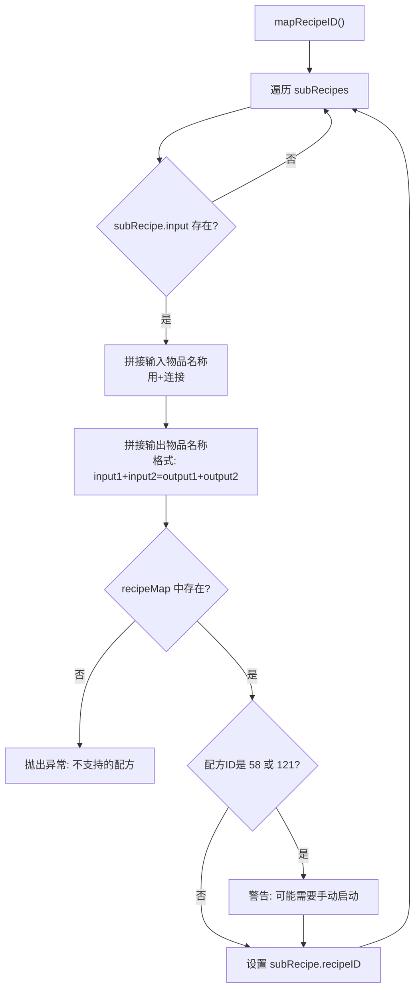

### 4.5 calculateBlueprintArea() 面积计算

**代码位置**: `blueprint.js` L930-950`

```javascript
calculateBlueprintArea() {
    let totalArea = 0;

    // Step 1: 累加所有建筑占地
    for (let subRecipe of this.recipe.subRecipes) {
        if (!subRecipe.building) {
            continue;
        }
        totalArea +=
            this.calculateBuildingArea(subRecipe).area *
            Math.ceil(subRecipe.building.num);
    }

    // Step 2: 根据长宽比计算尺寸
    let y = Math.ceil(Math.sqrt(totalArea / this.config.x_y_ratio));
    this.blueprintSize = {
        x: Math.ceil(this.config.x_y_ratio * y),
        y: y,
    };

    // Step 3: 初始化占用区域
    this.occupiedArea = [{
        x1: -1,
        y1: -1,
        x2: this.blueprintSize.x,
        y2: -1
    }];
}
```

### 4.6 calculateBuildingArea() 建筑面积计算

**代码位置**: `blueprint.js` L910-929`

```javascript
calculateBuildingArea(subRecipe) {
    if (!subRecipe.building) {
        return { area: 0, x: 0, y: 0, centerPoint: [0, 0, 0, 0] };
    }

    switch (buildingMap[subRecipe.building.name].category) {
        case productionCategory.smelter:
            // 熔炉：根据输入输出数量决定布局
            if (subRecipe.output.length + subRecipe.input.length <= 2) {
                return { area: 12, x: 3, y: 4, centerPoint: [2, 1, 1, 1], yaw: [0, 0] };
            } else {
                return { area: 16, x: 4, y: 4, centerPoint: [2, 2, 1, 1], yaw: [0, 0] };
            }
        case productionCategory.assembling:
            return { area: 16, x: 4, y: 4, centerPoint: [2, 2, 1, 1], yaw: [0, 0] };
        case productionCategory.plant:
            return { area: 48, x: 8, y: 6, centerPoint: [2, 4, 3, 3], yaw: [0, 0] };
        case productionCategory.refinery:
            if (this.config.compactLayout) {
                return { area: 30, x: 7, y: 5, centerPoint: [2, 3, 2, 3], yaw: [90, 90] };
            }
            return { area: 40, x: 8, y: 5, centerPoint: [2, 3, 2, 4], yaw: [90, 90] };
        case productionCategory.collider:
            if (this.config.compactLayout) {
                return { area: 66, x: 11, y: 6, centerPoint: [3, 5, 2, 5], yaw: [0, 0] };
            }
            return { area: 77, x: 11, y: 7, centerPoint: [3, 5, 3, 5], yaw: [0, 0] };
        case productionCategory.lab:
            return { area: 42, x: 7, y: 6, centerPoint: [3, 3, 2, 3], yaw: [0, 0] };
    }
}
```

**centerPoint说明**：

```
centerPoint: [y负边界距离, x正边界距离, y正边界距离, x负边界距离]

例如：centerPoint: [2, 2, 1, 1]
      表示建筑中心点到：
      - y轴负边界（上方）: 2格
      - x轴正边界（右侧）: 2格
      - y轴正边界（下方）: 1格
      - x轴负边界（左侧）: 1格
      总占地: (2+1) × (2+1) = 3×3
```

### 4.7 处理结果

```
输入参数：
  - 设备原始 num = 60
  - stackLayers = 1（或不设置）

处理结果：
  ┌─────────────────────────────────────────┐
  │ num 不缩减，保持 60                      │
  │   → 所有 60 个设备在 z=0 层布局          │
  │   → 总产能 = 60min                       │
  └─────────────────────────────────────────┘
```

### 4.8 不堆叠模式与堆叠模式 init() 对比

```javascript
// 不堆叠模式 (stackLayers = 1)
init() {
    this.mapRecipeID();

    // 条件不满足，不执行
    if (this.config.stackLayers > 1) {
      // 此代码块跳过
      for (let subRecipe of this.recipe.subRecipes) {
        if (subRecipe.building) {
          subRecipe.building.num = Math.ceil(
            subRecipe.building.num / this.config.stackLayers
          );
        }
      }
    }

    this.calculateBlueprintArea();
    // 传送带速度配置...
}

// 堆叠模式 (stackLayers = 4)
init() {
    this.mapRecipeID();

    // 条件满足，执行缩减
    if (this.config.stackLayers > 1) {
      for (let subRecipe of this.recipe.subRecipes) {
        if (subRecipe.building) {
          // num = ceil(60/4) = 15
          subRecipe.building.num = Math.ceil(
            subRecipe.building.num / this.config.stackLayers
          );
        }
      }
    }

    this.calculateBlueprintArea();
    // 传送带速度配置...
}
```

### 4.9 配方ID映射详解

**recipeMap 结构**：

```javascript
// recipeMap 存储所有配方的ID映射
// 格式: "input1+input2=output1+output2" => recipeId

const recipeMap = {
  // 熔炉配方
  'ironOre=ironIngot': 1, // 铁矿 -> 铁板
  'copperOre=copperIngot': 2, // 铜矿 -> 铜板
  'stone=stoneBrick': 3, // 石头 -> 石材

  // 制造台配方
  'ironIngot+gear=electromagneticMatrix': 10, // 蓝矩阵
  'copperIngot+graphene=energyMatrix': 11, // 红矩阵

  // 精炼厂配方
  'crudeOil=hydrogen+refinedOil': 58, // X射线裂解
  'hydrogen=deuterium': 121 // 重整精炼

  // ... 更多配方
}
```

**配方字符串拼接示例**：

```
输入配方：
{
    input: [{name: "ironOre", rate: 1}],
    output: [{name: "ironIngot", rate: 1}]
}

拼接结果：
"ironOre=ironIngot"

查找 recipeMap["ironOre=ironIngot"] = 1
设置 subRecipe.recipeID = 1
```

### 4.10 特殊配方处理

```javascript
// 特殊配方ID及其含义
const specialRecipes = {
  58: {
    name: 'X射线裂解',
    output: 'hydrogen',
    warning: '可能需要手动提供初始氢'
  },
  121: {
    name: '重整精炼',
    output: 'refinedOil',
    warning: '可能需要手动提供初始精炼油'
  }
}

// 特殊配方警告逻辑
if ([58, 121].includes(recipeMap[recipeStr])) {
  cocoMessage.warning(`X射线裂解(制氢)与重整精炼(制精炼油)可能需手动提供初始启动的精炼油/氢`, 5000)
}
```

### 4.11 蓝图面积计算详解

```javascript
calculateBlueprintArea() {
    let totalArea = 0;

    // Step 1: 累加所有建筑占地
    for (let subRecipe of this.recipe.subRecipes) {
        if (!subRecipe.building) {
            continue;
        }

        // 计算单个建筑面积
        const buildingArea = this.calculateBuildingArea(subRecipe);

        // 累加：面积 × 数量
        totalArea += buildingArea.area * Math.ceil(subRecipe.building.num);
    }

    // Step 2: 根据长宽比计算尺寸
    // 公式：y = ceil(sqrt(totalArea / x_y_ratio))
    //       x = ceil(x_y_ratio * y)
    let y = Math.ceil(Math.sqrt(totalArea / this.config.x_y_ratio));
    this.blueprintSize = {
        x: Math.ceil(this.config.x_y_ratio * y),
        y: y,
    };

    // Step 3: 初始化占用区域
    // occupiedArea 用于跟踪已布局区域，防止建筑重叠
    this.occupiedArea = [{
        x1: -1,           // 左边界
        y1: -1,           // 上边界
        x2: this.blueprintSize.x,  // 右边界
        y2: -1            // 下边界
    }];
}
```

**面积计算示例**：

```
输入：
  - 60个制造台Mk.III，每个面积16
  - 4个研究站，每个面积42
  - x_y_ratio = 2

计算：
  totalArea = 60 × 16 + 4 × 42 = 960 + 168 = 1128
  y = ceil(sqrt(1128 / 2)) = ceil(sqrt(564)) = ceil(23.75) = 24
  x = ceil(2 × 24) = 48

蓝图尺寸：48 × 24
```

### 4.12 建筑面积计算详解

```javascript
calculateBuildingArea(subRecipe) {
    if (!subRecipe.building) {
        return { area: 0, x: 0, y: 0, centerPoint: [0, 0, 0, 0] };
    }

    const category = buildingMap[subRecipe.building.name].category;

    switch (category) {
        case productionCategory.smelter:
            // 熔炉：根据输入输出数量决定布局
            const ioCount = subRecipe.output.length + subRecipe.input.length;
            if (ioCount <= 2) {
                // 简单配方（1进1出）：紧凑布局
                return {
                    area: 12,
                    x: 3, y: 4,
                    centerPoint: [2, 1, 1, 1],  // 上2 右1 下1 左1
                    yaw: [0, 0]
                };
            } else {
                // 复杂配方（多进多出）：宽松布局
                return {
                    area: 16,
                    x: 4, y: 4,
                    centerPoint: [2, 2, 1, 1],  // 上2 右2 下1 左1
                    yaw: [0, 0]
                };
            }

        case productionCategory.assembling:
            // 制造台：固定4×4布局
            return {
                area: 16,
                x: 4, y: 4,
                centerPoint: [2, 2, 1, 1],
                yaw: [0, 0]
            };

        case productionCategory.plant:
            // 化工厂：固定8×6布局
            return {
                area: 48,
                x: 8, y: 6,
                centerPoint: [2, 4, 3, 3],
                yaw: [0, 0]
            };

        case productionCategory.refinery:
            // 精炼厂：根据紧凑布局配置
            if (this.config.compactLayout) {
                return {
                    area: 30,
                    x: 7, y: 5,
                    centerPoint: [2, 3, 2, 3],
                    yaw: [90, 90]
                };
            }
            return {
                area: 40,
                x: 8, y: 5,
                centerPoint: [2, 3, 2, 4],
                yaw: [90, 90]
            };

        case productionCategory.collider:
            // 对撞机：根据紧凑布局配置
            if (this.config.compactLayout) {
                return {
                    area: 66,
                    x: 11, y: 6,
                    centerPoint: [3, 5, 2, 5],
                    yaw: [0, 0]
                };
            }
            return {
                area: 77,
                x: 11, y: 7,
                centerPoint: [3, 5, 3, 5],
                yaw: [0, 0]
            };

        case productionCategory.lab:
            // 研究站：固定7×6布局
            return {
                area: 42,
                x: 7, y: 6,
                centerPoint: [3, 3, 2, 3],
                yaw: [0, 0]
            };
    }
}
```

**centerPoint 坐标系说明**：

```
centerPoint: [y负边界距离, x正边界距离, y正边界距离, x负边界距离]
             [上边界,       右边界,     下边界,     左边界]

示例：制造台 centerPoint: [2, 2, 1, 1]

         y轴
          ↑
    ┌─────┼─────┐
    │     │     │ ← 上边界距离 = 2
    ├─────┼─────┤
    │     ●     │ ← 建筑中心点
    └─────┼─────┘
          │
    ←左1  │  右2→
          │
          └──────────→ x轴

总占地：(2+1) × (2+1) = 3×3 = 9格
但实际建筑面积为16格（4×4），因为包含分拣器空间
```

---

## 5. Phase 2: generateBuildings() 建筑生成

### 5.1 代码位置

`blueprint.js` L2832-2839

### 5.2 核心逻辑

```javascript
generateBuildings() {
    for (let subRecipe of this.recipe.subRecipes) {
      if (subRecipe.building === null) {
        continue;
      }
      this.newProductionBuilding(subRecipe);
    }
}
```

### 5.3 布局流程

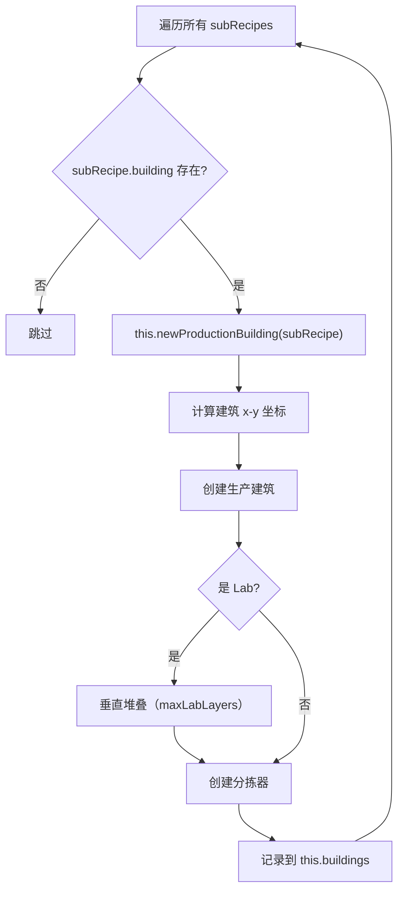

### 5.4 newProductionBuilding() 详细流程

**代码位置**: `blueprint.js` L1520-1998`

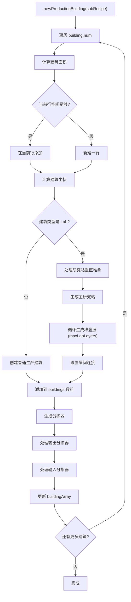

### 5.5 建筑坐标计算逻辑

```javascript
// 判断是否需要新建一行
if (
  this.blueprintSize.x - this.occupiedArea[this.occupiedArea.length - 1].x2 >=
  buildingArea.x / 2
) {
  // 在当前行继续添加
  buildingX = this.occupiedArea[this.occupiedArea.length - 1].x2 + 1 + buildingArea.centerPoint[3]
  buildingY = this.occupiedArea[this.occupiedArea.length - 2].y2 + 1 + buildingArea.centerPoint[0]
  buildingZ = 0

  // 更新占用区域
  this.occupiedArea[this.occupiedArea.length - 1].x2 += buildingArea.x

  // 如果新建筑更宽，更新y2
  if (
    buildingY + buildingArea.centerPoint[2] >
    this.occupiedArea[this.occupiedArea.length - 1].y2
  ) {
    this.occupiedArea[this.occupiedArea.length - 1].y2 = buildingY + buildingArea.centerPoint[2]
  }
} else {
  // 新建一行
  buildingX = buildingArea.centerPoint[3]
  buildingY = buildingArea.centerPoint[0] + this.occupiedArea[this.occupiedArea.length - 1].y2 + 1
  buildingZ = 0

  // 添加新的占用区域记录
  this.occupiedArea.push({
    x1: 0,
    y1: buildingY - buildingArea.centerPoint[0],
    x2: buildingX + buildingArea.centerPoint[1],
    y2: buildingY + buildingArea.centerPoint[2]
  })
}
```

### 5.6 研究站垂直堆叠处理

```javascript
if (buildingMap[subRecipe.building.name].category === productionCategory.lab) {
  // 设置研究站特殊参数
  newBuilding.outputToSlot = 14
  newBuilding.inputFromSlot = 15
  newBuilding.outputFromSlot = 15
  newBuilding.inputToSlot = 14
  newBuilding.parameters.researchMode = 1

  this.buildings.push(newBuilding)

  // 堆叠处理研究站
  for (i++; i < subRecipe.building.num && layers < this.config.maxLabLayers; i++, layers++) {
    let labBuilding = this.getBuildingTemplate()

    // 设置z坐标（每层3格高度）
    labBuilding.localOffset[0].z = buildingMap.lab.height * layers
    labBuilding.localOffset[1].z = buildingMap.lab.height * layers

    // 连接到下一层
    labBuilding.inputObjIdx = this.buildingIndex - 1
    labBuilding.outputToSlot = 14
    labBuilding.inputFromSlot = 15
    labBuilding.outputFromSlot = 15
    labBuilding.inputToSlot = 14

    this.buildings.push(labBuilding)
    stackLabBuildingIndexList.push(this.buildingIndex)
  }
  i-- // 回退循环变量
}
```

### 5.7 分拣器生成逻辑

**代码位置**: `blueprint.js` L1650-1998`

```javascript
// 计算实际速率
let extra_rate = 1;
if (this.recipe.proliferator) {
    if (subRecipe.acceleratorMode === 0) {
        // 增产模式
        extra_rate += itemMap[this.recipe.proliferator].extra_rate;
    } else if (subRecipe.acceleratorMode === 1) {
        // 加速模式
        extra_rate += itemMap[this.recipe.proliferator].accelerate;
    }
}

// 处理输出分拣器
for (let outputItem of subRecipe.output) {
    let actual_rate = outputItem.rate * productionSpeed * actual_building_num * extra_rate;

    // 选择分拣器等级
    let sorter = buildingMap.sorterMk1;
    if (this.config.useSorterMk4 || this.config.onlySorterMk3 || actual_rate > sorter.sortingSpeed) {
        sorter = this.config.useSorterMk4 ? buildingMap.sorterMk4 : buildingMap.sorterMk3;
    }

    // 研究站层数过高时追加额外分拣器
    if (buildingMap[subRecipe.building.name].category === productionCategory.lab &&
        actual_rate > sorter.sortingSpeed) {
        // 创建额外分拣器处理溢出
        let newSorter2 = this.getBuildingTemplate();
        // ... 设置分拣器参数
        actual_rate -= sorter.sortingSpeed;
    }

    // 创建主分拣器
    let newSorter = this.getBuildingTemplate();
    newSorter.itemId = sorter.itemId;
    newSorter.modelIndex = sorter.modelIndex;
    newSorter.inputObjIdx = nowBuildingIndex;
    newSorter.outputToSlot = -1;
    newSorter.inputToSlot = 1;
    newSorter.inputFromSlot = slotIndex;
    newSorter.filterId = itemMap[outputItem.name].iconId;
    newSorter.parameters = { length: 1 };

    // 计算分拣器位置
    const offsetInfo = this.calculateSorterLocalOffsetAndYaw(
        { x: buildingX, y: buildingY, z: buildingZ },
        buildingMap[subRecipe.building.name].category,
        slotIndex
    );
    newSorter.localOffset = offsetInfo.offset;
    newSorter.yaw = offsetInfo.yaw;

    this.buildings.push(newSorter);

    // 记录分拣器信息
    if (this.sorters[outputItem.name]) {
        this.sorters[outputItem.name].output.push({
            index: newSorter.index,
            rate: actual_rate,
            ownerObjIdx: nowBuildingIndex,
            ownerName: subRecipe.building.name,
            ownerOffset: { x: buildingX, y: buildingY, z: buildingZ },
            recipeID: parseInt(subRecipe.recipeID),
        });
    } else {
        this.sorters[outputItem.name] = {
            output: [{ ... }]
        };
    }

    slotIndex--;
}
```

### 5.8 z=0层布局结构

```
           y轴
            ↑
     ┌──────────────────────────────────────────────────────┐
     │                                                      │
     │   [Lab 垂直堆叠区]（如果有）                         │
     │   ┌─────┐                                           │
     │   │Lab1 │ z=0                                       │
     │   │Lab2 │ z=3                                       │
     │   │Lab3 │ z=6                                       │
     │   │Lab4 │ z=9                                       │
     │   └─────┘                                           │
     │                                                      │
     │   [生产设备区]                                      │
     │   ┌─────────────────────────────────────────┐       │
     │   │ [设备1]→[输出分拣器1]                    │       │
     │   │         ↓[输入分拣器1]                   │       │
     │   │ [设备2]→[输出分拣器2]                    │       │
     │   │         ↓[输入分拣器2]                   │       │
     │   │ [设备3]→[输出分拣器3]                    │       │
     │   │         ↓[输入分拣器3]                   │       │
     │   │ ...                                     │       │
     │   │ [设备60]→[输出分拣器60]                  │       │
     │   │          ↓[输入分拣器60]                 │       │
     │   └─────────────────────────────────────────┘       │
     │                                                      │
     └──────────────────────────────────────────────────────┘
                              → x轴
```

### 5.9 布局特点

| 区域       | 设备数量 | 布局方式                 |
| ---------- | -------- | ------------------------ |
| 生产设备区 | 60       | 单层 z=0 平铺            |
| 分拣器区   | 60       | 跟随对应设备             |
| Lab 区     | 按配方   | 垂直堆叠（z=0,3,6,9...） |
| Lab 分拣器 | 按配方   | 跟随对应 Lab             |

### 5.10 建筑坐标计算详解

**代码位置**: `blueprint.js` L1560-1620

```javascript
// 建筑坐标计算核心逻辑
for (let i = 0; i < subRecipe.building.num; i++) {
  const buildingArea = this.calculateBuildingArea(subRecipe)

  // 判断是否需要新建一行
  const currentRowEndX = this.occupiedArea[this.occupiedArea.length - 1].x2
  const remainingSpace = this.blueprintSize.x - currentRowEndX

  if (remainingSpace >= buildingArea.x / 2) {
    // 在当前行继续添加
    buildingX = currentRowEndX + 1 + buildingArea.centerPoint[3]
    buildingY = this.occupiedArea[this.occupiedArea.length - 2].y2 + 1 + buildingArea.centerPoint[0]
    buildingZ = 0

    // 更新当前行的右边界
    this.occupiedArea[this.occupiedArea.length - 1].x2 += buildingArea.x

    // 如果新建筑更宽，更新下边界
    if (
      buildingY + buildingArea.centerPoint[2] >
      this.occupiedArea[this.occupiedArea.length - 1].y2
    ) {
      this.occupiedArea[this.occupiedArea.length - 1].y2 = buildingY + buildingArea.centerPoint[2]
    }
  } else {
    // 新建一行
    buildingX = buildingArea.centerPoint[3]
    buildingY = buildingArea.centerPoint[0] + this.occupiedArea[this.occupiedArea.length - 1].y2 + 1
    buildingZ = 0

    // 添加新的占用区域记录
    this.occupiedArea.push({
      x1: 0,
      y1: buildingY - buildingArea.centerPoint[0],
      x2: buildingX + buildingArea.centerPoint[1],
      y2: buildingY + buildingArea.centerPoint[2]
    })
  }
}
```

**布局算法示意**：

```
蓝图布局算法（从左到右，从上到下）：

第1行：[设备1][设备2][设备3]...[设备N] → 当前行空间不足时换行
第2行：[设备N+1][设备N+2]...
第3行：...

occupiedArea 记录：
[
    {x1: -1, y1: -1, x2: 蓝图宽度, y2: -1},  // 初始边界（上方）
    {x1: 0, y1: 第1行y起点, x2: 第1行x终点, y2: 第1行y终点},
    {x1: 0, y1: 第2行y起点, x2: 第2行x终点, y2: 第2行y终点},
    ...
]
```

### 5.11 生产建筑创建详解

**代码位置**: `blueprint.js` L1620-1650

```javascript
// 创建生产建筑
const newBuilding = this.getBuildingTemplate()

// 设置建筑属性
newBuilding.itemId = buildingMap[subRecipe.building.name].itemId
newBuilding.modelIndex = buildingMap[subRecipe.building.name].modelIndex
newBuilding.localOffset = [
  { x: buildingX, y: buildingY, z: buildingZ },
  { x: buildingX, y: buildingY, z: buildingZ }
]
newBuilding.yaw = buildingArea.yaw
newBuilding.inputObjIdx = -1
newBuilding.outputToSlot = 0
newBuilding.inputFromSlot = 0
newBuilding.outputFromSlot = 0
newBuilding.inputToSlot = 0
newBuilding.outputOffset = 0
newBuilding.inputOffset = 0
newBuilding.recipeId = parseInt(subRecipe.recipeID)
newBuilding.filterId = 0

// 设置增产剂参数
if (this.recipe.proliferator && subRecipe.acceleratorMode !== -1) {
  newBuilding.parameters = {
    acceleratorMode: subRecipe.acceleratorMode // 0=增产, 1=加速
  }
}
```

**建筑数据结构**：

```
{
    index: Number,           // 建筑唯一标识（自动递增）
    areaIndex: 0,            // 区域索引
    localOffset: [{x,y,z}, {x,y,z}],  // 位置坐标
    yaw: [angle, angle],     // 旋转角度
    itemId: Number,          // 建筑类型ID
    modelIndex: Number,      // 模型索引
    outputObjIdx: Number,    // 输出目标建筑index
    inputObjIdx: Number,     // 输入源建筑index
    outputToSlot: Number,    // 输出目标槽位
    inputFromSlot: Number,   // 输入来源槽位
    outputFromSlot: Number,  // 输出来源槽位
    inputToSlot: Number,     // 输入目标槽位
    outputOffset: Number,    // 输出偏移
    inputOffset: Number,     // 输入偏移
    recipeId: Number,        // 配方ID
    filterId: Number,        // 过滤ID
    parameters: {            // 参数
        acceleratorMode: Number  // 增产剂模式
    }
}
```

### 5.12 分拣器生成详解

**代码位置**: `blueprint.js` L1700-1900

```javascript
// 输出分拣器生成
for (let outputItem of subRecipe.output) {
  // 计算实际速率
  let actual_rate =
    outputItem.rate *
    buildingMap[subRecipe.building.name].productionSpeed *
    actual_building_num *
    extra_rate

  // 选择分拣器等级
  let sorter = buildingMap.sorterMk1
  if (this.config.useSorterMk4) {
    sorter = buildingMap.sorterMk4
  } else if (this.config.onlySorterMk3 || actual_rate > sorter.sortingSpeed) {
    sorter = buildingMap.sorterMk3
  }

  // 研究站层数过高时追加额外分拣器
  if (
    buildingMap[subRecipe.building.name].category === productionCategory.lab &&
    actual_rate > sorter.sortingSpeed
  ) {
    // 创建额外分拣器处理溢出
    let newSorter2 = this.getBuildingTemplate()
    newSorter2.itemId = sorter.itemId
    newSorter2.modelIndex = sorter.modelIndex
    newSorter2.inputObjIdx = nowBuildingIndex
    newSorter2.outputToSlot = -1
    newSorter2.inputToSlot = 1
    newSorter2.inputFromSlot = slotIndex
    newSorter2.filterId = itemMap[outputItem.name].iconId
    newSorter2.parameters = { length: 1 }

    // 计算分拣器位置
    const offsetInfo = this.calculateSorterLocalOffsetAndYaw(
      { x: buildingX, y: buildingY, z: buildingZ },
      buildingMap[subRecipe.building.name].category,
      slotIndex
    )
    newSorter2.localOffset = offsetInfo.offset
    newSorter2.yaw = offsetInfo.yaw

    this.buildings.push(newSorter2)
    actual_rate -= sorter.sortingSpeed
  }

  // 创建主分拣器
  let newSorter = this.getBuildingTemplate()
  newSorter.itemId = sorter.itemId
  newSorter.modelIndex = sorter.modelIndex
  newSorter.inputObjIdx = nowBuildingIndex
  newSorter.outputToSlot = -1
  newSorter.inputToSlot = 1
  newSorter.inputFromSlot = slotIndex
  newSorter.filterId = itemMap[outputItem.name].iconId
  newSorter.parameters = { length: 1 }

  // 计算分拣器位置
  const offsetInfo = this.calculateSorterLocalOffsetAndYaw(
    { x: buildingX, y: buildingY, z: buildingZ },
    buildingMap[subRecipe.building.name].category,
    slotIndex
  )
  newSorter.localOffset = offsetInfo.offset
  newSorter.yaw = offsetInfo.yaw

  this.buildings.push(newSorter)

  // 记录分拣器信息到 this.sorters
  if (this.sorters[outputItem.name]) {
    this.sorters[outputItem.name].output.push({
      index: newSorter.index,
      rate: actual_rate,
      ownerObjIdx: nowBuildingIndex,
      ownerName: subRecipe.building.name,
      ownerOffset: { x: buildingX, y: buildingY, z: buildingZ },
      recipeID: parseInt(subRecipe.recipeID)
    })
  } else {
    this.sorters[outputItem.name] = {
      output: [
        {
          index: newSorter.index,
          rate: actual_rate,
          ownerObjIdx: nowBuildingIndex,
          ownerName: subRecipe.building.name,
          ownerOffset: { x: buildingX, y: buildingY, z: buildingZ },
          recipeID: parseInt(subRecipe.recipeID)
        }
      ],
      input: []
    }
  }

  slotIndex--
}
```

### 5.13 分拣器位置计算

**代码位置**: `blueprint.js` L1280-1520

```javascript
calculateSorterLocalOffsetAndYaw(buildingOffset, buildingCategory, slotIndex) {
    let offset = [];
    let yaw = [0, 0];

    switch (buildingCategory) {
        case productionCategory.smelter:
            // 熔炉分拣器位置
            if (slotIndex <= 3) {
                // 输出槽位（上方）
                offset = [
                    { x: buildingOffset.x, y: buildingOffset.y + 1, z: buildingOffset.z },
                    { x: buildingOffset.x, y: buildingOffset.y + 1, z: buildingOffset.z },
                ];
                yaw = [0, 0];
            } else {
                // 输入槽位（下方）
                offset = [
                    { x: buildingOffset.x, y: buildingOffset.y - 1, z: buildingOffset.z },
                    { x: buildingOffset.x, y: buildingOffset.y - 1, z: buildingOffset.z },
                ];
                yaw = [180, 180];
            }
            break;

        case productionCategory.assembling:
            // 制造台分拣器位置
            // ... 类似逻辑
            break;

        case productionCategory.lab:
            // 研究站分拣器位置
            // ... 特殊处理
            break;
    }

    return { offset, yaw };
}
```

**分拣器位置示意**：

```
制造台Mk.III 分拣器布局：

         y轴
          ↑
    ┌─────────────┐
    │ [输出槽1]   │ ← 分拣器输出位置
    │ [输出槽2]   │
    ├─────────────┤
    │             │
    │   制造台    │
    │             │
    ├─────────────┤
    │ [输入槽1]   │ ← 分拣器输入位置
    │ [输入槽2]   │
    └─────────────┘
          │
          └──────────→ x轴
```

### 5.14 分拣器数据结构

```javascript
// this.sorters 数据结构
this.sorters = {
  ironIngot: {
    output: [
      {
        index: 101, // 分拣器建筑index
        rate: 1.5, // 每秒传输量
        ownerObjIdx: 5, // 所属建筑index
        ownerName: '电弧熔炉',
        ownerOffset: { x: 10, y: 5, z: 0 },
        recipeID: 1
      }
      // ... 更多输出分拣器
    ],
    input: [
      {
        index: 201, // 输入分拣器index
        rate: 1.0, // 每秒传输量
        ownerObjIdx: 10, // 目标建筑index
        ownerName: '制造台Mk.III',
        ownerOffset: { x: 15, y: 5, z: 0 },
        recipeID: 10
      }
      // ... 更多输入分拣器
    ]
  }
  // ... 更多物品
}
```

### 5.15 buildingArray 数据结构

```javascript
// buildingArray 用于跟踪建筑和分拣器的对应关系
this.buildingArray = [
  [
    { index: 5, sorterList: [101, 102] }, // 第1行第1个建筑
    { index: 6, sorterList: [103, 104] } // 第1行第2个建筑
  ],
  [
    { index: 7, sorterList: [105, 106] }, // 第2行第1个建筑
    { index: 8, sorterList: [107, 108] } // 第2行第2个建筑
  ]
  // ... 更多行
]

// 用途：
// 1. 跟踪每个建筑对应的分拣器
// 2. 用于后续传送带生成时查找分拣器
// 3. 用于电力感应塔生成时计算间距
```

---

## 6. Phase 3: generateConveyorBelts() 传送带网络生成

### 6.1 代码位置

`blueprint.js` L2265-2654

### 6.2 处理步骤总览

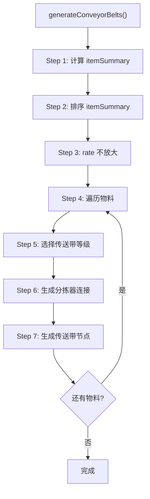

### 6.3 Step 1: 计算 itemSummary

```javascript
let itemSummary = {}

for (let subRecipe of this.recipe.subRecipes) {
  let extra_rate = 1
  if (this.recipe.proliferator) {
    if (subRecipe.acceleratorMode === 0) {
      extra_rate += itemMap[this.recipe.proliferator].extra_rate
    } else if (subRecipe.acceleratorMode === 1) {
      extra_rate += itemMap[this.recipe.proliferator].accelerate
    }
  }

  // 处理输出
  for (let outputItem of subRecipe.output) {
    let outputRate = 0
    let fromBuildingNum = 0

    if (subRecipe.input === null) {
      outputRate = outputItem.rate // 原料
    } else {
      if (buildingMap[subRecipe.building.name].category === productionCategory.lab) {
        fromBuildingNum = Math.ceil(subRecipe.building.num / this.config.maxLabLayers)
      } else {
        fromBuildingNum = subRecipe.building.num
      }
      outputRate =
        outputItem.rate *
        buildingMap[subRecipe.building.name].productionSpeed *
        subRecipe.building.num *
        extra_rate
    }

    if (itemSummary[outputItem.name]) {
      itemSummary[outputItem.name].fromBuildingNum += fromBuildingNum
      itemSummary[outputItem.name].rate += outputRate
    } else {
      itemSummary[outputItem.name] = {
        rate: outputRate,
        fromBuildingNum: fromBuildingNum,
        toBuildingNum: 0
      }
    }
  }

  // 处理输入
  if (subRecipe.input === null) {
    continue
  }

  for (let inputItem of subRecipe.input) {
    let toBuildingNum = 0
    if (buildingMap[subRecipe.building.name].category === productionCategory.lab) {
      toBuildingNum = Math.ceil(subRecipe.building.num / this.config.maxLabLayers)
    } else {
      toBuildingNum = subRecipe.building.num
    }

    if (itemSummary[inputItem.name]) {
      itemSummary[inputItem.name].toBuildingNum += toBuildingNum
      if (!itemSummary[inputItem.name].needProliferator && subRecipe.acceleratorMode !== -1) {
        itemSummary[inputItem.name].needProliferator = true
      }
      if (subRecipe.acceleratorMode === 1) {
        itemSummary[inputItem.name].inputRate +=
          inputItem.rate * productionSpeed * subRecipe.building.num * extra_rate
      } else {
        itemSummary[inputItem.name].inputRate +=
          inputItem.rate * productionSpeed * subRecipe.building.num
      }
    } else {
      let itemInputRate = inputItem.rate * productionSpeed * subRecipe.building.num
      if (subRecipe.acceleratorMode === 1) {
        itemInputRate *= extra_rate
      }
      itemSummary[inputItem.name] = {
        rate: 0,
        inputRate: itemInputRate,
        fromBuildingNum: 0,
        toBuildingNum: toBuildingNum,
        needProliferator: subRecipe.acceleratorMode !== -1
      }
    }
  }
}
```

### 6.4 itemSummary 数据结构

```
itemSummary 数据结构：
{
  itemName: {
    rate: Number,           // 产出速率（items/s）
    inputRate: Number,      // 消耗速率（items/s）
    fromBuildingNum: Number,  // 产出建筑数量
    toBuildingNum: Number,    // 消耗建筑数量
    needProliferator: Boolean // 是否需要增产剂
  }
}
```

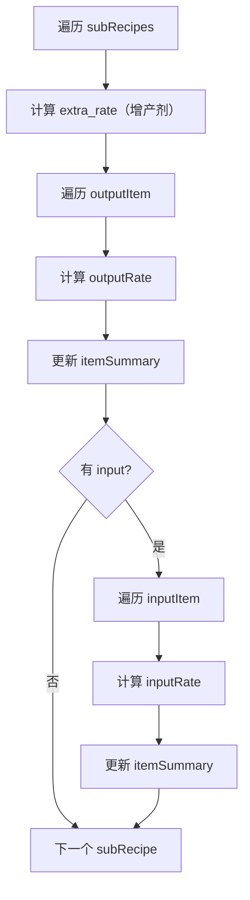

### 6.5 Step 2: 排序 itemSummary

```javascript
sortItemSummary(itemSummary) {
    let newSummary = {};
    let proliferator = ['proliferatorMk3', 'proliferatorMk2', 'proliferatorMk1'];
    let outItem = ['refinedOil', 'hydrogen', 'graphene', 'deuterium'];

    // 1. 增产剂（取最高等级）
    for (let key in proliferator) {
        if (itemSummary[proliferator[key]] && itemSummary[proliferator[key]].toBuildingNum === 0) {
            newSummary[proliferator[key]] = itemSummary[proliferator[key]];
            break;
        }
    }

    // 2. 原料（fromBuildingNum === 0）
    for (let key in itemSummary) {
        if (itemSummary[key].fromBuildingNum === 0) {
            newSummary[key] = itemSummary[key];
        }
    }

    // 3. 终产物（toBuildingNum === 0）
    for (let key in itemSummary) {
        if (itemSummary[key].toBuildingNum === 0) {
            newSummary[key] = itemSummary[key];
        }
    }

    // 4. 多余产物（精炼油、氢、石墨烯、重氢）
    for (let key in outItem) {
        if (itemSummary[outItem[key]] &&
            itemSummary[outItem[key]].fromBuildingNum - itemSummary[outItem[key]].toBuildingNum > 0) {
            newSummary[outItem[key]] = itemSummary[outItem[key]];
        }
    }

    // 5. 其余中间产物
    for (let key in itemSummary) {
        if (itemSummary[key].toBuildingNum !== 0 && itemSummary[key].fromBuildingNum !== 0) {
            newSummary[key] = itemSummary[key];
        }
    }

    return newSummary;
}
```

**排序优先级**：

| 优先级 | 类型     | 判断条件                              |
| ------ | -------- | ------------------------------------- |
| 1      | 增产剂   | `toBuildingNum === 0`                 |
| 2      | 原料     | `fromBuildingNum === 0`               |
| 3      | 终产物   | `toBuildingNum === 0`                 |
| 4      | 多余产物 | `fromBuildingNum - toBuildingNum > 0` |
| 5      | 中间产物 | 其他                                  |

### 6.6 Step 3: rate 不放大

```javascript
// 不堆叠模式：stackLayers = 1，条件不满足，不执行放大
const stackLayers = this.config.stackLayers || 1
if (stackLayers > 1) {
  // 此代码块不执行
  for (let key in itemSummary) {
    itemSummary[key].rate *= stackLayers
    if (itemSummary[key].inputRate !== undefined) {
      itemSummary[key].inputRate *= stackLayers
    }
  }
  for (let itemName in this.sorters) {
    if (this.sorters[itemName].output) {
      for (let s of this.sorters[itemName].output) {
        s.rate *= stackLayers
      }
    }
    if (this.sorters[itemName].input) {
      for (let s of this.sorters[itemName].input) {
        s.rate *= stackLayers
      }
    }
  }
}
```

### 6.7 Step 4: 分拣器分配策略

```javascript
// 不堆叠模式：每个传送带节点可以分配 maxSorterNumOneBelt 个分拣器
const sortersPerNode =
  stackLayers > 1
    ? Math.max(1, Math.floor(this.config.maxSorterNumOneBelt / stackLayers))
    : this.config.maxSorterNumOneBelt

// 不堆叠模式：sortersPerNode = maxSorterNumOneBelt（默认 8）
```

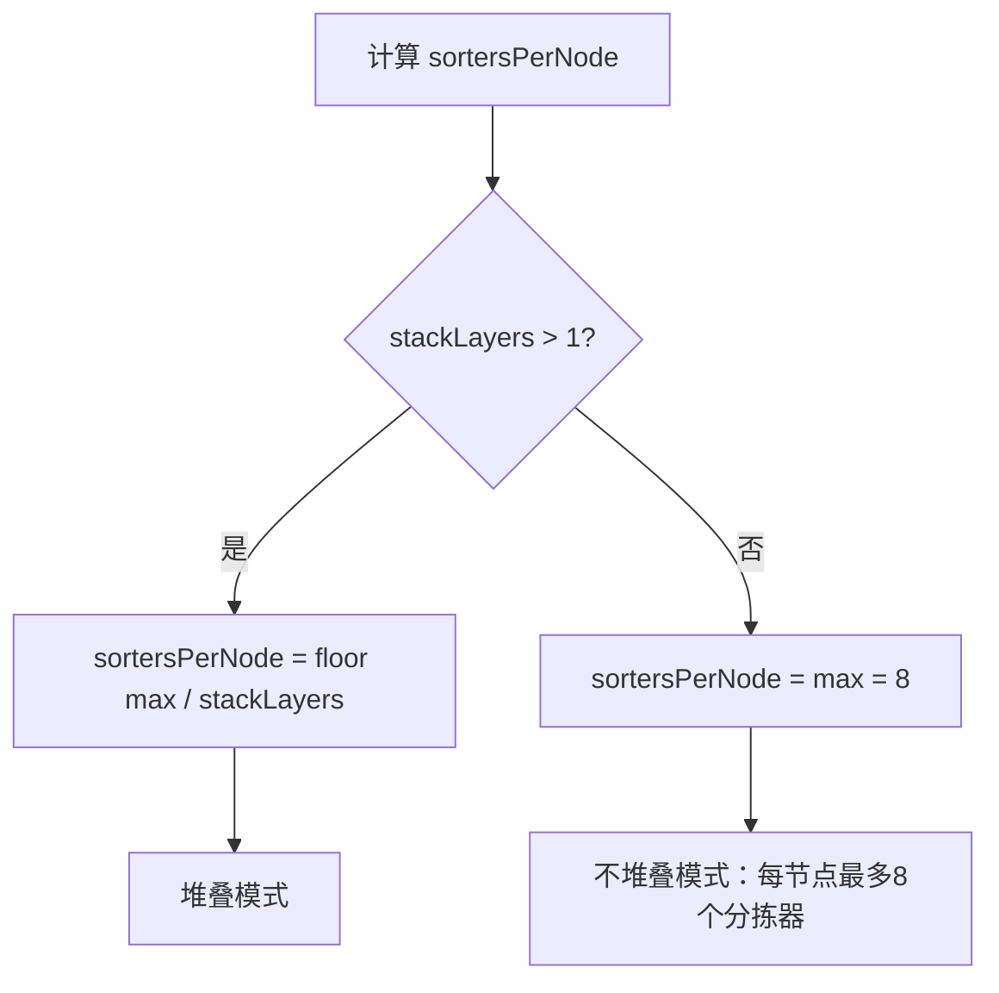

### 6.8 Step 5: 传送带等级选择

```javascript
let conveyorBelt = buildingMap.conveyorBeltMk1

if (this.config.onlyConveyorBeltMk3) {
  // 强制使用三级传送带
  conveyorBelt = buildingMap.conveyorBeltMK3
} else if (item.rate >= conveyorBelt.transportSpeed) {
  if (item.rate === conveyorBelt.transportSpeed && this.config.upgradeConveyorBelt) {
    // 刚好满带且配置升级
    conveyorBelt = buildingMap.conveyorBeltMK3
  } else if (item.rate > conveyorBelt.transportSpeed) {
    // 超过一级带运力
    conveyorBelt = buildingMap.conveyorBeltMK3
  }
}

// 原料可以堆叠
let maxTransportSpeed = buildingMap.conveyorBeltMK3.transportSpeed
if (item.fromBuildingNum === 0) {
  maxTransportSpeed =
    buildingMap.conveyorBeltMK3.transportSpeed * this.config.conveyorBeltStackLayer
}
```

**传送带选择逻辑**：

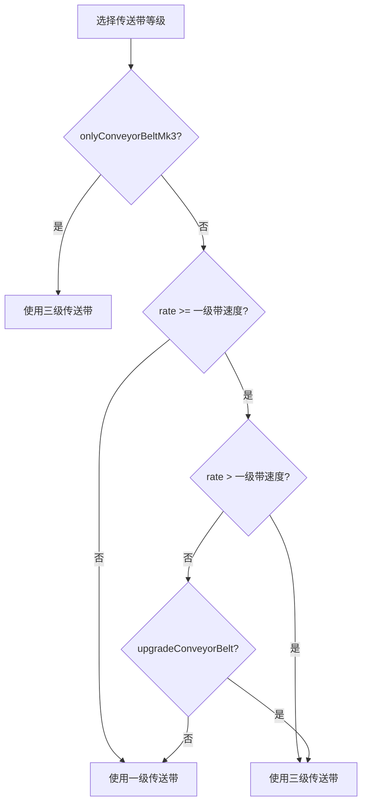

### 6.9 Step 6: 生成分拣器连接

```javascript
for (let totalDoneRate = 0; item.rate - totalDoneRate > zero; ) {
  let needSprayCoater = item.needProliferator
  let doneRate = 0
  let parameters = null
  let inputRate = Math.min(maxTransportSpeed, item.rate - totalDoneRate)
  let inputData = []
  let outputData = []
  let doneSorterNum = 0

  // 安全退出防止死循环
  if (item.fromBuildingNum !== 0 && this.sorters[itemName].output.length === 0) {
    break
  }
  if (
    item.fromBuildingNum === 0 &&
    item.toBuildingNum !== 0 &&
    this.sorters[itemName].input &&
    this.sorters[itemName].input.length === 0
  ) {
    break
  }

  // 处理输出分拣器
  if (item.fromBuildingNum !== 0) {
    for (let j = this.sorters[itemName].output.length - 1; j >= 0; j--) {
      if (this.sorters[itemName].output[j].rate - inputRate > zero) {
        break
      }
      if ((doneSorterNum + 1) % sortersPerNode === 0 || doneSorterNum === 0) {
        inputData.push([this.sorters[itemName].output[j].index])
      } else {
        inputData[inputData.length - 1].push(this.sorters[itemName].output[j].index)
      }
      inputRate -= this.sorters[itemName].output[j].rate
      doneRate += this.sorters[itemName].output[j].rate
      this.sorters[itemName].output.pop()
      doneSorterNum++
    }
  } else {
    // 原料
    inputData.push([])
    parameters = {
      iconId: itemMap[itemName].iconId,
      count: (inputRate * 60).toFixed(0)
    }
    doneRate += inputRate
  }

  totalDoneRate += doneRate
  // ... 处理输入分拣器
}
```

### 6.10 Step 7: 生成传送带节点

```javascript
let direction = 1 // y轴正方向，用于终产物和中间产物
if (item.fromBuildingNum === 0) {
  direction = -1 // y轴负方向，用于原料
}

this.newConveyor(conveyorBelt, direction, inputData, outputData, parameters, needSprayCoater)
```

**传送带方向说明**：

| 物料类型 | direction | 说明              |
| -------- | --------- | ----------------- |
| 原料     | -1        | y轴负方向（向下） |
| 产物     | 1         | y轴正方向（向上） |

### 6.11 newConveyor() 传送带生成详解

**代码位置**: `blueprint.js` L751-949

**功能说明**：生成一条完整的传送带链路，包含多个节点，连接分拣器。

```javascript
newConveyor(
    conveyor,        // 传送带类型（MK1/MK3）
    direction,       // 方向：1=y轴正方向，-1=y轴负方向
    inputData,       // 输入分拣器index数组 [[idx1,idx2], [idx3], ...]
    outputData,      // 输出分拣器index数组 [[idx1,idx2], [idx3], ...]
    parameters,      // 参数（原料/终产物的图标和数量）
    needSprayCoater  // 是否需要喷涂机
) {
    // Step 1: 初始化坐标
    let buildingX = this.occupiedArea[this.occupiedArea.length - 1].x2 + 1;
    let buildingY = this.occupiedArea[this.occupiedArea.length - 2].y2;
    let buildingZ = 0;

    // Step 2: 生成输入节点（连接输出分拣器）
    for (let i = 0; i < inputData.length; i++) {
        if (direction < 0) break;  // 原料带不需要输入节点

        buildingY += 1;
        // 创建传送带节点
        this.buildings.push(
            this.newConveyorNode(
                { x: buildingX, y: buildingY, z: buildingZ },
                [0, 0],
                conveyor,
                this.buildingIndex + 2,  // 指向下一个节点
                1,
                null
            )
        );

        // 修改分拣器的outputObjIdx指向此节点
        for (let b of this.buildings) {
            if (inputData[i].includes(b.index)) {
                b.outputObjIdx = this.buildingIndex;
            }
        }
    }

    // Step 3: 生成输出节点（连接输入分拣器）
    for (let i = 0; i < outputData.length; i++) {
        buildingY += 1;
        let nodeYaw = direction < 0 ? [180, 180] : [0, 0];
        let nodeParameters = null;

        // 最后一个节点显示参数（原料/终产物信息）
        if (direction > 0 && i === outputData.length - 1) {
            nodeParameters = parameters;
        }

        this.buildings.push(
            this.newConveyorNode(
                { x: buildingX, y: buildingY, z: buildingZ },
                nodeYaw,
                conveyor,
                outputObjIdx,
                outputToSlot,
                nodeParameters
            )
        );

        // 修改分拣器的inputObjIdx指向此节点
        for (let b of this.buildings) {
            if (outputData[i].includes(b.index)) {
                b.inputObjIdx = this.buildingIndex;
                b.inputFromSlot = -1;
            }
        }
    }
}
```

**传送带节点连接示意**：

```
产物传送带（direction=1，向上）：

  [分拣器1]──┐
  [分拣器2]──┼──→ [节点1] → [节点2] → [节点3] → [参数节点]
  [分拣器3]──┘         ↑                      ↑
                    连接分拣器              显示产物信息
                    outputObjIdx

原料传送带（direction=-1，向下）：

  [参数节点] → [节点1] → [节点2] → [节点3] ──┬──→ [分拣器1]
         ↑                                 ├──→ [分拣器2]
      显示原料信息                          └──→ [分拣器3]
                                            连接分拣器
                                            inputObjIdx
```

### 6.12 newConveyorNode() 节点生成

**代码位置**: `blueprint.js` L722-750

```javascript
newConveyorNode(
    offset,         // 位置坐标 {x, y, z}
    yaw,            // 旋转角度 [angle, angle]
    conveyor,       // 传送带类型
    outputObjIdx,   // 输出目标index
    outputToSlot,   // 输出槽位
    parameters      // 参数（图标、数量等）
) {
    return {
        index: ++this.buildingIndex,
        areaIndex: 0,
        localOffset: [offset, offset],  // 两个相同的坐标点
        yaw: yaw,
        itemId: conveyor.itemId,
        modelIndex: conveyor.modelIndex,
        outputObjIdx: outputObjIdx,
        inputObjIdx: -1,
        outputToSlot: outputToSlot,
        inputFromSlot: 0,
        outputFromSlot: 0,
        inputToSlot: 1,
        outputOffset: 0,
        inputOffset: 0,
        recipeId: 0,
        filterId: 0,
        parameters: parameters,
    };
}
```

**传送带节点数据结构**：

```
{
    index: Number,           // 建筑唯一标识
    areaIndex: 0,            // 区域索引
    localOffset: [{x,y,z}, {x,y,z}],  // 位置坐标（两点定义方向）
    yaw: [angle, angle],     // 旋转角度
    itemId: Number,          // 传送带itemId
    modelIndex: Number,      // 模型索引
    outputObjIdx: Number,    // 输出目标建筑index
    inputObjIdx: -1,         // 输入源建筑index（传送带通常为-1）
    outputToSlot: Number,    // 输出槽位
    inputFromSlot: 0,        // 输入来源槽位
    outputFromSlot: 0,       // 输出来源槽位
    inputToSlot: 1,          // 输入目标槽位
    outputOffset: 0,         // 输出偏移
    inputOffset: 0,          // 输入偏移
    recipeId: 0,             // 配方ID（传送带为0）
    filterId: 0,             // 过滤ID
    parameters: {            // 参数（仅首尾节点）
        iconId: Number,      // 物品图标ID
        count: String        // 每分钟数量
    }
}
```

### 6.13 不堆叠模式传送带特点

```
不堆叠模式传送带设计要点：

1. rate 不放大
   - itemSummary.rate 保持原始值
   - 分拣器.rate 保持原始值
   - 传送带按原始产能设计

2. 分拣器分配
   - sortersPerNode = maxSorterNumOneBelt（默认8）
   - 每节点最多分配8个分拣器
   - 超过8个时创建新节点

3. 单层布局
   - 所有传送带在 z=0 层
   - 传送带方向：原料向下，产物向上

示例（60个设备，每设备产出1 items/s）：
  itemSummary.rate = 60 items/s
  分拣器总数 = 60个
  节点数 = ceil(60/8) = 8个节点
```

### 6.14 传送带等级选择详解

```javascript
// 传送带等级选择逻辑
let conveyorBelt = buildingMap.conveyorBeltMk1 // 默认一级带

// 条件1：强制使用三级带
if (this.config.onlyConveyorBeltMk3) {
  conveyorBelt = buildingMap.conveyorBeltMK3
}
// 条件2：速率超过一级带
else if (item.rate >= conveyorBelt.transportSpeed) {
  // 条件2a：刚好满带且配置升级
  if (item.rate === conveyorBelt.transportSpeed && this.config.upgradeConveyorBelt) {
    conveyorBelt = buildingMap.conveyorBeltMK3
  }
  // 条件2b：超过一级带运力
  else if (item.rate > conveyorBelt.transportSpeed) {
    conveyorBelt = buildingMap.conveyorBeltMK3
  }
}

// 原料可以堆叠（带流）
let maxTransportSpeed = buildingMap.conveyorBeltMK3.transportSpeed
if (item.fromBuildingNum === 0) {
  // 原料带：速度 × 堆叠层数
  maxTransportSpeed =
    buildingMap.conveyorBeltMK3.transportSpeed * this.config.conveyorBeltStackLayer
}
```

**传送带速度对照表**：

| 传送带 | transportSpeed | 运力/min | 使用场景   |
| ------ | -------------- | -------- | ---------- |
| Mk.I   | 6              | 360      | 低产能产线 |
| Mk.II  | 12             | 720      | 中产能产线 |
| Mk.III | 30             | 1800     | 高产能产线 |

**原料堆叠计算**：

```
原料带堆叠（conveyorBeltStackLayer = 4）：
  原始速度 = 30 items/s
  堆叠后速度 = 30 × 4 = 120 items/s
  运力 = 120 × 60 = 7200 items/min

适用场景：
  - 原料物品可堆叠（如矿石）
  - 需要高运力输入
```

### 6.15 分拣器连接流程

```javascript
// 分拣器连接核心逻辑
for (let totalDoneRate = 0; item.rate - totalDoneRate > zero; ) {
  let doneRate = 0
  let inputRate = Math.min(maxTransportSpeed, item.rate - totalDoneRate)
  let inputData = []
  let outputData = []
  let doneSorterNum = 0

  // 处理输出分拣器（产物）
  if (item.fromBuildingNum !== 0) {
    for (let j = this.sorters[itemName].output.length - 1; j >= 0; j--) {
      // 检查分拣器rate是否超过剩余容量
      if (this.sorters[itemName].output[j].rate - inputRate > zero) {
        break // 当前节点容量不足，创建新节点
      }

      // 添加到当前节点
      if ((doneSorterNum + 1) % sortersPerNode === 0 || doneSorterNum === 0) {
        inputData.push([this.sorters[itemName].output[j].index])
      } else {
        inputData[inputData.length - 1].push(this.sorters[itemName].output[j].index)
      }

      inputRate -= this.sorters[itemName].output[j].rate
      doneRate += this.sorters[itemName].output[j].rate
      this.sorters[itemName].output.pop()
      doneSorterNum++
    }
  } else {
    // 原料：创建空输入节点
    inputData.push([])
    parameters = {
      iconId: itemMap[itemName].iconId,
      count: (inputRate * 60).toFixed(0)
    }
    doneRate += inputRate
  }

  // 处理输入分拣器（消费者）
  // ... 类似逻辑

  totalDoneRate += doneRate

  // 生成传送带
  this.newConveyor(conveyorBelt, direction, inputData, outputData, parameters, needSprayCoater)
}
```

**分拣器分配示意**：

```
60个分拣器，sortersPerNode = 8：

节点1: [分拣器1-8]   → inputData[0] = [idx1, idx2, ..., idx8]
节点2: [分拣器9-16]  → inputData[1] = [idx9, idx10, ..., idx16]
节点3: [分拣器17-24] → inputData[2] = [idx17, idx18, ..., idx24]
节点4: [分拣器25-32] → inputData[3] = [idx25, idx26, ..., idx32]
节点5: [分拣器33-40] → inputData[4] = [idx33, idx34, ..., idx40]
节点6: [分拣器41-48] → inputData[5] = [idx41, idx42, ..., idx48]
节点7: [分拣器49-56] → inputData[6] = [idx49, idx50, ..., idx56]
节点8: [分拣器57-60] → inputData[7] = [idx57, idx58, idx59, idx60]
```

---

## 7. Phase 4: cloneToStackLayers() 克隆检查

### 7.1 代码位置

`blueprint.js` L2099-2102

### 7.2 核心逻辑

```javascript
cloneToStackLayers() {
    if (!this.config.stackLayers || this.config.stackLayers <= 1) {
      return;  // 不堆叠模式直接返回
    }
    // ... 堆叠模式逻辑
}
```

### 7.3 处理流程

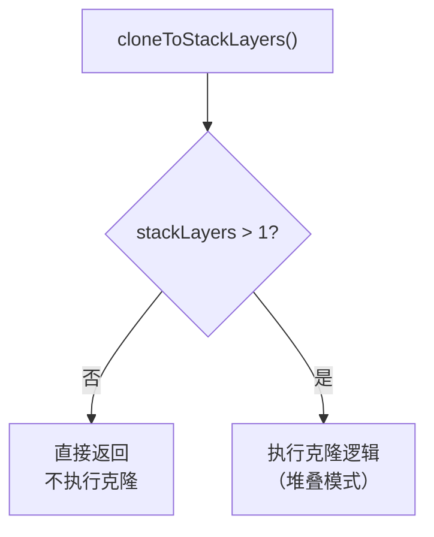

### 7.4 不堆叠模式结果

```
不堆叠模式：
  - stackLayers = 1 或未设置
  - cloneToStackLayers() 直接返回
  - 所有建筑保持在 z=0 层
  - 不进行任何克隆操作
```

### 7.5 cloneToStackLayers() 完整代码

**代码位置**: `blueprint.js` L2099-2210

```javascript
cloneToStackLayers() {
    // 不堆叠模式：直接返回
    if (!this.config.stackLayers || this.config.stackLayers <= 1) {
        return;
    }

    // 以下代码仅堆叠模式执行
    const stackLayers = this.config.stackLayers;
    const zStep = 10;

    // 1. 记录 z=0 层全部建筑
    const baseBuildings = this.buildings.slice();
    const baseCount = baseBuildings.length;

    // 2. 生成地基（每层独立地基）
    const foundationStartIndex = baseCount + 1;
    for (let layer = 0; layer < stackLayers; layer++) {
        const foundationZ = (layer - 1) * zStep;
        const foundationBuilding = this.getBuildingTemplate();
        foundationBuilding.itemId = 1131;
        foundationBuilding.modelIndex = 37;
        foundationBuilding.localOffset = [
            { x: 0, y: 0, z: foundationZ },
            { x: 0, y: 0, z: foundationZ },
        ];
        foundationBuilding.inputToSlot = 1;
        foundationBuilding.parameters = null;
        this.buildings.push(foundationBuilding);
    }

    // 3. 识别需跳过的建筑类型
    const labItemIds = new Set([
        buildingMap.lab.itemId,
        buildingMap["自演化研究站"].itemId,
    ]);
    const beltItemIds = new Set([2001, 2002, 2003]);
    const sprayCoaterItemId = buildingMap.sprayCoater.itemId;

    // 4. 收集 Lab 的 index
    const labIndices = new Set();
    for (const b of baseBuildings) {
        if (labItemIds.has(b.itemId)) {
            labIndices.add(b.index);
        }
    }

    // 5. 过滤可克隆建筑
    const cloneableBuildings = baseBuildings.filter((b) => {
        if (labItemIds.has(b.itemId)) return false;
        if (labIndices.has(b.inputObjIdx) || labIndices.has(b.outputObjIdx)) return false;
        if (beltItemIds.has(b.itemId)) return false;
        if (b.itemId === sprayCoaterItemId) return false;
        return true;
    });

    // 6. 逐层克隆
    for (let layer = 1; layer < stackLayers; layer++) {
        const zOffset = layer * zStep;

        // 预分配index映射表
        const indexMap = new Map();
        let nextIndex = this.buildingIndex + 1;
        for (const base of cloneableBuildings) {
            indexMap.set(base.index, nextIndex);
            nextIndex++;
        }

        // 创建克隆体
        for (const base of cloneableBuildings) {
            const clone = this.getBuildingTemplate();

            // 复制基础属性
            clone.itemId = base.itemId;
            clone.modelIndex = base.modelIndex;
            clone.areaIndex = base.areaIndex;
            clone.recipeId = base.recipeId;
            clone.filterId = base.filterId;
            // ... 更多属性

            // 应用z偏移
            clone.localOffset = base.localOffset
                ? base.localOffset.map((o) => ({
                    x: o.x,
                    y: o.y,
                    z: (o.z || 0) + zOffset,
                }))
                : null;

            // index引用重映射
            // ...

            this.buildings.push(clone);
        }
    }
}
```

### 7.6 不堆叠模式与堆叠模式对比

```javascript
// 不堆叠模式 (stackLayers = 1)
cloneToStackLayers() {
    // 条件不满足，直接返回
    if (!this.config.stackLayers || this.config.stackLayers <= 1) {
        return;  // ← 不堆叠模式在此返回
    }
    // 以下代码不执行
}

// 堆叠模式 (stackLayers = 4)
cloneToStackLayers() {
    // 条件满足，继续执行
    if (!this.config.stackLayers || this.config.stackLayers <= 1) {
        return;  // 不执行此返回
    }
    // 执行克隆逻辑
    // ...
}
```

### 7.7 不堆叠模式最终建筑结构

```
不堆叠模式最终建筑结构（stackLayers=1）：

z=0 层：
┌─────────────────────────────────────────────────────────────┐
│                                                             │
│  [设备1] → [分拣器1]                                         │
│  [设备2] → [分拣器2]                                         │
│  [设备3] → [分拣器3]                                         │
│  ...                                                        │
│  [设备60] → [分拣器60]                                       │
│                                                             │
│  [Lab 1] z=0                                                │
│  [Lab 2] z=3   ← Lab垂直堆叠（独立于stackLayers）            │
│  [Lab 3] z=6                                                │
│  [Lab 4] z=9                                                │
│                                                             │
│  [传送带网络]                                                │
│                                                             │
└─────────────────────────────────────────────────────────────┘

特点：
  - 所有设备在 z=0 层
  - Lab 有独立的垂直堆叠（maxLabLayers）
  - 传送带在 z=0 层
  - 没有克隆建筑
```

### 7.8 堆叠模式最终建筑结构对比

```
堆叠模式最终建筑结构（stackLayers=4）：

z=30 层：
┌─────────────────────────────────────────────────────────────┐
│  [设备1-15克隆] → [分拣器克隆]                               │
└─────────────────────────────────────────────────────────────┘

z=20 层：
┌─────────────────────────────────────────────────────────────┐
│  [设备1-15克隆] → [分拣器克隆]                               │
└─────────────────────────────────────────────────────────────┘

z=10 层：
┌─────────────────────────────────────────────────────────────┐
│  [设备1-15克隆] → [分拣器克隆]                               │
└─────────────────────────────────────────────────────────────┘

z=0 层（原始层）：
┌─────────────────────────────────────────────────────────────┐
│  [设备1-15] → [分拣器]                                       │
│  [Lab 1-4] z=0,3,6,9                                        │
│  [传送带网络] ← 所有层共享                                   │
└─────────────────────────────────────────────────────────────┘

特点：
  - 设备分布在 z=0,10,20,30 四层
  - 每层设备数为原始的1/4
  - Lab 仍在 z=0 层（不克隆）
  - 传送带在 z=0 层（所有层共享）
```

---

## 8. 速率计算详解

### 8.1 产物速率计算

**代码位置**: `blueprint.js` L2275-2305

```javascript
for (let outputItem of subRecipe.output) {
  let outputRate = 0
  let fromBuildingNum = 0

  if (subRecipe.input === null) {
    outputRate = outputItem.rate // 原料项
  } else {
    if (buildingMap[subRecipe.building.name].category === productionCategory.lab) {
      // 研究站可堆叠，需特殊处理
      fromBuildingNum = Math.ceil(subRecipe.building.num / this.config.maxLabLayers)
    } else {
      fromBuildingNum = subRecipe.building.num
    }
    outputRate =
      outputItem.rate *
      buildingMap[subRecipe.building.name].productionSpeed *
      subRecipe.building.num *
      extra_rate
  }
}
```

**计算公式**：

```
outputRate = outputItem.rate × productionSpeed × building.num × extra_rate

其中：
- outputItem.rate: 配方中产物的基准速率
- productionSpeed: 建筑生产速度倍率
- building.num: 建筑数量
- extra_rate: 增产剂增产倍率
```

**示例**：

```
铁板配方：
  - outputItem.rate = 1（每秒产出1个铁板）
  - productionSpeed = 1（电弧熔炉）
  - building.num = 60
  - extra_rate = 1.25（增产剂Mk.III增产25%）

outputRate = 1 × 1 × 60 × 1.25 = 75 items/s
```

### 8.2 原料速率计算

**代码位置**: `blueprint.js` L2315-2355

```javascript
for (let inputItem of subRecipe.input) {
  let toBuildingNum = 0
  if (buildingMap[subRecipe.building.name].category === productionCategory.lab) {
    toBuildingNum = Math.ceil(subRecipe.building.num / this.config.maxLabLayers)
  } else {
    toBuildingNum = subRecipe.building.num
  }
  let itemInputRate =
    inputItem.rate * buildingMap[subRecipe.building.name].productionSpeed * subRecipe.building.num
  if (subRecipe.acceleratorMode === 1) {
    itemInputRate *= extra_rate // 加速时原料额外消耗
  }
}
```

**计算公式**：

```
inputRate = inputItem.rate × productionSpeed × building.num × extra_rate(可选)

其中：
- inputItem.rate: 配方中原料的基准速率
- productionSpeed: 建筑生产速度倍率
- building.num: 建筑数量
- extra_rate: 增产剂加速倍率（仅加速模式）
```

**示例**：

```
铁板配方：
  - inputItem.rate = 1（每秒消耗1个铁矿石）
  - productionSpeed = 1（电弧熔炉）
  - building.num = 60
  - acceleratorMode = 0（增产模式，不额外消耗）

inputRate = 1 × 1 × 60 × 1 = 60 items/s
```

### 8.3 分拣器速率计算

**输出分拣器**：

```javascript
let actual_rate = outputItem.rate * productionSpeed * actual_building_num * extra_rate
```

**输入分拣器**：

```javascript
let actual_rate = inputItem.rate * productionSpeed * actual_building_num
```

**注意**：分拣器 rate 是单个分拣器的速率，不是总和。

### 8.4 速率计算流程图

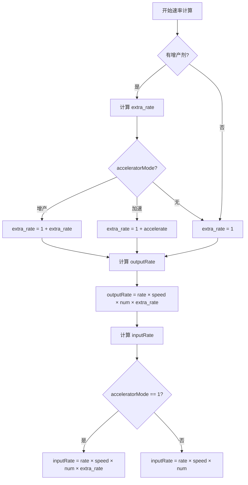

---

## 9. 传送带ICON和数据分析

### 9.1 传送带参数计算

**代码位置**: `blueprint.js` L2476-2481, L2649-2654

```javascript
// 原料传送带参数
parameters = {
  iconId: itemMap[itemName].iconId,
  count: (inputRate * 60).toFixed(0) // 转换为每分钟
}

// 终产物传送带参数
parameters = {
  iconId: itemMap[itemName].iconId,
  count: (outputRate * 60).toFixed(0) // 转换为每分钟
}
```

### 9.2 inputRate 和 outputRate 的来源

**inputRate**（原料速率）：

```javascript
// 来自 itemSummary.inputRate
let inputRate = Math.min(maxTransportSpeed, item.rate - totalDoneRate)
```

**outputRate**（产物速率）：

```javascript
// 来自分拣器 rate 总和
let outputRate = doneRate // doneRate = 分拣器 rate 累加
```

### 9.3 数据流示意

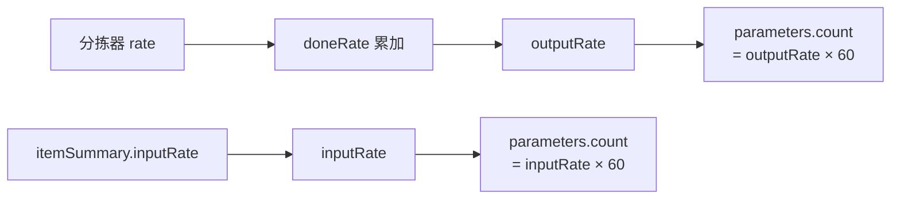

### 9.4 数据转换说明

| 数据项           | 单位      | 转换      |
| ---------------- | --------- | --------- |
| 分拣器 rate      | items/s   | 直接使用  |
| itemSummary.rate | items/s   | 直接使用  |
| parameters.count | items/min | rate × 60 |

---

## 10. 与堆叠模式的对比

### 10.1 流程对比

| 阶段                    | 不堆叠模式     | 堆叠模式           |
| ----------------------- | -------------- | ------------------ |
| init()                  | num 不缩减     | num ÷ stackLayers  |
| generateBuildings()     | 所有设备在 z=0 | 缩减后设备在 z=0   |
| generateConveyorBelts() | rate 不放大    | rate × stackLayers |
| cloneToStackLayers()    | 不执行         | 克隆到高层         |

### 10.2 速率计算对比

| 项目              | 不堆叠模式  | 堆叠模式       |
| ----------------- | ----------- | -------------- |
| 设备数量          | 60          | 15 × 4 = 60    |
| 单设备分拣器 rate | 1           | 1 × 4 = 4      |
| 分拣器 rate 总和  | 60 × 1 = 60 | 15 × 4 = 60    |
| itemSummary.rate  | 60          | 15 × 4 = 60 ✅ |

### 10.3 传送带数据对比

| 数据项          | 不堆叠模式 | 堆叠模式   | 是否一致 |
| --------------- | ---------- | ---------- | -------- |
| 原料 inputRate  | 60 items/s | 60 items/s | ✅       |
| 原料 count      | 3600/min   | 3600/min   | ✅       |
| 产物 outputRate | 60 items/s | 60 items/s | ✅       |
| 产物 count      | 3600/min   | 3600/min   | ✅       |

### 10.4 详细计算过程

**不堆叠模式**：

```
init(): num = 60（不缩减）
generateConveyorBelts():
  outputRate = outputItem.rate × productionSpeed × num × extra_rate
             = 1 × 1 × 60 × 1 = 60
  itemSummary.rate = 60
```

**堆叠模式**：

```
init(): num = ceil(60/4) = 15（缩减）
generateConveyorBelts():
  outputRate = outputItem.rate × productionSpeed × num × extra_rate
             = 1 × 1 × 15 × 1 = 15
  itemSummary.rate = 15
  放大: itemSummary.rate *= 4 = 60
```

**结论**：堆叠和不堆叠的 itemSummary.rate 最终一致 ✅

### 8.5 速率计算完整公式

**产出速率公式**：

```
outputRate = outputItem.rate × productionSpeed × building.num × extra_rate

参数说明：
- outputItem.rate: 配方中产物的基准速率（items/s）
- productionSpeed: 建筑生产速度倍率
- building.num: 建筑数量
- extra_rate: 增产剂增产倍率（1 + 增产率）

增产剂效果：
- 增产剂Mk.I: extra_rate = 1.125（增产12.5%）
- 增产剂Mk.II: extra_rate = 1.20（增产20%）
- 增产剂Mk.III: extra_rate = 1.25（增产25%）
```

**消耗速率公式**：

```
inputRate = inputItem.rate × productionSpeed × building.num × extra_rate(可选)

参数说明：
- inputItem.rate: 配方中原料的基准速率（items/s）
- productionSpeed: 建筑生产速度倍率
- building.num: 建筑数量
- extra_rate: 增产剂加速倍率（仅加速模式）

加速剂效果：
- 加速剂Mk.I: accelerate = 1.0（加速100%，即2倍速）
- 加速剂Mk.II: accelerate = 1.5（加速150%，即2.5倍速）
- 加速剂Mk.III: accelerate = 2.0（加速200%，即3倍速）

注意：加速模式会额外消耗原料
```

### 8.6 增产剂模式详解

```javascript
// 增产剂模式计算
let extra_rate = 1;

if (this.recipe.proliferator) {
    if (subRecipe.acceleratorMode === 0) {
        // 增产模式：产出增加，消耗不变
        extra_rate += itemMap[this.recipe.proliferator].extra_rate;

        // 产出计算
        outputRate = outputItem.rate × productionSpeed × building.num × extra_rate;

        // 消耗计算（不变）
        inputRate = inputItem.rate × productionSpeed × building.num;

    } else if (subRecipe.acceleratorMode === 1) {
        // 加速模式：产出增加，消耗也增加
        extra_rate += itemMap[this.recipe.proliferator].accelerate;

        // 产出计算
        outputRate = outputItem.rate × productionSpeed × building.num × extra_rate;

        // 消耗计算（增加）
        inputRate = inputItem.rate × productionSpeed × building.num × extra_rate;

    } else {
        // 无增产剂
        extra_rate = 1;
    }
}
```

**增产剂模式对比表**：

| 模式     | acceleratorMode | 产出变化   | 消耗变化   | 适用场景     |
| -------- | --------------- | ---------- | ---------- | ------------ |
| 无增产剂 | -1              | 不变       | 不变       | 普通生产     |
| 增产模式 | 0               | +12.5%~25% | 不变       | 提高产出效率 |
| 加速模式 | 1               | +100%~200% | +100%~200% | 快速生产     |

### 8.7 分拣器速率计算详解

```javascript
// 输出分拣器速率计算
let actual_rate =
  outputItem.rate *
  buildingMap[subRecipe.building.name].productionSpeed *
  actual_building_num *
  extra_rate

// 分拣器等级选择
let sorter = buildingMap.sorterMk1 // 默认一级分拣器

if (this.config.useSorterMk4) {
  // 强制使用四级分拣器
  sorter = buildingMap.sorterMk4
} else if (this.config.onlySorterMk3 || actual_rate > sorter.sortingSpeed) {
  // 强制三级或速率超过一级
  sorter = buildingMap.sorterMk3
}

// 研究站特殊处理：速率超过分拣器能力时追加额外分拣器
if (
  buildingMap[subRecipe.building.name].category === productionCategory.lab &&
  actual_rate > sorter.sortingSpeed
) {
  // 创建额外分拣器处理溢出
  let overflowRate = actual_rate - sorter.sortingSpeed
  // ... 创建额外分拣器
}
```

**分拣器速度对照表**：

| 分拣器 | sortingSpeed | 运力/min | 使用场景     |
| ------ | ------------ | -------- | ------------ |
| Mk.I   | 1.5          | 90       | 低速率产线   |
| Mk.II  | 3            | 180      | 中速率产线   |
| Mk.III | 6            | 360      | 高速率产线   |
| Mk.IV  | 10           | 600      | 超高速率产线 |

### 8.8 研究站速率计算特殊处理

```javascript
// 研究站分拣器数量计算
if (buildingMap[subRecipe.building.name].category === productionCategory.lab) {
  // 研究站可垂直堆叠，分拣器数量按堆叠后的组数计算
  fromBuildingNum = Math.ceil(subRecipe.building.num / this.config.maxLabLayers)

  // 示例：
  // Lab.num = 60, maxLabLayers = 15
  // fromBuildingNum = ceil(60/15) = 4
  // 即只有4个底层Lab需要分拣器连接
} else {
  fromBuildingNum = subRecipe.building.num
}
```

**研究站分拣器计算示例**：

```
配置：Lab.num = 60, maxLabLayers = 15

垂直堆叠后：
  - 4组Lab，每组15层
  - 每组只有底层(z=0)需要分拣器
  - 分拣器数量 = 4个（不是60个）

速率计算：
  - 单个Lab产出速率 = 1 items/s
  - 15层Lab总产出 = 15 items/s
  - 单个分拣器需要处理 15 items/s
  - 需要三级分拣器（sortingSpeed = 6）× 3个
  - 或四级分拣器（sortingSpeed = 10）× 2个
```

### 8.9 速率计算流程图

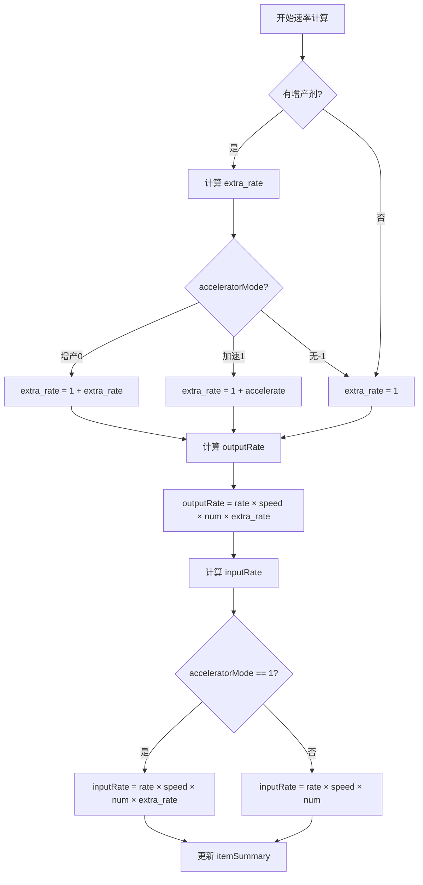

### 10.5 分拣器分配对比

**不堆叠模式分拣器分配**：

```
不堆叠模式（stackLayers=1）：
  - 设备数量 = 60
  - 分拣器数量 = 60
  - 每节点分拣器数 = maxSorterNumOneBelt（默认8）
  - 节点数 = ceil(60/8) = 8个节点

分配示意：
  节点1: [分拣器1-8]
  节点2: [分拣器9-16]
  节点3: [分拣器17-24]
  ...
  节点8: [分拣器57-60]
```

**堆叠模式分拣器分配**：

```
堆叠模式（stackLayers=4）：
  - 设备数量 = 60/4 = 15（每层）
  - 分拣器数量 = 15（每层）
  - 每节点分拣器数 = maxSorterNumOneBelt（默认8）
  - 节点数 = ceil(15/8) = 2个节点

分配示意（z=0层）：
  节点1: [分拣器1-8]
  节点2: [分拣器9-15]

克隆层（z=10,20,30）：
  - 分拣器随设备一起克隆
  - index自动重映射
```

### 10.6 传送带ICON显示详解

**ICON显示位置**：

```javascript
// 传送带参数设置（仅首尾节点显示）
let parameters = null

// 原料带：首节点显示
if (direction < 0 && i === 0) {
  parameters = {
    iconId: itemMap[itemName].iconId,
    count: (inputRate * 60).toFixed(0) // 转换为每分钟数量
  }
}

// 产物带：尾节点显示
if (direction > 0 && i === outputData.length - 1) {
  parameters = {
    iconId: itemMap[itemName].iconId,
    count: (inputRate * 60).toFixed(0)
  }
}
```

**ICON数据结构**：

```
parameters = {
    iconId: Number,    // 物品图标ID（对应itemMap中的iconId）
    count: String      // 每分钟数量（字符串格式）
}

示例：
  铁板产出速率 = 60 items/s
  count = (60 * 60).toFixed(0) = "3600"
  显示：铁板图标 + 3600/min
```

**ICON显示规则表**：

| 传送带类型 | 显示位置 | 显示内容            |
| ---------- | -------- | ------------------- |
| 原料带     | 首节点   | 原料图标 + 输入速率 |
| 产物带     | 尾节点   | 产物图标 + 输出速率 |
| 中间带     | 无       | 不显示              |

### 10.7 传送带数据分析

**传送带节点数据分析**：

```javascript
// 传送带节点统计
let conveyorStats = {
  totalNodes: 0, // 总节点数
  totalLength: 0, // 总长度（格子数）
  avgNodesPerBelt: 0, // 每条带平均节点数
  maxNodesInBelt: 0, // 单条带最大节点数
  beltTypeDistribution: {
    // 传送带类型分布
    mk1: 0,
    mk3: 0
  }
}

// 遍历建筑统计传送带
for (let b of this.buildings) {
  if ([2001, 2002, 2003].includes(b.itemId)) {
    conveyorStats.totalNodes++

    if (b.itemId === 2001) conveyorStats.beltTypeDistribution.mk1++
    if (b.itemId === 2003) conveyorStats.beltTypeDistribution.mk3++
  }
}

// 计算传送带总长度
conveyorStats.totalLength = conveyorStats.totalNodes
```

**传送带效率分析**：

```javascript
// 传送带利用率计算
let beltUtilization = {
    itemName: itemName,
    rate: item.rate,                    // 实际速率
    maxSpeed: conveyorBelt.transportSpeed,  // 传送带最大速度
    utilization: (item.rate / conveyorBelt.transportSpeed * 100).toFixed(1) + '%',
    beltCount: Math.ceil(item.rate / conveyorBelt.transportSpeed)  // 需要的传送带数量
};

// 示例输出
{
    itemName: "ironPlate",
    rate: 45,                           // 45 items/s
    maxSpeed: 30,                       // Mk.III 最大速度
    utilization: "150.0%",              // 超过100%需要多条带
    beltCount: 2                        // 需要2条Mk.III
}
```

### 10.8 分拣器数据分析

**分拣器统计**：

```javascript
// 分拣器统计
let sorterStats = {
  total: 0, // 总分拣器数
  input: 0, // 输入分拣器数
  output: 0, // 输出分拣器数
  typeDistribution: {
    // 类型分布
    mk1: 0,
    mk3: 0,
    mk4: 0
  }
}

// 遍历sorters对象统计
for (let itemName in this.sorters) {
  // 输出分拣器
  if (this.sorters[itemName].output) {
    sorterStats.output += this.sorters[itemName].output.length
    for (let s of this.sorters[itemName].output) {
      if (s.itemId === 2011) sorterStats.typeDistribution.mk1++
      if (s.itemId === 2013) sorterStats.typeDistribution.mk3++
      if (s.itemId === 2014) sorterStats.typeDistribution.mk4++
    }
  }

  // 输入分拣器
  if (this.sorters[itemName].input) {
    sorterStats.input += this.sorters[itemName].input.length
    for (let s of this.sorters[itemName].input) {
      if (s.itemId === 2011) sorterStats.typeDistribution.mk1++
      if (s.itemId === 2013) sorterStats.typeDistribution.mk3++
      if (s.itemId === 2014) sorterStats.typeDistribution.mk4++
    }
  }
}

sorterStats.total = sorterStats.input + sorterStats.output
```

**分拣器效率分析**：

```
分拣器效率分析示例：

物品：铁板
  输出分拣器：60个
  输入分拣器：0个（终产物）
  单分拣器速率：1 items/s
  分拣器类型：Mk.III（sortingSpeed = 6）
  利用率：16.7%（1/6）

物品：铁矿石
  输出分拣器：0个（原料）
  输入分拣器：60个
  单分拣器速率：1 items/s
  分拣器类型：Mk.III
  利用率：16.7%
```

### 10.9 蓝图数据分析报告

**蓝图统计报告生成**：

```javascript
generateBlueprintReport() {
    return {
        // 基础信息
        recipe: this.recipe.name,
        stackLayers: this.config.stackLayers,

        // 建筑统计
        buildings: {
            total: this.buildings.length,
            production: this.buildings.filter(b => b.recipeId > 0).length,
            conveyor: this.buildings.filter(b => [2001,2002,2003].includes(b.itemId)).length,
            sorter: this.buildings.filter(b => [2011,2012,2013,2014].includes(b.itemId)).length,
            lab: this.buildings.filter(b => [2901,2902].includes(b.itemId)).length
        },

        // 产能统计
        production: {
            inputs: Object.keys(this.itemSummary).filter(k => this.itemSummary[k].fromBuildingNum === 0),
            outputs: Object.keys(this.itemSummary).filter(k => this.itemSummary[k].toBuildingNum === 0),
            intermediates: Object.keys(this.itemSummary).filter(k =>
                this.itemSummary[k].fromBuildingNum !== 0 && this.itemSummary[k].toBuildingNum !== 0
            )
        },

        // 空间统计
        area: {
            width: this.occupiedArea.reduce((max, a) => Math.max(max, a.x2), 0),
            height: this.occupiedArea.reduce((max, a) => Math.max(max, a.y2), 0),
            layers: this.config.stackLayers || 1
        }
    };
}
```

**报告输出示例**：

```
蓝图统计报告
====================

基础信息
  配方：铁板
  堆叠层数：1（不堆叠）

建筑统计
  总建筑数：180
  生产建筑：60
  传送带：50
  分拣器：60
  研究站：0

产能统计
  原料：铁矿石
  产物：铁板
  中间产物：无

空间统计
  宽度：25格
  高度：15格
  层数：1层
  占地面积：375格
```

| 模式   | sortersPerNode          | 说明                |
| ------ | ----------------------- | ------------------- |
| 不堆叠 | maxSorterNumOneBelt (8) | 每节点最多8个分拣器 |
| 堆叠   | floor(8/stackLayers)    | 每节点分拣器数受限  |

---

## 11. 边界条件处理

### 11.1 浮点精度处理

```javascript
const zero = 0.0000000001 // rate是每秒生产量，除不尽时会有精度误差
// 小数点后16位都是准确的，取0.0000000001为判断标准足够了

// 比较浮点数
if (item.rate - totalDoneRate > zero) {
  // 继续处理
}
```

### 11.2 分拣器溢出安全退出

```javascript
// 修复：浮点精度导致所有分拣器已消耗但循环未终止，安全退出防止死循环或错位节点
if (item.fromBuildingNum !== 0 && this.sorters[itemName].output.length === 0) {
    break;
}
if (item.fromBuildingNum === 0 && item.toBuildingNum !== 0 &&
    this.sorters[itemName].input && this.sorters[itemName].input.length === 0) {
    break;
}
```

### 11.3 传送带粘连修复

```javascript
// outputData为空时，终结最后一个节点
if (direction > 0 && outputData.length === 0 && nodeNum > 0) {
  this.buildings[this.buildings.length - 1].outputObjIdx = -1
  this.buildings[this.buildings.length - 1].outputToSlot = 0
}

// 更新占地区域X坐标，防止下一条传送带粘连
if (buildingX > 0 && this.occupiedArea.length > 0) {
  this.occupiedArea[this.occupiedArea.length - 1].x2 = buildingX
}
```

### 11.4 熔炉分拣器扩展

```javascript
// 熔炉加入新分拣器后分拣器总数为3，需要扩展熔炉侧边空间
if (
  buildingMap[ownerName].category === productionCategory.smelter &&
  this.buildingArray[i][k].sorterList.length === 3
) {
  // 对后续建筑进行位移
  startMove = true
}
```

### 11.5 X射线裂解/重整精炼优先级

```javascript
// 重新排序以提高输出传送带中，X射线裂解(氢)和重整精炼(精炼油)的输入优先级
if (['hydrogen', 'refinedOil'].includes(itemName) && item.toBuildingNum !== 0) {
  let input2 = []
  for (let j = this.sorters[itemName].input.length - 1; j >= 0; j--) {
    if (
      !(
        (itemName === 'hydrogen' && this.sorters[itemName].input[j].recipeID === 58) ||
        (itemName === 'refinedOil' && this.sorters[itemName].input[j].recipeID === 121)
      )
    ) {
      input2.push(this.sorters[itemName].input[j])
    }
  }
  refineryNum = this.sorters[itemName].input.length - input2.length
  for (let j = this.sorters[itemName].input.length - 1; j >= 0; j--) {
    if (
      (itemName === 'hydrogen' && this.sorters[itemName].input[j].recipeID === 58) ||
      (itemName === 'refinedOil' && this.sorters[itemName].input[j].recipeID === 121)
    ) {
      input2.push(this.sorters[itemName].input[j])
    }
  }
  this.sorters[itemName].input = input2
}
```

### 11.6 研究站边界条件

```javascript
// 研究站数量不能超过最大堆叠层数的整数倍
if (buildingMap[subRecipe.building.name].category === productionCategory.lab) {
  // 确保研究站数量是maxLabLayers的整数倍
  let labNum = subRecipe.building.num
  let maxLayers = this.config.maxLabLayers

  if (labNum % maxLayers !== 0) {
    // 向上取整到最近的整数倍
    subRecipe.building.num = Math.ceil(labNum / maxLayers) * maxLayers
  }
}

// 研究站分拣器数量边界
let labGroups = Math.ceil(subRecipe.building.num / this.config.maxLabLayers)
if (labGroups < 1) labGroups = 1
```

### 11.7 传送带速率边界条件

```javascript
// 传送带速率不能为0或负数
if (item.rate <= 0) {
    console.warn(`物品 ${itemName} 速率为 ${item.rate}，跳过传送带生成`);
    continue;
}

// 传送带速率超过最大运力时的处理
let maxBeltSpeed = buildingMap.conveyorBeltMK3.transportSpeed;
if (item.rate > maxBeltSpeed * 10) {
    // 速率过大，生成多条传送带
    let beltCount = Math.ceil(item.rate / maxBeltSpeed);
    console.info(`物品 ${itemName} 需要 ${beltCount} 条传送带`);
}

// 原料堆叠层数边界
if (this.config.conveyorBeltStackLayer < 1) {
    this.config.conveyorBeltStackLayer = 1;
}
if (this.config.conveyorBeltStackLayer > 4) {
    this.config.conveyorBeltStackLayer = 4;  // 最大堆叠4层
}
```

### 11.8 建筑数量边界条件

```javascript
// 建筑数量不能为0或负数
for (let subRecipe of this.recipe.subRecipes) {
  if (subRecipe.building && subRecipe.building.num <= 0) {
    console.warn(`建筑 ${subRecipe.building.name} 数量为 ${subRecipe.building.num}，设置为1`)
    subRecipe.building.num = 1
  }
}

// 堆叠模式下建筑数量向下取整
if (this.config.stackLayers > 1) {
  for (let subRecipe of this.recipe.subRecipes) {
    if (subRecipe.building) {
      if (buildingMap[subRecipe.building.name].category !== productionCategory.lab) {
        // 确保每层至少有1个建筑
        let minNum = this.config.stackLayers
        if (subRecipe.building.num < minNum) {
          subRecipe.building.num = minNum
        }
      }
    }
  }
}
```

### 11.9 坐标边界条件

```javascript
// 建筑坐标不能为负数
if (buildingX < 0) buildingX = 0
if (buildingY < 0) buildingY = 0

// 蓝图尺寸限制
const MAX_BLUEPRINT_SIZE = 1000 // 最大尺寸限制
if (this.occupiedArea.length > 0) {
  let maxX = Math.max(...this.occupiedArea.map(a => a.x2))
  let maxY = Math.max(...this.occupiedArea.map(a => a.y2))

  if (maxX > MAX_BLUEPRINT_SIZE || maxY > MAX_BLUEPRINT_SIZE) {
    console.warn(`蓝图尺寸 ${maxX}x${maxY} 超过最大限制 ${MAX_BLUEPRINT_SIZE}`)
  }
}

// z坐标边界（堆叠模式）
const MAX_Z_LAYERS = 100 // 最大层数
const Z_STEP = 10 // 层间距
if (this.config.stackLayers > MAX_Z_LAYERS) {
  console.warn(`堆叠层数 ${this.config.stackLayers} 超过最大限制 ${MAX_Z_LAYERS}`)
  this.config.stackLayers = MAX_Z_LAYERS
}
```

### 11.10 配方ID边界条件

```javascript
// 配方ID映射失败处理
mapRecipeID() {
    for (let subRecipe of this.recipe.subRecipes) {
        let recipeId = this.getRecipeId(subRecipe);

        if (!recipeId || recipeId === 0) {
            console.warn(`配方 ${subRecipe.name} 映射失败，使用默认值`);
            recipeId = 1;  // 使用默认配方ID
        }

        subRecipe.recipeId = recipeId;
    }
}

// 物品ID不存在处理
if (!itemMap[itemName]) {
    console.error(`物品 ${itemName} 不存在于itemMap中`);
    continue;  // 跳过此物品
}
```

### 11.11 分拣器数量边界条件

```javascript
// 分拣器数量限制
const MAX_SORTERS_PER_BUILDING = 4 // 每建筑最大分拣器数

// 检查分拣器数量
for (let i = 0; i < this.buildingArray.length; i++) {
  for (let k = 0; k < this.buildingArray[i].length; k++) {
    let sorterList = this.buildingArray[i][k].sorterList
    if (sorterList.length > MAX_SORTERS_PER_BUILDING) {
      console.warn(`建筑 [${i}][${k}] 分拣器数量 ${sorterList.length} 超过限制`)
    }
  }
}

// 每节点分拣器数量边界
let sortersPerNode = this.config.maxSorterNumOneBelt || 8
if (sortersPerNode < 1) sortersPerNode = 1
if (sortersPerNode > 16) sortersPerNode = 16 // 最大16个
```

### 11.12 增产剂边界条件

```javascript
// 增产剂模式验证
if (subRecipe.acceleratorMode !== undefined) {
  if (![-1, 0, 1].includes(subRecipe.acceleratorMode)) {
    console.warn(`无效的增产剂模式 ${subRecipe.acceleratorMode}，设置为无增产剂`)
    subRecipe.acceleratorMode = -1
  }
}

// 增产剂类型验证
if (this.recipe.proliferator) {
  if (!itemMap[this.recipe.proliferator]) {
    console.warn(`增产剂 ${this.recipe.proliferator} 不存在，禁用增产剂`)
    this.recipe.proliferator = null
  }
}

// 增产剂效果边界
let extra_rate = itemMap[this.recipe.proliferator]?.extra_rate || 0
if (extra_rate < 0) extra_rate = 0
if (extra_rate > 1) extra_rate = 1 // 最大增产100%
```

### 11.13 内存和性能边界条件

```javascript
// 建筑总数限制
const MAX_BUILDINGS = 10000
if (this.buildings.length > MAX_BUILDINGS) {
  console.error(`建筑总数 ${this.buildings.length} 超过限制 ${MAX_BUILDINGS}`)
  // 截断处理
  this.buildings = this.buildings.slice(0, MAX_BUILDINGS)
}

// itemSummary数量限制
const MAX_ITEM_TYPES = 100
let itemTypes = Object.keys(this.itemSummary).length
if (itemTypes > MAX_ITEM_TYPES) {
  console.warn(`物品种类 ${itemTypes} 超过建议限制 ${MAX_ITEM_TYPES}`)
}
```

### 11.14 输出验证

```javascript
// 蓝图输出前验证
validateBlueprint() {
    let errors = [];

    // 检查建筑index连续性
    let indices = this.buildings.map(b => b.index).sort((a, b) => a - b);
    for (let i = 1; i < indices.length; i++) {
        if (indices[i] !== indices[i-1] + 1) {
            errors.push(`建筑index不连续: ${indices[i-1]} -> ${indices[i]}`);
        }
    }

    // 检查引用有效性
    for (let b of this.buildings) {
        if (b.outputObjIdx > 0 && !this.buildings.find(x => x.index === b.outputObjIdx)) {
            errors.push(`建筑 ${b.index} 的 outputObjIdx ${b.outputObjIdx} 无效`);
        }
        if (b.inputObjIdx > 0 && !this.buildings.find(x => x.index === b.inputObjIdx)) {
            errors.push(`建筑 ${b.index} 的 inputObjIdx ${b.inputObjIdx} 无效`);
        }
    }

    // 检查坐标有效性
    for (let b of this.buildings) {
        if (b.localOffset) {
            for (let o of b.localOffset) {
                if (isNaN(o.x) || isNaN(o.y) || isNaN(o.z)) {
                    errors.push(`建筑 ${b.index} 坐标无效`);
                }
            }
        }
    }

    return errors;
}
```

---

## 附录A：代码位置速查

| 函数名                 | 行号  | 功能                           |
| ---------------------- | ----- | ------------------------------ |
| mapRecipeID            | L600  | 配方ID映射                     |
| calculateBlueprintArea | L930  | 蓝图面积计算                   |
| calculateBuildingArea  | L910  | 建筑面积计算                   |
| newProductionBuilding  | L1520 | 生成生产建筑                   |
| init                   | L2048 | 初始化                         |
| cloneToStackLayers     | L2099 | 建筑堆叠（不堆叠模式直接返回） |
| sortItemSummary        | L2210 | 物料排序                       |
| generateConveyorBelts  | L2265 | 传送带网络                     |
| generateBuildings      | L2832 | 建筑生成                       |

---

## 附录B：关键常量速查

### 建筑ID速查表

| 建筑类型     | itemId | 名称         |
| ------------ | ------ | ------------ |
| 传送带Mk.I   | 2001   | 传送带       |
| 传送带Mk.III | 2003   | 极速传送带   |
| 分拣器Mk.I   | 2011   | 分拣器       |
| 分拣器Mk.III | 2013   | 极速分拣器   |
| 电弧熔炉     | 2302   | 电弧熔炉     |
| 制作台Mk.III | 2305   | 制作台Mk.III |
| 矩阵研究站   | 2901   | 矩阵研究站   |

### 传送带速度速查表

| 传送带 | transportSpeed | 运力/min |
| ------ | -------------- | -------- |
| Mk.I   | 6              | 360      |
| Mk.II  | 12             | 720      |
| Mk.III | 30             | 1800     |

### 分拣器速度速查表

| 分拣器 | sortingSpeed | 运力/min |
| ------ | ------------ | -------- |
| Mk.I   | 1.5          | 90       |
| Mk.II  | 3            | 180      |
| Mk.III | 6            | 360      |

### 配置参数速查表

| 配置项                 | 默认值 | 说明                 |
| ---------------------- | ------ | -------------------- |
| stackLayers            | 1      | 堆叠层数（1=不堆叠） |
| maxSorterNumOneBelt    | 8      | 每节点最大分拣器数   |
| maxLabLayers           | 15     | 研究站最大堆叠层数   |
| x_y_ratio              | 2      | 蓝图长宽比           |
| conveyorBeltStackLayer | 4      | 原料堆叠层数         |

---

**文档版本**：v4.0  
**最后更新**：2025年  
**维护者**：DSQ 开发团队

---

## 附录C：不堆叠模式完整流程图

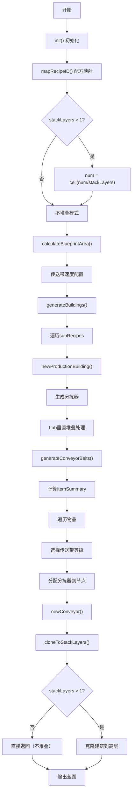

---

## 附录D：关键数据结构速查

### D.1 itemSummary 数据结构

```javascript
itemSummary = {
  [itemName]: {
    rate: Number, // 速率（items/s）
    fromBuildingNum: Number, // 来源建筑数（0=原料）
    toBuildingNum: Number, // 目标建筑数（0=终产物）
    needSprayCoater: Boolean // 是否需要喷涂机
  }
}
```

### D.2 sorters 数据结构

```javascript
sorters = {
  [itemName]: {
    output: [
      // 输出分拣器数组
      {
        index: Number, // 建筑index
        rate: Number, // 处理速率
        recipeID: Number, // 配方ID
        itemId: Number // 分拣器itemId
      }
    ],
    input: [
      // 输入分拣器数组
      // 同上结构
    ]
  }
}
```

### D.3 buildings 数据结构

```javascript
buildings = [
  {
    index: Number, // 唯一标识
    areaIndex: 0, // 区域索引
    localOffset: [{ x, y, z }], // 位置坐标
    yaw: [angle, angle], // 旋转角度
    itemId: Number, // 建筑itemId
    modelIndex: Number, // 模型索引
    outputObjIdx: Number, // 输出目标index
    inputObjIdx: Number, // 输入源index
    outputToSlot: Number, // 输出槽位
    inputFromSlot: Number, // 输入来源槽位
    recipeId: Number, // 配方ID
    filterId: Number, // 过滤ID
    parameters: Object // 参数（传送带图标等）
  }
]
```

### D.4 occupiedArea 数据结构

```javascript
occupiedArea = [
  {
    x1: Number, // 左边界
    y1: Number, // 上边界
    x2: Number, // 右边界
    y2: Number // 下边界
  }
]
```
