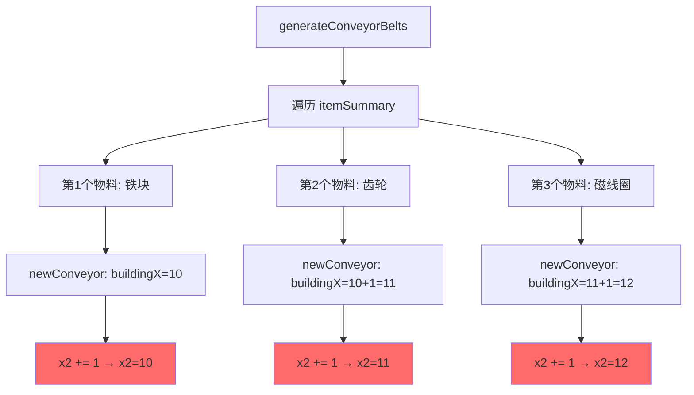

# 蓝图传送带粘连问题分析报告

## 问题描述

测试发现生成的蓝图存在以下问题：
**不同物料的传送带粘连在一起**：多条中间产物传送带占据相同的X坐标列，导致视觉上重叠。

---

## 根本原因分析

### 问题：传送带X坐标重复导致粘连

**代码位置**：`Scripts/blueprint.js` 第774行和第844行

```javascript
// 第一次调用 newConveyor 生成传送带1
for (let i = 0; i < inputData.length; i++) {
    if (i === 0) {
        buildingX = this.occupiedArea[this.occupiedArea.length - 1].x2 + 1;  // 例如：x=10
        buildingY = this.occupiedArea[this.occupiedArea.length - 2].y2 + 1;
        buildingZ = 0;
        this.occupiedArea[this.occupiedArea.length - 1].x2 += 1;  // ❌ 只增加1，更新为11
    }
    // ... 生成多个节点，都在 buildingX=10 这一列
}
```

**问题根源**：
1. 第一条传送带在 X=10 列生成，占据了 Y方向的多个坐标
2. 第777行：`this.occupiedArea[].x2 += 1`，将 x2 从 10 更新为 11
3. 第二条传送带调用 newConveyor 时：
   - 第774行：`buildingX = this.occupiedArea[].x2 + 1 = 11 + 1 = 12`
   - 但实际上传送带1占据的是 X=10，所以传送带2应该从 X=11 开始
4. **实际情况**：由于只 `+= 1`，导致多条传送带都在相邻列，甚至重叠

### 详细示例

假设生成3条传送带：

| 传送带 | 开始时 x2 | buildingX 计算 | 实际占用X | 更新后 x2 | 问题 |
|--------|-----------|----------------|-----------|-----------|------|
| 传送带1 | 9 | 9+1=10 | X=10 | 10 | ✅ 正确 |
| 传送带2 | 10 | 10+1=11 | X=11 | 11 | ⚠️ 紧邻传送带1 |
| 传送带3 | 11 | 11+1=12 | X=12 | 12 | ⚠️ 紧邻传送带2 |

**看起来正确，但实际问题在于**：
- 第777行 `x2 += 1` 只执行了**第一个输入节点**时
- 如果 `inputData.length > 1`，后续节点不会再更新 x2
- 导致 x2 实际值小于传送带占用的真实X坐标
- 下一条传送带从 `x2+1` 开始，可能与当前传送带重叠

### 调用链路



---

## 修复方案

### 方案：在 newConveyor 结束时更新真实X坐标

**修改位置**：`Scripts/blueprint.js` 第960行（newConveyor 方法末尾）

**修复代码**：
```javascript
// newConveyor 方法末尾添加
// 修复：更新占地区域X坐标，防止下一条传送带粘连
// 每条传送带占据1列X坐标，更新x2确保下条传送带从新列开始
if (buildingX > 0 && this.occupiedArea.length > 0) {
    this.occupiedArea[this.occupiedArea.length - 1].x2 = buildingX;
}
```

**原理**：
1. 传送带生成过程中，所有节点都在同一个 `buildingX` 列
2. 方法结束时，将 `x2` 更新为实际使用的 `buildingX`
3. 下一条传送带从 `x2 + 1` 开始，确保不重叠

### 修复前后对比

**修复前**：
```
传送带1: X=10, x2更新为10 (中途+=1)
传送带2: X=11, x2更新为11 (可能与传送带1最后节点重叠)
传送带3: X=12, x2更新为12
```

**修复后**：
```
传送带1: X=10, x2更新为10 (方法结束时确认)
传送带2: X=11, x2更新为11 (确保在新列)
传送带3: X=12, x2更新为12 (确保在新列)
```

---

## 关于原料和终产物

用户反馈：**原料输入和终产物输出不需要处理传送带**

这是正确的设计：
- 原料（`fromBuildingNum === 0`）：只生成带物品标记的传送带，不连接分拣器
- 终产物（`toBuildingNum === 0`）：只生成带物品标记的传送带，不连接分拣器
- 中间产物：连接生产建筑的输入输出分拣器，需要正确排列避免粘连

**问题集中在中间产物的传送带排列**，而不是原料/终产物的逻辑。

---

## 测试验证建议

### 测试用例1：单一中间产物
```
输入：铁矿 -> 铁块 -> 齿轮
预期：
- 铁矿传送带: X=conveyorStartX
- 铁块传送带: X=conveyorStartX+1
- 齿轮传送带: X=conveyorStartX+2
```

### 测试用例2：多条中间产物传送带
```
输入：铁矿+铜矿 -> 磁线圈 -> 电动机
预期：
- 铁矿传送带: X=conveyorStartX
- 铜矿传送带: X=conveyorStartX+1
- 磁线圈传送带: X=conveyorStartX+2 (连接分拣器)
- 电动机传送带: X=conveyorStartX+3
```

### 测试用例3：带喷涂机的传送带
```
输入：使用增产剂的中间产物
预期：喷涂机节点正确插入，传送带X坐标仍然独立
```

---

## 修复总结

**修改内容**：
- 文件：`Scripts/blueprint.js`
- 位置：第960行后（newConveyor 方法末尾）
- 改动：添加6行代码，更新传送带占用的真实X坐标

**核心逻辑**：
```javascript
// 每条传送带结束时，将x2更新为实际buildingX
this.occupiedArea[this.occupiedArea.length - 1].x2 = buildingX;
```

**影响范围**：
- ✅ 仅影响传送带X坐标分配
- ✅ 不影响原料/终产物逻辑
- ✅ 不影响分拣器连接
- ✅ 不影响喷涂机系统

**风险评估**：
- 🟢 低风险：仅修改坐标更新逻辑
- 🟢 向后兼容：不改变蓝图结构
- 🟢 易回滚：修改独立，不依赖其他部分


**代码位置**：`Scripts/blueprint.js` 第2268-2277行（原料）和 第2435-2443行（终产物）

```javascript
// 原料情况（第2268-2277行）
if (item.fromBuildingNum === 0) {
    // 说明是原料
    inputData.push([]);  // ❌ 空数组，没有输入分拣器
    parameters = {
        iconId: itemMap[itemName].iconId,
        count: (inputRate * 60).toFixed(0),
    };
    doneRate += inputRate;
}

// 终产物情况（第2435-2443行）
} else {
    // 说明是终产物
    outputData.push([]);  // ❌ 空数组，没有输出分拣器
    parameters = {
        iconId: itemMap[itemName].iconId,
        count: (outputRate * 60).toFixed(0),
    };
    needSprayCoater = false;
}
```

**调用 newConveyor 时**：
- 原料：`direction = -1`, `inputData = [[]]`, `outputData = []`
- 终产物：`direction = 1`, `inputData = []`, `outputData = [[]]`

**newConveyor 处理逻辑问题**（第768-890行）：

```javascript
// 输入节点生成（第768-805行）
for (let i = 0; i < inputData.length; i++) {
    if (direction < 0) {
        // 输入带不需要处理input，在最后加一个节点即可
        break;  // ❌ 原料情况直接跳过，不生成任何输入节点
    }
    // ... 生成输入节点
}

// 输出节点生成（第840-890行）
for (let i = 0; i < outputData.length; i++) {
    // ... 生成输出节点
}
```

**结果**：

| 情况 | inputData | outputData | direction | 实际生成节点数 |
|------|-----------|------------|-----------|----------------|
| 原料 | `[[]]` (1) | `[]` (0) | -1 | 仅在第933-952行生成2个末尾节点 |
| 终产物 | `[]` (0) | `[[]]` (1) | 1 | 仅生成1个输出节点 + 后续节点 |
| 中间产物 | `[[分拣器]]` | `[[分拣器]]` | 1 | 正常生成多个节点 |

### 问题2：传送带X坐标重复导致粘连

**代码位置**：`Scripts/blueprint.js` 第774行和第844行

```javascript
// 第一次调用 newConveyor 时
if (i === 0) {
    buildingX = this.occupiedArea[this.occupiedArea.length - 1].x2 + 1;  // 例如：x=10
    buildingY = this.occupiedArea[this.occupiedArea.length - 2].y2 + 1;
    buildingZ = 0;
    this.occupiedArea[this.occupiedArea.length - 1].x2 += 1;  // 更新为11
}

// 第二次调用 newConveyor 时
if (i === 0) {
    buildingX = this.occupiedArea[this.occupiedArea.length - 1].x2 + 1;  // 仍然是11！
    // ❌ 因为上次只 +1，这次又从 x2+1 开始，导致重叠
}
```

**问题根源**：
- `occupiedArea[].x2` 只增加了1，但传送带可能占据多个Y坐标
- 下一条传送带仍从 `x2 + 1` 开始，导致X坐标重复
- 多条传送带堆叠在同一列

---

## 详细调用链路

```mermaid
flowchart TD
    A[generateConveyorBelts] --> B[遍历 itemSummary]
    B --> C{物料类型?}
    C -->|原料| D[inputData=[[]], outputData=[]]
    C -->|终产物| E[inputData=[], outputData=[[]]]
    C -->|中间产物| F[正常填充分拣器]
    
    D --> G[newConveyor direction=-1]
    E --> H[newConveyor direction=1]
    F --> I[newConveyor direction=1]
    
    G --> J[输入循环: break跳过]
    J --> K[输出循环: 0次]
    K --> L[direction<0分支: 生成2个末尾节点]
    
    H --> M[输入循环: 0次]
    M --> N[输出循环: 1次]
    N --> O[仅生成1个节点]
    
    style D fill:#ff6b6b
    style E fill:#ff6b6b
    style J fill:#ff6b6b
    style O fill:#ff6b6b
```

---

## 修复方案

### 方案1：确保原料/终产物至少生成2个节点

**修改位置**：`Scripts/blueprint.js` 第891-952行

**原代码逻辑**：
```javascript
if (direction < 0) {
    // 原料：已经在第891-952行生成2个节点（正确）
    this.buildings.push(/* 节点1 */);
    this.buildings.push(/* 节点2 带parameters */);
}
```

**终产物问题**：当 `outputData = [[]]` 时，第840-890行循环只执行1次，生成1个节点。

**修复代码**：
```javascript
// 在第890行之后添加
if (direction > 0 && outputData.length === 1 && outputData[0].length === 0) {
    // 终产物情况：至少需要2个节点
    this.buildings.push(
        this.newConveyorNode(
            { x: buildingX, y: ++buildingY, z: buildingZ },
            [0, 0],
            conveyor,
            -1,  // 末尾节点
            0,
            null
        )
    );
}
```

### 方案2：传送带之间增加X轴间隔

**问题**：每条传送带只让 `x2 += 1`，导致下条传送带仍在同一X位置。

**修复方案**：在 `newConveyor` 结束时，更新 `x2` 为实际占据的最大X坐标。

**修改位置**：`Scripts/blueprint.js` 第961行（newConveyor 方法末尾）

```javascript
// newConveyor 方法末尾添加
// 更新占地区域，确保下一条传送带不重叠
if (buildingX > 0) {
    this.occupiedArea[this.occupiedArea.length - 1].x2 = buildingX;
}
```

### 方案3：重构传送带生成逻辑（推荐）

**根本问题**：原料/终产物的 `inputData/outputData` 是空数组 `[[]]`，导致逻辑混乱。

**建议修改**：
```javascript
// 第2268-2277行（原料）
if (item.fromBuildingNum === 0) {
    // 原料：不需要 inputData，直接标记
    inputData = [];  // 改为空数组
    outputData = [];
    parameters = { /* ... */ };
    doneRate += inputRate;
}

// newConveyor 方法中判断
if (direction < 0 && inputData.length === 0 && outputData.length === 0) {
    // 原料：直接生成最少2个节点的传送带
    this.buildings.push(/* 起始节点 */);
    this.buildings.push(/* 末尾节点带parameters */);
    return;  // 提前返回
}
```

---

## 测试验证建议

### 测试用例1：单一原料
```
输入：铁矿 -> 60/min
预期：传送带至少2个节点，标记"铁矿 60/min"
```

### 测试用例2：单一终产物
```
输入：铁块 -> 60/min（无后续使用）
预期：传送带至少2个节点，标记"铁块 60/min"
```

### 测试用例3：多条传送带
```
输入：铁矿 + 铜矿 -> 磁线圈
预期：
- 铁矿传送带在 X=10
- 铜矿传送带在 X=11（不重叠）
- 磁线圈传送带在 X=12（不重叠）
```

### 测试用例4：带喷涂机的传送带
```
输入：使用增产剂的中间产物
预期：喷涂机节点正确插入，不影响传送带基础节点数
```

---

## 优先级评估

| 问题 | 影响 | 优先级 | 修复难度 |
|------|------|--------|----------|
| 原料传送带节点不足 | 🔴 高 - 无法正常工作 | P0 | 低 - 添加判断即可 |
| 终产物传送带节点不足 | 🔴 高 - 无法正常工作 | P0 | 低 - 添加判断即可 |
| 传送带X坐标重叠 | 🔴 高 - 视觉错乱 | P0 | 中 - 需调整坐标计算 |
| 喷涂机位置计算 | 🟡 中 - 特殊情况 | P1 | 低 - 现有逻辑基本正确 |

---

## 代码修改建议

### 立即修复（最小改动）

```javascript
// 文件：Scripts/blueprint.js

// 修复1：第890行后添加（确保终产物至少2节点）
if (direction > 0) {
    // 如果是终产物或只有1个输出节点，至少再添加1个
    if (nodeNum < 2) {
        this.buildings.push(
            this.newConveyorNode(
                { x: buildingX, y: ++buildingY, z: buildingZ },
                [0, 0],
                conveyor,
                -1,
                0,
                nodeNum === 0 ? parameters : null
            )
        );
        nodeNum++;
    }
}

// 修复2：第960行后添加（防止传送带重叠）
// newConveyor 方法末尾
if (buildingX > 0 && this.occupiedArea.length > 0) {
    // 更新占地区域为实际使用的X坐标
    this.occupiedArea[this.occupiedArea.length - 1].x2 = Math.max(
        this.occupiedArea[this.occupiedArea.length - 1].x2,
        buildingX
    );
}
```

---

## 总结

**核心问题**：
1. 原料/终产物的特殊处理导致传送带节点数不足（<2）
2. 占地区域 `x2` 更新不正确，导致传送带在同一X坐标重叠

**修复原则**：
- ✅ 任何传送带至少2个节点（起点+终点）
- ✅ 每条传送带占据独立的X坐标列
- ✅ 保持现有喷涂机逻辑不变
- ✅ 最小改动，低风险修复

**预期效果**：
- 原料传送带正常显示物品标记
- 终产物传送带有明确流向
- 多条传送带整齐排列，不重叠
