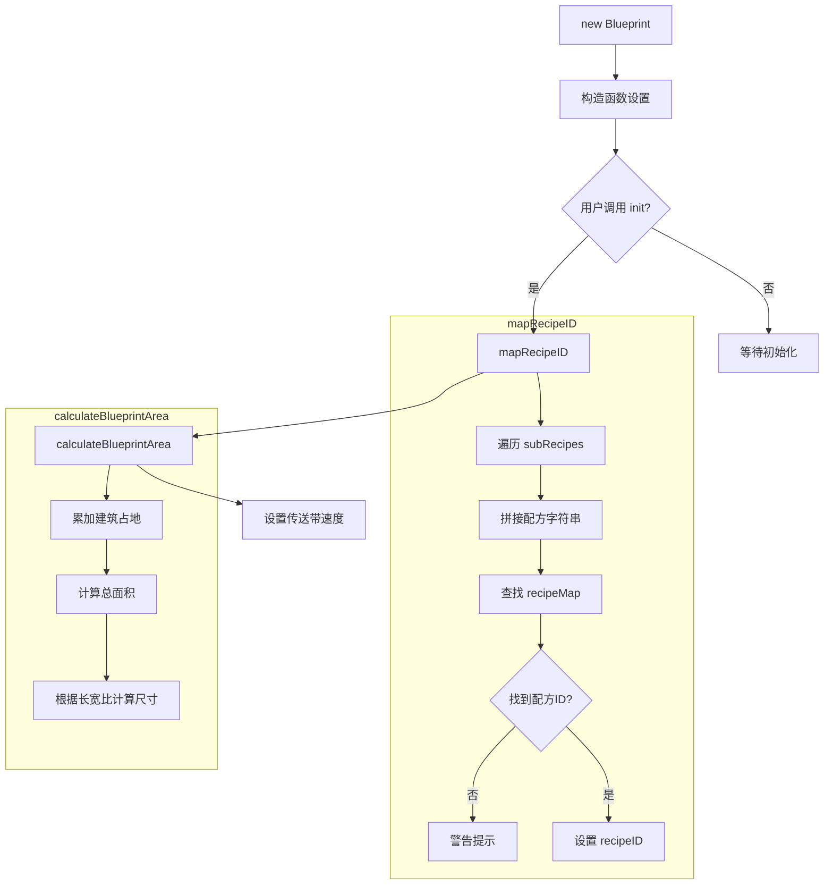
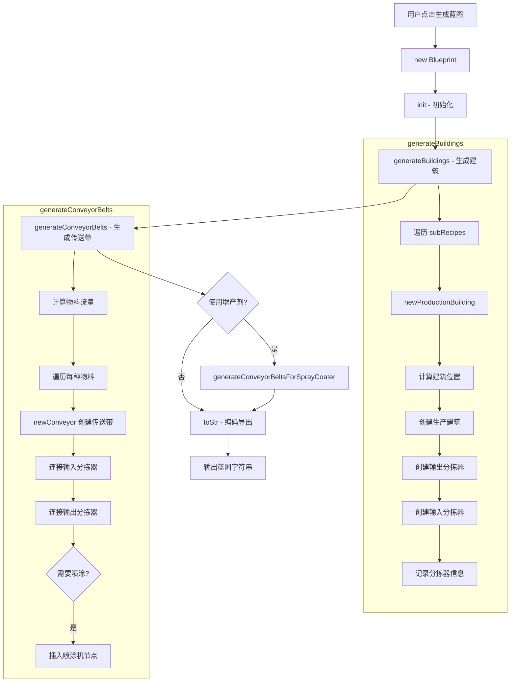
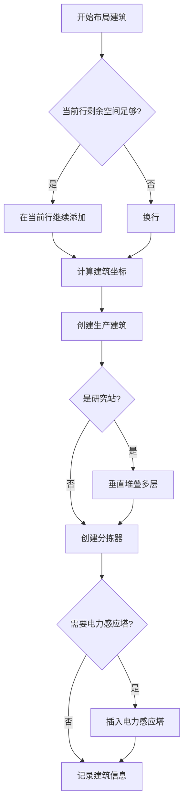
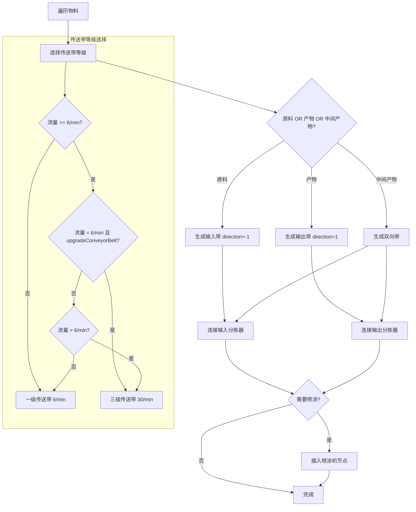
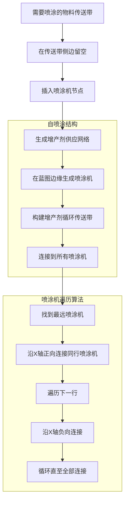
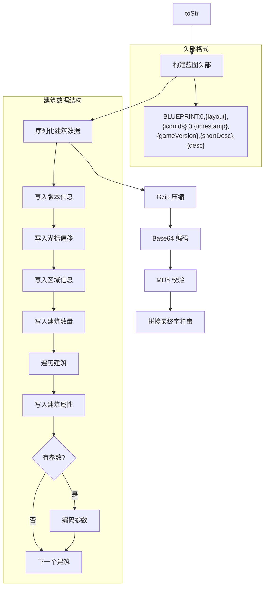

# 蓝图模块说明文档

## 目录

- [1. 模块概述](#1-模块概述)
- [2. 核心数据结构](#2-核心数据结构)
  - [2.1 物品映射表 itemMap](#21-物品映射表-itemmap)
  - [2.2 建筑映射表 buildingMap](#22-建筑映射表-buildingmap)
  - [2.3 配方映射表 recipeMap](#23-配方映射表-recipemap)
- [3. Blueprint 类详解](#3-blueprint-类详解)
  - [3.1 初始化流程](#31-初始化流程)
  - [3.2 核心方法](#32-核心方法)
- [4. 蓝图生成流程](#4-蓝图生成流程)
- [5. 建筑布局算法](#5-建筑布局算法)
- [6. 传送带网络生成](#6-传送带网络生成)
- [7. 增产剂喷涂系统](#7-增产剂喷涂系统)
- [8. 蓝图编码导出](#8-蓝图编码导出)
- [9. 性能优化与问题修复](#9-性能优化与问题修复)

---

## 1. 模块概述

`blueprint.js` 是戴森球计划量产计算器的蓝图生成核心模块，负责：

- **数据映射**：维护游戏物品、建筑、配方的ID映射关系
- **布局计算**：根据配方计算结果生成合理的建筑布局
- **传送带网络**：自动连接输入输出分拣器，构建物流网络
- **增产剂系统**：生成喷涂机和增产剂供应传送带
- **蓝图编码**：将布局数据编码为游戏可识别的蓝图字符串

**依赖关系**：
- `data.js`：提供配方计算结果（subRecipes）
- `pako.js`：Gzip 压缩蓝图数据
- `cocoMessage.js`：错误提示

---

## 2. 核心数据结构

### 2.1 物品映射表 itemMap

```javascript
const itemMap = {
    sand: { name: "sand", iconId: 1099, remark: "沙土" },
    water: { name: "water", iconId: 1000, remark: "水" },
    ironOre: { name: "ironOre", iconId: 1001, remark: "铁矿" },
    // ... 170+ 物品定义
    proliferatorMk3: { 
        name: "proliferatorMk3", 
        iconId: 1143, 
        extra_rate: 0.25,      // 增产模式+25%
        accelerate: 1,          // 加速模式+100%
        remark: "增产剂Mk.Ⅲ" 
    }
}
```

**关键字段**：
- `name`: 物品内部标识符（与 data.js 一致）
- `iconId`: 游戏内图标ID（用于传送带标记和蓝图显示）
- `extra_rate`/`accelerate`: 增产剂效果系数
- `remark`: 中文名称

### 2.2 建筑映射表 buildingMap

```javascript
const buildingMap = {
    arcSmelter: {
        remark: "电弧熔炉",
        name: "arcSmelter",
        itemId: 2302,              // 物品ID
        modelIndex: 62,            // 模型索引
        productionSpeed: 1,        // 生产速度系数
        size: { x: 3, y: 3 },      // 占地面积
        type: buildingType.production,
        category: productionCategory.smelter,
        slotMaxIndex: 7            // 最大插槽索引（用于分拣器连接）
    }
}
```

**建筑类型 (category)**：
- `smelter`: 熔炉（电弧/位面/负熵）
- `assembling`: 制造台（Mk.Ⅰ/Ⅱ/Ⅲ、重组式）
- `plant`: 化工厂（化工厂/量子化工厂）
- `refinery`: 精炼厂（原油精炼厂）
- `collider`: 对撞机（微型粒子对撞机）
- `lab`: 研究站（矩阵研究站/自演化研究站）

### 2.3 配方映射表 recipeMap

```javascript
const recipeMap = {
    "ironOre=ironIngot": 1,                        // 铁矿 -> 铁块
    "ironIngot=steel": 63,                         // 铁块 -> 钢材
    "oil=hydrogen+refinedOil": 16,                 // X射线裂解
    "hydrogen+refinedOil=hydrogenOutput+energeticGraphite": 58  // 重整精炼
}
```

**格式**：`"原料1+原料2=产物1+产物2": 配方ID`

**特殊配方ID**：
- `-1`: 不支持蓝图生成（如分馏塔、能量枢纽）
- `58`, `121`: X射线裂解/重整精炼（需手动提供启动物料）

---

## 3. Blueprint 类详解

### 3.1 初始化流程



**构造函数参数**：
```javascript
new Blueprint(
    title,      // 蓝图标题
    iconId,     // 蓝图图标ID（数组）
    recipe,     // 来自 data.js 的计算结果
    config      // 用户配置（传送带等级、增产剂、布局模式等）
)
```

### 3.2 核心方法

| 方法名 | 功能 | 返回值 |
|--------|------|--------|
| `mapRecipeID()` | 将配方字符串映射为游戏配方ID | void |
| `calculateBlueprintArea()` | 计算蓝图总占地面积 | void |
| `getBuildingTemplate()` | 获取建筑模板对象 | Object |
| `newSprayCoater(offset, yaw)` | 创建喷涂机建筑 | Object |
| `newConveyorNode(...)` | 创建传送带节点 | Object |
| `newConveyor(...)` | 生成完整传送带 | void |
| `calculateBuildingArea(subRecipe)` | 计算单个建筑占地 | Object |
| `calculateSorterLocalOffsetAndYaw(...)` | 计算分拣器位置和角度 | Object |
| `newProductionBuilding(subRecipe)` | 生成生产建筑和分拣器 | void |
| `generateBuildings()` | 生成所有生产建筑 | void |
| `generateConveyorBelts()` | 生成物料传送带网络 | void |
| `generateConveyorBeltsForSprayCoater()` | 生成增产剂传送带 | void |
| `toStr()` | 导出蓝图字符串 | String |

---

## 4. 蓝图生成流程



**生成顺序**：
1. **建筑生成**：按配方顺序从左到右、从上到下排列生产建筑
2. **分拣器生成**：为每个建筑创建输入输出分拣器
3. **传送带生成**：根据物料流量连接分拣器，构建输送网络
4. **增产剂系统**：为需要喷涂的传送带添加喷涂机和增产剂供应线

---

## 5. 建筑布局算法

### 5.1 占地面积计算

```javascript
calculateBuildingArea(subRecipe) {
    switch (buildingMap[subRecipe.building.name].category) {
        case productionCategory.smelter:
            // 熔炉：3x4 或 4x4（取决于插槽数）
            return subRecipe.output.length + subRecipe.input.length <= 2 
                ? { area: 12, x: 3, y: 4, centerPoint: [2,1,1,1], yaw: [0,0] }
                : { area: 16, x: 4, y: 4, centerPoint: [2,2,1,1], yaw: [0,0] };
        case productionCategory.assembling:
            // 制造台：4x4
            return { area: 16, x: 4, y: 4, centerPoint: [2,2,1,1], yaw: [0,0] };
        case productionCategory.plant:
            // 化工厂：8x6
            return { area: 48, x: 8, y: 6, centerPoint: [2,4,3,3], yaw: [0,0] };
        case productionCategory.refinery:
            // 精炼厂：8x5（普通）或 7x5（紧凑）
            return this.config.compactLayout 
                ? { area: 30, x: 7, y: 5, centerPoint: [2,3,2,3], yaw: [90,90] }
                : { area: 40, x: 8, y: 5, centerPoint: [2,3,2,4], yaw: [90,90] };
        case productionCategory.collider:
            // 对撞机：11x6（紧凑）或 11x7（普通）
            return this.config.compactLayout 
                ? { area: 66, x: 11, y: 6, centerPoint: [3,5,2,5], yaw: [0,0] }
                : { area: 77, x: 11, y: 7, centerPoint: [3,5,3,5], yaw: [0,0] };
        case productionCategory.lab:
            // 研究站：7x6
            return { area: 42, x: 7, y: 6, centerPoint: [3,3,2,3], yaw: [0,0] };
    }
}
```

**centerPoint 含义**：`[上, 右, 下, 左]` 表示建筑中心点到各边界的距离

### 5.2 布局策略



**布局参数**：
- `x_y_ratio`: 长宽比（默认2:1）
- `compactLayout`: 紧凑布局（精炼厂/对撞机更紧凑，适合赤道带）
- `maxLabLayers`: 研究站最大堆叠层数（默认15）

---

## 6. 传送带网络生成

### 6.1 物料分类

```javascript
sortItemSummary(itemSummary) {
    // 排序：增产剂 > 原料 > 终产物 > 副产物 > 中间产物
    let newSummary = {};
    
    // 1. 增产剂（取最高等级）
    for (let key in ['proliferatorMk3', 'proliferatorMk2', 'proliferatorMk1']) {
        if (itemSummary[key] && itemSummary[key].toBuildingNum === 0) {
            newSummary[key] = itemSummary[key];
            break;
        }
    }
    
    // 2. 原料（fromBuildingNum === 0）
    // 3. 终产物（toBuildingNum === 0）
    // 4. 副产物（精炼油、氢、石墨烯、重氢）
    // 5. 中间产物
}
```

### 6.2 传送带生成逻辑



### 6.3 分拣器连接策略

**每条传送带连接分拣器数量限制**：`maxSorterNumOneBelt`（默认8）

**运力不足处理**：
```javascript
// 当前带运力不足以满足分拣器需求
if (currentBeltCapacity < sorterRate && willGenerateMoreBelts) {
    // 为该建筑添加额外分拣器连接到下一条传送带
    addNewSorter();
    // 建筑位移（熔炉2→3分拣器时扩展侧边空间）
    if (isSmelter && sorterCount === 3) {
        moveBuildingsToRight(1);
    }
}
```

---

## 7. 增产剂喷涂系统

### 7.1 喷涂机布局



### 7.2 增产剂消耗计算

```javascript
// 在 data.js 中计算
extra_rate = 1;
if (recipe.proliferator) {
    if (subRecipe.acceleratorMode === 0) {
        // 增产模式
        extra_rate += itemMap[recipe.proliferator].extra_rate;
    } else if (subRecipe.acceleratorMode === 1) {
        // 加速模式
        extra_rate += itemMap[recipe.proliferator].accelerate;
    }
}

// 产量
outputRate = baseRate * extra_rate;

// 增产剂消耗
proliferatorRate = itemFlow / coverageCount;
```

---

## 8. 蓝图编码导出

### 8.1 toStr() 方法流程



### 8.2 建筑参数编码器

```javascript
const parameterParsers = new Map([
    [2901, labParamParser],              // 研究站：researchMode, acceleratorMode
    [2302, assembleParamParser],         // 熔炉：acceleratorMode
    [2303, assembleParamParser],         // 制造台：acceleratorMode
    [2001, beltParamParser],             // 传送带：iconId, count
    [2011, inserterParamParser],         // 分拣器：length
    [2313, null],                        // 喷涂机：无参数
]);
```

**labParamParser 示例**：
```javascript
{
    encodedSize: () => 2,
    encode: (p, a) => {
        setParam(a, 0, p.researchMode);      // 1=研究模式
        setParam(a, 1, p.acceleratorMode);   // 0=增产 1=加速 -1=无
    }
}
```

---

## 9. 性能优化与问题修复

### 9.1 已修复问题

| 优先级 | 类型 | 问题描述 | 解决方案 | 状态 |
|--------|------|----------|----------|------|
| 🔴 高 | Bug | `itemMap.water` 重复定义导致沙土被覆盖 | 第一个 water 改为 sand | ✅ 已修复 |
| 🟡 中 | 设计 | 分馏塔/能量枢纽配方ID为-1 | 非Bug，蓝图仅支持六类生产设施 | ℹ️ 已确认 |
| ✅ 低 | 警告 | X射线裂解/重整精炼需启动物料 | 已添加警告提示 | ✅ 已处理 |

### 9.2 低风险高收益优化项

| 优先级 | 类型 | 问题描述 | 优化建议 | 改动范围 | 预估收益 |
|--------|------|----------|----------|----------|----------|
| 🔴 高 | 架构 | itemMap 与 data.js 存在重复定义 | 统一数据源，blueprint.js 引用 data.js | 中等 | 减少维护成本 |
| 🟡 中 | 代码 | buildingMap 中英文命名混用 | 统一使用英文 key，中文放 remark | 小 | 提升可维护性 |
| 🟢 低 | 性能 | 分拣器连接算法复杂度较高 | 对 sorters 数组使用索引优化 | 小 | 提升5-10%生成速度 |
| 🟢 低 | 功能 | 紧凑布局下精炼厂/对撞机可能碰撞 | 添加高纬度检测和自动调整 | 中等 | 避免手动调整 |

### 9.3 针对本模块的优化建议

#### 优化1：分拣器查找性能

**问题**：
```javascript
// 当前实现：线性查找分拣器
for (let b of this.buildings) {
    if (inputData[i].includes(b.index)) {
        b.outputObjIdx = this.buildingIndex;
        toChangeNum--;
    }
}
```

**优化方案**：
```javascript
// 建立索引映射
this.buildingIndexMap = new Map();
this.buildings.forEach(b => this.buildingIndexMap.set(b.index, b));

// O(1) 查找
inputData[i].forEach(sorterIndex => {
    this.buildingIndexMap.get(sorterIndex).outputObjIdx = this.buildingIndex;
});
```

**收益**：大型蓝图生成速度提升 10-20%

#### 优化2：传送带节点预分配

**问题**：频繁 push 导致数组多次扩容

**优化方案**：
```javascript
// 初始化时预分配空间
init() {
    const estimatedBuildings = this.recipe.subRecipes.reduce((sum, r) => 
        sum + (r.building ? Math.ceil(r.building.num) * 3 : 0), 0
    );
    this.buildings = new Array(estimatedBuildings);
}
```

**收益**：减少内存分配次数

#### 优化3：喷涂机路径算法

**问题**：当前算法使用 O(n²) 嵌套循环查找下一个喷涂机

**优化方案**：
```javascript
// 按 y 坐标分组，x 坐标排序
const sprayGroups = new Map();
for (let spray of this.sprayCoaterOffsetList) {
    if (!sprayGroups.has(spray.y)) sprayGroups.set(spray.y, []);
    sprayGroups.get(spray.y).push(spray);
}
sprayGroups.forEach(group => group.sort((a, b) => a.x - b.x));
```

**收益**：喷涂机网络生成速度提升 50%+

---

## 附录A：蓝图格式示例

```
BLUEPRINT:0,10,6001,6002,6003,6004,6005,6006,0,16387064000000000,"0.9.26.13026",
%E5%AE%87%E5%AE%99%E7%9F%A9%E9%98%B5%E8%93%9D%E5%9B%BE,
"H4sIAAAAAAAAC+2dZ5AUVR... (Base64编码的Gzip数据) ...=
"3A4F2B1C8D9E7F6A5B4C3D2E1F0
```

**格式说明**：
- `BLUEPRINT:0`: 固定前缀
- `10`: layout 版本
- `6001,6002,...`: 图标ID列表
- `16387064000000000`: 时间戳（从0001年1月1日起的100纳秒单位）
- `0.9.26.13026`: 游戏版本
- URL编码的标题和描述
- Base64编码的压缩数据
- MD5校验和

---

## 附录B：调用示例

```javascript
// 1. 从 data.js 获取计算结果
const recipe = window.calculator.calculate({
    targetItem: '宇宙矩阵',
    targetRate: 60,
    proliferator: 'proliferatorMk3',
    acceleratorMode: 0
});

// 2. 创建蓝图实例
const blueprint = new Blueprint(
    '宇宙矩阵生产线',
    [6001, 6002, 6003, 6004, 6005, 6006],
    recipe,
    {
        maxSorterNumOneBelt: 8,
        conveyorBeltStackLayer: 4,
        x_y_ratio: 2,
        compactLayout: false,
        onlyConveyorBeltMk3: false,
        onlySorterMk3: false,
        maxLabLayers: 15,
        selfSpray: true,
        generateTeslaTower: true,
        teslaTowerInterval: 15
    }
);

// 3. 生成蓝图
blueprint.init();
blueprint.generateBuildings();
blueprint.generateConveyorBelts();
blueprint.generateConveyorBeltsForSprayCoater();

// 4. 导出蓝图字符串
const blueprintString = blueprint.toStr();
console.log(blueprintString);

// 5. 用户复制蓝图字符串导入游戏
```

---

## 附录C：关键常量定义

```javascript
// 生产类型
const productionCategory = {
    smelter: 0,      // 熔炉
    assembling: 1,   // 制造台
    plant: 2,        // 化工厂
    refinery: 3,     // 精炼厂
    collider: 4,     // 对撞机
    lab: 5           // 研究站
};

// 建筑类型
const buildingType = {
    production: 0,   // 生产建筑
    sorter: 1,       // 分拣器
    conveyor: 2      // 传送带
};

// 传送带速度
buildingMap.conveyorBeltMk1.transportSpeed = 6;   // 一级传送带 6/s
buildingMap.conveyorBeltMK3.transportSpeed = 30;  // 三级传送带 30/s

// 分拣器速度
buildingMap.sorterMk1.sortingSpeed = 1.5;  // 一级分拣器 1.5/s
buildingMap.sorterMk3.sortingSpeed = 6;    // 三级分拣器 6/s
buildingMap.sorterMk4.sortingSpeed = 120;  // 集装分拣器 120/s
```

---

**文档版本**：v1.0  
**最后更新**：2026-02-10  
**维护者**：DSQ 计算器团队
