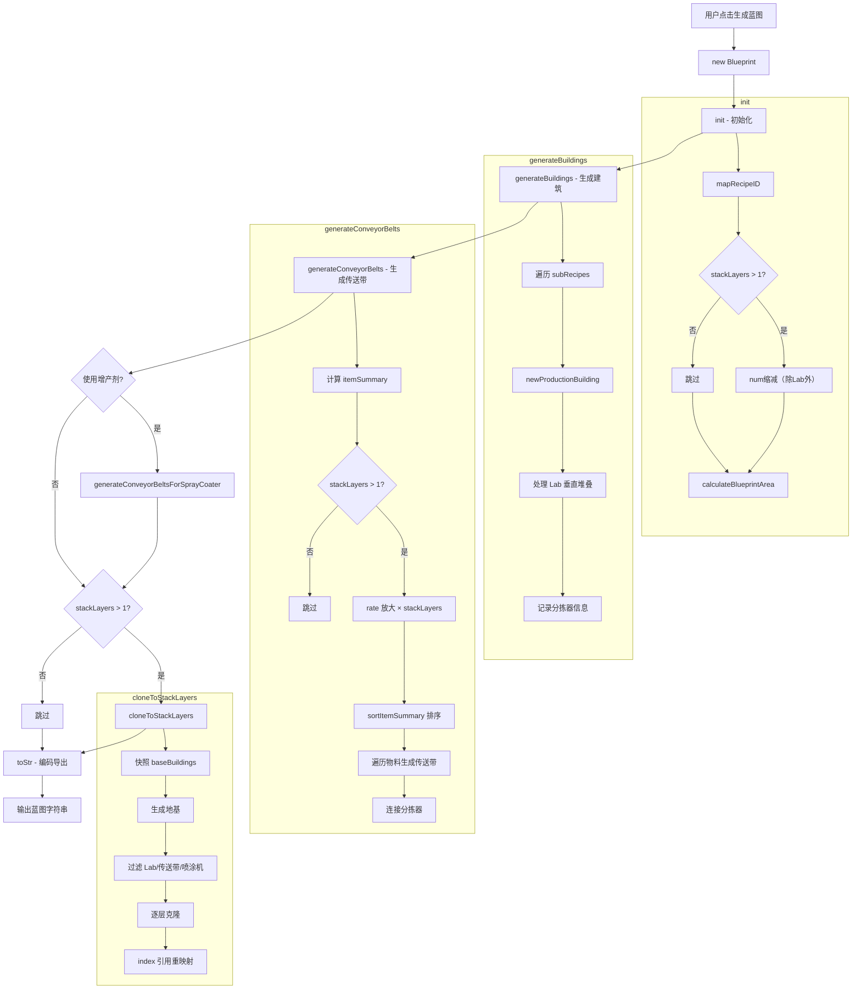
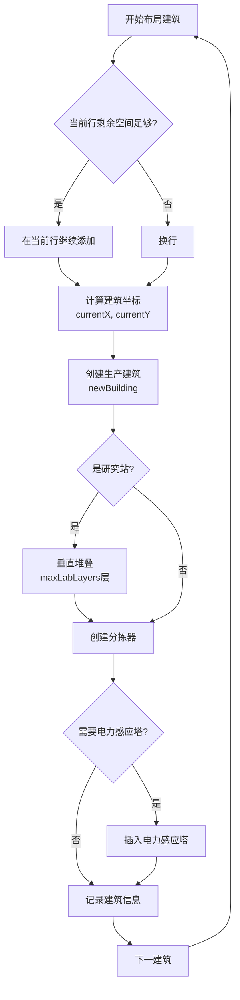
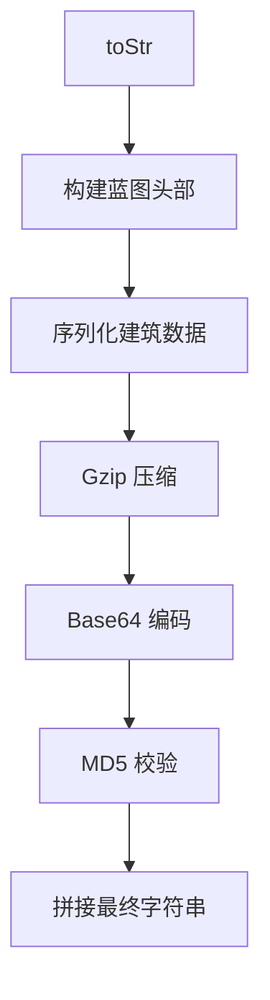

# 蓝图模块说明文档

## 目录

- [1. 模块概述](#1-模块概述)
- [2. 核心数据结构](#2-核心数据结构)
- [3. Blueprint 类详解](#3-blueprint-类详解)
- [4. 蓝图生成流程](#4-蓝图生成流程)
- [5. 建筑布局算法](#5-建筑布局算法)
- [6. 传送带网络生成](#6-传送带网络生成)
- [7. 增产剂喷涂系统](#7-增产剂喷涂系统)
- [8. 建筑堆叠模块](#8-建筑堆叠模块)
- [9. 蓝图编码导出](#9-蓝图编码导出)
- [10. 性能优化与问题修复](#10-性能优化与问题修复)

---

## 1. 模块概述

### 1.1 功能定位

`blueprint.js` 是戴森球计划量产计算器的蓝图生成核心模块，承担以下职责：

| 功能 | 说明 |
|------|------|
| **数据映射** | 维护游戏物品、建筑、配方的ID映射关系 |
| **布局计算** | 根据配方计算结果生成合理的建筑布局 |
| **传送带网络** | 自动连接输入输出分拣器，构建物流网络 |
| **增产剂系统** | 生成喷涂机和增产剂供应传送带 |
| **建筑堆叠** | 支持垂直堆叠多layer建筑，减少占地面积 |
| **蓝图编码** | 将布局数据编码为游戏可识别的蓝图字符串 |

### 1.2 依赖关系

```
data.js ──────────────→ blueprint.js ──────────────→ pak.js/cocoMessage.js
配方计算结果           蓝图生成核心               压缩/错误提示
- targetItem          - itemMap                   - Gzip压缩
- targetRate          - buildingMap               - Base64编码
- proliferator        - recipeMap                 - 错误提示
- acceleratorMode     - Blueprint类
- subRecipes
```

### 1.3 核心设计理念

```
┌─────────────────────────────────────────────────────────────────────────┐
│                           蓝图生成核心流程                              │
│                                                                         │
│  输入：配方数据（subRecipes）                                           │
│   ↓                                                                   │
│  Phase 1: init() - 初始化与预处理                                       │
│   - 配方ID映射                                                         │
│   - 堆叠层数处理（stackLayers）                                        │
│   - 蓝图面积计算                                                       │
│   ↓                                                                   │
│  Phase 2: generateBuildings() - 建筑生成                                │
│   - 生产设备布局                                                       │
│   - 分拣器关联                                                         │
│   - 研究站垂直堆叠（maxLabLayers）                                     │
│   ↓                                                                   │
│  Phase 3: generateConveyorBelts() - 传送带网络                          │
│   - 物料流量计算                                                       │
│   - 传送带生成                                                         │
│   - 分拣器连接                                                         │
│   ↓                                                                   │
│  Phase 4: generateConveyorBeltsForSprayCoater() - 增产剂系统            │
│   - 喷涂机布局                                                         │
│   - 增产剂供应网络                                                     │
│   ↓                                                                   │
│  Phase 5: cloneToStackLayers() - 建筑堆叠                               │
│   - 克隆设备到高层                                                     │
│   - Index引用重映射                                                   │
│   - 共享传送带网络                                                     │
│   ↓                                                                   │
│  输出：蓝图字符串（编码后）                                             │
└─────────────────────────────────────────────────────────────────────────┘
```

---

## 2. 核心数据结构

### 2.1 物品映射表 itemMap

```javascript
const itemMap = {
    // 基础资源
    sand: { name: "sand", iconId: 1099, remark: "沙土" },
    water: { name: "water", iconId: 1000, remark: "水" },
    ironOre: { name: "ironOre", iconId: 1001, remark: "铁矿" },
    copperOre: { name: "copperOre", iconId: 1002, remark: "铜矿" },
    siliconOre: { name: "siliconOre", iconId: 1003, remark: "硅石" },
    titaniumOre: { name: "titaniumOre", iconId: 1004, remark: "钛石" },
    coal: { name: "coal", iconId: 1006, remark: "煤矿" },
    
    // 中间产物
    ironIngot: { name: "ironIngot", iconId: 1101, remark: "铁块" },
    copperIngot: { name: "copperIngot", iconId: 1104, remark: "铜块" },
    magnet: { name: "magnet", iconId: 1102, remark: "磁铁" },
    steel: { name: "steel", iconId: 1103, remark: "钢材" },
    
    // 增产剂
    proliferatorMk1: { name: "proliferatorMk1", iconId: 1141, extra_rate: 0.125, accelerate: 0.25, remark: "增产剂Mk.Ⅰ" },
    proliferatorMk2: { name: "proliferatorMk2", iconId: 1142, extra_rate: 0.2, accelerate: 0.5, remark: "增产剂Mk.Ⅱ" },
    proliferatorMk3: { name: "proliferatorMk3", iconId: 1143, extra_rate: 0.25, accelerate: 1, remark: "增产剂Mk.Ⅲ" },
    
    // 高级产物
    circuitBoard: { name: "circuitBoard", iconId: 1301, remark: "电路板" },
    processor: { name: "processor", iconId: 1303, remark: "处理器" },
    quantumChip: { name: "quantumChip", iconId: 1305, remark: "量子芯片" },
    
    // 建筑设施
    conveyorBeltMk1: { name: "conveyorBeltMk1", iconId: 2001, remark: "传送带" },
    conveyorBeltMK3: { name: "conveyorBeltMK3", iconId: 2003, remark: "极速传送带" },
    sorterMk1: { name: "sorterMk1", iconId: 2011, remark: "分拣器" },
    sorterMk4: { name: "sorterMk4", iconId: 2014, remark: "集装分拣器" },
    
    // 生产设施
    assemblingMachineMk1: { name: "assemblingMachineMk1", iconId: 2303, remark: "制作台Mk.Ⅰ" },
    arcSmelter: { name: "arcSmelter", iconId: 2302, remark: "电弧熔炉" },
    lab: { name: "lab", iconId: 2901, remark: "矩阵研究站" },
}
```

**字段说明**：

| 字段 | 类型 | 说明 |
|------|------|------|
| `name` | String | 物品内部标识符（与 data.js 一致） |
| `iconId` | Number | 游戏内图标ID（用于传送带标记和蓝图显示） |
| `extra_rate` | Number | 增产模式下额外产出比例（如0.25表示+25%） |
| `accelerate` | Number | 加速模式下生产速度加成（如1表示+100%） |
| `remark` | String | 中文名称（仅用于显示） |

### 2.2 建筑映射表 buildingMap

```javascript
const buildingMap = {
    // 熔炉类
    arcSmelter: {
        remark: "电弧熔炉",
        name: "arcSmelter",
        itemId: 2302,
        modelIndex: 62,
        productionSpeed: 1,
        size: { x: 3, y: 3 },
        type: buildingType.production,
        category: productionCategory.smelter,
        slotMaxIndex: 7,
    },
    planeSmelter: {
        remark: "位面熔炉",
        name: "planeSmelter",
        itemId: 2315,
        modelIndex: 194,
        productionSpeed: 2,
        size: { x: 3, y: 3 },
        type: buildingType.production,
        category: productionCategory.smelter,
        slotMaxIndex: 7,
    },
    
    // 制造台类
    assemblingMachineMk1: {
        remark: "制作台Mk.I",
        name: "assemblingMachineMk1",
        itemId: 2303,
        modelIndex: 65,
        productionSpeed: 0.75,
        size: { x: 3, y: 3 },
        type: buildingType.production,
        category: productionCategory.assembling,
        slotMaxIndex: 8,
    },
    assemblingMachineMk3: {
        remark: "制作台Mk.III",
        name: "assemblingMachineMk3",
        itemId: 2305,
        modelIndex: 67,
        productionSpeed: 1.5,
        size: { x: 3, y: 3 },
        type: buildingType.production,
        category: productionCategory.assembling,
        slotMaxIndex: 8,
    },
    
    // 研究站类
    lab: {
        remark: "矩阵研究站",
        name: "lab",
        itemId: 2901,
        modelIndex: 70,
        productionSpeed: 1,
        type: buildingType.production,
        category: productionCategory.lab,
        height: 3,
        slotMaxIndex: 11,
    },
    自演化研究站: {
        remark: "自演化研究站",
        name: "自演化研究站",
        itemId: 2902,
        modelIndex: 455,
        productionSpeed: 3,
        type: buildingType.production,
        category: productionCategory.lab,
        height: 3,
        slotMaxIndex: 11,
    },
    
    // 分拣器类
    sorterMk1: {
        name: "sorterMk1",
        itemId: 2011,
        modelIndex: 41,
        sortingSpeed: 1.5,
        size: { x: 1, y: 1 },
        type: buildingType.sorter,
        remark: "分拣器MK.I",
    },
    sorterMk4: {
        name: "sorterMk4",
        itemId: 2014,
        modelIndex: 483,
        sortingSpeed: 120,
        size: { x: 1, y: 1 },
        type: buildingType.sorter,
        remark: "集装分拣器",
    },
    
    // 传送带类
    conveyorBeltMk1: {
        name: "conveyorBeltMk1",
        itemId: 2001,
        modelIndex: 35,
        transportSpeed: 6,
        size: { x: 1, y: 1 },
        type: buildingType.conveyor,
        remark: "传送带MK.I",
    },
    conveyorBeltMK3: {
        name: "conveyorBeltMK3",
        itemId: 2003,
        modelIndex: 37,
        transportSpeed: 30,
        size: { x: 1, y: 1 },
        type: buildingType.conveyor,
        remark: "极速传送带MK.Ⅲ",
    },
    
    // 辅助设施
    sprayCoater: {
        remark: "喷涂机",
        name: "sprayCoater",
        itemId: 2313,
        modelIndex: 120,
    },
    teslaTower: {
        remark: "电力感应塔",
        name: "teslaTower",
        itemId: 2201,
        modelIndex: 44,
    },
}
```

**建筑类型 (category)**：

| 类型 | 值 | 包含建筑 |
|------|------|----------|
| `smelter` | 0 | 电弧熔炉、位面熔炉、负熵熔炉 |
| `assembling` | 1 | 制作台Mk.Ⅰ/Ⅱ/Ⅲ、重组式制造台 |
| `plant` | 2 | 化工厂、量子化工厂 |
| `refinery` | 3 | 原油精炼厂 |
| `collider` | 4 | 微型粒子对撞机 |
| `lab` | 5 | 矩阵研究站、自演化研究站 |

**建筑属性说明**：

| 属性 | 类型 | 说明 |
|------|------|------|
| `itemId` | Number | 游戏内物品ID |
| `modelIndex` | Number | 3D模型索引 |
| `productionSpeed` | Number | 生产速度系数（1=基准） |
| `sortingSpeed` | Number | 分拣速度（单位/秒） |
| `transportSpeed` | Number | 传送带运力（单位/秒） |
| `size` | Object | 占地面积 {x, y} |
| `height` | Number | 垂直堆叠高度（仅Lab） |
| `slotMaxIndex` | Number | 最大插槽索引 |

### 2.3 生产类型常量

```javascript
const productionCategory = {
    smelter: 0,      // 熔炉
    assembling: 1,    // 制造台
    plant: 2,        // 化工厂
    refinery: 3,     // 精炼厂
    collider: 4,     // 对撞机
    lab: 5,          // 研究站
};

const buildingType = {
    production: 0,   // 生产建筑
    sorter: 1,       // 分拣器
    conveyor: 2,     // 传送带
};
```

---

## 3. Blueprint 类详解

### 3.1 构造函数

```javascript
class Blueprint {
    constructor(title, iconId, recipe, config) {
        this.recipe = recipe;                    // 配方计算结果
        this.config = config;                    // 用户配置
        
        // 内部状态
        this.buildingIndex = -1;                // 建筑索引计数器
        this.blueprintSize = { x: 0, y: 0 };   // 蓝图尺寸
        this.occupiedArea = [];                 // 占用区域记录
        this.buildings = [];                    // 建筑列表
        this.buildingArray = [];                // 建筑二维数组（用于布局）
        this.sorters = {};                      // 分拣器信息
        this.sprayCoaterOffsetList = [];        // 喷涂机位置列表
        this.itemSummary = {};                  // 物料统计
        this.conveyorStartOffsetX = 0;          // 传送带起始X坐标
        
        // 配置参数
        // maxSorterNumOneBelt: 8      // 单传送带最大分拣器数
        // conveyorBeltStackLayer: 4   // 传送带物品堆叠层数
        // x_y_ratio: 2                // 长宽比
        // compactLayout: false       // 紧凑布局
        // onlyConveyorBeltMk3: false // 仅使用三级传送带
        // onlySorterMk3: false      // 仅使用三级分拣器
        // maxLabLayers: 15           // 研究站最大堆叠层数
        // selfSpray: true           // 自喷涂
        // stackLayers: 1            // 建筑堆叠层数
        
        // 蓝图模板
        this.blueprintTemplate = {
            header: { /* ... */ },
            areas: [{ buildings: [] }],
        };
    }
}
```

### 3.2 核心方法概览

| 方法 | 功能 | 返回值 |
|------|------|--------|
| `init()` | 初始化（配方映射、num缩减、面积计算） | void |
| `mapRecipeID()` | 配方字符串映射为游戏配方ID | void |
| `calculateBlueprintArea()` | 计算蓝图总占地面积 | void |
| `getBuildingTemplate()` | 获取建筑模板对象 | Object |
| `newProductionBuilding(subRecipe)` | 生成生产建筑和分拣器 | void |
| `generateBuildings()` | 生成所有生产建筑 | void |
| `generateConveyorBelts()` | 生成物料传送带网络 | void |
| `generateConveyorBeltsForSprayCoater()` | 生成增产剂传送带 | void |
| `cloneToStackLayers()` | 克隆建筑到高层（堆叠功能） | void |
| `toStr()` | 导出蓝图字符串 | String |

### 3.3 初始化流程

```
init() 执行流程：

┌─────────────────────────────────────────────────────────────────────────┐
│ init() - 完整初始化流程                                                 │
│                                                                         │
│ 1. mapRecipeID()                                                       │
│    - 遍历 subRecipes                                                   │
│    - 拼接配方字符串（如 "ironOre=ironIngot"）                            │
│    - 查找 recipeMap 获取配方ID                                         │
│    - 设置 subRecipe.recipeId                                           │
│                                                                         │
│ 2. [堆叠模式处理] stackLayers > 1                                       │
│    - 非 Lab 设备：num = ceil(num / stackLayers)                        │
│    - Lab：num 不缩减（保持完整产能）                                    │
│                                                                         │
│ 3. calculateBlueprintArea()                                           │
│    - 累加所有建筑占地                                                   │
│    - 根据长宽比计算尺寸                                                 │
│                                                                         │
│ 4. 传送带速度配置                                                       │
│    - 根据 onlyConveyorBeltMk3Downgrade 设置速度                         │
└─────────────────────────────────────────────────────────────────────────┘
```

### 3.4 Blueprint 配置项

```javascript
// 默认配置
const defaultConfig = {
    // 核心参数
    stackLayers: 1,              // 建筑堆叠层数（1=不堆叠）
    maxLabLayers: 15,            // 研究站最大垂直堆叠层数
    
    // 传送带设置
    maxSorterNumOneBelt: 8,     // 单传送带最大分拣器数量
    conveyorBeltStackLayer: 4,   // 传送带物品堆叠层数
    onlyConveyorBeltMk3: false,  // 仅使用三级传送带
    onlyConveyorBeltMk3Downgrade: false,  // 三级传送带降级
    
    // 布局设置
    x_y_ratio: 2,               // 蓝图长宽比
    compactLayout: false,       // 紧凑布局（适合赤道带）
    
    // 分拣器设置
    onlySorterMk3: false,       // 仅使用三级分拣器
    useSorterMk4: false,       // 使用集装分拣器
    
    // 增产剂设置
    selfSpray: true,            // 自喷涂模式
    
    // 电力设置
    generateTeslaTower: true,   // 生成电力感应塔
    teslaTowerInterval: 15,    // 电塔间隔
};
```

---

## 4. 蓝图生成流程

### 4.1 完整调用链



### 4.2 生成阶段详解

```
阶段 1：init()
  输入：recipe, config
  处理：
    - 配方ID映射
    - 堆叠层num缩减（stackLayers > 1时）
    - 蓝图面积计算
  输出：准备好的初始化状态

阶段 2：generateBuildings()
  输入：缩减后的 subRecipes
  处理：
    - 按顺序布局生产设备
    - 关联输入输出分拣器
    - 处理Lab垂直堆叠（maxLabLayers）
    - 记录分拣器信息
  输出：this.buildings（z=0层所有建筑）

阶段 3：generateConveyorBelts()
  输入：this.buildings, this.sorters
  处理：
    - 计算物料流量统计
    - 堆叠模式：rate放大×stackLayers
    - 生成传送带网络
    - 连接分拣器到传送带
  输出：完整传送带网络

阶段 4：generateConveyorBeltsForSprayCoater()
  输入：this.sprayCoaterOffsetList
  处理：
    - 布局喷涂机
    - 生成增产剂供应传送带
    - 连接所有喷涂机
  输出：增产剂系统

阶段 5：cloneToStackLayers()
  输入：this.buildings（z=0）
  处理（仅stackLayers > 1时）：
    - 快照z=0建筑
    - 生成地基
    - 过滤不可克隆建筑
    - 逐层克隆
    - 重映射index引用
  输出：this.buildings（含所有层）

阶段 6：toStr()
  输入：this.buildings
  处理：
    - 序列化建筑数据
    - Gzip压缩
    - Base64编码
    - MD5校验
  输出：蓝图字符串
```

---

## 5. 建筑布局算法

### 5.1 占地面积计算

```javascript
calculateBuildingArea(subRecipe) {
    const building = subRecipe.building;
    
    switch (buildingMap[building.name].category) {
        case productionCategory.smelter:
            // 熔炉：2插槽=3×4，4插槽=4×4
            return subRecipe.output.length + subRecipe.input.length <= 2 
                ? { area: 12, x: 3, y: 4, centerPoint: [2,1,1,1], yaw: [0,0] }
                : { area: 16, x: 4, y: 4, centerPoint: [2,2,1,1], yaw: [0,0] };
                
        case productionCategory.assembling:
            // 制造台：4×4
            return { area: 16, x: 4, y: 4, centerPoint: [2,2,1,1], yaw: [0,0] };
            
        case productionCategory.plant:
            // 化工厂：8×6
            return { area: 48, x: 8, y: 6, centerPoint: [2,4,3,3], yaw: [0,0] };
            
        case productionCategory.refinery:
            // 精炼厂：普通8×5，紧凑7×5
            return this.config.compactLayout 
                ? { area: 30, x: 7, y: 5, centerPoint: [2,3,2,3], yaw: [90,90] }
                : { area: 40, x: 8, y: 5, centerPoint: [2,3,2,4], yaw: [90,90] };
                
        case productionCategory.collider:
            // 对撞机：普通11×7，紧凑11×6
            return this.config.compactLayout 
                ? { area: 66, x: 11, y: 6, centerPoint: [3,5,2,5], yaw: [0,0] }
                : { area: 77, x: 11, y: 7, centerPoint: [3,5,3,5], yaw: [0,0] };
                
        case productionCategory.lab:
            // 研究站：7×6
            return { area: 42, x: 7, y: 6, centerPoint: [3,3,2,3], yaw: [0,0] };
    }
}
```

**centerPoint 含义**：`[上, 右, 下, 左]` 表示建筑中心点到各边界的距离

```
        centerPoint = [上, 右, 下, 左]
        
             上(1)
              ↑
        ┌─────────────┐
   左(3)│             │右(2)
        │      ●      │  中心点
        │             │
        └─────────────┘
              ↓
             下(1)

        建筑尺寸：x=7, y=6
        中心点：[3, 3, 2, 3]
        - 上距离：3
        - 右距离：3
        - 下距离：2
        - 左距离：3
```

### 5.2 布局策略



### 5.3 研究站垂直堆叠

```
研究站垂直堆叠（maxLabLayers）：

           z轴
            ↑
       42   │ [Lab 15] ──→ z=42
            │
       39   │ [Lab 14] ──→ z=39
            │
       ...  │    ...
            │
        6   │ [Lab 3] ──→ z=6
            │
        3   │ [Lab 2] ──→ z=3
            │
        0   │ [Lab 1] ──→ z=0
            │
       -10  │ [地基]
            └──────────────────────────────→ x轴

特点：
- z间距 = Lab.height = 3
- 所有Lab共享相同x-y坐标
- inputObjIdx/outputObjIdx 独立设置
```

---

## 6. 传送带网络生成

### 6.1 物料流量统计

```javascript
generateConveyorBelts() {
    let itemSummary = {};
    
    // 统计每种物料的产出和消耗
    for (let subRecipe of this.recipe.subRecipes) {
        // 计算增产系数
        let extra_rate = 1;
        if (this.recipe.proliferator) {
            if (subRecipe.acceleratorMode === 0) {
                extra_rate += itemMap[this.recipe.proliferator].extra_rate;
            } else if (subRecipe.acceleratorMode === 1) {
                extra_rate += itemMap[this.recipe.proliferator].accelerate;
            }
        }
        
        // 处理产出
        for (let outputItem of subRecipe.output) {
            let outputRate = 0;
            let fromBuildingNum = subRecipe.building.num;
            
            if (subRecipe.input === null) {
                // 原料（无输入）
                outputRate = outputItem.rate;
            } else {
                // 产品
                outputRate = outputItem.rate * 
                    buildingMap[subRecipe.building.name].productionSpeed * 
                    subRecipe.building.num * extra_rate;
            }
            
            // 更新统计
            if (itemSummary[outputItem.name]) {
                itemSummary[outputItem.name].rate += outputRate;
                itemSummary[outputItem.name].fromBuildingNum += fromBuildingNum;
            } else {
                itemSummary[outputItem.name] = {
                    rate: outputRate,
                    fromBuildingNum: fromBuildingNum,
                    toBuildingNum: 0,
                };
            }
        }
        
        // 处理消耗
        if (subRecipe.input !== null) {
            for (let inputItem of subRecipe.input) {
                if (itemSummary[inputItem.name]) {
                    itemSummary[inputItem.name].toBuildingNum += subRecipe.building.num;
                } else {
                    itemSummary[inputItem.name] = {
                        rate: 0,
                        fromBuildingNum: 0,
                        toBuildingNum: subRecipe.building.num,
                    };
                }
            }
        }
    }
}
```

### 6.2 堆叠模式下的rate放大

```javascript
// 堆叠模式：放大rate × stackLayers
// 目的：传送带网络按完整产能设计
const stackLayers = this.config.stackLayers || 1;
if (stackLayers > 1) {
    for (let key in itemSummary) {
        itemSummary[key].rate *= stackLayers;
        if (itemSummary[key].inputRate !== undefined) {
            itemSummary[key].inputRate *= stackLayers;
        }
    }
    
    // 分拣器rate也放大
    for (let itemName in this.sorters) {
        if (this.sorters[itemName].output) {
            for (let s of this.sorters[itemName].output) {
                s.rate *= stackLayers;
            }
        }
        if (this.sorters[itemName].input) {
            for (let s of this.sorters[itemName].input) {
                s.rate *= stackLayers;
            }
        }
    }
}

// 分拣器分配策略
// 堆叠模式下，每个传送带节点分配 floor(max/stackLayers) 个分拣器
// 克隆后刚好填满，不超限
const sortersPerNode = stackLayers > 1
    ? Math.max(1, Math.floor(this.config.maxSorterNumOneBelt / stackLayers))
    : this.config.maxSorterNumOneBelt;

// 示例：
//   maxSorterNumOneBelt = 8, stackLayers = 4
//   sortersPerNode = floor(8/4) = 2
//   每个节点2个分拣器 → 克隆后 2×4 = 8 ≤ 8（不超限）
```

### 6.3 传送带等级选择

```javascript
// 传送带等级选择逻辑
for (let item in itemSummary) {
    const itemName = item;
    item = itemSummary[item];
    
    let conveyorBelt = buildingMap.conveyorBeltMk1;  // 默认一级
    
    if (this.config.onlyConveyorBeltMk3) {
        // 强制使用三级
        conveyorBelt = buildingMap.conveyorBeltMK3;
    } else if (item.rate >= 6 && !this.config.onlyConveyorBeltMk3Downgrade) {
        // 流量≥6时升级到三级（除非降级配置）
        conveyorBelt = buildingMap.conveyorBeltMK3;
    }
    
    // 计算需要的传送带节点数
    const beltNodeCount = Math.ceil(item.rate / conveyorBelt.transportSpeed);
}
```

### 6.4 物料排序策略

```javascript
sortItemSummary(itemSummary) {
    // 优先级排序：
    // 1. 增产剂（取最高等级）
    // 2. 原料（fromBuildingNum === 0）
    // 3. 终产物（toBuildingNum === 0）
    // 4. 副产物（精炼油、氢、石墨烯、重氢）
    // 5. 中间产物
    
    let newSummary = {};
    let proliferator = ['proliferatorMk3', 'proliferatorMk2', 'proliferatorMk1'];
    let outItem = ['refinedOil', 'hydrogen', 'graphene', 'deuterium'];
    
    // 1. 增产剂（取最高等级）
    for (let key of proliferator) {
        if (itemSummary[key] && itemSummary[key].toBuildingNum === 0) {
            newSummary[key] = itemSummary[key];
            break;
        }
    }
    
    // 2. 原料
    for (let key in itemSummary) {
        if (itemSummary[key].fromBuildingNum === 0) {
            newSummary[key] = itemSummary[key];
        }
    }
    
    // 3. 终产物
    for (let key in itemSummary) {
        if (itemSummary[key].toBuildingNum === 0) {
            newSummary[key] = itemSummary[key];
        }
    }
    
    // 4. 副产物
    for (let key of outItem) {
        if (itemSummary[key] && 
            itemSummary[key].fromBuildingNum - itemSummary[key].toBuildingNum > 0) {
            newSummary[key] = itemSummary[key];
        }
    }
    
    // 5. 中间产物
    for (let key in itemSummary) {
        if (itemSummary[key].toBuildingNum !== 0 && 
            itemSummary[key].fromBuildingNum !== 0) {
            newSummary[key] = itemSummary[key];
        }
    }
    
    return newSummary;
}
```

---

## 7. 增产剂喷涂系统

### 7.1 自喷涂结构

```
自喷涂模式布局：

    ┌─────────────────────────────────────────────────────────────┐
    │                                                             │
    │   [喷涂机1] [喷涂机2] [喷涂机3] ... [喷涂机N]              │
    │       │         │         │              │                  │
    │       └─────────┴─────────┴──────────────┘                  │
    │                       │                                      │
    │              [增产剂传送带循环]                              │
    │                       │                                      │
    │              [增产剂储液罐/供应点]                           │
    │                                                             │
    └─────────────────────────────────────────────────────────────┘

特点：
- 喷涂机分布在物料传送带侧边
- 所有喷涂机串联成循环
- 增产剂从边缘供应点输入
```

### 7.2 喷涂机连接算法

```javascript
// 喷涂机连接策略
// 1. 按Y坐标分组
// 2. 每组按X坐标排序
// 3. 同行正向连接，反向连接下一行

for (let spray of this.sprayCoaterOffsetList) {
    // 按Y分组
    if (!sprayGroups.has(spray.y)) {
        sprayGroups.set(spray.y, []);
    }
    sprayGroups.get(spray.y).push(spray);
}

// 连接逻辑
sprayGroups.forEach((group, y) => {
    // X排序
    group.sort((a, b) => a.x - b.x);
    
    // 同行正向连接
    for (let i = 0; i < group.length - 1; i++) {
        connectSprayConveyor(group[i], group[i + 1], 1);
    }
    
    // 最后一行反向连接
    if (lastGroup) {
        connectSprayConveyor(group[group.length - 1], lastGroup[lastGroup.length - 1], -1);
    }
    
    lastGroup = group;
});
```

---

## 8. 建筑堆叠模块

### 8.1 功能概述

建筑堆叠将平铺的产线蓝图垂直复制到多个 z 层（z=0, 10, 20, 30），减少占地面积。

| 参数 | 说明 |
|------|------|
| `stackLayers` | 堆叠层数（1-4，默认1=不堆叠） |
| z间距 | 10（游戏内建筑堆叠标准间距） |

### 8.2 堆叠流程

```
┌─────────────────────────────────────────────────────────────────────────┐
│                        堆叠核心流程                                    │
│                                                                         │
│  输入：stackLayers=4，原始设备数=60                                    │
│                                                                         │
│  Phase 1: init()                                                        │
│    - 非Lab设备：num = ceil(60/4) = 15                                  │
│    - Lab：num 不缩减（保持完整）                                        │
│                                                                         │
│  Phase 2: generateBuildings()                                           │
│    - z=0层生成：15设备 + 15分拣器 + 完整Lab                           │
│                                                                         │
│  Phase 3: generateConveyorBelts()                                       │
│    - rate 放大 ×4（按完整60产能设计）                                  │
│    - 分拣器分配：floor(8/4) = 2个/节点                                 │
│                                                                         │
│  Phase 4: cloneToStackLayers()                                         │
│    - 过滤：排除Lab、传送带、喷涂机                                      │
│    - 克隆：15设备 ×3份 → z=10,20,30                                    │
│    - 克隆：15分拣器 ×3份 → z=10,20,30                                  │
│    - index重映射：                                                      │
│      · 克隆设备 → 同层分拣器                                            │
│      · 克隆分拣器 → z=0传送带                                          │
│                                                                         │
│  输出：                                                                  │
│    - 设备总数：15×4 = 60                                               │
│    - Lab总数：4（仅z=0）                                               │
│    - 产能：60min（4层并行）                                            │
└─────────────────────────────────────────────────────────────────────────┘
```

### 8.3 堆叠后蓝图结构

```
堆叠后完整结构（stackLayers=4）：

┌─────────────────────────────────────────────────────────────────────────┐
│ z=30 层（第4层，克隆）                                                  │
│   [设备1-15克隆] ──→ [分拣器1-15克隆] ──→ [传送带网络] (z=0)        │
│   outputObjIdx → 同层分拣器    outputObjIdx → z=0传送带               │
│                                                                         │
│ z=20 层（第3层，克隆）                                                  │
│   [设备1-15克隆] ──→ [分拣器1-15克隆] ──→ [传送带网络] (z=0)        │
│   outputObjIdx → 同层分拣器    outputObjIdx → z=0传送带               │
│                                                                         │
│ z=10 层（第2层，克隆）                                                  │
│   [设备1-15克隆] ──→ [分拣器1-15克隆] ──→ [传送带网络] (z=0)        │
│   outputObjIdx → 同层分拣器    outputObjIdx → z=0传送带               │
│                                                                         │
│ z=0 层（第1层，原始）                                                   │
│   [设备1-15] ──→ [分拣器1-15] ──→ [传送带网络]                        │
│   [Lab1-4]（完整数量）──→ [Lab分拣器] ──→ [Lab传送带]                 │
│                                                                         │
│ z=-10 层（地基）                                                        │
│   [Foundation]                                                          │
└─────────────────────────────────────────────────────────────────────────┘
```

### 8.4 Index引用重映射

```javascript
cloneToStackLayers() {
    // 收集可克隆建筑（排除Lab、传送带、喷涂机）
    const cloneableBuildings = baseBuildings.filter((b) => {
        if (labItemIds.has(b.itemId)) return false;
        if (labIndices.has(b.inputObjIdx) || labIndices.has(b.outputObjIdx)) return false;
        if (beltItemIds.has(b.itemId)) return false;
        if (b.itemId === sprayCoaterItemId) return false;
        return true;
    });
    
    // 逐层克隆
    for (let layer = 1; layer < stackLayers; layer++) {
        const zOffset = layer * 10;
        
        // 创建 indexMap
        const indexMap = new Map();
        let nextIndex = this.buildingIndex + 1;
        for (const base of cloneableBuildings) {
            indexMap.set(base.index, nextIndex);
            nextIndex++;
        }
        
        // 克隆并重映射
        for (const base of cloneableBuildings) {
            const clone = { ...base };
            clone.localOffset.z += zOffset;
            
            // 核心：outputObjIdx 重映射逻辑
            if (indexMap.has(base.outputObjIdx)) {
                // 指向同层克隆分拣器
                clone.outputObjIdx = indexMap.get(base.outputObjIdx);
            } else {
                // 指向 z=0 传送带（保持原值）
                clone.outputObjIdx = base.outputObjIdx;
            }
            
            if (indexMap.has(base.inputObjIdx)) {
                clone.inputObjIdx = indexMap.get(base.inputObjIdx);
            } else {
                clone.inputObjIdx = base.inputObjIdx;
            }
            
            this.buildings.push(clone);
        }
    }
}
```

### 8.5 各建筑类型处理规则

| 建筑类型 | itemId | init()缩减 | 克隆到高层 | z>0 inputObjIdx |
|----------|--------|-----------|-----------|-----------------|
| 制造台/熔炉/化工厂/精炼厂/对撞机 | 2302-2317 | ✅ num÷N | ✅ | 地基 |
| **研究站（Lab）** | 2901/2902 | **❌ 不缩减** | **❌ 不克隆** | — |
| 分拣器（非Lab） | 2011-2014 | — | ✅ | indexMap |
| 分拣器（Lab） | 2011-2014 | — | ❌ | — |
| 传送带 | 2001-2003 | — | ❌ | — |
| 电力感应塔 | 2201 | — | ✅ | 地基 |
| 喷涂机 | 2313 | — | ❌ | — |
| 地基 | 1131 | — | — | -1 |

---

## 9. 蓝图编码导出

### 9.1 toStr() 方法流程



### 9.2 蓝图格式

```
BLUEPRINT:0,10,6001,6002,6003,6004,6005,6006,0,16387064000000000,"0.9.26.13026",
%E5%AE%87%E5%AE%99%E7%9F%A9%E9%98%B5%E8%93%9D%E5%9B%BE,
"H4sIAAAAAAAAC+2dZ5AUVR... (Base64编码的Gzip数据) ...="
```

**格式说明**：

| 字段 | 说明 |
|------|------|
| `BLUEPRINT:0` | 固定前缀 |
| `10` | layout 版本 |
| `6001,6002,...` | 图标ID列表 |
| `16387064000000000` | 时间戳（从0001年1月1日起的100纳秒单位） |
| `0.9.26.13026` | 游戏版本 |
| `%E5%AE%87%E5%AE%99...` | URL编码的标题 |
| `H4sIAAAAAAA...` | Base64编码的压缩数据 |

### 9.3 建筑数据序列化

```javascript
toStr() {
    // 1. 构建蓝图头部
    const header = {
        layout: 10,
        iconIds: this.iconId,
        type: 0,
        time: Date.now() * 10000 + 621355968000000000,  // 转换为DSP时间戳
        version: "0.9.26.13026",
    };
    
    // 2. 序列化建筑数据
    const buildingsData = [];
    for (let building of this.buildings) {
        const data = [
            building.index,              // 索引
            building.itemId,            // 物品ID
            building.areaIndex,         // 区域索引
            building.modelIndex,         // 模型索引
            parseFloat(building.localOffset[0].x.toFixed(3)),
            parseFloat(building.localOffset[0].y.toFixed(3)),
            parseFloat(building.localOffset[0].z.toFixed(3)),
            // ... 更多字段
        ];
        buildingsData.push(data);
    }
    
    // 3. 转换为数组并压缩
    const dataArray = new Float64Array(buildingsData.flat());
    const compressed = pako.gzip(dataArray);
    
    // 4. Base64编码
    const base64 = btoa(String.fromCharCode(...compressed));
    
    // 5. 拼接最终字符串
    return `BLUEPRINT:0,${header.layout},${header.iconIds.join(',')},${header.type},${header.time},"${header.version}","${encodeURIComponent(this.title)}","${base64}"`;
}
```

---

## 10. 性能优化与问题修复

### 10.1 已修复问题

| 优先级 | 类型 | 问题描述 | 解决方案 | 状态 |
|--------|------|----------|----------|------|
| 🔴 高 | Bug | `itemMap.water` 重复定义导致沙土被覆盖 | 第一个 water 改为 sand | ✅ 已修复 |
| 🔴 高 | Bug | 堆叠模式下 Lab 产能损失 | Lab.num 不缩减 | ✅ 已修复 |
| 🟡 中 | 设计 | 分馏塔/能量枢纽配方ID为-1 | 非Bug，蓝图仅支持六类生产设施 | ℹ️ 已确认 |
| 🟢 低 | 警告 | X射线裂解/重整精炼需启动物料 | 已添加警告提示 | ✅ 已处理 |

### 10.2 性能优化建议

#### 优化1：分拣器查找优化

**当前实现**：线性查找
```javascript
for (let b of this.buildings) {
    if (inputData[i].includes(b.index)) {
        b.outputObjIdx = this.buildingIndex;
    }
}
```

**优化方案**：建立索引映射
```javascript
const buildingIndexMap = new Map();
this.buildings.forEach(b => buildingIndexMap.set(b.index, b));

// O(1) 查找
inputData[i].forEach(sorterIndex => {
    buildingIndexMap.get(sorterIndex).outputObjIdx = this.buildingIndex;
});
```

**收益**：大型蓝图生成速度提升 10-20%

#### 优化2：传送带节点预分配

**优化方案**：初始化时预分配空间
```javascript
// 根据配方估算建筑数量，预分配数组空间
const estimatedBuildings = this.recipe.subRecipes.reduce((sum, r) => 
    sum + (r.building ? Math.ceil(r.building.num) * 3 : 0), 0
);
this.buildings = new Array(estimatedBuildings);
```

**收益**：减少内存分配次数

#### 优化3：喷涂机路径算法

**当前实现**：O(n²) 嵌套循环
**优化方案**：按Y坐标分组，X排序后线性遍历

```javascript
const sprayGroups = new Map();
for (let spray of this.sprayCoaterOffsetList) {
    if (!sprayGroups.has(spray.y)) {
        sprayGroups.set(spray.y, []);
    }
    sprayGroups.get(spray.y).push(spray);
}
```

**收益**：喷涂机网络生成速度提升 50%+

### 10.3 已知限制

| 限制 | 说明 | 影响 |
|------|------|------|
| Lab不参与建筑堆叠 | Lab有独立的maxLabLayers垂直堆叠 | 含Lab配方占地面积不减少 |
| 堆叠层数上限 | max=4 | 受maxSorterNumOneBelt限制 |
| 向上取整偏差 | Math.ceil(num/stackLayers) | 产能略多于目标（正向偏差） |

---

## 附录A：调用示例

```javascript
// 1. 从 data.js 获取计算结果
const recipe = window.calculator.calculate({
    targetItem: '宇宙矩阵',
    targetRate: 60,
    proliferator: 'proliferatorMk3',
    acceleratorMode: 0
});

// 2. 配置参数
const config = {
    maxSorterNumOneBelt: 8,
    conveyorBeltStackLayer: 4,
    x_y_ratio: 2,
    compactLayout: false,
    onlyConveyorBeltMk3: false,
    onlySorterMk3: false,
    maxLabLayers: 15,
    selfSpray: true,
    generateTeslaTower: true,
    teslaTowerInterval: 15,
    stackLayers: 1,  // 建筑堆叠层数
};

// 3. 创建蓝图实例
const blueprint = new Blueprint(
    '宇宙矩阵生产线',
    [6001, 6002, 6003, 6004, 6005, 6006],
    recipe,
    config
);

// 4. 生成蓝图
blueprint.init();
blueprint.generateBuildings();
blueprint.generateConveyorBelts();
blueprint.generateConveyorBeltsForSprayCoater();
blueprint.cloneToStackLayers();  // 仅 stackLayers > 1 时调用

// 5. 导出蓝图字符串
const blueprintString = blueprint.toStr();
console.log(bluprintString);

// 6. 用户复制蓝图字符串导入游戏
```

---

## 附录B：关键常量速查

```javascript
// 生产类型
const productionCategory = {
    smelter: 0,      // 熔炉
    assembling: 1,   // 制造台
    plant: 2,        // 化工厂
    refinery: 3,     // 精炼厂
    collider: 4,     // 对撞机
    lab: 5,          // 研究站
};

// 建筑类型
const buildingType = {
    production: 0,   // 生产建筑
    sorter: 1,       // 分拣器
    conveyor: 2,     // 传送带
};

// 传送带速度
buildingMap.conveyorBeltMk1.transportSpeed = 6;   // 一级传送带 6/s
buildingMap.conveyorBeltMK3.transportSpeed = 30;  // 三级传送带 30/s

// 分拣器速度
buildingMap.sorterMk1.sortingSpeed = 1.5;  // 一级分拣器 1.5/s
buildingMap.sorterMk3.sortingSpeed = 6;    // 三级分拣器 6/s
buildingMap.sorterMk4.sortingSpeed = 120;  // 集装分拣器 120/s

// 研究站参数
buildingMap.lab.height = 3;           // 垂直堆叠高度
buildingMap.lab.productionSpeed = 1;   // 基础生产速度
```

---

**文档版本**：v2.0  
**最后更新**：2026-02-12  
**维护者**：DSQ 计算器团队
