# Data模块详细说明文档

> 文档状态（2026-04-04）：历史归档，不再与当前代码同步维护。  
> 说明：文中大量行号、文件关系与架构描述基于 2026-03 的单体脚本阶段。  
> 当前请优先参考：localDocs/网站完善实施计划.md、localDocs/当前项目架构与成熟网站差距分析.md、localDocs/index拆分结构清单.md。

## 目录

- [1. 模块概述](#1-模块概述)
- [2. 数据结构](#2-数据结构)
- [3. 核心变量](#3-核心变量)
- [4. 初始化阶段](#4-初始化阶段)
- [5. 配方查找阶段](#5-配方查找阶段)
- [6. 设备配置阶段](#6-设备配置阶段)
- [7. 增产剂计算阶段](#7-增产剂计算阶段)
- [8. 需求计算阶段](#8-需求计算阶段)
- [9. 结果优化阶段](#9-结果优化阶段)
- [10. 蓝图生成阶段](#10-蓝图生成阶段)
- [11. 设置管理阶段](#11-设置管理阶段)
- [12. Vue应用阶段](#12-vue应用阶段)
- [13. 完整流程图](#13-完整流程图)
- [14. 关键常量速查](#14-关键常量速查)

---

## 1. 模块概述

Data模块是整个生产计算系统的核心数据层，负责管理游戏内所有配方数据、设备参数、能量消耗、空间占用等关键信息。

### 1.1 主要职责

| 职责 | 说明 |
|------|------|
| 配方数据管理 | 存储、索引、查找配方 |
| 设备参数管理 | 能量、速度、空间参数 |
| 增产剂计算 | 增产/加速效果计算 |
| 需求递归计算 | 递归计算原料需求 |
| 结果优化 | 多产物配方优化 |
| 蓝图生成 | 提取配方数据供蓝图模块使用 |
| 用户设置持久化 | localStorage存储 |

### 1.2 文件位置

`d:\Android\Project\DSQ\Scripts\data.js` (共6698行)

### 1.3 模块结构图

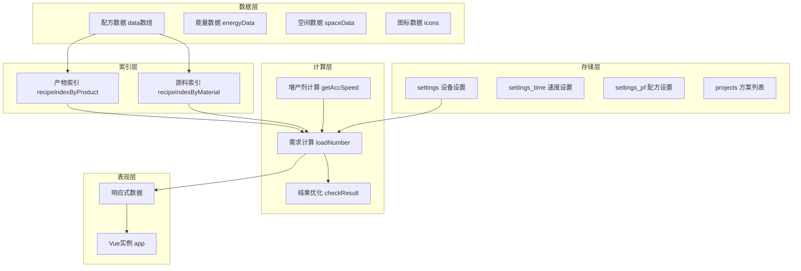

---

## 2. 数据结构

### 2.1 配方数据结构

**代码位置**: `data.js` L1-L4100

```javascript
var data = [
  {
    s: [{                    // s: 产物数组（可能多产物）
      name: "产物名称",       // 产物名称
      n: 1                   // 数量（默认为1）
    }],
    q: [{                    // q: 需求产物数组
      name: "原料名称",       // 原料名称
      n: 1                   // 需求数量
    }],
    t: 1,                    // t: 生产时间（秒）
    m: "生产设备",           // m: 生产设备类型（字符串，需转换）
    group: "分组名称",       // group: 产物分组
    noExtra: true            // noExtra: 增产剂效果标志
  }
]
```

### 2.2 配方数据结构详解

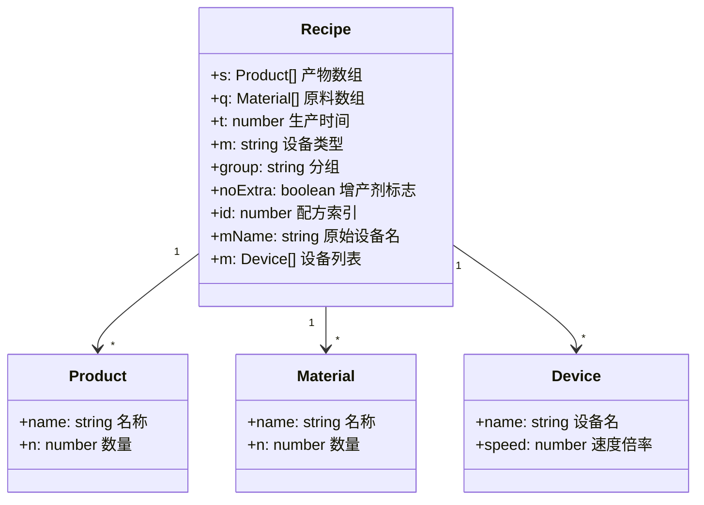

### 2.3 noExtra字段说明

| 值 | 含义 | 示例 |
|---|------|------|
| `false` (默认) | 加速/增产均可 | 普通配方 |
| `true` | 仅加速，不可增产 | 分馏塔制重氢 |
| `null` | 无效果 | 能量枢纽充能 |

### 2.4 能量消耗数据

**代码位置**: `data.js` L4100-L4120

```javascript
var energyData = {};
energyData["研究站"] = 0.48;           // MW
energyData["制作台Mk.Ⅰ"] = 0.27;       // MW
energyData["制作台Mk.Ⅱ"] = 0.54;       // MW
energyData["制作台Mk.Ⅲ"] = 1.08;       // MW
energyData["重组式制造台"] = 2.7;      // MW
energyData["电弧熔炉"] = 0.36;         // MW
energyData["位面熔炉"] = 1.44;         // MW
energyData["负熵熔炉"] = 2.88;         // MW
energyData["矿脉"] = 0.42 / 6;         // MW
energyData["采矿机"] = 0.42;           // MW
energyData["大型采矿机"] = 2.94;       // MW
energyData["原油萃取站"] = 0.84;       // MW
energyData["抽水机"] = 0.3;            // MW
energyData["原油精炼机"] = 0.96;       // MW
energyData["化工厂"] = 0.72;           // MW
energyData["量子化工厂"] = 2.16;       // MW
energyData["粒子对撞机"] = 12;         // MW
energyData["轨道采集器"] = 0;          // MW
energyData["射线接收塔"] = 0;          // MW
energyData["能量枢纽"] = 0;            // MW
energyData["分馏塔"] = 0.72;           // MW
```

### 2.5 空间占用数据

**代码位置**: `data.js` L4121-L4135

```javascript
var spaceData = {};
spaceData["研究站"] = 36 / 15;         // 可叠加
spaceData["制作台Mk.Ⅰ"] =
spaceData["制作台Mk.Ⅱ"] =
spaceData["制作台Mk.Ⅲ"] =
spaceData["重组式制造台"] = 16;
spaceData["电弧熔炉"] = spaceData["位面熔炉"] = spaceData["负熵熔炉"] = 16;
spaceData["原油精炼机"] = 28;
spaceData["化工厂"] = 35;
spaceData["量子化工厂"] = 35;
spaceData["射线接收塔"] = 24;
spaceData["能量枢纽"] = 64;
spaceData["分馏塔"] = 16;
spaceData["粒子对撞机"] = 45;
```

---

## 3. 核心变量

### 3.1 配方索引变量

**代码位置**: `data.js` L4145-L4146

```javascript
var recipeIndexByProduct = {};   // 产物名 → [配方索引数组]
var recipeIndexByMaterial = {};  // 原料名 → [配方索引数组]
```

**索引数据结构示例**：
```javascript
recipeIndexByProduct = {
  "铁块": [21, 22],
  "氢": [32, 33, 34, 75],
  "重氢": [31, 66, 74]
}

recipeIndexByMaterial = {
  "铁矿": [21, 26, 27],
  "氢": [33, 34, 66, 75]
}
```

### 3.2 用户设置变量

**代码位置**: `data.js` L4262-L4310

```javascript
var settings = {};               // 持久化设置（存储到localStorage）
var settingsLocal = {};          // 临时设置（不存储）
var settings_time = {};          // 设备速度设置
var settings_pf = {};            // 配方选择设置
var projects = [];               // 项目列表
```

### 3.3 计算过程变量

**代码位置**: `data.js` L4320-L4330

```javascript
var currentItem = null;          // 当前选中物品
var xqs = [];                    // 需求列表 [{item, number}]
var singleMake = [];             // 独立生产列表 [{id, number}]
var xh_list = [];                // 需求计算结果列表
var out_list = [];               // 多余产出列表
var ig_names = [];               // 忽略物品列表
```

### 3.4 其他关键变量

```javascript
var defaultAccType = "增产剂Mk.Ⅰ";  // 默认增产剂类型
var defaultAccValue = "无";         // 默认增产剂效果
var version = "20240202";           // 版本号（缓存控制）
var pointLength = 3;                // 数字保留小数位数
var manualGzSpeed = false;          // 是否手动输入临界光子产量
```

### 3.5 变量关系图

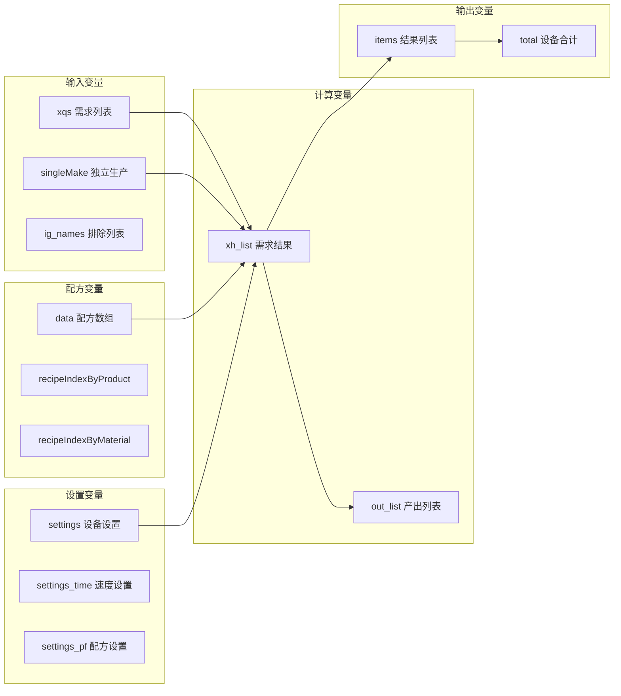

---

## 4. 初始化阶段

### 4.1 页面加载流程

**代码位置**: `data.js` L4495-L4520

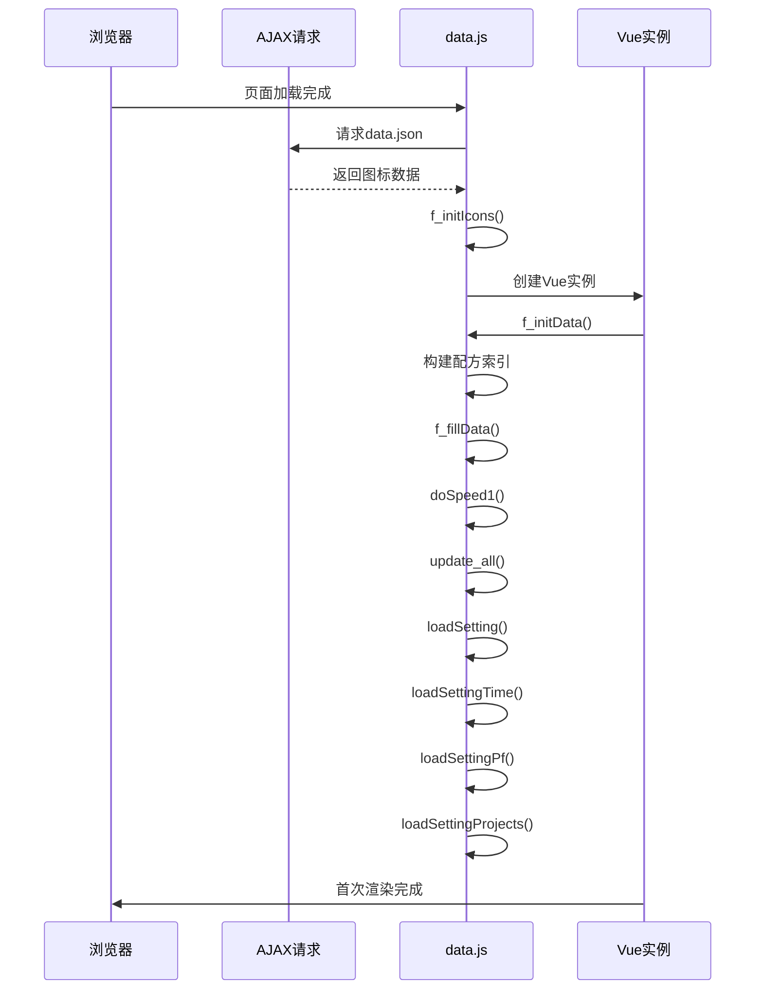

### 4.2 AJAX数据加载核心逻辑

**代码位置**: `data.js` L4495-L4520

```javascript
var game_data = {};
var isDataLoaded = false;
$(function () {
  $.ajax({
    url: "./Scripts/data.json?v" + version,
    dataType: "json",
    timeout: 1000000,
    success: function (data) {
      game_data = data;
      isDataLoaded = true;
      f_initIcons();
    },
    error: function () {
      alert("游戏资源加载失败，图标将无法显示正常，请刷新再试");
    },
  });
  f_init();
});
```

**核心细节说明**：
| 步骤 | 说明 | 关键点 |
|------|------|--------|
| AJAX请求 | 异步加载图标资源 | 使用version参数防止缓存 |
| 加载标志 | `isDataLoaded`控制后续操作 | 防止未加载完成时触发图标选择 |
| 错误处理 | 提示用户刷新页面 | 保证用户体验 |

### 4.3 f_initData() 详细流程

**代码位置**: `data.js` L4148-L4260

```mermaid
flowchart TD
    A["f_initData()"] --> B["清空索引"]
    B --> C["遍历data数组"]
    C --> D["设置item.id = i"]
    D --> E["构建产物索引"]
    E --> F["构建原料索引"]
    F --> G["设备类型转换"]
    G --> H["设置item.m数组"]
    H --> C
    
    subgraph 产物索引构建
        E --> E1["遍历item.s"]
        E1 --> E2["recipeIndexByProduct[name].push(i)"]
    end
    
    subgraph 原料索引构建
        F --> F1["遍历item.q"]
        F1 --> F2["recipeIndexByMaterial[name].push(i)"]
    end
    
    subgraph 设备转换
        G --> G1{"item.m类型?"}
        G1 -->|"研究站"| G2["[{name:'矩阵研究站',speed:1},<br/>{name:'自演化研究站',speed:3}]"]
        G1 -->|"制作台"| G3["[{name:'制作台Mk.Ⅰ',speed:0.75},...]
        G1 -->|"冶炼设备"| G4["[{name:'电弧熔炉',speed:1},...]
        G1 -->|"其他"| G5["对应设备列表"]
    end
```

#### 完整初始化逻辑

```javascript
function f_initData() {
  recipeIndexByProduct = {};
  recipeIndexByMaterial = {};
  
  $(data).each(function (i, item) {
    item.id = i;

    for (var j = 0; j < item.s.length; j++) {
      var productName = item.s[j].name;
      if (!recipeIndexByProduct[productName]) {
        recipeIndexByProduct[productName] = [];
      }
      recipeIndexByProduct[productName].push(i);
    }
    
    if (item.q) {
      for (var j = 0; j < item.q.length; j++) {
        var materialName = item.q[j].name;
        if (!recipeIndexByMaterial[materialName]) {
          recipeIndexByMaterial[materialName] = [];
        }
        recipeIndexByMaterial[materialName].push(i);
      }
    }

    // 设备映射转换
    var ms = [];
    if (item.m == "研究站") {
      ms = [
        { name: "矩阵研究站", speed: 1 },
        { name: "自演化研究站", speed: 3 },
      ];
    }
    // ... 其他设备类型转换
    item.mName = item.m;
    item.m = ms;
  });
}
```

### 4.4 设备映射转换规则

**代码位置**: `data.js` L4180-L4255

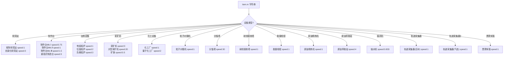

### 4.5 设备速度计算说明

| 设备类型 | 速度计算 | 说明 |
|----------|----------|------|
| 采矿机 | 0.5 × 6 = 3 | 按6个矿脉计算 |
| 大型采矿机 | 1 × 20 = 20 | 按20个矿脉计算 |
| 矿脉 | 0.5 × 1 = 0.5 | 单矿脉，最高30 |
| 抽水机 | 50 / 60 ≈ 0.833 | 每秒50单位 |
| 分馏塔 | 30 | 每分钟处理30单位 |

### 4.6 f_initIcons() 图标初始化

**代码位置**: `data.js` L6074-L6185

#### 图标解析核心逻辑

```javascript
var icons_define = {
  氢: [-1, 3, 7, "氢"],
  可燃冰: [-1, 2, 7, "可燃冰"],
};
var icons = {};

function f_initIcons() {
  var reg = /^(\d)-(\d{1,2})-(.*)+/;
  
  for (var i = 0; i < game_data.icons1.length; i++) {
    var icon = game_data.icons1[i];
    if (reg.test(icon.name)) {
      var x = icon.name.match(reg);
      icons[x[3]] = icon.value;
    } else {
      icons[icon.name] = icon.value;
    }
  }
  
  for (var i = 0; i < game_data.icons2.length; i++) {
    var icon = game_data.icons2[i];
    if (reg.test(icon.name)) {
      var x = icon.name.match(reg);
      icons[x[3]] = icon.value;
    } else {
      icons[icon.name] = icon.value;
    }
  }
  
  app.icons = Object.freeze(icons);
}
```

### 4.7 f_fillData() 数据填充

**代码位置**: `data.js` L4525-L4555

```javascript
function getGroup() {
  var groups = [];
  $(data).each(function (i, item) {
    if (!item.group) return;
    if ($.inArray(item.group, groups) == -1) {
      groups.push(item.group);
    }
  });
  return groups;
}

function f_fillData() {
  var names = [];
  
  $(getGroup()).each(function (i, group) {
    var jgroup = $("<optgroup label='" + group + "'></optgroup>");
    $(data).each(function (i, item) {
      if (item.group == group) {
        for (var j = 0; j < item.s.length; j++) {
          if ($.inArray(item.s[j].name, names) == -1) {
            names.push(item.s[j].name);
            jgroup.append(
              "<option value='" + item.s[j].name + "'>" + 
              item.s[j].name + "</option>"
            );
          }
        }
      }
    });
    $("#seldata").append(jgroup);
  });
}
```

**分组数据结构**：
| 分组 | 示例物品 |
|------|----------|
| 产品 | 宇宙矩阵、蓝矩阵、红矩阵 |
| 组件 | 铁块、钢材、电路板 |
| 消耗品 | 空间翘曲器、太阳帆 |
| 建筑 | 制作台、电弧熔炉 |

---

## 5. 配方查找阶段

### 5.1 find() 函数详细流程

**代码位置**: `data.js` L4694-L4756

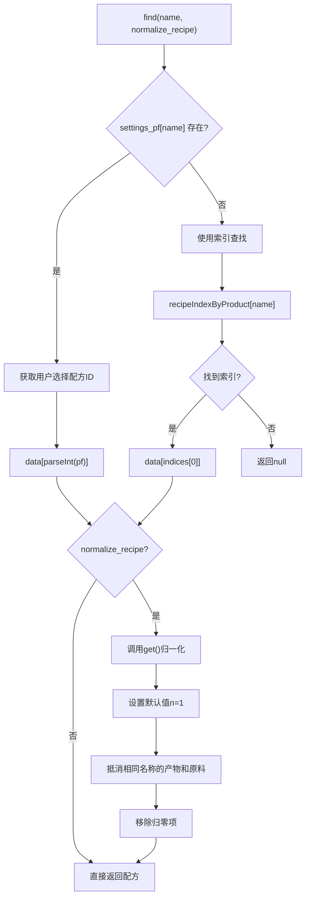

### 5.2 配方归一化逻辑

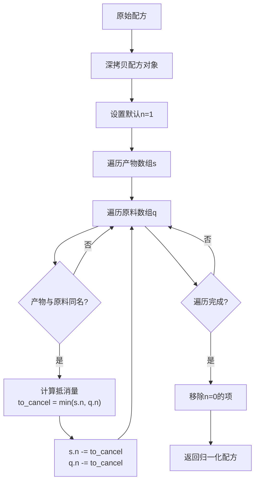

#### 归一化核心作用

| 场景 | 说明 | 示例 |
|------|------|------|
| 分馏塔 | 氢→重氢(1%) | 消耗1氢产出0.01重氢+0.99氢，归一化后净消耗0.01氢 |
| 循环配方 | 产物包含原料 | 避免重复计算 |
| 需求计算 | 精确计算净需求 | 确保原料需求准确 |

### 5.3 归一化示例

**原始配方**：
```javascript
{
  s: [{ name: "氢", n: 0.99 }, { name: "重氢", n: 0.01 }],
  q: [{ name: "氢", n: 1 }],
  t: 1
}
```

**归一化后（查找"重氢"）**：
```javascript
{
  s: [{ name: "重氢", n: 0.01 }],
  q: [{ name: "氢", n: 0.01 }],
  t: 1,
  name: "重氢",
  n: 0.01
}
```

### 5.4 getPfs() 和 getPfsByQ()

**代码位置**: `data.js` L4556-L4587

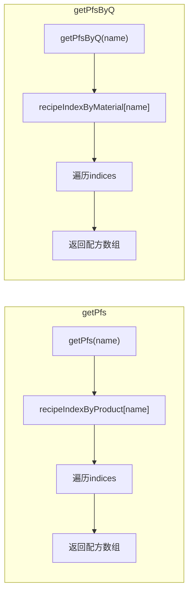

| 函数 | 用途 | 返回值 |
|------|------|--------|
| `getPfs(name)` | 查找能生产某物品的所有配方 | 配方数组 |
| `getPfsByQ(name)` | 查找使用某原料的所有配方 | 配方数组 |
| `find(name)` | 获取当前选择的配方 | 单个配方 |

### 5.5 配方选择功能

**代码位置**: `data.js` L5886-L5900

```javascript
function selectPf(name, value) {
  let old_settings_pf = $.extend(true, {}, settings_pf);
  try {
    settings_pf[name] = parseInt(value);
    update_all();
  } catch (e) {
    settings_pf = old_settings_pf;
    update_all();
    if (e.name == "RangeError") {
      cocoMessage.warning("配方选择错误，已恢复原配方。", 3000);
    }
  }
}
```

---

## 6. 设备配置阶段

### 6.1 getValue() 函数

**代码位置**: `data.js` L4350-L4380

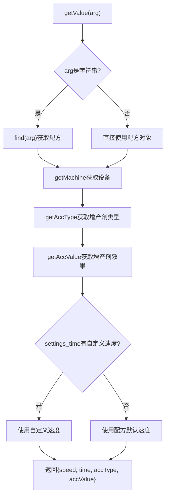

### 6.2 getMachine() 函数

```javascript
function getMachine(arg) {
  var item = typeof arg == "string" ? find(arg) : arg;
  if (!item) return null;
  
  // 优先级：settings > settingsLocal > 默认
  var machine = (settings[item.id] || {}).m || null;
  if (machine != null) return machine;

  machine = (settingsLocal[item.id] || {}).m || null;
  if (machine != null) return machine;

  return item.m[0].name;
}
```

### 6.3 设备选择优先级

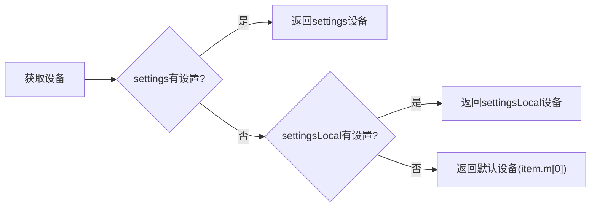

---

## 7. 增产剂计算阶段

### 7.1 getAccSpeed() 函数

**代码位置**: `data.js` L4620-L4635

```javascript
function getAccSpeed(type, value) {
  if (["增产", "加速"].indexOf(value) === -1) {
    return 1;
  }
  // 增产剂每种等级以及工作类型的增产效率
  var accSpeed = { 
    inc: [1.125, 1.2, 1.25],   // 增产模式
    acc: [1.25, 1.5, 2]        // 加速模式
  };
  var type_index = ["增产剂Mk.Ⅰ", "增产剂Mk.Ⅱ", "增产剂Mk.Ⅲ"].indexOf(type);
  type_index = type_index >= 0 ? type_index : 0;
  return value == "增产" ? accSpeed.inc[type_index] : accSpeed.acc[type_index];
}
```

### 7.2 增产剂效果对照表

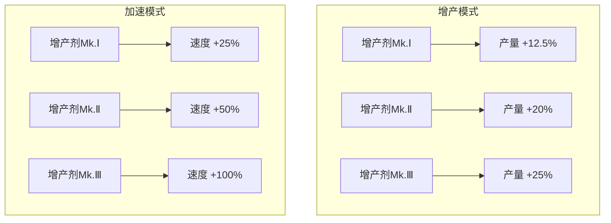

| 增产剂等级 | 增产效果 | 加速效果 |
|-----------|---------|---------|
| Mk.Ⅰ | +12.5% | +25% |
| Mk.Ⅱ | +20% | +50% |
| Mk.Ⅲ | +25% | +100% |

---

## 8. 需求计算阶段

### 8.1 update_all() 主计算函数

**代码位置**: `data.js` L5100-L5300

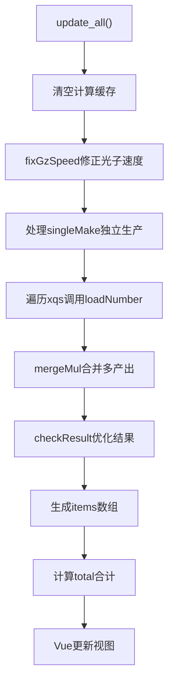

### 8.2 loadNumber() 递归计算

**代码位置**: `data.js` L4950-L5050

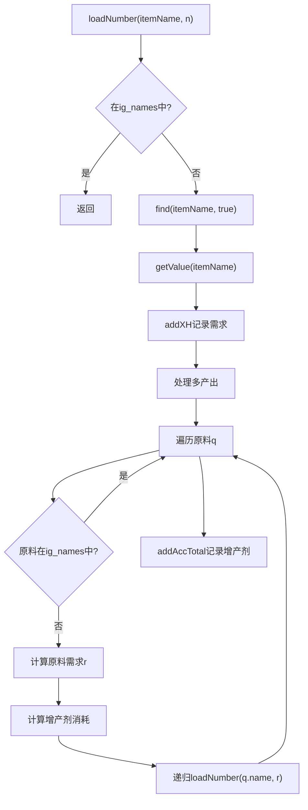

### 8.3 需求计算核心逻辑

```javascript
function loadNumber(itemName, n) {
  // 1. 检查排除列表
  if ($.inArray(itemName, ig_names) != -1) return;
  
  // 2. 获取配方和设备信息
  var item = find(itemName, true);
  var info = getValue(itemName);
  
  // 3. 记录需求
  addXH(itemName, n);
  
  // 4. 处理多产出
  for (var i = 0; i < item.s.length; i++) {
    if (item.s[i].name != itemName) {
      addOut(item.s[i].name, (-1 * n * (item.s[i].n || 1)) / (item.n || 1));
    }
  }
  
  // 5. 递归计算原料需求
  for (var i = 0; item.q && i < item.q.length; i++) {
    var q = item.q[i];
    var r = (n * (q.n || 1)) / (item.n || 1);
    
    // 增产剂消耗计算
    if (accValue == "加速") {
      accTotal += r / tm;
      loadNumber(accType, r / tm);
    } else if (accValue == "增产") {
      r /= v;
      accTotal += r / tm;
      loadNumber(accType, r / tm);
    }
    
    loadNumber(q.name, r);
  }
}
```

---

## 9. 结果优化阶段

### 9.1 checkResult() 优化函数

**代码位置**: `data.js` L5070-L5100

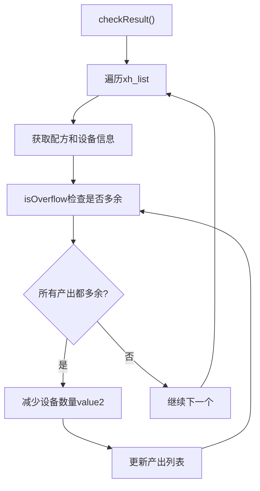

### 9.2 isOverflow() 检查函数

```javascript
function isOverflow(item, info, nn) {
  for (var j = 0; j < item.s.length; j++) {
    var x = findOut(item.s[j].name);
    if (x == null) return false;
    var mn = ((nn * 60) / item.t) * info.speed * (item.s[j].n || 1);
    if (x > -1 * mn) return false;
  }
  return true;
}
```

### 9.3 优化场景示例

```
场景：X射线裂解生产氢和高级石墨
需求：氢 60/min
产出：氢 120/min, 高级石墨 60/min
多余：氢 60/min, 高级石墨 60/min

优化后：
设备数量减半
产出：氢 60/min, 高级石墨 30/min
多余：高级石墨 30/min
```

---

## 10. 蓝图生成阶段

### 10.1 generateBlueprint() 函数

**代码位置**: `data.js` L5800-L5950

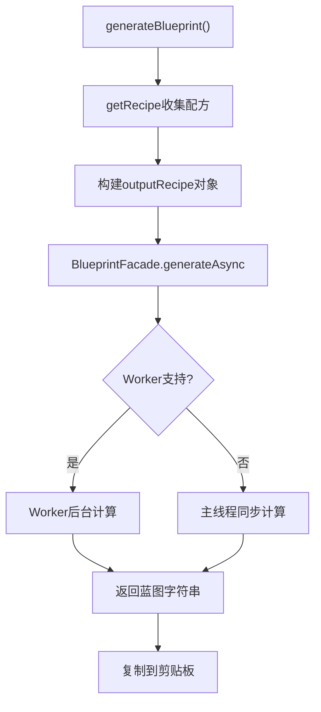

### 10.2 getRecipe() 配方收集

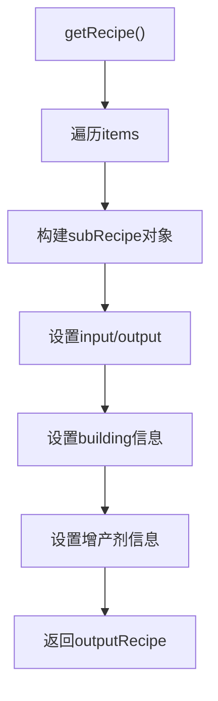

### 10.3 outputRecipe 数据结构

```javascript
{
  targetItem: "目标物品名",
  targetRate: 60,  // 目标产量
  proliferator: {
    name: "增产剂Mk.Ⅲ",
    mode: "增产"  // 或 "加速"
  },
  subRecipes: [
    {
      input: [{name: "铁矿", rate: 1}],
      output: [{name: "铁块", rate: 1}],
      building: {
        name: "arcSmelter",
        num: 10
      },
      recipeID: 1,
      accType: "增产剂Mk.Ⅲ",
      accValue: "增产"
    }
  ]
}
```

---

## 11. 设置管理阶段

### 11.1 存储函数

```javascript
function saveData(key, value) {
  if (window.localStorage) {
    localStorage.setItem(key, value);
  } else {
    $.cookie(key, value);
  }
}

function getData(key) {
  if (window.localStorage) {
    return localStorage.getItem(key);
  } else {
    return $.cookie(key);
  }
}
```

### 11.2 存储数据结构

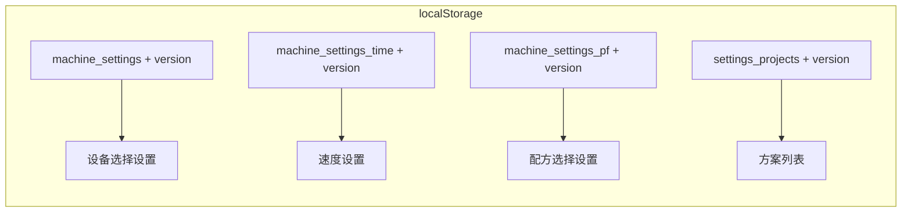

### 11.3 设置加载流程

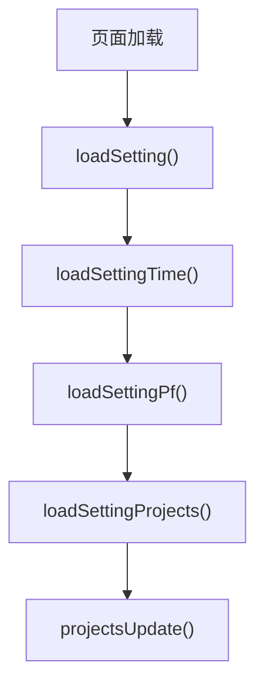

---

## 12. Vue应用阶段

### 12.1 Vue实例结构

**代码位置**: `data.js` L4760-L5100

```javascript
app = new Vue({
  el: "#result",
  data: {
    totalEnergy: 0,
    totalSpace: 0,
    totalAcc: 0,
    total: [],
    xqs: [],
    icons: icons,
    items: [],
    items2: [],
    items0: [],
    ig_names: [],
    xps_editor_index: -1,
    xps_editor_number: 0,
    items_editor_index: -1,
    items_editor_number: 0
  },
  methods: {
    speedChange: function(item) { /* ... */ },
    onClickNumber: function(index) { /* ... */ },
    onClickNumberItem: function(index_item) { /* ... */ },
    submitEditorNumber: function() { /* ... */ },
    submitEditorNumberItem: function() { /* ... */ },
    removeItem: function(index) { /* ... */ }
  },
  computed: {
    totalDisplay: function() { /* ... */ }
  }
});
```

### 12.2 数据绑定映射

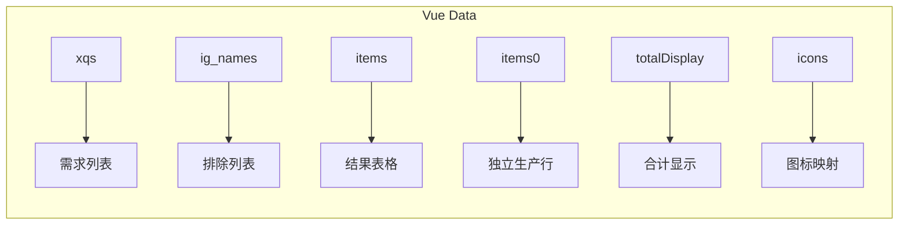

### 12.3 Vue方法详解

| 方法名 | 说明 |
|--------|------|
| `onClickNumber(index)` | 点击数量进入编辑模式 |
| `submitEditorNumber()` | 提交编辑的数量 |
| `removeItem(index)` | 移除需求项 |
| `speedChange(item)` | 速度改变处理 |

---

## 13. 完整流程图

### 13.1 应用启动完整流程

```mermaid
flowchart TD
    subgraph 页面加载
        A[浏览器加载index.html] --> B[解析DOM结构]
        B --> C[加载外部脚本]
        C --> D[加载data.js]
        D --> E[加载blueprint.js]
    end
    
    subgraph 数据初始化
        E --> F[定义配方数据data]
        F --> G[定义能量数据energyData]
        G --> H[定义空间数据spaceData]
        H --> I[执行$(function)]
    end
    
    subgraph AJAX加载
        I --> J[AJAX请求data.json]
        J --> K{请求成功?}
        K -->|是| L[game_data = data]
        K -->|否| M[显示错误提示]
        L --> N[f_initIcons]
    end
    
    subgraph Vue初始化
        I --> O[f_init]
        O --> P[创建Vue实例]
        P --> Q[f_initData构建索引]
        Q --> R[f_fillData填充选项]
        R --> S[doSpeed1计算速度]
        S --> T[update_all首次计算]
    end
    
    subgraph 设置加载
        T --> U[loadSetting]
        U --> V[loadSettingTime]
        V --> W[loadSettingPf]
        W --> X[loadSettingProjects]
        X --> Y[projectsUpdate]
    end
    
    subgraph 渲染完成
        Y --> Z[页面就绪]
        N --> Z
    end
```

### 13.2 需求计算完整流程

```mermaid
flowchart TD
    subgraph 用户输入
        A[用户选择物品] --> B[输入产量/设备数]
        B --> C[addItem添加到xqs]
    end
    
    subgraph 计算触发
        C --> D[update_all]
        D --> E[清空计算缓存]
        E --> F[fixGzSpeed修正光子]
    end
    
    subgraph 递归计算
        F --> G[遍历xqs]
        G --> H[loadNumber递归]
        H --> I[find获取配方]
        I --> J[getValue获取设备]
        J --> K[addXH记录需求]
        K --> L[处理多产出]
        L --> M[遍历原料]
        M --> N[计算增产剂]
        N --> O[递归loadNumber]
        O --> M
    end
    
    subgraph 结果优化
        M --> P[mergeMul合并多产出]
        P --> Q[checkResult优化]
        Q --> R[生成items数组]
    end
    
    subgraph 视图更新
        R --> S[计算total合计]
        S --> T[Vue响应式更新]
        T --> U[DOM渲染]
    end
```

---

## 14. 关键常量速查

### 14.1 设备速度常量

| 设备 | 速度倍率 | 能耗(MW) | 占地 |
|------|---------|---------|------|
| 制作台Mk.Ⅰ | 0.75 | 0.27 | 16 |
| 制作台Mk.Ⅱ | 1.0 | 0.54 | 16 |
| 制作台Mk.Ⅲ | 1.5 | 1.08 | 16 |
| 重组式制造台 | 3.0 | 2.7 | 16 |
| 电弧熔炉 | 1.0 | 0.36 | 16 |
| 位面熔炉 | 2.0 | 1.44 | 16 |
| 负熵熔炉 | 3.0 | 2.88 | 16 |
| 化工厂 | 1.0 | 0.72 | 35 |
| 量子化工厂 | 2.0 | 2.16 | 35 |
| 粒子对撞机 | 1.0 | 12 | 45 |
| 矩阵研究站 | 1.0 | 0.48 | 2.4 |
| 自演化研究站 | 3.0 | - | - |

### 14.2 增产剂效果常量

| 等级 | 增产效果 | 加速效果 | 消耗倍率 |
|------|---------|---------|---------|
| Mk.Ⅰ | ×1.125 | ×1.25 | ×1.0 |
| Mk.Ⅱ | ×1.2 | ×1.5 | ×1.0 |
| Mk.Ⅲ | ×1.25 | ×2.0 | ×1.0 |

### 14.3 传送带运力常量

| 传送带 | 运力(/min) |
|--------|-----------|
| 传送带 | 360 |
| 高速传送带 | 720 |
| 极速传送带 | 1800 |

---

**维护者**：DSQ 开发团队

