# Index核心流程详细文档

## 目录

1. [项目概述](#1-项目概述)
2. [文件结构](#2-文件结构)
3. [页面结构概述](#3-页面结构概述)
4. [HTML结构分析](#4-html结构分析)
5. [UI组件详细分析](#5-ui组件详细分析)
6. [样式系统](#6-样式系统)
7. [Vue模板系统](#7-vue模板系统)
8. [事件绑定系统](#8-事件绑定系统)
9. [功能模块分析](#9-功能模块分析)
10. [核心流程](#10-核心流程)
11. [用户交互流程](#11-用户交互流程)
12. [数据渲染流程](#12-数据渲染流程)
13. [数据流与模块依赖](#13-数据流与模块依赖)
14. [全局变量与状态管理](#14-全局变量与状态管理)
15. [关键数据结构](#15-关键数据结构)
16. [性能优化要点](#16-性能优化要点)
17. [完整流程图](#17-完整流程图)
18. [附录：关键函数速查](#18-附录关键函数速查)

---

## 1. 项目概述

戴森球计划量产量化计算器是一个Web应用，用于计算游戏中生产某种产品所需的设备数量、原料消耗和增产剂需求。核心功能包括：

- **需求计算**：根据目标产量自动计算所需设备数量
- **配方管理**：支持多配方选择和切换
- **增产剂计算**：支持加速/增产两种增产剂效果
- **蓝图生成**：自动生成游戏内可导入的蓝图字符串

---

## 2. 文件结构

```
DSQ/
├── index.html                 # 主入口文件（包含HTML结构和内联JS）
├── Scripts/
│   ├── data.js               # 配方数据、计算逻辑、核心函数
│   ├── blueprint.js          # 蓝图生成逻辑
│   ├── blueprint.facade.js   # 蓝图外观层（Worker管理）
│   ├── blueprint.worker.js   # 蓝图Worker线程
│   ├── data.json             # 游戏图标资源
│   ├── style.css             # 样式文件
│   ├── jquery-2.2.4.min.js   # jQuery库
│   ├── jquery.cookie.min.js  # Cookie操作库
│   ├── jquery.tips.js        # 提示框插件
│   ├── vue.min.js            # Vue.js框架
│   ├── cocoMessage.js        # 消息提示组件
│   └── pako.js               # 压缩库（蓝图编码用）
├── quote/
│   ├── explanation.html      # 使用说明模块
│   └── updata.html           # 版本更新信息模块
└── img/
    └── *.png                 # 图片资源
```

---

## 3. 页面结构概述

### 3.1 文件位置

`d:\Android\Project\DSQ\index.html`

### 3.2 页面整体架构

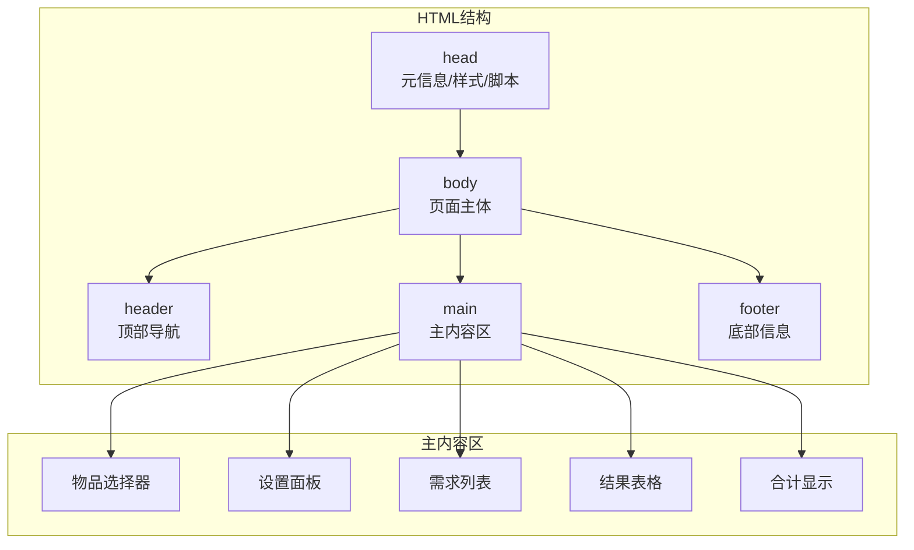

### 3.3 页面布局结构

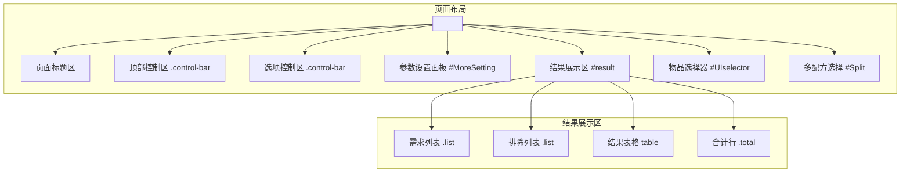

### 3.4 DOM层级结构

```
body
├── div (页面标题区 - 内联样式)
│   ├── h1 (标题)
│   └── p (副标题)
├── div.control-bar (顶部控制区)
│   └── div (flex容器)
│       ├── div (每分钟产量输入)
│       ├── div (设备数量输入)
│       ├── a (添加按钮)
│       └── div.custom-dropdown (按钮组)
├── div.control-bar (选项控制区)
│   ├── div (设备选择行)
│   │   ├── input#hideSource + label
│   │   ├── select#selmodein
│   │   ├── select#furnace
│   │   ├── select#chemical
│   │   ├── select#accType
│   │   ├── select#accValue
│   │   └── select#research
│   └── div (增产剂选项行)
│       ├── input#selfAcc + label
│       ├── input#isAddSelfAccP + label
│       ├── input#showMaxOneBelt + label
│       └── span#projectdiv (方案管理)
├── div#Split (多配方选择 - 隐藏)
├── div#UIselector (物品选择器 - 隐藏)
├── div#MoreSetting (参数设置面板 - 隐藏)
└── div#result (Vue挂载点)
    ├── div.list (需求列表 - v-if条件)
    ├── div.list (排除列表 - v-if条件)
    └── div.list (结果表格容器)
        └── table
            ├── tr.header (表头)
            ├── tr (items0 - 独立生产)
            ├── tr (items - 计算结果)
            └── tr.total (合计)
```

---

## 4. HTML结构分析

### 4.1 Head部分

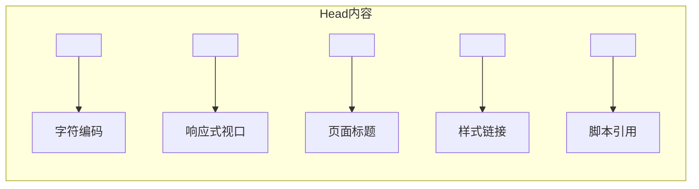

### 4.2 脚本加载顺序

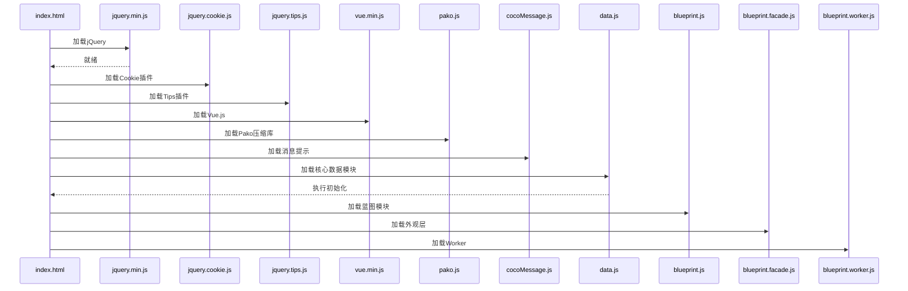

### 4.3 动态加载模块

```javascript
// index.html 内联脚本
$(function () {
    var includes = $('[data-include]');
    jQuery.each(includes, function () {
        var file = 'quote/' + $(this).data('include') + '.html';
        $(this).load(file);
    });
});
```

---

## 5. UI组件详细分析

### 5.1 页面标题组件

**位置**: body > div (第一个子元素)

**HTML结构**:
```html
<div style="text-align: center; margin-bottom: 10px; padding: 10px 0;">
  <h1 style="margin: 0; font-size: 28px; font-weight: 600; 
      background: linear-gradient(135deg, #2980b9, #3498db, #1abc9c); 
      -webkit-background-clip: text; 
      -webkit-text-fill-color: transparent;">
    戴森球计划量产量化计算器
  </h1>
  <p style="margin: 8px 0 0 0; color: #6b7280; font-size: 14px;">
    全自动计算量产产品的具体产能需求
  </p>
</div>
```

**样式特点**:
- 渐变文字效果 (linear-gradient + background-clip)
- 居中对齐
- 副标题灰色调

### 5.2 顶部控制区组件

**位置**: body > div.control-bar (第一个)

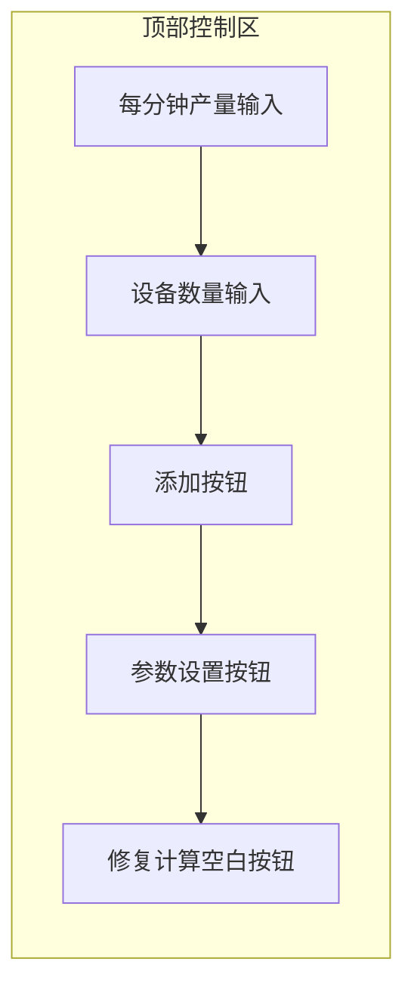

**组件清单**:

| 元素 | ID | 类型 | 功能 |
|------|-----|------|------|
| 产量输入 | txtnumber | text | 输入每分钟目标产量 |
| 设备数输入 | selmaince | number | 输入设备数量 |
| 添加按钮 | - | a | 触发f_add()显示选择器 |
| 参数设置 | btnSetting | button | 切换MoreSetting显示 |
| 修复空白 | btnReset1 | button | 重置所有设置 |

**动态行为**:
```javascript
// 输入框宽度自适应
oninput="this.style.width = (parseFloat(this.value) >= 999 ? 150 : 70) + 'px'"
```

### 5.3 选项控制区组件

**位置**: body > div.control-bar (第二个)

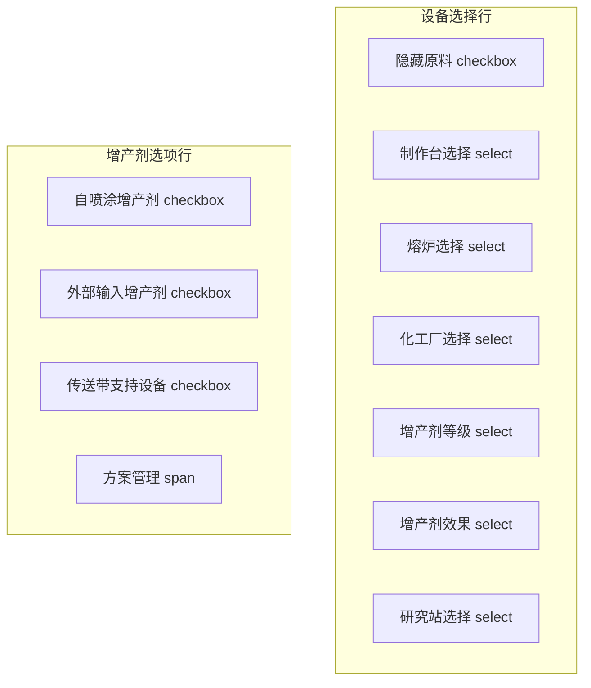

**下拉选项配置**:

| 组件ID | 选项值 | 默认值 |
|--------|--------|--------|
| selmodein | 制作台Mk.Ⅰ/Ⅱ/Ⅲ, 重组式制造台 | 制作台Mk.Ⅰ |
| furnace | 电弧熔炉, 位面熔炉, 负熵熔炉 | 电弧熔炉 |
| chemical | 化工厂, 量子化工厂 | 化工厂 |
| accType | 增产剂Mk.Ⅰ/Ⅱ/Ⅲ | 增产剂Mk.Ⅰ |
| accValue | 无, 加速, 增产 | 无 |
| research | 矩阵研究站, 自演化研究站 | 矩阵研究站 |

### 5.4 参数设置面板组件

**位置**: div#MoreSetting

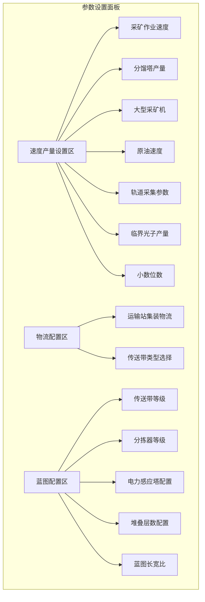

**配置项清单**:

| 分类 | 元素ID | 参数说明 |
|------|--------|----------|
| 速度设置 | selore | 采矿作业速度百分比 |
| 速度设置 | fractionatorSpeed | 分馏塔每分钟产量 |
| 速度设置 | speed1_6 | 大型采矿机效率 |
| 速度设置 | oilSpeed | 原油速度 |
| 速度设置 | speed1_1~speed1_4 | 轨道采集参数 |
| 速度设置 | gzSpeed | 临界光子产量 |
| 速度设置 | pointLength | 小数位数 |
| 物流配置 | speed1_5 | 传送带堆叠层数 |
| 物流配置 | csd | 传送带类型 |
| 蓝图配置 | onlyConveyorBeltMk3 | 仅三级传送带 |
| 蓝图配置 | onlySorterMk3 | 仅三级分拣器 |
| 蓝图配置 | useSorterMk4 | 使用四级分拣器 |
| 蓝图配置 | generateTeslaTower | 自动插入电力感应塔 |
| 蓝图配置 | teslaTowerLineInterval | 感应塔间隔 |
| 蓝图配置 | conveyorBeltStackLayer | 传送带堆叠层数 |
| 蓝图配置 | maxLabLayers | 研究站层数 |
| 蓝图配置 | stackLayers | 建筑堆叠层数 |
| 蓝图配置 | x_y_ratio | 蓝图长宽比 |

### 5.5 需求列表组件

**位置**: div#result > div.list (第一个)

**Vue模板结构**:
```html
<div class="list" v-if="xqs && xqs.length">
  <span v-for="(x,index) in xqs">
    <!-- 物品图标 -->
    
    <!-- 物品名称（无图标时） -->
    <span class="name" v-else>{{x.item.name}}</span>
    *
    <!-- 数量显示与编辑 -->
    <span class="item_number" @click="onClickNumber(index)">
      <span>{{ x.number.toFixed(pointLength) }}</span>
      <div v-if="xps_editor_index === index" class="number_editor_container">
        <input class="number_editor" type="number" v-model.number="xps_editor_number"
               @blur="submitEditorNumber()" 
               @keydown="..." />
      </div>
    </span>
  </span>
  <!-- 操作按钮组 -->
  <button onclick="f_reset()">重置</button>
  <button onclick="f_save()">保存方案</button>
  <button onclick="generateBlueprint()">生成蓝图</button>
</div>
```

**交互行为**:

| 操作 | 触发方式 | 处理函数 |
|------|----------|----------|
| 右键图标 | contextmenu | removeItem(index) |
| 点击数量 | click | onClickNumber(index) |
| 编辑确认 | blur/change/Enter | submitEditorNumber() |
| 编辑取消 | Escape | cancelEditorNumber() |

### 5.6 排除列表组件

**位置**: div#result > div.list (第二个)

**Vue模板结构**:
```html
<div class="list" v-if="ig_names && ig_names.length">
  排除计算：
  <span v-for="name in ig_names">
    
    <span class="name" v-else>{{name}}</span>
  </span>
  <button onclick="f_reset_ig()">重置</button>
  <small>(右键可取消单项排除)</small>
</div>
```

### 5.7 结果表格组件

**位置**: div#result > div.list > table

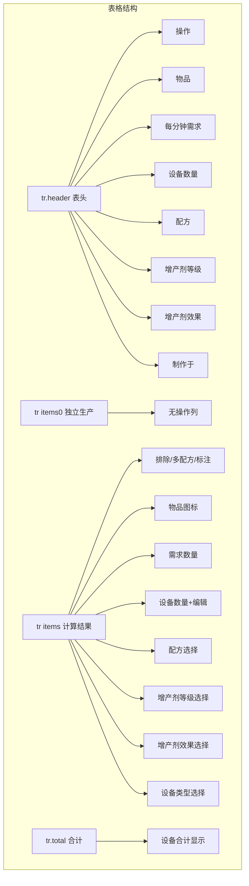

**表头定义**:
```html
<tr class="header">
  <td style="width:100px;">操作</td>
  <td style="width:100px;">物品<br/><span>(点击图标显示详情)</span></td>
  <td style="width:100px;">每分钟需求<br/><span>(负数代表多余)</span></td>
  <td style="width:100px;">设备数量<br/><span>(点击数字修改)</span></td>
  <td>配方<br/><span>(可选)</span></td>
  <td>增产剂等级<br/><span>(可选)</span></td>
  <td>增产剂效果<br/><span>(可选)</span></td>
  <td>制作于<br/><span>(可选)</span></td>
</tr>
```

### 5.8 物品选择器组件

**位置**: div#UIselector

**显示逻辑**:
```javascript
function f_add() {
  var $uiSelector = $("#UIselector");
  if ($uiSelector.hasClass("show")) {
    $uiSelector.removeClass("show");
    setTimeout(function() {
      $uiSelector.hide();
    }, 250);
  } else {
    $uiSelector.show();
    setTimeout(function() {
      $uiSelector.addClass("show");
    }, 10);
  }
}
```

**CSS动画**:
```css
#UIselector {
  display: none;
  position: absolute;
  opacity: 0;
  transform: scale(0.9);
  transition: all 0.25s ease;
}
#UIselector.show {
  display: block;
  opacity: 1;
  transform: scale(1);
}
```

**关闭逻辑**:
```javascript
$(document).click(function (e) {
  if (!$(e.target).closest("#UIselector").length) {
    $("#UIselector").hide();
  }
});
```

### 5.9 多配方选择组件

**位置**: div#Split

**生成逻辑**:
```javascript
function f_split(obj) {
  var name = $(obj).attr("data-name");
  $("#Split").html("<p>选择配方：</p>");
  var pfs = getPfs(name);
  
  for (var i = 0; i < pfs.length; i++) {
    (function (i) {
      var jlink = $("<div class='split-pf'></div>");
      jlink.html(getPfTitle(pfs[i]));
      jlink.appendTo($("#Split")).click(function () {
        selected = pfs[i];
        $("#Split .split-pf").removeClass("split-pf-selected");
        jlink.addClass("split-pf-selected");
      });
    })(i);
  }
  
  $("#Split").append("<p>设备数量：</p>");
  $("#Split").append("<div><input type='text' value='1' class='split-number' /></div>");
  $("#Split").append("<div><button>确定</button></div>");
  
  $("#Split").find("button").click(function () {
    singleMake.push({
      id: selected.id,
      number: parseFloat($("#Split").find(":text").val())
    });
    update_all();
    $("#Split").hide();
  });
}
```

---

## 6. 样式系统

### 6.1 样式文件引用

```html
<link rel="stylesheet" href="style.css?v20240202" />
```

### 6.2 样式文件结构

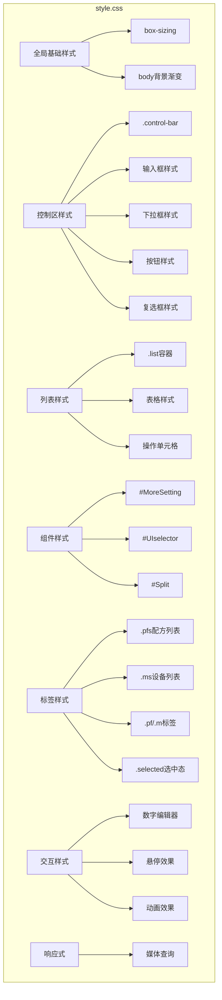

### 6.3 核心样式类

| 类名 | 用途 | 关键属性 |
|------|------|----------|
| .control-bar | 控制区容器 | backdrop-filter, border-radius, box-shadow |
| .list | 列表容器 | background, border-radius, animation |
| .pfs | 配方列表容器 | flex-direction: column |
| .ms | 设备列表容器 | flex-direction: row |
| .pf | 配方标签 | 渐变背景, border-radius |
| .m | 设备标签 | flex布局, 图标对齐 |
| .selected | 选中状态 | 蓝色渐变背景 |
| .header | 表头行 | 渐变背景, 居中 |
| .total | 合计行 | 渐变背景 |
| .xqsrow | 需求行 | 红色背景 |
| .row-tag | 标注行 | 灰色背景 |

### 6.4 响应式设计

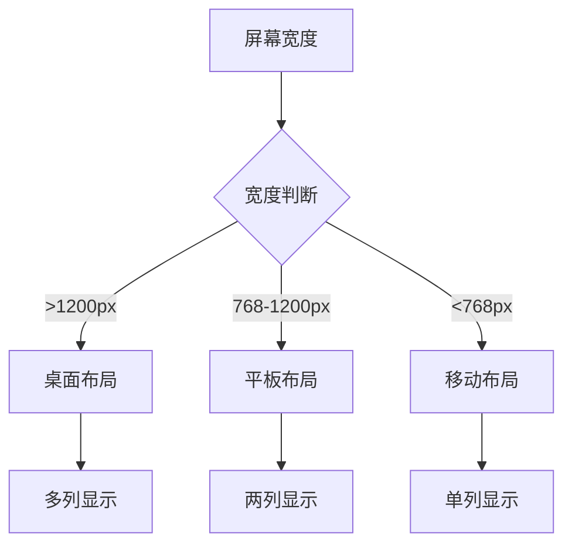

---

## 7. Vue模板系统

### 7.1 Vue挂载点

```html
<div id="result">
  <!-- Vue模板内容 -->
</div>
```

### 7.2 Vue实例定义

```javascript
app = new Vue({
    el: "#result",
    data: {
        totalEnergy: 0,      // 总能耗(MW)
        totalSpace: 0,       // 总占地面积
        totalAcc: 0,         // 总增产剂消耗
        total: [],           // 设备合计数据
        totalDisplay: [],    // 格式化合计显示
        xqs: [],             // 用户需求列表
        icons: icons,        // 图标Base64映射
        items: [],           // 计算结果列表
        items2: [],          // 二级结果(产出物)
        items0: [],          // 独立生产结果
        ig_names: [],        // 排除物品名列表
        pointLength: 1,      // 小数位数
        xps_editor_index: -1,    // 需求编辑索引
        xps_editor_number: 0,    // 需求编辑数值
        items_editor_index: -1,  // 结果编辑索引
        items_editor_number: 0,  // 结果编辑数值
    },
    methods: {
        onClickNumber: function(index) { /* 点击需求数量进入编辑模式 */ },
        onClickNumberItem: function(index_item) { /* 点击结果数量进入编辑模式 */ },
        submitEditorNumber: function() { /* 提交需求编辑 */ },
        submitEditorNumberItem: function() { /* 提交结果编辑(按比例调整所有需求) */ },
        cancelEditorNumber: function() { /* 取消需求编辑 */ },
        cancelEditorNumberItem: function() { /* 取消结果编辑 */ },
        removeItem: function(index) { /* 删除需求项 */ },
        speedChange: function(item) { /* 速度修改回调 */ }
    },
    computed: {
        totalDisplay: function() { /* 格式化合计显示 */ }
    }
});
```

### 7.3 数据绑定映射

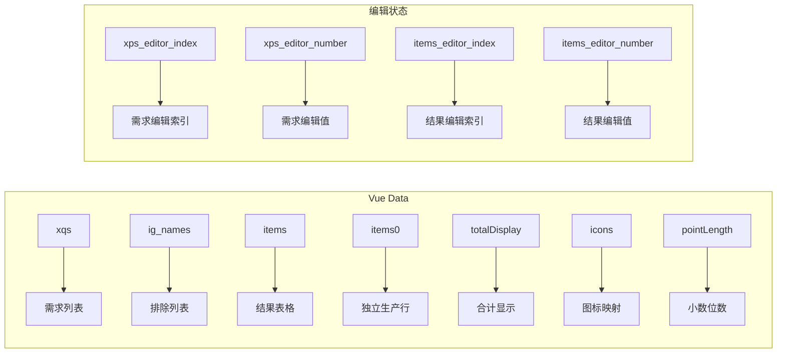

### 7.4 指令使用清单

| 指令 | 使用位置 | 说明 |
|------|----------|------|
| v-if | .list, img, div.number_editor_container | 条件渲染 |
| v-for | span, tr, a | 列表渲染 |
| v-bind:src | img | 动态图标路径 |
| v-bind:class | tr, a | 动态CSS类 |
| v-bind:data-name | td, a | 数据属性绑定 |
| v-bind:title | img | 提示文本绑定 |
| v-bind:href | a | 链接地址绑定 |
| v-html | a, span | HTML内容渲染 |
| v-model.number | input | 双向数值绑定 |
| @click | span, a | 点击事件 |
| @contextmenu | img | 右键事件 |
| @blur | input | 失焦事件 |
| @focus | input | 获焦事件 |
| @change | input | 值变更事件 |
| @keydown | input | 键盘事件 |

### 7.5 Vue数据绑定图

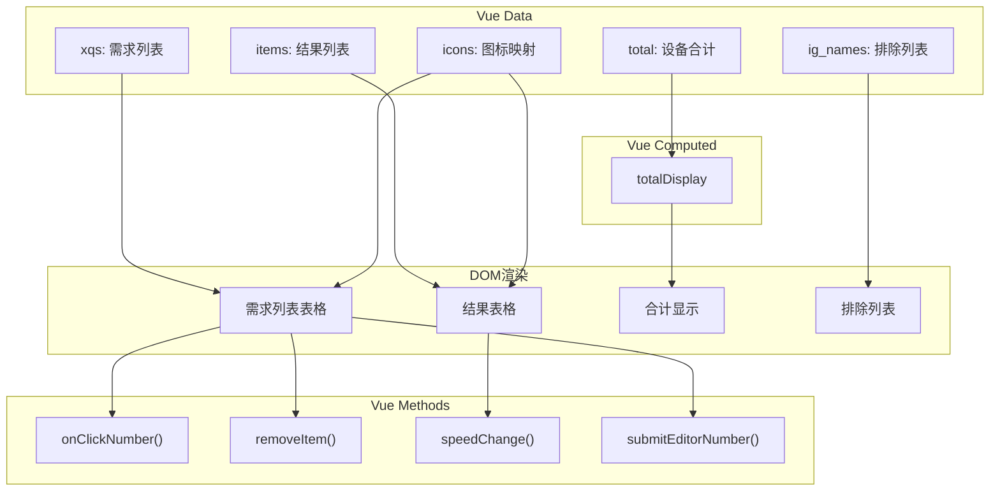

---

## 8. 事件绑定系统

### 8.1 事件绑定方式

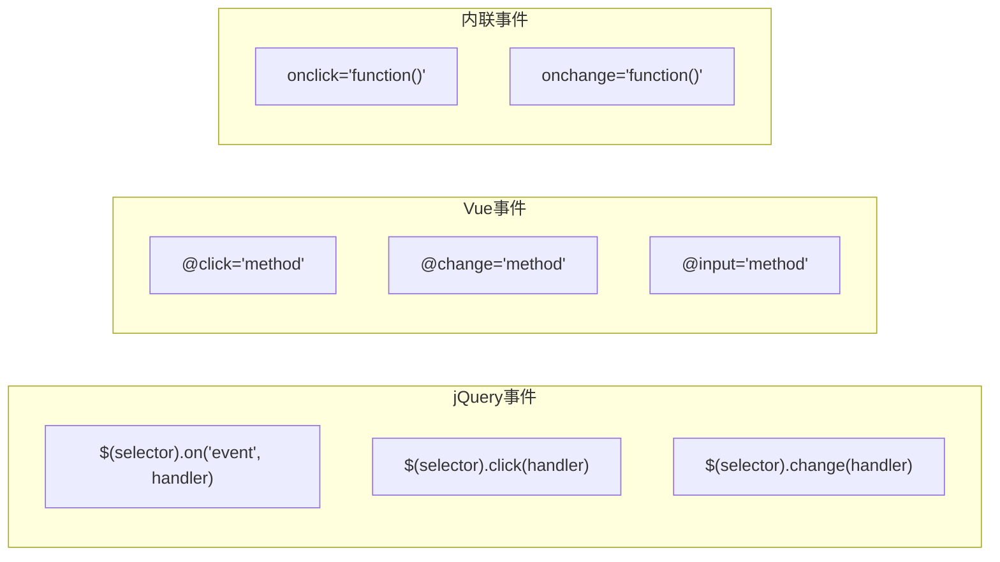

### 8.2 主要事件绑定

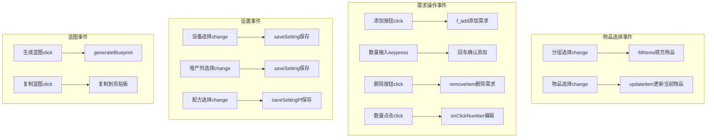

### 8.3 事件处理函数映射

| 事件类型 | 选择器/元素 | 处理函数 | 说明 |
|----------|-------------|----------|------|
| change | #select_group | fillItems | 分组切换时更新物品列表 |
| change | #select_item | updateItem | 物品切换时更新当前物品 |
| click | #btn_add | f_add | 添加需求到列表 |
| click | .btn-remove | removeItem | 从列表移除需求 |
| click | .number-cell | onClickNumber | 点击数量进入编辑模式 |
| change | .machine-select | saveSetting | 保存设备选择 |
| change | .acc-select | saveSetting | 保存增产剂选择 |
| click | #btn_blueprint | generateBlueprint | 生成蓝图 |

---

## 9. 功能模块分析

### 9.1 UI渲染模块

#### 9.1.1 页面结构

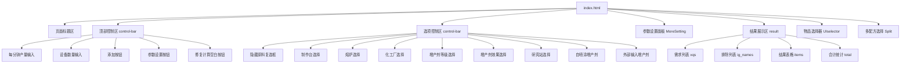

### 9.2 数据管理模块

#### 9.2.1 配方数据结构

```javascript
// data.js 配方结构
var data = [
    {
        s: [{ name: "产物名", n: 产量 }],  // 产物列表
        q: [{ name: "原料名", n: 消耗 }],  // 原料列表
        t: 生产时间(秒),                   // 生产周期
        m: "设备类型",                     // 设备分类名
        group: "分组名",                   // 物品分组
        noExtra: true/false/null,          // 增产剂效果限制
        id: 配方索引                       // 自动生成
    }
];
```

#### 9.2.2 配方索引结构

```javascript
// data.js 索引结构（优化查找性能）
var recipeIndexByProduct = {};  // 产物名 → [配方索引数组]
var recipeIndexByMaterial = {}; // 原料名 → [配方索引数组]
```

#### 9.2.3 设备数据映射

```javascript
// blueprint.js 设备映射
const buildingMap = {
    arcSmelter: {
        remark: "电弧熔炉",
        name: "arcSmelter",
        itemId: 2302,
        modelIndex: 62,
        productionSpeed: 1,
        size: { x: 3, y: 3 },
        type: buildingType.production,
        category: productionCategory.smelter,
        slotMaxIndex: 7
    },
    // ... 其他设备
};

// data.js 能耗数据
var energyData = {};
energyData["研究站"] = 0.48;
energyData["制作台Mk.Ⅰ"] = 0.27;
// ...

// data.js 占地数据
var spaceData = {};
spaceData["研究站"] = 36 / 15;
spaceData["制作台Mk.Ⅰ"] = 16;
// ...
```

### 9.3 计算引擎模块

#### 9.3.1 核心计算流程

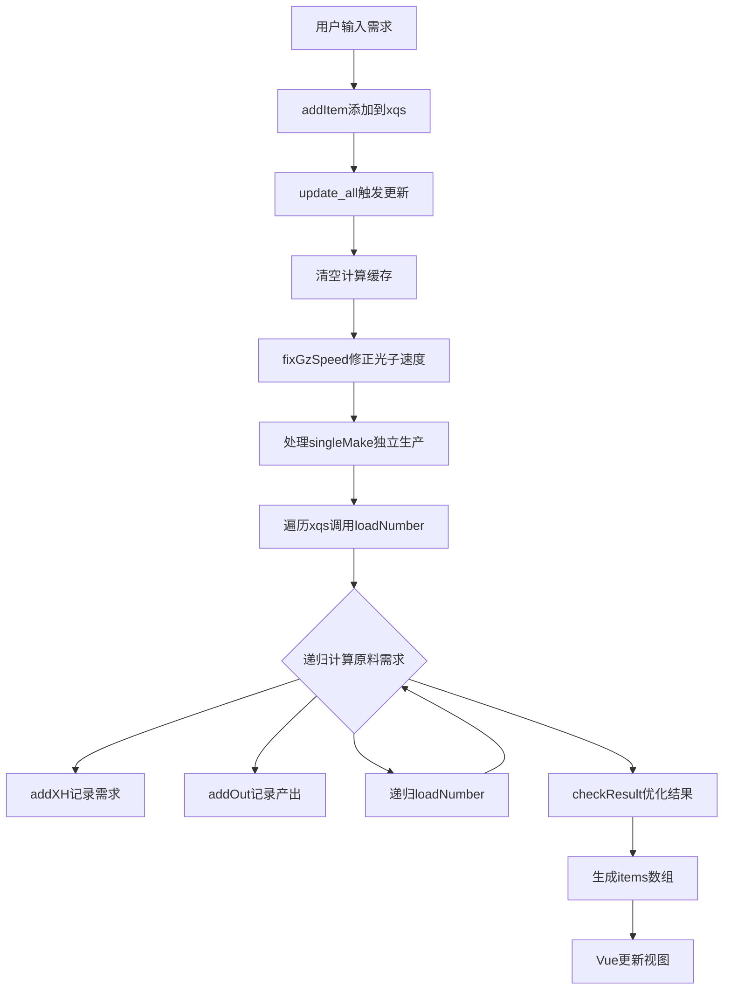

#### 9.3.2 关键函数说明

| 函数名 | 位置 | 功能描述 |
|--------|------|----------|
| `update_all()` | data.js | 主计算入口，触发全量计算 |
| `loadNumber(itemName, n)` | data.js | 递归计算原料需求 |
| `find(name, normalize_recipe)` | data.js | 查找配方并规范化 |
| `getValue(arg)` | data.js | 获取设备速度和时间参数 |
| `getAccSpeed(type, value)` | data.js | 计算增产剂效果倍率 |
| `checkResult()` | data.js | 优化多产出配方的设备数量 |
| `mergeMul()` | data.js | 合并相同配方的多个产出 |

#### 9.3.3 计算数据流

```javascript
// 计算过程中的核心数据结构
var xh_list = [];   // 需求列表 [{name, value, value2, accTotal}]
var out_list = [];  // 产出列表 [{name, value}]
var single_list = []; // 独立生产列表
var xqs = [];       // 用户输入的需求列表
var ig_names = [];  // 排除计算的物品名
```

### 9.4 蓝图生成模块

#### 9.4.1 蓝图生成流程

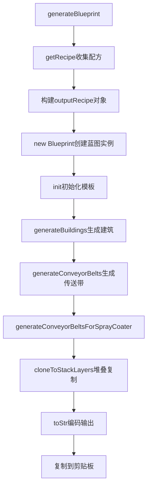

#### 9.4.2 Blueprint类结构

```javascript
// blueprint.js Blueprint类
class Blueprint {
    constructor(name, icons, recipe, config) {
        this.recipe = recipe;           // 配方数据
        this.config = config;           // 配置参数
        this.buildings = [];            // 建筑列表
        this.buildingIndex = 0;         // 建筑索引计数器
        this.blueprintSize = {x: 0, y: 0}; // 蓝图尺寸
        this.occupiedArea = [];         // 已占用区域
        this.sorters = {};              // 分拣器映射
        this.itemSummary = {};          // 物品汇总
    }
    
    init() { /* 初始化蓝图模板 */ }
    generateBuildings() { /* 生成生产建筑 */ }
    generateConveyorBelts() { /* 生成传送带网络 */ }
    generateConveyorBeltsForSprayCoater() { /* 生成喷涂机传送带 */ }
    cloneToStackLayers() { /* 堆叠模式复制 */ }
    toStr() { /* 编码为游戏字符串 */ }
}
```

#### 9.4.3 蓝图配置参数

```javascript
// data.js generateBlueprint函数
let config = {
    maxSorterNumOneBelt: 8,           // 单传送带最大分拣器数
    conveyorBeltStackLayer: 4,        // 传送带堆叠层数
    x_y_ratio: 2,                     // 蓝图长宽比
    compactLayout: false,             // 紧凑布局
    onlyConveyorBeltMk3: true,        // 仅使用三级传送带
    onlySorterMk3: true,              // 仅使用三级分拣器
    useSorterMk4: false,              // 使用四级分拣器
    maxLabLayers: 15,                 // 研究站最大层数
    selfSpray: true,                  // 自喷涂增产剂
    generateTeslaTower: true,         // 自动生成电力感应塔
    teslaTowerInterval: 10,           // 电线杆间距
    teslaTowerLineInterval: 1,        // 电线杆行间距
    stackLayers: 1                    // 建筑堆叠层数
};
```

### 9.5 存储持久化模块

#### 9.5.1 存储结构

```javascript
// data.js 存储变量
var settings = {};          // 设备选择设置 {配方id: {m, accType, accValue}}
var settings_time = {};     // 设备速度设置 {设备名: speed}
var settings_pf = {};       // 配方选择设置 {物品名: 配方id}
var projects = [];          // 保存的方案列表
var version = "20240202";   // 版本号（用于缓存控制）
```

#### 9.5.2 存储函数

```javascript
// data.js 存储函数
function saveData(key, value) {
    if (window.localStorage) {
        localStorage.setItem(key, value);
    } else {
        $.cookie(key, value);
    }
}

function getData(key) {
    if (window.localStorage) {
        return localStorage.getItem(key);
    } else {
        return $.cookie(key);
    }
}

function saveSetting() {
    saveData("machine_settings" + version, JSON.stringify(settings));
}

function loadSetting() {
    var json = getData("machine_settings" + version);
    if (json) eval("settings = " + json);
}
```

---

## 10. 核心流程

### 10.1 初始化流程

#### 10.1.1 初始化时序图

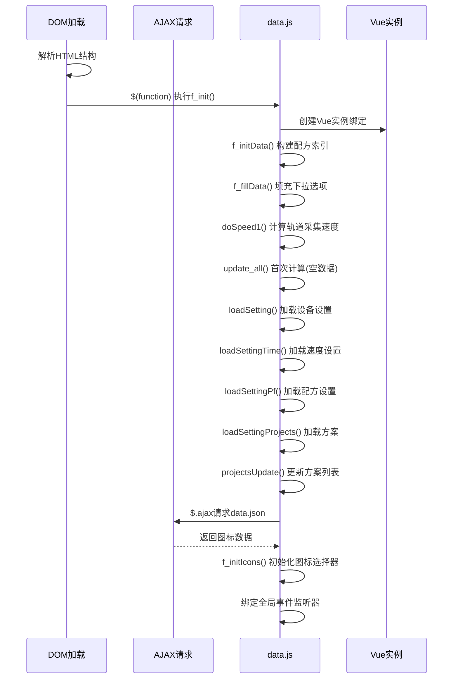

#### 10.1.2 f_init() 主入口函数

**位置**: data.js 第4797行

```javascript
function f_init() {
  // 步骤1: 创建Vue实例，绑定#result元素
  app = new Vue({ /* ... */ });

  // 步骤2: 构建配方索引
  f_initData();
  
  // 步骤3: 填充下拉选项
  f_fillData();
  
  // 步骤4: 计算轨道采集器速度参数
  doSpeed1();
  
  // 步骤5: 首次计算(空数据，初始化视图)
  update_all();
  
  // 步骤6: 加载持久化设置
  loadSetting();          // 设备选择设置
  loadSettingTime();      // 速度设置
  loadSettingPf();        // 配方选择设置
  loadSettingProjects();  // 保存的方案列表
  
  // 步骤7: 更新方案下拉列表
  projectsUpdate();
  
  // 步骤8: 绑定速度参数变更事件
  // ... 事件绑定代码
}
```

#### 10.1.3 f_initData() 配方索引构建

**位置**: data.js 第4252行

**核心逻辑**: 遍历配方数组，构建产物/原料的双向索引，将O(n)查找优化为O(k)

```javascript
function f_initData() {
  // 清空索引，准备重建
  recipeIndexByProduct = {};   // 产物名 → 配方索引数组
  recipeIndexByMaterial = {};  // 原料名 → 配方索引数组
  
  $(data).each(function (i, item) {
    // 设置配方ID(数组索引)
    item.id = i;

    // 构建产物索引: 遍历所有产物s[]
    for (var j = 0; j < item.s.length; j++) {
      var productName = item.s[j].name;
      if (!recipeIndexByProduct[productName]) {
        recipeIndexByProduct[productName] = [];
      }
      recipeIndexByProduct[productName].push(i);
    }
    
    // 构建原料索引: 遍历所有原料q[]
    if (item.q) {
      for (var j = 0; j < item.q.length; j++) {
        var materialName = item.q[j].name;
        if (!recipeIndexByMaterial[materialName]) {
          recipeIndexByMaterial[materialName] = [];
        }
        recipeIndexByMaterial[materialName].push(i);
      }
    }

    // 根据设备类型m设置可用设备列表及速度
    // ... 设备速度映射表
    
    // 将设备列表附加到配方对象
    if (ms.length > 0) {
      item.m = ms;
    }
  });
}
```

#### 10.1.4 f_fillData() 下拉选项填充

**位置**: data.js 第4536行

```javascript
function f_fillData() {
  var names = [];  // 去重用数组

  // 按分组遍历配方
  $(getGroup()).each(function (i, group) {
    // 创建optgroup分组
    var jgroup = $("<optgroup label='" + group + "'></optgroup>");
    
    $(data).each(function (i, item) {
      var name = item.name;
      if (item.group == group) {
        // 遍历配方产物，添加到下拉选项
        for (var j = 0; j < item.s.length; j++) {
          // 去重检查
          if ($.inArray(item.s[j].name, names) == -1) {
            names.push(item.s[j].name);
            jgroup.append(
              "<option value='" + item.s[j].name + "'>" + 
              item.s[j].name + "</option>"
            );
          }
        }
      }
    });
    // 追加到select元素
    $("#seldata").append(jgroup);
  });
}
```

#### 10.1.5 f_initIcons() 图标选择器初始化

**位置**: data.js 第6074行

**触发时机**: AJAX加载data.json成功后异步执行

```javascript
function f_initIcons() {
  // 步骤1: 解析图标数据，填充icons对象
  var reg = /^(\d)-(\d{1,2})-(.*)+/;
  for (var i = 0; i < game_data.icons1.length; i++) {
    var icon = game_data.icons1[i];
    if (reg.test(icon.name)) {
      var x = icon.name.match(reg);
      icons[x[3]] = icon.value;  // 提取实际名称
    } else {
      icons[icon.name] = icon.value;
    }
  }
  
  // 步骤2: 冻结icons对象，更新Vue响应式数据
  app.icons = Object.freeze(icons);

  // 步骤3: 绑定全局点击事件(关闭选择器)
  $(document).click(function (e) {
    if (!$(e.target).closest("#UIselector").length) {
      $("#UIselector").hide();
    }
    if (!$(e.target).closest("#Split").length) {
      $("#Split").hide();
    }
  });

  // 步骤4-6: 构建物品选择器UI
  // ...
}
```

### 10.2 添加需求流程

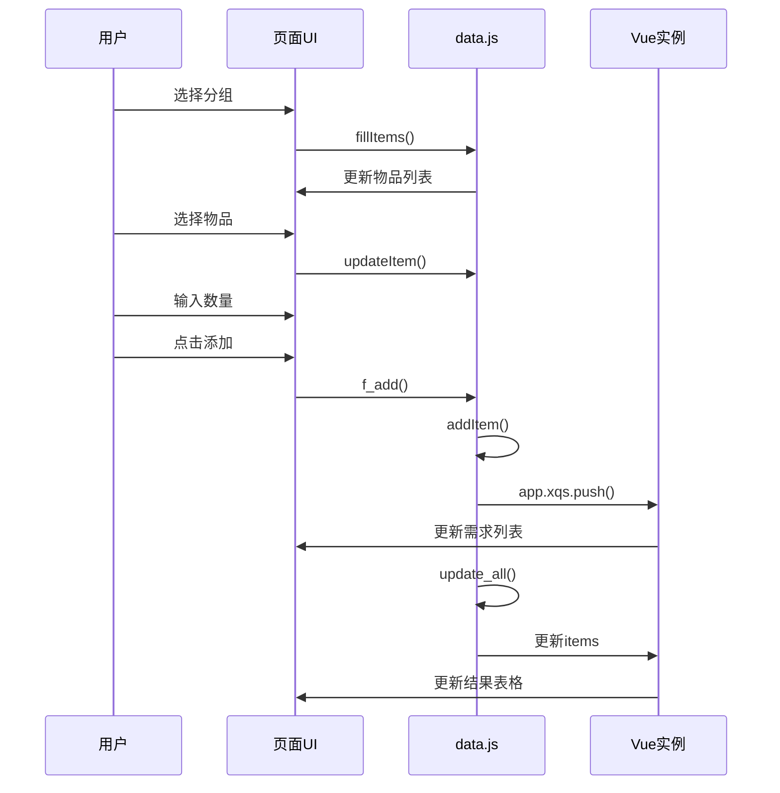

### 10.3 计算更新流程

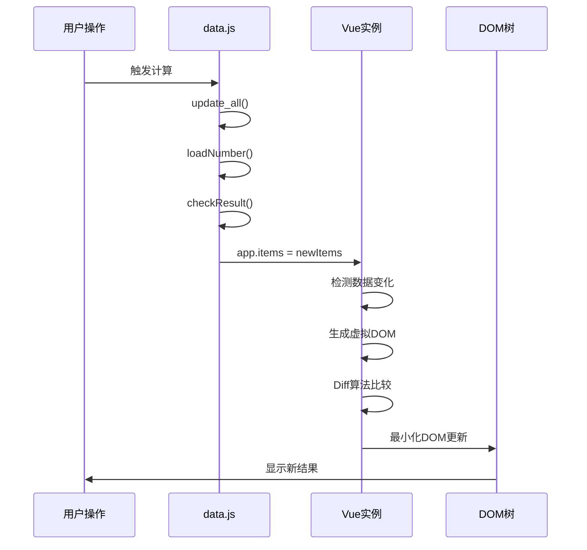

### 10.4 蓝图生成流程

```mermaid
sequenceDiagram
    participant User as 用户
    participant UI as 页面UI
    participant Data as data.js
    participant Facade as BlueprintFacade
    participant Worker as Worker线程
    
    User->>UI: 点击生成蓝图按钮
    UI->>Data: generateBlueprint()
    Data->>Data: getRecipe()收集配方
    Data->>Facade: generateAsync()
    Facade->>Worker: postMessage(config)
    Worker->>Worker: 蓝图计算
    Worker-->>Facade: postMessage(result)
    Facade-->>Data: Promise.resolve(bpStr)
    Data->>UI: 复制到剪贴板
    UI->>User: 显示成功提示
```

---

## 11. 用户交互流程

### 11.1 添加需求流程

```mermaid
flowchart TD
    subgraph 选择物品
        A[用户打开页面] --> B[选择分组]
        B --> C[fillItems更新物品列表]
        C --> D[选择物品]
        D --> E[updateItem更新当前物品]
    end
    
    subgraph 添加需求
        E --> F[输入数量]
        F --> G{输入方式?}
        G -->|产量| H[输入目标产量]
        G -->|设备数| I[输入设备数量]
        H --> J[点击添加按钮]
        I --> J
        J --> K[f_add添加需求]
        K --> L[addItem更新xqs]
    end
    
    subgraph 计算更新
        L --> M[update_all触发计算]
        M --> N[清空计算缓存]
        N --> O[loadNumber递归计算]
        O --> P[checkResult优化结果]
        P --> Q[生成items数组]
        Q --> R[Vue更新视图]
    end
```

### 11.2 修改需求流程

```mermaid
sequenceDiagram
    participant User as 用户
    participant UI as 页面UI
    participant Vue as Vue实例
    participant Data as data.js
    
    User->>UI: 点击数量单元格
    UI->>Vue: onClickNumber(index)
    Vue->>Vue: xps_editor_index = index
    Vue->>UI: 显示编辑框
    User->>UI: 输入新数量
    User->>UI: 按回车确认
    UI->>Vue: submitEditorNumber()
    Vue->>Vue: xqs[index].number = newValue
    Vue->>Data: update_all()
    Data->>Vue: 更新items
    Vue->>UI: 更新结果表格
```

### 11.3 设备选择流程

```mermaid
sequenceDiagram
    participant User as 用户
    participant UI as 页面UI
    participant Data as data.js
    participant Storage as localStorage
    
    User->>UI: 点击设备下拉框
    UI->>UI: 显示设备选项
    User->>UI: 选择设备
    UI->>Data: saveSetting()
    Data->>Storage: 存储设置
    Data->>Data: settings[id].m = device
    Data->>Data: update_all()
    Data->>UI: 更新结果
```

---

## 12. 数据渲染流程

### 12.1 需求列表渲染

```mermaid
flowchart TD
    A["app.xqs数据变化"] --> B["Vue检测变化"]
    B --> C["触发重新渲染"]
    C --> D["v-for遍历xqs"]
    D --> E["渲染每个需求项"]
    E --> F["显示图标"]
    E --> G["显示名称"]
    E --> H["显示数量"]
    E --> I["渲染操作按钮"]
```

### 12.2 结果表格渲染

```mermaid
flowchart TD
    A["app.items数据变化"] --> B["Vue检测变化"]
    B --> C["触发重新渲染"]
    C --> D["v-for遍历items"]
    D --> E["渲染每个结果行"]
    E --> F["物品信息列"]
    E --> G["产出速度列"]
    E --> H["设备数量列"]
    E --> I["设备选择列"]
    E --> J["增产剂选择列"]
    E --> K["能量/空间列"]
```

### 12.3 合计显示渲染

```mermaid
flowchart TD
    A["app.total数据变化"] --> B["computed重新计算"]
    B --> C["totalDisplay更新"]
    C --> D["渲染合计区域"]
    D --> E["总能量消耗"]
    D --> F["总空间占用"]
    D --> G["总增产剂消耗"]
    D --> H["设备分类合计"]
```

### 12.4 Vue响应式更新流程

```mermaid
flowchart TD
    subgraph 数据变化
        A[数据修改] --> B{修改类型?}
        B -->|直接赋值| C["app.items = newValue"]
        B -->|数组方法| D["app.xqs.push(item)"]
        B -->|对象属性| E["app.total[key] = value"]
    end
    
    subgraph Vue响应
        C --> F[Vue setter拦截]
        D --> F
        E --> F
        F --> G[触发依赖收集]
        G --> H[标记组件dirty]
    end
    
    subgraph 调度更新
        H --> I[加入更新队列]
        I --> J[异步批量更新]
        J --> K[nextTick执行]
    end
    
    subgraph 渲染更新
        K --> L[生成虚拟DOM]
        L --> M[Diff算法比较]
        M --> N[计算最小更新]
        N --> O[应用DOM更新]
        O --> P[视图更新完成]
    end
```

---

## 13. 数据流与模块依赖

### 13.1 数据流

```mermaid
flowchart LR
    subgraph 输入
        A[用户输入] --> B[xqs需求列表]
        A --> C[settings设置]
    end
    
    subgraph 计算
        B --> D[update_all]
        C --> D
        D --> E[loadNumber递归]
        E --> F[xh_list需求]
        E --> G[out_list产出]
    end
    
    subgraph 输出
        F --> H[items结果]
        G --> H
        H --> I[Vue渲染]
        I --> J[页面显示]
    end
```

### 13.2 模块依赖关系

```mermaid
graph TB
    subgraph 前端
        A[index.html] --> B[data.js]
        A --> C[blueprint.js]
        B --> D[Vue.js]
        B --> E[jQuery]
        C --> F[pako.js]
    end
    
    subgraph 数据
        G[data.json] --> B
        H[localStorage] --> B
    end
    
    subgraph Worker
        B --> I[blueprint.facade.js]
        I --> J[blueprint.worker.js]
        J --> C
    end
```

---

## 14. 全局变量与状态管理

### 14.1 核心全局变量

| 变量名 | 类型 | 说明 |
|--------|------|------|
| `data` | Array | 配方数据数组 |
| `app` | Vue | Vue实例 |
| `settings` | Object | 设备选择设置 |
| `settings_time` | Object | 设备速度设置 |
| `settings_pf` | Object | 配方选择设置 |
| `projects` | Array | 保存的方案列表 |
| `icons` | Object | 图标Base64映射 |
| `energyData` | Object | 设备能耗数据 |
| `spaceData` | Object | 设备占地数据 |
| `recipeIndexByProduct` | Object | 产物→配方索引 |
| `recipeIndexByMaterial` | Object | 原料→配方索引 |

### 14.2 计算过程变量

| 变量名 | 类型 | 说明 |
|--------|------|------|
| `xh_list` | Array | 需求列表(计算过程) |
| `out_list` | Array | 产出列表(计算过程) |
| `single_list` | Array | 独立生产列表 |
| `ig_names` | Array | 排除计算的物品名 |
| `singleMake` | Array | 多配方独立生产配置 |

---

## 15. 关键数据结构

### 15.1 需求项结构 (xqs)

```javascript
{
    item: { name: "物品名" },
    number: 100,  // 目标产量/设备数
    type: "speed" // "speed"=产量模式, "machine"=设备数模式
}
```

### 15.2 结果项结构 (items)

```javascript
{
    name: "物品名",
    number1: 100,        // 每分钟需求
    number2: 10.5,       // 设备数量
    number2img: "...",   // 设备图标HTML
    pf: [...],           // 可选配方列表
    accType: [...],      // 增产剂等级选项
    accValue: [...],     // 增产剂效果选项
    m: [...],            // 设备类型选项
    accTotal: 5,         // 增产剂消耗
    rowClass: "...",     // 行样式类
    machineName: "...",  // 设备名称
    speed: 1.5           // 设备速度
}
```

### 15.3 设置结构 (settings)

```javascript
{
    "配方id": {
        m: "设备名称",
        accType: "增产剂等级",
        accValue: "增产剂效果"
    }
}
```

### 15.4 方案结构 (projects)

```javascript
{
    name: "方案名",
    xqs: [...],          // 需求列表
    settings: {...},     // 设备设置
    settings_pf: {...},  // 配方设置
    ig_names: [...]      // 排除列表
}
```

---

## 16. 性能优化要点

### 16.1 配方索引优化

- **问题**: 原始实现遍历全部配方查找，O(n)复杂度
- **优化**: 构建产物/原料双向索引，O(k)复杂度（k为匹配配方数）
- **效果**: 查找速度提升10-100倍

### 16.2 Vue响应式优化

- **冻结静态数据**: `Object.freeze(icons)` 避免不必要的响应式转换
- **计算属性缓存**: 使用computed缓存合计计算结果
- **v-for优化**: 使用`:key`提升列表渲染性能

### 16.3 DOM操作优化

- **事件委托**: 使用jQuery事件委托减少事件绑定数量
- **批量更新**: Vue异步批量更新DOM
- **虚拟滚动**: 大列表考虑虚拟滚动

### 16.4 Worker异步计算

- **蓝图生成**: 使用Web Worker避免UI阻塞
- **Promise封装**: BlueprintFacade提供异步接口
- **进度反馈**: Worker支持进度消息回调

---

## 17. 完整流程图

### 17.1 页面加载完整流程

```mermaid
flowchart TD
    subgraph HTML解析
        A[浏览器请求index.html] --> B[解析HTML结构]
        B --> C[构建DOM树]
        C --> D[解析head部分]
        D --> E[加载CSS样式]
        E --> F[加载JavaScript脚本]
    end
    
    subgraph 脚本执行
        F --> G[jQuery初始化]
        G --> H[Vue.js加载]
        H --> I[data.js执行]
        I --> J[blueprint.js加载]
    end
    
    subgraph 数据初始化
        I --> K[定义配方数据]
        K --> L[定义能量数据]
        L --> M[定义空间数据]
        M --> N[创建Vue实例]
        N --> O[f_initData构建索引]
        O --> P[f_fillData填充选项]
    end
    
    subgraph AJAX加载
        I --> Q[AJAX请求data.json]
        Q --> R{请求成功?}
        R -->|是| S[加载图标数据]
        R -->|否| T[显示错误提示]
        S --> U[f_initIcons]
    end
    
    subgraph 设置恢复
        P --> V[loadSetting]
        V --> W[loadSettingTime]
        W --> X[loadSettingPf]
        X --> Y[loadSettingProjects]
    end
    
    subgraph 首次计算
        Y --> Z[update_all]
        Z --> AA[Vue首次渲染]
        U --> AA
        AA --> AB[页面就绪]
    end
```

### 17.2 用户操作完整流程

```mermaid
flowchart TD
    subgraph 选择物品
        A[用户打开页面] --> B[选择分组]
        B --> C[fillItems更新物品列表]
        C --> D[选择物品]
        D --> E[updateItem更新当前物品]
    end
    
    subgraph 添加需求
        E --> F[输入数量]
        F --> G{输入方式?}
        G -->|产量| H[输入目标产量]
        G -->|设备数| I[输入设备数量]
        H --> J[点击添加按钮]
        I --> J
        J --> K[f_add添加需求]
        K --> L[addItem更新xqs]
    end
    
    subgraph 计算更新
        L --> M[update_all触发计算]
        M --> N[清空计算缓存]
        N --> O[loadNumber递归计算]
        O --> P[checkResult优化结果]
        P --> Q[生成items数组]
        Q --> R[Vue更新视图]
    end
    
    subgraph 结果展示
        R --> S[显示需求列表]
        R --> T[显示结果表格]
        R --> U[显示合计信息]
    end
    
    subgraph 后续操作
        U --> V{用户操作?}
        V -->|修改设置| W[saveSetting保存]
        V -->|生成蓝图| X[generateBlueprint]
        V -->|保存方案| Y[saveProject]
        V -->|添加新需求| F
        W --> M
        X --> Z[复制蓝图字符串]
        Y --> AA[保存到localStorage]
    end
```

### 17.3 事件处理完整流程

```mermaid
flowchart TD
    subgraph 用户交互
        A[用户操作] --> B{操作类型?}
        B -->|点击| C[触发click事件]
        B -->|选择| D[触发change事件]
        B -->|输入| E[触发input事件]
    end
    
    subgraph 事件传播
        C --> F[事件冒泡]
        D --> F
        E --> F
        F --> G[到达绑定元素]
    end
    
    subgraph 事件处理
        G --> H{处理方式?}
        H -->|jQuery| I["$(selector).on()"]
        H -->|Vue| J["@event='method'"]
        H -->|内联| K["onclick='fn()'"]
    end
    
    subgraph 业务处理
        I --> L[执行处理函数]
        J --> L
        K --> L
        L --> M{是否更新数据?}
        M -->|是| N[修改Vue data]
        M -->|否| O[执行其他操作]
    end
    
    subgraph 视图更新
        N --> P[Vue响应式更新]
        P --> Q[DOM重新渲染]
        O --> R[操作完成]
        Q --> R
    end
```

---

## 18. 附录：关键函数速查

### A. 页面初始化函数

| 函数名 | 位置 | 说明 |
|--------|------|------|
| `f_init()` | data.js | 页面初始化入口 |
| `f_initData()` | data.js | 构建配方索引 |
| `f_fillData()` | data.js | 填充分组选项 |
| `f_initIcons()` | data.js | 初始化图标映射 |

### B. 用户交互函数

| 函数名 | 位置 | 说明 |
|--------|------|------|
| `f_add()` | data.js | 添加需求 |
| `addItem()` | data.js | 更新需求列表 |
| `fillItems()` | data.js | 填充物品选项 |
| `updateItem()` | data.js | 更新当前物品 |

### C. 计算函数

| 函数名 | 位置 | 说明 |
|--------|------|------|
| `update_all()` | data.js | 主计算函数 |
| `loadNumber()` | data.js | 递归计算需求 |
| `checkResult()` | data.js | 优化计算结果 |
| `getValue()` | data.js | 获取设备信息 |
| `find()` | data.js | 查找配方 |
| `getAccSpeed()` | data.js | 计算增产剂效果 |

### D. 设置函数

| 函数名 | 位置 | 说明 |
|--------|------|------|
| `saveSetting()` | data.js | 保存设备设置 |
| `loadSetting()` | data.js | 加载设备设置 |
| `saveSettingPf()` | data.js | 保存配方设置 |
| `loadSettingPf()` | data.js | 加载配方设置 |
| `saveSettingTime()` | data.js | 保存速度设置 |
| `loadSettingTime()` | data.js | 加载速度设置 |

### E. Vue方法

| 方法名 | 说明 |
|--------|------|
| `onClickNumber(index)` | 点击数量进入编辑模式 |
| `submitEditorNumber()` | 提交编辑的数量 |
| `removeItem(index)` | 移除需求项 |
| `speedChange(item)` | 速度改变处理 |

### F. 蓝图函数

| 函数名 | 位置 | 说明 |
|--------|------|------|
| `generateBlueprint()` | data.js | 生成蓝图入口 |
| `getRecipe()` | data.js | 收集配方数据 |
| `Blueprint.init()` | blueprint.js | 初始化蓝图 |
| `Blueprint.generateBuildings()` | blueprint.js | 生成建筑 |
| `Blueprint.generateConveyorBelts()` | blueprint.js | 生成传送带 |
| `Blueprint.toStr()` | blueprint.js | 编码输出 |
