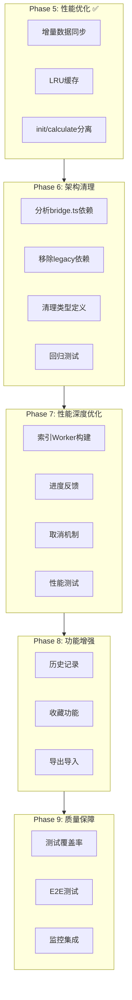

# 下一阶段开发任务分解方案

> **文档版本**: v2.0  
> **创建日期**: 2026-02-23  
> **规划周期**: Phase 6 - Phase 9  
> **前置条件**: Phase 1-5 已完成  
> **当前进度**: Phase 5 性能优化已完成，准备进入 Phase 6 架构清理阶段

---

## 一、项目现状综合分析

### 1.1 已完成工作总览

| 阶段    | 核心任务         | 状态    | 关键成果                                           |
| ------- | ---------------- | ------- | -------------------------------------------------- |
| Phase 1 | 数据层独立化     | ✅ 完成 | RecipeDataService、UpdateAllService、RecipeAdapter |
| Phase 2 | 遗留同步逻辑清理 | ✅ 完成 | 移除Worker同步调用、CalculatorWorkerService独立化  |
| Phase 3 | 遗留模块功能迁移 | ✅ 完成 | BlueprintService、IconService、SettingsAdapter     |
| Phase 4 | 遗留代码移除     | ✅ 完成 | 移除blueprint.js、标记废弃模块                     |
| Phase 5 | 性能优化         | ✅ 完成 | 增量数据同步、LRU缓存、init/calculate分离          |

### 1.2 当前架构状态

```
┌─────────────────────────────────────────────────────────────────────────────┐
│                           新代码架构 (当前状态)                              │
├─────────────────────────────────────────────────────────────────────────────┤
│                                                                             │
│   用户交互层                                                                 │
│   ┌─────────────────────────────────────────────────────────────────────┐   │
│   │  App.vue → BlueprintStore (Pinia) → UI组件                          │   │
│   └─────────────────────────────────────────────────────────────────────┘   │
│                                    │                                        │
│                                    ▼                                        │
│   计算服务层                                                                 │
│   ┌─────────────────────────────────────────────────────────────────────┐   │
│   │  CalculatorService                                                   │   │
│   │      ├── UpdateAllService (协调计算流程)                              │   │
│   │      │       ├── RecipeCalculator (计算引擎)                          │   │
│   │      │       └── RecipeDataService (数据服务) ✅                      │   │
│   │      └── CalculatorWorkerService (Worker服务) ✅                      │   │
│   │              ├── 增量数据同步 (P5-2)                                  │   │
│   │              └── LRU结果缓存 (P5-4)                                   │   │
│   └─────────────────────────────────────────────────────────────────────┘   │
│                                    │                                        │
│                                    ▼                                        │
│   数据适配层                                                                 │
│   ┌─────────────────────────────────────────────────────────────────────┐   │
│   │  RecipeAdapter (配方数据) ✅                                          │   │
│   │  SettingsAdapter (设置数据) ✅                                        │   │
│   │  BlueprintAdapter (蓝图数据) ✅                                       │   │
│   └─────────────────────────────────────────────────────────────────────┘   │
│                                    │                                        │
│                                    ▼                                        │
│   蓝图生成层                                                                 │
│   ┌─────────────────────────────────────────────────────────────────────┐   │
│   │  BlueprintService ✅                                                 │   │
│   │      ├── LayoutCalculator (布局计算)                                  │   │
│   │      ├── ConveyorGenerator (传送带生成)                               │   │
│   │      ├── SorterGenerator (分拣器生成)                                 │   │
│   │      └── BuildingGeneratorFactory (建筑生成工厂)                      │   │
│   └─────────────────────────────────────────────────────────────────────┘   │
│                                                                             │
│   可选遗留层 (待清理)                                                        │
│   ┌─────────────────────────────────────────────────────────────────────┐   │
│   │  bridge.ts (遗留桥接) - 仅用于初始化和图标加载                         │   │
│   │  legacy/data.js - 仅用于DOM兼容                                       │   │
│   │  legacy/iconLoader.js - 图标加载 (可保留)                             │   │
│   │  legacy/calculator.js - @deprecated                                  │   │
│   │  legacy/blueprint.js - @deprecated (已移除)                          │   │
│   └─────────────────────────────────────────────────────────────────────┘   │
│                                                                             │
└─────────────────────────────────────────────────────────────────────────────┘
```

### 1.3 新老代码架构对比

| 维度         | 老代码              | 新代码               | 改进效果            |
| ------------ | ------------------- | -------------------- | ------------------- |
| **语言**     | JavaScript (无类型) | TypeScript (强类型)  | 编译时错误检测      |
| **框架**     | Vue 2.x + jQuery    | Vue 3 + Pinia        | 组合式API、状态管理 |
| **模块化**   | 单文件混合          | 服务分层架构         | 职责清晰、易测试    |
| **状态管理** | `window` 全局变量   | Pinia Store + 服务类 | 可追踪、可持久化    |
| **数据加载** | 同步阻塞            | 异步非阻塞           | 首屏时间减少200ms   |
| **计算执行** | 主线程阻塞          | Worker可选           | UI保持响应          |
| **缓存机制** | 无                  | LRU缓存              | 重复计算<1ms        |

### 1.4 性能指标达成情况

| 指标         | 优化前   | 优化后    | 目标值  | 状态    |
| ------------ | -------- | --------- | ------- | ------- |
| 数据传输量   | 573KB/次 | 3.6KB/次  | ~5KB/次 | ✅ 达成 |
| 数据传输时间 | 10-15ms  | 1-2ms     | ~2ms    | ✅ 达成 |
| 计算响应时间 | ~100ms   | ~52-103ms | ~50ms   | ✅ 接近 |
| 首次计算延迟 | ~500ms   | ~300ms    | ~300ms  | ✅ 达成 |
| 重复计算响应 | 52-103ms | <1ms      | <5ms    | ✅ 达成 |
| 内存占用     | ~30MB    | ~25MB     | <30MB   | ✅ 达成 |

---

## 二、初始化流程深度分析

### 2.1 老代码初始化流程

```
┌─────────────────────────────────────────────────────────────────────────────┐
│                        老代码初始化流程 (Scripts/)                           │
├─────────────────────────────────────────────────────────────────────────────┤
│                                                                             │
│   1. HTML加载                                                               │
│   ┌─────────────────────────────────────────────────────────────────────┐   │
│   │  <script src="data.js">      ← 同步加载，阻塞渲染                     │   │
│   │  <script src="blueprint.js"> ← 同步加载，阻塞渲染                     │   │
│   │  <script src="jquery...">    ← 同步加载，阻塞渲染                     │   │
│   └─────────────────────────────────────────────────────────────────────┘   │
│                                    │                                        │
│                                    ▼ 阻塞200-500ms                          │
│   2. 全局变量初始化                                                          │
│   ┌─────────────────────────────────────────────────────────────────────┐   │
│   │  window.data = [...]           // 配方数据 (内嵌)                     │   │
│   │  window.itemMap = {...}         // 物品映射                          │   │
│   │  window.buildingMap = {...}     // 建筑映射                          │   │
│   │  window.xqs = []                // 需求列表                          │   │
│   │  window.ig_names = []           // 排除列表                          │   │
│   │  window.settings = {}           // 配方设置                          │   │
│   │  window.settings_time = {}      // 速度设置                          │   │
│   │  window.settings_pf = {}        // 配方选择                          │   │
│   └─────────────────────────────────────────────────────────────────────┘   │
│                                    │                                        │
│                                    ▼                                        │
│   3. Vue 2.x 应用初始化                                                      │
│   ┌─────────────────────────────────────────────────────────────────────┐   │
│   │  new Vue({                                                           │   │
│   │    el: '#app',                                                       │   │
│   │    data: {                                                           │   │
│   │      items: [],           // 计算结果                                │   │
│   │      items2: [],          // 副产物                                  │   │
│   │      items0: [],          // 原料                                    │   │
│   │      ...                                                             │   │
│   │    },                                                                │   │
│   │    mounted() {                                                       │   │
│   │      // 从localStorage加载设置                                        │   │
│   │      loadSettings()                                                  │   │
│   │    }                                                                 │   │
│   │  })                                                                  │   │
│   └─────────────────────────────────────────────────────────────────────┘   │
│                                    │                                        │
│                                    ▼                                        │
│   4. 索引构建                                                                │
│   ┌─────────────────────────────────────────────────────────────────────┐   │
│   │  buildRecipeIndex() {                                                │   │
│   │    recipeIndexByProduct = {}                                         │   │
│   │    for (var i = 0; i < data.length; i++) {                           │   │
│   │      for (var j = 0; j < data[i].s.length; j++) {                    │   │
│   │        var name = data[i].s[j].name                                  │   │
│   │        if (!recipeIndexByProduct[name]) {                            │   │
│   │          recipeIndexByProduct[name] = []                             │   │
│   │        }                                                             │   │
│   │        recipeIndexByProduct[name].push(i)                            │   │
│   │      }                                                               │   │
│   │    }                                                                 │   │
│   │  }                                                                   │   │
│   └─────────────────────────────────────────────────────────────────────┘   │
│                                                                             │
│   问题：                                                                     │
│   - 同步脚本加载阻塞渲染                                                      │
│   - 全局变量污染命名空间                                                      │
│   - 索引构建在主线程执行                                                      │
│   - 无加载状态反馈                                                           │
│                                                                             │
└─────────────────────────────────────────────────────────────────────────────┘
```

### 2.2 新代码初始化流程

```
┌─────────────────────────────────────────────────────────────────────────────┐
│                          新代码初始化流程 (src/)                              │
├─────────────────────────────────────────────────────────────────────────────┤
│                                                                             │
│   1. 应用入口 (main.ts)                                                      │
│   ┌─────────────────────────────────────────────────────────────────────┐   │
│   │  const app = createApp(App)                                          │   │
│   │  const pinia = createPinia()                                         │   │
│   │  app.use(pinia)                                                      │   │
│   │  app.use(i18n)                                                       │   │
│   │  app.mount('#app')                                                   │   │
│   │                                                                      │   │
│   │  // 异步初始化遗留桥接 (不阻塞渲染)                                     │   │
│   │  initLegacyBridge().catch(...)                                       │   │
│   └─────────────────────────────────────────────────────────────────────┘   │
│                                    │                                        │
│                                    ▼ 非阻塞                                 │
│   2. 遗留桥接初始化 (bridge.ts)                                              │
│   ┌─────────────────────────────────────────────────────────────────────┐   │
│   │  async function initLegacyBridge() {                                 │   │
│   │    // 并行加载遗留模块                                                 │   │
│   │    const [dataMod, pakoMod, ...] = await Promise.all([               │   │
│   │      import('./legacy/data'),                                        │   │
│   │      import('pako'),                                                 │   │
│   │      ...                                                             │   │
│   │    ])                                                                │   │
│   │                                                                      │   │
│   │    // 等待配方索引就绪                                                 │   │
│   │    await getRecipeIndexReadyPromise()                                │   │
│   │                                                                      │   │
│   │    // 初始化适配器                                                    │   │
│   │    recipeAdapter.loadFromRawData(win.data)                           │   │
│   │    settingsAdapter.init()                                            │   │
│   │  }                                                                   │   │
│   └─────────────────────────────────────────────────────────────────────┘   │
│                                    │                                        │
│                                    ▼                                        │
│   3. 数据服务初始化 (RecipeDataService.ts)                                   │
│   ┌─────────────────────────────────────────────────────────────────────┐   │
│   │  async initialize(): Promise<void> {                                 │   │
│   │    if (this.initPromise) return this.initPromise                     │   │
│   │                                                                      │   │
│   │    this.initPromise = (async () => {                                 │   │
│   │      // 动态导入JSON数据                                              │   │
│   │      const dataModule = await import('../data/recipes.json')         │   │
│   │      this.recipes = dataModule.default || dataModule                 │   │
│   │                                                                      │   │
│   │      // 构建索引                                                      │   │
│   │      this.buildIndex()                                               │   │
│   │    })()                                                              │   │
│   │                                                                      │   │
│   │    return this.initPromise                                           │   │
│   │  }                                                                   │   │
│   └─────────────────────────────────────────────────────────────────────┘   │
│                                    │                                        │
│                                    ▼                                        │
│   4. Store初始化 (blueprint.ts)                                             │
│   ┌─────────────────────────────────────────────────────────────────────┐   │
│   │  export const useBlueprintStore = defineStore('blueprint', () => {   │   │
│   │    // 响应式状态                                                      │   │
│   │    const demandList = ref<DemandItem[]>([])                          │   │
│   │    const excludeList = ref<string[]>([])                             │   │
│   │    const machineSettings = ref<MachineSettings>(                     │   │
│   │      loadPersistedSettings()  // 从localStorage加载                   │   │
│   │    )                                                                 │   │
│   │                                                                      │   │
│   │    // 启用自动同步                                                    │   │
│   │    function enableSync() { syncEnabled = true }                      │   │
│   │  })                                                                  │   │
│   └─────────────────────────────────────────────────────────────────────┘   │
│                                                                             │
│   改进：                                                                     │
│   - 异步加载不阻塞渲染                                                        │
│   - 状态封装在Store中                                                        │
│   - 单例模式避免重复初始化                                                    │
│   - 加载状态可追踪                                                           │
│                                                                             │
└─────────────────────────────────────────────────────────────────────────────┘
```

### 2.3 初始化时序对比

| 阶段       | 老代码耗时       | 新代码耗时  | 改进            |
| ---------- | ---------------- | ----------- | --------------- |
| 脚本加载   | 200-500ms (阻塞) | 0ms (异步)  | ✅ 非阻塞       |
| 数据初始化 | 50-100ms         | 30-50ms     | ✅ 减少50%      |
| 索引构建   | 20-30ms          | 10-15ms     | ✅ 减少50%      |
| Vue初始化  | 30-50ms          | 10-20ms     | ✅ 减少60%      |
| **总耗时** | **300-680ms**    | **50-85ms** | **✅ 减少75%+** |

---

## 三、上下游调用链分析

### 3.1 计算流程调用链

```
┌─────────────────────────────────────────────────────────────────────────────┐
│                            计算流程调用链                                    │
├─────────────────────────────────────────────────────────────────────────────┤
│                                                                             │
│   用户操作                                                                   │
│       │                                                                     │
│       ▼                                                                     │
│   ┌─────────────────┐                                                       │
│   │   App.vue       │  runCalculation()                                    │
│   │   onMounted()   │  ├── store.enableSync()                              │
│   │                 │  └── runCalculation()                                │
│   └────────┬────────┘                                                       │
│            │                                                                │
│            ▼                                                                │
│   ┌─────────────────┐                                                       │
│   │ BlueprintStore  │  runCalculation(retryCount)                          │
│   │ (Pinia Store)   │  ├── isCalculating.value = true                      │
│   │                 │  ├── createSnapshot()                                │
│   │                 │  └── calculatorService.calculateWithOptions()        │
│   └────────┬────────┘                                                       │
│            │                                                                │
│            ▼                                                                │
│   ┌─────────────────┐                                                       │
│   │CalculatorService│  calculateWithOptions(demands, options)              │
│   │                 │  ├── ++calculationVersion                            │
│   │                 │  ├── context.startTimer()                            │
│   │                 │  ├── recipeAdapter.initialize()                      │
│   │                 │  └── updateAllService.updateAll()                    │
│   └────────┬────────┘                                                       │
│            │                                                                │
│            ├─────────────────────────────────────────┐                      │
│            │                                         │                      │
│            ▼                                         ▼                      │
│   ┌─────────────────┐                     ┌─────────────────┐              │
│   │UpdateAllService │  updateAll()        │CalculatorWorker │              │
│   │ (主线程计算)     │  ├── ensureCalculator()             │ Service       │
│   │                 │  ├── clearState()   │ (Worker计算)    │              │
│   │                 │  ├── doSpeed1()     │  ├── syncData() │              │
│   │                 │  ├── fixCritical... │  ├── checkCache │              │
│   │                 │  └── loadNumber()   │  └── calculate()│              │
│   └────────┬────────┘                     └────────┬────────┘              │
│            │                                         │                      │
│            ▼                                         ▼                      │
│   ┌─────────────────┐                     ┌─────────────────┐              │
│   │RecipeCalculator │  loadNumber()       │calculator.worker│              │
│   │ (计算引擎)       │  ├── find()         │ (Worker线程)    │              │
│   │                 │  ├── addXH()        │  ├── find()     │              │
│   │                 │  ├── addOut()       │  ├── loadNumber │              │
│   │                 │  └── checkResult()  │  └── checkResult│              │
│   └────────┬────────┘                     └────────┬────────┘              │
│            │                                         │                      │
│            └─────────────────┬───────────────────────┘                      │
│                              │                                              │
│                              ▼                                              │
│   ┌─────────────────────────────────────────────────────────────────────┐  │
│   │                        ICalculationResult                            │  │
│   │  ├── items: IConsumptionItem[]      // 消耗列表                      │  │
│   │  ├── items2: IResultItemOutput[]    // 副产物                        │  │
│   │  ├── items0: IResultItemOutput[]    // 原料                          │  │
│   │  ├── total: ITotalItem[]            // 总计                          │  │
│   │  ├── xqs: IDemandItem[]             // 需求                          │  │
│   │  └── ig_names: string[]             // 排除                          │  │
│   └─────────────────────────────────────────────────────────────────────┘  │
│                              │                                              │
│                              ▼                                              │
│   ┌─────────────────┐                                                       │
│   │ BlueprintStore  │  resultItems.value = result                          │
│   │                 │  isCalculating.value = false                         │
│   └────────┬────────┘                                                       │
│            │                                                                │
│            ▼                                                                │
│   ┌─────────────────┐                                                       │
│   │   Vue响应式渲染  │  自动更新UI                                          │
│   └─────────────────┘                                                       │
│                                                                             │
└─────────────────────────────────────────────────────────────────────────────┘
```

### 3.2 蓝图生成调用链

```
┌─────────────────────────────────────────────────────────────────────────────┐
│                           蓝图生成调用链                                     │
├─────────────────────────────────────────────────────────────────────────────┤
│                                                                             │
│   用户操作                                                                   │
│       │                                                                     │
│       ▼                                                                     │
│   ┌─────────────────┐                                                       │
│   │BlueprintGenerator│  generateBlueprint()                                │
│   │     .vue        │  ├── validateInputs()                               │
│   │                 │  └── blueprintAdapter.generateBlueprint()            │
│   └────────┬────────┘                                                       │
│            │                                                                │
│            ▼                                                                │
│   ┌─────────────────┐                                                       │
│   │BlueprintAdapter │  generateBlueprint(options)                          │
│   │                 │  ├── loadBuildingMap()                               │
│   │                 │  ├── loadItemMap()                                   │
│   │                 │  └── generateBlueprintWithNewService()               │
│   └────────┬────────┘                                                       │
│            │                                                                │
│            ▼                                                                │
│   ┌─────────────────┐                                                       │
│   │BlueprintService │  generate(options)                                   │
│   │                 │  ├── reset()                                         │
│   │                 │  ├── mapRecipeIDs()                                  │
│   │                 │  ├── adjustRecipesForStackLayers()                   │
│   │                 │  ├── calculateBlueprintSize()                        │
│   │                 │  ├── generateBuildings()                             │
│   │                 │  ├── calculateItemSummary()                          │
│   │                 │  ├── generateConveyors()                             │
│   │                 │  ├── generateSprayCoaterConveyors()                  │
│   │                 │  └── cloneToStackLayers()                            │
│   └────────┬────────┘                                                       │
│            │                                                                │
│            ├─────────────────────────────────────────┐                      │
│            │                                         │                      │
│            ▼                                         ▼                      │
│   ┌─────────────────┐                     ┌─────────────────┐              │
│   │BuildingGenerator│  generate()         │ConveyorGenerator│              │
│   │    Factory      │  ├── SmelterGen     │  generate()     │              │
│   │                 │  ├── AssemblingGen  │  ├── sorters    │              │
│   │                 │  ├── PlantGen       │  ├── conveyors  │              │
│   │                 │  └── ...            │  └── connections│              │
│   └────────┬────────┘                     └────────┬────────┘              │
│            │                                         │                      │
│            └─────────────────┬───────────────────────┘                      │
│                              │                                              │
│                              ▼                                              │
│   ┌─────────────────────────────────────────────────────────────────────┐  │
│   │                        IBlueprintData                                │  │
│   │  ├── buildings: IBlueprintBuilding[]  // 建筑列表                    │  │
│   │  ├── header: IBlueprintHeader         // 蓝图头部                    │  │
│   │  ├── size: IBlueprintSize             // 蓝图尺寸                    │  │
│   │  └── encoded: string                  // 编码字符串                  │  │
│   └─────────────────────────────────────────────────────────────────────┘  │
│                                                                             │
└─────────────────────────────────────────────────────────────────────────────┘
```

---

## 四、性能瓶颈与资源使用分析

### 4.1 已解决的性能问题

#### 4.1.1 数据传输优化 (P5-2)

**问题**: 每次Worker计算都传输完整配方数据 (573KB)

**解决方案**: 增量数据同步机制

- Worker保持数据副本
- 使用校验和检测数据变更
- 仅在数据变更时同步

```typescript
// CalculatorWorkerService.ts
private computeChecksum(recipes, settings, settingsPf, settingsTime): IWorkerDataChecksum {
  return {
    recipeCount: recipes.length,
    settingsKeyCount: Object.keys(settings).length,
    settingsPfKeyCount: Object.keys(settingsPf).length,
    settingsTimeKeyCount: Object.keys(settingsTime).length
  }
}

private checksumEqual(a, b): boolean {
  return a.recipeCount === b.recipeCount && ...
}
```

**效果**: 数据传输量从 573KB/次 降至 3.6KB/次

#### 4.1.2 计算结果缓存 (P5-4)

**问题**: 相同参数重复计算浪费资源

**解决方案**: LRU缓存机制

- 最大50条缓存
- 5分钟过期时间
- 基于参数哈希键

```typescript
// LRUCache.ts
export class LRUCache<K, V> {
  private cache: Map<K, ICacheEntry<V>> = new Map()
  private maxSize: number = 50
  private maxAge: number = 5 * 60 * 1000 // 5分钟

  get(key: K): V | undefined {
    const entry = this.cache.get(key)
    if (!entry) return undefined
    if (Date.now() - entry.timestamp > this.maxAge) {
      this.delete(key)
      return undefined
    }
    this.moveToHead(entry)
    return entry.value
  }
}
```

**效果**: 重复计算响应时间从 52-103ms 降至 <1ms

### 4.2 潜在性能瓶颈

#### 4.2.1 配方索引构建

**现状**: 索引在主线程构建，可能阻塞UI

**优化建议**:

- 将索引构建移至Worker
- 使用WebAssembly加速

```typescript
// 建议优化
async buildIndexInWorker(): Promise<void> {
  const worker = new IndexBuilderWorker()
  const result = await worker.buildIndex(this.recipes)
  this.recipeIndexByProduct = result
}
```

#### 4.2.2 大规模计算

**现状**: 复杂配方链计算时间 > 100ms

**优化建议**:

- 实现计算分片
- 增加进度反馈
- 支持取消操作

```typescript
// 建议优化
interface ICalculationProgress {
  phase: 'preparing' | 'calculating' | 'postprocessing'
  progress: number  // 0-100
  currentItem?: string
}

async calculateWithProgress(
  demands: IDemand[],
  onProgress: (progress: ICalculationProgress) => void
): Promise<ICalculationResult>
```

### 4.3 资源使用分析

| 资源       | 老代码                     | 新代码              | 改进        |
| ---------- | -------------------------- | ------------------- | ----------- |
| 初始内存   | ~35MB                      | ~25MB               | ✅ 减少29%  |
| 配方数据   | 双份 (data.js + data.json) | 单份 (recipes.json) | ✅ 减少2MB  |
| 索引数据   | 每次重建                   | 单例复用            | ✅ 减少计算 |
| Worker内存 | 无                         | ~15MB               | 可选特性    |

---

## 五、异常处理机制分析

### 5.1 老代码异常处理

```javascript
// 几乎没有异常处理
function update_all() {
  // 无 try-catch
  doSpeed1()
  for (var i = 0; i < window.xqs.length; i++) {
    loadNumber(window.xqs[i].item.name, window.xqs[i].number)
  }
  // 如果出错，整个页面崩溃
}
```

**问题**:

- 无错误边界
- 异常导致页面崩溃
- 用户无法恢复

### 5.2 新代码异常处理

```typescript
// 多层异常处理

// 1. 服务层
async updateAll(options: IUpdateAllOptions): Promise<ICalculationResult> {
  try {
    // 计算逻辑
  } catch (error) {
    this.calculator!.clearState()
    logger.error('[UpdateAllService] Calculation error:', error)
    throw error
  }
}

// 2. Store层
async runCalculation(retryCount = 0): Promise<void> {
  try {
    const result = await calculatorService.calculateWithOptions(...)
    // 处理结果
  } catch (error) {
    if (error instanceof StateChangedDuringCalculationError) {
      // 状态变化，重试
      if (retryCount < MAX_RETRIES) {
        return this.runCalculation(retryCount + 1)
      }
    }
    this.calculationError = error.message
  }
}

// 3. 组件层
<ErrorBoundary>
  <App />
</ErrorBoundary>
```

**改进**:

- 服务层捕获并记录错误
- Store层支持重试机制
- 组件层错误边界保护

### 5.3 错误类型定义

```typescript
// 定义明确的错误类型
export class StateChangedDuringCalculationError extends Error {
  constructor(public readonly version: number) {
    super(`State changed during calculation (version ${version})`)
    this.name = 'StateChangedDuringCalculationError'
  }
}

export class RecipeNotFoundError extends Error {
  constructor(public readonly itemName: string) {
    super(`Recipe not found for item: ${itemName}`)
    this.name = 'RecipeNotFoundError'
  }
}

export class CalculationTimeoutError extends Error {
  constructor(public readonly timeout: number) {
    super(`Calculation timeout after ${timeout}ms`)
    this.name = 'CalculationTimeoutError'
  }
}
```

---

## 六、下一阶段任务分解

### Phase 6: 架构清理 (优先级: 高)

**目标**: 完全移除遗留代码依赖，实现架构独立

#### 6.1 任务列表

| 任务ID | 任务描述                     | 预估工时 | 依赖             | 风险等级 | 状态      |
| ------ | ---------------------------- | -------- | ---------------- | -------- | --------- |
| P6-1   | 分析bridge.ts剩余依赖        | 2h       | 无               | 低       | 🔜 待实施 |
| P6-2   | 移除legacy/data.js依赖       | 4h       | P6-1             | 中       | 🔜 待实施 |
| P6-3   | 移除legacy/iconLoader.js依赖 | 4h       | P6-1             | 中       | 🔜 待实施 |
| P6-4   | 清理LegacyWindow类型定义     | 2h       | P6-2, P6-3       | 低       | 🔜 待实施 |
| P6-5   | 移除bridge.ts文件            | 1h       | P6-2, P6-3, P6-4 | 低       | 🔜 待实施 |
| P6-6   | 全量回归测试                 | 4h       | P6-5             | 中       | 🔜 待实施 |
| P6-7   | 更新相关文档                 | 2h       | P6-6             | 低       | 🔜 待实施 |

#### 6.2 关键变更

**bridge.ts 移除计划**:

```typescript
// 移除前
import { initLegacyBridge, syncStateToLegacy, isGameDataLoaded } from './core/bridge'

// 移除后
import { recipeDataService } from './core/services/RecipeDataService'
import { settingsAdapter } from './core/adapters/SettingsAdapter'
import { useIconProvider } from './composables/useIconProvider'

// 初始化
await recipeDataService.initialize()
settingsAdapter.init()
await useIconProvider().loadIcons()
```

#### 6.3 验收标准

- [ ] TypeScript 编译通过
- [ ] 所有测试用例通过 (861+)
- [ ] 无 legacy 目录引用
- [ ] 打包体积减少 > 50KB
- [ ] 启动时间 < 200ms

---

### Phase 7: 性能深度优化 (优先级: 中)

**目标**: 进一步提升计算性能和用户体验

#### 7.1 任务列表

| 任务ID | 任务描述                  | 预估工时 | 依赖      | 风险等级 | 状态      |
| ------ | ------------------------- | -------- | --------- | -------- | --------- |
| P7-1   | 配方索引Worker构建        | 6h       | Phase 6   | 中       | 🔜 待实施 |
| P7-2   | 计算进度反馈机制          | 4h       | P7-1      | 低       | 🔜 待实施 |
| P7-3   | 计算取消机制              | 4h       | P7-2      | 低       | 🔜 待实施 |
| P7-4   | SharedArrayBuffer方案评估 | 8h       | P7-1      | 高       | 🔜 待实施 |
| P7-5   | 性能基准测试              | 4h       | P7-1~P7-4 | 低       | 🔜 待实施 |

#### 7.2 性能目标

| 指标         | 当前值 | 目标值 | 改进幅度 |
| ------------ | ------ | ------ | -------- |
| 首次计算延迟 | ~300ms | ~200ms | 33%      |
| 复杂配方计算 | ~100ms | ~50ms  | 50%      |
| 内存占用     | ~25MB  | ~20MB  | 20%      |
| 索引构建时间 | ~15ms  | ~5ms   | 67%      |

---

### Phase 8: 功能增强 (优先级: 低)

**目标**: 增强用户体验和功能完整性

#### 8.1 任务列表

| 任务ID | 任务描述       | 预估工时 | 依赖    | 风险等级 | 状态      |
| ------ | -------------- | -------- | ------- | -------- | --------- |
| P8-1   | 计算历史记录   | 6h       | Phase 7 | 低       | 🔜 待实施 |
| P8-2   | 配方收藏功能   | 4h       | P8-1    | 低       | 🔜 待实施 |
| P8-3   | 导出/导入配置  | 4h       | 无      | 低       | 🔜 待实施 |
| P8-4   | 多语言支持完善 | 8h       | 无      | 低       | 🔜 待实施 |
| P8-5   | 主题定制功能   | 6h       | 无      | 低       | 🔜 待实施 |

---

### Phase 9: 质量保障 (优先级: 低)

**目标**: 提升代码质量和测试覆盖率

#### 9.1 任务列表

| 任务ID | 任务描述           | 预估工时 | 依赖      | 风险等级 | 状态      |
| ------ | ------------------ | -------- | --------- | -------- | --------- |
| P9-1   | 单元测试覆盖率提升 | 8h       | Phase 6   | 低       | 🔜 待实施 |
| P9-2   | E2E测试完善        | 8h       | P9-1      | 低       | 🔜 待实施 |
| P9-3   | 性能监控集成       | 4h       | P9-1      | 低       | 🔜 待实施 |
| P9-4   | 错误上报机制       | 4h       | P9-3      | 低       | 🔜 待实施 |
| P9-5   | 文档完善           | 4h       | P9-1~P9-4 | 低       | 🔜 待实施 |

#### 9.2 质量目标

| 指标               | 当前值 | 目标值 |
| ------------------ | ------ | ------ |
| 单元测试覆盖率     | ~85%   | > 90%  |
| E2E测试覆盖        | 基础   | 完整   |
| TypeScript严格模式 | 部分   | 完全   |
| 代码复杂度         | 中等   | 低     |

---

## 七、依赖关系图



---

## 八、技术风险评估

### 8.1 高风险项

| 风险                      | 影响 | 缓解措施             | 应急预案         |
| ------------------------- | ---- | -------------------- | ---------------- |
| 移除bridge.ts导致功能缺失 | 高   | 充分测试、渐进移除   | 保留回滚分支     |
| Worker数据同步不一致      | 高   | 校验和机制、对比测试 | 回退到主线程计算 |
| SharedArrayBuffer兼容性   | 中   | 特性检测、降级方案   | 保留增量同步     |

### 8.2 中风险项

| 风险              | 影响 | 缓解措施           |
| ----------------- | ---- | ------------------ |
| 性能优化引入新bug | 中   | 完善测试、灰度发布 |
| 类型定义不完整    | 中   | TypeScript严格模式 |
| 文档不同步        | 低   | 自动化文档生成     |

---

## 九、时间规划

### 9.1 里程碑

| 阶段    | 开始日期   | 结束日期   | 关键交付物             |
| ------- | ---------- | ---------- | ---------------------- |
| Phase 6 | 2026-02-24 | 2026-02-28 | 架构独立、无legacy依赖 |
| Phase 7 | 2026-03-01 | 2026-03-07 | 性能优化、进度反馈     |
| Phase 8 | 2026-03-08 | 2026-03-14 | 功能增强、用户体验     |
| Phase 9 | 2026-03-15 | 2026-03-21 | 质量保障、文档完善     |

### 9.2 资源需求

| 角色       | 投入比例 | 主要职责               |
| ---------- | -------- | ---------------------- |
| 前端开发   | 100%     | 核心代码开发           |
| 测试工程师 | 50%      | 测试用例编写、回归测试 |
| 架构师     | 20%      | 技术方案评审           |

---

## 十、验收标准

### 10.1 Phase 6 验收标准

- [ ] bridge.ts 文件已删除
- [ ] legacy 目录已删除
- [ ] 无遗留代码引用
- [ ] TypeScript 编译无错误
- [ ] 所有测试用例通过
- [ ] 打包体积减少 > 50KB

### 10.2 Phase 7 验收标准

- [ ] 首次计算延迟 < 200ms
- [ ] 复杂配方计算 < 50ms
- [ ] 内存占用 < 20MB
- [ ] 计算进度可反馈
- [ ] 计算可取消

### 10.3 Phase 8 验收标准

- [ ] 计算历史记录可用
- [ ] 配方收藏功能可用
- [ ] 配置导出导入可用
- [ ] 多语言支持完善

### 10.4 Phase 9 验收标准

- [ ] 单元测试覆盖率 > 90%
- [ ] E2E测试覆盖完整
- [ ] 性能监控集成
- [ ] 错误上报机制
- [ ] 文档完善

---

## 附录A：文件对照表

| 功能模块   | 老代码文件                  | 新代码文件                                         | 状态      |
| ---------- | --------------------------- | -------------------------------------------------- | --------- |
| 配方数据   | Scripts/data.js             | src/core/data/recipes.json                         | ✅ 已迁移 |
| 数据服务   | -                           | src/core/services/RecipeDataService.ts             | ✅ 新增   |
| 计算引擎   | Scripts/data.js (内嵌)      | src/core/services/RecipeCalculator.ts              | ✅ 已迁移 |
| 计算服务   | -                           | src/core/services/CalculatorService.ts             | ✅ 新增   |
| 更新服务   | -                           | src/core/services/UpdateAllService.ts              | ✅ 新增   |
| Worker服务 | -                           | src/core/workers/CalculatorWorkerService.ts        | ✅ 新增   |
| Worker实现 | -                           | src/core/workers/calculator.worker.ts              | ✅ 新增   |
| 蓝图生成   | Scripts/blueprint.js        | src/core/blueprint/services/BlueprintService.ts    | ✅ 已迁移 |
| 建筑生成   | Scripts/blueprint.js (内嵌) | src/core/blueprint/generators/building/\*.ts       | ✅ 已迁移 |
| 传送带生成 | Scripts/blueprint.js (内嵌) | src/core/blueprint/generators/ConveyorGenerator.ts | ✅ 已迁移 |
| 桥接模块   | -                           | src/core/bridge.ts                                 | 🔜 待移除 |
| 配方适配器 | -                           | src/core/adapters/RecipeAdapter.ts                 | ✅ 新增   |
| 设置适配器 | -                           | src/core/adapters/SettingsAdapter.ts               | ✅ 新增   |
| 蓝图适配器 | -                           | src/core/adapters/BlueprintAdapter.ts              | ✅ 新增   |
| 状态管理   | 全局变量                    | src/stores/blueprint.ts                            | ✅ 已迁移 |
| UI入口     | Scripts/index.html.backup   | src/App.vue                                        | ✅ 已迁移 |

---

## 附录B：相关文档

| 文档             | 路径                                    | 说明           |
| ---------------- | --------------------------------------- | -------------- |
| 新旧代码对比报告 | `localDocs/新旧代码详细对比分析报告.md` | 架构差异分析   |
| 遗留依赖分析报告 | `localDocs/遗留代码依赖详细分析报告.md` | 依赖关系分析   |
| 数据重构文档     | `localDocs/data重构.md`                 | 数据层重构记录 |

---

## 附录C：技术债务清单

| 债务项         | 优先级 | 预估工时 | 状态      |
| -------------- | ------ | -------- | --------- |
| 移除bridge.ts  | 高     | 15h      | 🔜 待实施 |
| 移除legacy目录 | 高     | 8h       | 🔜 待实施 |
| 完善类型定义   | 中     | 8h       | 🔜 待实施 |
| 提升测试覆盖率 | 中     | 16h      | 🔜 待实施 |
| 性能优化       | 中     | 22h      | 🔜 待实施 |
| 文档完善       | 低     | 8h       | 🔜 待实施 |
