# 戴森球计划量产量化计算器 - 整体架构与模块交互文档

## 目录

- [1. 项目概述](#1-项目概述)
- [2. 技术栈](#2-技术栈)
- [3. 模块架构](#3-模块架构)
- [4. 核心流程总览](#4-核心流程总览)
- [5. 模块交互详解](#5-模块交互详解)
- [6. 数据流向](#6-数据流向)
- [7. 关键设计模式](#7-关键设计模式)
- [8. 性能优化策略](#8-性能优化策略)

---

## 1. 项目概述

戴森球计划量产量化计算器是一个基于Web的自动化生产计算工具，用于计算游戏中生产某种产品所需的设备数量、原料消耗和增产剂需求，并能自动生成游戏内可导入的蓝图字符串。

### 1.1 核心功能

| 功能模块 | 描述 |
|---------|------|
| 需求计算 | 根据目标产量自动计算所需设备数量和原料 |
| 配方管理 | 支持多配方选择和切换 |
| 增产剂计算 | 支持加速/增产两种增产剂效果 |
| 蓝图生成 | 自动生成游戏内可导入的蓝图字符串 |
| 方案管理 | 支持保存/加载生产方案 |

---

## 2. 技术栈

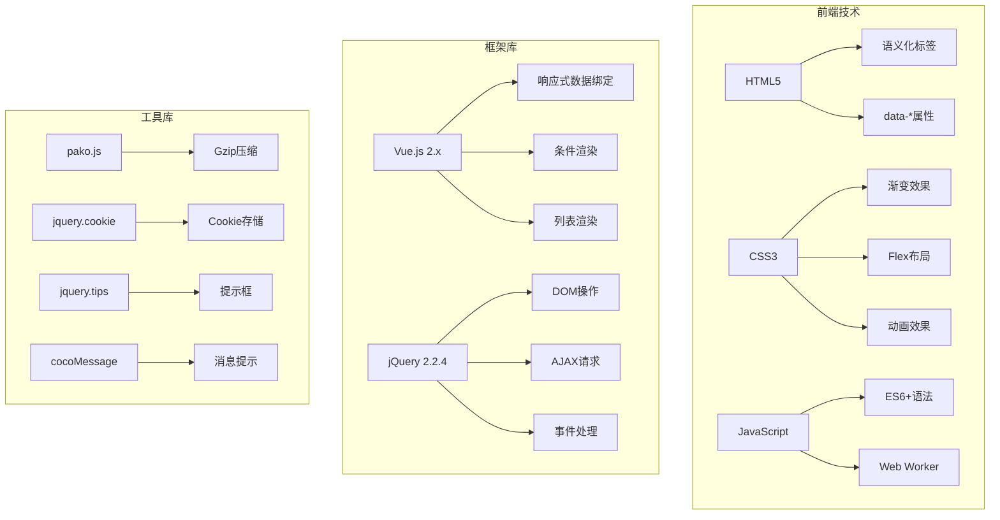

---

## 3. 模块架构

### 3.1 整体架构图

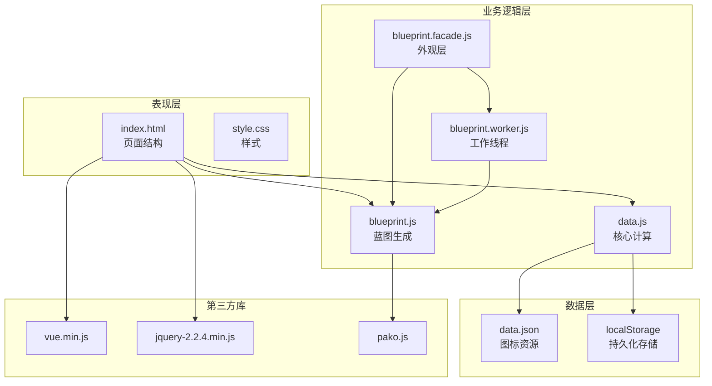

### 3.2 模块职责划分

| 模块 | 文件 | 职责 |
|------|------|------|
| **页面入口** | index.html | HTML结构、Vue模板、内联脚本 |
| **样式** | style.css | 全局样式、组件样式、动画效果 |
| **核心计算** | data.js | 配方数据、需求计算、设备配置 |
| **蓝图生成** | blueprint.js | 建筑布局、传送带网络、蓝图编码 |
| **外观层** | blueprint.facade.js | 异步接口、Worker管理 |
| **工作线程** | blueprint.worker.js | 后台计算、防止UI阻塞 |
| **图标资源** | data.json | Base64图标数据 |

---

## 4. 核心流程总览

### 4.1 应用启动流程

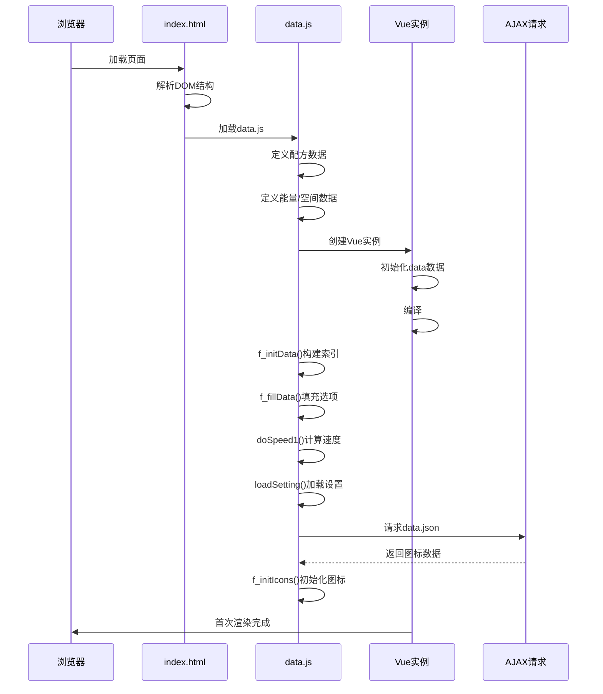

### 4.2 用户操作流程

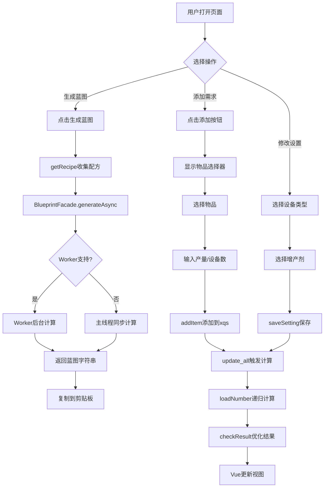

### 4.3 蓝图生成流程

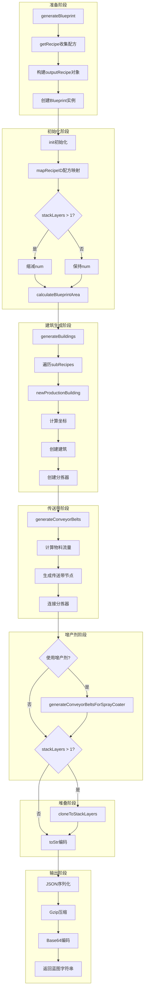

---

## 5. 模块交互详解

### 5.1 data.js 与 index.html 交互

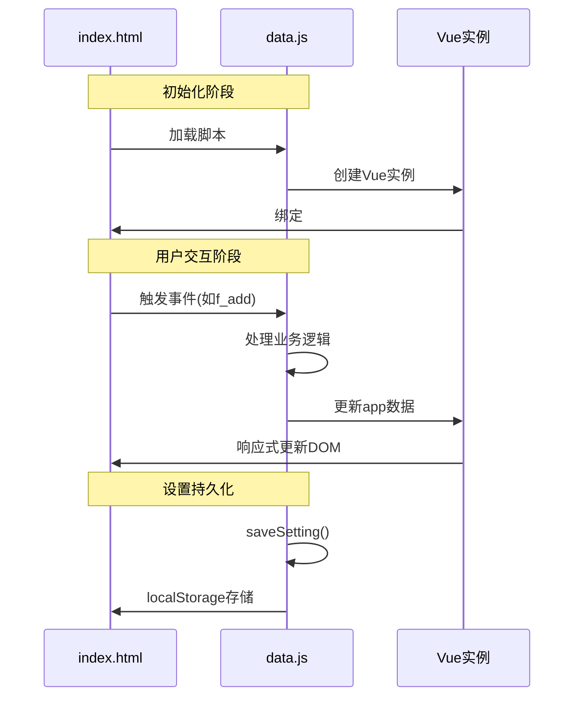

### 5.2 data.js 与 blueprint.js 交互

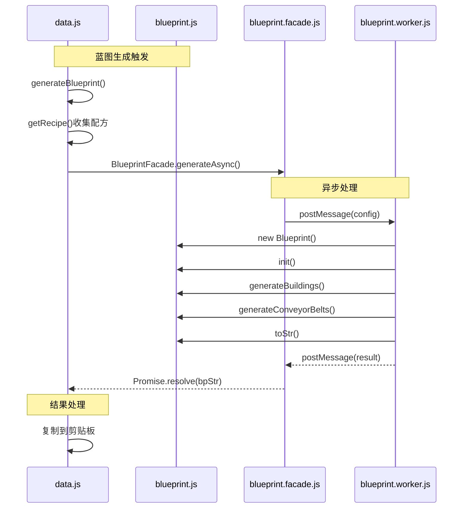

### 5.3 Vue数据绑定交互

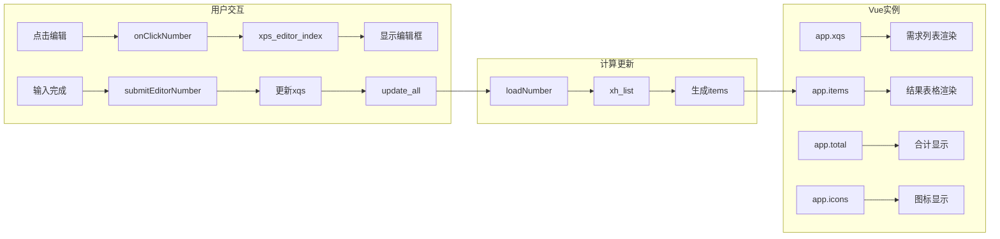

---

## 6. 数据流向

### 6.1 核心数据结构

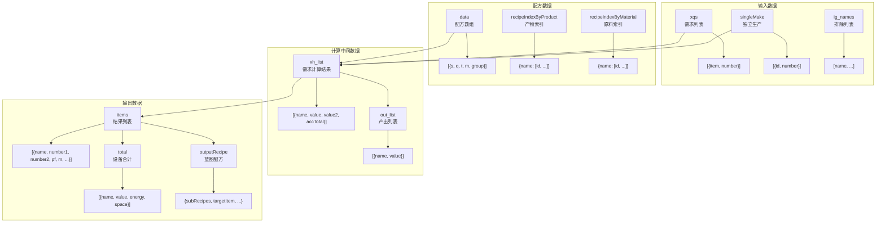

### 6.2 配方数据流转

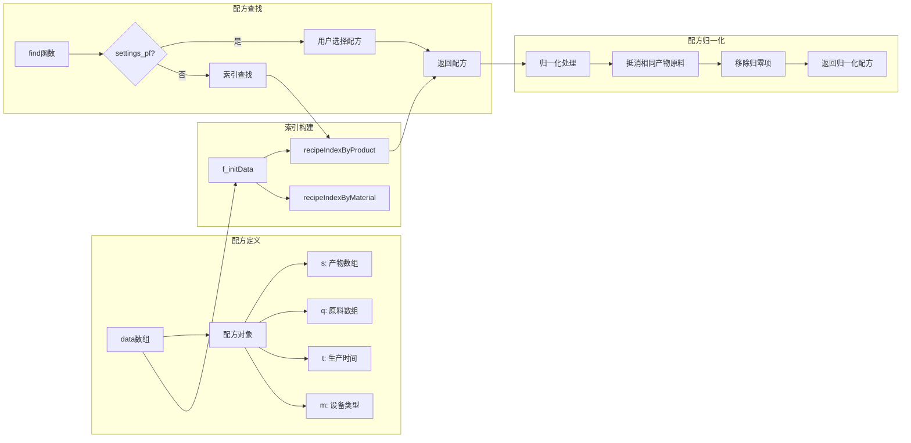

---

## 7. 关键设计模式

### 7.1 外观模式 (Facade Pattern)

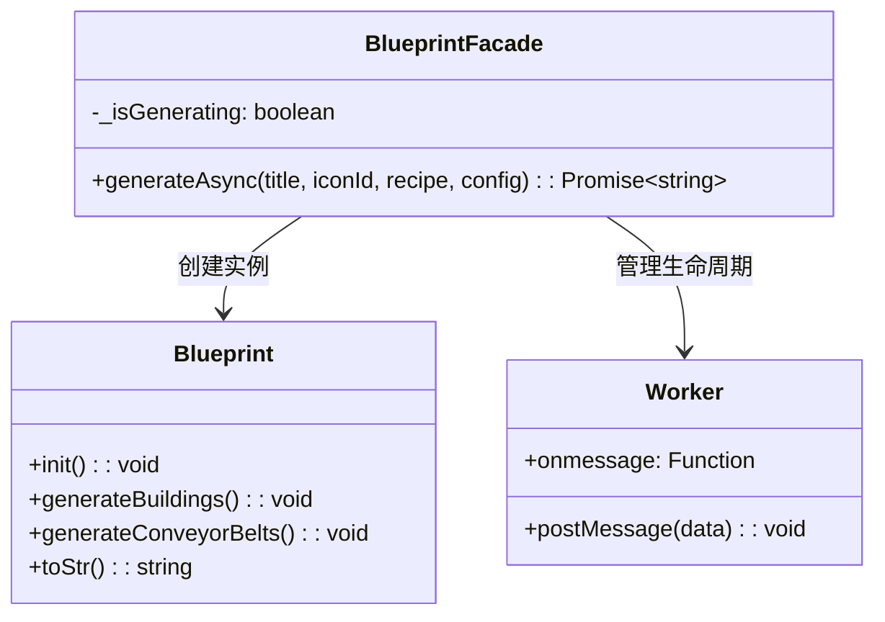

**应用场景**：
- `blueprint.facade.js` 封装了蓝图生成的复杂性
- 提供统一的异步接口 `generateAsync()`
- 自动处理 Worker 生命周期和降级逻辑

### 7.2 观察者模式 (Observer Pattern)

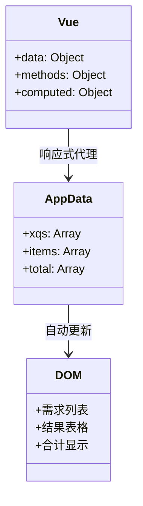

**应用场景**：
- Vue.js 的响应式数据绑定
- 数据变化自动触发视图更新
- 用户交互自动更新数据

### 7.3 策略模式 (Strategy Pattern)

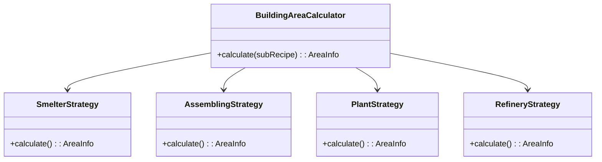

**应用场景**：
- `calculateBuildingArea()` 根据建筑类型选择不同计算策略
- 增产剂效果计算根据类型选择不同公式

### 7.4 工厂模式 (Factory Pattern)

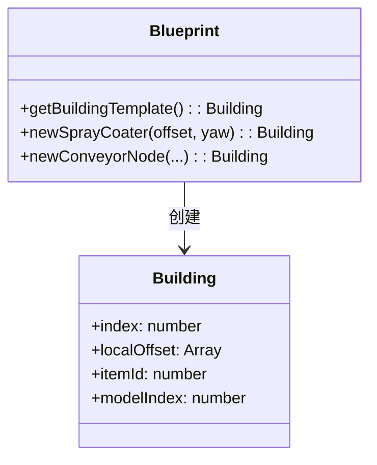

**应用场景**：
- `getBuildingTemplate()` 创建建筑模板
- `newSprayCoater()` 创建喷涂机
- `newConveyorNode()` 创建传送带节点

---

## 8. 性能优化策略

### 8.1 索引优化

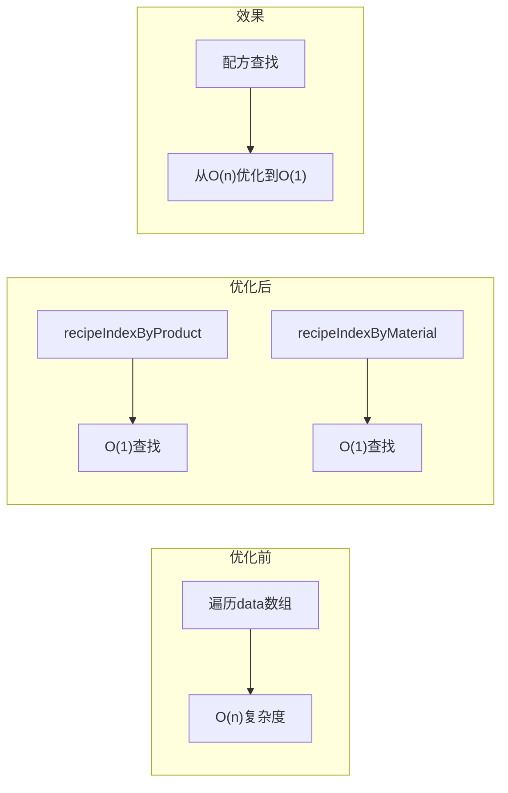

**实现代码**：
```javascript
// 构建索引
var recipeIndexByProduct = {};  // 产物名 → [配方索引数组]
var recipeIndexByMaterial = {}; // 原料名 → [配方索引数组]

function f_initData() {
    $(data).each(function (i, item) {
        // 构建产物索引
        for (var j = 0; j < item.s.length; j++) {
            var productName = item.s[j].name;
            if (!recipeIndexByProduct[productName]) {
                recipeIndexByProduct[productName] = [];
            }
            recipeIndexByProduct[productName].push(i);
        }
        // 构建原料索引
        if (item.q) {
            for (var j = 0; j < item.q.length; j++) {
                var materialName = item.q[j].name;
                if (!recipeIndexByMaterial[materialName]) {
                    recipeIndexByMaterial[materialName] = [];
                }
                recipeIndexByMaterial[materialName].push(i);
            }
        }
    });
}

// 使用索引查找
function getPfs(name) {
    var pfs = [];
    var indices = recipeIndexByProduct[name] || [];
    for (var i = 0; i < indices.length; i++) {
        var pf = $.extend(true, {}, data[indices[i]]);
        pfs.push(pf);
    }
    return pfs;
}
```

### 8.2 Web Worker 异步计算

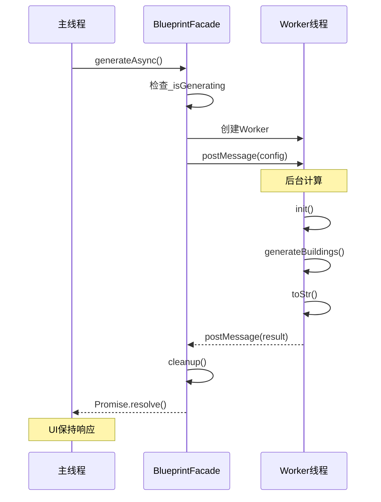

**优势**：
- 防止UI阻塞
- 提升用户体验
- 支持大蓝图生成

### 8.3 数据缓存

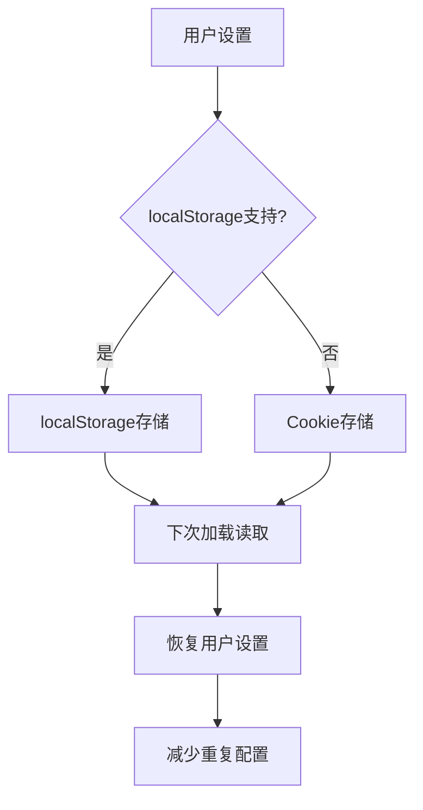

**缓存数据**：
| 缓存项 | 键名 | 说明 |
|--------|------|------|
| 设备设置 | machine_settings + version | 每个配方的设备选择 |
| 速度设置 | machine_settings_time + version | 自定义设备速度 |
| 配方设置 | machine_settings_pf + version | 用户选择的配方 |
| 方案列表 | settings_projects + version | 保存的生产方案 |

### 8.4 防抖与节流

```javascript
// 互斥锁防止重复点击
class BlueprintFacade {
    static _isGenerating = false;
    
    static generateAsync(title, iconId, recipe, config) {
        if (this._isGenerating) {
            return Promise.reject(new Error("ERR_ALREADY_RUNNING"));
        }
        this._isGenerating = true;
        
        return new Promise((resolve, reject) => {
            // ... 计算逻辑
        }).finally(() => {
            this._isGenerating = false;
        });
    }
}
```

---

## 附录：模块依赖关系图

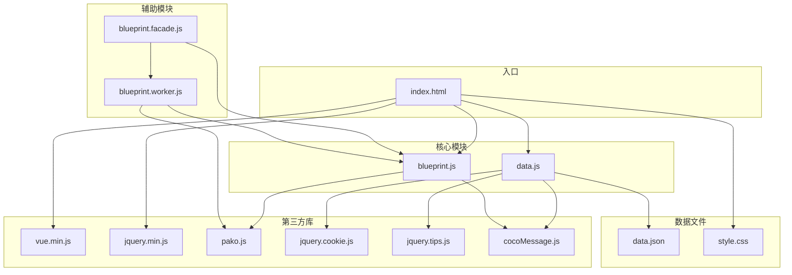
