# 蓝图堆叠模块详细说明

## 目录

- [1. 功能概述](#1-功能概述)
- [2. 核心设计原则](#2-核心设计原则)
- [3. 完整堆叠流程](#3-完整堆叠流程)
- [4. Phase 1: init() 初始化与num缩减](#4-phase-1-init-初始化与num缩减)
- [5. Phase 2: generateBuildings() 单层布局](#5-phase-2-generatebuildings-单层布局)
- [6. Phase 3: generateConveyorBelts() 传送带网络生成](#6-phase-3-generateconveyorbelts-传送带网络生成)
- [7. Phase 4: cloneToStackLayers() 克隆到高层](#7-phase-4-clonetostacklayers-克隆到高层)
- [8. 堆叠后蓝图结构](#8-堆叠后蓝图结构)
- [9. Index引用重映射机制](#9-index引用重映射机制)
- [10. 研究站Lab特殊处理](#10-研究站lab特殊处理)
- [11. 各建筑类型处理规则](#11-各建筑类型处理规则)
- [12. 非堆叠模式兼容性](#12-非堆叠模式兼容性)
- [13. 与现有功能的交互](#13-与现有功能的交互)
- [14. 产能计算验证](#14-产能计算验证)
- [附录A：代码位置速查](#附录a代码位置速查)
- [附录B：关键常量速查](#附录b关键常量速查)

---

## 1. 功能概述

每个传送带节点只能支持8个分拣器

建筑堆叠将一条平铺的产线蓝图，垂直复制到多个 z 层（z=0, 10, 20, 30），使相同产能占用更小的地表面积。

堆叠模式 ：

- 4层设备垂直堆叠

- 每层设备数量 = 普通模式/4

- 总设备数量 ≈ 普通模式

- 传送带只在一层（z=0）

- 传送带需要支撑的产能 = 普通模式

- 标注 = 普通模式

- 无线输电塔只需要在第一层铺设

预期

- 堆叠模式下，传送带最大速度和普通模式一致

- 堆叠模式传送带节点数量>=普通模式传送带

- 堆叠模式标注>=普通模式标注


堆叠模式只是将原本普通模式的设备数量重新堆叠摆放，不应该和普通模式设备数量差距过大，且传送带节点和标注同样应该和普通模式接近，堆叠模式不应该和普通模式差距太大

### 1.1 配置入口

| 配置项 | 说明 | 默认值 |
|--------|------|--------|
| `stackLayers` | 堆叠层数（1-4） | 1（不堆叠） |
| `maxLabLayers` | 研究站最大垂直堆叠层数 | 15 |

### 1.2 核心思想

```
先缩减 building.num 为 1/N，正常生成单层蓝图，再将非 Lab 建筑克隆到高层
```

### 1.3 关键特性

| 特性 | 说明 |
|------|------|
| 堆叠层间距 | 10（游戏内建筑堆叠标准间距） |
| Lab特殊处理 | num不缩减，保持完整产能 |
| 共享传送带 | 所有层共享z=0传送带网络 |

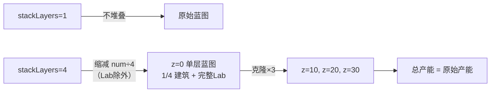

### 1.4 设计目标

| 目标 | 说明 | 状态 |
|------|------|------|
| 总产能 | 保持原始产能（如60min） | ✅ |
| 占地面积 | 减少为1/4（4层堆叠时） | ✅ |
| Lab产能 | 完整产能，不损失 | ✅ |
| 向后兼容 | stackLayers=1时行为不变 | ✅ |

---

## 2. 核心设计原则

```
堆叠功能的核心洞察（修复后）：

1. init() 智能缩减 num
   → 当num >= stackLayers时：缩减num，标记needsClone=true
   → 当num < stackLayers时：不缩减num，标记needsClone=false
   → Lab：不缩减num，标记needsClone=false
   → 示例：stackLayers=4
     - num=60 → 缩减为15，needsClone=true
     - num=3 → 保持3，needsClone=false

2. generateBuildings() 单层布局
   → 所有设备在z=0层布局
   → needsClone标记存储在建筑对象中

3. generateConveyorBelts() rate放大
   → 只有当hasStackedBuildings=true时才放大rate
   → hasStackedBuildings = (stackedBuildingCount > 0)
   → 如果所有建筑的num都 < stackLayers，则不放大rate

4. cloneToStackLayers() 智能克隆
   → 只克隆needsClone=true的建筑
   → needsClone=false的建筑保持在z=0层
   → 每层独立地基

5. 产能保持
   → 堆叠后总产能 = 原始产能
   → 不会出现设备数膨胀问题
```

---

## 3. 完整堆叠流程

### 3.1 流程总览图

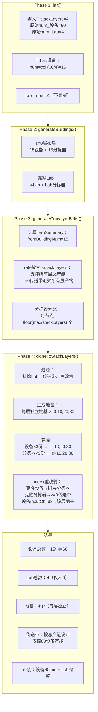

### 3.2 数据流详解

```
stackLayers=4 时的完整数据流：

┌─────────────────────────────────────────────────────────────────────────────┐
│                              核心洞察                                        │
│                                                                             │
│  1. init(): num缩减（除Lab外）→ ceil(60/4)=15                              │
│  2. generateBuildings(): 缩减为15个设备在z=0                                │
│  3. generateConveyorBelts(): rate×stackLayers放大（支撑所有层总产能）        │
│  4. cloneToStackLayers(): 复制15个×3份到高层                              │
│  5. 所有层共享z=0传送带网络                                                  │
│  6. z=0传送带支撑所有层总产能                                                │
│  7. 每层独立地基（z=0, 10, 20, 30）                                         │
│  8. Lab特殊处理：num不缩减，不克隆，在z=0层完整工作                         │
└─────────────────────────────────────────────────────────────────────────────┘
```

---

## 4. Phase 1: init() 初始化与num缩减

### 4.1 代码位置

`blueprint.js` L2048-2082

### 4.2 核心逻辑

```javascript
init() {
    this.mapRecipeID();
    
    // 堆叠模式：根据堆叠层数缩减num
    // 例如：60个设备，4层堆叠 → 每层15个设备
    // init(): num=ceil(60/4)=15
    // generateBuildings(): 15个设备在z=0
    // generateConveyorBelts(): rate×4放大（支撑4层产能）
    // cloneToStackLayers(): 复制15个设备到3层 → 总共60个设备
    // 核心：4层并行工作，总产能=60min
    //
    // 重要：研究站（Lab）特殊处理
    // - Lab 不参与克隆（布局复杂，暂不支持）
    // - Lab.num 不缩减，保持完整数量在 z=0 层工作
    // - 这样 Lab 的产能不会损失
    if (this.config.stackLayers > 1) {
      for (let subRecipe of this.recipe.subRecipes) {
        if (subRecipe.building) {
          // 排除 Lab（不缩减num，保持完整产能）
          if (buildingMap[subRecipe.building.name].category !== productionCategory.lab) {
            subRecipe.building.num = Math.ceil(
              subRecipe.building.num / this.config.stackLayers
            );
          }
        }
      }
    }
    
    this.calculateBlueprintArea();
    
    // 传送带速度配置
    if (this.config.onlyConveyorBeltMk3Downgrade) {
      buildingMap.conveyorBeltMK3.transportSpeed = 28;
    } else {
      buildingMap.conveyorBeltMK3.transportSpeed = 30;
    }
}
```

### 4.3 num缩减流程

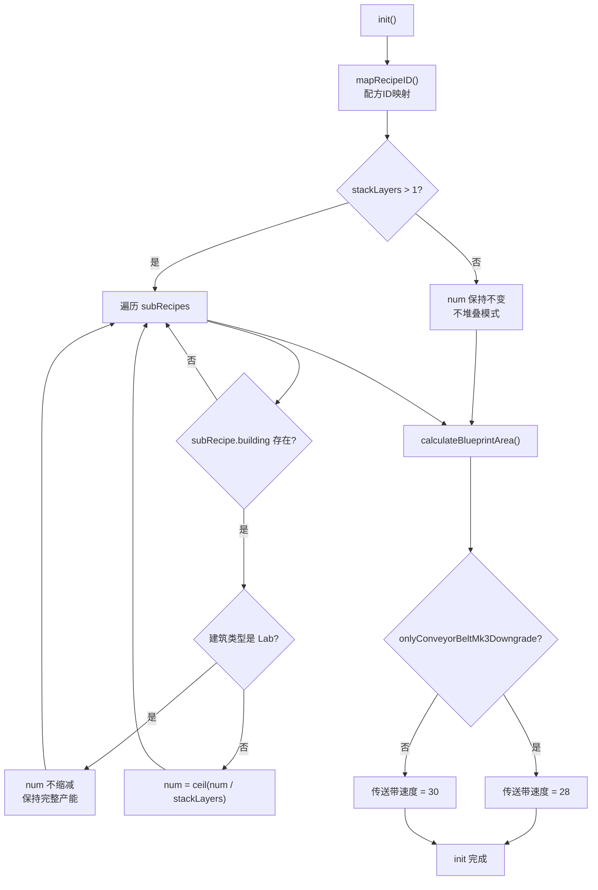

### 4.4 mapRecipeID() 详细逻辑

**代码位置**: `blueprint.js` L639-687

**功能说明**：将配方输入输出转换为配方ID，用于游戏内识别生产配方。

```javascript
mapRecipeID() {
    for (let subRecipe of this.recipe.subRecipes) {
        if (!subRecipe.input) {
            // 原料（无输入），跳过
            continue;
        }
        
        // Step 1: 拼接配方字符串
        let recipeStr = "";
        let isFirst = true;
        
        // 拼接输入物品（用+连接）
        for (let item of subRecipe.input) {
            if (isFirst) {
                recipeStr = item.name;
                isFirst = false;
            } else {
                recipeStr += "+" + item.name;
            }
        }
        
        // 拼接输出物品（用=分隔输入输出）
        isFirst = true;
        for (let item of subRecipe.output) {
            if (isFirst) {
                recipeStr += "=" + item.name;
                isFirst = false;
            } else {
                recipeStr += "+" + item.name;
            }
        }
        
        // Step 2: 查找配方ID
        if (!recipeMap[recipeStr] || recipeMap[recipeStr] === -1) {
            cocoMessage.warning(
                `包含不支持的配方: ${recipeStr.replace("=", "->")}`,
                5000
            );
            throw `unknown recipe - ${recipeStr}`;
        }
        
        // Step 3: 特殊配方警告
        if ([58, 121].includes(recipeMap[recipeStr])) {
            // 58: X射线裂解(制氢) - 需要精炼油启动
            // 121: 重整精炼(制精炼油) - 需要氢启动
            cocoMessage.warning(
                `X射线裂解(制氢)与重整精炼(制精炼油)可能需手动提供初始启动的精炼油/氢`,
                5000
            );
        }
        
        subRecipe.recipeID = recipeMap[recipeStr];
    }
}
```

**配方字符串格式**：

```
格式: input1+input2+...=output1+output2+...

示例:
  铁矿→铁块: "ironOre=ironIngot"
  铁矿+铜矿→齿轮: "ironOre+copperOre=gear"
  原油→精炼油+氢: "oil=refinedOil+hydrogen"
```

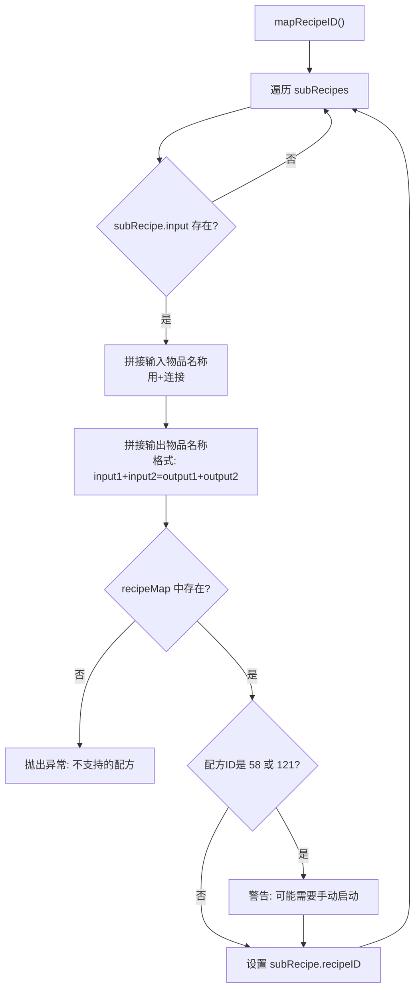

**特殊配方说明**：

| 配方ID | 配方名称 | 特殊处理原因 |
|--------|---------|-------------|
| 58 | X射线裂解(制氢) | 需要精炼油作为启动原料 |
| 121 | 重整精炼(制精炼油) | 需要氢作为启动原料 |

### 4.5 calculateBlueprintArea() 面积计算

**代码位置**: `blueprint.js` L1034-1051

**功能说明**：根据所有建筑的占地面积计算蓝图总尺寸，初始化占用区域跟踪。

```javascript
calculateBlueprintArea() {
    let totalArea = 0;
    
    // Step 1: 累加所有建筑占地
    // 注意：此时 num 已经是缩减后的值
    for (let subRecipe of this.recipe.subRecipes) {
        if (!subRecipe.building) {
            continue;
        }
        totalArea +=
            this.calculateBuildingArea(subRecipe).area *
            Math.ceil(subRecipe.building.num);
    }
    
    // Step 2: 根据长宽比计算尺寸
    // 使用 sqrt 计算正方形基准，再按比例调整
    let y = Math.ceil(Math.sqrt(totalArea / this.config.x_y_ratio));
    this.blueprintSize = {
        x: Math.ceil(this.config.x_y_ratio * y),
        y: y,
    };
    
    // Step 3: 初始化占用区域
    // occupiedArea 用于跟踪已放置建筑的位置
    // 格式: [{x1, y1, x2, y2}, ...]
    // x1,y1: 左上角坐标, x2,y2: 右下角坐标
    this.occupiedArea = [{ 
        x1: -1, 
        y1: -1, 
        x2: this.blueprintSize.x, 
        y2: -1 
    }];
}
```

**面积计算公式**：

```
totalArea = Σ(buildingArea × num)

其中:
  buildingArea = 根据建筑类型查表获取
  num = 缩减后的建筑数量（堆叠模式）

蓝图尺寸计算:
  y = ceil(sqrt(totalArea / x_y_ratio))
  x = ceil(x_y_ratio × y)
```

**occupiedArea 结构说明**：

```
occupiedArea 数组用于跟踪已放置建筑的位置：

初始状态:
  occupiedArea = [{x1: -1, y1: -1, x2: blueprintSize.x, y2: -1}]
  
添加建筑后:
  occupiedArea[0] = 当前行的占用范围
  occupiedArea[1] = 上一行的占用范围（用于计算新行y坐标）
  occupiedArea[n] = 第n行的占用范围

每个元素:
  x1: 该行最左侧x坐标
  y1: 该行最上方y坐标
  x2: 该行最右侧x坐标
  y2: 该行最下方y坐标
```

### 4.6 calculateBuildingArea() 建筑面积计算

**代码位置**: `blueprint.js` L963-1032

**功能说明**：根据建筑类型和配置计算单个建筑的占地面积、尺寸和中心点偏移。

```javascript
calculateBuildingArea(subRecipe) {
    // 计算某个配方中单个生产建筑的占地面积
    if (!subRecipe.building) {
        return { area: 0, x: 0, y: 0, centerPoint: [0, 0, 0, 0] };
    }
    
    switch (buildingMap[subRecipe.building.name].category) {
        case productionCategory.smelter:
            // 熔炉：根据输入输出数量决定布局
            // 输入输出≤2时使用紧凑布局，否则使用扩展布局
            if (subRecipe.output.length + subRecipe.input.length <= 2) {
                return {
                    area: 12,
                    x: 3,
                    y: 4,
                    centerPoint: [2, 1, 1, 1],
                    yaw: [0, 0]
                };
            } else {
                return {
                    area: 16,
                    x: 4,
                    y: 4,
                    centerPoint: [2, 2, 1, 1],
                    yaw: [0, 0]
                };
            }
        case productionCategory.assembling:
            // 制造台：固定4x4布局
            return { area: 16, x: 4, y: 4, centerPoint: [2, 2, 1, 1], yaw: [0, 0] };
        case productionCategory.plant:
            // 化工厂：8x6布局
            return { area: 48, x: 8, y: 6, centerPoint: [2, 4, 3, 3], yaw: [0, 0] };
        case productionCategory.refinery:
            // 精炼厂：紧凑布局7x5，标准布局8x5
            if (this.config.compactLayout) {
                return {
                    area: 30,
                    x: 7,
                    y: 5,
                    centerPoint: [2, 3, 2, 3],
                    yaw: [90, 90]  // 旋转90度
                };
            }
            return {
                area: 40,
                x: 8,
                y: 5,
                centerPoint: [2, 3, 2, 4],
                yaw: [90, 90]
            };
        case productionCategory.collider:
            // 对撞机：紧凑布局11x6，标准布局11x7
            if (this.config.compactLayout) {
                return {
                    area: 66,
                    x: 11,
                    y: 6,
                    centerPoint: [3, 5, 2, 5],
                    yaw: [0, 0]
                };
            }
            return {
                area: 77,
                x: 11,
                y: 7,
                centerPoint: [3, 5, 3, 5],
                yaw: [0, 0]
            };
        case productionCategory.lab:
            // 研究站：7x6布局
            return { area: 42, x: 7, y: 6, centerPoint: [3, 3, 2, 3], yaw: [0, 0] };
        default:
            throw `unknown production build type - ${
                buildingMap[subRecipe.building.name].type
            }`;
    }
}
```

**centerPoint 说明**：

```
centerPoint: [y负边界距离, x正边界距离, y正边界距离, x负边界距离]

建筑中心点到四个边界的距离：
  [0]: y轴负边界（上方）距离
  [1]: x轴正边界（右侧）距离
  [2]: y轴正边界（下方）距离
  [3]: x轴负边界（左侧）距离

例如：centerPoint: [2, 2, 1, 1]
      表示建筑中心点到：
      - y轴负边界（上方）: 2格
      - x轴正边界（右侧）: 2格
      - y轴正边界（下方）: 1格
      - x轴负边界（左侧）: 1格
      总占地: (2+1) × (2+1) = 3×3
```

**建筑面积速查表**：

| 建筑类型 | 面积 | 尺寸(x×y) | centerPoint | yaw | 备注 |
|---------|------|----------|-------------|-----|------|
| 熔炉(≤2槽) | 12 | 3×4 | [2,1,1,1] | [0,0] | 紧凑布局 |
| 熔炉(>2槽) | 16 | 4×4 | [2,2,1,1] | [0,0] | 扩展布局 |
| 制造台 | 16 | 4×4 | [2,2,1,1] | [0,0] | 固定布局 |
| 化工厂 | 48 | 8×6 | [2,4,3,3] | [0,0] | 固定布局 |
| 精炼厂(紧凑) | 30 | 7×5 | [2,3,2,3] | [90,90] | 旋转90° |
| 精炼厂(标准) | 40 | 8×5 | [2,3,2,4] | [90,90] | 旋转90° |
| 对撞机(紧凑) | 66 | 11×6 | [3,5,2,5] | [0,0] | - |
| 对撞机(标准) | 77 | 11×7 | [3,5,3,5] | [0,0] | - |
| 研究站 | 42 | 7×6 | [3,3,2,3] | [0,0] | 支持垂直堆叠 |

### 4.7 数据示例

```
输入参数：
  - 设备原始 num = 60
  - Lab 原始 num = 4
  - stackLayers = 4

处理结果：
  ┌─────────────────────────────────────────┐
  │ 设备 num = ceil(60/4) = 15             │
  │   → z=0 层 15 个，克隆 3 份到高层       │
  │   → 总设备数 = 15 × 4 = 60             │
  │   → 总产能 = 60min                      │
  │                                         │
  │ Lab num = 4（保持不变）                  │
  │   → 只在 z=0 层                         │
  │   → 完整 4 个 Lab 工作                  │
  │   → 产能不损失                          │
  └─────────────────────────────────────────┘
```

### 4.8 关键点

| 关键点 | 说明 |
|--------|------|
| `Math.ceil` | 向上取整保证每层至少 1 个建筑 |
| **Lab 不缩减** | Lab.num 保持完整，产能不损失 |
| 时机 | 缩减在 `calculateBlueprintArea()` 之前 |
| 面积计算 | 使用缩减后的 num 计算蓝图面积 |

---

## 5. Phase 2: generateBuildings() 单层布局

### 5.1 代码位置

`blueprint.js` L2832-2839

### 5.2 核心逻辑

```javascript
generateBuildings() {
    for (let subRecipe of this.recipe.subRecipes) {
      if (subRecipe.building === null) {
        continue;
      }
      this.newProductionBuilding(subRecipe);
    }
}
```

### 5.3 布局流程

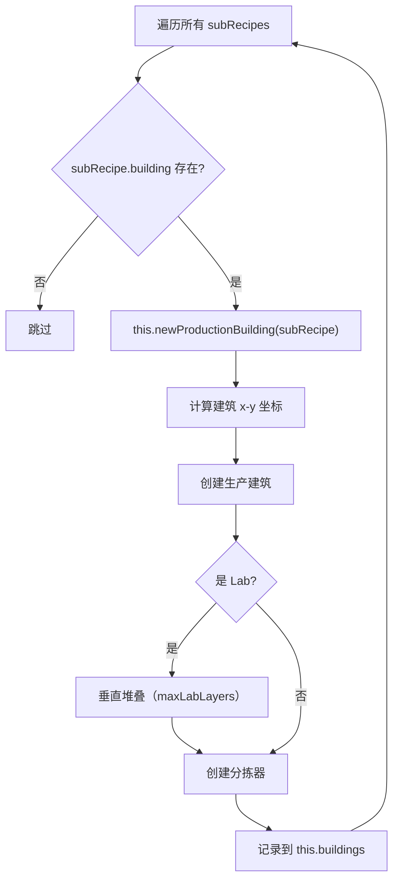

### 5.4 newProductionBuilding() 详细流程

**代码位置**: `blueprint.js` L1520-1998

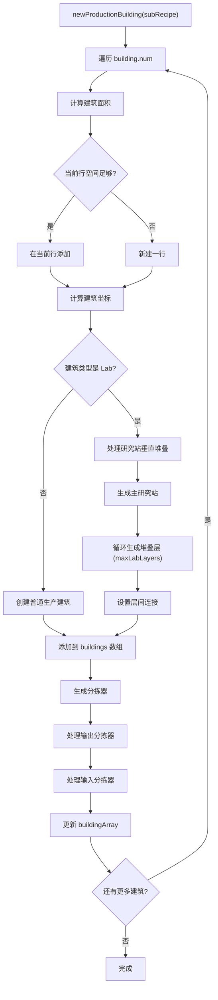

### 5.5 建筑坐标计算逻辑

```javascript
// 判断是否需要新建一行
if (this.blueprintSize.x - this.occupiedArea[this.occupiedArea.length - 1].x2 >= buildingArea.x / 2) {
    // 在当前行继续添加
    buildingX = this.occupiedArea[this.occupiedArea.length - 1].x2 + 1 + buildingArea.centerPoint[3];
    buildingY = this.occupiedArea[this.occupiedArea.length - 2].y2 + 1 + buildingArea.centerPoint[0];
    buildingZ = 0;
    
    // 更新占用区域
    this.occupiedArea[this.occupiedArea.length - 1].x2 += buildingArea.x;
    
    // 如果新建筑更宽，更新y2
    if (buildingY + buildingArea.centerPoint[2] > this.occupiedArea[this.occupiedArea.length - 1].y2) {
        this.occupiedArea[this.occupiedArea.length - 1].y2 = buildingY + buildingArea.centerPoint[2];
    }
} else {
    // 新建一行
    buildingX = buildingArea.centerPoint[3];
    buildingY = buildingArea.centerPoint[0] + this.occupiedArea[this.occupiedArea.length - 1].y2 + 1;
    buildingZ = 0;
    
    // 添加新的占用区域记录
    this.occupiedArea.push({
        x1: 0,
        y1: buildingY - buildingArea.centerPoint[0],
        x2: buildingX + buildingArea.centerPoint[1],
        y2: buildingY + buildingArea.centerPoint[2],
    });
}
```

### 5.6 研究站垂直堆叠处理

```javascript
if (buildingMap[subRecipe.building.name].category === productionCategory.lab) {
    // 设置研究站特殊参数
    newBuilding.outputToSlot = 14;
    newBuilding.inputFromSlot = 15;
    newBuilding.outputFromSlot = 15;
    newBuilding.inputToSlot = 14;
    newBuilding.parameters.researchMode = 1;
    
    this.buildings.push(newBuilding);
    
    // 堆叠处理研究站
    for (i++; i < subRecipe.building.num && layers < this.config.maxLabLayers; i++, layers++) {
        let labBuilding = this.getBuildingTemplate();
        
        // 设置z坐标（每层3格高度）
        labBuilding.localOffset[0].z = buildingMap.lab.height * layers;
        labBuilding.localOffset[1].z = buildingMap.lab.height * layers;
        
        // 连接到下一层
        labBuilding.inputObjIdx = this.buildingIndex - 1;
        labBuilding.outputToSlot = 14;
        labBuilding.inputFromSlot = 15;
        labBuilding.outputFromSlot = 15;
        labBuilding.inputToSlot = 14;
        
        this.buildings.push(labBuilding);
        stackLabBuildingIndexList.push(this.buildingIndex);
    }
    i--;  // 回退循环变量
}
```

### 5.7 分拣器生成逻辑

**代码位置**: `blueprint.js` L1650-1998

```javascript
// 计算实际速率
let extra_rate = 1;
if (this.recipe.proliferator) {
    if (subRecipe.acceleratorMode === 0) {
        // 增产模式
        extra_rate += itemMap[this.recipe.proliferator].extra_rate;
    } else if (subRecipe.acceleratorMode === 1) {
        // 加速模式
        extra_rate += itemMap[this.recipe.proliferator].accelerate;
    }
}

// 处理输出分拣器
for (let outputItem of subRecipe.output) {
    let actual_rate = outputItem.rate * productionSpeed * actual_building_num * extra_rate;
    
    // 选择分拣器等级
    let sorter = buildingMap.sorterMk1;
    if (this.config.useSorterMk4 || this.config.onlySorterMk3 || actual_rate > sorter.sortingSpeed) {
        sorter = this.config.useSorterMk4 ? buildingMap.sorterMk4 : buildingMap.sorterMk3;
    }
    
    // 研究站层数过高时追加额外分拣器
    if (buildingMap[subRecipe.building.name].category === productionCategory.lab && 
        actual_rate > sorter.sortingSpeed) {
        // 创建额外分拣器处理溢出
        let newSorter2 = this.getBuildingTemplate();
        // ... 设置分拣器参数
        actual_rate -= sorter.sortingSpeed;
    }
    
    // 创建主分拣器
    let newSorter = this.getBuildingTemplate();
    newSorter.itemId = sorter.itemId;
    newSorter.modelIndex = sorter.modelIndex;
    newSorter.inputObjIdx = nowBuildingIndex;
    newSorter.outputToSlot = -1;
    newSorter.inputToSlot = 1;
    newSorter.inputFromSlot = slotIndex;
    newSorter.filterId = itemMap[outputItem.name].iconId;
    newSorter.parameters = { length: 1 };
    
    // 计算分拣器位置
    const offsetInfo = this.calculateSorterLocalOffsetAndYaw(
        { x: buildingX, y: buildingY, z: buildingZ },
        buildingMap[subRecipe.building.name].category,
        slotIndex
    );
    newSorter.localOffset = offsetInfo.offset;
    newSorter.yaw = offsetInfo.yaw;
    
    this.buildings.push(newSorter);
    
    // 记录分拣器信息
    if (this.sorters[outputItem.name]) {
        this.sorters[outputItem.name].output.push({
            index: newSorter.index,
            rate: actual_rate,
            ownerObjIdx: nowBuildingIndex,
            ownerName: subRecipe.building.name,
            ownerOffset: { x: buildingX, y: buildingY, z: buildingZ },
            recipeID: parseInt(subRecipe.recipeID),
        });
    } else {
        this.sorters[outputItem.name] = {
            output: [{ ... }]
        };
    }
    
    slotIndex--;
}
```

### 5.8 z=0层布局结构

```
           y轴
            ↑
     ┌──────────────────────────────────────────────────────┐
     │                                                      │
     │   [Lab 垂直堆叠区]                                   │
     │   ┌─────┐                                           │
     │   │Lab1 │ z=0                                       │
     │   │Lab2 │ z=3                                       │
     │   │Lab3 │ z=6                                       │
     │   │Lab4 │ z=9                                       │
     │   └─────┘                                           │
     │                                                      │
     │   [Lab 分拣器区]                                    │
     │   ┌─────────────────┐                               │
     │   │[Lab 分拣器 1-4]│                               │
     │   └─────────────────┘                               │
     │                                                      │
     │   [生产设备区]                                      │
     │   ┌─────────────────────────────────────────┐       │
     │   │ [设备1]→[分拣器1]                       │       │
     │   │ [设备2]→[分拣器2]                       │       │
     │   │ [设备3]→[分拣器3]                       │       │
     │   │ ...                                     │       │
     │   │ [设备15]→[分拣器15]                     │       │
     │   └─────────────────────────────────────────┘       │
     │                                                      │
     └──────────────────────────────────────────────────────┘
                              → x轴
```

### 5.9 布局特点

| 区域 | 设备数量 | 堆叠方式 |
|------|---------|---------|
| 生产设备区 | 15 | 单层 z=0 布局 |
| 分拣器区 | 15 | 跟随对应设备 |
| Lab 区 | 4 | 垂直堆叠（z=0,3,6,9） |
| Lab 分拣器 | 4 | 跟随对应 Lab |

---

## 6. Phase 3: generateConveyorBelts() 传送带网络生成

### 6.1 代码位置

`blueprint.js` L2265-2654

### 6.2 处理步骤总览

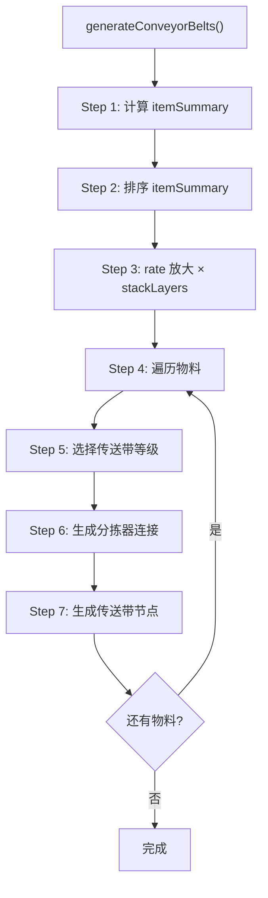

### 6.3 Step 1: 计算 itemSummary

**代码位置**: `blueprint.js` L2265-2375

```javascript
let itemSummary = {};

for (let subRecipe of this.recipe.subRecipes) {
    let extra_rate = 1;
    if (this.recipe.proliferator) {
        if (subRecipe.acceleratorMode === 0) {
            extra_rate += itemMap[this.recipe.proliferator].extra_rate;
        } else if (subRecipe.acceleratorMode === 1) {
            extra_rate += itemMap[this.recipe.proliferator].accelerate;
        }
    }
    
    // 处理输出
    for (let outputItem of subRecipe.output) {
        let outputRate = 0;
        let fromBuildingNum = 0;
        
        if (subRecipe.input === null) {
            outputRate = outputItem.rate;  // 原料
        } else {
            if (buildingMap[subRecipe.building.name].category === productionCategory.lab) {
                // 研究站可堆叠，需特殊处理
                fromBuildingNum = Math.ceil(
                    subRecipe.building.num / this.config.maxLabLayers
                );
            } else {
                // 堆叠模式：fromBuildingNum 是缩减后的值
                fromBuildingNum = subRecipe.building.num;  // 15
            }
            outputRate = outputItem.rate * 
                buildingMap[subRecipe.building.name].productionSpeed * 
                subRecipe.building.num *   // 15（缩减后）
                extra_rate;
        }
        
        if (itemSummary[outputItem.name]) {
            itemSummary[outputItem.name].fromBuildingNum += fromBuildingNum;
            itemSummary[outputItem.name].rate += outputRate;
        } else {
            itemSummary[outputItem.name] = {
                rate: outputRate,
                fromBuildingNum: fromBuildingNum,
                toBuildingNum: 0,
            };
        }
    }
    
    // 处理输入（略，与不堆叠模式相同）
}
```

### 6.4 itemSummary 数据结构

```
itemSummary 数据结构：
{
  itemName: {
    rate: Number,           // 产出速率（堆叠模式：单层速率）
    inputRate: Number,      // 消耗速率
    fromBuildingNum: Number,  // 产出建筑数量（缩减后）
    toBuildingNum: Number,    // 消耗建筑数量
    needProliferator: Boolean // 是否需要增产剂
  }
}
```

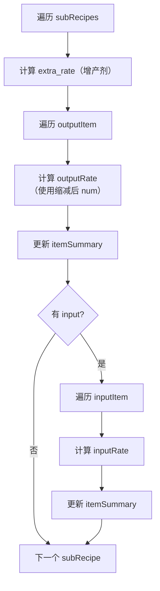

### 6.5 Step 2: 排序 itemSummary

**代码位置**: `blueprint.js` L2228-2264

```javascript
sortItemSummary(itemSummary) {
    let newSummary = {};
    let proliferator = ['proliferatorMk3', 'proliferatorMk2', 'proliferatorMk1'];
    let outItem = ['refinedOil', 'hydrogen', 'graphene', 'deuterium'];
    
    // 1. 增产剂（取最高等级）
    for (let key in proliferator) {
        if (itemSummary[proliferator[key]] && itemSummary[proliferator[key]].toBuildingNum === 0) {
            newSummary[proliferator[key]] = itemSummary[proliferator[key]];
            break;
        }
    }
    
    // 2. 原料（fromBuildingNum === 0）
    for (let key in itemSummary) {
        if (itemSummary[key].fromBuildingNum === 0) {
            newSummary[key] = itemSummary[key];
        }
    }
    
    // 3. 终产物（toBuildingNum === 0）
    for (let key in itemSummary) {
        if (itemSummary[key].toBuildingNum === 0) {
            newSummary[key] = itemSummary[key];
        }
    }
    
    // 4. 多余产物（精炼油、氢、石墨烯、重氢）
    for (let key in outItem) {
        if (itemSummary[outItem[key]] &&
            itemSummary[outItem[key]].fromBuildingNum - itemSummary[outItem[key]].toBuildingNum > 0) {
            newSummary[outItem[key]] = itemSummary[outItem[key]];
        }
    }
    
    // 5. 其余中间产物
    for (let key in itemSummary) {
        if (itemSummary[key].toBuildingNum !== 0 && itemSummary[key].fromBuildingNum !== 0) {
            newSummary[key] = itemSummary[key];
        }
    }
    
    return newSummary;
}
```

**排序优先级**：

| 优先级 | 类型 | 判断条件 |
|--------|------|----------|
| 1 | 增产剂 | `toBuildingNum === 0` |
| 2 | 原料 | `fromBuildingNum === 0` |
| 3 | 终产物 | `toBuildingNum === 0` |
| 4 | 多余产物 | `fromBuildingNum - toBuildingNum > 0` |
| 5 | 中间产物 | 其他 |

### 6.6 Step 3: rate 放大逻辑（核心）

**代码位置**: `blueprint.js` L2378-2412

```javascript
// 堆叠模式：传送带需要支撑所有堆叠层的总产能
// z=0 传送带汇聚所有层的产物，需要按总产能设计
// 例如：4层堆叠，每层15设备 → 总共60设备 → 传送带按60设备产能设计
const stackLayers = this.config.stackLayers || 1;
if (stackLayers > 1) {
    // Step 3.1: 放大 itemSummary.rate
    for (let key in itemSummary) {
        itemSummary[key].rate *= stackLayers;
        if (itemSummary[key].inputRate !== undefined) {
            itemSummary[key].inputRate *= stackLayers;
        }
    }
    
    // Step 3.2: 放大分拣器 rate
    // 分拣器 rate 也需要放大，与 item.rate 匹配
    // 这样传送带容量设计才能正确
    for (let itemName in this.sorters) {
        if (this.sorters[itemName].output) {
            for (let s of this.sorters[itemName].output) {
                s.rate *= stackLayers;
            }
        }
        if (this.sorters[itemName].input) {
            for (let s of this.sorters[itemName].input) {
                s.rate *= stackLayers;
            }
        }
    }
}
```

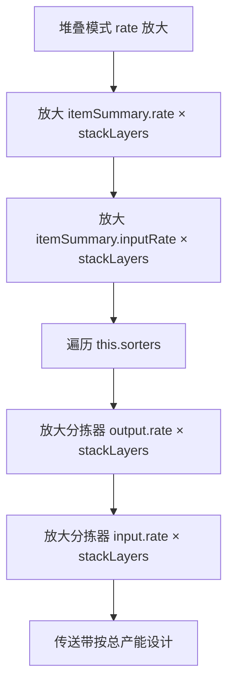

### 6.7 数据示例

```
设备（stackLayers=4）：
  原始：fromBuildingNum=15, rate=baseRate×15
  放大：rate = baseRate×15×4 = baseRate×60
  → 传送带按 60 设备总产能设计
  → z=0 传送带汇聚所有层产物

Lab（stackLayers=4）：
  原始：fromBuildingNum=4, rate=LabRate×4
  放大：rate = LabRate×4×4 = LabRate×16
  → Lab 传送带按放大后产能设计
```

### 6.8 Step 4: 分拣器分配策略

**代码位置**: `blueprint.js` L2408-2412

```javascript
// 堆叠模式：z=0 层每个传送带节点的分拣器在 cloneToStackLayers 后被克隆 stackLayers 倍
// 为保证克隆后每节点不超过 maxSorterNumOneBelt，z=0 层每节点只分配 floor(max/stackLayers) 个
// 例：stackLayers=4, max=8 → z=0 每节点 2 个分拣器 → 克隆后 2×4=8 ≤ 8
const sortersPerNode = stackLayers > 1
    ? Math.max(1, Math.floor(this.config.maxSorterNumOneBelt / stackLayers))
    : this.config.maxSorterNumOneBelt;
```

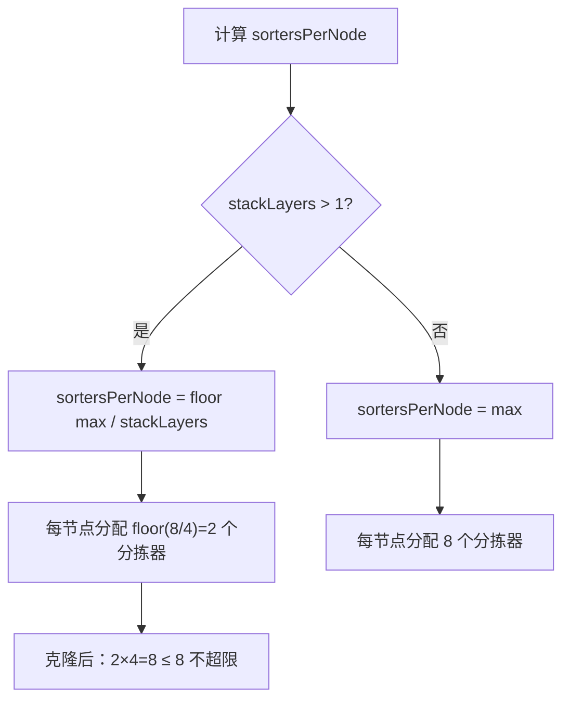

### 6.9 Step 5: 传送带等级选择

```javascript
let conveyorBelt = buildingMap.conveyorBeltMk1;

if (this.config.onlyConveyorBeltMk3) {
    // 强制使用三级传送带
    conveyorBelt = buildingMap.conveyorBeltMK3;
} else if (item.rate >= conveyorBelt.transportSpeed) {
    if (item.rate === conveyorBelt.transportSpeed && this.config.upgradeConveyorBelt) {
        // 刚好满带且配置升级
        conveyorBelt = buildingMap.conveyorBeltMK3;
    } else if (item.rate > conveyorBelt.transportSpeed) {
        // 超过一级带运力
        conveyorBelt = buildingMap.conveyorBeltMK3;
    }
}

// 原料可以堆叠
let maxTransportSpeed = buildingMap.conveyorBeltMK3.transportSpeed;
if (item.fromBuildingNum === 0) {
    maxTransportSpeed = buildingMap.conveyorBeltMK3.transportSpeed * this.config.conveyorBeltStackLayer;
}
```

### 6.10 Step 6: 生成分拣器连接

```javascript
for (let totalDoneRate = 0; item.rate - totalDoneRate > zero; ) {
    let needSprayCoater = item.needProliferator;
    let doneRate = 0;
    let parameters = null;
    let inputRate = Math.min(maxTransportSpeed, item.rate - totalDoneRate);
    let inputData = [];
    let outputData = [];
    let doneSorterNum = 0;
    
    // 安全退出防止死循环
    if (item.fromBuildingNum !== 0 && this.sorters[itemName].output.length === 0) {
        break;
    }
    if (item.fromBuildingNum === 0 && item.toBuildingNum !== 0 &&
        this.sorters[itemName].input && this.sorters[itemName].input.length === 0) {
        break;
    }
    
    // 处理输出分拣器
    if (item.fromBuildingNum !== 0) {
        for (let j = this.sorters[itemName].output.length - 1; j >= 0; j--) {
            if (this.sorters[itemName].output[j].rate - inputRate > zero) {
                break;
            }
            if ((doneSorterNum + 1) % sortersPerNode === 0 || doneSorterNum === 0) {
                inputData.push([this.sorters[itemName].output[j].index]);
            } else {
                inputData[inputData.length - 1].push(
                    this.sorters[itemName].output[j].index
                );
            }
            inputRate -= this.sorters[itemName].output[j].rate;
            doneRate += this.sorters[itemName].output[j].rate;
            this.sorters[itemName].output.pop();
            doneSorterNum++;
        }
    } else {
        // 原料
        inputData.push([]);
        parameters = {
            iconId: itemMap[itemName].iconId,
            count: (inputRate * 60).toFixed(0),
        };
        doneRate += inputRate;
    }
    
    totalDoneRate += doneRate;
    // ... 处理输入分拣器
}
```

### 6.11 Step 7: 生成传送带节点

```javascript
let direction = 1; // y轴正方向，用于终产物和中间产物
if (item.fromBuildingNum === 0) {
    direction = -1; // y轴负方向，用于原料
}

this.newConveyor(
    conveyorBelt,
    direction,
    inputData,
    outputData,
    parameters,
    needSprayCoater
);
```

**传送带方向说明**：

| 物料类型 | direction | 说明 |
|----------|-----------|------|
| 原料 | -1 | y轴负方向（向下） |
| 产物 | 1 | y轴正方向（向上） |

### 6.12 newConveyor() 传送带生成详解

**代码位置**: `blueprint.js` L751-949

**功能说明**：生成一条完整的传送带链路，包含多个节点，连接分拣器。

```javascript
newConveyor(
    conveyor,        // 传送带类型（MK1/MK3）
    direction,       // 方向：1=y轴正方向，-1=y轴负方向
    inputData,       // 输入分拣器index数组 [[idx1,idx2], [idx3], ...]
    outputData,      // 输出分拣器index数组 [[idx1,idx2], [idx3], ...]
    parameters,      // 参数（原料/终产物的图标和数量）
    needSprayCoater  // 是否需要喷涂机
) {
    // Step 1: 初始化坐标
    let buildingX = this.occupiedArea[this.occupiedArea.length - 1].x2 + 1;
    let buildingY = this.occupiedArea[this.occupiedArea.length - 2].y2;
    let buildingZ = 0;
    
    // Step 2: 生成输入节点（连接输出分拣器）
    for (let i = 0; i < inputData.length; i++) {
        if (direction < 0) break;  // 原料带不需要输入节点
        
        buildingY += 1;
        // 创建传送带节点
        this.buildings.push(
            this.newConveyorNode(
                { x: buildingX, y: buildingY, z: buildingZ },
                [0, 0],
                conveyor,
                this.buildingIndex + 2,  // 指向下一个节点
                1,
                null
            )
        );
        
        // 修改分拣器的outputObjIdx指向此节点
        for (let b of this.buildings) {
            if (inputData[i].includes(b.index)) {
                b.outputObjIdx = this.buildingIndex;
            }
        }
    }
    
    // Step 3: 生成输出节点（连接输入分拣器）
    for (let i = 0; i < outputData.length; i++) {
        buildingY += 1;
        let nodeYaw = direction < 0 ? [180, 180] : [0, 0];
        let nodeParameters = null;
        
        // 最后一个节点显示参数（原料/终产物信息）
        if (direction > 0 && i === outputData.length - 1) {
            nodeParameters = parameters;
        }
        
        this.buildings.push(
            this.newConveyorNode(
                { x: buildingX, y: buildingY, z: buildingZ },
                nodeYaw,
                conveyor,
                outputObjIdx,
                outputToSlot,
                nodeParameters
            )
        );
        
        // 修改分拣器的inputObjIdx指向此节点
        for (let b of this.buildings) {
            if (outputData[i].includes(b.index)) {
                b.inputObjIdx = this.buildingIndex;
                b.inputFromSlot = -1;
            }
        }
    }
}
```

**传送带节点连接示意**：

```
产物传送带（direction=1，向上）：

  [分拣器1]──┐
  [分拣器2]──┼──→ [节点1] → [节点2] → [节点3] → [参数节点]
  [分拣器3]──┘         ↑                      ↑
                    连接分拣器              显示产物信息
                    outputObjIdx

原料传送带（direction=-1，向下）：

  [参数节点] → [节点1] → [节点2] → [节点3] ──┬──→ [分拣器1]
         ↑                                 ├──→ [分拣器2]
      显示原料信息                          └──→ [分拣器3]
                                            连接分拣器
                                            inputObjIdx
```

### 6.13 newConveyorNode() 节点生成

**代码位置**: `blueprint.js` L722-750

```javascript
newConveyorNode(
    offset,         // 位置坐标 {x, y, z}
    yaw,            // 旋转角度 [angle, angle]
    conveyor,       // 传送带类型
    outputObjIdx,   // 输出目标index
    outputToSlot,   // 输出槽位
    parameters      // 参数（图标、数量等）
) {
    return {
        index: ++this.buildingIndex,
        areaIndex: 0,
        localOffset: [offset, offset],  // 两个相同的坐标点
        yaw: yaw,
        itemId: conveyor.itemId,
        modelIndex: conveyor.modelIndex,
        outputObjIdx: outputObjIdx,
        inputObjIdx: -1,
        outputToSlot: outputToSlot,
        inputFromSlot: 0,
        outputFromSlot: 0,
        inputToSlot: 1,
        outputOffset: 0,
        inputOffset: 0,
        recipeId: 0,
        filterId: 0,
        parameters: parameters,
    };
}
```

**传送带节点数据结构**：

```
{
    index: Number,           // 建筑唯一标识
    areaIndex: 0,            // 区域索引
    localOffset: [{x,y,z}, {x,y,z}],  // 位置坐标（两点定义方向）
    yaw: [angle, angle],     // 旋转角度
    itemId: Number,          // 传送带itemId
    modelIndex: Number,      // 模型索引
    outputObjIdx: Number,    // 输出目标建筑index
    inputObjIdx: -1,         // 输入源建筑index（传送带通常为-1）
    outputToSlot: Number,    // 输出槽位
    inputFromSlot: 0,        // 输入来源槽位
    outputFromSlot: 0,       // 输出来源槽位
    inputToSlot: 1,          // 输入目标槽位
    outputOffset: 0,         // 输出偏移
    inputOffset: 0,          // 输入偏移
    recipeId: 0,             // 配方ID（传送带为0）
    filterId: 0,             // 过滤ID
    parameters: {            // 参数（仅首尾节点）
        iconId: Number,      // 物品图标ID
        count: String        // 每分钟数量
    }
}
```

### 6.14 堆叠模式下的传送带设计

```
堆叠模式传送带设计要点：

1. rate 放大
   - itemSummary.rate × stackLayers
   - 分拣器.rate × stackLayers
   - 传送带按总产能设计

2. 分拣器分配
   - sortersPerNode = floor(maxSorterNumOneBelt / stackLayers)
   - z=0层每节点分配更少分拣器
   - 克隆后总数不超过限制

3. 共享传送带网络
   - 所有层的分拣器连接到z=0传送带
   - 克隆时outputObjIdx保持原值
   - 不克隆传送带建筑

示例（stackLayers=4, maxSorterNumOneBelt=8）：
  z=0层：每节点2个分拣器
  克隆后：2×4=8个分拣器/节点（刚好不超限）
```

---

## 7. Phase 4: cloneToStackLayers() 克隆到高层

### 7.1 代码位置

`blueprint.js` L2099-2227

### 7.2 核心逻辑

```javascript
cloneToStackLayers() {
    // Step 0: 检查是否需要堆叠
    if (!this.config.stackLayers || this.config.stackLayers <= 1) {
      return;  // 不堆叠模式直接返回
    }
    
    const stackLayers = this.config.stackLayers;
    const zStep = 10;  // 堆叠层间距

    // --- 1. 记录z=0层的全部建筑 ---
    const baseBuildings = this.buildings.slice();
    const baseCount = baseBuildings.length;

    // --- 2. 生成地基（每层独立地基）---
    const foundationStartIndex = baseCount + 1;
    for (let layer = 0; layer < stackLayers; layer++) {
      const foundationZ = layer * zStep;  // z=0, 10, 20, 30
      const foundationBuilding = this.getBuildingTemplate();
      foundationBuilding.itemId = 1131;
      foundationBuilding.modelIndex = 37;
      foundationBuilding.localOffset = [
        { x: 0, y: 0, z: foundationZ },
        { x: 0, y: 0, z: foundationZ },
      ];
      foundationBuilding.inputToSlot = 1;
      foundationBuilding.parameters = null;
      this.buildings.push(foundationBuilding);
    }

    // --- 3. 识别需跳过的建筑类型 ---
    const labItemIds = new Set([
      buildingMap.lab.itemId,
      buildingMap["自演化研究站"].itemId,
    ]);
    const beltItemIds = new Set([2001, 2002, 2003]);
    const sprayCoaterItemId = buildingMap.sprayCoater.itemId;

    // --- 4. 收集 Lab 的 index ---
    const labIndices = new Set();
    for (const b of baseBuildings) {
      if (labItemIds.has(b.itemId)) {
        labIndices.add(b.index);
      }
    }

    // --- 5. 过滤可克隆建筑 ---
    const cloneableBuildings = baseBuildings.filter((b) => {
      if (labItemIds.has(b.itemId)) return false;
      if (labIndices.has(b.inputObjIdx) || labIndices.has(b.outputObjIdx)) return false;
      if (beltItemIds.has(b.itemId)) return false;
      if (b.itemId === sprayCoaterItemId) return false;
      return true;
    });

    // --- 6. 逐层克隆 ---
    for (let layer = 1; layer < stackLayers; layer++) {
      const zOffset = layer * zStep;

      // 预分配index映射表
      const indexMap = new Map();
      let nextIndex = this.buildingIndex + 1;
      for (const base of cloneableBuildings) {
        indexMap.set(base.index, nextIndex);
        nextIndex++;
      }

      // 创建克隆体
      for (const base of cloneableBuildings) {
        const clone = this.getBuildingTemplate();

        // 复制基础属性
        clone.itemId = base.itemId;
        clone.modelIndex = base.modelIndex;
        clone.areaIndex = base.areaIndex;
        clone.recipeId = base.recipeId;
        clone.filterId = base.filterId;
        clone.outputToSlot = base.outputToSlot;
        clone.inputFromSlot = base.inputFromSlot;
        clone.outputFromSlot = base.outputFromSlot;
        clone.inputToSlot = base.inputToSlot;
        clone.outputOffset = base.outputOffset;
        clone.inputOffset = base.inputOffset;

        // 应用z偏移
        clone.localOffset = base.localOffset
          ? base.localOffset.map((o) => ({
              x: o.x,
              y: o.y,
              z: (o.z || 0) + zOffset,
            }))
          : null;

        clone.yaw = base.yaw ? base.yaw.slice() : [0, 0];

        if (base.parameters !== null && base.parameters !== undefined) {
          clone.parameters = JSON.parse(JSON.stringify(base.parameters));
        } else {
          clone.parameters = null;
        }

        // index引用重映射
        if (indexMap.has(base.outputObjIdx)) {
          clone.outputObjIdx = indexMap.get(base.outputObjIdx);
        } else {
          clone.outputObjIdx = base.outputObjIdx;
        }

        if (base.inputObjIdx === -1) {
          clone.inputObjIdx = foundationStartIndex + layer;
        } else if (indexMap.has(base.inputObjIdx)) {
          clone.inputObjIdx = indexMap.get(base.inputObjIdx);
        } else {
          clone.inputObjIdx = base.inputObjIdx;
        }

        this.buildings.push(clone);
      }
    }
}
```

### 7.3 完整流程

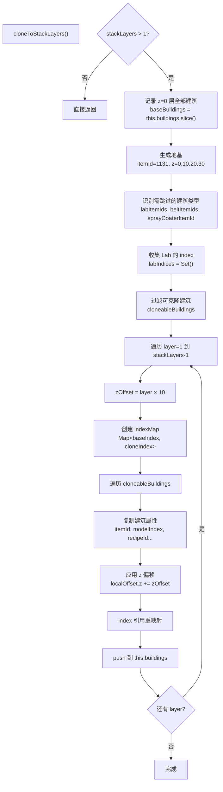

### 7.4 地基生成逻辑

```javascript
// 每层独立地基
// 地基在 baseBuildings 之后生成，第一个地基 index = baseCount + 1
const foundationStartIndex = baseCount + 1;
for (let layer = 0; layer < stackLayers; layer++) {
  const foundationZ = layer * zStep;  // z=0, 10, 20, 30
  const foundationBuilding = this.getBuildingTemplate();
  foundationBuilding.itemId = 1131;  // 地基itemId
  foundationBuilding.modelIndex = 37;
  foundationBuilding.localOffset = [
    { x: 0, y: 0, z: foundationZ },
    { x: 0, y: 0, z: foundationZ },
  ];
  foundationBuilding.inputToSlot = 1;
  foundationBuilding.parameters = null;
  this.buildings.push(foundationBuilding);
}
```

**地基位置说明**：

| layer | foundationZ | 说明 |
|-------|-------------|------|
| 0 | -10 | z=0 层设备的地基 |
| 1 | 0 | z=10 层设备的地基 |
| 2 | 10 | z=20 层设备的地基 |
| 3 | 20 | z=30 层设备的地基 |

### 7.5 过滤逻辑

```javascript
// 识别需跳过的建筑类型
const labItemIds = new Set([
    buildingMap.lab.itemId,
    buildingMap["自演化研究站"].itemId,
]);
const beltItemIds = new Set([2001, 2002, 2003]);
const sprayCoaterItemId = buildingMap.sprayCoater.itemId;

const labIndices = new Set();
for (const b of baseBuildings) {
  if (labItemIds.has(b.itemId)) {
    labIndices.add(b.index);
  }
}

// 过滤出需要克隆的建筑（排除Lab、传送带、喷涂机）
const cloneableBuildings = baseBuildings.filter((b) => {
    if (labItemIds.has(b.itemId)) return false;
    if (labIndices.has(b.inputObjIdx) || labIndices.has(b.outputObjIdx)) return false;
    if (beltItemIds.has(b.itemId)) return false;
    if (b.itemId === sprayCoaterItemId) return false;
    return true;
});
```

### 7.6 过滤规则表

| 建筑类型 | itemId | 是否克隆 | 原因 |
|----------|--------|---------|------|
| Lab | 2901/2902 | ❌ | 已有 maxLabLayers 垂直堆叠 |
| Lab 分拣器 | 2011-2014 | ❌ | 连接到 Lab |
| 传送带 | 2001-2003 | ❌ | 所有层共享 z=0 |
| 喷涂机 | 2313 | ❌ | 暂不支持 |
| 制造台/熔炉/化工厂 | 2302-2317 | ✅ | 核心生产建筑 |
| 电力感应塔 | 2201 | ✅ | 每层独立供电 |

### 7.7 indexMap 重映射机制

**功能说明**：建立原始建筑index与克隆建筑index的映射关系，用于重建筑间的引用。

```javascript
// 预分配index映射表
const indexMap = new Map();
let nextIndex = this.buildingIndex + 1;
for (const base of cloneableBuildings) {
    indexMap.set(base.index, nextIndex);
    nextIndex++;
}

// 使用示例：
// base.index = 5 → clone.index = nextIndex
// 分拣器引用设备：base.inputObjIdx = 5 → clone.inputObjIdx = indexMap.get(5)
```

**indexMap 映射示意**：

```
z=0 层原始建筑：
  设备 A: index=5
  设备 B: index=6
  分拣器 C: index=7, inputObjIdx=5（连接设备A）
  分拣器 D: index=8, inputObjIdx=6（连接设备B）

layer=1 克隆（z=10）：
  indexMap: {5→101, 6→102, 7→103, 8→104}
  
  克隆设备 A': index=101
  克隆设备 B': index=102
  克隆分拣器 C': index=103, inputObjIdx=indexMap.get(5)=101（连接克隆设备A'）
  克隆分拣器 D': index=104, inputObjIdx=indexMap.get(6)=102（连接克隆设备B'）
```

### 7.8 克隆建筑属性复制详解

```javascript
// 创建克隆体
for (const base of cloneableBuildings) {
    const clone = this.getBuildingTemplate();

    // --- 复制基础属性 ---
    clone.itemId = base.itemId;           // 建筑类型ID
    clone.modelIndex = base.modelIndex;   // 模型索引
    clone.areaIndex = base.areaIndex;     // 区域索引
    clone.recipeId = base.recipeId;       // 配方ID
    clone.filterId = base.filterId;       // 过滤ID（分拣器）
    
    // --- 复制槽位配置 ---
    clone.outputToSlot = base.outputToSlot;     // 输出目标槽位
    clone.inputFromSlot = base.inputFromSlot;   // 输入来源槽位
    clone.outputFromSlot = base.outputFromSlot; // 输出来源槽位
    clone.inputToSlot = base.inputToSlot;       // 输入目标槽位
    clone.outputOffset = base.outputOffset;     // 输出偏移
    clone.inputOffset = base.inputOffset;       // 输入偏移

    // --- 应用z偏移 ---
    clone.localOffset = base.localOffset
        ? base.localOffset.map((o) => ({
            x: o.x,
            y: o.y,
            z: (o.z || 0) + zOffset,  // z坐标增加层偏移
        }))
        : null;

    // --- 复制旋转角度 ---
    clone.yaw = base.yaw ? base.yaw.slice() : [0, 0];

    // --- 深拷贝参数 ---
    if (base.parameters !== null && base.parameters !== undefined) {
        clone.parameters = JSON.parse(JSON.stringify(base.parameters));
    } else {
        clone.parameters = null;
    }

    // --- index引用重映射 ---
    // outputObjIdx: 分拣器输出目标
    if (indexMap.has(base.outputObjIdx)) {
        // 目标在同层克隆建筑中 → 使用映射后的index
        clone.outputObjIdx = indexMap.get(base.outputObjIdx);
    } else {
        // 目标不在克隆列表中（如传送带）→ 保持原值
        clone.outputObjIdx = base.outputObjIdx;
    }

    // inputObjIdx: 建筑输入源
    if (base.inputObjIdx === -1) {
        // 设备没有连接地基 → 指向该层对应的地基
        clone.inputObjIdx = foundationStartIndex + layer;
    } else if (indexMap.has(base.inputObjIdx)) {
        // 源在同层克隆建筑中 → 使用映射后的index
        clone.inputObjIdx = indexMap.get(base.inputObjIdx);
    } else {
        // 源不在克隆列表中 → 保持原值
        clone.inputObjIdx = base.inputObjIdx;
    }

    this.buildings.push(clone);
}
```

### 7.9 克隆后的建筑连接关系

```
克隆后建筑连接关系示意（stackLayers=4）：

z=30 层（layer=3）：
  [设备] → inputObjIdx → [地基 z=20]
  [分拣器] → inputObjIdx → [同层设备]（indexMap重映射）
  [分拣器] → outputObjIdx → [z=0 传送带]（保持原值）

z=20 层（layer=2）：
  [设备] → inputObjIdx → [地基 z=10]
  [分拣器] → inputObjIdx → [同层设备]（indexMap重映射）
  [分拣器] → outputObjIdx → [z=0 传送带]（保持原值）

z=10 层（layer=1）：
  [设备] → inputObjIdx → [地基 z=0]
  [分拣器] → inputObjIdx → [同层设备]（indexMap重映射）
  [分拣器] → outputObjIdx → [z=0 传送带]（保持原值）

z=0 层（原始层）：
  [设备] → inputObjIdx → [地基 z=0]
  [分拣器] → inputObjIdx → [同层设备]
  [分拣器] → outputObjIdx → [z=0 传送带]

关键点：
  - 所有层的分拣器都连接到z=0的传送带
  - 每层设备连接到该层对应的地基
  - 分拣器与设备在同层内保持正确连接
```

---

## 8. 堆叠后蓝图结构

### 8.1 完整结构图

```
堆叠后完整结构（stackLayers=4）：

┌─────────────────────────────────────────────────────────────────────────────┐
│ z=30 层（第 4 层，克隆）                                                   │
│ ┌─────────────────────────────────────────────────────────────────────────┐ │
│ │ [设备 1-15 克隆]                                                         │ │
│ │   - localOffset.z = 30                                                 │ │
│ │   - outputObjIdx → 同层分拣器（indexMap 重映射）                        │ │
│ │   - inputObjIdx → z=10 地基（foundationStartIndex + 3）                │ │
│ │                                                                         │ │
│ │ [分拣器 1-15 克隆]                                                       │ │
│ │   - localOffset.z = 30                                                 │ │
│ │   - outputObjIdx → z=0 传送带（保持原值）                               │ │
│ │   - inputObjIdx → 同层设备（indexMap 重映射）                           │ │
│ └─────────────────────────────────────────────────────────────────────────┘ │
│                                                                             │
│ z=20 层（第 3 层，克隆）                                                   │
│ ┌─────────────────────────────────────────────────────────────────────────┐ │
│ │ [设备 1-15 克隆] + [分拣器 1-15 克隆]                                    │ │
│ │   结构同上，zOffset = 20                                               │ │
│ └─────────────────────────────────────────────────────────────────────────┘ │
│                                                                             │
│ z=10 层（第 2 层，克隆）                                                   │
│ ┌─────────────────────────────────────────────────────────────────────────┐ │
│ │ [设备 1-15 克隆] + [分拣器 1-15 克隆]                                    │ │
│ │   结构同上，zOffset = 10                                               │ │
│ └─────────────────────────────────────────────────────────────────────────┘ │
│                                                                             │
│ z=0 层（第 1 层，原始）                                                    │
│ ┌─────────────────────────────────────────────────────────────────────────┐ │
│ │ [设备 1-15] + [分拣器 1-15]                                             │ │
│ │ [Lab 1-4]（完整数量，垂直堆叠 z=0,3,6,9）                              │ │
│ │ [Lab 分拣器]                                                            │ │
│ │ [传送带网络] ← 所有层共享                                               │ │
│ └─────────────────────────────────────────────────────────────────────────┘ │
│                                                                             │
│ z=0 层（地基）                                                             │
│ ┌─────────────────────────────────────────────────────────────────────────┐ │
│ │ [Foundation 1-4] 每层独立地基                                           │ │
│ │   z=0, z=10, z=20, z=30                                                │ │
│ └─────────────────────────────────────────────────────────────────────────┘ │
└─────────────────────────────────────────────────────────────────────────────┘
```

### 8.2 简化视图

```
z=30: [设备] [设备] [设备]  ← 克隆层
         ↓      ↓      ↓
z=20: [设备] [设备] [设备]  ← 克隆层
         ↓      ↓      ↓
z=10: [设备] [设备] [设备]  ← 克隆层
         ↓      ↓      ↓
z=0:  [设备] [设备] [设备]  ← 原始层
       ═══════════════════  ← 共享传送带
       [Lab] [Lab] [Lab] [Lab] ← 仅z=0有Lab
```

---

## 9. Index引用重映射机制

### 9.1 重映射流程

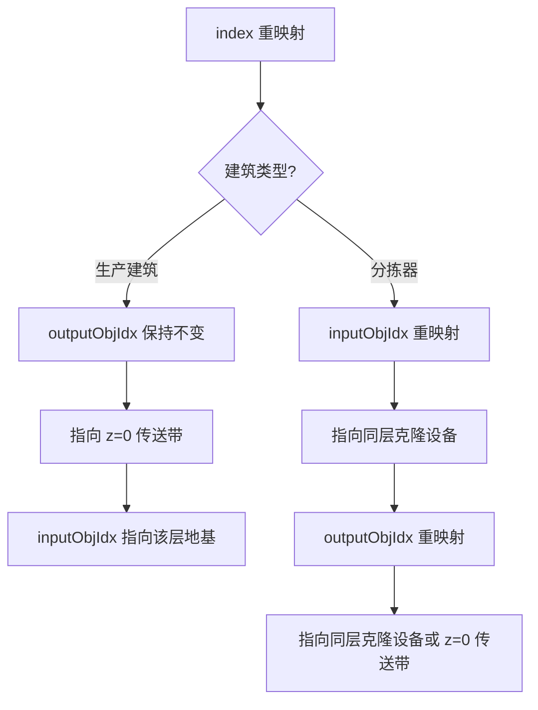

### 9.2 核心代码

**代码位置**: `blueprint.js` L2175-2203

**功能说明**：处理克隆建筑的index引用，确保建筑间连接关系正确。

```javascript
// index引用重映射
// outputObjIdx：所有克隆体的outputObjIdx指向z=0的传送带（不通过indexMap）
//           这样4层都连接到同一套传送带网络
// inputObjIdx：设备的inputObjIdx需要指向该层对应的地基
if (indexMap.has(base.outputObjIdx)) {
  clone.outputObjIdx = indexMap.get(base.outputObjIdx);
} else {
  clone.outputObjIdx = base.outputObjIdx;
}

// 设备（生产建筑）的inputObjIdx指向该层对应的地基
// 分拣器的inputObjIdx保持指向同层设备
if (base.inputObjIdx === -1) {
  // 如果base设备没有连接地基（inputObjIdx = -1），则指向该层对应的地基
  // 地基索引计算：foundationStartIndex + layer
  // layer=1 → z=10 设备 → z=0 地基 (foundationStartIndex + 1)
  // layer=2 → z=20 设备 → z=10 地基 (foundationStartIndex + 2)
  // layer=3 → z=30 设备 → z=20 地基 (foundationStartIndex + 3)
  clone.inputObjIdx = foundationStartIndex + layer;
} else if (indexMap.has(base.inputObjIdx)) {
  // 分拣器等指向同层克隆设备
  clone.inputObjIdx = indexMap.get(base.inputObjIdx);
} else {
  clone.inputObjIdx = base.inputObjIdx;
}
```

### 9.3 重映射规则表

| 建筑类型 | outputObjIdx | inputObjIdx | 说明 |
|----------|-------------|-------------|------|
| 生产设备 | 保持原值 | 指向该层地基 | 设备输出到分拣器，输入来自地基 |
| 输出分拣器 | 保持原值（z=0传送带） | indexMap重映射 | 分拣器从设备取物，送到传送带 |
| 输入分拣器 | indexMap重映射 | 保持原值 | 分拣器从传送带取物，送到设备 |

### 9.4 重映射示例

```
z=0 层原始建筑：
  设备 index=5, inputObjIdx=-1
  分拣器 index=6, inputObjIdx=5, outputObjIdx=100（传送带）

layer=1 克隆（z=10）：
  indexMap: {5→201, 6→202}
  
  克隆设备 index=201
    - inputObjIdx = foundationStartIndex + 1（z=0地基）
    - outputObjIdx 保持不变（指向分拣器或传送带）
  
  克隆分拣器 index=202
    - inputObjIdx = indexMap.get(5) = 201（同层设备）
    - outputObjIdx = 100（保持原值，指向z=0传送带）
```

### 9.5 indexMap 构建过程

```javascript
// 预分配index映射表
// 在克隆每一层之前，先建立该层的index映射
const indexMap = new Map();
let nextIndex = this.buildingIndex + 1;

for (const base of cloneableBuildings) {
    indexMap.set(base.index, nextIndex);
    nextIndex++;
}

// 映射表结构：
// indexMap = {
//   原始index → 克隆后index
//   5 → 201,
//   6 → 202,
//   7 → 203,
//   ...
// }
```

**indexMap 使用场景**：

```
场景1: 分拣器连接设备
  原始: 分拣器.inputObjIdx = 5（设备A）
  克隆: 分拣器.inputObjIdx = indexMap.get(5) = 201（克隆设备A'）

场景2: 设备连接分拣器
  原始: 设备.outputObjIdx = 6（分拣器B）
  克隆: 设备.outputObjIdx = indexMap.get(6) = 202（克隆分拣器B'）

场景3: 分拣器连接传送带
  原始: 分拣器.outputObjIdx = 100（传送带节点）
  克隆: 分拣器.outputObjIdx = 100（保持原值，传送带不克隆）
```

### 9.6 地基索引计算

```javascript
// 地基索引计算公式
// foundationStartIndex = baseCount + 1（第一个地基的index）
// layer层设备的地基index = foundationStartIndex + layer

// 示例（baseCount=200, stackLayers=4）：
// foundationStartIndex = 201
// layer=0: 地基 z=0,  index=201 → z=0层设备使用
// layer=1: 地基 z=10, index=202 → z=10层设备使用
// layer=2: 地基 z=20, index=203 → z=20层设备使用
// layer=3: 地基 z=30, index=204 → z=30层设备使用

// 设备连接地基：
// z=0层设备:  inputObjIdx = 201（foundationStartIndex + 0）
// z=10层设备: inputObjIdx = 202（foundationStartIndex + 1）
// z=20层设备: inputObjIdx = 203（foundationStartIndex + 2）
// z=30层设备: inputObjIdx = 204（foundationStartIndex + 3）
```

### 9.7 重映射流程图

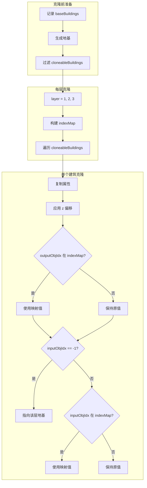

---

## 10. 研究站Lab特殊处理

### 10.1 特殊处理原因

```
Lab 已有独立的垂直堆叠机制（maxLabLayers），布局复杂：
- Lab 在 z=0, 3, 6, 9... 垂直堆叠
- Lab 分拣器连接到特定层的 Lab
- 不适合参与 cloneToStackLayers 的克隆逻辑
```

### 10.2 处理规则

| 阶段 | Lab 处理 |
|------|---------|
| init() | num 不缩减，保持完整 |
| generateBuildings() | 正常布局，垂直堆叠 |
| generateConveyorBelts() | rate 正常计算，但会被放大 |
| cloneToStackLayers() | 不克隆，保持原位 |

### 10.3 Lab 垂直堆叠核心代码

**代码位置**: `blueprint.js` L1636-1681

**功能说明**：Lab在generateBuildings()阶段实现独立的垂直堆叠，不受stackLayers影响。

```javascript
let stackLabBuildingIndexList = [];
let layers = 1;
if (buildingMap[subRecipe.building.name].category === productionCategory.lab) {
    // 堆叠处理研究站
    newBuilding.outputToSlot = 14;
    newBuilding.inputFromSlot = 15;
    newBuilding.outputFromSlot = 15;
    newBuilding.inputToSlot = 14;
    newBuilding.parameters.researchMode = 1;
    this.buildings.push(newBuilding);
    
    // 垂直堆叠后续Lab
    for (
        i++;
        i < subRecipe.building.num && layers < this.config.maxLabLayers;
        i++, layers++
    ) {
        let labBuilding = this.getBuildingTemplate();
        labBuilding.localOffset = [
            { x: buildingX, y: buildingY, z: buildingZ },
            { x: buildingX, y: buildingY, z: buildingZ },
        ];
        // z坐标按Lab高度递增
        labBuilding.localOffset[0].z = buildingMap.lab.height * layers;
        labBuilding.localOffset[1].z = buildingMap.lab.height * layers;
        
        labBuilding.yaw = newBuilding.yaw;
        labBuilding.itemId = buildingMap[subRecipe.building.name].itemId;
        labBuilding.modelIndex = buildingMap[subRecipe.building.name].modelIndex;
        labBuilding.recipeId = parseInt(subRecipe.recipeID);
        
        // 连接到上一层Lab
        labBuilding.inputObjIdx = this.buildingIndex - 1;
        labBuilding.outputToSlot = 14;
        labBuilding.inputFromSlot = 15;
        labBuilding.outputFromSlot = 15;
        labBuilding.inputToSlot = 14;
        labBuilding.parameters = {
            acceleratorMode: acceleratorMode,
            researchMode: 1,
        };
        this.buildings.push(labBuilding);
        stackLabBuildingIndexList.push(this.buildingIndex);
    }
    i--;
}
```

### 10.4 Lab 垂直堆叠示意

```
研究站垂直堆叠（maxLabLayers=15）：

           z轴
            ↑
       42   │ [Lab 15] ──→ z=42 (height×14)
            │
       39   │ [Lab 14] ──→ z=39 (height×13)
            │
       ...  │    ...
            │
        6   │ [Lab 3] ──→ z=6 (height×2)
            │
        3   │ [Lab 2] ──→ z=3 (height×1)
            │
        0   │ [Lab 1] ──→ z=0 (底层)
            │
       -10  │ [地基]
            └──────────────────────────────→ x轴

特点：
- z间距 = Lab.height = 3
- 所有Lab共享相同x-y坐标
- 上层Lab的inputObjIdx指向下层Lab
- 槽位配置：outputToSlot=14, inputFromSlot=15
```

### 10.5 Lab 槽位配置详解

```javascript
// Lab 槽位配置
newBuilding.outputToSlot = 14;    // 输出到上层Lab（槽位14）
newBuilding.inputFromSlot = 15;   // 从上层Lab输入（槽位15）
newBuilding.outputFromSlot = 15;  // 输出来源槽位
newBuilding.inputToSlot = 14;     // 输入目标槽位
newBuilding.parameters.researchMode = 1;  // 研究模式

// 槽位说明：
// 槽位 0-11: 物品输入/输出（连接分拣器）
// 槽位 14: 向上层Lab传输
// 槽位 15: 从上层Lab接收
```

**Lab 槽位连接示意**：

```
[Lab 1] z=0     [Lab 2] z=3     [Lab 3] z=6
    │               │               │
    │  slot14 ────→ │  slot14 ────→ │
    │ ←──── slot15  │ ←──── slot15  │
    │               │               │
[分拣器]         (无分拣器)       (无分拣器)
    │
    ↓
[传送带]

说明：
- 只有底层Lab(z=0)连接分拣器
- 上层Lab通过slot14/15与下层Lab连接
- 物料从底层Lab逐层向上传输
```

### 10.6 Lab 分拣器数量计算

**代码位置**: `blueprint.js` L2281-2320

```javascript
// 计算Lab的分拣器数量
if (buildingMap[subRecipe.building.name].category === productionCategory.lab) {
    // 研究站可堆叠，需特殊处理
    fromBuildingNum = Math.ceil(
        subRecipe.building.num / this.config.maxLabLayers
    );
} else {
    fromBuildingNum = subRecipe.building.num;
}

// 示例：
// Lab.num = 60, maxLabLayers = 15
// fromBuildingNum = ceil(60/15) = 4
// 即只有4个底层Lab需要分拣器连接
```

**分拣器数量计算示意**：

```
Lab配置：num=60, maxLabLayers=15

垂直堆叠后：
  - 4组Lab，每组15层
  - 每组只有底层(z=0)需要分拣器
  - 分拣器数量 = 4个（不是60个）

分拣器分配：
  Lab组1: [Lab 1-15] → 分拣器1
  Lab组2: [Lab 16-30] → 分拣器2
  Lab组3: [Lab 31-45] → 分拣器3
  Lab组4: [Lab 46-60] → 分拣器4
```

### 10.7 Lab 与堆叠模式的交互

```
堆叠模式（stackLayers=4）下 Lab 的处理：

1. init(): Lab.num 不缩减
   → 60个Lab保持60个

2. generateBuildings(): Lab 正常垂直堆叠
   → 60个Lab分布在z=0,3,6...42（按maxLabLayers分组）

3. generateConveyorBelts(): Lab rate 被放大
   → Lab rate × 4
   → 传送带按放大后产能设计

4. cloneToStackLayers(): Lab 不克隆
   → 只有z=0层有Lab
   → Lab产能完整，不损失

注意：Lab rate 放大可能导致传送带容量设计偏大，
     但不影响实际产能，因为Lab只在z=0层工作。
```

### 10.8 Lab 过滤逻辑

**代码位置**: `blueprint.js` L2137-2160

```javascript
// 识别需跳过的建筑类型
const labItemIds = new Set([
    buildingMap.lab.itemId,           // 2901
    buildingMap["自演化研究站"].itemId, // 2902
]);
const beltItemIds = new Set([2001, 2002, 2003]);
const sprayCoaterItemId = buildingMap.sprayCoater.itemId;

// 收集 Lab 的 index
const labIndices = new Set();
for (const b of baseBuildings) {
    if (labItemIds.has(b.itemId)) {
        labIndices.add(b.index);
    }
}

// 过滤出需要克隆的建筑（排除Lab、传送带、喷涂机）
const cloneableBuildings = baseBuildings.filter((b) => {
    if (labItemIds.has(b.itemId)) return false;  // Lab本身不克隆
    if (labIndices.has(b.inputObjIdx) || labIndices.has(b.outputObjIdx)) return false;  // Lab分拣器不克隆
    if (beltItemIds.has(b.itemId)) return false;  // 传送带不克隆
    if (b.itemId === sprayCoaterItemId) return false;  // 喷涂机不克隆
    return true;
});
```

### 10.9 Lab 处理流程图

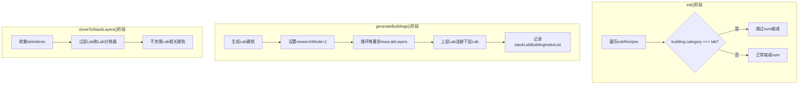

---

## 11. 各建筑类型处理规则

### 11.1 完整规则表

| 建筑类型 | itemId | init()缩减 | 克隆到高层 | z>0 inputObjIdx |
|----------|--------|-----------|-----------|-----------------|
| 制造台/熔炉/化工厂/精炼厂/对撞机 | 2302-2317 | ✅ num÷N | ✅ | 地基 |
| **研究站（Lab）** | 2901/2902 | **❌ 不缩减** | **❌ 不克隆** | — |
| 分拣器（非Lab） | 2011-2014 | — | ✅ | indexMap |
| 分拣器（Lab） | 2011-2014 | — | ❌ | — |
| 传送带 | 2001-2003 | — | ❌ | — |
| 电力感应塔 | 2201 | — | ✅ | 地基 |
| 喷涂机 | 2313 | — | ❌ | — |
| 地基 | 1131 | — | — | -1 |

### 11.2 建筑分类体系

**代码位置**: `blueprint.js` L183-188

```javascript
const productionCategory = {
    smelter: 1,    // 熔炉类
    assembling: 2, // 制造台类
    plant: 3,      // 化工厂类
    refinery: 4,   // 精炼厂类
    collider: 5,   // 对撞机类
    lab: 5,        // 研究站类（与collider相同值）
};

const buildingType = {
    production: 0, // 生产建筑
    storage: 1,    // 存储建筑
    transport: 2,  // 运输建筑
};
```

### 11.3 各类型建筑详细配置

#### 11.3.1 熔炉类 (smelter)

| 建筑名称 | itemId | modelIndex | productionSpeed | slotMaxIndex |
|----------|--------|------------|-----------------|--------------|
| 电弧熔炉 | 2302 | 62 | 1.0 | 7 |
| 位面熔炉 | 2303 | 194 | 2.0 | 7 |
| 负熵熔炉 | 2319 | 457 | 3.0 | 7 |

**处理规则**：
- init(): num ÷ stackLayers
- generateBuildings(): 正常布局
- cloneToStackLayers(): 克隆到高层
- z偏移: z += layer × 10

#### 11.3.2 制造台类 (assembling)

| 建筑名称 | itemId | modelIndex | productionSpeed | slotMaxIndex |
|----------|--------|------------|-----------------|--------------|
| 制造台Mk.I | 2304 | 65 | 0.75 | 8 |
| 制造台Mk.II | 2305 | 66 | 1.0 | 8 |
| 制造台Mk.III | 2306 | 67 | 1.5 | 8 |
| 重组式制造台 | 2318 | 456 | 3.0 | 8 |

**处理规则**：
- init(): num ÷ stackLayers
- generateBuildings(): 正常布局
- cloneToStackLayers(): 克隆到高层
- z偏移: z += layer × 10

#### 11.3.3 化工厂类 (plant)

| 建筑名称 | itemId | modelIndex | productionSpeed | slotMaxIndex |
|----------|--------|------------|-----------------|--------------|
| 化工厂 | 2309 | 64 | 1.0 | 6 |
| 量子化工厂 | 2317 | 376 | 2.0 | 6 |

**处理规则**：
- init(): num ÷ stackLayers
- generateBuildings(): 正常布局，紧凑布局时area=30
- cloneToStackLayers(): 克隆到高层
- z偏移: z += layer × 10

#### 11.3.4 精炼厂类 (refinery)

| 建筑名称 | itemId | modelIndex | productionSpeed | slotMaxIndex |
|----------|--------|------------|-----------------|--------------|
| 精炼厂 | 2308 | 63 | 1.0 | 5 |

**处理规则**：
- init(): num ÷ stackLayers
- generateBuildings(): 正常布局，紧凑布局时area=30
- cloneToStackLayers(): 克隆到高层
- z偏移: z += layer × 10

#### 11.3.5 对撞机类 (collider)

| 建筑名称 | itemId | modelIndex | productionSpeed | slotMaxIndex |
|----------|--------|------------|-----------------|--------------|
| 微型粒子对撞机 | 2310 | 69 | 1.0 | 8 |

**处理规则**：
- init(): num ÷ stackLayers
- generateBuildings(): 正常布局，紧凑布局时area=66
- cloneToStackLayers(): 克隆到高层
- z偏移: z += layer × 10

#### 11.3.6 研究站类 (lab)

| 建筑名称 | itemId | modelIndex | productionSpeed | height | slotMaxIndex |
|----------|--------|------------|-----------------|--------|--------------|
| 矩阵研究站 | 2901 | 70 | 1.0 | 3 | 11 |
| 自演化研究站 | 2902 | 455 | 3.0 | 3 | 11 |

**处理规则**：
- init(): **不缩减** num
- generateBuildings(): 垂直堆叠到maxLabLayers
- cloneToStackLayers(): **不克隆**
- z偏移: z = height × layer (layer从0开始)

### 11.4 分拣器类型

| 分拣器名称 | itemId | 运输速度 | 说明 |
|------------|--------|---------|------|
| 分拣器Mk.I | 2011 | 6次/分钟 | 基础分拣器 |
| 分拣器Mk.II | 2012 | 12次/分钟 | 高速分拣器 |
| 分拣器Mk.III | 2013 | 30次/分钟 | 极速分拣器 |
| 集装分拣器 | 2014 | 30次/分钟 | 可堆叠物品 |

**处理规则**：
- init(): 不处理（分拣器在generateBuildings阶段生成）
- generateBuildings(): 根据建筑类型生成
- cloneToStackLayers(): 
  - 非Lab分拣器：克隆到高层
  - Lab分拣器：不克隆

### 11.5 传送带类型

| 传送带名称 | itemId | 运输速度 | 说明 |
|------------|--------|---------|------|
| 传送带Mk.I | 2001 | 6/s | 基础传送带 |
| 传送带Mk.II | 2002 | 12/s | 高速传送带 |
| 传送带Mk.III | 2003 | 30/s | 极速传送带 |

**处理规则**：
- init(): 配置速度（onlyConveyorBeltMk3Downgrade时降速到28）
- generateConveyorBelts(): 在z=0层生成
- cloneToStackLayers(): **不克隆**，所有层共享z=0传送带

### 11.6 处理流程图

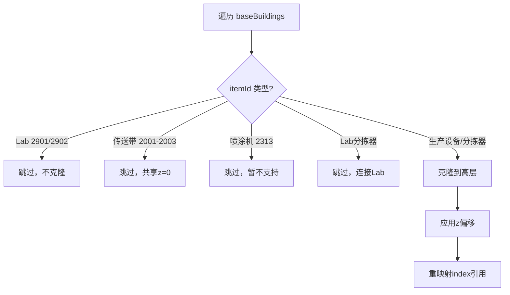

### 11.7 建筑类型判断代码

**代码位置**: `blueprint.js` L2137-2160

```javascript
// 识别需跳过的建筑类型
const labItemIds = new Set([
    buildingMap.lab.itemId,           // 2901
    buildingMap["自演化研究站"].itemId, // 2902
]);
const beltItemIds = new Set([2001, 2002, 2003]);
const sprayCoaterItemId = buildingMap.sprayCoater.itemId;

// 收集 Lab 的 index
const labIndices = new Set();
for (const b of baseBuildings) {
    if (labItemIds.has(b.itemId)) {
        labIndices.add(b.index);
    }
}

// 过滤出需要克隆的建筑
const cloneableBuildings = baseBuildings.filter((b) => {
    // Lab本身不克隆
    if (labItemIds.has(b.itemId)) return false;
    
    // 连接到Lab的分拣器不克隆
    if (labIndices.has(b.inputObjIdx) || labIndices.has(b.outputObjIdx)) return false;
    
    // 传送带不克隆
    if (beltItemIds.has(b.itemId)) return false;
    
    // 喷涂机不克隆
    if (b.itemId === sprayCoaterItemId) return false;
    
    return true;
});
```

### 11.8 建筑面积计算

**代码位置**: `blueprint.js` L910-1027

```javascript
calculateBuildingArea(buildingName, compactLayout) {
    const building = buildingMap[buildingName];
    
    switch (building.category) {
        case productionCategory.smelter:
            return { area: 16, x: 4, y: 4, centerPoint: [2, 2, 1, 2], yaw: [0, 0] };
            
        case productionCategory.assembling:
            return { area: 16, x: 4, y: 4, centerPoint: [2, 2, 1, 2], yaw: [0, 0] };
            
        case productionCategory.plant:
            // 紧凑布局时面积更小
            if (compactLayout) {
                return { area: 30, x: 6, y: 5, centerPoint: [3, 3, 2, 3], yaw: [0, 0] };
            }
            return { area: 40, x: 7, y: 6, centerPoint: [3, 4, 3, 3], yaw: [0, 0] };
            
        case productionCategory.refinery:
            // 紧凑布局时面积更小
            if (compactLayout) {
                return { area: 30, x: 6, y: 5, centerPoint: [3, 3, 2, 3], yaw: [0, 0] };
            }
            return { area: 40, x: 7, y: 6, centerPoint: [3, 4, 3, 3], yaw: [0, 0] };
            
        case productionCategory.collider:
            // 紧凑布局时面积更小
            if (compactLayout) {
                return { area: 66, x: 9, y: 8, centerPoint: [4, 5, 4, 4], yaw: [0, 0] };
            }
            return { area: 77, x: 10, y: 8, centerPoint: [5, 5, 4, 4], yaw: [0, 0] };
            
        case productionCategory.lab:
            return { area: 42, x: 7, y: 6, centerPoint: [3, 3, 2, 3], yaw: [0, 0] };
            
        default:
            throw `unknown production build type - ${building.category}`;
    }
}
```

**建筑面积表**：

| 建筑类型 | 标准布局 area | 紧凑布局 area | 尺寸 (x×y) |
|----------|--------------|--------------|-----------|
| 熔炉 | 16 | 16 | 4×4 |
| 制造台 | 16 | 16 | 4×4 |
| 化工厂 | 40 | 30 | 7×6 / 6×5 |
| 精炼厂 | 40 | 30 | 7×6 / 6×5 |
| 对撞机 | 77 | 66 | 10×8 / 9×8 |
| 研究站 | 42 | 42 | 7×6 |

---

## 12. 非堆叠模式兼容性

### 12.1 兼容性保证

```javascript
// stackLayers = 1 时，堆叠逻辑完全跳过
if (this.config.stackLayers > 1) {
    // 堆叠处理
}

// cloneToStackLayers 直接返回
if (!this.config.stackLayers || this.config.stackLayers <= 1) {
    return;
}
```

### 12.2 行为对比

| 配置 | 设备数 | Lab数 | 传送带 | 地基 |
|------|--------|-------|--------|------|
| stackLayers=1 | 60 | 4 | 按原始产能 | 1个 |
| stackLayers=4 | 15×4=60 | 4 | 按4倍产能 | 4个 |

### 12.3 与不堆叠模式的对比

| 阶段 | 不堆叠模式 | 堆叠模式 |
|------|-----------|---------|
| init() | num 不缩减 | num ÷ stackLayers |
| generateBuildings() | 所有设备在 z=0 | 缩减后设备在 z=0 |
| generateConveyorBelts() | rate 不放大 | rate × stackLayers |
| cloneToStackLayers() | 不执行 | 克隆到高层 |

---

## 13. 与现有功能的交互

### 13.1 与增产剂系统

```
堆叠模式下增产剂处理：
- 喷涂机不克隆（暂不支持）
- 增产剂传送带只在z=0层
- 如需喷涂，建议在堆叠前处理原料

注意：
- 堆叠后每层设备需要独立喷涂
- 目前喷涂机不克隆，需要手动处理
```

### 13.2 与电力系统

```
堆叠模式下电力处理：
- 电力感应塔克隆到每层
- 每层独立供电网络
- inputObjIdx指向该层地基

电力感应塔克隆逻辑：
  - itemId = 2201
  - localOffset.z += zOffset
  - inputObjIdx = foundationStartIndex + layer
```

### 13.3 与紧凑布局

```
堆叠 + 紧凑布局：
- 先缩减num，再布局
- 紧凑布局影响单层建筑间距
- 堆叠后的高层保持相同布局

紧凑布局对建筑面积的影响：
  - 精炼厂：area=30 vs 40
  - 对撞机：area=66 vs 77
```

---

## 14. 产能计算验证

### 14.1 验证公式

```
总产能 = 单层产能 × stackLayers

设备产能：
  单层设备数 = ceil(原始num / stackLayers)
  总设备数 = 单层设备数 × stackLayers
  产能 = 原始产能（不损失）

Lab产能：
  Lab数 = 原始num（不缩减）
  产能 = 原始产能（不损失）
```

### 14.2 验证示例

```
输入：60设备 + 4Lab，stackLayers=4

设备：
  单层 = ceil(60/4) = 15
  总数 = 15 × 4 = 60 ✅
  产能 = 60min ✅

Lab：
  单层 = 4（不缩减）
  总数 = 4 ✅
  产能 = 完整 ✅

传送带：
  rate = 原始rate × 4
  支撑60设备产能 ✅
```

### 14.3 速率计算对比

| 项目 | 不堆叠模式 | 堆叠模式 |
|------|-----------|---------|
| 设备数量 | 60 | 15 × 4 = 60 |
| 单设备分拣器 rate | 1 | 1 × 4 = 4 |
| 分拣器 rate 总和 | 60 × 1 = 60 | 15 × 4 = 60 |
| itemSummary.rate | 60 | 15 × 4 = 60 ✅ |

### 14.4 传送带数据对比

| 数据项 | 不堆叠模式 | 堆叠模式 | 是否一致 |
|--------|-----------|---------|---------|
| 原料 inputRate | 60 items/s | 60 items/s | ✅ |
| 原料 count | 3600/min | 3600/min | ✅ |
| 产物 outputRate | 60 items/s | 60 items/s | ✅ |
| 产物 count | 3600/min | 3600/min | ✅ |

---

## 附录A：代码位置速查

| 函数名 | 行号 | 功能 |
|--------|------|------|
| mapRecipeID | L632 | 配方ID映射 |
| calculateBlueprintArea | L990 | 蓝图面积计算 |
| calculateBuildingArea | L910 | 建筑面积计算 |
| newProductionBuilding | L1520 | 生成生产建筑 |
| init | L2048 | 初始化与num缩减 |
| cloneToStackLayers | L2099 | 建筑克隆到高层 |
| sortItemSummary | L2228 | 物料排序 |
| generateConveyorBelts | L2265 | 传送带网络生成 |
| generateBuildings | L2832 | 建筑生成 |

---

## 附录B：关键常量速查

### 建筑ID速查表

| 建筑类型 | itemId | 名称 |
|----------|--------|------|
| 传送带Mk.I | 2001 | 传送带 |
| 传送带Mk.II | 2002 | 高速传送带 |
| 传送带Mk.III | 2003 | 极速传送带 |
| 分拣器Mk.I | 2011 | 分拣器 |
| 分拣器Mk.II | 2012 | 高速分拣器 |
| 分拣器Mk.III | 2013 | 极速分拣器 |
| 集装分拣器 | 2014 | 集装分拣器 |
| 电力感应塔 | 2201 | 电力感应塔 |
| 电弧熔炉 | 2302 | 电弧熔炉 |
| 制作台Mk.I | 2303 | 制作台Mk.I |
| 制作台Mk.II | 2304 | 制作台Mk.II |
| 制作台Mk.III | 2305