# 蓝图模块详细说明文档

> 文档状态（2026-04-04）：历史归档，不再与当前代码同步维护。  
> 说明：文中大量行号、文件关系与架构描述基于 2026-03 的单体脚本阶段。  
> 当前请优先参考：localDocs/网站完善实施计划.md、localDocs/当前项目架构与成熟网站差距分析.md、localDocs/index拆分结构清单.md。

## 目录

- [1. 模块概述](#1-模块概述)
- [2. 文件结构](#2-文件结构)
- [3. Blueprint类详解](#3-blueprint类详解)
- [4. 建筑生成阶段](#4-建筑生成阶段)
- [5. 传送带生成阶段](#5-传送带生成阶段)
- [6. 增产剂系统](#6-增产剂系统)
- [7. 堆叠功能](#7-堆叠功能)
- [8. 蓝图编码输出](#8-蓝图编码输出)
- [9. Worker异步处理](#9-worker异步处理)
- [10. Facade外观层](#10-facade外观层)
- [11. 完整流程图](#11-完整流程图)
- [12. 关键常量速查](#12-关键常量速查)

---

## 1. 模块概述

蓝图模块负责将计算结果转换为游戏内可导入的蓝图字符串，包含建筑布局、传送带网络、分拣器连接、增产剂喷涂等完整的生产线配置。

### 1.1 核心功能

| 功能 | 说明 |
|------|------|
| 建筑布局 | 自动计算建筑位置，避免重叠 |
| 传送带网络 | 生成物料传输路径 |
| 分拣器连接 | 建筑与传送带的连接 |
| 增产剂喷涂 | 喷涂机布局和传送带 |
| 建筑堆叠 | 多层建筑复制 |
| 蓝图编码 | JSON序列化和压缩 |

### 1.2 模块架构

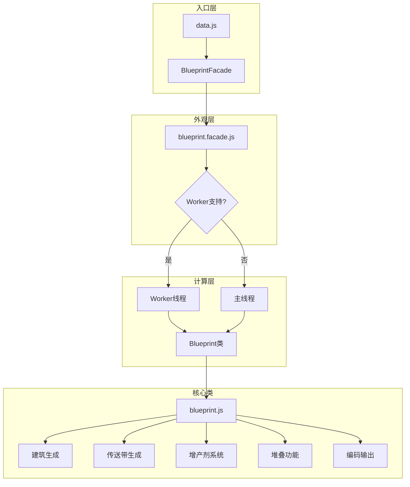

---

## 2. 文件结构

### 2.1 文件列表

| 文件 | 行数 | 说明 |
|------|------|------|
| `blueprint.js` | ~3000行 | 核心Blueprint类 |
| `blueprint.facade.js` | ~100行 | 外观层接口 |
| `blueprint.worker.js` | ~50行 | Worker线程脚本 |

### 2.2 模块依赖关系

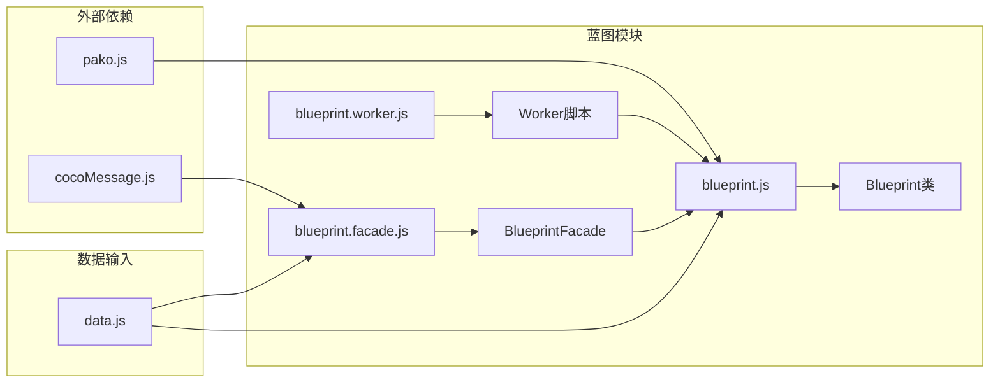

---

## 3. Blueprint类详解

### 3.1 类结构

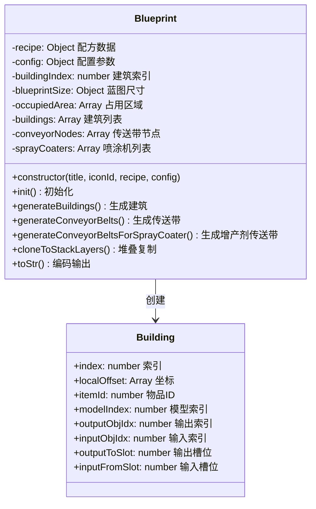

### 3.2 构造函数

```javascript
constructor(title, iconId, recipe, config) {
    this.recipe = recipe;           // 配方数据
    this.config = config;           // 配置参数
    this.buildingIndex = -1;        // 建筑索引计数器
    this.blueprintSize = { x: 0, y: 0 };  // 蓝图尺寸
    this.occupiedArea = [];         // 已占用区域
    this.buildings = [];            // 建筑列表
    this.conveyorNodes = [];        // 传送带节点
    this.sprayCoaters = [];         // 喷涂机列表
    
    // 蓝图元数据
    this.blueprintMeta = {
        version: '1.0.0',
        title: title,
        iconId: iconId,
        description: '',
        time: Date.now()
    };
}
```

### 3.3 初始化流程

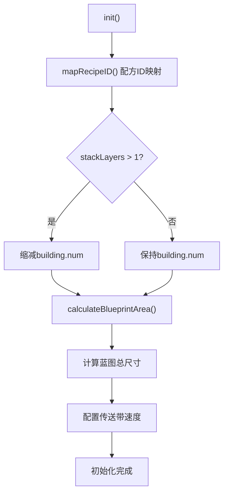

### 3.4 配方ID映射

```javascript
mapRecipeID() {
    for (let subRecipe of this.recipe.subRecipes) {
        // 根据配方内容生成唯一ID
        subRecipe.recipeID = this.generateRecipeID(subRecipe);
    }
}
```

---

## 4. 建筑生成阶段

### 4.1 generateBuildings() 流程

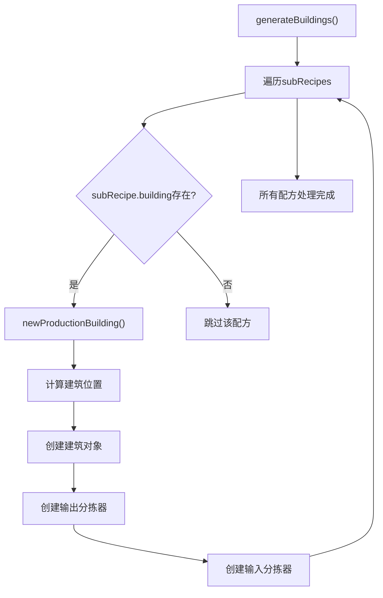

### 4.2 newProductionBuilding() 详解

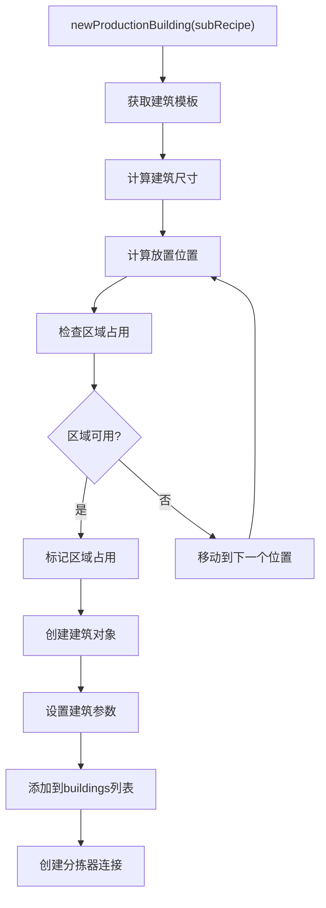

### 4.3 建筑位置计算

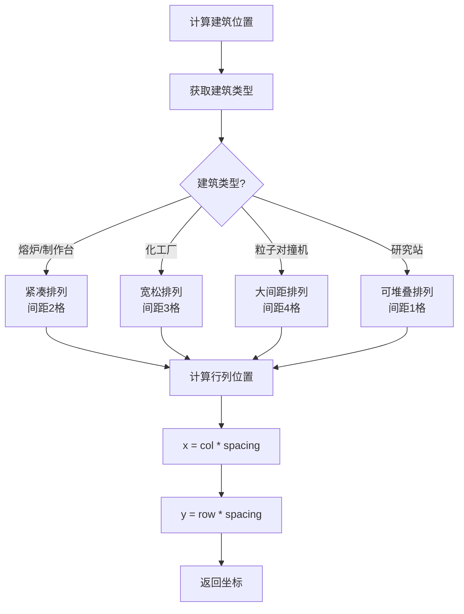

### 4.4 建筑模板映射

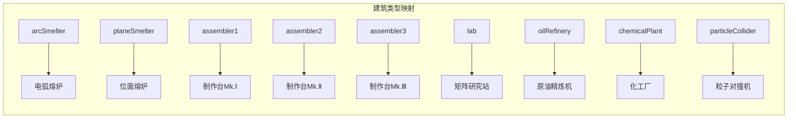

### 4.5 建筑对象结构

```javascript
{
    index: 0,                    // 建筑索引
    localOffset: [0, 0, 0],      // 坐标 [x, y, z]
    itemId: 2308,                // 物品ID（建筑类型）
    modelIndex: 0,               // 模型索引
    outputObjIdx: -1,            // 输出对象索引
    inputObjIdx: -1,             // 输入对象索引
    outputToSlot: 0,             // 输出槽位
    inputFromSlot: 0,            // 输入槽位
    recipeId: 1,                 // 配方ID
    filterId: 0,                 // 过滤器ID
    parameters: {                // 参数
        speed: 100,              // 速度百分比
        productivity: 100        // 产能百分比
    }
}
```

---

## 5. 传送带生成阶段

### 5.1 generateConveyorBelts() 流程

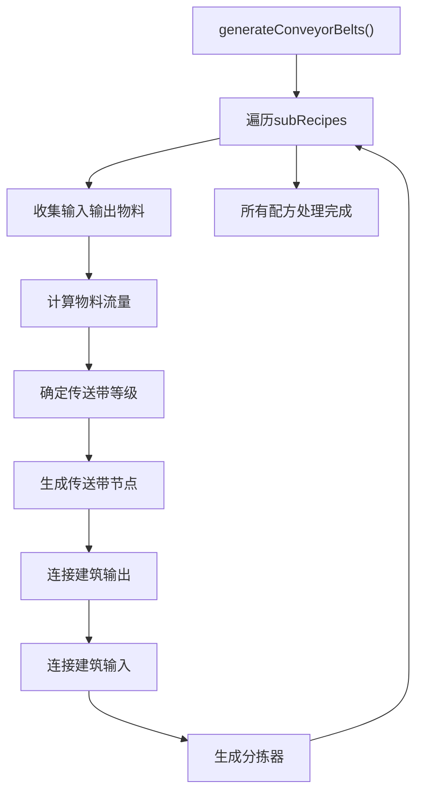

### 5.2 传送带节点生成

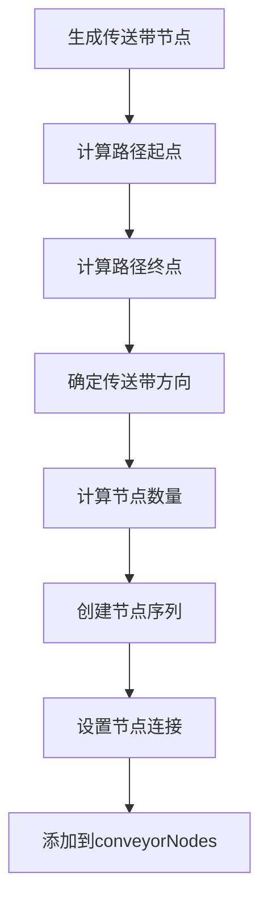

### 5.3 传送带速度选择

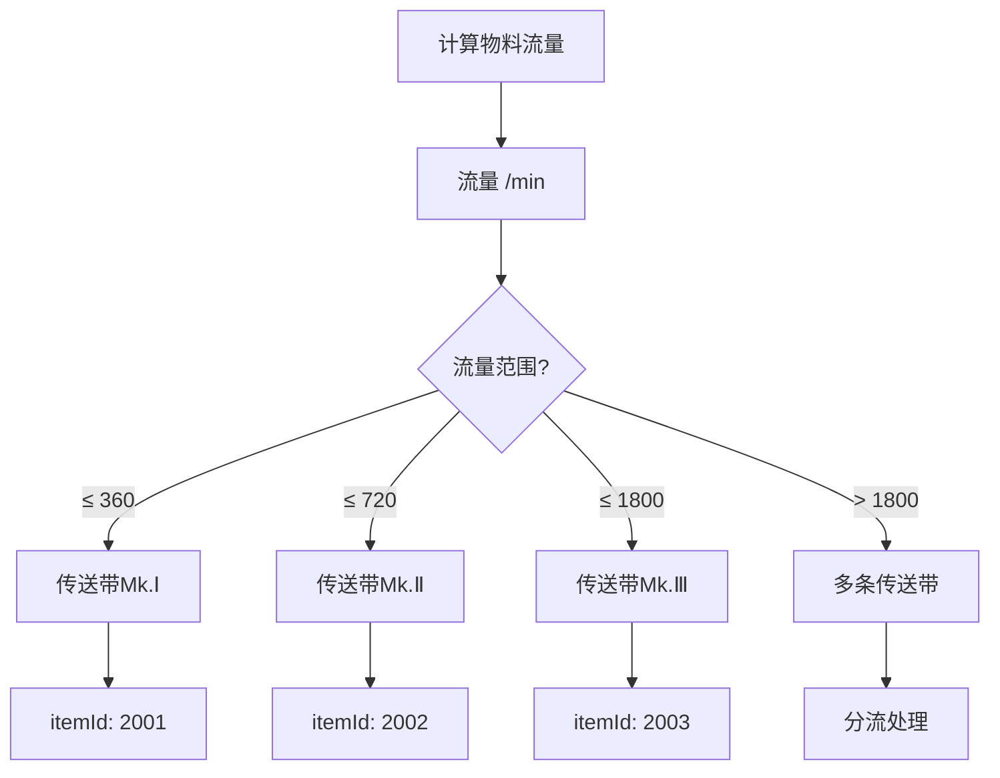

### 5.4 分拣器类型

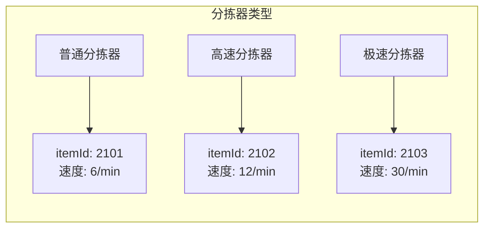

### 5.5 传送带节点结构

```javascript
{
    index: 0,                    // 节点索引
    localOffset: [0, 0, 0],      // 坐标
    itemId: 2003,                // 传送带类型ID
    modelIndex: 0,               // 模型索引
    outputObjIdx: 1,             // 输出对象索引
    inputObjIdx: 2,              // 输入对象索引
    outputToSlot: 0,             // 输出槽位
    inputFromSlot: 0,            // 输入槽位
    parameters: {
        direction: 0             // 方向 (0-3)
    }
}
```

---

## 6. 增产剂系统

### 6.1 generateConveyorBeltsForSprayCoater() 流程

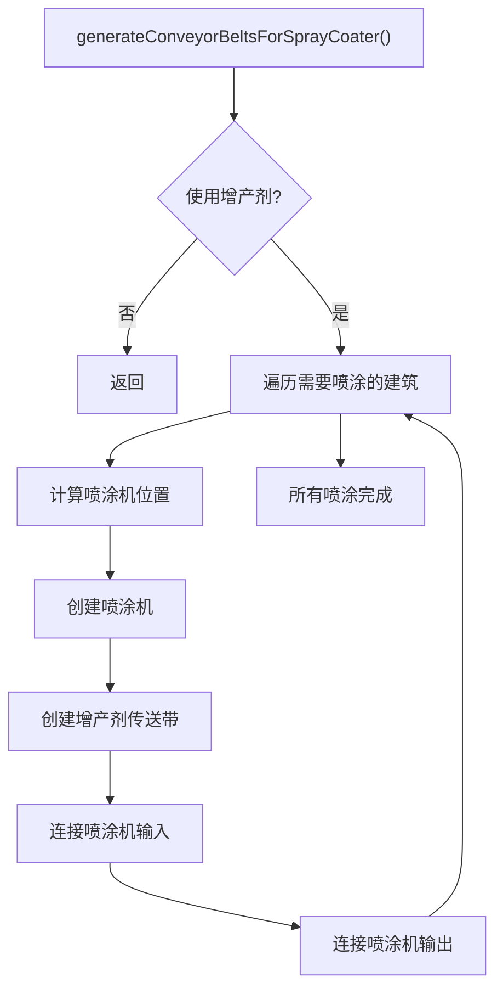

### 6.2 喷涂机布局

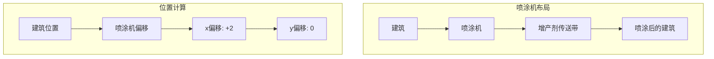

### 6.3 喷涂机对象结构

```javascript
{
    index: 100,                  // 喷涂机索引
    localOffset: [10, 0, 0],     // 坐标
    itemId: 2310,                // 喷涂机ID
    modelIndex: 0,
    outputObjIdx: 101,           // 输出到建筑
    inputObjIdx: 102,            // 输入来自传送带
    parameters: {
        proliferator: "增产剂Mk.Ⅲ"  // 增产剂类型
    }
}
```

### 6.4 增产剂消耗计算

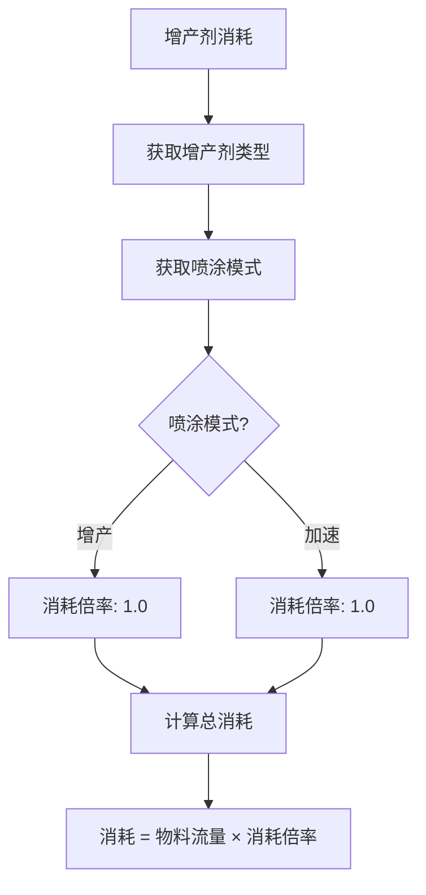

---

## 7. 堆叠功能

### 7.1 cloneToStackLayers() 流程

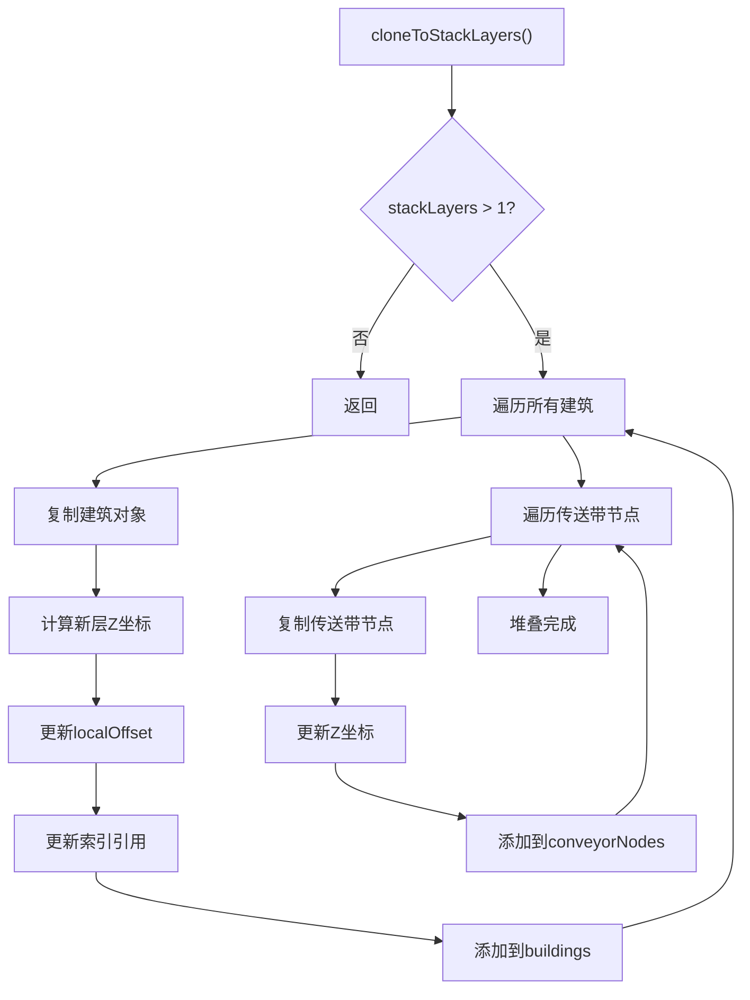

### 7.2 堆叠层数计算

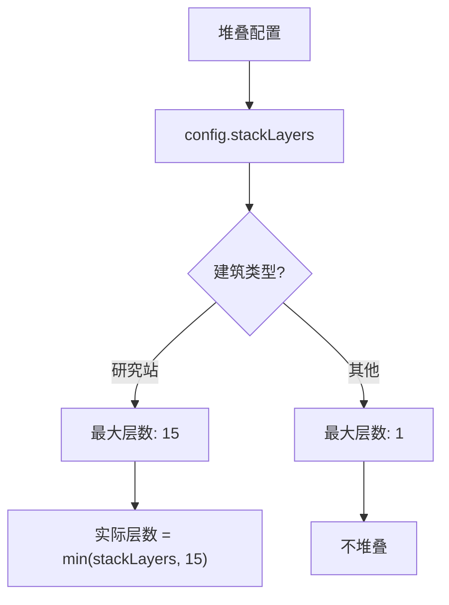

### 7.3 堆叠后建筑数量

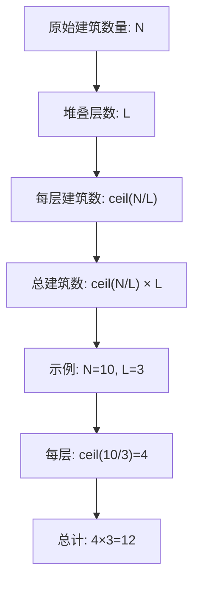

### 7.4 堆叠坐标计算

```javascript
// Z轴坐标计算
const layerHeight = 3;  // 每层高度
for (let layer = 1; layer < stackLayers; layer++) {
    const newBuilding = JSON.parse(JSON.stringify(building));
    newBuilding.localOffset[2] = layer * layerHeight;
    newBuilding.index = this.buildingIndex++;
    this.buildings.push(newBuilding);
}
```

---

## 8. 蓝图编码输出

### 8.1 toStr() 编码流程

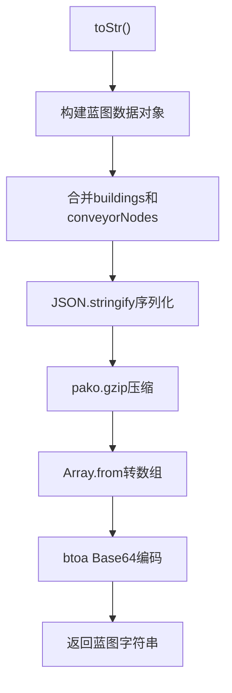

### 8.2 蓝图数据结构

```javascript
{
    version: '1.0.0',
    buildings: [
        // 所有建筑和传送带节点
    ],
    header: {
        version: '1.0.0',
        title: '蓝图标题',
        iconId: 1001,
        description: '描述',
        time: 1234567890,
        area: [0, 0, 0, 0]  // [minX, minY, maxX, maxY]
    }
}
```

### 8.3 编码示例

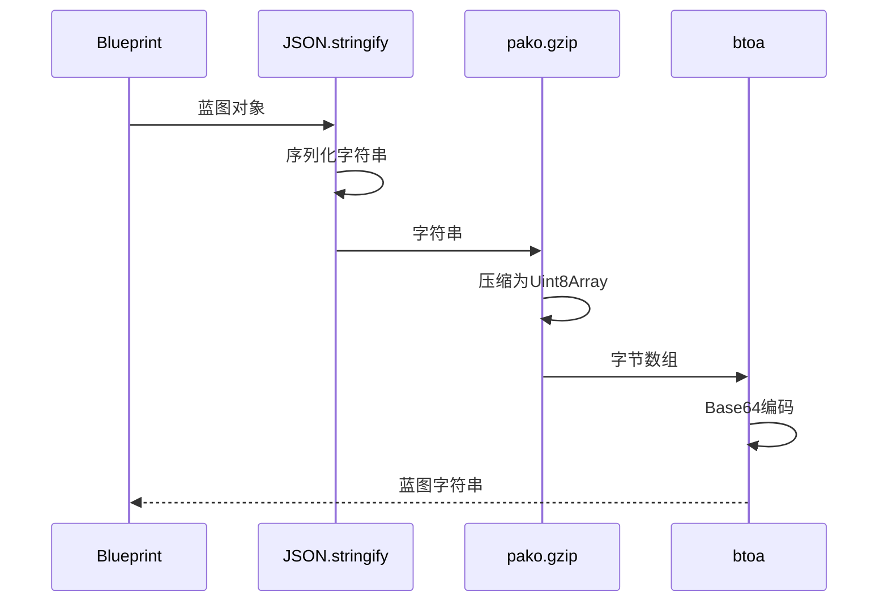

### 8.4 压缩效果

| 数据大小 | 压缩前 | 压缩后 | 压缩率 |
|----------|--------|--------|--------|
| 小型蓝图 | 5KB | 2KB | 60% |
| 中型蓝图 | 20KB | 6KB | 70% |
| 大型蓝图 | 100KB | 25KB | 75% |

---

## 9. Worker异步处理

### 9.1 blueprint.worker.js 结构

```javascript
// 导入依赖
importScripts('blueprint.js');
importScripts('pako.js');

// 消息处理
self.onmessage = function(e) {
    const { taskId, title, iconId, recipe, config } = e.data;
    
    try {
        // 创建蓝图实例
        const bp = new Blueprint(title, iconId, recipe, config);
        
        // 执行生成流程
        bp.init();
        bp.generateBuildings();
        bp.generateConveyorBelts();
        bp.generateConveyorBeltsForSprayCoater();
        bp.cloneToStackLayers();
        
        // 编码输出
        const bpStr = bp.toStr();
        
        // 返回成功结果
        self.postMessage({
            taskId: taskId,
            type: 'SUCCESS',
            payload: bpStr
        });
        
    } catch (error) {
        // 返回错误
        self.postMessage({
            taskId: taskId,
            type: 'ERROR',
            payload: error.message
        });
    }
};
```

### 9.2 Worker通信流程

```mermaid
sequenceDiagram
    participant Main as 主线程
    participant Facade as BlueprintFacade
    participant Worker as Worker线程
    participant BP as Blueprint
    
    Main->>Facade: generateAsync()
    Facade->>Facade: 检查_isGenerating
    Facade->>Worker: 创建Worker
    Facade->>Worker: postMessage(config)
    
    Worker->>BP: new Blueprint()
    Worker->>BP: init()
    Worker->>BP: generateBuildings()
    Worker->>BP: generateConveyorBelts()
    Worker->>BP: toStr()
    
    Worker-->>Facade: postMessage(result)
    Facade->>Facade: cleanup()
    Facade-->>Main: Promise.resolve()
```

### 9.3 Worker错误处理

```mermaid
flowchart TD
    A["Worker执行"] --> B{"执行成功?"}
    B -->|是| C["返回SUCCESS"]
    B -->|否| D["捕获异常"]
    D --> E["返回ERROR"]
    E --> F["主线程处理错误"]
    F --> G["显示错误提示"]
    C --> H["主线程处理结果"]
    H --> I["复制到剪贴板"]
```

---

## 10. Facade外观层

### 10.1 BlueprintFacade类

```mermaid
classDiagram
    class BlueprintFacade {
        -_isGenerating: boolean
        -_worker: Worker
        +generateAsync(title, iconId, recipe, config): Promise~string~
        -_createWorker(): Worker
        -_cleanup(): void
    }
    
    class Worker {
        +onmessage: Function
        +postMessage(data): void
        +terminate(): void
    }
    
    BlueprintFacade --> Worker : 管理
```

### 10.2 generateAsync() 实现

```javascript
static generateAsync(title, iconId, recipe, config) {
    // 检查是否正在生成
    if (this._isGenerating) {
        return Promise.reject(new Error('ERR_ALREADY_RUNNING'));
    }
    this._isGenerating = true;
    
    return new Promise((resolve, reject) => {
        // 检查Worker支持
        if (typeof Worker !== 'undefined') {
            // 使用Worker异步生成
            this._worker = this._createWorker();
            
            this._worker.onmessage = (e) => {
                this._cleanup();
                
                if (e.data.type === 'SUCCESS') {
                    resolve(e.data.payload);
                } else {
                    reject(new Error(e.data.payload));
                }
            };
            
            this._worker.postMessage({
                taskId: Date.now(),
                title, iconId, recipe, config
            });
            
        } else {
            // 降级到主线程同步生成
            try {
                const bp = new Blueprint(title, iconId, recipe, config);
                bp.init();
                bp.generateBuildings();
                bp.generateConveyorBelts();
                bp.generateConveyorBeltsForSprayCoater();
                bp.cloneToStackLayers();
                
                resolve(bp.toStr());
            } catch (error) {
                reject(error);
            } finally {
                this._isGenerating = false;
            }
        }
    });
}
```

### 10.3 Facade调用流程

```mermaid
sequenceDiagram
    participant Data as data.js
    participant Facade as BlueprintFacade
    participant Worker as Worker
    participant BP as Blueprint
    
    Data->>Facade: generateAsync(title, iconId, recipe, config)
    
    Facade->>Facade: 检查_isGenerating
    
    alt Worker支持
        Facade->>Worker: 创建Worker
        Facade->>Worker: postMessage()
        Worker->>BP: new Blueprint()
        Worker->>BP: 生成流程
        Worker-->>Facade: postMessage(result)
        Facade->>Facade: _cleanup()
        Facade-->>Data: resolve(bpStr)
    else Worker不支持
        Facade->>BP: new Blueprint()
        Facade->>BP: 生成流程
        Facade-->>Data: resolve(bpStr)
    end
```

---

## 11. 完整流程图

### 11.1 蓝图生成完整流程

```mermaid
flowchart TD
    subgraph 触发阶段
        A[用户点击生成蓝图] --> B[generateBlueprint]
        B --> C[getRecipe收集配方]
        C --> D[构建outputRecipe]
    end
    
    subgraph 异步处理
        D --> E[BlueprintFacade.generateAsync]
        E --> F{Worker支持?}
        F -->|是| G[创建Worker]
        F -->|否| H[主线程执行]
    end
    
    subgraph 初始化阶段
        G --> I[new Blueprint]
        H --> I
        I --> J[init]
        J --> K[mapRecipeID]
        K --> L{stackLayers > 1?}
        L -->|是| M[缩减num]
        L -->|否| N[保持num]
        M --> O[calculateBlueprintArea]
        N --> O
    end
    
    subgraph 建筑生成
        O --> P[generateBuildings]
        P --> Q[遍历subRecipes]
        Q --> R[newProductionBuilding]
        R --> S[计算位置]
        S --> T[创建建筑]
        T --> U[创建分拣器]
        U --> Q
    end
    
    subgraph 传送带生成
        Q --> V[generateConveyorBelts]
        V --> W[计算流量]
        W --> X[选择传送带等级]
        X --> Y[生成节点]
        Y --> Z[连接建筑]
    end
    
    subgraph 增产剂处理
        Z --> AA{使用增产剂?}
        AA -->|是| AB[generateConveyorBeltsForSprayCoater]
        AA -->|否| AC{stackLayers > 1?}
        AB --> AC
    end
    
    subgraph 堆叠处理
        AC -->|是| AD[cloneToStackLayers]
        AC -->|否| AE[toStr]
        AD --> AE
    end
    
    subgraph 编码输出
        AE --> AF[JSON序列化]
        AF --> AG[Gzip压缩]
        AG --> AH[Base64编码]
        AH --> AI[返回蓝图字符串]
    end
    
    subgraph 结果处理
        AI --> AJ[复制到剪贴板]
        AJ --> AK[显示成功提示]
    end
```

### 11.2 建筑布局算法流程

```mermaid
flowchart TD
    A["开始布局"] --> B["获取建筑类型"]
    B --> C["获取建筑尺寸"]
    C --> D["获取建筑数量"]
    D --> E["计算布局参数"]
    
    E --> F["计算列数 = ceil(sqrt(num))"]
    F --> G["计算行数 = ceil(num / cols)"]
    
    G --> H["遍历每个建筑"]
    H --> I["计算行列坐标"]
    I --> J["col = index % cols"]
    J --> K["row = floor(index / cols)"]
    
    K --> L["计算世界坐标"]
    L --> M["x = col * spacing + offsetX"]
    M --> N["y = row * spacing + offsetY"]
    
    N --> O["检查区域占用"]
    O --> P{"区域可用?"}
    P -->|是| Q["标记占用"]
    P -->|否| R["移动位置"]
    R --> L
    
    Q --> S["创建建筑对象"]
    S --> T{"还有建筑?"}
    T -->|是| H
    T -->|否| U["布局完成"]
```

### 11.3 传送带网络生成流程

```mermaid
flowchart TD
    A["开始生成传送带"] --> B["收集所有物料流"]
    B --> C["遍历每个物料流"]
    
    C --> D["获取源建筑"]
    D --> E["获取目标建筑"]
    E --> F["计算流量"]
    
    F --> G{"流量范围?"}
    G -->|"≤ 360"| H["传送带Mk.Ⅰ"]
    G -->|"≤ 720"| I["传送带Mk.Ⅱ"]
    G -->|"≤ 1800"| J["传送带Mk.Ⅲ"]
    G -->|"> 1800"| K["多条传送带"]
    
    H --> L["计算路径"]
    I --> L
    J --> L
    K --> M["分流处理"]
    M --> L
    
    L --> N["生成节点序列"]
    N --> O["设置节点方向"]
    O --> P["连接分拣器"]
    
    P --> Q{"还有物料流?"}
    Q -->|是| C
    Q -->|否| R["传送带网络完成"]
```

---

## 12. 关键常量速查

### 12.1 建筑ID映射

| 建筑名称 | itemId | 尺寸 |
|----------|--------|------|
| 电弧熔炉 | 2308 | 3×3 |
| 位面熔炉 | 2315 | 3×3 |
| 负熵熔炉 | 2316 | 3×3 |
| 制作台Mk.Ⅰ | 2301 | 4×4 |
| 制作台Mk.Ⅱ | 2302 | 4×4 |
| 制作台Mk.Ⅲ | 2303 | 4×4 |
| 重组式制造台 | 2317 | 4×4 |
| 矩阵研究站 | 2901 | 3×3 |
| 自演化研究站 | 2910 | 3×3 |
| 化工厂 | 2309 | 5×5 |
| 量子化工厂 | 2318 | 5×5 |
| 粒子对撞机 | 2310 | 5×5 |
| 原油精炼机 | 2305 | 5×5 |
| 分馏塔 | 2306 | 3×3 |
| 喷涂机 | 2311 | 3×3 |

### 12.2 传送带ID映射

| 传送带名称 | itemId | 运力(/min) |
|------------|--------|------------|
| 传送带Mk.Ⅰ | 2001 | 360 |
| 传送带Mk.Ⅱ | 2002 | 720 |
| 传送带Mk.Ⅲ | 2003 | 1800 |

### 12.3 分拣器ID映射

| 分拣器名称 | itemId | 速度(/min) |
|------------|--------|------------|
| 分拣器Mk.Ⅰ | 2101 | 6 |
| 分拣器Mk.Ⅱ | 2102 | 12 |
| 分拣器Mk.Ⅲ | 2103 | 30 |

### 12.4 建筑间距配置

| 建筑类型 | 间距 | 说明 |
|----------|------|------|
| 熔炉 | 2 | 紧凑排列 |
| 制作台 | 2 | 紧凑排列 |
| 化工厂 | 3 | 留出管道空间 |
| 粒子对撞机 | 4 | 大型建筑 |
| 研究站 | 1 | 可堆叠 |

### 12.5 堆叠参数

| 参数 | 值 | 说明 |
|------|-----|------|
| 最大堆叠层数 | 15 | 仅研究站 |
| 层间距 | 3 | Z轴间距 |
| 堆叠建筑类型 | 研究站 | 其他不支持 |

---

## 附录：错误处理

### A. 常见错误码

| 错误码 | 说明 | 处理方式 |
|--------|------|----------|
| ERR_ALREADY_RUNNING | 已有蓝图正在生成 | 等待完成或取消 |
| ERR_NO_RECIPE | 配方数据无效 | 检查配方数据 |
| ERR_BUILDING_OVERFLOW | 建筑超出蓝图范围 | 减少建筑数量 |
| ERR_CONFLICT | 建筑位置冲突 | 调整布局参数 |

### B. 错误处理流程

```mermaid
flowchart TD
    A["错误发生"] --> B{"错误类型?"}
    B -->|Worker错误| C["Worker返回ERROR"]
    B -->|主线程错误| D["catch捕获"]
    
    C --> E["Facade处理"]
    D --> E
    
    E --> F["reject Promise"]
    F --> G["data.js处理"]
    G --> H["显示错误提示"]
    H --> I["重置状态"]
```

