# 蓝图模块说明文档

> 文档状态（2026-04-04）：历史归档，不再与当前代码同步维护。  
> 说明：文中大量行号、文件关系与架构描述基于 2026-03 的单体脚本阶段。  
> 当前请优先参考：localDocs/网站完善实施计划.md、localDocs/当前项目架构与成熟网站差距分析.md、localDocs/index拆分结构清单.md。

## 目录

- [1. 模块概述](#1-模块概述)
- [2. 核心数据结构](#2-核心数据结构)
- [3. Blueprint 类详解](#3-blueprint-类详解)
- [4. 初始化阶段](#4-初始化阶段)
- [5. 建筑布局阶段](#5-建筑布局阶段)
- [6. 传送带网络阶段](#6-传送带网络阶段)
- [7. 增产剂喷涂阶段](#7-增产剂喷涂阶段)
- [8. 建筑堆叠阶段](#8-建筑堆叠阶段)
- [9. 蓝图编码阶段](#9-蓝图编码阶段)
- [10. 配置参数详解](#10-配置参数详解)
- [11. 关键算法与边界处理](#11-关键算法与边界处理)
- [附录A：调用示例](#附录a调用示例)
- [附录B：关键常量速查](#附录b关键常量速查)

***

## 1. 模块概述

### 1.1 功能定位

`blueprint.js` 是戴森球计划量产计算器的蓝图生成核心模块，承担以下职责：

| 功能        | 说明                  |
| --------- | ------------------- |
| **数据映射**  | 维护游戏物品、建筑、配方的ID映射关系 |
| **布局计算**  | 根据配方计算结果生成合理的建筑布局   |
| **传送带网络** | 自动连接输入输出分拣器，构建物流网络  |
| **增产剂系统** | 生成喷涂机和增产剂供应传送带      |
| **建筑堆叠**  | 支持垂直堆叠多层建筑，减少占地面积   |
| **蓝图编码**  | 将布局数据编码为游戏可识别的蓝图字符串 |

### 1.2 依赖关系

```
data.js ──────────────→ blueprint.js ──────────────→ pako.js/cocoMessage.js
配方计算结果           蓝图生成核心               压缩/错误提示
- targetItem          - itemMap                   - Gzip压缩
- targetRate          - buildingMap               - Base64编码
- proliferator        - recipeMap                 - 错误提示
- acceleratorMode     - Blueprint类
- subRecipes
```

### 1.3 核心设计理念

```
┌─────────────────────────────────────────────────────────────────────────┐
│                           蓝图生成核心流程                              │
│                                                                         │
│  输入：配方数据（subRecipes）                                           │
│   ↓                                                                   │
│  Phase 1: init() - 初始化与预处理                                       │
│   - 配方ID映射                                                         │
│   - 堆叠层数处理（stackLayers）                                        │
│   - 蓝图面积计算                                                       │
│   ↓                                                                   │
│  Phase 2: generateBuildings() - 建筑生成                                │
│   - 生产设备布局                                                       │
│   - 分拣器关联                                                         │
│   - 研究站垂直堆叠（maxLabLayers）                                     │
│   ↓                                                                   │
│  Phase 3: generateConveyorBelts() - 传送带网络                          │
│   - 物料流量计算                                                       │
│   - 传送带生成                                                         │
│   - 分拣器连接                                                         │
│   ↓                                                                   │
│  Phase 4: generateConveyorBeltsForSprayCoater() - 增产剂系统            │
│   - 喷涂机布局                                                         │
│   - 增产剂供应网络                                                     │
│   ↓                                                                   │
│  Phase 5: cloneToStackLayers() - 建筑堆叠                               │
│   - 克隆设备到高层                                                     │
│   - Index引用重映射                                                   │
│   - 共享传送带网络                                                     │
│   ↓                                                                   │
│  输出：蓝图字符串（编码后）                                             │
└─────────────────────────────────────────────────────────────────────────┘
```

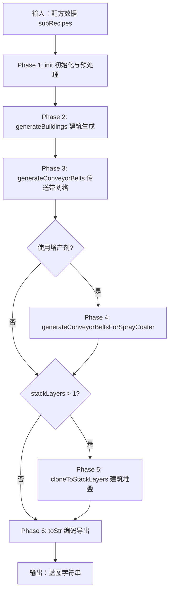

***

## 2. 核心数据结构

### 2.1 物品映射表 itemMap

**代码位置**: `blueprint.js` L1-165

```javascript
const itemMap = {
    // 基础资源
    sand: { name: "sand", iconId: 1099, remark: "沙土" },
    water: { name: "water", iconId: 1000, remark: "水" },
    ironOre: { name: "ironOre", iconId: 1001, remark: "铁矿" },
    
    // 增产剂（含增产/加速参数）
    proliferatorMk1: { 
        name: "proliferatorMk1", 
        iconId: 1141, 
        extra_rate: 0.125,    // 增产模式额外产出 +12.5%
        accelerate: 0.25,     // 加速模式速度加成 +25%
        remark: "增产剂Mk.Ⅰ" 
    },
    proliferatorMk2: { 
        name: "proliferatorMk2", 
        iconId: 1142, 
        extra_rate: 0.2,      // 增产模式额外产出 +20%
        accelerate: 0.5,      // 加速模式速度加成 +50%
        remark: "增产剂Mk.Ⅱ" 
    },
    proliferatorMk3: { 
        name: "proliferatorMk3", 
        iconId: 1143, 
        extra_rate: 0.25,     // 增产模式额外产出 +25%
        accelerate: 1,        // 加速模式速度加成 +100%
        remark: "增产剂Mk.Ⅲ" 
    },
    
    // 高级产物
    circuitBoard: { name: "circuitBoard", iconId: 1301, remark: "电路板" },
    processor: { name: "processor", iconId: 1303, remark: "处理器" },
    quantumChip: { name: "quantumChip", iconId: 1305, remark: "量子芯片" },
    
    // 特殊映射：氢气输出
    hydrogenOutput: { name: "hydrogenOutput", iconId: 1120, remark: "氢" },
    // 当配方输入输出都含氢时，输出氢映射为hydrogenOutput避免冲突
};
```

**字段说明**：

| 字段           | 类型     | 说明                       |
| ------------ | ------ | ------------------------ |
| `name`       | String | 物品内部标识符（与 data.js 一致）    |
| `iconId`     | Number | 游戏内图标ID（用于传送带标记和蓝图显示）    |
| `extra_rate` | Number | 增产模式下额外产出比例（如0.25表示+25%） |
| `accelerate` | Number | 加速模式下生产速度加成（如1表示+100%）   |
| `remark`     | String | 中文名称（仅用于显示）              |

### 2.2 建筑映射表 buildingMap

**代码位置**: `blueprint.js` L166-299

```javascript
const buildingMap = {
    // 熔炉类
    arcSmelter: {
        remark: "电弧熔炉",
        name: "arcSmelter",
        itemId: 2302,
        modelIndex: 62,
        productionSpeed: 1,
        size: { x: 3, y: 3 },
        type: buildingType.production,
        category: productionCategory.smelter,
        slotMaxIndex: 7,         // 最大分拣器槽位索引
    },
    
    // 研究站类（支持垂直堆叠）
    lab: {
        remark: "矩阵研究站",
        name: "lab",
        itemId: 2901,
        modelIndex: 70,
        productionSpeed: 1,
        type: buildingType.production,
        category: productionCategory.lab,
        height: 3,              // 垂直堆叠高度（每层3格）
        slotMaxIndex: 11,       // 12个槽位（0-11）
    },
    
    // 分拣器类
    sorterMk1: {
        name: "sorterMk1",
        itemId: 2011,
        modelIndex: 41,
        sortingSpeed: 1.5,      // 90/min
        size: { x: 1, y: 1 },
        type: buildingType.sorter,
    },
    sorterMk4: {
        name: "sorterMk4",
        itemId: 2014,
        modelIndex: 483,
        sortingSpeed: 120,      // 7200/min（集装）
        size: { x: 1, y: 1 },
        type: buildingType.sorter,
    },
    
    // 传送带类
    conveyorBeltMk1: {
        name: "conveyorBeltMk1",
        itemId: 2001,
        modelIndex: 35,
        transportSpeed: 6,      // 360/min
        size: { x: 1, y: 1 },
        type: buildingType.conveyor,
    },
    conveyorBeltMK3: {
        name: "conveyorBeltMK3",
        itemId: 2003,
        modelIndex: 37,
        transportSpeed: 30,     // 1800/min
        size: { x: 1, y: 1 },
        type: buildingType.conveyor,
    },
};
```

### 2.3 生产类型常量

```javascript
const productionCategory = {
  smelter: 0,      // 熔炉
  assembling: 1,   // 制造台
  plant: 2,        // 化工厂
  refinery: 3,     // 精炼厂
  collider: 4,     // 对撞机
  lab: 5,          // 研究站
};

const buildingType = {
  production: 0,   // 生产建筑
  sorter: 1,       // 分拣器
  conveyor: 2,     // 传送带
};
```

### 2.4 配方映射表 recipeMap

**代码位置**: `blueprint.js` L300-436

```javascript
const recipeMap = {
  "ironOre=ironIngot": 1,                                    // 铁矿 -> 铁块
  "ironIngot+stoneBrick+circuitBoard+magneticCoil=lab": 10, // 矩阵研究站
  "magneticCoil+circuitBoard=蓝矩阵": 9,                    // 蓝矩阵
  "hydrogen+refinedOil=hydrogen+energeticGraphite": 58,     // X射线裂解
  "hydrogen+refinedOil=hydrogenOutput+energeticGraphite": 58, // 氢气输出映射
  // ... 更多配方
};
```

**配方字符串格式**：`输入物品+输入物品=输出物品+输出物品`

***

## 3. Blueprint 类详解

### 3.1 构造函数

**代码位置**: `blueprint.js` L437-599\`

```javascript
class Blueprint {
  constructor(title, iconId, recipe, config) {
    this.recipe = recipe;                    // 配方计算结果
    this.config = config;                    // 用户配置
    
    // 内部状态
    this.buildingIndex = -1;                 // 建筑索引计数器
    this.blueprintSize = { x: 0, y: 0 };     // 蓝图尺寸
    this.occupiedArea = [];                  // 占用区域记录
    this.buildings = [];                     // 建筑列表
    this.buildingArray = [];                 // 建筑二维数组（用于布局）
    this.sorters = {};                       // 分拣器信息
    this.sprayCoaterOffsetList = [];         // 喷涂机位置列表
    this.itemSummary = {};                   // 物料统计
    this.conveyorStartOffsetX = 0;           // 传送带起始X坐标
    this.lastProductionBuildingType = -1;    // 上一个生产建筑类型
    
    // 蓝图模板
    this.blueprintTemplate = {
      header: {
        layout: 10,
        icons: iconId,
        time: new Date(),
        gameVersion: "0.9.26.13026",
        shortDesc: title,
        desc: "",
      },
      version: 1,
      cursorOffset: { x: 0, y: 0 },
      cursorTargetArea: 0,
      dragBoxSize: { x: 1, y: 1 },
      primaryAreaIdx: 0,
      areas: [{ index: 0, parentIndex: -1, ... }],
      buildings: [],
    };
  }
}
```

### 3.2 核心方法概览

| 方法                                      | 功能                   | 返回值    |
| --------------------------------------- | -------------------- | ------ |
| `init()`                                | 初始化（配方映射、num缩减、面积计算） | void   |
| `mapRecipeID()`                         | 配方字符串映射为游戏配方ID       | void   |
| `calculateBlueprintArea()`              | 计算蓝图总占地面积            | void   |
| `getBuildingTemplate()`                 | 获取建筑模板对象             | Object |
| `newProductionBuilding(subRecipe)`      | 生成生产建筑和分拣器           | void   |
| `generateBuildings()`                   | 生成所有生产建筑             | void   |
| `generateConveyorBelts()`               | 生成物料传送带网络            | void   |
| `generateConveyorBeltsForSprayCoater()` | 生成增产剂传送带             | void   |
| `cloneToStackLayers()`                  | 克隆建筑到高层（堆叠功能）        | void   |
| `validateBeltLoad()`                    | 验证传送带负载              | Array  |
| `toStr()`                               | 导出蓝图字符串              | String |

***

## 4. 初始化阶段

### 4.1 init() 完整流程

**代码位置**: `blueprint.js` L2052-2083\`

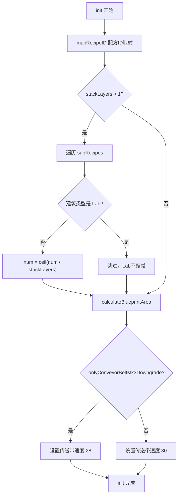

### 4.2 mapRecipeID() 配方映射详细逻辑

**代码位置**: `blueprint.js` L640-700\`

```javascript
mapRecipeID() {
    for (let subRecipe of this.recipe.subRecipes) {
        if (!subRecipe.input) {
            // 原料（无输入），跳过
            continue;
        }
        
        // Step 1: 拼接配方字符串
        let recipeStr = "";
        let isFirst = true;
        
        // 拼接输入
        for (let item of subRecipe.input) {
            if (isFirst) {
                recipeStr = item.name;
                isFirst = false;
            } else {
                recipeStr += "+" + item.name;
            }
        }
        
        // 拼接输出
        isFirst = true;
        for (let item of subRecipe.output) {
            if (isFirst) {
                recipeStr += "=" + item.name;
                isFirst = false;
            } else {
                recipeStr += "+" + item.name;
            }
        }
        
        // Step 2: 查找配方ID
        if (!recipeMap[recipeStr] || recipeMap[recipeStr] === -1) {
            cocoMessage.warning(
                `包含不支持的配方: ${recipeStr.replace("=", "->")}`,
                5000
            );
            throw `unknown recipe - ${recipeStr}`;
        }
        
        // Step 3: 特殊配方警告
        if ([58, 121].includes(recipeMap[recipeStr])) {
            // 58: X射线裂解(制氢)
            // 121: 重整精炼(制精炼油)
            cocoMessage.warning(
                `X射线裂解(制氢)与重整精炼(制精炼油)可能需手动提供初始启动的精炼油/氢`,
                5000
            );
        }
        
        subRecipe.recipeID = recipeMap[recipeStr];
    }
}
```

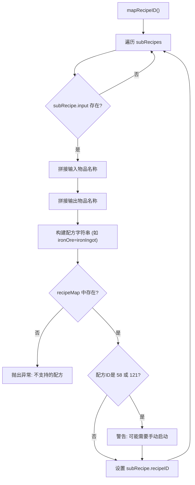

### 4.3 堆叠模式num缩减逻辑

**代码位置**: `blueprint.js` L2060-2080

```javascript
// 堆叠模式：根据堆叠层数缩减num
// 例如：60个设备，4层堆叠 → 每层15个设备
// init(): num=ceil(60/4)=15, 保存originalNum=60
// generateBuildings(): 15个设备在z=0
// generateConveyorBelts(): 使用originalNum计算原料需求
// cloneToStackLayers(): 复制15个设备到3层 → 总共60个设备
// 核心：4层并行工作，总产能=60min
if (this.config.stackLayers > 1) {
    for (let subRecipe of this.recipe.subRecipes) {
        if (subRecipe.building) {
            // 排除 Lab（不缩减num，保持完整产能）
            if (buildingMap[subRecipe.building.name].category !== productionCategory.lab) {
                // 保存原始 num，用于 generateConveyorBelts 中计算原料需求
                subRecipe.building.originalNum = subRecipe.building.num;
                subRecipe.building.num = Math.ceil(
                    subRecipe.building.num / this.config.stackLayers
                );
            }
        }
    }
}
```

### 4.4 calculateBlueprintArea() 面积计算

**代码位置**: `blueprint.js` L1038-1060\`

```javascript
calculateBlueprintArea() {
    let totalArea = 0;
    
    // Step 1: 累加所有建筑占地
    for (let subRecipe of this.recipe.subRecipes) {
        if (!subRecipe.building) {
            continue;
        }
        totalArea +=
            this.calculateBuildingArea(subRecipe).area *
            Math.ceil(subRecipe.building.num);
    }
    
    // Step 2: 根据长宽比计算尺寸
    let y = Math.ceil(Math.sqrt(totalArea / this.config.x_y_ratio));
    this.blueprintSize = {
        x: Math.ceil(this.config.x_y_ratio * y),
        y: y,
    };
    
    // Step 3: 初始化占用区域
    this.occupiedArea = [{ 
        x1: -1, 
        y1: -1, 
        x2: this.blueprintSize.x, 
        y2: -1 
    }];
}
```

### 4.5 calculateBuildingArea() 建筑面积计算

**代码位置**: `blueprint.js` L967-1036\`

```javascript
calculateBuildingArea(subRecipe) {
    if (!subRecipe.building) {
        return { area: 0, x: 0, y: 0, centerPoint: [0, 0, 0, 0] };
    }
    
    switch (buildingMap[subRecipe.building.name].category) {
        case productionCategory.smelter:
            // 熔炉：根据输入输出数量决定布局
            if (subRecipe.output.length + subRecipe.input.length <= 2) {
                return { area: 12, x: 3, y: 4, centerPoint: [2, 1, 1, 1], yaw: [0, 0] };
            } else {
                return { area: 16, x: 4, y: 4, centerPoint: [2, 2, 1, 1], yaw: [0, 0] };
            }
        case productionCategory.assembling:
            return { area: 16, x: 4, y: 4, centerPoint: [2, 2, 1, 1], yaw: [0, 0] };
        case productionCategory.plant:
            return { area: 48, x: 8, y: 6, centerPoint: [2, 4, 3, 3], yaw: [0, 0] };
        case productionCategory.refinery:
            if (this.config.compactLayout) {
                return { area: 30, x: 7, y: 5, centerPoint: [2, 3, 2, 3], yaw: [90, 90] };
            }
            return { area: 40, x: 8, y: 5, centerPoint: [2, 3, 2, 4], yaw: [90, 90] };
        case productionCategory.collider:
            if (this.config.compactLayout) {
                return { area: 66, x: 11, y: 6, centerPoint: [3, 5, 2, 5], yaw: [0, 0] };
            }
            return { area: 77, x: 11, y: 7, centerPoint: [3, 5, 3, 5], yaw: [0, 0] };
        case productionCategory.lab:
            return { area: 42, x: 7, y: 6, centerPoint: [3, 3, 2, 3], yaw: [0, 0] };
    }
}
```

**centerPoint说明**：

```
centerPoint: [y负边界距离, x正边界距离, y正边界距离, x负边界距离]

例如：centerPoint: [2, 2, 1, 1]
      表示建筑中心点到：
      - y轴负边界（上方）: 2格
      - x轴正边界（右侧）: 2格
      - y轴正边界（下方）: 1格
      - x轴负边界（左侧）: 1格
      总占地: (2+1) × (2+1) = 3×3
```

***

## 5. 建筑布局阶段

### 5.1 generateBuildings() 流程

**代码位置**: `blueprint.js` L2724-2732\`

```javascript
generateBuildings() {
    for (let subRecipe of this.recipe.subRecipes) {
        if (subRecipe.building === null) {
            continue;
        }
        this.newProductionBuilding(subRecipe);
    }
}
```

### 5.2 newProductionBuilding() 详细流程

**代码位置**: `blueprint.js` L1544-2050\`

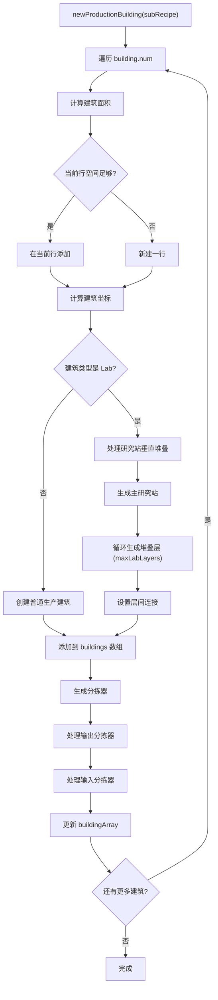

### 5.3 建筑坐标计算逻辑

**代码位置**: `blueprint.js` L1560-1600\`

```javascript
// 判断是否需要新建一行
if (this.blueprintSize.x - this.occupiedArea[this.occupiedArea.length - 1].x2 >= buildingArea.x / 2) {
    // 在当前行继续添加
    buildingX = this.occupiedArea[this.occupiedArea.length - 1].x2 + 1 + buildingArea.centerPoint[3];
    buildingY = this.occupiedArea[this.occupiedArea.length - 2].y2 + 1 + buildingArea.centerPoint[0];
    buildingZ = 0;
    
    // 更新占用区域x边界
    this.occupiedArea[this.occupiedArea.length - 1].x2 += buildingArea.x;
    
    // 如果当前建筑更宽（y轴方向），更新y边界
    if (buildingY + buildingArea.centerPoint[2] > this.occupiedArea[this.occupiedArea.length - 1].y2) {
        this.occupiedArea[this.occupiedArea.length - 1].y2 = buildingY + buildingArea.centerPoint[2];
    }
} else {
    // 新的一行
    needNewLine = true;
    hasTeslaTowerThisLine = false;
    teslaTowerDistance = 0;
    
    buildingX = buildingArea.centerPoint[3];
    buildingY = buildingArea.centerPoint[0] + this.occupiedArea[this.occupiedArea.length - 1].y2 + 1;
    buildingZ = 0;
    
    // 添加新的占用区域记录
    this.occupiedArea.push({
        x1: 0,
        y1: buildingY - buildingArea.centerPoint[0],
        x2: buildingX + buildingArea.centerPoint[1],
        y2: buildingY + buildingArea.centerPoint[2],
    });
}
```

### 5.4 生产建筑对象结构

**代码位置**: `blueprint.js` L1600-1640\`

```javascript
let newBuilding = {
    index: this.buildingIndex,              // 建筑唯一索引
    areaIndex: 0,                           // 区域索引（蓝图支持多区域）
    localOffset: [                          // 建筑位置（起点和终点）
        { x: buildingX, y: buildingY, z: buildingZ },
        { x: buildingX, y: buildingY, z: buildingZ },
    ],
    yaw: buildingArea.yaw,                  // 建筑朝向
    itemId: buildingMap[subRecipe.building.name].itemId,    // 建筑物品ID
    modelIndex: buildingMap[subRecipe.building.name].modelIndex, // 建筑模型ID
    outputObjIdx: -1,                       // 输出连接的建筑索引
    inputObjIdx: -1,                        // 输入连接的建筑索引
    outputToSlot: 0,                        // 输出到槽位
    inputFromSlot: 0,                       // 输入来自槽位
    outputFromSlot: 0,                      // 输出来自槽位
    inputToSlot: 0,                         // 输入到槽位
    outputOffset: 0,                        // 输出偏移
    inputOffset: 0,                         // 输入偏移
    recipeId: parseInt(subRecipe.recipeID), // 配方ID
    filterId: 0,                            // 过滤器ID
    parameters: {
        acceleratorMode: acceleratorMode,   // 加速模式（0=增产，1=加速）
    },
};
```

### 5.5 研究站垂直堆叠处理

**代码位置**: `blueprint.js` L1650-1700\`

```javascript
// 研究站特殊处理：支持垂直堆叠
if (buildingMap[subRecipe.building.name].category === productionCategory.lab) {
    // 设置研究站特有的槽位配置
    newBuilding.outputToSlot = 14;
    newBuilding.inputFromSlot = 15;
    newBuilding.outputFromSlot = 15;
    newBuilding.inputToSlot = 14;
    newBuilding.parameters.researchMode = 1;
    
    this.buildings.push(newBuilding);
    
    // 生成堆叠层（最多 maxLabLayers 层）
    for (i++; i < subRecipe.building.num && layers < this.config.maxLabLayers; i++, layers++) {
        let labBuilding = this.getBuildingTemplate();
        
        // 设置z轴高度（每层高度为 buildingMap.lab.height = 3）
        labBuilding.localOffset = [
            { x: buildingX, y: buildingY, z: buildingZ },
            { x: buildingX, y: buildingY, z: buildingZ },
        ];
        labBuilding.localOffset[0].z = buildingMap.lab.height * layers;
        labBuilding.localOffset[1].z = buildingMap.lab.height * layers;
        
        // 连接到上一层研究站
        labBuilding.inputObjIdx = this.buildingIndex - 1;
        labBuilding.outputToSlot = 14;
        labBuilding.inputFromSlot = 15;
        labBuilding.outputFromSlot = 15;
        labBuilding.inputToSlot = 14;
        labBuilding.parameters = {
            acceleratorMode: acceleratorMode,
            researchMode: 1,
        };
        
        this.buildings.push(labBuilding);
        stackLabBuildingIndexList.push(this.buildingIndex);
    }
    i--; // 回退一个，因为外层循环会 i++
}
```

### 5.6 分拣器生成逻辑

**代码位置**: `blueprint.js` L1750-2050\`

#### 5.6.1 输出分拣器生成

```javascript
// 计算实际输出速率
let actual_rate = outputItem.rate * productionSpeed * actual_building_num * extra_rate;

// 选择分拣器等级
let sorter = buildingMap.sorterMk1;
if (this.config.useSorterMk4 || this.config.onlySorterMk3 || actual_rate > sorter.sortingSpeed) {
    sorter = this.config.useSorterMk4 ? buildingMap.sorterMk4 : buildingMap.sorterMk3;
}

// 研究站层数过高时，一个分拣器可能不够用，需要追加
if (buildingMap[subRecipe.building.name].category === productionCategory.lab && actual_rate > sorter.sortingSpeed) {
    // 追加额外分拣器
    let newSorter2 = this.getBuildingTemplate();
    newSorter2.itemId = sorter.itemId;
    newSorter2.modelIndex = sorter.modelIndex;
    newSorter2.inputObjIdx = nowBuildingIndex;
    newSorter2.outputToSlot = -1;
    newSorter2.inputToSlot = 1;
    newSorter2.inputFromSlot = slotIndex - 3;  // 使用备用槽位
    newSorter2.filterId = itemMap[outputItem.name].iconId;
    newSorter2.parameters = { length: 1 };
    // ... 设置位置和朝向
    this.buildings.push(newSorter2);
    actual_rate -= sorter.sortingSpeed;  // 扣除已处理的速率
}

// 生成主分拣器
let newSorter = this.getBuildingTemplate();
newSorter.itemId = sorter.itemId;
newSorter.modelIndex = sorter.modelIndex;
newSorter.inputObjIdx = nowBuildingIndex;     // 连接到生产建筑
newSorter.outputToSlot = -1;                   // 输出方向（待传送带连接时设置）
newSorter.inputToSlot = 1;
newSorter.inputFromSlot = slotIndex;           // 从哪个槽位取物
newSorter.filterId = itemMap[outputItem.name].iconId;  // 过滤物品
newSorter.parameters = { length: 1 };
```

#### 5.6.2 输入分拣器生成

```javascript
// 计算实际输入速率
let actual_rate = inputItem.rate * productionSpeed * actual_building_num;
if (subRecipe.acceleratorMode === 1) {
    // 加速模式：原料消耗也加速
    actual_rate *= extra_rate;
}

// 选择分拣器等级（同输出分拣器逻辑）
let sorter = buildingMap.sorterMk1;
if (this.config.useSorterMk4 || this.config.onlySorterMk3 || actual_rate > sorter.sortingSpeed) {
    sorter = this.config.useSorterMk4 ? buildingMap.sorterMk4 : buildingMap.sorterMk3;
}

// 生成输入分拣器（rotate=1 表示进货方向）
let newSorter = this.getBuildingTemplate();
newSorter.itemId = sorter.itemId;
newSorter.modelIndex = sorter.modelIndex;
newSorter.outputObjIdx = nowBuildingIndex;     // 输出到生产建筑
newSorter.outputToSlot = slotIndex;            // 输出到哪个槽位
newSorter.inputFromSlot = -1;                   // 从传送带取物
newSorter.filterId = itemMap[inputItem.name].iconId;
newSorter.parameters = { length: 1 };

// 计算分拣器位置（根据建筑类型和槽位索引）
const offsetInfo = this.calculateSorterLocalOffsetAndYaw(
    { x: buildingX, y: buildingY, z: buildingZ },
    buildingMap[subRecipe.building.name].category,
    slotIndex,
    1  // rotate=1 表示输入方向
);
newSorter.localOffset = offsetInfo.offset;
newSorter.yaw = offsetInfo.yaw;
```

### 5.7 分拣器位置计算

**代码位置**: `blueprint.js` L951-1540\`

#### 5.7.1 熔炉/制造台分拣器位置

```javascript
// slotIndex 对应槽位位置：
// 8: 左上角（x-0.9, y-1）
// 7: 正上方（x, y-1）
// 6: 右上角（x+0.9, y-1）
// 5: 右侧上（x+1, y-0.8）
// 4: 右侧中（x+1, y）
// 3: 右侧下（x+1, y+0.8）

switch (slotIndex) {
    case 8:
        data.offset = [
            { x: buildingOffset.x - 0.9, y: buildingOffset.y - 1, z: 0 },
            { x: buildingOffset.x - 0.9, y: buildingOffset.y - 2, z: 0 },
        ];
        data.yaw = [(180 + rotate * 180) % 360, (180 + rotate * 180) % 360];
        break;
    case 7:
        data.offset = [
            { x: buildingOffset.x, y: buildingOffset.y - 1, z: 0 },
            { x: buildingOffset.x, y: buildingOffset.y - 2, z: 0 },
        ];
        data.yaw = [(180 + rotate * 180) % 360, (180 + rotate * 180) % 360];
        break;
    // ... 其他槽位
}
```

#### 5.7.2 化工厂分拣器位置

```javascript
// 化工厂尺寸较大（8x6），槽位分布更广
// 6: 左侧上（x-0.8, y-1）
// 5: 左侧中（x, y-1）
// 4: 左侧下（x+0.8, y-1）
// 3: 左侧底（x+1.6, y-1）
// 2: 右侧上（x+0.8, y+2）
// 1: 右侧中（x, y+2）
// 0: 右侧下（x-0.8, y+2）
```

#### 5.7.3 精炼厂分拣器位置

```javascript
// 精炼厂旋转90度，槽位分布沿y轴
// 8-6: 左侧（x-3, y-1/0/+1）
// 5-3: 顶部（x-0.8/0/+0.8, y+1）
// 2-0: 底部（x-0.8/0/+0.8, y-1）
```

### 5.8 电力感应塔生成

**代码位置**: `blueprint.js` L1700-1750\`

```javascript
if (this.config.generateTeslaTower) {
    // 计算感应塔位置
    let teslaTowerOffset = this.calculateTeslaTowerOffset(
        { x: buildingX, y: buildingY, z: buildingZ },
        buildingMap[subRecipe.building.name].category
    );
    teslaTowerDistance += teslaTowerOffset.distance;
    
    // 判断是否需要生成感应塔
    if ((hasTeslaTowerThisLine && teslaTowerDistance >= this.config.teslaTowerInterval) ||
        (!hasTeslaTowerThisLine && teslaTowerDistance >= this.config.teslaTowerInterval / 2) ||
        (teslaTowerDistance >= this.config.teslaTowerInterval / 2 &&
         this.blueprintSize.x - buildingX < this.config.teslaTowerInterval)) {
        
        let teslaTower = this.getBuildingTemplate();
        teslaTower.itemId = buildingMap.teslaTower.itemId;
        teslaTower.modelIndex = buildingMap.teslaTower.modelIndex;
        teslaTower.localOffset = [teslaTowerOffset.offset, teslaTowerOffset.offset];
        
        teslaTowerDistance = 0;
        hasTeslaTowerThisLine = true;
        this.buildings.push(teslaTower);
    }
}
```

### 5.9 sorters 数据结构

**代码位置**: `blueprint.js` L1800-1900\`

```javascript
// sorters 存储每个物品对应的所有分拣器信息
this.sorters = {
    "ironIngot": {
        output: [  // 输出分拣器列表
            {
                index: 5,              // 分拣器建筑索引
                rate: 1.5,             // 每秒输出速率
                ownerObjIdx: 0,        // 所属生产建筑索引
                ownerName: "arcSmelter",
                ownerOffset: { x: 3, y: 5, z: 0 },
                recipeID: 1,
            },
            // ... 更多输出分拣器
        ],
        input: [   // 输入分拣器列表
            {
                index: 10,
                rate: 2.0,
                ownerObjIdx: 3,
                ownerName: "assemblingMachineMk3",
                ownerOffset: { x: 8, y: 5, z: 0 },
                recipeID: 10,
            },
            // ... 更多输入分拣器
        ],
    },
    // ... 更多物品
};
```

***

## 6. 传送带网络阶段

### 6.1 generateConveyorBelts() 整体流程

**代码位置**: `blueprint.js` L2320-2720\`

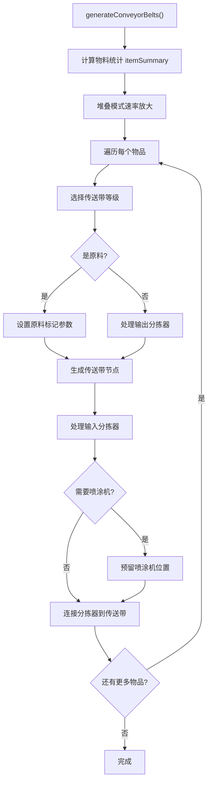

### 6.2 物料统计计算

**代码位置**: `blueprint.js` L2320-2400\`

```javascript
let itemSummary = {};

for (let subRecipe of this.recipe.subRecipes) {
    // 计算增产剂加成
    let extra_rate = 1;
    if (this.recipe.proliferator) {
        if (subRecipe.acceleratorMode === 0) {
            extra_rate += itemMap[this.recipe.proliferator].extra_rate;  // 增产模式
        } else if (subRecipe.acceleratorMode === 1) {
            extra_rate += itemMap[this.recipe.proliferator].accelerate;  // 加速模式
        }
    }
    
    // 处理输出物品
    for (let outputItem of subRecipe.output) {
        let outputRate = 0;
        let fromBuildingNum = 0;
        
        if (subRecipe.input === null) {
            // 原料：直接使用配方速率
            outputRate = outputItem.rate;
        } else {
            // 中间产物：计算实际产出速率
            if (buildingMap[subRecipe.building.name].category === productionCategory.lab) {
                // 研究站可堆叠，建筑数量需要特殊处理
                fromBuildingNum = Math.ceil(subRecipe.building.num / this.config.maxLabLayers);
            } else {
                fromBuildingNum = subRecipe.building.num;
            }
            outputRate = outputItem.rate * buildingMap[subRecipe.building.name].productionSpeed * subRecipe.building.num * extra_rate;
        }
        
        // 累加到统计
        if (itemSummary[outputItem.name]) {
            itemSummary[outputItem.name].fromBuildingNum += fromBuildingNum;
            itemSummary[outputItem.name].rate += outputRate;
        } else {
            itemSummary[outputItem.name] = {
                rate: outputRate,
                fromBuildingNum: fromBuildingNum,
                toBuildingNum: 0,
            };
        }
    }
    
    // 处理输入物品
    for (let inputItem of subRecipe.input) {
        let toBuildingNum = 0;
        if (buildingMap[subRecipe.building.name].category === productionCategory.lab) {
            toBuildingNum = Math.ceil(subRecipe.building.num / this.config.maxLabLayers);
        } else {
            toBuildingNum = subRecipe.building.num;
        }
        
        if (itemSummary[inputItem.name]) {
            itemSummary[inputItem.name].toBuildingNum += toBuildingNum;
            if (subRecipe.acceleratorMode !== -1) {
                itemSummary[inputItem.name].needProliferator = true;
            }
            // 计算输入速率
            if (subRecipe.acceleratorMode === 1) {
                itemSummary[inputItem.name].inputRate += inputItem.rate * productionSpeed * num * extra_rate;
            } else {
                itemSummary[inputItem.name].inputRate += inputItem.rate * productionSpeed * num;
            }
        } else {
            // 新建统计项
            itemSummary[inputItem.name] = {
                rate: 0,
                inputRate: inputItem.rate * productionSpeed * num * (subRecipe.acceleratorMode === 1 ? extra_rate : 1),
                fromBuildingNum: 0,
                toBuildingNum: toBuildingNum,
                needProliferator: subRecipe.acceleratorMode !== -1,
            };
        }
    }
}
```

### 6.3 itemSummary 数据结构

```javascript
itemSummary = {
    "ironOre": {
        rate: 0,              // 产出速率（原料为0）
        inputRate: 60,        // 消耗速率
        fromBuildingNum: 0,   // 产出建筑数量（原料为0）
        toBuildingNum: 10,    // 消耗建筑数量
        needProliferator: true, // 是否需要增产剂
    },
    "ironIngot": {
        rate: 60,             // 产出速率
        inputRate: 30,        // 消耗速率（部分被下游消耗）
        fromBuildingNum: 10,  // 产出建筑数量
        toBuildingNum: 5,     // 消耗建筑数量
        needProliferator: false,
    },
    // ... 更多物品
};
```

### 6.4 堆叠模式速率放大

**代码位置**: `blueprint.js` L2400-2450

```javascript
// 堆叠模式：传送带需要支撑所有堆叠层的总产能
// 使用 originalNum 而非 rate × stackLayers
const stackLayers = this.config.stackLayers || 1;
if (stackLayers > 1) {
    for (let key in itemSummary) {
        // 使用 originalNum 计算原料需求
        // 而非简单地将 rate × stackLayers
        if (itemSummary[key].inputRate !== undefined) {
            // 原料需求基于所有层的总设备数
            // 使用 originalNum 计算
        }
    }
    
    // 分拣器 rate 也需要根据 originalNum 调整
    for (let itemName in this.sorters) {
        if (this.sorters[itemName].output) {
            for (let s of this.sorters[itemName].output) {
                // 使用 originalNum 重新计算
            }
        }
        if (this.sorters[itemName].input) {
            for (let s of this.sorters[itemName].input) {
                // 使用 originalNum 重新计算
            }
        }
    }
}
```

### 6.5 传送带等级选择

**代码位置**: `blueprint.js` L2450-2480\`

```javascript
let conveyorBelt = buildingMap.conveyorBeltMk1;  // 默认一级传送带（360/min）

if (this.config.onlyConveyorBeltMk3) {
    // 强制使用三级传送带
    conveyorBelt = buildingMap.conveyorBeltMK3;
} else if (item.rate >= conveyorBelt.transportSpeed) {
    // 速率超过一级传送带容量
    if (item.rate === conveyorBelt.transportSpeed && this.config.upgradeConveyorBelt) {
        conveyorBelt = buildingMap.conveyorBeltMK3;
    } else if (item.rate > conveyorBelt.transportSpeed) {
        conveyorBelt = buildingMap.conveyorBeltMK3;  // 1800/min
    }
}

// 原料可以堆叠，最大传送速度更高
let maxTransportSpeed = buildingMap.conveyorBeltMK3.transportSpeed;
if (item.fromBuildingNum === 0) {
    maxTransportSpeed = buildingMap.conveyorBeltMK3.transportSpeed * this.config.conveyorBeltStackLayer;
}
```

### 6.6 传送带节点生成

**代码位置**: `blueprint.js` L2480-2680\`

#### 6.6.1 输入节点（连接输出分拣器）

```javascript
// 每个传送带节点最多连接 maxSorterNumOneBelt 个分拣器
// 堆叠模式下需要预留空间给克隆的分拣器
const sortersPerNode = stackLayers > 1
    ? Math.max(1, Math.floor(this.config.maxSorterNumOneBelt / stackLayers))
    : this.config.maxSorterNumOneBelt;

// 处理输出分拣器
if (item.fromBuildingNum !== 0) {
    for (let j = this.sorters[itemName].output.length - 1; j >= 0; j--) {
        // 当前传送带容量不足，需要新传送带
        if (this.sorters[itemName].output[j].rate - inputRate > zero) {
            break;
        }
        
        // 将分拣器分组到节点
        if ((doneSorterNum + 1) % sortersPerNode === 0 || doneSorterNum === 0) {
            inputData.push([this.sorters[itemName].output[j].index]);
        } else {
            inputData[inputData.length - 1].push(this.sorters[itemName].output[j].index);
        }
        
        inputRate -= this.sorters[itemName].output[j].rate;
        doneRate += this.sorters[itemName].output[j].rate;
        this.sorters[itemName].output.pop();
        doneSorterNum++;
    }
} else {
    // 原料：设置标记参数
    inputData.push([]);
    parameters = {
        iconId: itemMap[itemName].iconId,
        count: (inputRate * 60).toFixed(0),  // 每分钟数量
    };
    doneRate += inputRate;
}
```

#### 6.6.2 输出节点（连接输入分拣器）

```javascript
// 特殊处理：X射线裂解/重整精炼的输入优先级
if (["hydrogen", "refinedOil"].includes(itemName) && item.toBuildingNum !== 0) {
    // 重新排序，将配方58/121的建筑放到最后
    let input2 = [];
    for (let j = this.sorters[itemName].input.length - 1; j >= 0; j--) {
        if (!((itemName === "hydrogen" && this.sorters[itemName].input[j].recipeID === 58) ||
              (itemName === "refinedOil" && this.sorters[itemName].input[j].recipeID === 121))) {
            input2.push(this.sorters[itemName].input[j]);
        }
    }
    // ... 重新组合
}

// 处理输入分拣器
if (item.toBuildingNum !== 0) {
    for (let j = this.sorters[itemName].input.length - 1; j >= 0; j--) {
        // 检查传送带容量
        if (totalDoneRate + zero < item.rate && outputRate + zero < this.sorters[itemName].input[j].rate) {
            // 当前传送带容量不足，需要新传送带
            break;
        }
        
        // 将分拣器分组到节点
        if ((doneSorterNum + 1) % sortersPerNode === 0 || doneSorterNum === 0) {
            outputData.push([this.sorters[itemName].input[j].index]);
        } else {
            outputData[outputData.length - 1].push(this.sorters[itemName].input[j].index);
        }
        
        outputRate += this.sorters[itemName].input[j].rate;
        this.sorters[itemName].input.pop();
        doneSorterNum++;
    }
}
```

### 6.7 newConveyor() 传送带生成

**代码位置**: `blueprint.js` L730-950\`

```javascript
newConveyor(conveyor, direction, inputData, outputData, parameters = null, needSprayCoater = false) {
    // direction = -1: y轴负方向（原料带）
    // direction = 1: y轴正方向（产物带）
    
    let nodeNum = 0;
    let buildingX = this.occupiedArea[this.occupiedArea.length - 1].x2 + 1;
    let buildingY = this.occupiedArea[this.occupiedArea.length - 2].y2;
    let buildingZ = 0;
    
    // 生成输入节点
    for (let i = 0; i < inputData.length; i++) {
        if (direction < 0) break;  // 原料带不需要输入节点
        
        buildingY += 1;
        let outputObjIdx = this.buildingIndex + 2;  // 指向下一个节点
        let outputToSlot = 1;
        
        this.buildings.push(this.newConveyorNode(
            { x: buildingX, y: buildingY, z: buildingZ },
            [0, 0],
            conveyor,
            outputObjIdx,
            outputToSlot,
            null
        ));
        nodeNum++;
        
        // 修改分拣器指向这个传送带节点
        for (let b of this.buildings) {
            if (inputData[i].includes(b.index)) {
                b.outputObjIdx = this.buildingIndex;
            }
        }
    }
    
    // 预留喷涂机位置
    if (needSprayCoater && direction > 0) {
        if (nodeNum % 2 === 0) {
            // 添加额外节点用于放置喷涂机
            this.buildings.push(this.newConveyorNode(...));
        }
        sprayCoaterOffset = { x: buildingX, y: ++buildingY, z: buildingZ };
        this.sprayCoaterOffsetList.push({...});
    }
    
    // 生成输出节点
    for (let i = 0; i < outputData.length; i++) {
        buildingY += 1;
        let outputObjIdx = -1;
        let outputToSlot = 0;
        
        // 计算连接关系
        if (!(direction > 0 && i === outputData.length - 1)) {
            if (!(direction < 0 && i === 0)) {
                outputObjIdx = this.buildingIndex + 1 + direction;
            }
        }
        
        // 最后一个节点设置参数（原料标记）
        let nodeParameters = null;
        if (direction > 0 && i === outputData.length - 1) {
            nodeParameters = parameters;
        }
        
        let nodeYaw = direction < 0 ? [180, 180] : [0, 0];
        
        this.buildings.push(this.newConveyorNode(
            { x: buildingX, y: buildingY, z: buildingZ },
            nodeYaw,
            conveyor,
            outputObjIdx,
            outputToSlot,
            nodeParameters
        ));
        nodeNum++;
        
        // 修改分拣器指向这个传送带节点
        for (let b of this.buildings) {
            if (outputData[i].includes(b.index)) {
                b.inputObjIdx = this.buildingIndex;
                b.inputFromSlot = -1;
            }
        }
    }
    
    // 原料带（direction < 0）需要额外节点
    if (direction < 0) {
        // ... 生成反向传送带节点
    }
    
    // 生成喷涂机
    if (needSprayCoater) {
        this.buildings.push(this.newSprayCoater(sprayCoaterOffset, sprayYaw));
    }
}
```

### 6.8 传送带节点数据结构

```javascript
// 传送带节点
{
    index: 25,                    // 节点索引
    areaIndex: 0,
    localOffset: [                // 位置
        { x: 15, y: 10, z: 0 },
        { x: 15, y: 10, z: 0 },
    ],
    yaw: [0, 0],                  // 朝向
    itemId: 2003,                 // 传送带物品ID
    modelIndex: 37,
    outputObjIdx: 26,             // 输出连接的下一个节点
    inputObjIdx: -1,              // 输入（传送带通常没有）
    outputToSlot: 1,              // 输出到槽位
    inputFromSlot: 0,
    outputFromSlot: 0,
    inputToSlot: 1,
    outputOffset: 0,
    inputOffset: 0,
    recipeId: 0,
    filterId: 0,
    parameters: {                 // 原料标记（仅原料带末端）
        iconId: 1001,             // 物品图标ID
        count: "3600",            // 每分钟数量
    },
}
```

***

## 7. 增产剂喷涂阶段

### 7.1 generateConveyorBeltsForSprayCoater() 整体流程

**代码位置**: `blueprint.js` L2734-2950\`

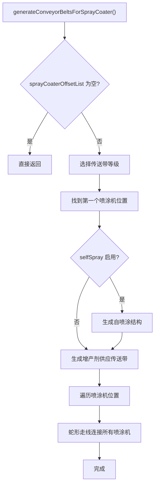

### 7.2 喷涂机位置确定

**代码位置**: `blueprint.js` L2750-2765\`

```javascript
// 找到第一个喷涂机位置（y最大，x最小）
let firstSprayOffset = this.sprayCoaterOffsetList[0];
for (let spray of this.sprayCoaterOffsetList) {
    if (spray.y > firstSprayOffset.y) {
        firstSprayOffset = spray;
        continue;
    }
    if (spray.y === firstSprayOffset.y && spray.x < firstSprayOffset.x) {
        firstSprayOffset = spray;
    }
}
```

### 7.3 自喷涂结构生成

**代码位置**: `blueprint.js` L2770-2900\`

```javascript
if (this.config.selfSpray) {
    // 自喷涂：增产剂本身也需要喷涂
    // 生成一个闭环结构，让增产剂喷涂自己
    
    let selfSprayConveyorStartOffset = {
        x: firstSprayOffset.x,
        y: firstSprayOffset.y,
        z: firstSprayOffset.z,
    };
    
    // 根据建筑类型调整偏移
    switch (this.lastProductionBuildingType) {
        case productionCategory.lab:
        case productionCategory.collider:
            selfSprayConveyorStartOffset.y += 2;
            break;
        case productionCategory.plant:
            selfSprayConveyorStartOffset.y += 1;
            break;
    }
    
    // 生成自喷涂喷涂机
    this.buildings.push(this.newSprayCoater(
        { x: this.conveyorStartOffsetX - 1, y: selfSprayConveyorStartOffset.y + 4, z: 0 },
        [0, 0]
    ));
    
    // 生成自喷涂传送带（复杂的3D走线）
    // 路径：起点 → 上升 → 水平移动 → 下降 → 终点
    // z坐标从0上升到1，实现立体交叉
    
    // 第一段：z=0 层
    this.buildings.push(this.newConveyorNode(
        { x: this.conveyorStartOffsetX - 1, y: selfSprayConveyorStartOffset.y + 6, z: 0 },
        [0, 0], conveyor, this.buildingIndex + 2, 1, proliferatorParameters
    ));
    // ... 更多节点
    
    // 第二段：z=0.5 过渡层
    this.buildings.push(this.newConveyorNode(
        { x: this.conveyorStartOffsetX - 2, y: selfSprayConveyorStartOffset.y + 4, z: 0.5 },
        [0, 0], conveyor, this.buildingIndex + 2, 1, null
    ));
    
    // 第三段：z=1 层（高架层）
    this.buildings.push(this.newConveyorNode(
        { x: this.conveyorStartOffsetX - 2, y: selfSprayConveyorStartOffset.y + 5, z: 1 },
        [0, 0], conveyor, this.buildingIndex + 2, 1, null
    ));
    // ... 更多节点
    
    // 连接到第一个喷涂机位置
    for (let i = 0; i < selfSprayConveyorStartOffset.x - this.conveyorStartOffsetX; i++) {
        this.buildings.push(this.newConveyorNode(
            { x: this.conveyorStartOffsetX + i, y: selfSprayConveyorStartOffset.y + 1, z: 1 },
            [0, 0], conveyor, this.buildingIndex + 2, 1, null
        ));
    }
    
    // 沿y轴下降到第一个喷涂机
    for (let i = 0; i < selfSprayConveyorStartOffset.y - firstSprayOffset.y; i++) {
        this.buildings.push(this.newConveyorNode(
            { x: selfSprayConveyorStartOffset.x - 1, y: selfSprayConveyorStartOffset.y - i, z: 1 },
            [0, 0], conveyor, this.buildingIndex + 2, 1, null
        ));
    }
    
    proliferatorParameters = null;  // 自喷涂后不需要再标记
}
```

### 7.4 增产剂供应传送带蛇形走线

**代码位置**: `blueprint.js` L2900-3100\`

```javascript
// 生成第一个喷涂机的入口节点
this.buildings.push(this.newConveyorNode(
    { x: firstSprayOffset.x - 1, y: firstSprayOffset.y, z: 1 },
    [0, 0], conveyor, this.buildingIndex + 2, 1, proliferatorParameters
));

let doneNum = 1;
let nowSpray = firstSprayOffset;
let direction = 1;  // 1: x正向, -1: x负向

// 蛇形走线：遍历所有喷涂机位置
while (doneNum < this.sprayCoaterOffsetList.length) {
    // 同一行内移动
    for (let spray of this.sprayCoaterOffsetList) {
        if (spray.y === nowSpray.y) {
            if (direction === 1 && spray.x > nowSpray.x) {
                // x轴正向移动
                for (let x = nowSpray.x + 1; x <= spray.x; x++) {
                    this.buildings.push(this.newConveyorNode(
                        { x: x, y: nowSpray.y, z: 1 },
                        [0, 0], conveyor, this.buildingIndex + 2, 1, null
                    ));
                }
                nowSpray = spray;
                doneNum++;
            } else if (direction === -1 && spray.x < nowSpray.x) {
                // x轴负向移动
                for (let x = nowSpray.x - 1; x >= spray.x; x--) {
                    this.buildings.push(this.newConveyorNode(
                        { x: x, y: nowSpray.y, z: 1 },
                        [0, 0], conveyor, this.buildingIndex + 2, 1, null
                    ));
                }
                nowSpray = spray;
                doneNum++;
            }
        }
    }
    
    if (doneNum === this.sprayCoaterOffsetList.length) break;
    
    // 换行：找到下一行的喷涂机
    let findNext = false;
    this.sprayCoaterOffsetList.reverse();
    
    for (let delta = 2; !findNext; delta += 2) {
        if (delta > nowSpray.y) {
            cocoMessage.error("喷涂剂排线错误", 4000);
            throw `generate sprayCoater error`;
        }
        
        for (let spray of this.sprayCoaterOffsetList) {
            if (spray.y === nowSpray.y - delta) {
                // 找到下一行的喷涂机
                // 生成换行传送带
                // ... 生成节点
                
                findNext = true;
                break;
            }
        }
    }
    
    direction *= -1;  // 反向
}
```

### 7.5 喷涂机数据结构

```javascript
// 喷涂机
{
    index: 50,
    areaIndex: 0,
    localOffset: [
        { x: 10, y: 15, z: 0 },
        { x: 10, y: 15, z: 0 },
    ],
    yaw: [0, 0],
    itemId: 2313,                 // 喷涂机物品ID
    modelIndex: 120,
    outputToSlot: 14,
    inputFromSlot: 15,
    outputFromSlot: 15,
    inputToSlot: 14,
    // ... 其他字段
}
```

***

## 8. 建筑堆叠阶段

### 8.1 cloneToStackLayers() 整体流程

**代码位置**: `blueprint.js` L2085-2260\`

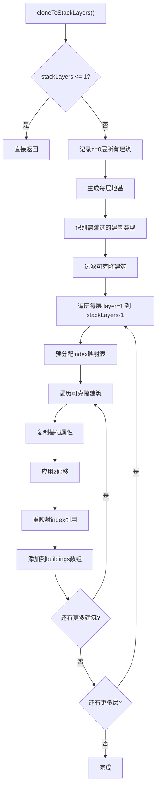

### 8.2 地基生成

**代码位置**: `blueprint.js` L2105-2125

```javascript
// 生成地基（每层独立地基）
// 地基索引计算：foundationStartIndex + layer
// 地基z坐标比设备z坐标低10格
// layer=0 → z=-10 地基（z=0层设备使用）
// layer=1 → z=0 地基（z=10层设备使用）
// layer=2 → z=10 地基（z=20层设备使用）
// layer=3 → z=20 地基（z=30层设备使用）

const foundationStartIndex = baseCount + 1;
for (let layer = 0; layer < stackLayers; layer++) {
    const foundationZ = (layer - 1) * zStep;  // z=-10, 0, 10, 20
    const foundationBuilding = this.getBuildingTemplate();
    foundationBuilding.itemId = 1131;         // 地基物品ID
    foundationBuilding.modelIndex = 37;
    foundationBuilding.localOffset = [
        { x: 0, y: 0, z: foundationZ },
        { x: 0, y: 0, z: foundationZ },
    ];
    foundationBuilding.inputToSlot = 1;
    foundationBuilding.parameters = null;
    this.buildings.push(foundationBuilding);
}
```

### 8.3 可克隆建筑过滤

**代码位置**: `blueprint.js` L2120-2150

```javascript
// 识别需跳过的建筑类型
const labItemIds = new Set([
    buildingMap.lab.itemId,
    buildingMap["自演化研究站"].itemId,
]);
const beltItemIds = new Set([2001, 2002, 2003]);  // 传送带
const sprayCoaterItemId = buildingMap.sprayCoater.itemId;
const teslaTowerItemId = 2201; // 电力感应塔

// 记录研究站索引
const labIndices = new Set();
for (const b of baseBuildings) {
    if (labItemIds.has(b.itemId)) {
        labIndices.add(b.index);
    }
}

// 过滤出需要克隆的建筑
const cloneableBuildings = baseBuildings.filter((b) => {
    // 排除研究站（布局复杂，不支持克隆）
    if (labItemIds.has(b.itemId)) return false;
    // 排除连接到研究站的分拣器
    if (labIndices.has(b.inputObjIdx) || labIndices.has(b.outputObjIdx)) return false;
    // 排除传送带（所有层共享）
    if (beltItemIds.has(b.itemId)) return false;
    // 排除喷涂机（增产剂系统不支持克隆）
    if (b.itemId === sprayCoaterItemId) return false;
    // 排除电力感应塔（z=0层可为所有层供电）
    if (b.itemId === teslaTowerItemId) return false;
    return true;
});
```

### 8.4 Index映射表预分配

**代码位置**: `blueprint.js` L2155-2170\`

```javascript
for (let layer = 1; layer < stackLayers; layer++) {
    const zOffset = layer * zStep;  // 10, 20, 30, ...
    
    // 预分配index映射表
    // 用于将原建筑index映射到克隆体index
    const indexMap = new Map();
    let nextIndex = this.buildingIndex + 1;
    
    for (const base of cloneableBuildings) {
        indexMap.set(base.index, nextIndex);
        nextIndex++;
    }
    // ...
}
```

### 8.5 克隆体创建

**代码位置**: `blueprint.js` L2170-2220\`

```javascript
for (const base of cloneableBuildings) {
    const clone = this.getBuildingTemplate();
    
    // 复制基础属性
    clone.itemId = base.itemId;
    clone.modelIndex = base.modelIndex;
    clone.areaIndex = base.areaIndex;
    clone.recipeId = base.recipeId;
    clone.filterId = base.filterId;
    clone.outputToSlot = base.outputToSlot;
    clone.inputFromSlot = base.inputFromSlot;
    clone.outputFromSlot = base.outputFromSlot;
    clone.inputToSlot = base.inputToSlot;
    clone.outputOffset = base.outputOffset;
    clone.inputOffset = base.inputOffset;
    
    // 应用z偏移
    clone.localOffset = base.localOffset
        ? base.localOffset.map((o) => ({
            x: o.x,
            y: o.y,
            z: (o.z || 0) + zOffset,  // z坐标增加
        }))
        : null;
    
    clone.yaw = base.yaw ? base.yaw.slice() : [0, 0];
    
    // 复制参数
    if (base.parameters !== null && base.parameters !== undefined) {
        clone.parameters = JSON.parse(JSON.stringify(base.parameters));
    } else {
        clone.parameters = null;
    }
    
    // index引用重映射
    // outputObjIdx：指向同层克隆设备或z=0传送带
    if (indexMap.has(base.outputObjIdx)) {
        clone.outputObjIdx = indexMap.get(base.outputObjIdx);
    } else {
        clone.outputObjIdx = base.outputObjIdx;  // 保留指向z=0传送带
    }
    
    // inputObjIdx：指向该层对应的地基
    if (base.inputObjIdx === -1) {
        clone.inputObjIdx = foundationStartIndex + layer;
    } else if (indexMap.has(base.inputObjIdx)) {
        clone.inputObjIdx = indexMap.get(base.inputObjIdx);
    } else {
        clone.inputObjIdx = base.inputObjIdx;
    }
    
    this.buildings.push(clone);
}
```

### 8.6 堆叠模式核心设计

```
堆叠模式工作原理：

┌─────────────────────────────────────────────────────────────┐
│                    z=30 层（第4层）                          │
│  [设备] ─分拣器→ [传送带节点] ←分拣器─ [设备]               │
│     ↓                      ↑                                │
│   地基(z=20)             共享                               │
│                            │                                │
├─────────────────────────────────────────────────────────────┤
│                    z=20 层（第3层）                          │
│  [设备] ─分拣器→ [传送带节点] ←分拣器─ [设备]               │
│     ↓                      ↑                                │
│   地基(z=10)             共享                               │
│                            │                                │
├─────────────────────────────────────────────────────────────┤
│                    z=10 层（第2层）                          │
│  [设备] ─分拣器→ [传送带节点] ←分拣器─ [设备]               │
│     ↓                      ↑                                │
│   地基(z=0)              共享                               │
│                            │                                │
├─────────────────────────────────────────────────────────────┤
│                    z=0 层（第1层）                           │
│  [设备] ─分拣器→ [传送带] ←分拣器─ [设备]                   │
│     ↓              ↓       ↓                                │
│   地基(z=-10)     [传送带网络]                              │
│                  ↓                                          │
│            [原料入口/产物出口]                               │
└─────────────────────────────────────────────────────────────┘

关键点：
1. 所有层的分拣器都连接到z=0的传送带网络
2. 每层设备连接到该层对应的地基（地基z比设备z低10格）
3. 传送带网络按总产能设计（使用originalNum计算）
4. 研究站不参与克隆（保持完整数量在z=0层）
5. 电力感应塔只在z=0层（可为所有层供电）
```

***

## 9. 蓝图编码阶段

### 9.1 toStr() 整体流程

**代码位置**: `blueprint.js` L3318-3400\`

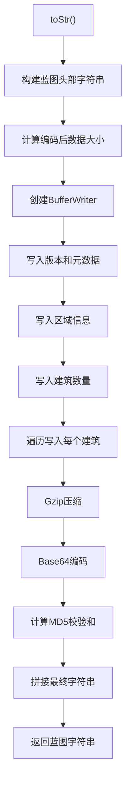

### 9.2 蓝图字符串格式

```
BLUEPRINT:0,10,<iconId>,0,<timestamp>,<gameVersion>,<shortDesc>,<desc>"<base64_gzip_data>"<md5_checksum>

示例：
BLUEPRINT:0,10,1301,0,638500000000000000,0.9.26.13026,量子芯片, "H4sIAAAAAAAA..."ABC123DEF456
```

### 9.3 头部编码

**代码位置**: `blueprint.js` L3330-3370\`

```javascript
let bp = this.blueprintTemplate;
let result = "BLUEPRINT:";
const TIME_BASE = new Date(0).setUTCFullYear(1);

result += "0,";
result += bp.header.layout;        // 布局版本
result += ",";
for (const i of bp.header.icons) {
    result += i;                   // 图标ID列表
    result += ",";
}
result += "0,";
result += (bp.header.time.getTime() - TIME_BASE) * 10000;  // 时间戳
result += ",";
result += bp.header.gameVersion;   // 游戏版本
result += ",";
result += encodeURIComponent(bp.header.shortDesc);  // 蓝图名称
result += ",";
result += encodeURIComponent(bp.header.desc);       // 蓝图描述
result += '"';
```

### 9.4 二进制数据编码

**代码位置**: `blueprint.js` L3370-3420\`

```javascript
// 计算编码后数据大小
const decoded = new Uint8Array(encodedSize(bp));
const writer = new BufferWriter(new DataView(decoded.buffer));

// 写入元数据
writer.setInt32(bp.version);
writer.setInt32(bp.cursorOffset.x);
writer.setInt32(bp.cursorOffset.y);
writer.setInt32(bp.cursorTargetArea);
writer.setInt32(bp.dragBoxSize.x);
writer.setInt32(bp.dragBoxSize.y);
writer.setInt32(bp.primaryAreaIdx);

// 写入区域信息
writer.setUint8(bp.areas.length);
for (const a of bp.areas) exportArea(writer, a);

// 写入建筑信息
writer.setInt32(bp.buildings.length);
for (const b of bp.buildings) exportBuilding(writer, b);

// Gzip压缩 + Base64编码
result += btoa(Uint8ArrayTob(pako.default.gzip(decoded)));

// 计算MD5校验和
const d = hex(digest(btoUint8Array(result).buffer));
result += '"';
result += d;
```

### 9.5 建筑编码 exportBuilding()

**代码位置**: `blueprint.js` L3995-4050\`

```javascript
function exportBuilding(w, b) {
    // 写入索引和区域
    w.setInt32(b.index);
    w.setInt8(b.areaIndex);
    
    // 写入位置（两个坐标点）
    w.setFloat32(b.localOffset[0].x);
    w.setFloat32(b.localOffset[0].y);
    w.setFloat32(b.localOffset[0].z);
    w.setFloat32(b.localOffset[1].x);
    w.setFloat32(b.localOffset[1].y);
    w.setFloat32(b.localOffset[1].z);
    
    // 写入朝向
    w.setFloat32(b.yaw[0]);
    w.setFloat32(b.yaw[1]);
    
    // 写入物品和模型ID
    w.setInt16(b.itemId);
    w.setInt16(b.modelIndex);
    
    // 写入连接关系
    w.setInt32(b.outputObjIdx);
    w.setInt32(b.inputObjIdx);
    
    // 写入槽位信息
    w.setInt8(b.outputToSlot);
    w.setInt8(b.inputFromSlot);
    w.setInt8(b.outputFromSlot);
    w.setInt8(b.inputToSlot);
    
    // 写入偏移
    w.setInt8(b.outputOffset);
    w.setInt8(b.inputOffset);
    
    // 写入配方和过滤器
    w.setInt16(b.recipeId);
    w.setInt16(b.filterId);
    
    // 写入参数
    if (b.parameters !== null) {
        const parser = parserFor(b.itemId);
        const length = parser.encodedSize(b.parameters);
        w.setInt16(length);
        parser.encode(b.parameters, w.getView(length * Int32Array.BYTES_PER_ELEMENT));
    } else {
        w.setInt16(0);
    }
}
```

### 9.6 参数编码器

**代码位置**: `blueprint.js` L3500-3990\`

```javascript
// 不同建筑类型有不同的参数编码器
const parameterParsers = new Map([
    [2103, stationParamsParser(stationDesc)],           // 行星物流站
    [2104, stationParamsParser(interstellarStationDesc)], // 星际物流站
    [2316, advancedMiningMachineParamParser()],         // 大型采矿机
    [2020, splitterParamParser],                        // 四向分流器
    [2901, labParamParser],                             // 矩阵研究站
    [2902, labParamParser],                             // 自演化研究站
    [2001, beltParamParser],                            // 传送带Mk.I
    [2002, beltParamParser],                            // 传送带Mk.II
    [2003, beltParamParser],                            // 传送带Mk.III
    [2011, inserterParamParser],                        // 分拣器Mk.I
    [2012, inserterParamParser],                        // 分拣器Mk.II
    [2013, inserterParamParser],                        // 分拣器Mk.III
    [2014, inserterParamParser],                        // 集装分拣器
    // ... 制造台使用 assembleParamParser
]);

// 传送带参数编码
const beltParamParser = {
    encodedSize() { return 2; },
    encode(p, a) {
        setParam(a, 0, p.iconId);   // 物品图标ID
        setParam(a, 1, p.count);    // 每分钟数量
    },
};

// 研究站参数编码
const labParamParser = {
    encodedSize() { return 2; },
    encode(p, a) {
        setParam(a, 0, p.researchMode);    // 研究模式
        setParam(a, 1, p.acceleratorMode); // 加速模式
    },
};

// 分拣器参数编码
const inserterParamParser = {
    encodedSize() { return 1; },
    encode(p, a) {
        setParam(a, 0, p.length);  // 分拣器长度
    },
};
```

### 9.7 MD5校验和计算

**代码位置**: `blueprint.js` L3400-3500\`

```javascript
// MD5实现（用于蓝图校验）
function digest(data) {
    const s = Int32Array.of(
        INIT_MD5F.getInt32(0, true),
        INIT_MD5F.getInt32(Int32Array.BYTES_PER_ELEMENT, true),
        INIT_MD5F.getInt32(2 * Int32Array.BYTES_PER_ELEMENT, true),
        INIT_MD5F.getInt32(3 * Int32Array.BYTES_PER_ELEMENT, true)
    );
    
    let i = 0;
    for (; i <= data.byteLength - BLOCK_SIZE; i += BLOCK_SIZE) {
        updateBlock(s, new DataView(data, i, BLOCK_SIZE));
    }
    
    // 处理最后一块（填充）
    const last = new ArrayBuffer(
        Math.ceil((data.byteLength - i + 9) / BLOCK_SIZE) * BLOCK_SIZE
    );
    // ... 填充处理
    
    return result;  // 16字节MD5值
}

// 转换为十六进制字符串
function hex(buffer) {
    const view = new Uint8Array(buffer);
    const hexBytes = new Array(view.length);
    for (let i = 0; i < view.length; i++) {
        hexBytes[i] = uint8ToHex[view[i]];
    }
    return hexBytes.join("");
}
```

***

## 10. 配置参数详解

### 10.1 配置对象结构

```javascript
const config = {
    // 布局相关
    x_y_ratio: 2,              // 蓝图长宽比
    compactLayout: false,      // 紧凑布局模式
    
    // 传送带相关
    onlyConveyorBeltMk3: false,      // 强制使用三级传送带
    onlyConveyorBeltMk3Downgrade: false, // 三级传送带降级（速度28）
    upgradeConveyorBelt: true,       // 自动升级传送带
    conveyorBeltStackLayer: 4,       // 传送带堆叠层数（原料）
    maxSorterNumOneBelt: 8,          // 每个传送带节点最大分拣器数
    
    // 分拣器相关
    onlySorterMk3: false,      // 强制使用三级分拣器
    useSorterMk4: false,       // 使用四级集装分拣器
    
    // 研究站相关
    maxLabLayers: 15,          // 研究站最大堆叠层数
    
    // 堆叠相关
    stackLayers: 1,            // 建筑堆叠层数
    
    // 增产剂相关
    selfSpray: true,           // 增产剂自喷涂
    
    // 电力相关
    generateTeslaTower: true,  // 生成电力感应塔
    teslaTowerInterval: 30,    // 感应塔间距
    teslaTowerLineInterval: 1, // 感应塔行间隔
};
```

### 10.2 配置参数详解

| 参数                             | 类型      | 默认值   | 说明               |
| ------------------------------ | ------- | ----- | ---------------- |
| `x_y_ratio`                    | Number  | 2     | 蓝图长宽比，影响布局形状     |
| `compactLayout`                | Boolean | false | 紧凑布局，减少建筑间距      |
| `onlyConveyorBeltMk3`          | Boolean | false | 强制使用三级传送带        |
| `onlyConveyorBeltMk3Downgrade` | Boolean | false | 三级传送带速度降为28（兼容性） |
| `upgradeConveyorBelt`          | Boolean | true  | 速率超限时自动升级传送带     |
| `conveyorBeltStackLayer`       | Number  | 4     | 原料传送带堆叠层数        |
| `maxSorterNumOneBelt`          | Number  | 8     | 每个传送带节点最大分拣器连接数  |
| `onlySorterMk3`                | Boolean | false | 强制使用三级分拣器        |
| `useSorterMk4`                 | Boolean | false | 使用四级集装分拣器        |
| `maxLabLayers`                 | Number  | 15    | 研究站最大垂直堆叠层数      |
| `stackLayers`                  | Number  | 1     | 建筑垂直堆叠层数         |
| `selfSpray`                    | Boolean | true  | 增产剂自喷涂           |
| `generateTeslaTower`           | Boolean | true  | 自动生成电力感应塔        |
| `teslaTowerInterval`           | Number  | 30    | 电力感应塔间距          |
| `teslaTowerLineInterval`       | Number  | 1     | 电力感应塔行间隔         |

***

## 11. 关键算法与边界处理

### 11.1 浮点精度处理

**代码位置**: `blueprint.js` L2500\`

```javascript
// rate是每秒生产量，除不尽时会有精度误差
// 小数点后16位都是准确的，取0.0000000001为判断标准足够了
const zero = 0.0000000001;

// 使用示例
if (item.rate - totalDoneRate > zero) {
    // 还有剩余速率需要处理
}

// 安全退出防止死循环
if (item.fromBuildingNum !== 0 && this.sorters[itemName].output.length === 0) {
    break;  // 所有分拣器已消耗但循环未终止
}
```

### 11.2 特殊配方处理

**代码位置**: `blueprint.js` L680-700

```javascript
// X射线裂解(配方ID=58)和重整精炼(配方ID=121)需要特殊处理
// 这两个配方需要循环物料，可能需要手动启动
if ([58, 121].includes(recipeMap[recipeStr])) {
    cocoMessage.warning(
        `X射线裂解(制氢)与重整精炼(制精炼油)可能需手动提供初始启动的精炼油/氢`,
        5000
    );
}

// 氢/精炼油输入优先级调整
if (["hydrogen", "refinedOil"].includes(itemName) && item.toBuildingNum !== 0) {
    // 将配方58/121的建筑放到输入队列末尾
    // 确保循环物料优先供给这些配方
}
```

### 11.3 传送带粘连防护

**代码位置**: `blueprint.js` L930-950\`

```javascript
// 修复：outputData为空时，最后一个节点的outputObjIdx仍指向buildingIndex+2
// 会错误连接到下一个物品的传送带或喷涂机，导致跨物品粘连
if (direction > 0 && outputData.length === 0 && nodeNum > 0) {
    this.buildings[this.buildings.length - 1].outputObjIdx = -1;
    this.buildings[this.buildings.length - 1].outputToSlot = 0;
}

// 更新占地区域X坐标，防止下一条传送带粘连
if (buildingX > 0 && this.occupiedArea.length > 0) {
    this.occupiedArea[this.occupiedArea.length - 1].x2 = buildingX;
}
```

### 11.4 研究站分拣器溢出处理

**代码位置**: `blueprint.js` L1850-1900\`

```javascript
// 研究站层数过高时会出现一个分拣器无法满足运力的问题
if (buildingMap[subRecipe.building.name].category === productionCategory.lab &&
    actual_rate > sorter.sortingSpeed) {
    // 追加额外分拣器（使用备用槽位 slotIndex - 3）
    let newSorter2 = this.getBuildingTemplate();
    newSorter2.inputFromSlot = slotIndex - 3;
    // ... 设置其他属性
    this.buildings.push(newSorter2);
    actual_rate -= sorter.sortingSpeed;  // 扣除已处理的速率
}
```

### 11.5 建筑数量非整数处理

**代码位置**: `blueprint.js` L1800\`

```javascript
// 建筑不是整数的时候，最后一个建筑分拣器实际rate会更低
let actual_building_num = Math.min(1, subRecipe.building.num - i);

// 例如：需要2.5个建筑
// - 第1个建筑：actual_building_num = min(1, 2.5-0) = 1
// - 第2个建筑：actual_building_num = min(1, 2.5-1) = 1
// - 第3个建筑：actual_building_num = min(1, 2.5-2) = 0.5
```

***

## 附录A：调用示例

### A.1 基本调用流程

```javascript
// 1. 准备配方计算结果
const recipe = {
    targetItem: "quantumChip",
    targetRate: 60,  // 每分钟60个
    proliferator: "proliferatorMk3",
    acceleratorMode: 0,  // 增产模式
    subRecipes: [
        {
            input: [
                { name: "processor", rate: 0.5 },
                { name: "planeFilter", rate: 0.5 },
            ],
            output: [
                { name: "quantumChip", rate: 0.25 },
            ],
            building: { name: "assemblingMachineMk3", num: 4 },
            acceleratorMode: 0,
        },
        // ... 更多子配方
    ],
};

// 2. 准备配置
const config = {
    x_y_ratio: 2,
    compactLayout: false,
    onlyConveyorBeltMk3: true,
    maxLabLayers: 15,
    stackLayers: 1,
    selfSpray: true,
    generateTeslaTower: true,
};

// 3. 创建蓝图实例
const blueprint = new Blueprint(
    "量子芯片生产线",
    [itemMap.quantumChip.iconId],
    recipe,
    config
);

// 4. 执行生成流程
blueprint.init();
blueprint.generateBuildings();
blueprint.generateConveyorBelts();
blueprint.generateConveyorBeltsForSprayCoater();
blueprint.cloneToStackLayers();

// 5. 导出蓝图字符串
const blueprintString = blueprint.toStr();
console.log(blueprintString);
```

### A.2 堆叠模式调用

```javascript
const config = {
    // ... 其他配置
    stackLayers: 4,  // 4层堆叠
};

// 堆叠模式下的特殊处理：
// 1. init(): num缩减为 ceil(num/4)，保存originalNum
// 2. generateBuildings(): 只生成 ceil(num/4) 个设备
// 3. generateConveyorBelts(): 使用originalNum计算原料需求
// 4. cloneToStackLayers(): 克隆设备到z=10,20,30，验证传送带负载
```

***

## 附录B：关键常量速查

### B.1 物品ID速查

| 物品      | iconId | 物品      | iconId |
| ------- | ------ | ------- | ------ |
| 铁矿      | 1001   | 铁块      | 1101   |
| 铜矿      | 1002   | 铜块      | 1104   |
| 硅石      | 1003   | 高纯硅     | 1105   |
| 钛石      | 1004   | 钛块      | 1106   |
| 煤矿      | 1006   | 石材      | 1108   |
| 原油      | 1007   | 精炼油     | 1114   |
| 氢       | 1120   | 重氢      | 1121   |
| 增产剂Mk.Ⅰ | 1141   | 增产剂Mk.Ⅱ | 1142   |
| 增产剂Mk.Ⅲ | 1143   | 电路板     | 1301   |
| 处理器     | 1303   | 量子芯片    | 1305   |

### B.2 建筑ID速查

| 建筑      | itemId | modelIndex | 生产速度 |
| ------- | ------ | ---------- | ---- |
| 电弧熔炉    | 2302   | 62         | 1.0  |
| 位面熔炉    | 2315   | 194        | 2.0  |
| 负熵熔炉    | 2319   | 457        | 3.0  |
| 制造台Mk.Ⅰ | 2303   | 65         | 0.75 |
| 制造台Mk.Ⅱ | 2304   | 66         | 1.0  |
| 制造台Mk.Ⅲ | 2305   | 67         | 1.5  |
| 重组式制造台  | 2318   | 456        | 3.0  |
| 化工厂     | 2309   | 64         | 1.0  |
| 量子化工厂   | 2317   | 376        | 2.0  |
| 原油精炼厂   | 2308   | 63         | 1.0  |
| 粒子对撞机   | 2310   | 69         | 1.0  |
| 矩阵研究站   | 2901   | 70         | 1.0  |
| 自演化研究站  | 2902   | 455        | 3.0  |
| 喷涂机     | 2313   | 120        | -    |
| 电力感应塔   | 2201   | 44         | -    |

### B.3 传送带/分拣器速查

| 类型      | itemId | 速度       |
| ------- | ------ | -------- |
| 传送带Mk.Ⅰ | 2001   | 360/min  |
| 传送带Mk.Ⅱ | 2002   | 720/min  |
| 传送带Mk.Ⅲ | 2003   | 1800/min |
| 分拣器Mk.Ⅰ | 2011   | 90/min   |
| 分拣器Mk.Ⅱ | 2012   | 180/min  |
| 分拣器Mk.Ⅲ | 2013   | 360/min  |
| 集装分拣器   | 2014   | 7200/min |

集装分拣器可以将物品堆叠成4个配合三级传送带使用，每个物品占用1个插槽。
三级带的30/s x 4 = 120/s

### B.4 生产类型常量

```javascript
productionCategory = {
    smelter: 0,      // 熔炉
    assembling: 1,   // 制造台
    plant: 2,        // 化工厂
    refinery: 3,     // 精炼厂
    collider: 4,     // 对撞机
    lab: 5,          // 研究站
};

buildingType = {
    production: 0,   // 生产建筑
    sorter: 1,       // 分拣器
    conveyor: 2,     // 传送带
};
```

***

**文档版本**：v2.0\
**最后更新**：2026年2月\
**维护者**：DSQ 计算器团队
// 在当前行继续添加
buildingX = this.occupiedArea\[this.occupiedArea.length - 1].x2 + 1 + buildingArea.centerPoint\[3];
buildingY = this.occupiedArea\[this.occupiedArea.length - 2].y2 + 1 + buildingArea.centerPoint\[0];
buildingZ = 0;

```
// 更新占用区域
this.occupiedArea[this.occupiedArea.length - 1].x2 += buildingArea.x;

// 如果新建筑更宽，更新y2
if (buildingY + buildingArea.centerPoint[2] > this.occupiedArea[this.occupiedArea.length - 1].y2) {
    this.occupiedArea[this.occupiedArea.length - 1].y2 = buildingY + buildingArea.centerPoint[2];
}
```

} else {
// 新建一行
buildingX = buildingArea.centerPoint\[3];
buildingY = buildingArea.centerPoint\[0] + this.occupiedArea\[this.occupiedArea.length - 1].y2 + 1;
buildingZ = 0;

```
// 添加新的占用区域记录
this.occupiedArea.push({
    x1: 0,
    y1: buildingY - buildingArea.centerPoint[0],
    x2: buildingX + buildingArea.centerPoint[1],
    y2: buildingY + buildingArea.centerPoint[2],
});
```

}

````

### 5.4 研究站垂直堆叠处理

```javascript
if (buildingMap[subRecipe.building.name].category === productionCategory.lab) {
    // 设置研究站特殊参数
    newBuilding.outputToSlot = 14;
    newBuilding.inputFromSlot = 15;
    newBuilding.outputFromSlot = 15;
    newBuilding.inputToSlot = 14;
    newBuilding.parameters.researchMode = 1;
    
    this.buildings.push(newBuilding);
    
    // 堆叠处理研究站
    for (i++; i < subRecipe.building.num && layers < this.config.maxLabLayers; i++, layers++) {
        let labBuilding = this.getBuildingTemplate();
        
        // 设置z坐标（每层3格高度）
        labBuilding.localOffset[0].z = buildingMap.lab.height * layers;
        labBuilding.localOffset[1].z = buildingMap.lab.height * layers;
        
        // 连接到下一层
        labBuilding.inputObjIdx = this.buildingIndex - 1;
        labBuilding.outputToSlot = 14;
        labBuilding.inputFromSlot = 15;
        labBuilding.outputFromSlot = 15;
        labBuilding.inputToSlot = 14;
        
        this.buildings.push(labBuilding);
        stackLabBuildingIndexList.push(this.buildingIndex);
    }
    i--;  // 回退循环变量
}
````

### 5.5 分拣器生成逻辑

**代码位置**: `blueprint.js` L1750-2050\`

```javascript
// 计算实际速率
let extra_rate = 1;
if (this.recipe.proliferator) {
    if (subRecipe.acceleratorMode === 0) {
        // 增产模式
        extra_rate += itemMap[this.recipe.proliferator].extra_rate;
    } else if (subRecipe.acceleratorMode === 1) {
        // 加速模式
        extra_rate += itemMap[this.recipe.proliferator].accelerate;
    }
}

// 处理输出分拣器
for (let outputItem of subRecipe.output) {
    let actual_rate = outputItem.rate * productionSpeed * actual_building_num * extra_rate;
    
    // 选择分拣器等级
    let sorter = buildingMap.sorterMk1;
    if (this.config.useSorterMk4 || this.config.onlySorterMk3 || actual_rate > sorter.sortingSpeed) {
        sorter = this.config.useSorterMk4 ? buildingMap.sorterMk4 : buildingMap.sorterMk3;
    }
    
    // 研究站层数过高时追加额外分拣器
    if (buildingMap[subRecipe.building.name].category === productionCategory.lab && 
        actual_rate > sorter.sortingSpeed) {
        // 创建额外分拣器处理溢出
        let newSorter2 = this.getBuildingTemplate();
        // ... 设置分拣器参数
        actual_rate -= sorter.sortingSpeed;
    }
    
    // 创建主分拣器
    let newSorter = this.getBuildingTemplate();
    newSorter.itemId = sorter.itemId;
    newSorter.modelIndex = sorter.modelIndex;
    newSorter.inputObjIdx = nowBuildingIndex;
    newSorter.outputToSlot = -1;
    newSorter.inputToSlot = 1;
    newSorter.inputFromSlot = slotIndex;
    newSorter.filterId = itemMap[outputItem.name].iconId;
    newSorter.parameters = { length: 1 };
    
    // 计算分拣器位置
    const offsetInfo = this.calculateSorterLocalOffsetAndYaw(
        { x: buildingX, y: buildingY, z: buildingZ },
        buildingMap[subRecipe.building.name].category,
        slotIndex
    );
    newSorter.localOffset = offsetInfo.offset;
    newSorter.yaw = offsetInfo.yaw;
    
    this.buildings.push(newSorter);
    
    // 记录分拣器信息
    if (this.sorters[outputItem.name]) {
        this.sorters[outputItem.name].output.push({
            index: newSorter.index,
            rate: actual_rate,
            ownerObjIdx: nowBuildingIndex,
            ownerName: subRecipe.building.name,
            ownerOffset: { x: buildingX, y: buildingY, z: buildingZ },
            recipeID: parseInt(subRecipe.recipeID),
        });
    } else {
        this.sorters[outputItem.name] = {
            output: [{ ... }]
        };
    }
    
    slotIndex--;
}
```

### 5.6 分拣器槽位坐标计算

**代码位置**: `blueprint.js` L951-1499\`

```javascript
calculateSorterLocalOffsetAndYaw(buildingOffset, type, slotIndex, rotate = 0) {
    let data = { offset: [], yaw: [] };
    
    if (type === productionCategory.smelter || type === productionCategory.assembling) {
        switch (slotIndex) {
            case 8:  // 左上角
                data.offset = [
                    { x: buildingOffset.x - 0.9, y: buildingOffset.y - 1, z: 0 },
                    { x: buildingOffset.x - 0.9, y: buildingOffset.y - 2, z: 0 },
                ];
                data.yaw = [(180 + rotate * 180) % 360, (180 + rotate * 180) % 360];
                break;
            case 7:  // 上中
                data.offset = [
                    { x: buildingOffset.x, y: buildingOffset.y - 1, z: 0 },
                    { x: buildingOffset.x, y: buildingOffset.y - 2, z: 0 },
                ];
                data.yaw = [(180 + rotate * 180) % 360, (180 + rotate * 180) % 360];
                break;
            case 6:  // 右上角
                data.offset = [
                    { x: buildingOffset.x + 0.9, y: buildingOffset.y - 1, z: 0 },
                    { x: buildingOffset.x + 0.9, y: buildingOffset.y - 2, z: 0 },
                ];
                data.yaw = [(180 + rotate * 180) % 360, (180 + rotate * 180) % 360];
                break;
            // ... 更多槽位
        }
    }
    // ... 其他建筑类型的槽位计算
    
    if (rotate === 1) {
        data.offset.reverse();  // 输入分拣器需要反转
    }
    return data;
}
```

***

## 6. 传送带网络阶段

### 6.1 generateConveyorBelts() 完整流程

**代码位置**: `blueprint.js` L2200-2688\`

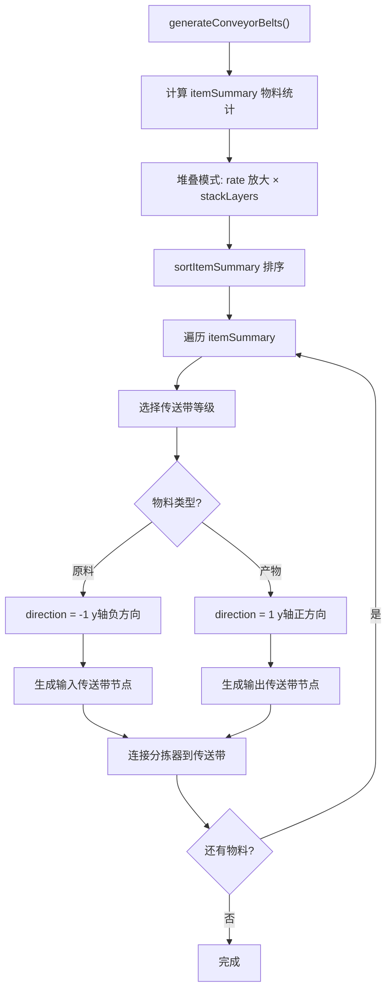

### 6.2 物料统计计算

```javascript
let itemSummary = {};

for (let subRecipe of this.recipe.subRecipes) {
    let extra_rate = 1;
    if (this.recipe.proliferator) {
        if (subRecipe.acceleratorMode === 0) {
            extra_rate += itemMap[this.recipe.proliferator].extra_rate;
        } else if (subRecipe.acceleratorMode === 1) {
            extra_rate += itemMap[this.recipe.proliferator].accelerate;
        }
    }
    
    // 处理输出
    for (let outputItem of subRecipe.output) {
        let outputRate = 0;
        let fromBuildingNum = 0;
        
        if (subRecipe.input === null) {
            outputRate = outputItem.rate;  // 原料
        } else {
            fromBuildingNum = subRecipe.building.num;
            outputRate = outputItem.rate * 
                buildingMap[subRecipe.building.name].productionSpeed * 
                subRecipe.building.num * extra_rate;
        }
        
        if (itemSummary[outputItem.name]) {
            itemSummary[outputItem.name].fromBuildingNum += fromBuildingNum;
            itemSummary[outputItem.name].rate += outputRate;
        } else {
            itemSummary[outputItem.name] = {
                rate: outputRate,
                fromBuildingNum: fromBuildingNum,
                toBuildingNum: 0,
            };
        }
    }
    
    // 处理输入
    for (let inputItem of subRecipe.input) {
        let toBuildingNum = subRecipe.building.num;
        
        if (itemSummary[inputItem.name]) {
            itemSummary[inputItem.name].toBuildingNum += toBuildingNum;
            itemSummary[inputItem.name].needProliferator = subRecipe.acceleratorMode !== -1;
        } else {
            itemSummary[inputItem.name] = {
                rate: 0,
                inputRate: inputItem.rate * ...,
                fromBuildingNum: 0,
                toBuildingNum: toBuildingNum,
                needProliferator: subRecipe.acceleratorMode !== -1,
            };
        }
    }
}
```

### 6.3 物料排序规则

**代码位置**: `blueprint.js` L2200-2240\`

```javascript
sortItemSummary(itemSummary) {
    let newSummary = {};
    let proliferator = ['proliferatorMk3', 'proliferatorMk2', 'proliferatorMk1'];
    let outItem = ['refinedOil', 'hydrogen', 'graphene', 'deuterium'];
    
    // 1. 增产剂（取最高等级）
    for (let key in proliferator) {
        if (itemSummary[proliferator[key]] && itemSummary[proliferator[key]].toBuildingNum === 0) {
            newSummary[proliferator[key]] = itemSummary[proliferator[key]];
            break;
        }
    }
    
    // 2. 原料（fromBuildingNum === 0）
    for (let key in itemSummary) {
        if (itemSummary[key].fromBuildingNum === 0) {
            newSummary[key] = itemSummary[key];
        }
    }
    
    // 3. 终产物（toBuildingNum === 0）
    for (let key in itemSummary) {
        if (itemSummary[key].toBuildingNum === 0) {
            newSummary[key] = itemSummary[key];
        }
    }
    
    // 4. 多余产物（精炼油、氢、石墨烯、重氢）
    for (let key in outItem) {
        if (itemSummary[outItem[key]] &&
            itemSummary[outItem[key]].fromBuildingNum - itemSummary[outItem[key]].toBuildingNum > 0) {
            newSummary[outItem[key]] = itemSummary[outItem[key]];
        }
    }
    
    // 5. 其余中间产物
    for (let key in itemSummary) {
        if (itemSummary[key].toBuildingNum !== 0 && itemSummary[key].fromBuildingNum !== 0) {
            newSummary[key] = itemSummary[key];
        }
    }
    
    return newSummary;
}
```

### 6.4 传送带等级选择

```javascript
let conveyorBelt = buildingMap.conveyorBeltMk1;

if (this.config.onlyConveyorBeltMk3) {
    // 强制使用三级传送带
    conveyorBelt = buildingMap.conveyorBeltMK3;
} else if (item.rate >= conveyorBelt.transportSpeed) {
    if (item.rate === conveyorBelt.transportSpeed && this.config.upgradeConveyorBelt) {
        // 刚好满带且配置升级
        conveyorBelt = buildingMap.conveyorBeltMK3;
    } else if (item.rate > conveyorBelt.transportSpeed) {
        // 超过一级带运力
        conveyorBelt = buildingMap.conveyorBeltMK3;
    }
}

// 原料可以堆叠
let maxTransportSpeed = buildingMap.conveyorBeltMK3.transportSpeed;
if (item.fromBuildingNum === 0) {
    maxTransportSpeed = buildingMap.conveyorBeltMK3.transportSpeed * this.config.conveyorBeltStackLayer;
}
```

### 6.5 传送带节点生成

**代码位置**: `blueprint.js` L700-900\`

```javascript
newConveyor(conveyor, direction, inputData, outputData, parameters = null, needSprayCoater = false) {
    let nodeNum = 0;
    let buildingX = this.occupiedArea[this.occupiedArea.length - 1].x2 + 1;
    let buildingY = this.occupiedArea[this.occupiedArea.length - 2].y2;
    let buildingZ = 0;
    
    // 生成输入节点（原料方向）
    for (let i = 0; i < inputData.length; i++) {
        if (direction < 0) break;  // 输入带不需要处理input
        
        buildingY += 1;
        let node = this.newConveyorNode(
            { x: buildingX, y: buildingY, z: buildingZ },
            [0, 0],
            conveyor,
            this.buildingIndex + 2,
            1,
            null
        );
        this.buildings.push(node);
        nodeNum++;
        
        // 修改分拣器指向这个传送带节点
        for (let b of this.buildings) {
            if (inputData[i].includes(b.index)) {
                b.outputObjIdx = this.buildingIndex;
            }
        }
    }
    
    // 生成输出节点
    for (let i = 0; i < outputData.length; i++) {
        buildingY += 1;
        let node = this.newConveyorNode(
            { x: buildingX, y: buildingY, z: buildingZ },
            direction < 0 ? [180, 180] : [0, 0],
            conveyor,
            outputObjIdx,
            outputToSlot,
            nodeParameters
        );
        this.buildings.push(node);
        nodeNum++;
        
        // 修改分拣器指向这个传送带节点
        for (let b of this.buildings) {
            if (outputData[i].includes(b.index)) {
                b.inputObjIdx = this.buildingIndex;
                b.inputFromSlot = -1;
            }
        }
    }
    
    // 修复：outputData为空时终结最后一个节点
    if (direction > 0 && outputData.length === 0 && nodeNum > 0) {
        this.buildings[this.buildings.length - 1].outputObjIdx = -1;
        this.buildings[this.buildings.length - 1].outputToSlot = 0;
    }
}
```

### 6.6 堆叠模式分拣器分配

```javascript
// 堆叠模式：z=0 层每个传送带节点的分拣器在 cloneToStackLayers 后被克隆 stackLayers 倍
// 为保证克隆后每节点不超过 maxSorterNumOneBelt，z=0 层每节点只分配 floor(max/stackLayers) 个
const sortersPerNode = stackLayers > 1
    ? Math.max(2, Math.floor((this.config.maxSorterNumOneBelt - 1) / stackLayers))
    : this.config.maxSorterNumOneBelt;

// 例如：stackLayers=4, max=8 → z=0 每节点 floor(7/4)=1 个分拣器 → 克隆后 1×4=4 ≤ 8
// 注意：使用 originalNum 计算原料需求，而非 rate × stackLayers
```

***

## 7. 增产剂喷涂阶段

### 7.1 generateConveyorBeltsForSprayCoater() 流程

**代码位置**: `blueprint.js` L2734-2950\`

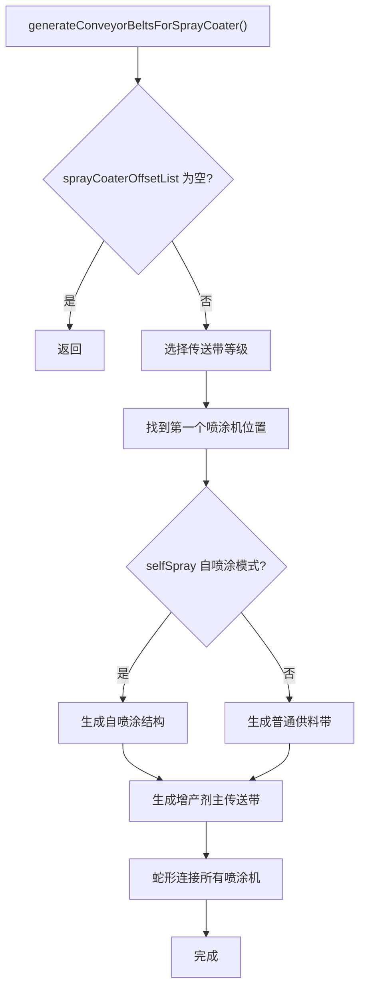

### 7.2 自喷涂结构生成

```javascript
if (this.config.selfSpray) {
    // 自喷涂结构：增产剂 → 喷涂机 → 喷涂后增产剂 → 生产带
    let selfSprayConveyorStartOffset = {
        x: firstSprayOffset.x,
        y: firstSprayOffset.y,
        z: firstSprayOffset.z,
    };
    
    // 根据建筑类型调整起始位置
    switch (this.lastProductionBuildingType) {
        case productionCategory.lab:
        case productionCategory.collider:
            selfSprayConveyorStartOffset.y += 2;
            break;
        case productionCategory.plant:
            selfSprayConveyorStartOffset.y += 1;
            break;
    }
    
    // 生成喷涂机
    this.buildings.push(this.newSprayCoater(
        { x: this.conveyorStartOffsetX - 1, y: selfSprayConveyorStartOffset.y + 4, z: 0 },
        [0, 0]
    ));
    
    // 生成自喷涂传送带网络（z=0和z=1两层）
    // z=0: 未喷涂增产剂输入
    // z=1: 喷涂后增产剂输出
    // ... 生成多个传送带节点
}
```

### 7.3 喷涂机蛇形连接

```javascript
let doneNum = 1;
let nowSpray = firstSprayOffset;
let direction = 1;

while (doneNum < this.sprayCoaterOffsetList.length) {
    // 同一行内连接
    for (let spray of this.sprayCoaterOffsetList) {
        if (spray.y === nowSpray.y) {
            if (direction === 1 && spray.x > nowSpray.x) {
                // x轴正向
                for (let x = nowSpray.x + 1; x <= spray.x; x++) {
                    this.buildings.push(this.newConveyorNode(
                        { x: x, y: nowSpray.y, z: 1 },
                        [0, 0], conveyor, this.buildingIndex + 2, 1, null
                    ));
                }
                nowSpray = spray;
                doneNum++;
            } else if (direction === -1 && spray.x < nowSpray.x) {
                // x轴负向
                for (let x = nowSpray.x - 1; x >= spray.x; x--) {
                    this.buildings.push(this.newConveyorNode(
                        { x: x, y: nowSpray.y, z: 1 },
                        [0, 0], conveyor, this.buildingIndex + 2, 1, null
                    ));
                }
                nowSpray = spray;
                doneNum++;
            }
        }
    }
    
    // 跨行连接（蛇形）
    for (let delta = 2; !findNext; delta += 2) {
        for (let spray of this.sprayCoaterOffsetList) {
            if (spray.y === nowSpray.y - delta) {
                // 生成转向节点
                // ...
                findNext = true;
                break;
            }
        }
    }
    
    direction = -direction;  // 反向
}
```

***

## 8. 建筑堆叠阶段

### 8.1 cloneToStackLayers() 完整流程

**代码位置**: `blueprint.js` L2034-2198\`

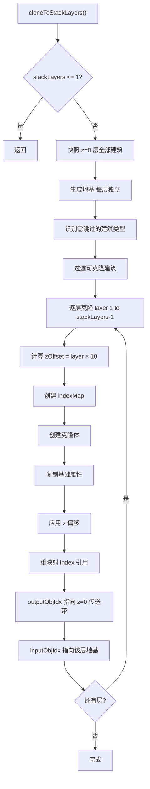

### 8.2 建筑类型过滤规则

```javascript
// 识别需跳过的建筑类型
const labItemIds = new Set([
    buildingMap.lab.itemId,           // 2901
    buildingMap["自演化研究站"].itemId, // 2902
]);
const beltItemIds = new Set([2001, 2002, 2003]);  // 传送带
const sprayCoaterItemId = buildingMap.sprayCoater.itemId;  // 2313

// 收集研究站索引
const labIndices = new Set();
for (const b of baseBuildings) {
    if (labItemIds.has(b.itemId)) {
        labIndices.add(b.index);
    }
}

// 过滤出需要克隆的建筑
const cloneableBuildings = baseBuildings.filter((b) => {
    // 排除 Lab
    if (labItemIds.has(b.itemId)) return false;
    // 排除连接到 Lab 的分拣器
    if (labIndices.has(b.inputObjIdx) || labIndices.has(b.outputObjIdx)) return false;
    // 排除传送带
    if (beltItemIds.has(b.itemId)) return false;
    // 排除喷涂机
    if (b.itemId === sprayCoaterItemId) return false;
    return true;
});
```

### 8.3 Index引用重映射

```javascript
for (let layer = 1; layer < stackLayers; layer++) {
    const zOffset = layer * 10;
    
    // 预分配index映射表
    const indexMap = new Map();
    let nextIndex = this.buildingIndex + 1;
    for (const base of cloneableBuildings) {
        indexMap.set(base.index, nextIndex);
        nextIndex++;
    }
    
    // 创建克隆体
    for (const base of cloneableBuildings) {
        const clone = this.getBuildingTemplate();
        
        // 复制基础属性
        clone.itemId = base.itemId;
        clone.modelIndex = base.modelIndex;
        clone.recipeId = base.recipeId;
        clone.filterId = base.filterId;
        // ...
        
        // 应用z偏移
        clone.localOffset = base.localOffset.map((o) => ({
            x: o.x,
            y: o.y,
            z: (o.z || 0) + zOffset,
        }));
        
        // index引用重映射
        if (indexMap.has(base.outputObjIdx)) {
            // 指向同层克隆分拣器
            clone.outputObjIdx = indexMap.get(base.outputObjIdx);
        } else {
            // 指向 z=0 传送带（保持原值）
            clone.outputObjIdx = base.outputObjIdx;
        }
        
        if (base.inputObjIdx === -1) {
            // 指向该层对应的地基
            clone.inputObjIdx = foundationStartIndex + layer;
        } else if (indexMap.has(base.inputObjIdx)) {
            // 指向同层克隆设备
            clone.inputObjIdx = indexMap.get(base.inputObjIdx);
        } else {
            clone.inputObjIdx = base.inputObjIdx;
        }
        
        this.buildings.push(clone);
    }
}
```

### 8.4 各建筑类型处理规则

| 建筑类型               | itemId    | init()缩减  | 克隆到高层     | z>0 inputObjIdx |
| ------------------ | --------- | --------- | --------- | --------------- |
| 制造台/熔炉/化工厂/精炼厂/对撞机 | 2302-2317 | ✅ num÷N   | ✅         | 地基              |
| **研究站（Lab）**       | 2901/2902 | **❌ 不缩减** | **❌ 不克隆** | —               |
| 分拣器（非Lab）          | 2011-2014 | —         | ✅         | indexMap        |
| 分拣器（Lab）           | 2011-2014 | —         | ❌         | —               |
| 传送带                | 2001-2003 | —         | ❌         | —               |
| 电力感应塔              | 2201      | —         | ✅         | 地基              |
| 喷涂机                | 2313      | —         | ❌         | —               |
| 地基                 | 1131      | —         | —         | -1              |

***

## 9. 蓝图编码阶段

### 9.1 toStr() 编码流程

**代码位置**: `blueprint.js` L3200-3700\`

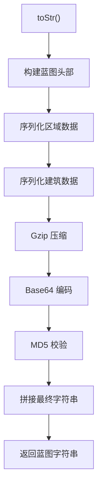

### 9.2 蓝图字符串格式

```
BLUEPRINT:0,<layout>,<icons>,<type>,<time>,<gameVersion>,<shortDesc>,<desc>"<compressed_data>"<md5>
```

**示例**：

```
BLUEPRINT:0,10,6001,6002,6003,6004,6005,6006,0,16387064000000000,"0.9.26.13026","宇宙矩阵蓝图",""H4sIAAAAAAAAC+2dZ5AUVR...="
```

### 9.3 建筑数据序列化

```javascript
// 序列化建筑
function exportBuilding(w, building, allAssemblers) {
    w.setInt32(building.index);
    w.setUint8(building.areaIndex);
    // localOffset
    w.setFloat32(building.localOffset[0].x);
    w.setFloat32(building.localOffset[0].y);
    w.setFloat32(building.localOffset[0].z);
    w.setFloat32(building.localOffset[1].x);
    w.setFloat32(building.localOffset[1].y);
    w.setFloat32(building.localOffset[1].z);
    // yaw
    w.setInt16(building.yaw[0]);
    w.setInt16(building.yaw[1]);
    // itemId, modelIndex
    w.setInt16(building.itemId);
    w.setInt16(building.modelIndex);
    // 连接信息
    w.setInt32(building.outputObjIdx);
    w.setInt32(building.inputObjIdx);
    w.setInt8(building.outputToSlot);
    w.setInt8(building.inputFromSlot);
    w.setInt8(building.outputFromSlot);
    w.setInt8(building.inputToSlot);
    w.setInt8(building.outputOffset);
    w.setInt8(building.inputOffset);
    // 配方和过滤器
    w.setInt16(building.recipeId);
    w.setInt16(building.filterId);
    // 参数
    exportParameters(w, building, allAssemblers);
}
```

### 9.4 参数序列化规则

| 建筑类型 | 参数内容                          | 序列化方式     |
| ---- | ----------------------------- | --------- |
| 传送带  | iconId, count                 | 2 × Int32 |
| 分拣器  | length                        | 1 × Int32 |
| 研究站  | researchMode, acceleratorMode | 2 × Int32 |
| 制造台  | acceleratorMode               | 1 × Int32 |
| 物流站  | 物流参数                          | 复杂结构      |

***

## 10. 配置参数详解

### 10.1 完整配置项

```javascript
const config = {
    // 核心参数
    stackLayers: 1,              // 建筑堆叠层数（1=不堆叠）
    maxLabLayers: 15,            // 研究站最大垂直堆叠层数
    
    // 传送带设置
    maxSorterNumOneBelt: 8,      // 单传送带最大分拣器数量
    conveyorBeltStackLayer: 4,   // 传送带物品堆叠层数
    onlyConveyorBeltMk3: false,  // 仅使用三级传送带
    onlyConveyorBeltMk3Downgrade: false,  // 三级传送带降级（28/min）
    upgradeConveyorBelt: false,  // 360/min时使用三级传送带
    
    // 布局设置
    x_y_ratio: 2,                // 蓝图长宽比
    compactLayout: false,        // 紧凑布局（适合赤道带）
    
    // 分拣器设置
    onlySorterMk3: false,        // 仅使用三级分拣器
    useSorterMk4: false,         // 使用集装分拣器
    
    // 增产剂设置
    selfSpray: true,             // 自喷涂模式
    
    // 电力设置
    generateTeslaTower: true,    // 生成电力感应塔
    teslaTowerInterval: 15,      // 电塔间隔
    teslaTowerLineInterval: 1,   // 电塔行间隔
};
```

### 10.2 配置影响分析

| 配置项                 | 影响范围                                                           | 说明            |
| ------------------- | -------------------------------------------------------------- | ------------- |
| stackLayers         | init(), generateConveyorBelts(), cloneToStackLayers()          | 控制建筑垂直堆叠层数    |
| maxLabLayers        | newProductionBuilding()                                        | 研究站单列最大堆叠数    |
| maxSorterNumOneBelt | generateConveyorBelts()                                        | 每个传送带节点最大分拣器数 |
| onlyConveyorBeltMk3 | generateConveyorBelts(), generateConveyorBeltsForSprayCoater() | 强制使用三级传送带     |
| x\_y\_ratio         | calculateBlueprintArea()                                       | 蓝图长宽比         |
| compactLayout       | calculateBuildingArea()                                        | 精炼厂/对撞机紧凑布局   |
| selfSpray           | generateConveyorBeltsForSprayCoater()                          | 增产剂自喷涂        |

***

## 11. 关键算法与边界处理

### 11.1 浮点精度处理

```javascript
const zero = 0.0000000001;  // 精度阈值

// 比较浮点数
if (item.rate - totalDoneRate > zero) {
    // 继续处理
}

// 安全退出防止死循环
if (item.fromBuildingNum !== 0 && this.sorters[itemName].output.length === 0) {
    break;
}
```

### 11.2 分拣器溢出处理

```javascript
// 研究站层数过高时追加额外分拣器
if (buildingMap[subRecipe.building.name].category === productionCategory.lab && 
    actual_rate > sorter.sortingSpeed) {
    // 第一个分拣器: sortingSpeed
    // 第二个分拣器: rate - sortingSpeed
}
```

### 11.3 传送带粘连修复

```javascript
// outputData为空时，终结最后一个节点
if (direction > 0 && outputData.length === 0 && nodeNum > 0) {
    this.buildings[this.buildings.length - 1].outputObjIdx = -1;
    this.buildings[this.buildings.length - 1].outputToSlot = 0;
}

// 更新占地区域X坐标，防止下一条传送带粘连
if (buildingX > 0 && this.occupiedArea.length > 0) {
    this.occupiedArea[this.occupiedArea.length - 1].x2 = buildingX;
}
```

***

## 附录A：调用示例

```javascript
// 完整调用示例
const recipe = getRecipe();  // 从data.js获取配方数据

const config = {
    stackLayers: 4,
    maxLabLayers: 15,
    maxSorterNumOneBelt: 8,
    onlyConveyorBeltMk3: true,
    selfSpray: true,
};

const blueprint = new Blueprint(
    '量子芯片产线',
    [1305, 0, 0, 0, 0],  // iconId数组
    recipe,
    config
);

blueprint.init();
blueprint.generateBuildings();
blueprint.generateConveyorBelts();

if (recipe.proliferator) {
    blueprint.generateConveyorBeltsForSprayCoater();
}

if (config.stackLayers > 1) {
    blueprint.cloneToStackLayers();
}

const blueprintString = blueprint.toStr();
navigator.clipboard.writeText(blueprintString);
```

***

## 附录B：关键常量速查

### 建筑ID速查表

| 建筑类型      | itemId | modelIndex | 名称        |
| --------- | ------ | ---------- | --------- |
| 传送带Mk.I   | 2001   | 35         | 传送带       |
| 传送带Mk.III | 2003   | 37         | 极速传送带     |
| 分拣器Mk.I   | 2011   | 41         | 分拣器       |
| 分拣器Mk.III | 2013   | 43         | 极速分拣器     |
| 集装分拣器     | 2014   | 483        | 集装分拣器     |
| 电弧熔炉      | 2302   | 62         | 电弧熔炉      |
| 制作台Mk.III | 2305   | 67         | 制作台Mk.III |
| 喷涂机       | 2313   | 120        | 喷涂机       |
| 矩阵研究站     | 2901   | 70         | 矩阵研究站     |

### 传送带速度速查表

| 传送带    | transportSpeed | 运力/min |
| ------ | -------------- | ------ |
| Mk.I   | 6              | 360    |
| Mk.II  | 12             | 720    |
| Mk.III | 30             | 1800   |

### 分拣器速度速查表

| 分拣器    | sortingSpeed | 运力/min |
| ------ | ------------ | ------ |
| Mk.I   | 1.5          | 90     |
| Mk.II  | 3            | 180    |
| Mk.III | 6            | 360    |
| 集装分拣器  | 120          | 7200   |

### 函数位置速查表

| 函数名                                 | 行号    | 功能     |
| ----------------------------------- | ----- | ------ |
| mapRecipeID                         | L600  | 配方ID映射 |
| calculateBlueprintArea              | L930  | 蓝图面积计算 |
| newProductionBuilding               | L1520 | 生成生产建筑 |
| init                                | L2000 | 初始化    |
| cloneToStackLayers                  | L2034 | 建筑堆叠   |
| generateConveyorBelts               | L2240 | 传送带网络  |
| generateBuildings                   | L2690 | 建筑生成   |
| generateConveyorBeltsForSprayCoater | L2700 | 增产剂系统  |
| toStr                               | L3200 | 蓝图编码   |

***

**文档版本**：v3.0\
**最后更新**：2025年\
**维护者**：DSQ 计算器团队

