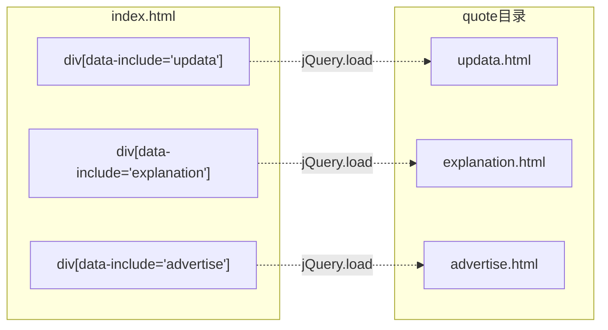
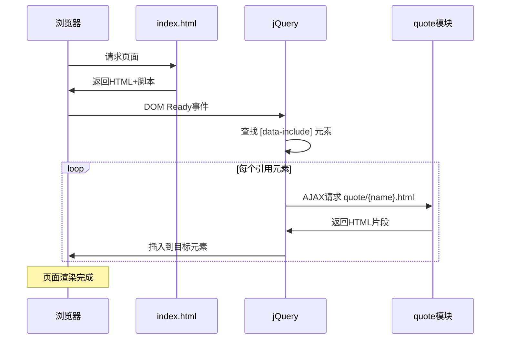
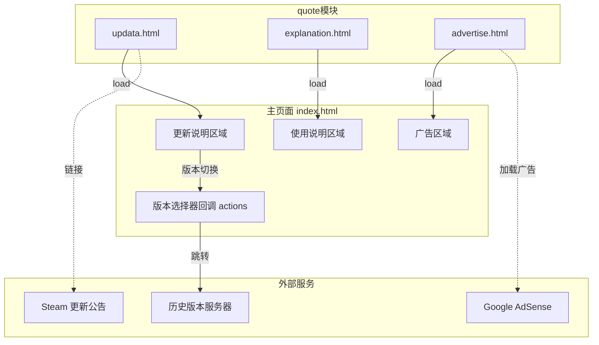
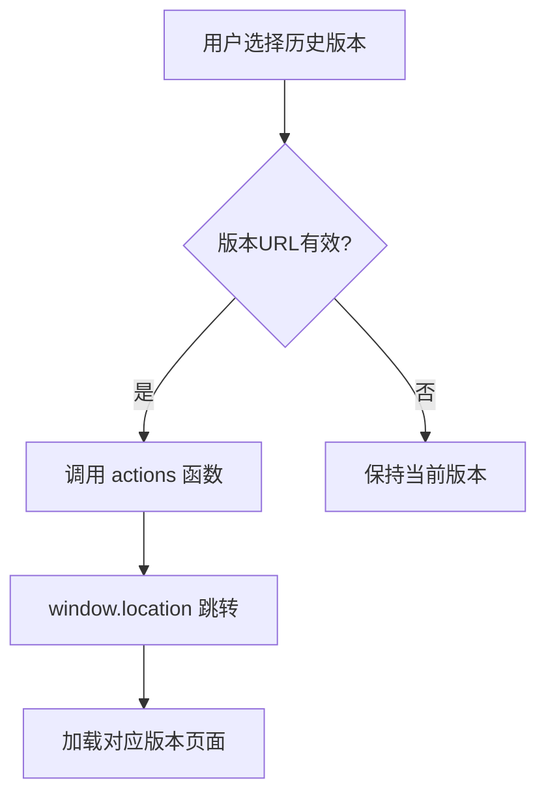
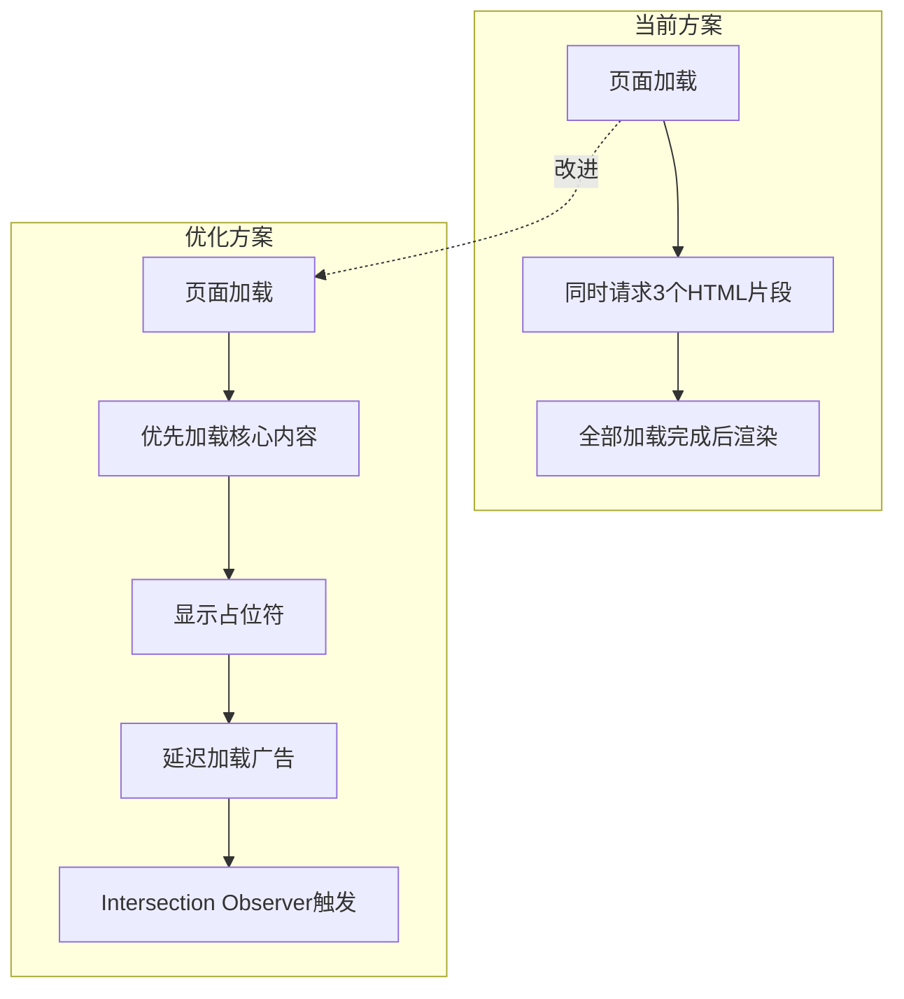

# quote 模块说明文档

## 目录

- [1. 模块概述](#1-模块概述)
- [2. 文件结构](#2-文件结构)
- [3. 功能模块详解](#3-功能模块详解)
  - [3.1 广告模块 (advertise.html)](#31-广告模块-advertisehtml)
  - [3.2 使用说明 (explanation.html)](#32-使用说明-explanationhtml)
  - [3.3 更新日志 (updata.html)](#33-更新日志-updatahtml)
- [4. 模块引用机制](#4-模块引用机制)
- [5. 内容加载流程](#5-内容加载流程)
- [6. 模块间交互关系](#6-模块间交互关系)
- [7. 性能优化与问题修复建议](#7-性能优化与问题修复建议)

---

## 1. 模块概述

quote 模块是戴森球计划量产量化计算器的**内容引用模块**，采用 HTML 片段化设计，通过 jQuery 的 `load()` 方法动态加载到主页面中。

**设计目的**：
- 将频繁更新的内容（如更新日志、使用说明）与主页面分离
- 便于单独维护和更新各部分内容
- 减少主页面代码体积，提高可维护性

---

## 2. 文件结构

```
quote/
├── advertise.html    # 广告内容片段
├── explanation.html  # 使用说明片段
└── updata.html       # 更新日志片段
```

**文件特点**：
- 所有文件都是 **HTML 片段**，不是完整的 HTML 文档
- 没有 `<html>`, `<head>`, `<body>` 等文档结构标签
- 直接包含需要插入的内容元素

---

## 3. 功能模块详解

### 3.1 广告模块 (advertise.html)

**功能**：展示 Google AdSense 广告

**内容结构**：
```html
<!-- Google AdSense 异步脚本 -->
<script async src="https://pagead2.googlesyndication.com/pagead/js/adsbygoogle.js?client=ca-pub-8764893239422253"></script>

<!-- 广告单元容器 -->
<ins class="adsbygoogle" 
     data-ad-client="ca-pub-8764893239422253"
     data-ad-slot="5984966025"
     data-ad-format="auto"
     data-full-width-responsive="true">
</ins>

<!-- 广告初始化 -->
<script>(adsbygoogle = window.adsbygoogle || []).push({});</script>
```

**配置参数**：
| 参数 | 值 | 说明 |
|------|-----|------|
| client | ca-pub-8764893239422253 | AdSense 发布商 ID |
| slot | 5984966025 | 广告单元 ID |
| format | auto | 自动适应广告格式 |
| full-width-responsive | true | 响应式全宽显示 |

### 3.2 使用说明 (explanation.html)

**功能**：提供计算器的使用指南

**内容要点**：
1. **输入说明**：输入每分钟需求的物品数量
2. **传送带参考数据**：
   - 传送带：360/min
   - 高速传送带：720/min
   - 极速传送带：1800/min
3. **操作功能**：
   - 标注：对物品进行颜色标记
   - 多配方：同时计算多个配方
   - 排除：排除某物品的计算
4. **默认设置**：
   - 采矿机：6个矿脉
   - 大型采矿机：20个矿脉
5. **参数配置项**：临界光子、原油效率、分馏塔、轨道采集等
6. **蓝图生成说明**：支持熔炉、制造台、精炼厂、对撞机、化工厂、研究站

**联系方式**：
- 作者 QQ：122474363
- GitHub：https://github.com/122474363/DSQ
- 交流群：53309723

### 3.3 更新日志 (updata.html)

**功能**：显示版本更新信息和版本切换

**内容结构**：

```html
<!-- 故障排除提示（红色） -->
<font color="#FF6633">
    使用【修复计算空白】可修复计算显示空白的情况！
    使用【CTRL】+【F5】即可刷新缓存看到当前页面最新版本！
    使用【CTRL】+【SHIFT】+【DEL】即可删除所有缓存修复计算器异常！
</font>

<!-- 更新时间（蓝色） -->
<font color="#0000FF">
    更新时间：2024年2月3日03:19:05
</font>

<!-- 版本选择器 -->
<select id="furnace" onchange="actions(this)">
    <option value="">—当前版本:最新版[0.10.29.28154]—</option>
    <option value="https://www.svlik.com/t/dsq/0.10.28.20729">0.10.28.20729</option>
    <!-- 更多历史版本 -->
</select>

<!-- 更新详情链接 -->
<a href="Steam更新公告链接">当前版本更新详情</a>
```

**支持的历史版本**：
| 版本号 | URL |
|--------|-----|
| 0.10.28.20729 | https://www.svlik.com/t/dsq/0.10.28.20729 |
| 0.9.27.14546 | https://www.svlik.com/t/dsq/0.9.27.14546 |
| 0.9.26.12891 | https://www.svlik.com/t/dsq/0.9.26.12891 |
| 0.9.24.11240 | https://www.svlik.com/t/dsq/0.9.24.11240 |
| 0.9.24.11182 | https://www.svlik.com/t/dsq/0.9.24.11182 |
| 0.8.23.9989 | https://www.svlik.com/t/dsq/0.8.23.9989 |
| 0.8.22.8915 | https://www.svlik.com/t/dsq/0.8.22.8915 |
| 0.7.18.6931 | https://www.svlik.com/t/dsq/0.7.18.6931 |

---

## 4. 模块引用机制



**引用代码实现**（位于 index.html 底部）：

```javascript
$(function () {
    var includes = $('[data-include]');
    jQuery.each(includes, function () {
        var file = 'quote/' + $(this).data('include') + '.html';
        $(this).load(file);
    });
});
```

---

## 5. 内容加载流程



---

## 6. 模块间交互关系



### 版本切换交互流程



---

## 7. 性能优化与问题修复建议

### 低风险高收益优化项

| 优先级 | 类型 | 问题描述 | 优化建议 | 改动范围 |
|--------|------|----------|----------|----------|
| 🔴 高 | 性能 | 广告脚本阻塞页面渲染 | 将 advertise.html 内容延迟加载或使用 Intersection Observer | advertise.html |
| 🔴 高 | 兼容性 | 使用已废弃的 `<font>` 标签 | 改用 CSS 类进行样式控制 | updata.html, explanation.html |
| 🟡 中 | SEO | 动态加载内容不利于搜索引擎收录 | 考虑服务端渲染或预渲染静态内容 | 架构调整 |
| 🟡 中 | 用户体验 | 内容加载无加载状态提示 | 添加 loading 占位符 | index.html |
| 🟡 中 | 代码 | select 的 id="furnace" 命名不语义化 | 重命名为 `id="versionSelector"` | updata.html |
| 🟢 低 | 维护性 | 更新日志和版本信息硬编码 | 改为从 JSON 配置文件读取 | updata.html |
| 🟢 低 | 安全 | 外部链接无 `rel="noopener"` | 添加安全属性防止钓鱼攻击 | explanation.html |

### 待修复问题清单

| 问题类型 | 描述 | 文件 | 修复方案 |
|----------|------|------|----------|
| 🐛 Bug | 文件名 `updata.html` 拼写错误 | updata.html | 应为 `update.html`（需同步修改引用） |
| ⚠️ 警告 | `<font>` 标签在 HTML5 中已废弃 | updata.html | 使用 `<span class="warning">` 替代 |
| ⚠️ 警告 | AdSense 脚本可能被广告拦截器阻止 | advertise.html | 添加广告加载失败的 fallback 提示 |
| 📝 建议 | 版本列表维护困难 | updata.html | 提取为配置文件，动态生成选项 |
| 📝 建议 | 无 404 错误处理 | index.html | 添加 load 失败回调处理 |
| 📝 建议 | 交流群链接过长 | explanation.html | 使用短链接服务或直接群号 |

### 代码优化示例

**当前代码（updata.html）**：
```html
<font color="#FF6633">提示内容</font>
```

**优化后**：
```html
<style>
  .tip-warning { color: #FF6633; }
  .tip-info { color: #0000FF; }
</style>
<span class="tip-warning">提示内容</span>
```

### 加载机制优化建议



### 快速修复优先列表

1. **【立即修复】** 将 `<font>` 标签替换为语义化 HTML + CSS
2. **【立即修复】** 为外部链接添加 `rel="noopener noreferrer"`
3. **【短期优化】** 添加内容加载状态指示器
4. **【短期优化】** 广告脚本延迟加载
5. **【中期重构】** 版本信息配置化
6. **【长期规划】** 考虑预渲染方案

### 安全性建议

```html
<!-- 修复前 -->
<a href="https://github.com/122474363/DSQ" target="_blank">Github</a>

<!-- 修复后 -->
<a href="https://github.com/122474363/DSQ" 
   target="_blank" 
   rel="noopener noreferrer">Github</a>
```

### 文件结构优化建议

```
quote/
├── update.html           # 修正拼写
├── explanation.html
├── advertise.html
├── config/
│   └── versions.json     # 版本配置（新增）
└── localDocs/
    └── 模块说明.md        # 本文档
```

**versions.json 配置示例**：
```json
{
  "current": {
    "version": "0.10.29.28154",
    "updateTime": "2024-02-03T03:19:05",
    "steamNewsUrl": "https://store.steampowered.com/news/app/1366540/view/..."
  },
  "history": [
    {
      "version": "0.10.28.20729",
      "url": "https://www.svlik.com/t/dsq/0.10.28.20729"
    }
  ]
}
```
